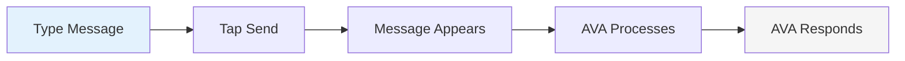
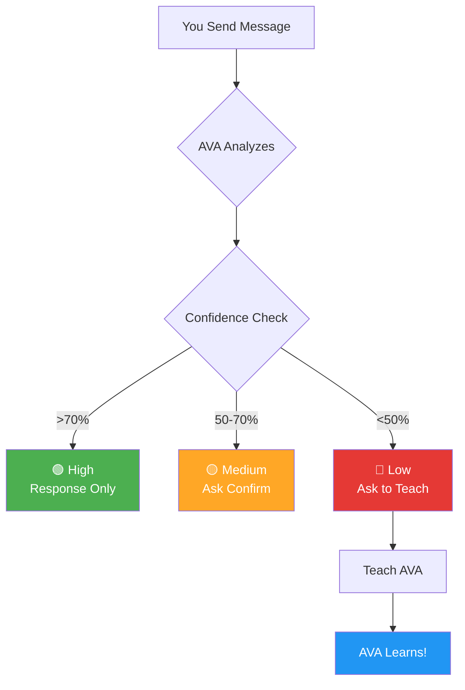
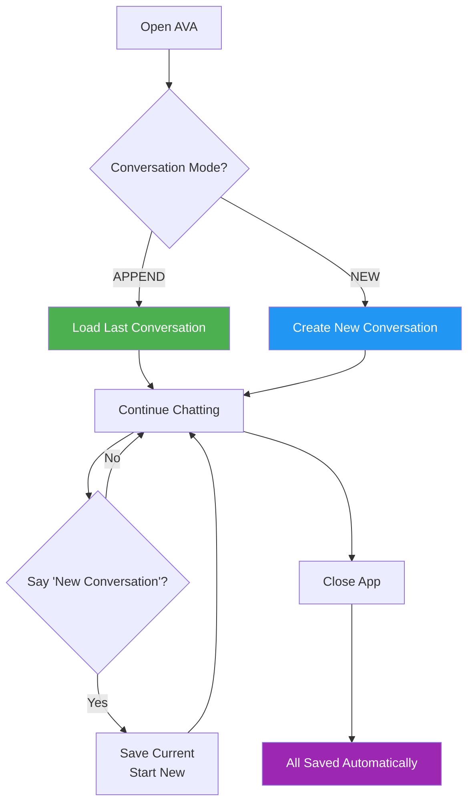

# AVA AI - User Manual

**Version**: 1.0.0
**Last Updated**: October 29, 2025
**For AVA AI App Version**: 1.0+

---

## Welcome to AVA AI! 👋

AVA (Augmented Voice Assistant) is your personal AI assistant that learns from you. Unlike other assistants, AVA runs entirely on your device, keeping your conversations private while getting smarter with every interaction.

This manual will help you get the most out of AVA AI, whether you're a first-time user or looking to master advanced features.

---

## Table of Contents

1. [Getting Started](#getting-started)
2. [Basic Features](#basic-features)
3. [Understanding Confidence Badges](#understanding-confidence-badges)
4. [Teaching AVA](#teaching-ava)
5. [Managing Conversations](#managing-conversations)
6. [Settings](#settings)
7. [Tips & Tricks](#tips--tricks)
8. [Troubleshooting](#troubleshooting)
9. [Glossary](#glossary)
10. [FAQ](#faq)

---

## Getting Started

### Installation

#### Requirements
- **Android Device**: Android 7.0 (Nougat) or newer
- **Storage**: At least 100 MB of free space
- **RAM**: 2 GB minimum (3 GB+ recommended for best performance)

#### Installing AVA AI

1. **Download the App**
   - Open Google Play Store
   - Search for "AVA AI"
   - Tap "Install"
   - Wait for download to complete

2. **Grant Permissions**

   When you first open AVA, you'll be asked for these permissions:

   - **Storage Access**: For saving conversations and learning data on your device
   - **Microphone** (optional): For voice input

   **Note**: All your data stays on your device. AVA doesn't send anything to the cloud unless you enable cloud sync in settings.

### First Launch

#### What You'll See

When you open AVA for the first time:

```
┌─────────────────────────────────────┐
│  AVA AI                       ⋮     │  ← Top Bar
├─────────────────────────────────────┤
│                                     │
│                                     │
│      No messages yet.               │
│      Say hello to AVA!              │  ← Empty State
│                                     │
│                                     │
├─────────────────────────────────────┤
│ [Type a message...        ] [ ➤ ]  │  ← Input Area
└─────────────────────────────────────┘
```

#### Your First Message

1. **Tap the text field** at the bottom
2. **Type** "Hello AVA"
3. **Tap the send button** (➤)
4. Watch AVA respond!

**Example First Conversation:**

```
You: Hello AVA
AVA: Hi! I'm AVA, your personal assistant. I'm here to help!
     🟢 92%
```

The green badge (🟢 92%) shows AVA's confidence in her response. We'll explain this in detail later!

### Understanding the Interface

Let's break down what you see on the main screen:

```
┌─────────────────────────────────────┐
│  1. AVA AI              2. [⋮]      │  Top Bar
├─────────────────────────────────────┤
│                                     │
│  3. Messages Area                   │
│     ┌────────────────────┐          │
│     │ Turn on lights    │ YOU      │
│     └────────────────────┘          │
│                                     │
│          ┌──────────────────────┐   │
│     AVA │ I'll control lights. │   │
│          │  🟢 85%             │   │
│          └──────────────────────┘   │
│                                     │
├─────────────────────────────────────┤
│ 4. [Type a message...   ] 5. [➤]   │  Input Bar
└─────────────────────────────────────┘
```

**Components:**

1. **App Title**: Shows "AVA AI"
2. **Menu Button**: Access settings and history
3. **Messages Area**: Where your conversation appears
4. **Input Field**: Type your messages here
5. **Send Button**: Sends your message (turns blue when you type)

---

## Basic Features

### Sending Messages

#### Text Messages

**Step-by-Step:**

1. Tap the input field at the bottom
2. Type your message
3. Tap the send button (➤)
4. Your message appears on the right in blue
5. AVA's response appears on the left in gray

**Visual Flow:**



#### Voice Input

**Coming Soon!** Voice input with live transcription will be available in a future update.

### Reading Messages

#### Message Layout

**Your Messages (Right Side):**
```
                    ┌────────────────────┐
                    │ Turn on the lights│  ← Your text
                    └────────────────────┘
                         2m ago             ← Timestamp
```

**AVA's Messages (Left Side):**
```
┌──────────────────────────┐
│ I'll control the lights. │  ← AVA's text
│ 🟢 85%                   │  ← Confidence badge
└──────────────────────────┘
     Just now                  ← Timestamp
```

#### Understanding Timestamps

AVA shows when messages were sent in an easy-to-read format:

- **"Just now"** - Less than 1 minute ago
- **"2m ago"** - A few minutes ago
- **"1h ago"** - Within the last hour
- **"Yesterday 3:15 PM"** - Yesterday with time
- **"Jan 15, 3:15 PM"** - Older messages with date

### Scrolling Through Messages

- **Scroll up** to see older messages
- **Scroll down** to see newer messages
- AVA **auto-scrolls** to show new messages automatically

---

## Understanding Confidence Badges

### What Are Confidence Badges?

Every time AVA responds, she shows you how confident she is that she understood you correctly. This is shown as a colored badge with a percentage.

### The Three Confidence Levels

#### 🟢 High Confidence (70%+)

```
┌──────────────────────────┐
│ I'll turn on the lights. │
│ 🟢 85%                   │  ← Green badge
└──────────────────────────┘
```

**What it means:**
- AVA is very confident she understood you
- No action needed - AVA knows what you want!

**What you see:**
- Green badge (🟢)
- Percentage only
- No buttons

#### 🟡 Medium Confidence (50-70%)

```
┌────────────────────────────────┐
│ Did you want me to check the  │
│ weather?                       │
│ 🟡 65%                         │  ← Yellow badge
│ [Confirm?]                     │  ← Confirm button
└────────────────────────────────┘
```

**What it means:**
- AVA thinks she understood, but isn't sure
- You can confirm if she got it right

**What you see:**
- Yellow/orange badge (🟡)
- Percentage
- "Confirm?" button

**What to do:**
- If AVA got it right: Tap "Confirm?" (optional)
- If AVA got it wrong: Long-press and teach her

#### 🔴 Low Confidence (<50%)

```
┌────────────────────────────────┐
│ I'm not sure I understood.    │
│ Would you like to teach me?    │
│ 🔴 35%                         │  ← Red badge
│ [Teach AVA]                    │  ← Teach button
└────────────────────────────────┘
```

**What it means:**
- AVA doesn't understand what you want
- She's asking you to teach her

**What you see:**
- Red badge (🔴)
- Percentage
- "Teach AVA" button (prominent)

**What to do:**
- Tap "Teach AVA" to help her learn
- See the [Teaching AVA](#teaching-ava) section below

### Visual Guide: Confidence Flow



### Why Confidence Matters

**Privacy First:**
- AVA learns **only from you**
- No cloud training required
- Your data stays on your device

**Getting Smarter:**
- The more you teach AVA, the higher her confidence becomes
- High confidence means AVA knows your preferences
- You're building a personalized assistant!

### Automatic Learning (Behind the Scenes)

When AVA doesn't understand something (low confidence), she uses her on-device AI brain to figure out what you meant. If the AI successfully understands your request, AVA **automatically learns** from that interaction!

**How it works:**

```
┌─────────────────┐     ┌─────────────────┐     ┌─────────────────┐
│ You: "hello ava"│────▶│ AVA: "Hmm, not  │────▶│ AI Brain helps  │
│                 │     │ sure..." (35%)  │     │ AVA understand  │
└─────────────────┘     └─────────────────┘     └────────┬────────┘
                                                         │
                        ┌─────────────────┐              │
                        │ Next time:      │◀─────────────┘
                        │ "hello ava"     │
                        │ = 95% confident │  AVA learned!
                        └─────────────────┘
```

**What this means for you:**
- AVA gets smarter automatically over time
- Even without explicit teaching, she learns from your patterns
- Battery usage improves as she learns (less AI needed)
- Responses get faster as she recognizes your phrases

**Note:** This automatic learning happens only when AVA's AI is confident it understood correctly. You can always use "Teach AVA" to correct or reinforce her learning.

---

## Teaching AVA

Teaching AVA is the secret to making her truly yours. Every time you teach her, she gets better at understanding what you want.

### When Should You Teach AVA?

#### Automatic Prompts (Low Confidence)

AVA will ask you to teach her when she's not confident:

```
┌────────────────────────────────┐
│ I'm not sure I understood.    │
│ Would you like to teach me?    │
│ 🔴 35%                         │
│ [Teach AVA]                    │  ← Tap this!
└────────────────────────────────┘
```

**When this happens:**
1. Tap the "Teach AVA" button
2. Follow the teaching flow (explained below)

#### Manual Teaching (Any Message)

You can teach AVA from **any message**, even if she was confident:

```
You: Set a timer for 10 minutes
AVA: I'll set an alarm.
     🟢 85%
```

**If AVA misunderstood:**
1. **Long-press** on AVA's message
2. A menu appears with "Teach AVA this"
3. Tap to start teaching

**Why teach high-confidence mistakes?**
- Prevents AVA from learning wrong patterns
- Fixes mistakes before they become habits
- Makes AVA more accurate over time

### How to Teach AVA: Step-by-Step

#### The Teaching Screen

When you tap "Teach AVA", you'll see this screen:

```
┌─────────────────────────────────────┐
│ Teach AVA                      [✕]  │  ← Header
├─────────────────────────────────────┤
│                                     │
│ What you said:                      │
│ ┌─────────────────────────────────┐ │
│ │ Turn on the lights             │ │  ← Your original message
│ └─────────────────────────────────┘ │
│                                     │
│ What did you mean?                  │
│ ┌─────────────────────────────────┐ │
│ │ Select intent         ▼         │ │  ← Dropdown menu
│ └─────────────────────────────────┘ │
│                                     │
│ [Teach AVA]                         │  ← Submit button
│                                     │
│ AVA will learn from this example    │
│ and improve her responses over time.│
└─────────────────────────────────────┘
```

#### Step 1: Review Your Message

The top section shows what you said. This is read-only - you can't change it.

#### Step 2: Choose the Correct Intent

Tap the dropdown menu to see available options:

**Built-in Intents:**
- Control Lights
- Control Temperature
- Check Weather
- Show Time
- Set Alarm
- Set Reminder
- Show History
- New Conversation
- Teach AVA

**Your Custom Intents:**
- Any intents you've taught AVA before
- Shows below built-in intents

**Create New Intent:**
- "+ Create new intent" at the bottom
- For teaching completely new commands

#### Step 3: Select or Create Intent

**Option A: Choose Existing Intent**

1. Scroll through the list
2. Tap the intent that matches what you meant
3. The dropdown closes
4. Tap "Teach AVA" button

**Option B: Create New Intent**

1. Scroll to bottom
2. Tap "+ Create new intent"
3. A text field appears
4. Type your custom intent name (e.g., "play_music", "order_pizza")
5. Tap "Teach AVA" button

**Naming Your Intent:**
- Use lowercase letters
- Separate words with underscores (\_)
- Be descriptive but concise
- Examples: `play_music`, `check_calendar`, `order_food`

#### Step 4: Submit

1. Make sure you've selected or created an intent
2. Tap the "Teach AVA" button at the bottom
3. You'll see a confirmation message
4. The teaching screen closes
5. AVA has learned!

### Teaching Examples

#### Example 1: Teaching a Built-in Intent

**Your message:** "What's the temperature outside?"

**AVA's response:**
```
I'm not sure I understood. Would you like to teach me?
🔴 38%
```

**Teaching Flow:**
1. Tap "Teach AVA"
2. See: "What you said: What's the temperature outside?"
3. Open dropdown menu
4. Select "Check Weather"
5. Tap "Teach AVA"
6. Done! ✓

**Next time you ask about temperature:**
```
You: What's the temperature outside?
AVA: Let me check the weather for you.
     🟢 78%  ← Higher confidence now!
```

#### Example 2: Creating a Custom Intent

**Your message:** "Play my morning playlist"

**AVA's response:**
```
I'm not sure I understood. Would you like to teach me?
🔴 42%
```

**Teaching Flow:**
1. Tap "Teach AVA"
2. See: "What you said: Play my morning playlist"
3. Open dropdown menu
4. Scroll to bottom
5. Tap "+ Create new intent"
6. Text field appears
7. Type: `play_music`
8. Tap "Teach AVA"
9. Done! ✓

**Next time you want music:**
```
You: Play my workout playlist
AVA: I'll play music for you.
     🟢 82%  ← Learned from your teaching!
```

#### Example 3: Correcting a Mistake

**Your message:** "Set a timer for 10 minutes"

**AVA's response:**
```
Setting an alarm.
🟢 85%  ← High confidence, but WRONG!
```

AVA confused "timer" with "alarm". Let's fix this:

**Teaching Flow:**
1. **Long-press** on AVA's message
2. Menu appears: "Teach AVA this"
3. Tap it
4. Teaching screen opens
5. Create new intent: `set_timer`
6. Tap "Teach AVA"
7. Done! ✓

**Why this matters:**
- AVA won't confuse timers and alarms anymore
- You prevented a bad habit from forming
- AVA learns the difference!

### Teaching Best Practices

#### ✅ DO:

- **Teach when AVA is wrong** - Even if she's confident
- **Be specific with intents** - "play_music" is better than just "music"
- **Teach multiple variations** - "Turn on lights", "Lights on", "Enable lighting"
- **Use consistent naming** - Stick with your convention (e.g., verb_noun)
- **Teach complete phrases** - Include the full context

#### ❌ DON'T:

- **Don't create duplicate intents** - Check existing intents first
- **Don't use spaces in intent names** - Use underscores instead
- **Don't teach incomplete phrases** - "the lights" needs "turn on"
- **Don't rename intents** - Create new ones if needed
- **Don't teach too broadly** - "do_stuff" is too vague

#### Tips for Effective Teaching

1. **Start with common commands** - Teach what you use most
2. **Group related commands** - Use the same intent for similar actions
3. **Review suggested intents** - AVA often guesses correctly
4. **Be patient** - AVA learns gradually, not instantly
5. **Teach corrections immediately** - Don't wait, fix mistakes right away

---

## Managing Conversations

### Understanding Conversations

AVA organizes your chats into **conversations** - think of them like separate chat threads.

**Why Conversations Matter:**
- Keep different topics separate
- Find past messages easily
- Switch between contexts
- Review your history

### Viewing Conversation History

#### Opening the History Panel

**Method 1: Voice Command**
```
You: Show history
AVA: Here's your conversation history.
```
A side panel slides in from the right.

**Method 2: Menu Button** (Coming Soon)
- Tap the menu button (⋮) at the top
- Select "History"

#### What You'll See

```
┌──────────────────┐
│ 📜 History  [✕] │  ← Header
├──────────────────┤
│ ┌──────────────┐ │
│ │ Today        │ │  ← Active conversation
│ │ Turn on...   │ │  ← First message preview
│ │ 5 messages   │ │  ← Message count
│ │ 2m ago       │ │  ← Last activity
│ │ ✓            │ │  ← Active indicator
│ └──────────────┘ │
│                  │
│ ┌──────────────┐ │
│ │ Yesterday    │ │  ← Past conversation
│ │ What's th... │ │
│ │ 12 messages  │ │
│ │ Yesterday    │ │
│ └──────────────┘ │
│                  │
│ [+ New]          │  ← Create new conversation
└──────────────────┘
```

**Each Conversation Shows:**
- **Title** or timestamp if no title
- **Preview** of the first message (50 characters)
- **Message count** - How many messages in this conversation
- **Last activity** - When the last message was sent
- **Active indicator (✓)** - Shows which conversation is currently open

### Switching Conversations

#### From History Panel

1. Open history (say "Show history")
2. Browse the list
3. **Tap** any conversation
4. The main chat switches to that conversation
5. History panel stays open (you can switch again)

#### Closing the History Panel

**Method 1: Swipe**
- Swipe right on the panel
- It slides away

**Method 2: Voice Command**
```
You: Close history
```

**Method 3: Tap Close Button**
- Tap the ✕ button at the top of the panel

### Creating a New Conversation

#### From History Panel

1. Open history
2. Tap the "[+ New]" button at the bottom
3. A fresh conversation starts
4. Your previous conversation is saved

#### Via Voice Command

```
You: New conversation
AVA: Starting a new conversation.
```

**What happens:**
- Your current conversation is saved
- A new, empty conversation begins
- You start with a clean slate

### Conversation Modes

AVA has two modes for handling conversations:

#### APPEND Mode (Default)

```
┌─────────────────────────────┐
│ Settings                    │
├─────────────────────────────┤
│ Conversation Mode           │
│ ○ APPEND (Recommended)      │  ← Selected
│   Continue your recent      │
│   conversation when you     │
│   open the app              │
│                             │
│ ○ NEW                       │
│   Start fresh each time     │
│   you open the app          │
└─────────────────────────────┘
```

**How it works:**
- When you open AVA, you continue your last conversation
- All your messages stay together
- Great for ongoing projects or daily use

**Best for:**
- People who use AVA throughout the day
- Maintaining context across sessions
- Following up on previous topics

#### NEW Mode

**How it works:**
- When you open AVA, a new conversation starts
- Each session is separate
- Previous conversations are saved in history

**Best for:**
- People who want clean slates
- Keeping topics strictly separated
- Privacy-conscious users

#### Changing Conversation Mode

1. Open Settings (tap ⋮ → Settings)
2. Find "Conversation Mode"
3. Select APPEND or NEW
4. Your choice is saved automatically
5. Takes effect next time you open AVA

### Conversation Flow Diagram



---

## Settings

### Accessing Settings

**Method 1: Menu Button**
1. Tap the menu button (⋮) at the top-right
2. Select "Settings"

**Method 2: Voice Command** (Coming Soon)
```
You: Open settings
```

### Available Settings

#### Conversation Mode

**Purpose:** Control how AVA handles conversations when you open the app

**Options:**
- **APPEND** (Default) - Continue your recent conversation
- **NEW** - Start fresh each time

**How to change:**
1. Open Settings
2. Find "Conversation Mode"
3. Tap your preferred option
4. Changes take effect immediately

**Learn more:** See [Conversation Modes](#conversation-modes)

#### Confidence Threshold

**Purpose:** Adjust when AVA asks you to teach her

**Default:** 50% (0.5)

**How it works:**
- Messages below this threshold trigger "Teach AVA" prompts
- Higher threshold = AVA asks for help more often
- Lower threshold = AVA asks for help less often

**Examples:**

```
Threshold: 30% (Low)
- AVA only asks for help when very confused
- More autonomous, less teaching prompts

Threshold: 50% (Balanced - Default)
- Good balance between autonomy and learning
- Recommended for most users

Threshold: 70% (High)
- AVA asks for help frequently
- More teaching opportunities
- Faster learning curve
```

**How to change:**
1. Open Settings
2. Find "Confidence Threshold"
3. Adjust the slider
4. Test with a few messages
5. Adjust again if needed

**Recommendation:**
- **New users:** Keep at 50% (default)
- **Experienced users:** Lower to 30-40% for more autonomy
- **Training mode:** Raise to 60-70% to teach more aggressively

#### Preferences

**Other settings include:**

- **Theme** - Light or dark mode
- **Text Size** - Adjust message text size
- **Notifications** - Enable/disable notifications
- **Storage** - View app storage usage
- **Privacy** - Data management options
- **About** - App version and information

---

## Tips & Tricks

### Getting the Most from AVA

#### 1. Teach Early and Often

**Why:** The first week determines how smart AVA becomes

**Strategy:**
- Teach 3-5 commands every day
- Focus on your most common needs
- Review and correct mistakes immediately

**Example Day 1 Plan:**
```
Morning:
- "Good morning" → greeting
- "Turn on kitchen lights" → control_lights
- "What's the weather" → check_weather

Afternoon:
- "Set timer 5 minutes" → set_timer
- "Remind me to call mom" → set_reminder

Evening:
- "Turn off all lights" → control_lights
- "Good night" → greeting
```

#### 2. Use Consistent Phrasing

**Why:** AVA learns patterns from your words

**Good Practice:**
```
✅ Always say: "Turn on [location] lights"
   "Turn on kitchen lights"
   "Turn on bedroom lights"
   "Turn on living room lights"

❌ Don't vary randomly:
   "Lights on in kitchen"
   "Kitchen illumination please"
   "Activate kitchen lighting system"
```

**Tip:** Once AVA learns your pattern, you CAN teach variations. But start consistent!

#### 3. Long-Press for Context

**Hidden Feature:** Long-press any message to access teaching options

**Use cases:**
- Fix high-confidence mistakes
- Teach from old messages
- Access message options quickly

**How to:**
1. Find the message you want to teach
2. Press and hold on the message
3. Tap "Teach AVA this"

#### 4. Check Confidence Trends

**Insight:** Watch confidence levels improve over time

**What to look for:**
```
Week 1:  🔴 35% → 🟡 55% → 🟢 75%
Week 2:  🟢 75% → 🟢 85% → 🟢 92%
```

**If confidence isn't improving:**
- You may be using inconsistent phrasing
- Try teaching the same command multiple ways
- Review your intent names for duplicates

#### 5. Organize Your Intents

**Strategy:** Use a naming convention for custom intents

**Good Convention (Verb_Noun):**
```
✅ play_music
✅ stop_music
✅ pause_music
✅ skip_track

✅ set_timer
✅ cancel_timer
✅ check_timer
```

**Bad Convention (No Pattern):**
```
❌ music
❌ play_song
❌ stop_it
❌ next_track

❌ timer_set
❌ timer_cancel
❌ check_timers
```

#### 6. Teach Similar Phrases Together

**Why:** AVA learns faster when patterns are clear

**Example Session:**
```
1. "Turn on lights" → control_lights
2. "Lights on" → control_lights
3. "Enable lights" → control_lights
4. "Switch on lights" → control_lights
```

**Result:** AVA learns that all these mean the same thing!

#### 7. Use Voice Commands for Speed

**Coming Soon:** Voice commands will be faster than typing

**Planned features:**
- "Show history" - Opens history panel
- "New conversation" - Starts fresh conversation
- "Teach AVA that [phrase] means [intent]" - Teach without UI
- "Close history" - Closes history panel

#### 8. Review History Regularly

**Why:** Find patterns and gaps in AVA's knowledge

**Monthly review:**
1. Open history
2. Browse past conversations
3. Look for repeated mistakes
4. Teach corrections

**Example finding:**
```
Pattern: AVA confuses "timer" and "alarm"
Solution: Teach both with clear examples
Result: No more confusion!
```

#### 9. Back Up Your Learning Data

**Important:** Your teaching data is valuable!

**How to backup:** (Coming Soon)
1. Open Settings
2. Tap "Export Data"
3. Save the file to cloud storage
4. Restore on new devices

#### 10. Share Your Setup

**Help others:** Share your intent list with friends

**What to share:**
- Your custom intent names
- Common phrases that work well
- Tips specific to your use case

---

## Troubleshooting

### Common Issues

#### AVA Isn't Understanding Me

**Symptom:**
```
You: Turn on the lights
AVA: I'm not sure I understood.
     🔴 25%
```

**Causes & Solutions:**

**1. AVA Hasn't Learned Yet**
- **Solution:** Teach her! Tap "Teach AVA" and select "Control Lights"
- **Why:** AVA starts with basic knowledge but needs to learn your phrasing

**2. Unclear Phrasing**
- **Problem:** "Do the light thing"
- **Solution:** Be specific: "Turn on the lights"
- **Why:** Vague commands confuse AVA

**3. Typos in Message**
- **Problem:** "Turm on tje lights"
- **Solution:** Fix typos before sending
- **Why:** AVA processes exactly what you type

**4. New Command**
- **Problem:** AVA has never seen this command
- **Solution:** Teach her the intent
- **Why:** AVA can't guess completely new concepts

#### Confidence Not Improving

**Symptom:** After teaching, confidence stays low

**Causes & Solutions:**

**1. Inconsistent Phrasing**
- **Problem:**
  ```
  Teaching 1: "Turn on lights" → control_lights
  Testing:    "Lights on please"
  Result:     🔴 38% (doesn't match)
  ```
- **Solution:** Teach the variation too:
  ```
  Teaching 2: "Lights on please" → control_lights
  Testing:    "Lights on please"
  Result:     🟢 85% (matches!)
  ```

**2. Similar Intents**
- **Problem:** Too many overlapping intents confuse AVA
  ```
  - lights_on
  - turn_on_lights
  - control_lights
  - enable_lights
  ```
- **Solution:** Consolidate to one intent:
  ```
  All → control_lights
  ```

**3. Not Enough Examples**
- **Problem:** Only taught once
- **Solution:** Teach 3-5 variations:
  ```
  1. "Turn on lights" → control_lights
  2. "Lights on" → control_lights
  3. "Enable lights" → control_lights
  ```

#### App Running Slowly

**Symptom:** AVA takes >2 seconds to respond

**Causes & Solutions:**

**1. Low RAM Device**
- **Check:** Settings → About → Device Info
- **If <3GB RAM:** Performance may be slower
- **Solution:** Clear other apps before using AVA

**2. Too Many Messages**
- **Problem:** Conversation with 1000+ messages
- **Solution:** Start a new conversation
- **Why:** Large conversations take longer to load

**3. Storage Nearly Full**
- **Check:** Settings → Storage
- **Solution:** Free up 500 MB+ space
- **Why:** AVA needs space to process data

**4. First Use After Install**
- **Why:** Initial model loading takes longer
- **Solution:** Wait 5-10 seconds on first open
- **After:** Performance normalizes

#### Messages Not Saving

**Symptom:** Close app, messages disappear

**Causes & Solutions:**

**1. Storage Permission Denied**
- **Check:** Settings → App Permissions → AVA → Storage
- **Solution:** Enable storage permission
- **Why:** AVA needs permission to save data

**2. Low Storage Space**
- **Check:** Device Settings → Storage
- **Solution:** Free up 100+ MB
- **Why:** Not enough space to save database

**3. App Force Closed**
- **Problem:** Swiped away before save completed
- **Solution:** Use "Back" button instead of force-close
- **Why:** Gives AVA time to save changes

#### Can't Find Old Conversations

**Symptom:** History panel is empty or missing conversations

**Causes & Solutions:**

**1. Conversation Mode Set to NEW**
- **Check:** Settings → Conversation Mode
- **If:** Set to "NEW"
- **Result:** New conversation each open, old ones hidden
- **Solution:** Check history panel - they're still there!

**2. Never Created Multiple Conversations**
- **Check:** Have you said "New conversation"?
- **If no:** You only have one conversation
- **Solution:** That's normal! Keep using the same one.

**3. Messages Without Conversation**
- **Rare:** Database inconsistency
- **Solution:** Create new conversation, then return
- **Why:** Forces conversation list refresh

### Performance Issues

#### Slow Response Times

**Target:** AVA should respond in <500ms

**Troubleshooting:**

1. **Check your device specs**
   - 2GB RAM: Expect 500-1000ms
   - 3GB RAM: Expect 200-500ms
   - 4GB+ RAM: Expect <200ms

2. **Close background apps**
   - Other apps compete for resources
   - Close 5-10 apps before using AVA
   - Test performance again

3. **Clear AVA's cache** (Coming Soon)
   - Settings → Storage → Clear Cache
   - Does NOT delete conversations
   - May improve speed

4. **Restart the device**
   - Sometimes fixes temporary slowdowns
   - Frees up system resources

#### High Battery Usage

**Normal:** 5-10% per hour of active use

**Causes & Solutions:**

**1. Screen Brightness**
- **Solution:** Lower screen brightness
- **Why:** Screen uses most battery, not AVA

**2. Background Processing**
- **Check:** Settings → Battery → AVA
- **If:** High background usage
- **Solution:** Disable background processing

**3. Constant Use**
- **Normal:** Heavy use drains battery
- **Solution:** This is expected behavior

### Error Messages

#### "Model Not Found"

**Error:**
```
❌ Model not found. Please reinstall the app.
```

**Solution:**
1. Go to Settings → Apps → AVA
2. Clear cache and data
3. Uninstall AVA
4. Reinstall from Play Store
5. Open AVA (model downloads automatically)

**Why:** Model file corrupted or missing

#### "Database Error"

**Error:**
```
❌ Database error. Unable to save message.
```

**Solution:**
1. Check storage space (need 50+ MB)
2. Grant storage permission
3. Restart AVA
4. If persists: Settings → Clear App Data

**Why:** Database file locked or corrupted

#### "NLU Classification Failed"

**Error:**
```
❌ Unable to process message. Try again.
```

**Solution:**
1. Wait 5 seconds
2. Try sending again
3. If persists: Restart AVA
4. Check for app updates

**Why:** Temporary processing error

### Getting Help

#### In-App Support (Coming Soon)

1. Open Settings
2. Tap "Help & Support"
3. Choose:
   - View FAQ
   - Report Bug
   - Contact Support

#### Community Forums

- Visit: [community.avai.com](https://community.avai.com)
- Search existing topics
- Post your question
- Get help from other users

#### Contact Support

- Email: support@augmentalis.com
- Include:
  - Device model
  - Android version
  - AVA version (from Settings → About)
  - Screenshot of issue
  - Description of problem

---

## Glossary

### Terms You Should Know

**AVA (Augmented Voice Assistant)**
- Your personal AI assistant
- Runs entirely on your device
- Learns from your teaching

**Confidence**
- How sure AVA is that she understood you
- Shown as a percentage (0-100%)
- Higher = more confident

**Confidence Badge**
- Colored indicator showing confidence level
- 🟢 Green (70%+): High confidence
- 🟡 Yellow (50-70%): Medium confidence
- 🔴 Red (<50%): Low confidence

**Conversation**
- A chat thread with AVA
- Contains multiple messages
- Can be continued or closed

**Intent**
- What you want AVA to do
- Examples: control_lights, check_weather, set_alarm
- AVA classifies your message into an intent

**Teaching / Training**
- Showing AVA the correct intent for a message
- Improves AVA's understanding
- Happens when you tap "Teach AVA"

**NLU (Natural Language Understanding)**
- The AI technology that understands your words
- Processes text to determine intent
- Runs on your device (privacy-first)

**Local Processing**
- All AI runs on your device
- Nothing sent to the cloud
- Complete privacy

**Template Response**
- Pre-written response for each intent
- Example: "I'll control the lights."
- Personalized responses coming in future updates

**Message**
- A single text in the conversation
- Can be from you or from AVA
- Includes content, timestamp, and confidence

**Utterance**
- What you say/type to AVA
- Example: "Turn on the lights"
- Used in teaching to map phrases to intents

**Built-in Intent**
- Intents AVA knows from the start
- Examples: control_lights, check_weather
- You can teach AVA new intents too

**Custom Intent**
- Intents you teach AVA yourself
- Examples: play_music, order_pizza
- Specific to your needs

**Candidate Intents**
- List of possible intents for a message
- Includes built-in + custom intents
- Shown in teaching screen dropdown

**Conversation Mode**
- Setting that controls conversation behavior
- APPEND: Continue recent conversation
- NEW: Start fresh each time

**Confidence Threshold**
- The cutoff point for low confidence
- Default: 50%
- Below this, AVA asks you to teach her

**History Panel**
- Side overlay showing past conversations
- Access via "Show history" command
- Allows switching between conversations

---

## FAQ

### General Questions

**Q: Is AVA free?**

A: AVA AI is free to download and use. Premium features (cloud sync, advanced integrations) may be available in the future.

---

**Q: Does AVA work offline?**

A: Yes! AVA runs 100% on your device. No internet required for basic functionality. Future cloud features will be optional.

---

**Q: What happens to my data?**

A: All your conversations and training data stay on your device. AVA doesn't send anything to the cloud unless you enable cloud sync (coming in a future update).

---

**Q: Can I use AVA on multiple devices?**

A: Currently, AVA is device-specific. Your teaching data stays on each device. Cloud sync across devices is planned for a future release.

---

**Q: What languages does AVA support?**

A: Currently English. More languages are planned based on user demand.

---

### Teaching & Learning

**Q: How long until AVA understands me perfectly?**

A: Most users see good results after:
- **1 day:** Basic commands working (5-10 teachings)
- **1 week:** Common phrases confident (20-30 teachings)
- **1 month:** Most interactions smooth (50+ teachings)

Remember: AVA learns YOUR patterns, so she gets better the more you teach her.

---

**Q: Can I un-teach AVA something?**

A: Not directly yet, but you can:
1. Teach correct examples to override mistakes
2. Teach similar phrases to the right intent
3. Future update: Delete specific training examples

---

**Q: What if I teach AVA the wrong thing?**

A: No problem! Simply:
1. Send the message again
2. When AVA responds incorrectly
3. Long-press and teach the correct intent
4. AVA will learn the correction

---

**Q: How many intents can I teach AVA?**

A: Unlimited! AVA can learn as many custom intents as you want. Recommended: Start with 10-20 for your most common needs.

---

**Q: Does AVA learn automatically?**

A: Yes! AVA has two learning modes:

1. **Automatic Learning:** When AVA's AI brain successfully understands a phrase you said, she automatically remembers it for next time. This happens behind the scenes.

2. **Explicit Teaching:** You can also teach AVA directly using the "Teach AVA" button for faster, more precise learning.

Both methods work together to make AVA smarter over time. Automatic learning is conservative - AVA only learns when her AI is confident it understood correctly, preventing learning from typos or misunderstandings.

---

### Privacy & Security

**Q: Is my data secure?**

A: Yes! Your data is stored locally on your device using Android's secure storage. Only you can access it.

---

**Q: Can others see my conversations?**

A: No. Conversations are private to your device and your user profile.

---

**Q: Does AVA record audio?**

A: Only when you tap the microphone button for voice input (coming soon). No background recording. Audio is processed locally and not stored.

---

**Q: Can I delete my data?**

A: Yes!
- **Delete one conversation:** From history panel, swipe left → Delete
- **Delete all data:** Settings → Storage → Clear All Data
- **Uninstall app:** Removes all AVA data from device

---

### Technical Questions

**Q: Why is AVA slow on my device?**

A: Performance depends on:
- Device RAM (need 2GB minimum)
- Available storage (need 100+ MB free)
- Background apps (close others for best performance)

See [Performance Issues](#performance-issues) for optimization tips.

---

**Q: What's the model size?**

A: The AI model is ~26 MB. Total app size is ~35 MB. This allows AVA to run entirely offline.

---

**Q: Does AVA use my camera?**

A: Not currently. Future updates may add visual features (OCR, object recognition) but these will be optional.

---

**Q: Can I export my conversations?**

A: Export feature is coming in a future update. You'll be able to export as JSON or text file.

---

**Q: Why doesn't AVA give detailed responses?**

A: Currently, AVA uses template responses for speed and efficiency. Natural language responses (via LLM integration) are planned for a future update.

---

### Feature Requests

**Q: When will voice input be available?**

A: Voice input is in development and planned for an upcoming release. Stay tuned for updates!

---

**Q: Can AVA control my smart home devices?**

A: Not directly yet. AVA classifies your intent (e.g., "control_lights") but doesn't execute actions. Smart home integration is planned for Phase 4.

---

**Q: Will AVA have a wake word ("Hey AVA")?**

A: Wake word detection is planned for a future release. This requires VOS4 integration which is in progress.

---

**Q: Can I change AVA's voice?**

A: Text-to-speech (AVA speaking responses) is coming in a future update. You'll be able to choose from different voices.

---

**Q: Will there be a desktop version?**

A: Yes! Desktop (Windows, macOS, Linux) versions are planned for Phase 2 of development.

---

**Q: Can AVA browse the web or search for information?**

A: Not currently. AVA processes your commands locally without internet access. Web search integration may be added as an optional feature in the future.

---

### Troubleshooting

**Q: AVA says "Model not found"**

A: See [Model Not Found](#model-not-found) in the Troubleshooting section.

---

**Q: My messages aren't saving**

A: See [Messages Not Saving](#messages-not-saving) in the Troubleshooting section.

---

**Q: AVA is using too much battery**

A: See [High Battery Usage](#high-battery-usage) in the Troubleshooting section.

---

**Q: The app keeps crashing**

A: Try these steps:
1. Restart your device
2. Update AVA to the latest version
3. Clear app cache (Settings → Apps → AVA → Clear Cache)
4. If persists, report bug to support@augmentalis.com

---

**Q: I can't find the Settings menu**

A: Tap the menu button (⋮) at the top-right of the screen, then select "Settings".

---

## Additional Resources

### Video Tutorials (Coming Soon)

- Getting Started with AVA (5 min)
- Teaching AVA Your First Commands (10 min)
- Advanced Teaching Strategies (15 min)
- Managing Conversations (8 min)
- Privacy & Settings Deep Dive (12 min)

### Community

- **Forums:** [community.avai.com](https://community.avai.com)
- **Discord:** [discord.gg/avai](https://discord.gg/avai)
- **Reddit:** [r/AVA_AI](https://reddit.com/r/AVA_AI)

### Social Media

- **Twitter:** [@AVA_AI](https://twitter.com/AVA_AI)
- **YouTube:** [AVA AI Official](https://youtube.com/c/AVA_AI)

### Support

- **Email:** support@augmentalis.com
- **Bug Reports:** bugs@augmentalis.com
- **Feature Requests:** feedback@augmentalis.com

### Developer Resources

- **Open Source:** [github.com/augmentalis/ava-ai](https://github.com/augmentalis/ava-ai)
- **API Documentation:** [docs.avai.com](https://docs.avai.com)
- **Developer Portal:** [developers.avai.com](https://developers.avai.com)

---

## Appendix A: Keyboard Shortcuts (Coming Soon)

When using AVA on desktop:

- `Ctrl + N` - New conversation
- `Ctrl + H` - Show history
- `Ctrl + T` - Teach AVA (on selected message)
- `Ctrl + /` - Focus input field
- `Ctrl + Shift + V` - Voice input
- `Esc` - Close overlays

---

## Appendix B: Intent Examples

### Built-in Intents Reference

**control_lights**
- "Turn on the lights"
- "Turn off bedroom lights"
- "Dim the lights"
- "Lights on"

**control_temperature**
- "Set temperature to 72"
- "Turn on AC"
- "Make it warmer"
- "Cool down"

**check_weather**
- "What's the weather?"
- "Will it rain tomorrow?"
- "Weather forecast"
- "Is it sunny outside?"

**show_time**
- "What time is it?"
- "Show clock"
- "Current time"
- "Time in New York"

**set_alarm**
- "Set alarm for 7am"
- "Wake me at 6:30"
- "Alarm in 8 hours"
- "Morning alarm"

**set_reminder**
- "Remind me to call mom"
- "Reminder at 3pm"
- "Don't forget the meeting"
- "Remind me tomorrow"

**show_history**
- "Show history"
- "Open conversations"
- "View transcript"
- "Past chats"

**new_conversation**
- "New conversation"
- "Start fresh"
- "Begin new chat"
- "Clear screen"

**teach_ava**
- "Teach AVA"
- "I want to train you"
- "Learn this"
- "Let me teach you"

---

## Appendix C: Version History

### Version 1.0.0 (October 2025)
- Initial release
- Text-based chat interface
- NLU with confidence indicators
- Teaching system
- Conversation management
- Local processing (100% privacy)
- Built-in intents (9 core commands)

### Planned Updates

**Version 1.1.0 (Q4 2025)**
- Voice input with live transcription
- Wake word detection ("Hey AVA")
- Conversation export
- Settings customization

**Version 1.2.0 (Q1 2026)**
- LLM integration for natural responses
- Smart home device control
- Advanced teaching features
- Multi-language support (Spanish, French)

**Version 2.0.0 (Q2 2026)**
- Desktop applications (Windows, macOS, Linux)
- Cloud sync (optional)
- Smart glasses integration
- Advanced RAG (document knowledge)

---

## Feedback & Contact

### We Want to Hear From You!

AVA AI is constantly evolving based on user feedback. Here's how you can help:

**Report Bugs**
- Email: bugs@augmentalis.com
- Include: Screenshots, device info, steps to reproduce

**Request Features**
- Email: feedback@augmentalis.com
- Describe: What you want and why it matters

**Share Success Stories**
- Email: stories@augmentalis.com
- Tell us: How AVA helped you

**Join Beta Testing**
- Email: beta@augmentalis.com
- Get: Early access to new features

---

## About AVA AI

**Developer:** Augmentalis Inc. / Intelligent Devices LLC

**Project Lead:** Manoj Jhawar (manoj@ideahq.net)

**Philosophy:**
- Privacy-first AI that respects your data
- User-trainable intelligence without cloud dependency
- Transparent decision-making you can understand
- Continuous learning from your unique needs

**Copyright:** © 2025 Augmentalis Inc. All rights reserved.

---

**Thank you for using AVA AI!** 🎉

We hope this manual helps you get the most out of your personal assistant. Remember, AVA gets smarter every time you teach her something new. Happy chatting!

---

*Manual Version: 1.0.0*
*Last Updated: October 29, 2025*
*For questions or corrections: docs@augmentalis.com*
