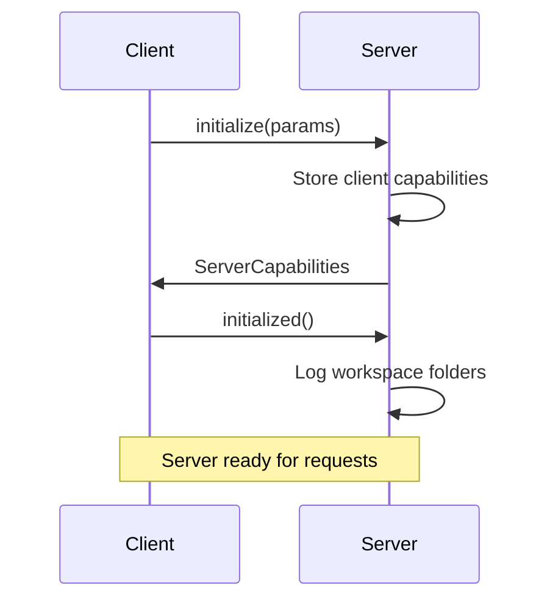
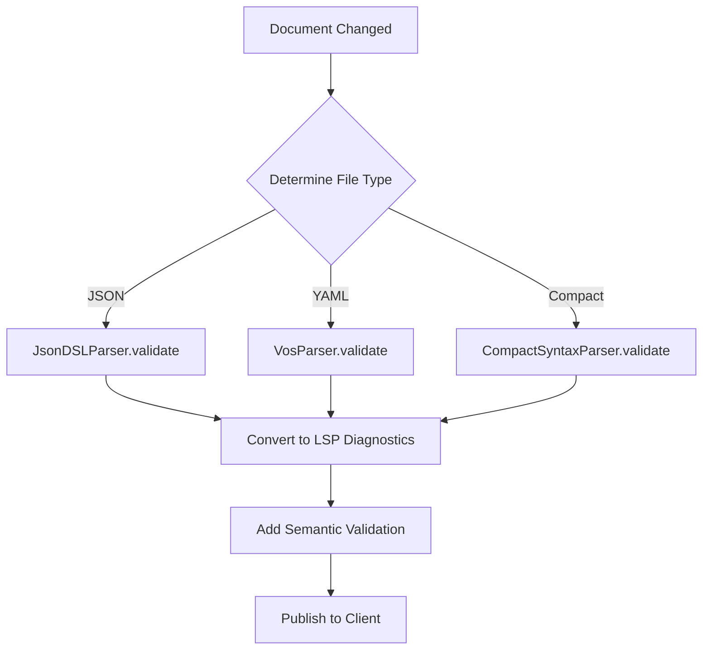

# MagicUI Language Server - Developer Manual

**Version:** 1.0.0
**Date:** 2025-12-24
**Author:** Manoj Jhawar
**License:** Proprietary - Augmentalis ES

---

## Table of Contents

1. [Architecture Overview](#architecture-overview)
2. [Core Components](#core-components)
3. [LSP Features Implementation](#lsp-features-implementation)
4. [Parser Integration](#parser-integration)
5. [Semantic Validation](#semantic-validation)
6. [Completion System](#completion-system)
7. [Hover Documentation](#hover-documentation)
8. [VUID System](#vuid-system)
9. [Theme Generation](#theme-generation)
10. [Testing](#testing)
11. [Building and Deployment](#building-and-deployment)
12. [Extending the Server](#extending-the-server)
13. [Troubleshooting](#troubleshooting)

---

## 1. Architecture Overview

### 1.1 High-Level Architecture

```
┌─────────────────────────────────────────────────────────┐
│                  IDE Client (VS Code/IntelliJ)          │
├─────────────────────────────────────────────────────────┤
│                   LSP Protocol (JSON-RPC)               │
├─────────────────────────────────────────────────────────┤
│              MagicUILanguageServer                      │
│  ┌───────────────────────┬──────────────────────────┐  │
│  │ TextDocumentService   │  WorkspaceService        │  │
│  │ - Completion          │  - Commands              │  │
│  │ - Hover               │  - File watching         │  │
│  │ - Definition          │  - Theme generation      │  │
│  │ - Diagnostics         │                          │  │
│  │ - Formatting          │                          │  │
│  └───────────────────────┴──────────────────────────┘  │
├─────────────────────────────────────────────────────────┤
│                     Parser Layer                        │
│  ┌──────────────┬──────────────┬──────────────┐        │
│  │ VosParser    │ JsonDSLParser│ CompactParser│        │
│  └──────────────┴──────────────┴──────────────┘        │
├─────────────────────────────────────────────────────────┤
│                  MagicUI DSL Files                      │
│       (.magic.yaml, .magic.json, .magicui)             │
└─────────────────────────────────────────────────────────┘
```

### 1.2 Technology Stack

| Component | Technology | Version |
|-----------|-----------|---------|
| Language | Kotlin JVM | 1.9.x |
| LSP Library | eclipse.lsp4j | 0.21.1 |
| Build System | Gradle | 8.9+ |
| Testing | JUnit 5 | 5.10.1 |
| Mocking | MockK | 1.13.8 |
| Serialization | kotlinx.serialization | 1.6.0 |
| Logging | SLF4J + Logback | 2.0.9 |

### 1.3 Project Structure

```
LanguageServer/
├── src/
│   ├── main/kotlin/com/augmentalis/magicui/lsp/
│   │   ├── MagicUILanguageServerLauncher.kt    # Entry point
│   │   ├── MagicUILanguageServer.kt            # Main server
│   │   ├── MagicUITextDocumentService.kt       # Document features
│   │   ├── MagicUIWorkspaceService.kt          # Workspace features
│   │   └── stubs/ParserStubs.kt                # Temporary stubs
│   ├── test/kotlin/                            # Unit tests
│   └── main/resources/logback.xml              # Logging config
├── vscode/                                     # VS Code extension
│   ├── package.json                            # Extension manifest
│   ├── src/extension.ts                        # LSP client
│   ├── tsconfig.json                           # TypeScript config
│   └── language-configuration.json             # Syntax config
├── scripts/
│   ├── package.sh                              # Build script
│   └── launch.sh                               # Launch script
├── build.gradle.kts                            # Build config
└── README.md                                   # Documentation
```

---

## 2. Core Components

### 2.1 MagicUILanguageServerLauncher

**Purpose:** Entry point for the Language Server, handles stdio/socket transport initialization.

**Key Methods:**

```kotlin
fun main(args: Array<String>) {
    val useStdio = args.isEmpty() || args.contains("--stdio")
    val port = args.find { it.startsWith("--port=") }?.substringAfter("=")?.toIntOrNull()

    when {
        useStdio -> launchStdioServer(System.`in`, System.out)
        port != null -> launchSocketServer(port)
        else -> exitProcess(1)
    }
}
```

**Example: Launch with stdio**
```bash
java -jar LanguageServer-1.0.0.jar
```

**Example: Launch with socket (debugging)**
```bash
java -jar LanguageServer-1.0.0.jar --port=9999
```

### 2.2 MagicUILanguageServer

**Purpose:** Main server class implementing LSP protocol, handles capability negotiation and service coordination.

**Server Capabilities:**

```kotlin
val serverCapabilities = ServerCapabilities().apply {
    textDocumentSync = Either.forLeft(TextDocumentSyncKind.Incremental)

    completionProvider = CompletionOptions().apply {
        resolveProvider = true
        triggerCharacters = listOf(".", ":", "-", " ")
    }

    hoverProvider = Either.forLeft(true)
    definitionProvider = Either.forLeft(true)
    diagnosticProvider = DiagnosticRegistrationOptions()
    documentFormattingProvider = Either.forLeft(true)
    codeActionProvider = Either.forLeft(true)

    executeCommandProvider = ExecuteCommandOptions().apply {
        commands = listOf(
            "magicui.generateTheme",
            "magicui.validateComponent",
            "magicui.formatDocument",
            "magicui.generateCode"
        )
    }
}
```

**Initialization Flow:**



### 2.3 MagicUITextDocumentService

**Purpose:** Implements all document-related LSP features (completion, hover, diagnostics, etc.).

**Key Features:**
- Document lifecycle management (open, change, close, save)
- Incremental text synchronization
- Real-time validation with parser integration
- Context-aware completion
- Rich hover documentation
- VUID navigation (go-to-definition)

**Document Cache:**

```kotlin
// Thread-safe document storage
private val documents = ConcurrentHashMap<String, String>()

override fun didOpen(params: DidOpenTextDocumentParams) {
    val uri = params.textDocument.uri
    val content = params.textDocument.text

    documents[uri] = content
    publishDiagnostics(uri, content)
}
```

### 2.4 MagicUIWorkspaceService

**Purpose:** Handles workspace-level operations and custom commands.

**Custom Commands:**

| Command | Arguments | Purpose |
|---------|-----------|---------|
| `magicui.generateTheme` | `[format, themeJson]` | Generate theme in various formats |
| `magicui.validateComponent` | `[componentData]` | Validate component definition |
| `magicui.formatDocument` | `[documentUri]` | Format MagicUI document |
| `magicui.generateCode` | `[format, dslContent]` | Generate code (Kotlin/Swift/TS) |

**Example: Execute Command**

```kotlin
override fun executeCommand(params: ExecuteCommandParams): CompletableFuture<Any> {
    val command = params.command
    val arguments = params.arguments

    return CompletableFuture.supplyAsync {
        when (command) {
            "magicui.generateTheme" -> executeGenerateTheme(arguments)
            "magicui.validateComponent" -> executeValidateComponent(arguments)
            // ...
        }
    }
}
```

---

## 3. LSP Features Implementation

### 3.1 Text Document Synchronization

**Incremental Sync** - Only changed portions are sent to server, reducing bandwidth.

```kotlin
override fun didChange(params: DidChangeTextDocumentParams) {
    val uri = params.textDocument.uri
    val changes = params.contentChanges

    val currentContent = documents[uri] ?: ""
    val newContent = applyChanges(currentContent, changes)

    documents[uri] = newContent
    publishDiagnostics(uri, newContent)
}

private fun applyChanges(content: String, changes: List<TextDocumentContentChangeEvent>): String {
    var result = content

    for (change in changes) {
        result = if (change.range == null) {
            // Full document change
            change.text
        } else {
            // Incremental change
            val range = change.range
            val lines = result.lines().toMutableList()

            val startOffset = lines.take(range.start.line).sumOf { it.length + 1 } + range.start.character
            val endOffset = lines.take(range.end.line).sumOf { it.length + 1 } + range.end.character

            result.substring(0, startOffset) + change.text + result.substring(endOffset)
        }
    }

    return result
}
```

### 3.2 Diagnostics (Error Checking)

**Two-Layer Validation:**
1. **Parser Validation** - Syntax errors from VosParser, JsonDSLParser, CompactSyntaxParser
2. **Semantic Validation** - Business rules (component requirements, property validation)

**File Type Detection:**

```kotlin
private fun determineFileType(uri: String, content: String): FileType {
    return when {
        uri.endsWith(".magic.json") || uri.endsWith(".json") -> FileType.JSON
        uri.endsWith(".magic.yaml") || uri.endsWith(".yaml") -> FileType.YAML
        uri.endsWith(".magicui") || uri.endsWith(".ucd") -> FileType.COMPACT
        content.trim().startsWith("{") -> FileType.JSON
        content.trim().startsWith("Magic") -> FileType.COMPACT
        else -> FileType.YAML // Default
    }
}
```

**Validation Workflow:**



### 3.3 Completion Provider

**Context-Aware Completion:**

```kotlin
private fun getCompletionItems(content: String, position: Position): List<CompletionItem> {
    val context = analyzeCompletionContext(content, position)

    return when (context.type) {
        CompletionContext.COMPONENT_NAME -> getComponentCompletions()
        CompletionContext.PROPERTY_NAME -> getPropertyCompletions(context.componentType)
        CompletionContext.PROPERTY_VALUE -> getValueCompletions(context.propertyName, context.componentType)
        CompletionContext.EVENT_HANDLER -> getEventHandlerCompletions()
        else -> getComponentCompletions() + getPropertyCompletions(null)
    }
}
```

**Completion Context Analysis:**

```kotlin
private fun analyzeCompletionContext(content: String, position: Position): CompletionContextInfo {
    val lines = content.lines()
    val currentLine = lines[position.line]
    val textBeforeCursor = currentLine.substring(0, minOf(position.character, currentLine.length))

    // Property value context (after colon)
    if (textBeforeCursor.contains(":")) {
        val propertyName = textBeforeCursor.substringBeforeLast(":").trim().split(" ").last()
        return CompletionContextInfo(
            type = CompletionContext.PROPERTY_VALUE,
            propertyName = propertyName
        )
    }

    // Event handler context
    if (textBeforeCursor.trim().startsWith("on")) {
        return CompletionContextInfo(CompletionContext.EVENT_HANDLER)
    }

    // Property context (indented)
    if (textBeforeCursor.startsWith("  ") || textBeforeCursor.startsWith("\t")) {
        return CompletionContextInfo(CompletionContext.PROPERTY_NAME)
    }

    // Component name context
    return CompletionContextInfo(CompletionContext.COMPONENT_NAME)
}
```

### 3.4 Hover Provider

**Markdown Documentation:**

```kotlin
private fun getComponentHoverDocumentation(componentName: String): String {
    return when (componentName) {
        "Button" -> """
            ### Button Component
            Interactive button for user actions

            **Properties:**
            - `text`: Button label text
            - `icon`: Optional icon
            - `onClick`: Click event handler
            - `enabled`: Enable/disable state
            - `vuid`: Voice unique identifier

            **Example:**
            ```yaml
            Button:
              vuid: submit-btn
              text: Submit Form
              onClick: handleSubmit
            ```
        """.trimIndent()
        // ...
    }
}
```

### 3.5 Definition Provider (Go-to-Definition)

**VUID Navigation:**

```kotlin
private fun getDefinitionLocations(content: String, position: Position, uri: String): List<Location> {
    val lines = content.lines()
    val currentLine = lines[position.line]

    val vuid = extractVuidAtPosition(currentLine, position.character)

    if (vuid != null && isValidVuidFormat(vuid)) {
        val definitionLocation = findVuidDefinition(content, vuid, uri)
        if (definitionLocation != null) {
            return listOf(definitionLocation)
        }
    }

    return emptyList()
}

private fun findVuidDefinition(content: String, vuid: String, uri: String): Location? {
    val lines = content.lines()

    lines.forEachIndexed { index, line ->
        if (line.contains("vuid:") && line.contains(vuid)) {
            val range = Range(
                Position(index, 0),
                Position(index, line.length)
            )
            return Location(uri, range)
        }
    }

    return null
}
```

---

## 4. Parser Integration

### 4.1 Parser Interface

All parsers implement a common validation interface:

```kotlin
data class ValidationError(val line: Int, val message: String)
data class ValidationWarning(val line: Int, val message: String)
data class ValidationResult(
    val errors: List<ValidationError>,
    val warnings: List<ValidationWarning>
)

interface Parser {
    fun validate(content: String): ValidationResult
    fun parseComponent(content: String): Result<ComponentNode>
}
```

### 4.2 Parser Routing

```kotlin
private fun validateDocument(uri: String, content: String): List<Diagnostic> {
    val diagnostics = mutableListOf<Diagnostic>()

    if (content.trim().isEmpty()) return diagnostics

    val fileType = determineFileType(uri, content)

    val validationResult = when (fileType) {
        FileType.JSON -> jsonDslParser.validate(content)
        FileType.YAML -> vosParser.validate(content)
        FileType.COMPACT -> compactSyntaxParser.validate(content)
        FileType.UNKNOWN -> {
            when {
                content.trim().startsWith("{") -> jsonDslParser.validate(content)
                content.trim().startsWith("Magic") -> compactSyntaxParser.validate(content)
                else -> vosParser.validate(content)
            }
        }
    }

    // Convert to LSP diagnostics...
    return diagnostics
}
```

### 4.3 AST Structure

```kotlin
enum class ComponentType {
    BUTTON, CARD, CHECKBOX, TEXT, TEXT_FIELD, IMAGE,
    CONTAINER, ROW, COLUMN, SCROLL_VIEW, SWITCH, SLIDER,
    RADIO, DROPDOWN, DATE_PICKER, TIME_PICKER, /* ... */
}

data class ComponentNode(
    val type: ComponentType,
    val properties: Map<String, Any>,
    val children: List<Any>,
    val eventHandlers: Map<String, String>
)

data class ScreenNode(
    val root: ComponentNode,
    val metadata: Map<String, Any>
)
```

---

## 5. Semantic Validation

### 5.1 Component-Specific Rules

```kotlin
private fun validateComponentRules(component: ComponentNode, diagnostics: MutableList<Diagnostic>) {
    when (component.type) {
        ComponentType.BUTTON -> {
            // Button must have text OR icon
            if (!component.properties.containsKey("text") &&
                !component.properties.containsKey("icon")) {
                diagnostics.add(createWarning(0, "Button should have 'text' or 'icon' property"))
            }
        }

        ComponentType.IMAGE -> {
            // Image must have src OR icon
            if (!component.properties.containsKey("src") &&
                !component.properties.containsKey("icon")) {
                diagnostics.add(createError(0, "Image must have 'src' or 'icon' property"))
            }
        }

        ComponentType.TEXT_FIELD -> {
            // TextField should have VUID for data binding
            if (!component.properties.containsKey("vuid") &&
                !component.properties.containsKey("id")) {
                diagnostics.add(createWarning(0, "TextField should have 'vuid' for data binding"))
            }
        }

        ComponentType.CONTAINER, ComponentType.ROW, ComponentType.COLUMN -> {
            // Layout containers should have children
            if (component.children.isEmpty()) {
                diagnostics.add(createWarning(0, "${component.type} should contain child components"))
            }
        }
    }
}
```

### 5.2 Property Value Validation

```kotlin
private fun validatePropertyValues(component: ComponentNode, diagnostics: MutableList<Diagnostic>) {
    component.properties.forEach { (key, value) ->
        when (key) {
            "color", "backgroundColor", "borderColor" -> {
                if (!isValidColor(value.toString())) {
                    diagnostics.add(createWarning(0, "Invalid color value: $value"))
                }
            }

            "width", "height", "padding", "margin" -> {
                if (!isValidSize(value.toString())) {
                    diagnostics.add(createWarning(0, "Invalid size value: $value (use dp, sp, px, or %)"))
                }
            }

            "alignment", "gravity" -> {
                val validAlignments = setOf("start", "center", "end", "top", "bottom", "left", "right")
                if (value.toString().lowercase() !in validAlignments) {
                    diagnostics.add(createWarning(0, "Invalid alignment value: $value"))
                }
            }
        }
    }
}

private fun isValidColor(value: String): Boolean {
    // Hex: #RGB, #RRGGBB, #AARRGGBB
    if (value.matches(Regex("^#([0-9A-Fa-f]{3}|[0-9A-Fa-f]{6}|[0-9A-Fa-f]{8})$"))) return true

    // Named colors
    val namedColors = setOf("red", "blue", "green", "black", "white", "gray", "yellow", "orange", "purple")
    if (value.lowercase() in namedColors) return true

    return false
}

private fun isValidSize(value: String): Boolean {
    // Numeric with units: 16dp, 12sp, 100px, 50%
    return value.matches(Regex("^\\d+(\\.\\d+)?(dp|sp|px|%)$"))
}
```

### 5.3 Hierarchy Validation

```kotlin
private fun validateParentChildRelationship(parent: ComponentNode, child: ComponentNode, diagnostics: MutableList<Diagnostic>) {
    // Nested ScrollViews are problematic
    if (parent.type == ComponentType.SCROLL_VIEW && child.type == ComponentType.SCROLL_VIEW) {
        diagnostics.add(createWarning(0, "ScrollView should not contain another ScrollView"))
    }

    // Nested Cards can hurt UX
    if (parent.type == ComponentType.CARD && child.type == ComponentType.CARD) {
        diagnostics.add(createInfo(0, "Consider avoiding direct Card nesting for better UX"))
    }
}

private fun validateComponentTree(component: ComponentNode, diagnostics: MutableList<Diagnostic>, depth: Int) {
    validateComponentRules(component, diagnostics)
    validatePropertyValues(component, diagnostics)
    validateRequiredFields(component, diagnostics)

    // Depth check
    if (depth > 10) {
        diagnostics.add(createWarning(0, "Component nesting depth exceeds 10 levels, consider refactoring"))
    }

    // Recursive validation
    component.children.forEach { child ->
        if (child is ComponentNode) {
            validateComponentTree(child, diagnostics, depth + 1)
            validateParentChildRelationship(component, child, diagnostics)
        }
    }
}
```

---

## 6. Completion System

### 6.1 Component Snippets

**10 Components with Full Snippets:**

```kotlin
private fun getComponentCompletions(): List<CompletionItem> {
    val components = mapOf(
        "Button" to "vuid: \${1:button-id}\n  text: \${2:Click me}\n  onClick: \${3:handleClick}",
        "TextField" to "vuid: \${1:field-id}\n  placeholder: \${2:Enter text}\n  onChange: \${3:handleChange}",
        "Card" to "vuid: \${1:card-id}\n  children:\n    - \${2}",
        "Text" to "vuid: \${1:text-id}\n  text: \${2:Hello World}",
        "Image" to "vuid: \${1:image-id}\n  src: \${2:image.png}",
        "Column" to "vuid: \${1:column-id}\n  children:\n    - \${2}",
        "Row" to "vuid: \${1:row-id}\n  children:\n    - \${2}",
        "Container" to "vuid: \${1:container-id}\n  children:\n    - \${2}",
        "Checkbox" to "vuid: \${1:checkbox-id}\n  checked: \${2:false}\n  onChange: \${3:handleCheck}",
        "Switch" to "vuid: \${1:switch-id}\n  enabled: \${2:true}\n  onChange: \${3:handleSwitch}"
    )

    return components.map { (name, snippet) ->
        CompletionItem(name).apply {
            kind = CompletionItemKind.Class
            detail = "MagicUI $name Component"
            documentation = Either.forLeft(getComponentDocumentation(name))
            insertText = "$name:\n  $snippet"
            insertTextFormat = InsertTextFormat.Snippet
            sortText = "0$name" // Sort components first
        }
    }
}
```

### 6.2 Property Completions

**Common + Type-Specific Properties:**

```kotlin
private fun getPropertyCompletions(componentType: String?): List<CompletionItem> {
    val commonProps = listOf(
        "vuid" to "Unique voice identifier for navigation",
        "visible" to "Component visibility (true/false)",
        "enabled" to "Component enabled state (true/false)",
        "style" to "Custom styling object",
        "modifiers" to "Layout modifiers"
    )

    val typeSpecificProps = when (componentType?.lowercase()) {
        "button", "textfield", "checkbox", "switch" -> listOf(
            "onClick" to "Click event handler",
            "onChange" to "Change event handler"
        )
        "text" -> listOf(
            "text" to "Text content",
            "fontSize" to "Font size (dp, sp)",
            "color" to "Text color (hex or named)"
        )
        "image" -> listOf(
            "src" to "Image source URL",
            "alt" to "Alternative text",
            "width" to "Image width",
            "height" to "Image height"
        )
        else -> emptyList()
    }

    return (commonProps + typeSpecificProps).map { (name, description) ->
        CompletionItem(name).apply {
            kind = CompletionItemKind.Property
            detail = "Component Property"
            documentation = Either.forLeft(description)
            insertText = "$name: "
            sortText = "1$name"
        }
    }
}
```

### 6.3 Value Completions

**9 Colors, 7 Alignments, Booleans, 5 Events:**

```kotlin
private fun getColorCompletions(): List<CompletionItem> {
    val colors = mapOf(
        "red" to "#FF0000",
        "blue" to "#0000FF",
        "green" to "#00FF00",
        "black" to "#000000",
        "white" to "#FFFFFF",
        "gray" to "#808080",
        "yellow" to "#FFFF00",
        "orange" to "#FFA500",
        "purple" to "#800080"
    )

    return colors.map { (name, hex) ->
        CompletionItem(name).apply {
            kind = CompletionItemKind.Color
            detail = hex
            documentation = Either.forLeft("Color: $name ($hex)")
            insertText = name
        }
    }
}

private fun getAlignmentCompletions(): List<CompletionItem> {
    val alignments = listOf("start", "center", "end", "top", "bottom", "left", "right")

    return alignments.map { alignment ->
        CompletionItem(alignment).apply {
            kind = CompletionItemKind.Enum
            detail = "Alignment value"
            insertText = alignment
        }
    }
}

private fun getEventHandlerCompletions(): List<CompletionItem> {
    val handlers = mapOf(
        "onClick" to "Click event handler",
        "onChange" to "Change event handler",
        "onSubmit" to "Submit event handler",
        "onFocus" to "Focus event handler",
        "onBlur" to "Blur event handler"
    )

    return handlers.map { (name, description) ->
        CompletionItem(name).apply {
            kind = CompletionItemKind.Event
            detail = description
            insertText = "$name: \${1:handleEvent}"
            insertTextFormat = InsertTextFormat.Snippet
        }
    }
}
```

---

## 7. Hover Documentation

### 7.1 Component Documentation

**Rich Markdown with Examples:**

```kotlin
private fun getComponentHoverDocumentation(componentName: String): String {
    return when (componentName) {
        "TextField" -> """
            ### TextField Component
            Text input field with validation

            **Properties:**
            - `placeholder`: Placeholder text
            - `value`: Current value
            - `onChange`: Change event handler
            - `vuid`: Voice unique identifier
            - `validation`: Validation rules

            **Example:**
            ```yaml
            TextField:
              vuid: email-input
              placeholder: Enter email
              onChange: handleEmailChange
            ```
        """.trimIndent()

        "Card" -> """
            ### Card Component
            Container with elevation and rounded corners

            **Properties:**
            - `elevation`: Shadow depth
            - `children`: Child components
            - `backgroundColor`: Card background color
            - `padding`: Inner padding

            **Example:**
            ```yaml
            Card:
              vuid: profile-card
              elevation: 4
              children:
                - Text: ...
            ```
        """.trimIndent()
    }
}
```

### 7.2 Property Documentation

```kotlin
private fun getPropertyHoverDocumentation(propertyName: String, propertyValue: String?): String {
    return when (propertyName) {
        "vuid" -> """
            ### VUID (Voice Unique Identifier)
            Unique identifier for voice navigation and component access

            **Format:** `component-type-descriptor`
            **Example:** `login-submit-button`

            Used by VoiceOS to navigate and interact with UI elements.
        """.trimIndent()

        "color", "backgroundColor", "borderColor" -> """
            ### Color Property: $propertyName
            ${if (propertyValue != null) "**Current:** `$propertyValue`\n\n" else ""}
            **Accepted Formats:**
            - Hex: `#RGB`, `#RRGGBB`, `#AARRGGBB`
            - Named: red, blue, green, black, white, gray, yellow, orange, purple

            **Examples:** `#FF0000`, `red`, `#80FF0000`
        """.trimIndent()

        "width", "height", "padding", "margin" -> """
            ### Size Property: $propertyName
            ${if (propertyValue != null) "**Current:** `$propertyValue`\n\n" else ""}
            **Accepted Units:**
            - `dp` - Density-independent pixels (recommended)
            - `sp` - Scale-independent pixels (for text)
            - `px` - Physical pixels
            - `%` - Percentage of parent

            **Examples:** `16dp`, `14sp`, `100px`, `50%`
        """.trimIndent()
    }
}
```

---

## 8. VUID System

### 8.1 VUID Format

**Format Rules:**
- Lowercase letters, numbers, hyphens only
- Must start with letter
- Must end with letter or number
- Length: 3-64 characters
- Pattern: `component-type-descriptor`

**Examples:**
- ✅ `login-submit-button`
- ✅ `profile-email-field`
- ✅ `settings-dark-mode-switch`
- ❌ `LoginButton` (uppercase)
- ❌ `btn` (too short)
- ❌ `button-` (ends with hyphen)

### 8.2 VUID Validation

```kotlin
private fun isValidVuidFormat(vuid: String): Boolean {
    return vuid.matches(Regex("^[a-z][a-z0-9-]*[a-z0-9]$")) &&
           vuid.length >= 3 &&
           vuid.length <= 64
}
```

### 8.3 VUID Navigation

**Go-to-Definition Implementation:**

```kotlin
private fun extractVuidAtPosition(line: String, character: Int): String? {
    val beforeCursor = line.substring(0, minOf(character, line.length))
    val afterCursor = line.substring(minOf(character, line.length))

    val wordBefore = beforeCursor.split(Regex("[\\s:,\"']")).lastOrNull() ?: ""
    val wordAfter = afterCursor.split(Regex("[\\s:,\"']")).firstOrNull() ?: ""
    val word = wordBefore + wordAfter

    return if (word.matches(Regex("^[a-z0-9-]+$")) && word.contains("-")) {
        word
    } else {
        null
    }
}

private fun findVuidDefinition(content: String, vuid: String, uri: String): Location? {
    val lines = content.lines()

    lines.forEachIndexed { index, line ->
        if (line.contains("vuid:") && line.contains(vuid)) {
            val range = Range(
                Position(index, 0),
                Position(index, line.length)
            )
            return Location(uri, range)
        }
    }

    return null
}
```

### 8.4 VUID Auto-Generation

```kotlin
private fun generateVuidSuggestion(componentType: String?, context: String?): String {
    val prefix = componentType?.lowercase()?.replace(Regex("[^a-z0-9]"), "-") ?: "component"
    val suffix = context?.lowercase()?.replace(Regex("[^a-z0-9]"), "-") ?: "item"
    val random = (1000..9999).random()

    return "$prefix-$suffix-$random"
}
```

---

## 9. Theme Generation

### 9.1 Supported Export Formats

| Format | Extension | Use Case |
|--------|-----------|----------|
| Kotlin DSL | `.kt` | Native Android/KMP apps |
| YAML | `.yaml` | Configuration files |
| JSON | `.json` | Web apps, REST APIs |
| CSS | `.css` | Web styling |
| Android XML | `.xml` | Android resources |

### 9.2 Theme Generation Command

**Command:** `magicui.generateTheme`

**Arguments:**
1. `format` - Export format (dsl, yaml, json, css, xml)
2. `themeJson` - Theme definition as JSON string

**Example Usage (TypeScript Client):**

```typescript
const themeJson = JSON.stringify({
    name: "DarkTheme",
    colors: {
        primary: "#BB86FC",
        secondary: "#03DAC6",
        background: "#121212"
    }
});

const result = await workspace.executeCommand(
    'magicui.generateTheme',
    'dsl',
    themeJson
);

console.log(result.output); // Generated Kotlin DSL
```

### 9.3 Implementation

```kotlin
private fun executeGenerateTheme(arguments: List<Any>): Any {
    try {
        if (arguments.size < 2) {
            return mapOf(
                "success" to false,
                "error" to "Missing arguments: format and themeJson required"
            )
        }

        val format = arguments[0].toString()
        val themeJson = arguments[1].toString()

        val themeElement = json.parseToJsonElement(themeJson)
        val themeName = themeElement.jsonObject["name"]?.jsonPrimitive?.content ?: "CustomTheme"

        val exportFormat = when (format.lowercase()) {
            "dsl", "kotlin" -> ExportFormat.DSL
            "yaml" -> ExportFormat.YAML
            "json" -> ExportFormat.JSON
            "css" -> ExportFormat.CSS
            "xml", "android" -> ExportFormat.ANDROID_XML
            else -> ExportFormat.DSL
        }

        // Generate output (actual implementation uses ThemeCompiler)
        val output = themeCompiler.compile(theme, exportFormat)

        return mapOf(
            "success" to true,
            "format" to format,
            "themeName" to themeName,
            "output" to output
        )

    } catch (e: Exception) {
        return mapOf(
            "success" to false,
            "error" to "Theme generation failed: ${e.message}"
        )
    }
}
```

---

## 10. Testing

### 10.1 Test Structure

**30 Comprehensive Tests:**
- MagicUILanguageServerTest.kt (10 tests)
- MagicUITextDocumentServiceTest.kt (9 tests)
- MagicUIWorkspaceServiceTest.kt (11 tests)

### 10.2 Testing Framework

**Technology Stack:**
- JUnit 5 (Jupiter)
- MockK (mocking)
- kotlinx-coroutines-test (async testing)

**Test Configuration:**

```kotlin
dependencies {
    testImplementation(kotlin("test"))
    testImplementation("org.junit.jupiter:junit-jupiter:5.10.1")
    testImplementation("org.jetbrains.kotlinx:kotlinx-coroutines-test:1.7.3")
    testImplementation("io.mockk:mockk:1.13.8")
}

tasks.test {
    useJUnitPlatform()
}
```

### 10.3 Example: Document Lifecycle Test

```kotlin
@Test
fun `didOpen should cache document and publish diagnostics`() {
    // Given
    val uri = "file:///test.magic.yaml"
    val content = """
        Button:
          vuid: test-button
          text: Click Me
    """.trimIndent()

    val params = DidOpenTextDocumentParams().apply {
        textDocument = TextDocumentItem().apply {
            this.uri = uri
            this.text = content
        }
    }

    // When
    service.didOpen(params)

    // Then
    verify { mockClient.publishDiagnostics(any()) }
}
```

### 10.4 Example: Completion Test

```kotlin
@Test
fun `completion should return component suggestions`() {
    // Given
    val uri = "file:///test.magic.yaml"
    val content = "B" // User typed 'B'

    service.didOpen(DidOpenTextDocumentParams().apply {
        textDocument = TextDocumentItem().apply {
            this.uri = uri
            this.text = content
        }
    })

    val completionParams = CompletionParams().apply {
        textDocument = TextDocumentIdentifier(uri)
        position = Position(0, 1)
    }

    // When
    val result = service.completion(completionParams).get()

    // Then
    assertNotNull(result)
    val completions = result.right
    assertTrue(completions.items.size > 0)
    assertTrue(completions.items.any { it.label == "Button" })
}
```

### 10.5 Example: Validation Test

```kotlin
@Test
fun `validation should detect missing required properties`() {
    // Given
    val uri = "file:///test.magic.yaml"
    val content = """
        Button:
          onClick: handleClick
    """.trimIndent() // Missing text/icon - should warn

    val params = DidOpenTextDocumentParams().apply {
        textDocument = TextDocumentItem().apply {
            this.uri = uri
            this.text = content
        }
    }

    // When
    service.didOpen(params)

    // Then - Should publish diagnostics with warnings
    verify {
        mockClient.publishDiagnostics(
            match { diagnosticsParams ->
                diagnosticsParams.diagnostics.any {
                    it.severity == DiagnosticSeverity.Warning &&
                    it.message.contains("Button should have 'text' or 'icon'")
                }
            }
        )
    }
}
```

### 10.6 Example: MockK Mocking

```kotlin
@BeforeEach
fun setup() {
    service = MagicUITextDocumentService()
    mockClient = mockk(relaxed = true) // relaxed = auto-generate return values
    service.connect(mockClient)
}
```

**MockK Verification:**

```kotlin
// Verify exact call
verify { mockClient.publishDiagnostics(any()) }

// Verify multiple calls
verify(atLeast = 2) { mockClient.publishDiagnostics(any()) }

// Verify with matcher
verify {
    mockClient.publishDiagnostics(
        match { params -> params.diagnostics.size > 0 }
    )
}
```

### 10.7 Running Tests

**Command Line:**

```bash
# Run all tests
./gradlew :Modules:AVAMagic:MagicTools:LanguageServer:test

# Run specific test class
./gradlew :Modules:AVAMagic:MagicTools:LanguageServer:test --tests "MagicUITextDocumentServiceTest"

# Run specific test method
./gradlew :Modules:AVAMagic:MagicTools:LanguageServer:test \
  --tests "MagicUITextDocumentServiceTest.didOpen should cache document and publish diagnostics"

# Generate coverage report
./gradlew :Modules:AVAMagic:MagicTools:LanguageServer:test jacocoTestReport
open Modules/AVAMagic/MagicTools/LanguageServer/build/reports/jacoco/test/html/index.html
```

---

## 11. Building and Deployment

### 11.1 Build Script

**File:** `scripts/package.sh`

```bash
#!/bin/bash
set -e

echo "🔨 Building MagicUI Language Server..."

# Clean previous builds
./gradlew :Modules:AVAMagic:MagicTools:LanguageServer:clean

# Build fat JAR
./gradlew :Modules:AVAMagic:MagicTools:LanguageServer:jar

# Verify output
JAR_FILE="Modules/AVAMagic/MagicTools/LanguageServer/build/libs/LanguageServer-1.0.0.jar"

if [ -f "$JAR_FILE" ]; then
    SIZE=$(du -h "$JAR_FILE" | cut -f1)
    echo "✅ Package created successfully!"
    echo "📦 Location: $JAR_FILE"
    echo "📏 Size: $SIZE"
else
    echo "❌ Build failed - JAR not found"
    exit 1
fi
```

**Usage:**

```bash
chmod +x scripts/package.sh
./scripts/package.sh
```

### 11.2 Launch Script

**File:** `scripts/launch.sh`

```bash
#!/bin/bash

# Determine mode
MODE="${1:-stdio}"
PORT="${2:-9999}"

# JAR location
JAR_FILE="build/libs/LanguageServer-1.0.0.jar"

if [ ! -f "$JAR_FILE" ]; then
    echo "❌ JAR file not found at $JAR_FILE"
    echo "Run scripts/package.sh first"
    exit 1
fi

echo "🚀 Launching MagicUI Language Server in $MODE mode..."

if [ "$MODE" = "socket" ]; then
    echo "📡 Socket mode on port $PORT"
    java -jar "$JAR_FILE" --port="$PORT"
else
    echo "📟 Stdio mode (default)"
    java -jar "$JAR_FILE"
fi
```

**Usage:**

```bash
# Stdio mode (for IDE integration)
./scripts/launch.sh

# Socket mode (for debugging)
./scripts/launch.sh socket 9999
```

### 11.3 Fat JAR Configuration

**build.gradle.kts:**

```kotlin
tasks.jar {
    manifest {
        attributes["Main-Class"] = "com.augmentalis.magicui.lsp.MagicUILanguageServerLauncher"
    }

    // Include all dependencies
    duplicatesStrategy = DuplicatesStrategy.EXCLUDE
    from(configurations.runtimeClasspath.get().map {
        if (it.isDirectory) it else zipTree(it)
    })
}
```

**Result:**
- Single executable JAR (~25MB)
- No external dependencies needed
- Easy deployment to IDEs

### 11.4 VS Code Extension Packaging

**Prerequisites:**

```bash
cd vscode
npm install
```

**Build TypeScript:**

```bash
npm run compile
# Output: vscode/out/extension.js
```

**Package Extension:**

```bash
npm install -g vsce
vsce package
# Output: magicui-lsp-1.0.0.vsix
```

**Install Extension:**

```bash
code --install-extension magicui-lsp-1.0.0.vsix
```

---

## 12. Extending the Server

### 12.1 Adding New Components

**Step 1: Update ParserStubs.kt**

```kotlin
enum class ComponentType {
    // Existing components...
    MY_NEW_COMPONENT
}
```

**Step 2: Add Component Completion**

```kotlin
private fun getComponentCompletions(): List<CompletionItem> {
    val components = mapOf(
        // Existing components...
        "MyNewComponent" to "vuid: \${1:component-id}\n  customProp: \${2:value}"
    )
    // ...
}
```

**Step 3: Add Hover Documentation**

```kotlin
private fun getComponentHoverDocumentation(componentName: String): String {
    return when (componentName) {
        // Existing components...
        "MyNewComponent" -> """
            ### MyNewComponent
            Description of new component

            **Properties:**
            - customProp: Description
        """.trimIndent()
    }
}
```

**Step 4: Add Validation Rules**

```kotlin
private fun validateComponentRules(component: ComponentNode, diagnostics: MutableList<Diagnostic>) {
    when (component.type) {
        // Existing rules...
        ComponentType.MY_NEW_COMPONENT -> {
            if (!component.properties.containsKey("customProp")) {
                diagnostics.add(createWarning(0, "MyNewComponent requires customProp"))
            }
        }
    }
}
```

### 12.2 Adding Custom Commands

**Step 1: Register Command**

```kotlin
executeCommandProvider = ExecuteCommandOptions().apply {
    commands = listOf(
        // Existing commands...
        "magicui.myCustomCommand"
    )
}
```

**Step 2: Implement Handler**

```kotlin
override fun executeCommand(params: ExecuteCommandParams): CompletableFuture<Any> {
    return CompletableFuture.supplyAsync {
        when (params.command) {
            // Existing commands...
            "magicui.myCustomCommand" -> executeMyCustomCommand(params.arguments)
        }
    }
}

private fun executeMyCustomCommand(arguments: List<Any>): Any {
    // Implementation
    return mapOf("success" to true, "result" to "...")
}
```

### 12.3 Adding New Parsers

**Step 1: Create Parser Class**

```kotlin
class MyCustomParser {
    fun validate(content: String): ValidationResult {
        // Parse and validate
        return ValidationResult(errors, warnings)
    }

    fun parseComponent(content: String): Result<ComponentNode> {
        // Parse to AST
        return Result.success(componentNode)
    }
}
```

**Step 2: Register Parser**

```kotlin
private val myCustomParser = MyCustomParser()

private fun determineFileType(uri: String, content: String): FileType {
    return when {
        // Existing types...
        uri.endsWith(".custom") -> FileType.CUSTOM
    }
}
```

**Step 3: Route to Parser**

```kotlin
val validationResult = when (fileType) {
    // Existing parsers...
    FileType.CUSTOM -> myCustomParser.validate(content)
}
```

---

## 13. Troubleshooting

### 13.1 Common Build Issues

**Issue:** `Project with path ':Modules:AVAMagic:MagicUI:Components:ThemeBuilder' could not be found`

**Solution:**
```kotlin
// build.gradle.kts - Comment out unavailable modules
// implementation(project(":Modules:AVAMagic:MagicUI:Components:ThemeBuilder"))
```

**Issue:** `Repository mode conflict`

**Solution:**
```kotlin
// Remove explicit repositories block from build.gradle.kts
// Let settings.gradle.kts handle repositories
```

### 13.2 Runtime Issues

**Issue:** Server not starting

**Diagnosis:**
```bash
# Check Java version
java -version
# Must be 17+

# Check JAR exists
ls -lh build/libs/LanguageServer-1.0.0.jar

# Check logs
tail -f magicui-lsp.log
```

**Issue:** No completions appearing

**Diagnosis:**
- Check file extension (must be .magic.yaml, .magic.json, .magicui)
- Check VS Code Output → "MagicUI Language Server"
- Check server status in VS Code status bar
- Restart VS Code (Command Palette → "Reload Window")

**Issue:** Diagnostics not showing

**Diagnosis:**
```kotlin
// Add debug logging
logger.debug("Diagnostics: ${diagnostics.size} for $uri")
```

### 13.3 Testing Issues

**Issue:** Tests failing with "Connection refused"

**Solution:**
```kotlin
// Don't use real server in tests - use mocks
@BeforeEach
fun setup() {
    mockClient = mockk(relaxed = true)
    service.connect(mockClient)
}
```

**Issue:** MockK verification failures

**Solution:**
```kotlin
// Use relaxed mocks for auto-stubbing
mockk(relaxed = true)

// Verify with matchers instead of exact values
verify { mockClient.publishDiagnostics(any()) }
```

### 13.4 VS Code Extension Issues

**Issue:** Extension not activating

**Diagnosis:**
```json
// Check package.json activationEvents
"activationEvents": [
    "onLanguage:yaml",
    "onLanguage:json"
]
```

**Issue:** Server JAR path not found

**Solution:**
```json
// VS Code settings.json
{
    "magicui.server.jarPath": "/absolute/path/to/LanguageServer-1.0.0.jar"
}
```

**Issue:** Extension not loading

**Diagnosis:**
```bash
# Check compilation
cd vscode
npm run compile

# Check for TypeScript errors
npm run watch
```

---

## Appendix A: LSP Protocol Reference

### Message Types

**Initialize Request:**
```json
{
    "jsonrpc": "2.0",
    "id": 1,
    "method": "initialize",
    "params": {
        "rootUri": "file:///workspace",
        "capabilities": { /* client capabilities */ }
    }
}
```

**Text Document Sync:**
```json
{
    "method": "textDocument/didOpen",
    "params": {
        "textDocument": {
            "uri": "file:///test.yaml",
            "text": "Button:\n  text: Click"
        }
    }
}
```

**Completion Request:**
```json
{
    "method": "textDocument/completion",
    "params": {
        "textDocument": { "uri": "file:///test.yaml" },
        "position": { "line": 1, "character": 5 }
    }
}
```

---

## Appendix B: File Naming Conventions

All documentation follows IDEACODE naming standard:

**Pattern:** `{App}-{Module}-{Description}-{YYMMDD}-V{Number}.md`

**Examples:**
- ✅ `MagicUI-LSP-Developer-Manual-251224-V1.md`
- ✅ `MagicUI-LSP-User-Manual-251224-V1.md`
- ❌ `developer-manual.md` (missing app/module prefix and date)

---

**End of Developer Manual**

For user-facing documentation, see: `MagicUI-LSP-User-Manual-251224-V1.md`
For practical examples, see: `Modules/AVAMagic/MagicTools/LanguageServer/EXAMPLES.md`
