# Infrastructure Completion Assessment

**Date**: 2025-10-27 12:05 PDT
**Purpose**: Assess infrastructure completeness before library migrations
**Status**: Assessment Complete
**Follows**: IDEACODE Principles v1.0.0

---

## Executive Summary

**Current State**: Phase 4 infrastructure is **PARTIALLY COMPLETE** (40%)

**Completed** (2/5 components):
1. ✅ ColorPicker Library (100% complete, 126 tests passing)
2. ✅ Preferences Library (100% complete, 16 tests passing)

**Designed but NOT Implemented** (2/5 components):
3. ⏳ AvaUI DSL Runtime (Architecture designed, 0% implemented)
4. ⏳ Theme Migration Bridge (Architecture designed, 0% implemented)

**Missing** (1/5 components):
5. ❌ AvaCode Codegen (Not designed, not implemented)

**Recommendation**: Complete components 3-5 BEFORE starting library migrations to avoid blocking dependencies.

---

## Infrastructure Requirements Analysis

### Spec 003: Platform Architecture Restructuring

Per `specs/003-platform-architecture-restructure/spec.md`:

#### User Story 1 - Core Platform Foundation (P1)
> "I need to establish the proper runtime library structure with **AvaUI (DSL interpreter)** and **AvaCode (code generator)** so that all future development follows the correct modular architecture..."

**Requirements Extracted**:
1. AvaUI Runtime (DSL interpreter) - **DESIGNED, NOT IMPLEMENTED**
2. AvaCode Codegen (code generator) - **NOT DESIGNED**
3. Runtime library structure - **PARTIAL** (ColorPicker, Preferences done)

#### User Story 2 - Avenue-Redux Library Migration (P1)
> "I need all 15+ production modules from avenue-redux migrated to AvaCode platform libraries..."

**Dependencies**:
- AvaUI Runtime MUST exist to interpret DSL apps
- Theme Migration Bridge MUST exist for Avanue4 app compatibility
- AvaCode Codegen MUST exist for code export functionality

**Blocking Issue**: Cannot migrate libraries without DSL runtime to consume them.

---

## Component Status Breakdown

### 1. ColorPicker Library ✅ COMPLETE

**Status**: Production-ready
**Location**: `runtime/libraries/ColorPicker/`
**Lines**: ~3000 (11 files)
**Tests**: 126 tests, 100% passing
**Documentation**: Complete

**Capabilities**:
- ColorRGBA: RGBA color model with manipulation, accessibility, blending
- ColorHSV: HSV/HSL color spaces with conversion
- ColorPalette: Color schemes (monochromatic, triadic, etc.), gradients
- ColorPickerView: KMP expect/actual interface for platform pickers
- ColorPickerConfig: 7 display modes, 5 formats, validation

**Used By**:
- Theme Migration Bridge (color conversion functions)
- AvaUI DSL Runtime (color property parsing)
- Future library migrations (any component needing color support)

**Verdict**: ✅ Keep as-is, ready for integration

---

### 2. Preferences Library ✅ COMPLETE

**Status**: Production-ready
**Location**: `runtime/libraries/Preferences/`
**Tests**: 16 tests passing
**Documentation**: Complete

**Capabilities**:
- Cross-platform key-value storage (KMP)
- Type-safe preference access
- Observable preferences (Flow-based)
- Platform-specific implementations (SharedPreferences, UserDefaults, etc.)

**Used By**:
- Theme Migration Bridge (theme persistence)
- All libraries (settings, config storage)
- AvaUI DSL Runtime (app state persistence)

**Verdict**: ✅ Ready for integration

---

### 3. AvaUI DSL Runtime ⏳ DESIGNED, NOT IMPLEMENTED

**Status**: Architecture designed, 0% implementation
**Location**: Design: `docs/Active/AvaUI-DSL-Runtime-Architecture-251027.md`
**Estimated Effort**: 15 hours (7 phases)

**Components Needed**:

#### Phase 1: DSL Parser Foundation (~3 hours)
```
runtime/libraries/AvaUI/src/commonMain/kotlin/com/augmentalis/voiceos/avaui/dsl/
├── VosAstNode.kt              # AST data structures
├── VosValue.kt                # DSL value types (String, Int, Float, etc.)
├── VosLambda.kt               # DSL callback/event handlers
├── VosTokenizer.kt            # Lexical analysis
└── VosParser.kt               # Syntax analysis
```

**Tests**: VosParserTest.kt (30+ tests)

#### Phase 2: Component Registry (~2 hours)
```
runtime/libraries/AvaUI/src/commonMain/kotlin/com/augmentalis/voiceos/avaui/registry/
├── ComponentRegistry.kt       # Map DSL names → Native classes
├── ComponentDescriptor.kt     # Metadata (properties, events, children)
└── BuiltInComponents.kt       # Register ColorPicker, Preferences, etc.
```

**Tests**: ComponentRegistryTest.kt (15+ tests)

#### Phase 3: Instantiation Engine (~3 hours)
```
runtime/libraries/AvaUI/src/commonMain/kotlin/com/augmentalis/voiceos/avaui/instantiation/
├── ComponentInstantiator.kt   # Create native objects from AST
├── PropertyMapper.kt          # DSL properties → Kotlin properties
├── TypeCoercion.kt            # String → ColorRGBA, Int, etc.
└── DefaultValueProvider.kt    # Handle missing properties
```

**Tests**: ComponentInstantiatorTest.kt (25+ tests)

#### Phase 4: Event/Callback System (~2 hours)
```
runtime/libraries/AvaUI/src/commonMain/kotlin/com/augmentalis/voiceos/avaui/events/
├── EventBus.kt                # Event propagation
├── CallbackAdapter.kt         # DSL lambdas → Kotlin lambdas
└── EventContext.kt            # Execution context for callbacks
```

**Tests**: EventBusTest.kt (20+ tests)

#### Phase 5: Voice Command Router (~2 hours)
```
runtime/libraries/AvaUI/src/commonMain/kotlin/com/augmentalis/voiceos/avaui/voice/
├── VoiceCommandRouter.kt      # Register voice triggers
├── CommandMatcher.kt          # Fuzzy matching for voice input
└── ActionDispatcher.kt        # Execute DSL actions from voice
```

**Tests**: VoiceCommandRouterTest.kt (15+ tests)

#### Phase 6: Lifecycle Management (~1 hour)
```
runtime/libraries/AvaUI/src/commonMain/kotlin/com/augmentalis/voiceos/avaui/lifecycle/
├── AppLifecycle.kt            # init/start/pause/resume/stop/destroy
├── ResourceManager.kt         # Cleanup on destroy
└── StateManager.kt            # Persist/restore app state
```

**Tests**: AppLifecycleTest.kt (10+ tests)

#### Phase 7: Integration Testing (~2 hours)
```
runtime/libraries/AvaUI/src/commonTest/kotlin/com/augmentalis/voiceos/avaui/integration/
├── EndToEndTest.kt            # Parse DSL → Instantiate → Execute
├── ColorPickerDslTest.kt      # Test ColorPicker via DSL
└── PreferencesDslTest.kt      # Test Preferences via DSL
```

**Example DSL to Test**:
```yaml
#!vos:D
App {
  id: "test.colorApp"
  name: "Color Test"

  ColorPicker {
    id: "picker1"
    initialColor: "#FF5722"
    mode: "DESIGNER"

    onConfirm: (color) => {
      Preferences.set("theme.primary", color)
      VoiceOS.speak("Color saved!")
    }
  }
}
```

**Blocking Impact**:
- **ALL library migrations** depend on this (libraries need DSL runtime to be usable in apps)
- **Theme Migration Bridge** needs this (apps use DSL to define themes)
- **AvaCode Codegen** needs this (export DSL to Kotlin/Swift)

**Verdict**: 🚨 **CRITICAL PATH - Must implement before library migrations**

---

### 4. Theme Migration Bridge ⏳ DESIGNED, NOT IMPLEMENTED

**Status**: Architecture designed, 0% implementation
**Location**: Design: `docs/Active/Theme-Migration-Bridge-Strategy-251027-1150.md`
**Estimated Effort**: 26 hours (4 components)

**Components Needed**:

#### Component 1: ColorConversionUtils (~4 hours)
```
runtime/libraries/ThemeBridge/src/commonMain/kotlin/com/augmentalis/voiceos/themebridge/
└── ColorConversionUtils.kt    # Int ↔ Hex using ColorRGBA
```

**Functions**:
- `intToHex(argbInt: Int, includeAlpha: Boolean = true): String`
- `hexToInt(hexString: String): Int`
- `isValidHex(hexString: String): Boolean`
- `ensureOpaque(argbInt: Int): Int`

**Tests**: ColorConversionUtilsTest.kt (15+ tests)

#### Component 2: ThemeConverter (~6 hours)
```
runtime/libraries/ThemeBridge/src/commonMain/kotlin/com/augmentalis/voiceos/themebridge/
└── ThemeConverter.kt          # Avanue4 ↔ AvaUI conversion
```

**Functions**:
- `convertLegacyToAvaUI(legacyTheme: Theme): ThemeConfig`
- `convertAvaUIToLegacy(magicTheme: ThemeConfig): Theme`

**Tests**: ThemeConverterTest.kt (30+ tests)

#### Component 3: ThemeStructureMapper (~4 hours)
```
runtime/libraries/ThemeBridge/src/commonMain/kotlin/com/augmentalis/voiceos/themebridge/
└── ThemeStructureMapper.kt    # Incremental component updates
```

**Functions**:
- `updateComponentInMagicTheme(currentTheme: ThemeConfig, component: LegacyComponent, value: Any): ThemeConfig`

**Tests**: ThemeStructureMapperTest.kt (20+ tests)

#### Component 4: ThemeMigrationBridge (~12 hours)
```
runtime/libraries/ThemeBridge/src/commonMain/kotlin/com/augmentalis/voiceos/themebridge/
└── ThemeMigrationBridge.kt    # Main coordinator
```

**Functions**:
- `initialize()`
- `updateMagicUiTheme(theme: ThemeConfig)`
- `updateComponent(component: LegacyThemeComponent, value: Any)`
- `resetToDefault()`
- `cleanup()`
- Implements `LegacyThemeObserver` (onThemeChanged, onThemeComponentChanged, etc.)

**Tests**: ThemeMigrationBridgeTest.kt (25+ tests)

**Blocking Impact**:
- **Avanue4 app migrations** depend on this (Settings, Launcher, etc.)
- **Theme-aware libraries** need this (any library with theming support)
- **User theme customization** requires this (ColorPicker → Theme updates)

**Verdict**: 🚨 **HIGH PRIORITY - Needed for app migrations**

---

### 5. AvaCode Codegen ❌ NOT DESIGNED

**Status**: Not designed, not implemented
**Location**: TBD (likely `runtime/libraries/AvaCode/`)
**Estimated Effort**: Unknown (needs design first)

**Purpose** (from spec):
> "AvaCode (code generator)" - Export DSL/YAML apps to native Kotlin/Swift/JS code

**Assumed Requirements**:
1. **Input**: Parse .vos DSL files or YAML app definitions
2. **Output**: Generate Kotlin Compose, SwiftUI, or React code
3. **Features**:
   - DSL → Kotlin Compose codegen
   - DSL → SwiftUI codegen
   - DSL → React/JS codegen (optional)
   - Preserve component properties and callbacks
   - Generate type-safe code

**Components Likely Needed**:
```
runtime/libraries/AvaCode/src/commonMain/kotlin/com/augmentalis/avacode/codegen/
├── CodeGenerator.kt           # Main interface
├── KotlinGenerator.kt         # Kotlin Compose output
├── SwiftUIGenerator.kt        # SwiftUI output
├── CodeEmitter.kt             # Code formatting, indentation
└── TemplateEngine.kt          # Code generation templates
```

**Estimated Effort**: 20-30 hours (needs proper design)

**Blocking Impact**:
- **AVA AI integration** (User Story 4) depends on this (AI needs codegen to export apps)
- **Developer tooling** depends on this (export DSL to native code for editing)
- **NOT blocking** for library migrations or runtime apps (runtime interprets DSL, doesn't need codegen)

**Verdict**: 🟡 **MEDIUM PRIORITY - Needed for AVA AI, not for library migrations**

---

## Infrastructure Dependency Graph

```mermaid
graph TD
    subgraph "COMPLETED ✅"
        A[ColorPicker Library]
        B[Preferences Library]
    end

    subgraph "CRITICAL PATH 🚨"
        C[AvaUI DSL Runtime]
        D[Theme Migration Bridge]
    end

    subgraph "FUTURE 🟡"
        E[AvaCode Codegen]
    end

    subgraph "DEPENDS ON INFRASTRUCTURE"
        F[Library Migrations<br/>Notepad, Browser, etc.]
        G[App Migrations<br/>Settings, Launcher, etc.]
        H[AVA AI Integration]
    end

    A --> C
    A --> D
    B --> C
    B --> D
    C --> F
    D --> G
    C --> E
    F --> G
    E --> H
    C --> H

    style A fill:#90EE90
    style B fill:#90EE90
    style C fill:#FFB6C1
    style D fill:#FFB6C1
    style E fill:#FFD700
    style F fill:#E0E0E0
    style G fill:#E0E0E0
    style H fill:#E0E0E0
```



**Legend**:
- 🟢 Green: Completed, production-ready
- 🔴 Pink: Designed, not implemented, **CRITICAL PATH**
- 🟡 Yellow: Not designed, medium priority
- ⚪ Gray: Waiting for infrastructure

---

## Blocking Analysis

### What Blocks Library Migrations?

**15 libraries to migrate** (from spec):
1. Notepad
2. Browser
3. CloudStorage
4. FileManager
5. RemoteControl
6. Keyboard
7. CommandBar
8. Logger
9. Storage
10. Theme
11. Task
12. VoskModels
13. Accessibility
14. SpeechRecognition (existing)
15. Others from avenue-redux

**Current Blockers**:
1. ❌ **No DSL Runtime** - Libraries can't be used in DSL apps
2. ❌ **No Theme Bridge** - Avanue4 apps can't use migrated libraries
3. ⚠️ **No Codegen** - Can't export DSL to native code (but not blocking for runtime apps)

**Example**: If we migrate Notepad library now:
```kotlin
// Library exists: runtime/libraries/Notepad/
class Notepad {
    fun setText(text: String)
    fun getText(): String
    // ... full implementation
}

// BUT: How does a DSL app use it?
// DSL Runtime doesn't exist yet, so this fails:
App {
    Notepad {  // ❌ Runtime doesn't know how to instantiate this
        text: "Hello"
        onTextChanged: (text) => { ... }  // ❌ Runtime doesn't know how to bind events
    }
}

// AND: How does Avanue4 Settings app use it?
// Theme Bridge doesn't exist yet, so this fails:
// ❌ Settings app uses legacy ThemeManager, can't use AvaUI-themed Notepad
```

**Verdict**: 🚨 **Library migrations are BLOCKED until DSL Runtime + Theme Bridge exist**

---

## Implementation Priority & Timeline

### IDEACODE Principle Alignment

Per `.ideacode/memory/principles.md`:

#### Principle I: Spec-Driven Development
✅ **Compliant**:
- ColorPicker: Session doc serves as spec
- DSL Runtime: Architecture doc serves as spec
- Theme Bridge: Strategy doc serves as spec
- AvaCode Codegen: ❌ NO SPEC (needs `/idea.specify`)

#### Principle II: User Story Prioritization
✅ **Compliant**:
- Spec 003 defines P1, P2, P3 stories
- User Story 1 (Core Platform Foundation) is P1 - includes AvaUI + AvaCode
- User Story 2 (Library Migration) is P1 - depends on US1 completion

#### Principle III: Modular Architecture
✅ **Compliant**:
- ColorPicker: Standalone KMP library
- Preferences: Standalone KMP library
- DSL Runtime: Will be standalone library
- Theme Bridge: Will be standalone library
- AvaCode Codegen: Will be standalone library

#### Principle IV: Configuration Over Code
✅ **Compliant**:
- DSL/YAML files configure app behavior (entire point of AvaUI)
- Theme Bridge enables YAML theme definitions
- Libraries expose configuration via DSL properties

#### Principle V: Documentation-First
⚠️ **PARTIAL**:
- ColorPicker: ✅ Documented (session notes, KDoc)
- DSL Runtime: ✅ Architecture doc complete
- Theme Bridge: ✅ Strategy doc complete
- AvaCode Codegen: ❌ NO DOCUMENTATION (needs design doc)

**Compliance Score**: 4.2/5 principles fully followed

---

### Recommended Implementation Order

#### Priority 1: AvaUI DSL Runtime (15 hours, 3-4 days)
**Why First**:
- Unblocks ALL library migrations
- Enables DSL apps to use existing libraries (ColorPicker, Preferences)
- Core platform capability per User Story 1

**Phases**:
1. Parser Foundation (3h) - Tokenizer, Parser, AST
2. Component Registry (2h) - Register ColorPicker, Preferences
3. Instantiation Engine (3h) - Create native objects from DSL
4. Event/Callback System (2h) - DSL callbacks → Kotlin lambdas
5. Voice Command Router (2h) - Voice triggers → actions
6. Lifecycle Management (1h) - App lifecycle
7. Integration Testing (2h) - End-to-end tests

**Success Criteria**:
- ✅ Parse simple .vos app with ColorPicker
- ✅ Instantiate ColorPicker from DSL
- ✅ Bind onConfirm callback
- ✅ Voice command "change color" opens picker
- ✅ 100+ tests passing

**Deliverable**: Working DSL runtime that can interpret simple apps using ColorPicker + Preferences

---

#### Priority 2: Theme Migration Bridge (26 hours, 3-4 days)
**Why Second**:
- Unblocks Avanue4 app migrations
- Enables gradual migration strategy
- Required for Settings, Launcher, other theme-aware apps

**Phases**:
1. ColorConversionUtils (4h) - Int ↔ Hex using ColorRGBA
2. ThemeConverter (6h) - Avanue4 ↔ AvaUI conversion
3. ThemeStructureMapper (4h) - Incremental updates
4. ThemeMigrationBridge (12h) - Main coordinator + tests

**Success Criteria**:
- ✅ Round-trip conversion preserves colors (within 1 RGB unit)
- ✅ Bidirectional sync <16ms (60 FPS)
- ✅ Observer pattern works correctly
- ✅ 90+ tests passing
- ✅ Pilot app (Settings) runs with bridge

**Deliverable**: Working bridge enabling Avanue4 apps to use AvaUI themes

---

#### Priority 3: AvaCode Codegen (20-30 hours, 4-5 days)
**Why Third**:
- Unblocks AVA AI integration (User Story 4)
- Enables DSL → native code export
- NOT blocking for library migrations or runtime apps

**Prerequisites**:
1. Create spec: `/idea.specify` for codegen feature
2. Create plan: `/idea.plan` for technical approach
3. Create tasks: `/idea.tasks` for implementation breakdown

**Estimated Phases**:
1. Design specification (2h)
2. Code generator interface (3h)
3. Kotlin Compose generator (8h)
4. SwiftUI generator (8h)
5. Template engine (4h)
6. Integration tests (5h)

**Success Criteria**:
- ✅ DSL → Kotlin Compose (compiles and runs)
- ✅ DSL → SwiftUI (compiles and runs)
- ✅ Preserves all properties and callbacks
- ✅ Generated code is readable and maintainable
- ✅ 50+ tests passing

**Deliverable**: Working codegen library for DSL → native code export

---

## Timeline Summary

### Sequential Approach (Recommended)
```
Week 1:
  Mon-Thu: AvaUI DSL Runtime (15h)
  Fri:     Test DSL Runtime with ColorPicker + Preferences (4h)

Week 2:
  Mon-Thu: Theme Migration Bridge (26h)
  Fri:     Test bridge with pilot app (Settings) (4h)

Week 3:
  Mon:     Create AvaCode Codegen spec + plan (4h)
  Tue-Fri: Implement AvaCode Codegen (20h)

Week 4:
  Mon:     Test codegen with sample apps (4h)
  Tue:     Infrastructure review & documentation (4h)
  Wed-Fri: START library migrations (Notepad, Browser, etc.)
```

**Total Infrastructure Completion Time**: ~3.5 weeks

### Parallel Approach (If Multiple Developers)
```
Developer 1: AvaUI DSL Runtime (Week 1)
Developer 2: Theme Migration Bridge (Week 1)
Developer 3: AvaCode Codegen spec + design (Week 1)

Week 2: Integration testing + codegen implementation
Week 3: Final testing + documentation
Week 4: START library migrations
```

**Total Infrastructure Completion Time**: ~2 weeks with 2-3 developers

---

## Risk Assessment

### High Risks
1. **DSL Parser Complexity** - Parsing .vos syntax may have edge cases
   - *Mitigation*: Start with simple grammar, expand incrementally
   - *Mitigation*: Comprehensive test suite (100+ tests)

2. **Theme Conversion Loss** - Color conversions may lose precision
   - *Mitigation*: Use ColorRGBA for lossless conversion
   - *Mitigation*: Test with 1000+ colors

3. **Bidirectional Sync Loops** - Theme bridge may cause infinite loops
   - *Mitigation*: Add sync guards, debounce updates
   - *Mitigation*: Extensive integration tests

### Medium Risks
1. **Performance** - DSL interpretation may be slow
   - *Mitigation*: Benchmark early, optimize hot paths
   - *Target*: <100ms app startup, <16ms update latency

2. **Library Migration Blockers** - Migrated libraries may depend on each other
   - *Mitigation*: Migrate in dependency order
   - *Mitigation*: Use stub interfaces for missing dependencies

### Low Risks
1. **Codegen Code Quality** - Generated code may be unreadable
   - *Mitigation*: Use templates, format output
   - *Mitigation*: Human review of generated code

---

## Success Criteria

### Infrastructure Complete When:
1. ✅ AvaUI DSL Runtime can parse and execute .vos apps using ColorPicker + Preferences
2. ✅ Theme Migration Bridge successfully runs in pilot app (Settings) with both theme systems
3. ✅ AvaCode Codegen exports DSL to Kotlin Compose and compiles successfully
4. ✅ All infrastructure libraries have 80%+ test coverage
5. ✅ Documentation complete for all three systems
6. ✅ Integration tests pass for all combinations (DSL + Theme + Codegen)

### Ready for Library Migrations When:
1. ✅ DSL Runtime tested with 2+ existing libraries (ColorPicker, Preferences)
2. ✅ Theme Bridge tested with 1+ Avanue4 app (Settings)
3. ✅ Component Registry can dynamically register new libraries
4. ✅ Migration guide documents library → DSL integration process
5. ✅ Performance benchmarks meet targets (<100ms startup, <16ms updates)

---

## Recommendation

### DO NOT start library migrations until:
1. ✅ AvaUI DSL Runtime implemented and tested
2. ✅ Theme Migration Bridge implemented and tested
3. ⚠️ AvaCode Codegen designed (spec + plan) - implementation can be parallel

### REASON:
- Migrating libraries without DSL runtime = unusable libraries (can't be consumed by apps)
- Migrating Avanue4 apps without theme bridge = broken apps (theme incompatibility)
- Libraries + Runtime + Bridge + Codegen = Complete platform infrastructure

### ESTIMATED TIMELINE:
- **Sequential**: 3.5 weeks to infrastructure completion
- **Parallel (2-3 devs)**: 2 weeks to infrastructure completion
- Then: Start library migrations with full infrastructure support

---

## Next Steps

### Immediate Actions (This Session)
1. ✅ Complete this infrastructure assessment
2. ⏳ Get user approval on implementation order
3. ⏳ Start Priority 1: AvaUI DSL Runtime (Phase 1: Parser Foundation)

### Following Sessions
1. Complete DSL Runtime (15 hours)
2. Complete Theme Bridge (26 hours)
3. Design + implement Codegen (30 hours)
4. Infrastructure review
5. BEGIN library migrations with full infrastructure support

---

**Created by Manoj Jhawar, manoj@ideahq.net**
**Date**: 2025-10-27 12:05 PDT
**Follows**: IDEACODE Principles v1.0.0
**Spec Reference**: 003-platform-architecture-restructure/spec.md
