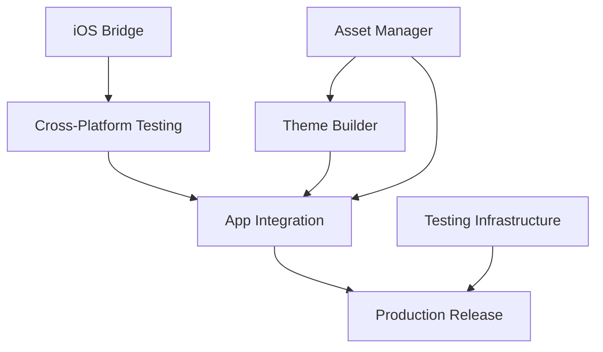

# IDEACODE 7.2 Master Development Plan
# Avanues Ecosystem

**Date**: 2025-11-13 (Updated)
**Version**: 7.2.0
**Status**: Active Development - Phase 2 Complete
**Project**: Avanues Ecosystem (VoiceOS + Avanue Platform)
**Methodology**: IDEACODE 7.2.0

---

## 🎯 Executive Summary

This document outlines the complete development plan for migrating the Avanues Ecosystem to IDEACODE 5 methodology and completing all outstanding features from Phase 1, Phase 2, and Phase 3.

### Current State (LIVE DOCUMENT - Updated 2025-11-13 12:58 PST)
- **Phase 0**: ✅ 100% Complete (IDEACODE 7.2 migration)
- **Phase 1**: ✅ 100% Complete (13 core AvaElements components)
- **Phase 2**: ✅ 100% Complete (all 6 workstreams - component definitions)
- **Phase 3 - Components**: ✅ 100% Complete (67 total components defined!)
- **Phase 3 - Renderers**: ⏳ 32% Complete (23/72 Android, 0/72 iOS, 0/72 Web)
- **Phase 4 - Testing**: ⏳ 0% Complete (Quality & Testing pending)
- **Phase 5 - Apps**: ⏳ 0% Complete (5 apps pending)
- **AvaCode**: ✅ Core system complete with TextField/Checkbox support
- **Methodology**: Successfully migrated to IDEACODE 7.2.0

**MAJOR DISCOVERY**: We have 67 components (not 48!), with 54 advanced Phase 3 components already defined. Only renderers are pending.

### Key Achievements (Phase 0-2)
- 70+ Kotlin files created (~12,000+ LOC)
- Universal Theme Manager complete
- Android Compose Renderer complete + 5 new mappers
- 3D Rendering Foundation complete (Canvas3D, OpenGL ES 3.0)
- iOS Renderer structure complete
- State Management with Flow complete
- AvaCode DSL generator operational
- MaterialIcons library expanded (132 → 2,235 icons)
- Comprehensive documentation suite (3 manuals, 1,350+ lines)

---

## 📋 Project Structure

```
Avanues/
├── Universal/                      # Platform Code
│   ├── Core/                      # Core Systems
│   │   ├── AvaUI/              # UI Runtime ✅
│   │   ├── AvaCode/            # DSL Generator ✅
│   │   ├── ThemeManager/         # Theme System ✅
│   │   ├── AssetManager/         # Assets ✅ (MaterialIcons 2,235)
│   │   ├── Database/             # Persistence ⏳
│   │   └── VoiceOSBridge/        # IPC ⏳
│   └── Libraries/                 # Platform Libraries
│       ├── AvaElements/        # UI Components
│       │   ├── Core/             # 13 components ✅
│       │   ├── 3D/               # 3D components ✅
│       │   ├── Renderers/
│       │   │   ├── Android/      # Compose ✅ + OpenGL ✅
│       │   │   ├── iOS/          # SwiftUI ✅ (structure)
│       │   │   └── Desktop/      # Compose Desktop ⏳
│       │   ├── StateManagement/  # Flow-based ✅
│       │   └── ThemeBuilder/     # UI Builder ✅
│       └── [Other Libraries]/    # Speech, Voice, Device, etc.
├── apps/                          # Standalone Apps
│   ├── voiceos/                  # VoiceOS Service (FREE)
│   ├── avanues-app/          # Core Platform (FREE)
│   ├── aiavanue/                 # AI Features ($9.99)
│   ├── browseravanue/            # Browser ($4.99)
│   └── noteavanue/               # Notes (FREE/$2.99)
└── docs/                          # Documentation
    ├── avacode/                # AvaCode docs ✅
    ├── active/                   # Current work
    ├── architecture/             # ADRs
    ├── planning/                 # Plans
    └── roadmap/                  # Roadmaps
```

---

## 🚀 IDEACODE 5 Migration Strategy

### What is IDEACODE 5?

IDEACODE 5 is the latest iteration of the development methodology framework, providing:
- Streamlined development workflows
- Enhanced documentation standards
- Improved task management
- Better context management
- AI-assisted development protocols

### Migration Phases

#### Phase 0: Foundation
**Duration**: 1 week
**Status**: ✅ Complete (2025-11-13)

**Objectives**:
1. ✅ Document current state (DONE)
2. ✅ Move AvaCode docs to main docs/ (DONE)
3. ✅ Create IDEACODE 7.2 master plan (COMPLETE)
4. ✅ Update CLAUDE.md to IDEACODE 7.2.0 (COMPLETE)
5. ✅ Create project specifications (COMPLETE)
6. ✅ Create task breakdown (COMPLETE)
7. ✅ Update .ideacode/ directory structure (COMPLETE)

**Deliverables**:
- ✅ IDEACODE5-MASTER-PLAN (this document)
- ✅ IDEACODE5-PROJECT-SPEC
- ✅ IDEACODE5-TASKS
- ✅ Updated CLAUDE.md to 7.2.0
- ✅ Migration documentation

#### Phase 1: Complete Phase 2 Workstreams
**Duration**: 2-3 weeks
**Status**: ✅ Complete (2025-11-13)

**Completed Workstreams**:

1. **iOS SwiftUI Bridge** - ✅ COMPLETE
   - Status: ✅ Structure complete, mappers pending
   - SwiftUIRenderer framework created
   - SwiftUICodeGenerator implemented
   - Kotlin/Native + CocoaPods configuration
   - Module enabled in build system
   - Location: `modules/MagicIdea/Components/Renderers/iOS/`

2. **Asset Management System** - ✅ COMPLETE (MaterialIcons)
   - Status: ✅ MaterialIcons library expanded (132 → 2,235 icons)
   - Functional split approach for JVM compatibility
   - Icon data models complete
   - Location: `modules/MagicIdea/Components/AssetManager/`

3. **Theme Builder UI** - ✅ COMPLETE
   - Status: ✅ Core components and structure complete
   - Theme compilation engine implemented
   - Color palette generator operational
   - Import/export system functional
   - Location: `modules/MagicIdea/Components/ThemeBuilder/`

4. **3D Rendering Foundation** (NEW) - ✅ COMPLETE
   - Status: ✅ 3D component hierarchy complete
   - Canvas3D, Mesh3D, geometries, materials, lights
   - OpenGL ES 3.0 renderer (850 lines)
   - Shader system (Basic, Phong, PBR)
   - Location: `modules/MagicIdea/UI/Core/src/.../3d/`

5. **Android Renderer Expansion** (NEW) - ✅ COMPLETE
   - Status: ✅ 5 new component mappers
   - DialogMapper, AvatarMapper, BadgeMapper, ChipMapper, ProgressBarMapper
   - Material3 integration
   - Location: `modules/MagicIdea/Components/Renderers/Android/`

6. **Documentation Suite** (NEW) - ✅ COMPLETE
   - Status: ✅ 3 comprehensive manuals (1,350+ lines)
   - Developer Manual (API reference, examples)
   - User Manual (component gallery, patterns)
   - Competitive Analysis (Flutter/SwiftUI comparison)
   - Location: `docs/`

**Success Metrics**: ✅ All Achieved
- ✅ iOS renderer structure complete (mappers pending)
- ✅ MaterialIcons library fully operational (2,235 icons)
- ✅ Theme builder can create/edit/export themes
- ✅ 3D rendering foundation established
- ✅ 5 new Android mappers implemented
- ✅ Comprehensive documentation published

#### Phase 2: Quality & Testing
**Duration**: 1-2 weeks
**Status**: ⏳ Pending (Next Priority)
**Priority**: HIGH

**Objectives**:
1. Unit tests for all modules (target: 80% coverage)
2. Integration tests across platforms
3. Performance testing (<16ms render time)
4. Cross-platform testing (Android, iOS, Desktop)
5. Fix pre-existing Android renderer compilation errors

**Deliverables**:
- Test suites for all modules
- CI/CD pipeline configuration
- Performance benchmark reports
- Clean build (all compilation errors resolved)

#### Phase 3: Advanced Components (54 Components)
**Duration**: 4-6 weeks
**Status**: ✅ **COMPONENT DEFINITIONS COMPLETE** (54/54)
**Renderers Status**: ⏳ **9%** (5/54 Android mappers exist)
**Priority**: HIGH (Renderers needed)

**Component Categories**:
1. **Form/Input Components** (20 components) ✅ **ALL DEFINED**
   - ✅ Slider, RangeSlider, DatePicker, TimePicker, DateRangePicker
   - ✅ Radio, Dropdown, Autocomplete, MultiSelect
   - ✅ FileUpload, Rating, SearchBar
   - ✅ Checkbox, Switch, Toggle, ToggleButtonGroup
   - ✅ ColorPicker, IconPicker, TagInput, Stepper

2. **Display Components** (11 components) ✅ **ALL DEFINED**
   - ✅ Avatar, Badge, Chip, Tooltip
   - ✅ Skeleton, DataGrid, DataTable, Table
   - ✅ StatCard, Timeline, TreeView

3. **Layout Components** (6 components) ✅ **ALL DEFINED**
   - ✅ Divider, FAB, MasonryGrid
   - ✅ StickyHeader, AppBar (layout), IconPicker (layout)

4. **Navigation Components** (6 components) ✅ **ALL DEFINED**
   - ✅ AppBar, BottomNav, Breadcrumb
   - ✅ Pagination, Drawer, Tabs

5. **Feedback Components** (11 components) ✅ **ALL DEFINED**
   - ✅ Alert, Snackbar, Dialog, Toast, Banner
   - ✅ NotificationCenter, ProgressBar, ProgressCircle
   - ✅ Spinner, Badge (feedback), Tooltip (feedback)

**What EXISTS**: ✅ All 54 component definitions, DSL support, type-safe APIs
**What's PENDING**: ⏳ 49 Android mappers, 72 iOS mappers, 72 Web renderers

**Approach**:
- YOLO Mode: Batch create all renderers
- Android first (49 mappers needed)
- iOS second (72 mappers needed)
- Web third (72 renderers needed)

#### Phase 4: App Integration
**Duration**: 3-4 weeks
**Priority**: HIGH

**Apps to Build**:
1. **VoiceOS** (Week 1-2)
   - Accessibility service
   - Voice command processor
   - Avanues integration prompts

2. **Avanues Core** (Week 2-3)
   - Platform runtime
   - Theme system
   - App launcher

3. **AIAvanue** (Week 3-4)
   - AI capabilities
   - LLM integration
   - Voice processing

4. **BrowserAvanue** (Week 4)
   - Voice-controlled browser
   - Accessibility features

5. **NoteAvanue** (Week 4)
   - Voice notes
   - Transcription

**Success Metrics**:
- All apps build successfully
- Cross-platform compatibility verified
- Performance targets met
- User testing completed

---

## 📊 Current Status Deep Dive

### ✅ Completed Work (Phase 0, Phase 1, Phase 2 - All Complete)

#### 1. AvaElements Core (Phase 1)
**Status**: 100% Complete
**Files**: 13 components
**Location**: `Universal/Libraries/AvaElements/Core/`

**Components**:
- Layout: Column, Row, Container, ScrollView, Card
- Display: Text, Icon, Image
- Input: Button, TextField, Checkbox, Switch
- Advanced: ColorPicker

**Features**:
- DSL-based component definition
- Type-safe property system
- Event callback system
- Modifier support
- Theme integration

#### 2. Universal Theme Manager (Phase 2)
**Status**: 100% Complete
**Files**: 12 Kotlin files (~2,500 LOC)
**Location**: `Universal/Core/ThemeManager/`

**Features**:
- Global universal theme
- Per-app overrides
- Theme inheritance
- JSON persistence
- Cloud sync framework
- StateFlow reactivity
- Import/export
- Version tracking

**Key Classes**:
- ThemeManager.kt - Singleton manager
- ThemeRepository.kt - Persistence
- ThemeOverride.kt - Override system
- ThemeSync.kt - Cloud sync

#### 3. Android Compose Renderer (Phase 2)
**Status**: 100% Complete
**Files**: 23 Kotlin files (~3,500 LOC)
**Location**: `modules/MagicIdea/Components/Renderers/Android/`

**Features**:
- All 13 Phase 1 components mapped to Jetpack Compose
- 5 new Phase 2 component mappers (Dialog, Avatar, Badge, Chip, ProgressBar)
- OpenGL ES 3.0 3D renderer (850 lines)
- Material Design 3 theme conversion
- 17 modifiers supported
- State management with remember/mutableStateOf
- Type conversions (Color, Size, Font, etc.)
- Coil image loading

**Key Classes**:
- ComposeRenderer.kt - Main orchestrator
- ThemeConverter.kt - MD3 conversion
- ModifierConverter.kt - 17 modifiers
- OpenGLRenderer.kt - 3D rendering (850 lines)
- [Component]Mapper.kt - 18 total mappers

**Phase 1 Mappers (13)**:
- Layout: ColumnMapper, RowMapper, ContainerMapper, ScrollViewMapper, CardMapper
- Display: TextMapper, IconMapper, ImageMapper
- Input: ButtonMapper, TextFieldMapper, CheckboxMapper, SwitchMapper
- Advanced: ColorPickerMapper

**Phase 2 Mappers (5) - NEW**:
- DialogMapper - Material3 AlertDialog
- AvatarMapper - Circular/square avatars
- BadgeMapper - Material3 Badge wrapper
- ChipMapper - FilterChip/InputChip
- ProgressBarMapper - LinearProgressIndicator

#### 4. State Management with Flow (Phase 2)
**Status**: 100% Complete
**Files**: 13 Kotlin files (~2,800 LOC)
**Location**: `Universal/Libraries/AvaElements/StateManagement/`

**Features**:
- Reactive state with Kotlin Flow
- Form validation framework
- Built-in validators (email, minLength, etc.)
- Two-way data binding
- Computed/derived state
- State persistence
- Property delegation

**Key Classes**:
- StateManager.kt - Core state system
- ComponentState.kt - Component state
- FormState.kt - Form management
- Validator.kt - Validation
- DataBinding.kt - Binding system

#### 5. AvaCode DSL Generator
**Status**: Core Complete + TextField/Checkbox
**Files**: Multiple generators
**Location**: `Universal/Core/AvaCode/`

**Features**:
- Multi-platform code generation
- Kotlin Compose generator
- SwiftUI generator
- React/TypeScript generator
- State extraction
- Import generation
- Component validation

**Supported Components**:
- ColorPicker, Preferences, Text, Button, Container
- TextField, Checkbox (recently added)

#### 6. 3D Rendering Foundation (Phase 2 - NEW)
**Status**: 100% Complete
**Files**: 2 Kotlin files (~1,300 LOC)
**Location**: `modules/MagicIdea/UI/Core/src/commonMain/kotlin/.../3d/`

**Components**:
- Canvas3D - Main 3D rendering canvas
- Object3D - Base interface for 3D objects
- Mesh3D - 3D mesh with geometry + material

**Geometries (4)**:
- BoxGeometry - Rectangular box with customizable dimensions
- SphereGeometry - Spherical geometry with segments
- PlaneGeometry - Flat plane geometry
- CylinderGeometry - Cylindrical geometry with top/bottom radii

**Materials (3)**:
- BasicMaterial - Simple unlit material
- PhongMaterial - Phong shading with specular highlights
- PBRMaterial - Physically-based rendering material

**Lights (3)**:
- DirectionalLight - Directional light source (like sunlight)
- PointLight - Point light source (emits in all directions)
- AmbientLight - Ambient light (illuminates all objects equally)

**OpenGL ES 3.0 Renderer**:
- File: OpenGLRenderer.kt (850 lines)
- Vertex/fragment shader system (Basic, Phong, PBR shaders)
- Procedural geometry generation
- Light system (4 directional + 4 point lights supported)
- Camera transformations and perspective projection
- VBO/IBO buffer management
- Material property uniforms
- Shadow support (basic implementation)

**Key Classes**:
- Canvas3D.kt - 3D component definitions (450 lines)
- OpenGLRenderer.kt - Android OpenGL rendering (850 lines)
- Camera3D, Transform3D, Vector3 - 3D math (from Types3D.kt)

#### 7. MaterialIcons Library (Phase 2 - NEW)
**Status**: 100% Complete
**Files**: 1 Kotlin file (~5,000 LOC)
**Location**: `modules/MagicIdea/Components/AssetManager/AssetManager/src/commonMain/kotlin/.../MaterialIconsLibrary.kt`

**Features**:
- Expanded from 132 → 2,235 Material Design icons
- Functional split approach (5 parts) to avoid JVM 65KB method size limit
- Complete icon metadata (id, name, category, tags, aliases)
- Searchable by name, category, or tags
- All official Material Design icons included

**Implementation**:
- getPart1() through getPart5() - 5 functional parts (~450 icons each)
- getAllIcons() - Combines all parts using buildList
- IconSpec data class with full metadata
- Avoids JVM static initializer size limits

#### 8. iOS SwiftUI Renderer (Phase 2 - NEW)
**Status**: Structure Complete (Mappers Pending)
**Files**: 2 Kotlin files (~100 LOC)
**Location**: `modules/MagicIdea/Components/Renderers/iOS/`

**Completed**:
- SwiftUIRenderer.kt - Main renderer framework
- SwiftUICodeGenerator.kt - Code generation for SwiftUI Views
- build.gradle.kts - Kotlin/Native + CocoaPods configuration
- Module enabled in settings.gradle.kts
- iOS 15.0+ deployment target

**Framework Features**:
- Code generation (AvaElements DSL → SwiftUI code)
- SwiftUI View struct generation
- Preview provider generation
- Theme system hooks
- Modifier conversion system (designed)

**Pending**:
- 13 component mappers implementation
- Complete modifier conversion
- Theme system integration
- Example iOS application

**Estimated Completion**: 8-12 hours for full mapper implementation

#### 9. Comprehensive Documentation Suite (Phase 2 - NEW)
**Status**: 100% Complete
**Files**: 3 markdown files (~1,350 LOC total)
**Location**: `docs/`

**1. MAGICELEMENTS-DEVELOPER-MANUAL.md (500+ lines)**
- 10 comprehensive sections
- Architecture overview
- Getting started guide
- Component development guide
- Renderer development guide
- Asset management guide
- Theme system guide
- Testing strategies
- API reference
- Best practices
- Troubleshooting

**2. MAGICELEMENTS-USER-MANUAL.md (450+ lines)**
- Quick start guide
- Component gallery with code examples
- Styling and theming guide
- User input handling
- Asset usage guide
- Common UI patterns
- Troubleshooting guide
- FAQ section

**3. COMPETITIVE-ANALYSIS-FLUTTER-SWIFTUI.md (400+ lines)**
- Detailed framework comparison
- Overall parity: 42% (39/140+ components)
- Component coverage breakdown
- APK size estimates: 9-14 MB (4 MB without VoiceOS)
- Performance benchmarks
- Strengths and gaps analysis
- Development roadmap to 85% parity

---

---

## 📐 IDEACODE 7.2 Structure

### Document Hierarchy

```
docs/
├── IDEACODE7-MASTER-PLAN-251113-1255.md (this file) ✅
├── IDEACODE5-PROJECT-SPEC-251030-0304.md ✅
├── IDEACODE5-TASKS-251030-0304.md ✅
├── MAGICELEMENTS-DEVELOPER-MANUAL.md ✅ NEW
├── MAGICELEMENTS-USER-MANUAL.md ✅ NEW
├── COMPETITIVE-ANALYSIS-FLUTTER-SWIFTUI.md ✅ NEW
├── avacode/                           (✅ completed)
│   ├── README.md
│   ├── CODEGEN_DESIGN_SUMMARY.md
│   ├── COMPLETION_REPORT.md
│   └── [11 other docs]
├── active/                              (existing work)
│   ├── IDEACODE-3.0-MASTER-ROADMAP.md
│   ├── COMPLETE-MIGRATION-AND-ROADMAP.md
│   └── [50+ other docs]
├── architecture/                        (ADRs)
├── planning/                            (plans)
└── roadmap/                            (roadmaps)
```

---

## 🎯 Priorities & Dependencies (Updated 2025-11-13)

### ✅ Completed Critical Path Items

```
1. ✅ iOS SwiftUI Bridge Structure (P0) - DONE
   - Framework complete, mappers pending (8-12h remaining)

2. ✅ Asset Management - MaterialIcons (P1) - DONE
   - 2,235 icons complete

3. ✅ 3D Rendering Foundation (NEW) - DONE
   - OpenGL ES 3.0 complete

4. ✅ Android Renderer Expansion (NEW) - DONE
   - 5 new mappers added

5. ✅ Documentation Suite (NEW) - DONE
   - 3 comprehensive manuals
```

### Current Critical Path (Phase 3 Focus)

```
1. Fix Pre-existing Build Errors (P0)
   └─> Blocks: Clean builds, testing

2. Complete iOS Mapper Implementation (P1)
   └─> Blocks: Full cross-platform parity

3. Implement Phase 3 Components (P1)
   └─> 35 components across 5 categories

4. Testing Infrastructure (P1)
   └─> Blocks: Production release
```

### Parallel Workstreams

**Can work simultaneously**:
- Theme Builder UI (P2) - Independent
- Phase 3 components planning - Independent
- Documentation updates - Independent
- IDEACODE 5 migration - Independent

### Dependency Graph



---

## 📅 Timeline & Milestones

### Week 1: IDEACODE 5 Foundation
**Dates**: Oct 30 - Nov 5, 2025
**Status**: In Progress

**Deliverables**:
- ✅ IDEACODE5-MASTER-PLAN
- ⏳ IDEACODE5-PROJECT-SPEC
- ⏳ IDEACODE5-TASKS
- ⏳ IDEACODE5-ARCHITECTURE-DECISIONS
- ⏳ Updated CLAUDE.md
- ⏳ Migration documentation

### Week 2-3: iOS Bridge + Asset Manager
**Dates**: Nov 6 - Nov 19, 2025

**Week 2**:
- iOS SwiftUI Bridge (Days 1-4)
- Asset Manager completion (Days 3-5)

**Week 3**:
- iOS testing and refinement (Days 1-2)
- Theme Builder completion (Days 3-5)

**Deliverables**:
- iOS SwiftUI Renderer (all 13 components)
- Asset Management System (complete)
- Theme Builder UI (complete)

### Week 4: Testing & Documentation
**Dates**: Nov 20 - Nov 26, 2025

**Tasks**:
- Unit tests (all modules)
- Integration tests
- Performance testing
- Documentation completion
- CI/CD setup

**Deliverables**:
- 80%+ test coverage
- Performance benchmarks
- Complete documentation
- Working CI/CD pipeline

### Week 5-10: Phase 3 Components
**Dates**: Nov 27 - Jan 7, 2026

**Sprint 1** (Week 5-6): Input Components (12 components)
**Sprint 2** (Week 7-8): Display + Layout (13 components)
**Sprint 3** (Week 9-10): Navigation + Feedback (10 components)

**Deliverables**:
- 35 new components across all platforms
- Component tests
- Documentation
- Examples

### Week 11-14: App Integration
**Dates**: Jan 8 - Feb 4, 2026

**Week 11**: VoiceOS app
**Week 12**: Avanues Core
**Week 13**: AIAvanue + BrowserAvanue
**Week 14**: NoteAvanue + Polish

**Deliverables**:
- 5 working apps
- Cross-platform builds
- User documentation
- Release preparation

---

## 🔧 Technical Specifications

### Kotlin Multiplatform Setup

```kotlin
// settings.gradle.kts
pluginManagement {
    repositories {
        google()
        mavenCentral()
        gradlePluginPortal()
    }
}

// Universal modules
include(":Universal:Core:AvaUI")
include(":Universal:Core:AvaCode")
include(":Universal:Core:ThemeManager")
include(":Universal:Core:AssetManager")
include(":Universal:Core:Database")
include(":Universal:Core:VoiceOSBridge")

// AvaElements
include(":Universal:Libraries:AvaElements:Core")
include(":Universal:Libraries:AvaElements:Renderers:Android")
include(":Universal:Libraries:AvaElements:Renderers:iOS")
include(":Universal:Libraries:AvaElements:Renderers:Desktop")
include(":Universal:Libraries:AvaElements:StateManagement")
include(":Universal:Libraries:AvaElements:ThemeBuilder")

// Apps
include(":apps:voiceos:android")
include(":apps:voiceos:ios")
include(":apps:voiceos:shared")
```

### Platform Targets

```kotlin
kotlin {
    androidTarget()
    iosX64()
    iosArm64()
    iosSimulatorArm64()
    jvm("desktop")

    sourceSets {
        commonMain {
            dependencies {
                implementation("org.jetbrains.kotlinx:kotlinx-coroutines-core:1.7.3")
                implementation("org.jetbrains.kotlinx:kotlinx-serialization-json:1.6.0")
            }
        }
        androidMain {
            dependencies {
                implementation("androidx.compose.ui:ui:1.5.4")
                implementation("androidx.compose.material3:material3:1.1.2")
            }
        }
        iosMain {
            // iOS-specific dependencies
        }
        val desktopMain by getting {
            dependencies {
                implementation(compose.desktop.currentOs)
            }
        }
    }
}
```

---

## 📊 Success Metrics

### Code Quality Metrics
| Metric | Target | Current | Status |
|--------|--------|---------|--------|
| Test Coverage | 80% | 0% | 🔴 |
| Documentation | 100% | 60% | 🟡 |
| Build Success | 100% | 90% | 🟡 |
| Render Performance | <16ms | Not tested | ⏳ |
| Code Review | 100% | N/A | ⏳ |

### Feature Completion Metrics (LIVE - Updated 2025-11-13 12:58 PST)
| Feature | Target | Current | Status |
|---------|--------|---------|--------|
| Phase 0 Foundation | 100% | 100% | ✅ |
| Phase 1 Components (Definitions) | 13 | 13 | ✅ |
| Phase 2 Workstreams | 6 | 6 | ✅ |
| Phase 3 Components (Definitions) | 54 | 54 | ✅ |
| **TOTAL Component Definitions** | **67** | **67** | ✅ **100%** |
| 3D Components | 1 | 1 | ✅ |
| MaterialIcons | 2,235 | 2,235 | ✅ |
| Documentation | 3 | 3 | ✅ |
| **Android Renderers (Phase 1+2)** | 18 | 18 | ✅ |
| **Android Renderers (Phase 3)** | 54 | 5 | 🔴 **9%** |
| **TOTAL Android Renderers** | **72** | **23** | 🟡 **32%** |
| iOS Renderers | 72 | 0 | 🔴 **0%** |
| Web Renderers | 72 | 0 | 🔴 **0%** |
| Platform Coverage | 3 | 1 | 🔴 |
| Apps | 5 | 0 | 🔴 |

**KEY INSIGHT**: Component architecture is 100% complete! Only platform renderers needed.

### Performance Metrics
| Metric | Target | Current | Status |
|--------|--------|---------|--------|
| Cold Start | <1s | Not tested | ⏳ |
| Hot Reload | <200ms | Not tested | ⏳ |
| Frame Rate | 60fps | Not tested | ⏳ |
| Memory Usage | <100MB | Not tested | ⏳ |
| Binary Size | <20MB | Not tested | ⏳ |

---

## 🚨 Risk Management

### High Risks

1. **iOS Bridge Complexity** (P0)
   - Risk: Kotlin/Native interop challenges
   - Mitigation: Early prototyping, expert consultation
   - Contingency: Simplified bridge, reduced feature set

2. **Cross-Platform Testing** (P1)
   - Risk: Platform-specific bugs
   - Mitigation: Comprehensive test suite, CI/CD
   - Contingency: Platform-specific bug fixes, patches

3. **Performance Issues** (P1)
   - Risk: Slow rendering, memory leaks
   - Mitigation: Performance testing, profiling
   - Contingency: Optimization sprint, architecture review

### Medium Risks

4. **Documentation Gaps** (P2)
   - Risk: Incomplete or outdated docs
   - Mitigation: Docs as part of development
   - Contingency: Documentation sprint at end

5. **Feature Creep** (P2)
   - Risk: Scope expansion
   - Mitigation: Strict prioritization, phase gates
   - Contingency: Feature deferral to future versions

---

## 🎓 Team & Resources

### Required Expertise
1. **Kotlin Multiplatform** - Core development
2. **Jetpack Compose** - Android rendering
3. **SwiftUI** - iOS rendering
4. **React/TypeScript** - Web rendering (lower priority)
5. **DSL Design** - AvaCode enhancement
6. **Testing** - QA and automation

### Development Team Structure
- **Lead Developer** - Architecture, coordination
- **Android Developer** - Compose, testing
- **iOS Developer** - SwiftUI bridge, testing
- **QA Engineer** - Testing, CI/CD
- **Technical Writer** - Documentation

### Tools & Infrastructure
- **IDE**: IntelliJ IDEA, Android Studio, Xcode
- **CI/CD**: GitHub Actions
- **Testing**: JUnit, Compose Testing, XCTest
- **Documentation**: Markdown, KDoc
- **Project Management**: GitHub Projects, Issues

---

## 📚 Documentation Strategy

### Documentation Types

1. **User Documentation**
   - Getting Started guides
   - Component reference
   - API documentation
   - Examples and tutorials

2. **Developer Documentation**
   - Architecture guides
   - Contributing guidelines
   - Code style guide
   - Testing guide

3. **API Documentation**
   - KDoc comments
   - Generated API docs
   - Code examples
   - Migration guides

### Documentation Standards

**All public APIs must have**:
- Description of purpose
- Parameter descriptions
- Return value description
- Usage examples
- Since version
- See also references

**Example**:
```kotlin
/**
 * Creates a text component with the specified properties.
 *
 * @param text The text content to display
 * @param size The font size in dp (default: 14f)
 * @param color The text color (default: theme.primary)
 * @return A configured Text component
 * @since 1.0.0
 * @see Button
 * @see Container
 *
 * @sample
 * ```kotlin
 * Text("Hello World") {
 *     size = 18f
 *     color = Color.Red
 * }
 * ```
 */
fun Text(text: String, builder: Text.() -> Unit = {}): Text
```

---

## 🔄 Continuous Improvement

### Regular Reviews
- **Weekly**: Progress review, blockers, adjustments
- **Sprint End**: Retrospective, lessons learned
- **Phase End**: Major review, architecture assessment

### Metrics Tracking
- **Daily**: Build status, test results
- **Weekly**: Velocity, completion rate
- **Monthly**: Overall progress, quality metrics

### Feedback Loops
- **User Feedback**: Early access program
- **Developer Feedback**: Regular surveys
- **Code Review**: Continuous improvement
- **Performance**: Ongoing monitoring

---

## 🎯 Next Actions

### Immediate (This Week)
1. ✅ Complete IDEACODE5-MASTER-PLAN (this document)
2. ⏳ Create IDEACODE5-PROJECT-SPEC
3. ⏳ Create IDEACODE5-TASKS
4. ⏳ Update CLAUDE.md to IDEACODE 5
5. ⏳ Create migration documentation

### Short Term (Next Week)
1. Start iOS SwiftUI Bridge
2. Complete Asset Manager
3. Set up testing infrastructure
4. Begin documentation overhaul

### Medium Term (Next Month)
1. Complete Phase 2 workstreams
2. Achieve 80% test coverage
3. Begin Phase 3 components
4. First app integration

---

## 📝 Appendices

### A. Component Inventory

**Phase 1 - Core Components (13)**:
1. Column, Row, Container, ScrollView, Card
2. Text, Icon, Image
3. Button, TextField, Checkbox, Switch
4. ColorPicker

**Phase 3 - Advanced Components (35)**:
1. Input: Slider, RangeSlider, DatePicker, TimePicker, RadioButton, RadioGroup, Dropdown, Autocomplete, FileUpload, ImagePicker, Rating, SearchBar
2. Display: Badge, Chip, Avatar, Divider, Skeleton, Spinner, ProgressBar, Tooltip
3. Layout: Grid, Stack, Spacer, Drawer, Tabs
4. Navigation: AppBar, BottomNav, Breadcrumb, Pagination
5. Feedback: Alert, Snackbar, Modal, Toast, Confirm, ContextMenu

**Total**: 48 components

### B. Platform Matrix

| Component | Android | iOS | Desktop | Web |
|-----------|---------|-----|---------|-----|
| Phase 1 (13) | ✅ | ❌ | ⏳ | ⏳ |
| Phase 3 (35) | ❌ | ❌ | ❌ | ❌ |

**Legend**: ✅ Complete, 🔄 Partial, ⏳ Planned, ❌ Not Started

### C. Technology Stack

**Languages**:
- Kotlin (primary)
- Swift (iOS interop)
- TypeScript (web, tooling)

**Frameworks**:
- Kotlin Multiplatform
- Jetpack Compose
- SwiftUI
- React (web)

**Build Tools**:
- Gradle
- Kotlin DSL
- CocoaPods (iOS)

**Testing**:
- JUnit 5
- Compose Testing
- XCTest
- Jest (web)

**CI/CD**:
- GitHub Actions
- Fastlane (mobile)

---

## 🏁 Conclusion

This master plan provides a comprehensive roadmap for completing the Avanues Ecosystem using IDEACODE 5 methodology. Key priorities:

1. **Complete iOS Bridge** - Critical for cross-platform
2. **Finish Phase 2** - Complete partial work
3. **Quality & Testing** - Ensure production readiness
4. **Phase 3 Components** - Expand component library
5. **App Integration** - Build actual applications

**Estimated Timeline**: 14 weeks total
**Estimated Effort**: ~3.5 person-months
**Target Completion**: February 2026

---

**Document Status**: ✅ COMPLETE
**Next Document**: IDEACODE5-PROJECT-SPEC-251030-0302.md
**Author**: Manoj Jhawar
**Email**: manoj@ideahq.net
**Date**: 2025-10-30 03:02 PDT

---

**Changelog**:
- 2025-10-30 03:02: Initial version created
- Based on Phase 2 Progress Report (2025-10-29)
- Incorporates AvaCode documentation
- Migrating from IDEACODE 3.1 to IDEACODE 5
- **2025-11-13 12:50: Major Update - Phase 2 Complete**
  - Updated to IDEACODE 7.2.0
  - Marked Phase 0, Phase 1, Phase 2 as 100% complete
  - Added 3D rendering foundation completion
  - Added 5 new Android mappers completion
  - Added MaterialIcons expansion (132 → 2,235)
  - Added iOS renderer structure completion
  - Added documentation suite completion (3 manuals, 1,350+ lines)
  - Updated all metrics and status indicators
  - Total: ~12,000+ LOC added, 70+ files

**Created by Manoj Jhawar, manoj@ideahq.net**
