# AVAMagic Developer Manual

**Version:** 1.0.0
**Last Updated:** 2025-11-16
**Target Audience:** Software Engineers, Technical Leads, Platform Developers
**Prerequisite Knowledge:** Kotlin, Android SDK, Jetpack Compose, iOS/SwiftUI (for iOS), React (for Web)

---

## Table of Contents

### Part I: Getting Started
1. [Introduction](#1-introduction)
2. [Environment Setup](#2-environment-setup)
3. [Project Structure](#3-project-structure)
4. [Hello World Example](#4-hello-world-example)

### Part II: Core Architecture
5. [System Architecture Overview](#5-system-architecture-overview)
6. [AVAMagic Framework Design](#6-avamagic-framework-design)
7. [Component Lifecycle](#7-component-lifecycle)
8. [State Management](#8-state-management)
9. [Theme System](#9-theme-system)

### Part III: Development Workflows
10. [Designing UIs with DSL](#10-designing-uis-with-dsl)
11. [Code Generation](#11-code-generation)
12. [Platform Renderers](#12-platform-renderers)
13. [Voice Integration](#13-voice-integration)
14. [IPC Communication](#14-ipc-communication)

### Part III-B: IPC & Infrastructure Modules
14a. [DSL Serializer (Ultracompact Format)](#14a-dsl-serializer)
14b. [Observability System](#14b-observability-system)
14c. [Plugin Failure Recovery](#14c-plugin-failure-recovery)

### Part IV: Platform-Specific Development
15. [Android Development](#15-android-development)
16. [iOS Development](#16-ios-development)
17. [Web Development](#17-web-development)
18. [Desktop Development](#18-desktop-development)

### Part V: Advanced Topics
19. [Custom Component Development](#19-custom-component-development)
20. [Plugin Development](#20-plugin-development)
21. [Performance Optimization](#21-performance-optimization)
22. [Security Best Practices](#22-security-best-practices)

### Part VI: Testing & Quality
23. [Testing Strategy](#23-testing-strategy)
24. [Debugging Techniques](#24-debugging-techniques)
25. [CI/CD Pipeline](#25-cicd-pipeline)

### Part VII: Reference
26. [API Reference](#26-api-reference)
27. [DSL Syntax Reference](#27-dsl-syntax-reference)
28. [Troubleshooting Guide](#28-troubleshooting-guide)
29. [FAQ](#29-faq)

---

# Part I: Getting Started

## 1. Introduction

### What is AVAMagic?

AVAMagic is a **cross-platform UI framework** that enables developers to design user interfaces once and deploy them across Android, iOS, Web, and Desktop platforms with 90%+ code reuse.

```
┌─────────────────────────────────────────────────────────────────┐
│                    AVAMAGIC DEVELOPMENT FLOW                    │
├─────────────────────────────────────────────────────────────────┤
│                                                                 │
│  1. DESIGN (AVAMagic DSL)                                       │
│  ┌─────────────────────────────────────────────────────────┐   │
│  │ Screen "UserProfile" {                                  │   │
│  │   Column(spacing: 16.dp) {                              │   │
│  │     Avatar(url: $user.avatarUrl, size: 72.dp)           │   │
│  │     Text($user.name, style: "headlineLarge")            │   │
│  │     Text($user.email, style: "bodyMedium")              │   │
│  │     Button("Edit Profile", onClick: editProfile)        │   │
│  │   }                                                      │   │
│  │ }                                                        │   │
│  └─────────────────────────────────────────────────────────┘   │
│                                                                 │
│  2. GENERATE (Platform Code)                                    │
│  ┌──────────────┬──────────────┬──────────────┬──────────────┐ │
│  │ Android      │ iOS          │ Web          │ Desktop      │ │
│  │ (Compose)    │ (SwiftUI)    │ (React)      │ (Compose)    │ │
│  ├──────────────┼──────────────┼──────────────┼──────────────┤ │
│  │ @Composable  │ struct       │ function     │ @Composable  │ │
│  │ fun User...  │ UserProfile  │ UserProfile  │ fun User...  │ │
│  └──────────────┴──────────────┴──────────────┴──────────────┘ │
│                                                                 │
│  3. DEPLOY (Build & Run)                                        │
│  ┌──────────────┬──────────────┬──────────────┬──────────────┐ │
│  │ 📱 Android   │ 🍎 iOS       │ 🌐 Web       │ 🖥️  Desktop  │ │
│  │ APK/AAB      │ IPA          │ PWA          │ DMG/EXE/DEB  │ │
│  └──────────────┴──────────────┴──────────────┴──────────────┘ │
└─────────────────────────────────────────────────────────────────┘
```

### Key Features

- **🎨 Magic Mode** - Ultra-compact syntax (3 lines vs 30) with 90% code reduction
- **🔌 Logic Wiring** - Declarative state management (95% less logic code)
- **📱 Cross-Platform** - Android, iOS, Web, Desktop from one codebase
- **🧩 250+ Components** - Production-ready components across 18 categories
- **📤 4 Export Formats** - AVU, Kotlin, Swift, JavaScript for maximum flexibility
- **🗣️ Auto Voice Integration** - 1 line config vs 70-120 lines (99% reduction)
- **🎭 Theming** - Material 3, Cupertino, Fluent, and custom themes
- **⚡ Hot Reload** - See changes instantly during development
- **🔄 IPC Ready** - Inter-process communication for microservices

---

## 2. Environment Setup

### Prerequisites

```
┌─────────────────────────────────────────────────────────────────┐
│                     DEVELOPMENT ENVIRONMENT                     │
├─────────────────────────────────────────────────────────────────┤
│                                                                 │
│  REQUIRED SOFTWARE                                              │
│  ┌─────────────────────────────────────────────────────────┐   │
│  │ • JDK 17 or higher (OpenJDK or Oracle)                  │   │
│  │ • Android Studio Hedgehog (2023.1.1) or newer          │   │
│  │ • Kotlin 1.9.20+                                        │   │
│  │ • Gradle 8.2+                                           │   │
│  │ • Git 2.30+                                             │   │
│  └─────────────────────────────────────────────────────────┘   │
│                                                                 │
│  OPTIONAL (FOR MULTI-PLATFORM)                                  │
│  ┌─────────────────────────────────────────────────────────┐   │
│  │ • Xcode 15+ (for iOS development, macOS only)           │   │
│  │ • Node.js 18+ (for Web development)                     │   │
│  │ • npm or yarn (for Web dependencies)                    │   │
│  └─────────────────────────────────────────────────────────┘   │
│                                                                 │
│  RECOMMENDED TOOLS                                              │
│  ┌─────────────────────────────────────────────────────────┐   │
│  │ • VS Code (for DSL editing)                             │   │
│  │ • IntelliJ IDEA (alternative to Android Studio)         │   │
│  │ • Android Emulator or physical device                   │   │
│  │ • iOS Simulator (macOS) or physical device              │   │
│  └─────────────────────────────────────────────────────────┘   │
└─────────────────────────────────────────────────────────────────┘
```

### Installation Steps

#### Step 1: Clone Repository

```bash
git clone https://github.com/ideahq/avanues.git
cd avanues
```

#### Step 2: Install AVAMagic Framework

```bash
# Navigate to AVAMagic root
cd modules/AVAMagic

# Build and publish to local Maven
./gradlew publishToMavenLocal

# Output:
# ✅ Published: com.ideahq.avamagic:ui-core:1.0.0
# ✅ Published: com.ideahq.avamagic:ui-foundation:1.0.0
# ✅ Published: com.ideahq.avamagic:renderers-android:1.0.0
# ... (28 modules published)
```

#### Step 3: Configure Your Project

```kotlin
// settings.gradle.kts
pluginManagement {
    repositories {
        google()
        mavenCentral()
        gradlePluginPortal()
        mavenLocal() // For local AVAMagic builds
    }
}

dependencyResolutionManagement {
    repositoriesMode.set(RepositoriesMode.FAIL_ON_PROJECT_REPOS)
    repositories {
        google()
        mavenCentral()
        mavenLocal()
    }
}
```

```kotlin
// build.gradle.kts (app module)
plugins {
    id("com.android.application")
    id("org.jetbrains.kotlin.android")
}

android {
    namespace = "com.example.myapp"
    compileSdk = 34

    defaultConfig {
        applicationId = "com.example.myapp"
        minSdk = 24
        targetSdk = 34
        versionCode = 1
        versionName = "1.0"
    }

    buildFeatures {
        compose = true
    }

    composeOptions {
        kotlinCompilerExtensionVersion = "1.5.4"
    }
}

dependencies {
    // AVAMagic Core
    implementation("com.ideahq.avamagic:ui-core:1.0.0")
    implementation("com.ideahq.avamagic:ui-foundation:1.0.0")
    implementation("com.ideahq.avamagic:renderers-android:1.0.0")

    // Jetpack Compose
    implementation("androidx.compose.ui:ui:1.5.4")
    implementation("androidx.compose.material3:material3:1.1.2")
    implementation("androidx.activity:activity-compose:1.8.1")
}
```

#### Step 4: Verify Installation

```bash
./gradlew :app:dependencies | grep avamagic

# Expected output:
# ├── com.ideahq.avamagic:ui-core:1.0.0
# ├── com.ideahq.avamagic:ui-foundation:1.0.0
# └── com.ideahq.avamagic:renderers-android:1.0.0
```

### Installation Verification Workflow

```mermaid
flowchart TD
    START([Start Installation])

    CLONE[Clone Repository]
    BUILD_AVAMAGIC[Build AVAMagic Framework]
    PUBLISH[Publish to Maven Local]

    CREATE_PROJECT[Create New Android Project]
    ADD_DEPS[Add AVAMagic Dependencies]

    SYNC{Gradle Sync<br/>Successful?}

    RESOLVE_DEPS[Resolve Dependencies]
    VERIFY[Verify Installation]

    ERROR_DEPS[Check build.gradle.kts<br/>Check Maven Local]

    BUILD_APP[Build App Module]

    BUILD_SUCCESS{Build<br/>Successful?}

    ERROR_BUILD[Check Kotlin Version<br/>Check Compose Version]

    SUCCESS([✅ Installation Complete])

    START --> CLONE
    CLONE --> BUILD_AVAMAGIC
    BUILD_AVAMAGIC --> PUBLISH

    PUBLISH --> CREATE_PROJECT
    CREATE_PROJECT --> ADD_DEPS
    ADD_DEPS --> SYNC

    SYNC -->|Yes| RESOLVE_DEPS
    SYNC -->|No| ERROR_DEPS
    ERROR_DEPS --> ADD_DEPS

    RESOLVE_DEPS --> VERIFY
    VERIFY --> BUILD_APP

    BUILD_APP --> BUILD_SUCCESS

    BUILD_SUCCESS -->|Yes| SUCCESS
    BUILD_SUCCESS -->|No| ERROR_BUILD
    ERROR_BUILD --> BUILD_APP

    style START fill:#4CAF50,stroke:#2E7D32,color:#fff
    style SUCCESS fill:#4CAF50,stroke:#2E7D32,color:#fff
    style ERROR_DEPS fill:#F44336,stroke:#C62828,color:#fff
    style ERROR_BUILD fill:#F44336,stroke:#C62828,color:#fff
```



---

## 3. Project Structure

### AVAMagic Framework Structure

```
avanues/
├── modules/
│   └── AVAMagic/                          # Framework root
│       ├── UI/                             # UI module family (8 modules)
│       │   ├── Foundation/                 # Base types, interfaces
│       │   ├── Core/                       # 48 component definitions
│       │   ├── CoreTypes/                  # Type aliases, sealed classes
│       │   ├── DesignSystem/               # Material 3 tokens
│       │   ├── StateManagement/            # State primitives
│       │   ├── ThemeManager/               # Theme system
│       │   ├── ThemeBridge/                # Theme conversions
│       │   └── build.gradle.kts
│       │
│       ├── Code/                           # Code module family (3 modules)
│       │   ├── Forms/                      # Forms DSL
│       │   ├── Workflows/                  # Workflows DSL
│       │   └── Code/                       # Code generator
│       │
│       ├── Data/                           # Data module (1 module)
│       │   └── Data/                       # Hybrid key-value + document DB
│       │
│       ├── Components/                     # Component module family (15 modules)
│       │   ├── Renderers/
│       │   │   ├── Android/                # Android Compose renderer (100%)
│       │   │   ├── iOS/                    # iOS SwiftUI renderer (30%)
│       │   │   └── Web/                    # Web React renderer (planned)
│       │   │
│       │   ├── ThemeBuilder/               # Visual theme editor (20%)
│       │   ├── AssetManager/               # Asset management (30%)
│       │   ├── TemplateLibrary/            # Pre-built templates
│       │   └── ... (12 more)
│       │
│       ├── settings.gradle.kts             # Module configuration
│       └── build.gradle.kts                # Root build script
│
├── android/                                # Android applications
│   ├── voiceos/                            # VoiceOS app
│   ├── voiceavanue/                        # VoiceAvanue app
│   ├── aiavanue/                           # AIAvanue app (60%)
│   ├── browseravanue/                      # BrowserAvanue app (40%)
│   └── noteavanue/                         # NoteAvanue app (30%)
│
├── Universal/                              # Kotlin Multiplatform code
│   └── Libraries/
│       └── AvaElements/                    # Consolidated library
│
├── docs/                                   # Documentation
│   ├── manuals/
│   │   ├── DEVELOPER-MANUAL.md            # This file
│   │   └── USER-MANUAL.md                 # User guide
│   │
│   ├── Active/                             # Active specifications
│   └── standards/                          # Coding standards
│
└── .ideacode-v2/                           # IDEACODE framework metadata
    └── features/
        └── living-specs/                   # Living specifications
            ├── system-architecture/
            ├── avamagic/
            ├── universal/
            ├── android/
            └── developer-tooling/          # IDE plugins, web tool
```

### Typical Application Structure

```
my-avamagic-app/
├── app/
│   ├── src/
│   │   ├── main/
│   │   │   ├── kotlin/
│   │   │   │   └── com/example/myapp/
│   │   │   │       ├── MainActivity.kt        # Entry point
│   │   │   │       ├── ui/
│   │   │   │       │   ├── theme/             # App theming
│   │   │   │       │   │   ├── AppTheme.kt
│   │   │   │       │   │   └── ThemeConfig.kt
│   │   │   │       │   │
│   │   │   │       │   ├── screens/           # Screen components
│   │   │   │       │   │   ├── HomeScreen.kt
│   │   │   │       │   │   ├── ProfileScreen.kt
│   │   │   │       │   │   └── SettingsScreen.kt
│   │   │   │       │   │
│   │   │   │       │   └── components/        # Reusable UI components
│   │   │   │       │       ├── UserCard.kt
│   │   │   │       │       └── StatCard.kt
│   │   │   │       │
│   │   │   │       ├── viewmodels/            # Business logic
│   │   │   │       │   ├── HomeViewModel.kt
│   │   │   │       │   └── ProfileViewModel.kt
│   │   │   │       │
│   │   │   │       ├── data/                  # Data layer
│   │   │   │       │   ├── repository/
│   │   │   │       │   └── models/
│   │   │   │       │
│   │   │   │       └── navigation/            # Navigation
│   │   │   │           └── NavGraph.kt
│   │   │   │
│   │   │   ├── res/                           # Android resources
│   │   │   │   ├── values/
│   │   │   │   │   ├── strings.xml
│   │   │   │   │   └── themes.xml
│   │   │   │   │
│   │   │   │   └── drawable/                  # Images, icons
│   │   │   │
│   │   │   └── AndroidManifest.xml
│   │   │
│   │   └── test/                              # Unit tests
│   │       └── kotlin/
│   │
│   └── build.gradle.kts                       # App build config
│
├── buildSrc/                                  # Build logic (optional)
│   └── src/main/kotlin/
│
├── settings.gradle.kts
├── build.gradle.kts                           # Root build config
├── gradle.properties
└── README.md
```

### Module Dependency Graph


---

## 4. Hello World Example

### Minimal AVAMagic Application

```kotlin
// MainActivity.kt
package com.example.helloavamagic

import android.os.Bundle
import androidx.activity.ComponentActivity
import androidx.activity.compose.setContent
import androidx.compose.foundation.layout.*
import androidx.compose.material3.*
import androidx.compose.runtime.*
import androidx.compose.ui.Alignment
import androidx.compose.ui.Modifier
import androidx.compose.ui.unit.dp
import com.ideahq.avamagic.ui.core.*
import com.ideahq.avamagic.renderers.android.ComposeRenderer

class MainActivity : ComponentActivity() {
    override fun onCreate(savedInstanceState: Bundle?) {
        super.onCreate(savedInstanceState)

        setContent {
            MaterialTheme {
                HelloAVAMagicScreen()
            }
        }
    }
}

@Composable
fun HelloAVAMagicScreen() {
    // Create AVAMagic component tree
    val helloComponent = ColumnComponent(
        spacing = 16.dp,
        horizontalAlignment = Alignment.CenterHorizontally,
        modifier = Modifier.fillMaxSize(),
        children = listOf(
            TextComponent(
                text = "Hello AVAMagic!",
                style = TextStyle.HeadlineLarge
            ),
            TextComponent(
                text = "This is your first AVAMagic application",
                style = TextStyle.BodyMedium
            ),
            ButtonComponent(
                text = "Click Me",
                onClick = { println("Button clicked!") }
            )
        )
    )

    // Render with Android Compose renderer
    val renderer = remember { ComposeRenderer() }
    renderer.render(helloComponent)
}
```

### DSL Version (More Concise)

```kotlin
@Composable
fun HelloAVAMagicScreenDSL() {
    val renderer = remember { ComposeRenderer() }

    val screen = screen {
        column(
            spacing = 16.dp,
            horizontalAlignment = Alignment.CenterHorizontally,
            modifier = Modifier.fillMaxSize()
        ) {
            text("Hello AVAMagic!", style = TextStyle.HeadlineLarge)
            text("This is your first AVAMagic application", style = TextStyle.BodyMedium)
            button("Click Me") {
                println("Button clicked!")
            }
        }
    }

    renderer.render(screen)
}
```

### Running the Example

```bash
# Build and run on emulator
./gradlew :app:installDebug
adb shell am start -n com.example.helloavamagic/.MainActivity

# Or run from Android Studio (Shift+F10)
```

### Expected Output

```
┌─────────────────────────────────────────┐
│                                         │
│                                         │
│         Hello AVAMagic!                 │
│                                         │
│  This is your first AVAMagic           │
│  application                            │
│                                         │
│        ┌──────────────┐                 │
│        │  Click Me    │                 │
│        └──────────────┘                 │
│                                         │
│                                         │
└─────────────────────────────────────────┘
```

### Next Steps

After running your first AVAMagic app:
1. ✅ Explore [Component Lifecycle](#7-component-lifecycle)
2. ✅ Learn [State Management](#8-state-management)
3. ✅ Customize [Theming](#9-theme-system)
4. ✅ Add [Voice Integration](#13-voice-integration)

---

# Part II: Core Architecture

## 5. System Architecture Overview

### High-Level Architecture

```mermaid
graph TB
    subgraph "Developer Tools Layer"
        AS_PLUGIN[Android Studio<br/>Plugin]
        VSC_EXT[VS Code<br/>Extension]
        WEB_TOOL[Web Design<br/>Tool]
    end

    subgraph "AVAMagic Framework"
        DSL[DSL Parser]
        COMPONENTS[Component<br/>Library]
        THEMES[Theme<br/>System]
        STATE[State<br/>Management]
        CODEGEN[Code<br/>Generator]
    end

    subgraph "Platform Renderers"
        ANDROID_R[Android<br/>Composer]
        IOS_R[iOS<br/>SwiftUI]
        WEB_R[Web<br/>React]
        DESKTOP_R[Desktop<br/>Compose]
    end

    subgraph "Platform Frameworks"
        JETPACK[Jetpack<br/>Compose]
        SWIFTUI[SwiftUI]
        REACT[React<br/>+MUI]
        COMPOSE_DESKTOP[Compose<br/>Desktop]
    end

    subgraph "Target Platforms"
        ANDROID_OS[📱 Android]
        IOS_OS[🍎 iOS]
        WEB_OS[🌐 Web]
        DESKTOP_OS[🖥️ Desktop]
    end

    AS_PLUGIN --> DSL
    VSC_EXT --> DSL
    WEB_TOOL --> DSL

    DSL --> COMPONENTS
    COMPONENTS --> THEMES
    COMPONENTS --> STATE
    COMPONENTS --> CODEGEN

    CODEGEN --> ANDROID_R
    CODEGEN --> IOS_R
    CODEGEN --> WEB_R
    CODEGEN --> DESKTOP_R

    ANDROID_R --> JETPACK
    IOS_R --> SWIFTUI
    WEB_R --> REACT
    DESKTOP_R --> COMPOSE_DESKTOP

    JETPACK --> ANDROID_OS
    SWIFTUI --> IOS_OS
    REACT --> WEB_OS
    COMPOSE_DESKTOP --> DESKTOP_OS

    style DSL fill:#4CAF50,stroke:#2E7D32,color:#fff
    style CODEGEN fill:#2196F3,stroke:#1565C0,color:#fff
    style ANDROID_R fill:#FF9800,stroke:#E65100,color:#fff
```



### Layered Architecture

```
┌─────────────────────────────────────────────────────────────────┐
│                       LAYER 1: TOOLS                            │
│  Developer-facing tools for UI design and code generation       │
│  • Android Studio Plugin (Visual Designer + Live Preview)       │
│  • VS Code Extension (LSP + Preview Panel)                      │
│  • Web Tool (Browser-based Drag-Drop Designer)                  │
└─────────────────────────────────────────────────────────────────┘
                              ↓
┌─────────────────────────────────────────────────────────────────┐
│                    LAYER 2: DSL & PARSER                        │
│  Domain-specific language for UI definition                     │
│  • AVAMagic DSL Syntax (.vos files)                             │
│  • Parser & Validator                                           │
│  • AST (Abstract Syntax Tree) Generation                        │
└─────────────────────────────────────────────────────────────────┘
                              ↓
┌─────────────────────────────────────────────────────────────────┐
│                  LAYER 3: COMPONENT LIBRARY                     │
│  Platform-agnostic component definitions                        │
│  • 48 Components (Form, Display, Layout, Navigation, Feedback)  │
│  • Component Properties & Events                                │
│  • Component Tree Structure                                     │
└─────────────────────────────────────────────────────────────────┘
                              ↓
┌─────────────────────────────────────────────────────────────────┐
│                    LAYER 4: THEME SYSTEM                        │
│  Centralized theming and design tokens                          │
│  • Material Design 3 Tokens                                     │
│  • Cupertino (iOS) Tokens                                       │
│  • Fluent (Windows) Tokens                                      │
│  • Custom Theme Support                                         │
└─────────────────────────────────────────────────────────────────┘
                              ↓
┌─────────────────────────────────────────────────────────────────┐
│                  LAYER 5: STATE MANAGEMENT                      │
│  Reactive state and data binding                                │
│  • Observable State                                             │
│  • Computed Values                                              │
│  • Event Handlers                                               │
└─────────────────────────────────────────────────────────────────┘
                              ↓
┌─────────────────────────────────────────────────────────────────┐
│                  LAYER 6: CODE GENERATION                       │
│  Transform component tree to platform code                      │
│  • AST → Jetpack Compose (Android)                              │
│  • AST → SwiftUI (iOS)                                          │
│  • AST → React (Web)                                            │
│  • AST → Compose Desktop (macOS/Windows/Linux)                  │
└─────────────────────────────────────────────────────────────────┘
                              ↓
┌─────────────────────────────────────────────────────────────────┐
│                  LAYER 7: PLATFORM RENDERERS                    │
│  Runtime rendering on target platforms                          │
│  • Android Renderer (Jetpack Compose) - 100%                    │
│  • iOS Renderer (SwiftUI) - 30%                                 │
│  • Web Renderer (React + MUI) - 0% (planned)                    │
│  • Desktop Renderer (Compose Desktop) - 0% (planned)            │
└─────────────────────────────────────────────────────────────────┘
                              ↓
┌─────────────────────────────────────────────────────────────────┐
│                  LAYER 8: PLATFORM FRAMEWORKS                   │
│  Native UI frameworks                                           │
│  • Jetpack Compose (Android)                                    │
│  • SwiftUI (iOS)                                                │
│  • React + Material-UI (Web)                                    │
│  • Compose Multiplatform (Desktop)                              │
└─────────────────────────────────────────────────────────────────┘
                              ↓
┌─────────────────────────────────────────────────────────────────┐
│                     LAYER 9: TARGET OS                          │
│  Operating systems                                              │
│  • Android 8.0+ (API 26+)                                       │
│  • iOS 14+                                                      │
│  • Modern Browsers (Chrome 90+, Firefox 88+, Safari 14+)       │
│  • macOS 11+, Windows 10+, Linux (Ubuntu 20.04+)               │
└─────────────────────────────────────────────────────────────────┘
```

### Component Flow


---

## 6. AVAMagic Framework Design

### Core Principles

1. **Platform Agnosticism** - Components defined once, rendered everywhere
2. **Declarative UI** - Describe what, not how
3. **Reactive State** - UI updates automatically when state changes
4. **Composition Over Inheritance** - Build complex UIs from simple components
5. **Type Safety** - Compile-time error detection

### Module Architecture

```
AVAMagic Framework (28 modules)
├─ UI Module Family (8 modules)
│  ├─ Foundation        Base types, interfaces, Component hierarchy
│  ├─ Core              48 component definitions (Text, Button, etc.)
│  ├─ CoreTypes         Type aliases, sealed classes, DSL markers
│  ├─ DesignSystem      Material 3 tokens (colors, typography, shapes)
│  ├─ StateManagement   Observable state, computed values, effects
│  ├─ ThemeManager      Theme loading, switching, custom themes
│  ├─ ThemeBridge       Theme conversion (Material 3 ↔ Cupertino ↔ Fluent)
│  └─ [Integration]     (Planned) External library integrations
│
├─ Code Module Family (3 modules)
│  ├─ Forms             Forms DSL with validation + DB generation
│  ├─ Workflows         Multi-step workflows with conditional logic
│  └─ Code              Code generator (DSL → Kotlin/Swift/TypeScript)
│
├─ Data Module Family (1 module)
│  └─ Data              Hybrid key-value + document database
│
└─ Components Module Family (15 modules)
   ├─ Renderers/
   │  ├─ Android        Android Compose renderer (100%)
   │  ├─ iOS            iOS SwiftUI renderer (30%)
   │  ├─ Web            Web React renderer (planned)
   │  └─ Desktop        Compose Desktop renderer (planned)
   │
   ├─ ThemeBuilder      Visual theme editor (Compose Desktop, 20%)
   ├─ AssetManager      Icon/image library manager (30%)
   ├─ TemplateLibrary   Pre-built UI templates (8 templates)
   ├─ VoiceEngine       TTS + STT integration
   ├─ AnimationLib      Animation presets
   ├─ IconPacks         Material Icons + Font Awesome
   ├─ CodeFormatter     Code beautifier
   ├─ LivePreview       Hot reload server
   ├─ ProjectExporter   ZIP export for all platforms
   ├─ VersionControl    Git integration
   ├─ CloudSync         Cloud storage integration
   ├─ CollabTools       Real-time collaboration
   └─ Analytics         Usage analytics
```

### Component Hierarchy

```
Component (abstract base class)
├── LayoutComponent (abstract)
│   ├── ColumnComponent
│   ├── RowComponent
│   ├── BoxComponent
│   ├── StackComponent (ZStack equivalent)
│   ├── GridComponent
│   ├── LazyColumnComponent
│   ├── LazyRowComponent
│   ├── LazyGridComponent
│   └── ScaffoldComponent
│
├── DisplayComponent (abstract)
│   ├── TextComponent
│   ├── ImageComponent
│   ├── IconComponent
│   ├── AvatarComponent
│   ├── BadgeComponent
│   ├── ChipComponent
│   ├── DividerComponent
│   ├── SpacerComponent
│   ├── ProgressBarComponent
│   └── CircularProgressComponent
│
├── FormComponent (abstract)
│   ├── TextFieldComponent
│   ├── PasswordFieldComponent
│   ├── EmailFieldComponent
│   ├── PhoneFieldComponent
│   ├── NumberFieldComponent
│   ├── SearchFieldComponent
│   ├── TextAreaComponent
│   ├── CheckboxComponent
│   ├── SwitchComponent
│   ├── RadioButtonComponent
│   ├── RadioGroupComponent
│   ├── SliderComponent
│   ├── RangeSliderComponent
│   ├── DatePickerComponent
│   ├── TimePickerComponent
│   ├── DateTimePickerComponent
│   ├── ColorPickerComponent
│   ├── FilePickerComponent
│   ├── DropdownComponent
│   └── AutocompleteComponent
│
├── NavigationComponent (abstract)
│   ├── TopAppBarComponent
│   ├── BottomAppBarComponent
│   ├── NavigationBarComponent
│   ├── NavigationRailComponent
│   ├── NavigationDrawerComponent
│   ├── TabRowComponent
│   ├── BottomSheetComponent
│   └── ModalDrawerComponent
│
└── FeedbackComponent (abstract)
    ├── ButtonComponent
    ├── IconButtonComponent
    ├── FloatingActionButtonComponent
    ├── CardComponent
    ├── DialogComponent
    ├── AlertDialogComponent
    ├── SnackbarComponent
    └── ToastComponent
```

---

## 7. Component Lifecycle

### Component Lifecycle States


### Lifecycle Hooks (Planned Feature)

```kotlin
// Example: TextFieldComponent with lifecycle hooks
class TextFieldComponent(
    label: String,
    value: String,
    onValueChange: (String) -> Unit
) : FormComponent() {

    // Called when component is created
    init {
        println("TextFieldComponent created")
    }

    // Called when component is added to tree
    override fun onMount() {
        println("TextFieldComponent mounted")
        // Register focus listener
        // Attach accessibility labels
    }

    // Called when properties change
    override fun onUpdate(oldProps: Map<String, Any>, newProps: Map<String, Any>) {
        println("TextFieldComponent updated: $oldProps → $newProps")
        // Re-validate input
        // Update UI if needed
    }

    // Called when component is removed from tree
    override fun onUnmount() {
        println("TextFieldComponent unmounted")
        // Clear focus
        // Remove listeners
        // Clean up resources
    }

    // Called when component is destroyed
    override fun onDestroy() {
        println("TextFieldComponent destroyed")
        // Final cleanup
    }
}
```

### Component Tree Lifecycle

```
┌─────────────────────────────────────────────────────────────────┐
│                  COMPONENT TREE LIFECYCLE                       │
├─────────────────────────────────────────────────────────────────┤
│                                                                 │
│  1. BUILD PHASE                                                 │
│  ┌─────────────────────────────────────────────────────────┐   │
│  │ val screen = screen {                                   │   │
│  │   column {                        // ColumnComponent    │   │
│  │     text("Hello")                 // TextComponent      │   │
│  │     button("Click") { ... }       // ButtonComponent    │   │
│  │   }                                                      │   │
│  │ }                                                        │   │
│  │                                                          │   │
│  │ Result: Component Tree                                  │   │
│  │   ScreenComponent                                       │   │
│  │   └─ ColumnComponent                                    │   │
│  │      ├─ TextComponent("Hello")                          │   │
│  │      └─ ButtonComponent("Click")                        │   │
│  └─────────────────────────────────────────────────────────┘   │
│                                                                 │
│  2. MOUNT PHASE                                                 │
│  ┌─────────────────────────────────────────────────────────┐   │
│  │ Components added to visual tree in depth-first order:   │   │
│  │   1. ScreenComponent.onMount()                          │   │
│  │   2. ColumnComponent.onMount()                          │   │
│  │   3. TextComponent.onMount()                            │   │
│  │   4. ButtonComponent.onMount()                          │   │
│  │                                                          │   │
│  │ Effects:                                                 │   │
│  │ • Event listeners attached                              │   │
│  │ • Accessibility labels set                              │   │
│  │ • Initial animations triggered                          │   │
│  └─────────────────────────────────────────────────────────┘   │
│                                                                 │
│  3. RENDER PHASE                                                │
│  ┌─────────────────────────────────────────────────────────┐   │
│  │ Renderer traverses tree and generates native UI:        │   │
│  │   ScreenComponent → Scaffold                            │   │
│  │   ColumnComponent → Column                              │   │
│  │   TextComponent → Text                                  │   │
│  │   ButtonComponent → Button                              │   │
│  │                                                          │   │
│  │ Platform: Jetpack Compose                               │   │
│  │   @Composable fun ScreenContent() {                     │   │
│  │     Column { Text("Hello"); Button(...) }               │   │
│  │   }                                                      │   │
│  └─────────────────────────────────────────────────────────┘   │
│                                                                 │
│  4. UPDATE PHASE (State Change)                                │
│  ┌─────────────────────────────────────────────────────────┐   │
│  │ User clicks button → State mutated → Re-render          │   │
│  │                                                          │   │
│  │ val count = mutableStateOf(0)                           │   │
│  │ button("Clicked $count times") {                        │   │
│  │   count.value++  // Triggers update                     │   │
│  │ }                                                        │   │
│  │                                                          │   │
│  │ Only affected components re-render:                     │   │
│  │ • ButtonComponent.onUpdate()                            │   │
│  │ • Renderer re-generates Button only                     │   │
│  │ • Column and Text unchanged (optimization)              │   │
│  └─────────────────────────────────────────────────────────┘   │
│                                                                 │
│  5. UNMOUNT PHASE (Navigation Away)                            │
│  ┌─────────────────────────────────────────────────────────┐   │
│  │ Components removed in reverse order:                    │   │
│  │   1. ButtonComponent.onUnmount()                        │   │
│  │   2. TextComponent.onUnmount()                          │   │
│  │   3. ColumnComponent.onUnmount()                        │   │
│  │   4. ScreenComponent.onUnmount()                        │   │
│  │                                                          │   │
│  │ Cleanup:                                                 │   │
│  │ • Event listeners removed                               │   │
│  │ • Timers cancelled                                      │   │
│  │ • Network requests aborted                              │   │
│  └─────────────────────────────────────────────────────────┘   │
└─────────────────────────────────────────────────────────────────┘
```

---

## 8. State Management

### State Primitives

AVAMagic provides three types of state:

#### 1. Observable State

```kotlin
// Mutable state that triggers re-renders
val counter = mutableStateOf(0)

// Read value
println(counter.value) // 0

// Update value (triggers re-render)
counter.value++ // 1
```

#### 2. Computed State

```kotlin
// Derived state (automatically updates)
val counter = mutableStateOf(0)
val doubleCounter = derivedStateOf { counter.value * 2 }

counter.value = 5
println(doubleCounter.value) // 10 (auto-computed)
```

#### 3. Effect State

```kotlin
// Side effects tied to state changes
val searchQuery = mutableStateOf("")

launchedEffect(searchQuery.value) {
    // Runs whenever searchQuery changes
    delay(300) // Debounce
    performSearch(searchQuery.value)
}
```

### State Architecture


### Practical Example: Counter App

```kotlin
// ViewModel
class CounterViewModel : ViewModel() {
    // Observable state
    private val _count = mutableStateOf(0)
    val count: State<Int> = _count

    // Derived state
    val isEven = derivedStateOf { _count.value % 2 == 0 }

    // Actions
    fun increment() {
        _count.value++
    }

    fun decrement() {
        _count.value--
    }

    fun reset() {
        _count.value = 0
    }
}

// UI Component
@Composable
fun CounterScreen(viewModel: CounterViewModel = viewModel()) {
    val renderer = remember { ComposeRenderer() }

    // Observe state
    val count by viewModel.count
    val isEven by viewModel.isEven

    val screen = screen {
        column(
            spacing = 16.dp,
            horizontalAlignment = Alignment.CenterHorizontally
        ) {
            text("Count: $count", style = TextStyle.HeadlineLarge)
            text(
                if (isEven) "Even ✓" else "Odd ✗",
                style = TextStyle.BodyMedium
            )

            row(spacing = 8.dp) {
                button("−", onClick = { viewModel.decrement() })
                button("Reset", onClick = { viewModel.reset() })
                button("+", onClick = { viewModel.increment() })
            }
        }
    }

    renderer.render(screen)
}
```

### State Flow Visualization

```
┌─────────────────────────────────────────────────────────────────┐
│                         STATE FLOW                              │
├─────────────────────────────────────────────────────────────────┤
│                                                                 │
│  1. USER ACTION                                                 │
│  ┌─────────────────────────────────────────────────────────┐   │
│  │ User clicks "+" button                                  │   │
│  └─────────────────────────────────────────────────────────┘   │
│                         ↓                                       │
│  2. EVENT HANDLER                                               │
│  ┌─────────────────────────────────────────────────────────┐   │
│  │ button("+", onClick = { viewModel.increment() })        │   │
│  └─────────────────────────────────────────────────────────┘   │
│                         ↓                                       │
│  3. STATE MUTATION                                              │
│  ┌─────────────────────────────────────────────────────────┐   │
│  │ fun increment() {                                       │   │
│  │   _count.value++  // 5 → 6                              │   │
│  │ }                                                        │   │
│  └─────────────────────────────────────────────────────────┘   │
│                         ↓                                       │
│  4. DERIVED STATE UPDATE                                        │
│  ┌─────────────────────────────────────────────────────────┐   │
│  │ val isEven = derivedStateOf { _count.value % 2 == 0 }  │   │
│  │ // Automatically recomputes: false (6 % 2 = 0 → true)   │   │
│  └─────────────────────────────────────────────────────────┘   │
│                         ↓                                       │
│  5. RECOMPOSITION TRIGGERED                                     │
│  ┌─────────────────────────────────────────────────────────┐   │
│  │ Compose runtime detects state change                    │   │
│  │ → Marks components reading "count" as dirty             │   │
│  │ → Schedules recomposition                               │   │
│  └─────────────────────────────────────────────────────────┘   │
│                         ↓                                       │
│  6. RENDER UPDATED UI                                           │
│  ┌─────────────────────────────────────────────────────────┐   │
│  │ text("Count: 6", ...)    // Was "Count: 5"              │   │
│  │ text("Even ✓", ...)      // Was "Odd ✗"                 │   │
│  └─────────────────────────────────────────────────────────┘   │
│                         ↓                                       │
│  7. UI UPDATED ON SCREEN                                        │
│  ┌─────────────────────────────────────────────────────────┐   │
│  │        Count: 6                                         │   │
│  │        Even ✓                                           │   │
│  │   [ − ] [ Reset ] [ + ]                                 │   │
│  └─────────────────────────────────────────────────────────┘   │
│                                                                 │
│  Time: <16ms (60fps) ✅                                         │
└─────────────────────────────────────────────────────────────────┘
```

---

## 9. Theme System

### Theme Architecture

```
Theme System
├── Theme Definition (Material 3 Tokens)
│   ├── Color Scheme (65+ color roles)
│   ├── Typography (13 text styles)
│   ├── Shape (3 shape categories)
│   └── Elevation (5 elevation levels)
│
├── Theme Manager
│   ├── Load Theme (from AVU/YAML/DSL)
│   ├── Switch Theme (runtime theme change)
│   ├── Custom Theme Builder
│   └── Theme Validation
│
├── Theme Bridge
│   ├── Material 3 → Cupertino (iOS)
│   ├── Material 3 → Fluent (Windows)
│   ├── Material 3 → Custom
│   └── Bidirectional Conversion
│
└── Theme Application
    ├── Component Theme Mapping
    ├── Dark Mode Support
    ├── Dynamic Color (Android 12+)
    └── Theme Inheritance
```

### Material 3 Theme Structure

```kotlin
data class AppTheme(
    val colorScheme: ColorScheme,
    val typography: Typography,
    val shapes: Shapes,
    val elevation: Elevation
)

// Color Scheme (65+ color roles)
data class ColorScheme(
    // Primary colors
    val primary: Color,
    val onPrimary: Color,
    val primaryContainer: Color,
    val onPrimaryContainer: Color,

    // Secondary colors
    val secondary: Color,
    val onSecondary: Color,
    val secondaryContainer: Color,
    val onSecondaryContainer: Color,

    // Tertiary colors
    val tertiary: Color,
    val onTertiary: Color,
    val tertiaryContainer: Color,
    val onTertiaryContainer: Color,

    // Error colors
    val error: Color,
    val onError: Color,
    val errorContainer: Color,
    val onErrorContainer: Color,

    // Surface colors
    val surface: Color,
    val onSurface: Color,
    val surfaceVariant: Color,
    val onSurfaceVariant: Color,
    val surfaceTint: Color,

    // Background colors
    val background: Color,
    val onBackground: Color,

    // Outline colors
    val outline: Color,
    val outlineVariant: Color,

    // Other colors
    val inverseOnSurface: Color,
    val inverseSurface: Color,
    val inversePrimary: Color,
    val scrim: Color,

    // ... 40+ more color roles
)

// Typography (13 text styles)
data class Typography(
    val displayLarge: TextStyle,    // 57sp / 64sp line height
    val displayMedium: TextStyle,   // 45sp / 52sp
    val displaySmall: TextStyle,    // 36sp / 44sp
    val headlineLarge: TextStyle,   // 32sp / 40sp
    val headlineMedium: TextStyle,  // 28sp / 36sp
    val headlineSmall: TextStyle,   // 24sp / 32sp
    val titleLarge: TextStyle,      // 22sp / 28sp
    val titleMedium: TextStyle,     // 16sp / 24sp
    val titleSmall: TextStyle,      // 14sp / 20sp
    val bodyLarge: TextStyle,       // 16sp / 24sp
    val bodyMedium: TextStyle,      // 14sp / 20sp
    val bodySmall: TextStyle,       // 12sp / 16sp
    val labelLarge: TextStyle       // 14sp / 20sp
)

// Shapes (3 categories)
data class Shapes(
    val small: CornerBasedShape,    // 8.dp rounding (Chips, Buttons)
    val medium: CornerBasedShape,   // 12.dp rounding (Cards)
    val large: CornerBasedShape     // 16.dp rounding (Dialogs, Bottom Sheets)
)
```

### Theme Application Example

```kotlin
// Define custom theme
val VoiceOSTheme = AppTheme(
    colorScheme = ColorScheme(
        primary = Color(0xFF6C63FF),           // Vibrant purple
        onPrimary = Color(0xFFFFFFFF),
        primaryContainer = Color(0xFFE0DFFF),
        onPrimaryContainer = Color(0xFF0A0080),

        secondary = Color(0xFF5A52E0),
        onSecondary = Color(0xFFFFFFFF),

        surface = Color(0xFFFFFBFE),
        onSurface = Color(0xFF1C1B1F),

        // Voice-specific colors
        custom = mapOf(
            "voiceActive" to Color(0xFF6C63FF),
            "voiceListening" to Color(0xFF00E676),
            "voiceInactive" to Color(0xFF9E9E9E)
        )
    ),
    typography = Typography(
        headlineLarge = TextStyle(
            fontSize = 32.sp,
            fontWeight = FontWeight.Bold,
            fontFamily = FontFamily.SansSerif
        ),
        // ... other text styles
    ),
    shapes = Shapes(
        small = RoundedCornerShape(8.dp),
        medium = RoundedCornerShape(12.dp),
        large = RoundedCornerShape(16.dp)
    )
)

// Apply theme to app
@Composable
fun App() {
    AVAMagicTheme(theme = VoiceOSTheme) {
        // All components inside inherit theme
        AppNavigation()
    }
}

// Components automatically use theme
@Composable
fun HomeScreen() {
    val colors = LocalAppColors.current
    val typography = LocalAppTypography.current

    Column(
        modifier = Modifier
            .fillMaxSize()
            .background(colors.background)
    ) {
        Text(
            text = "Welcome to VoiceOS",
            style = typography.headlineLarge,
            color = colors.primary
        )

        Button(
            onClick = { /* ... */ },
            colors = ButtonDefaults.buttonColors(
                containerColor = colors.primary,
                contentColor = colors.onPrimary
            )
        ) {
            Text("Get Started")
        }
    }
}
```

### Dark Mode Support

```kotlin
// Automatically switch between light and dark themes
@Composable
fun AVAMagicTheme(
    darkTheme: Boolean = isSystemInDarkTheme(),
    content: @Composable () -> Unit
) {
    val colorScheme = when {
        darkTheme -> DarkColorScheme
        else -> LightColorScheme
    }

    MaterialTheme(
        colorScheme = colorScheme,
        typography = AppTypography,
        shapes = AppShapes,
        content = content
    )
}

// Define light and dark color schemes
private val LightColorScheme = lightColorScheme(
    primary = Color(0xFF6750A4),
    onPrimary = Color(0xFFFFFFFF),
    primaryContainer = Color(0xFFEADDFF),
    // ... all 65+ color roles
)

private val DarkColorScheme = darkColorScheme(
    primary = Color(0xFFD0BCFF),
    onPrimary = Color(0xFF381E72),
    primaryContainer = Color(0xFF4F378B),
    // ... all 65+ color roles
)
```

### Theme Conversion (Platform Bridge)

```
┌─────────────────────────────────────────────────────────────────┐
│                    THEME CONVERSION MATRIX                      │
├───────────────┬──────────────┬──────────────┬─────────────────┤
│ AVAMagic      │ Material 3   │ Cupertino    │ Fluent          │
│ (Platform-    │ (Android)    │ (iOS)        │ (Windows)       │
│  Agnostic)    │              │              │                 │
├───────────────┼──────────────┼──────────────┼─────────────────┤
│ primary       │ primary      │ systemBlue   │ accentColor     │
│ onPrimary     │ onPrimary    │ white        │ accentTextColor │
│ surface       │ surface      │ systemBG     │ chromeMedium    │
│ error         │ error        │ systemRed    │ errorText       │
│ ... (65 roles)│              │              │                 │
└───────────────┴──────────────┴──────────────┴─────────────────┘

Example Conversion Flow:
  AVAMagic DSL → Theme Bridge → Platform Tokens

  Button(color: "primary")
    ↓ Android  → MaterialTheme.colorScheme.primary
    ↓ iOS      → Color(.systemBlue)
    ↓ Windows  → Application.Current.Resources["AccentColor"]
```

---

---

# Part III-B: IPC & Infrastructure Modules

## 14a. DSL Serializer

The DSL Serializer provides efficient serialization of UI component trees for inter-process communication (IPC). It uses a **compact readable format** that achieves 50-73% size reduction compared to AVU format while remaining human-readable.

### Compact Format

```
Col#main{spacing:16;@p(16),bg(#FFFFFF);Text{text:"Hello World"};Btn#b1{label:"Click";@onClick->h}}
```

**Key Features:**
- **Readable type aliases** - Col=Column, Text=Text, Btn=Button
- **Full property names** - text, label, spacing (clear and scannable)
- **No whitespace** - Semicolons as separators
- **Full color codes** - #FFFFFF

### Type Aliases

| Alias | Type | Alias | Type |
|-------|------|-------|------|
| Col | Column | Text | Text |
| Row | Row | Btn | Button |
| Box | Box | Field | TextField |
| Card | Card | Img | Image |
| Scroll | ScrollView | Icon | Icon |
| LazyCol | LazyColumn | Check | Checkbox |
| AppBar | AppBar | Switch | Switch |
| BotNav | BottomNav | Slider | Slider |
| Alert | Alert | Modal | Modal |

### Usage

```kotlin
val serializer = DSLSerializer()

// Serialize component to compact DSL
val component = UIComponent(
    type = "Column",
    id = "main",
    properties = mapOf("spacing" to 16),
    children = listOf(
        UIComponent(type = "Text", properties = mapOf("text" to "Hello"))
    )
)

val dsl = serializer.serialize(component)
// Output: Col#main{spacing:16;Text{text:"Hello"}}

// Deserialize back
val parsed = serializer.deserialize(dsl)
```

### IPC Protocol

```kotlin
val protocol = UIIPCProtocol()

// Render request
val request = protocol.createRenderRequest(
    component = myComponent,
    targetAppId = "com.avanue.renderer",
    sourceAppId = "com.myapp"
)

// Event message
val event = protocol.createEventMessage(
    componentId = "btn1",
    eventType = "onClick",
    eventData = mapOf("x" to 100),
    targetAppId = "com.myapp",
    sourceAppId = "com.avanue.renderer"
)
```

**Location:** `modules/AVAMagic/IPC/DSLSerializer/`

---

## 14b. Observability System

The Observability module provides unified metrics, logging, and tracing following OpenTelemetry patterns.

### Quick Start

```kotlin
val observability = Observability.create(
    serviceName = "my-app",
    config = ObservabilityConfig(
        metricsEnabled = true,
        loggingEnabled = true,
        tracingEnabled = true
    )
)

val metrics = observability.metrics
val logger = observability.logger
val tracer = observability.tracer
```

### Metrics

```kotlin
// Counter
val requests = metrics.counter("http_requests_total")
requests.increment()

// Gauge
val memory = metrics.gauge("memory_usage_bytes")
memory.set(1024000)

// Histogram
val latency = metrics.histogram("response_time", buckets = listOf(10.0, 50.0, 100.0))
latency.record(45.5)

// Timer
val timer = metrics.timer("operation_duration")
timer.record { performOperation() }
```

### Logging

```kotlin
// Structured logging
logger.info("User logged in", mapOf("userId" to "123", "ip" to "192.168.1.1"))
logger.error("Database failed", mapOf("host" to "db.example.com"))

// Log levels: trace, debug, info, warn, error, fatal

// Child logger with context
val userLogger = logger.child(mapOf("userId" to "123"))
userLogger.info("Profile updated")
```

### Tracing

```kotlin
// Create span
val span = tracer.startSpan("database_query", attributes = mapOf("query" to "SELECT..."))
try {
    val result = executeQuery()
    span.setStatus(SpanStatus.OK)
} catch (e: Exception) {
    span.setStatus(SpanStatus.ERROR)
    span.recordException(e)
} finally {
    span.end()
}

// Nested spans
tracer.withSpan("parent") {
    tracer.withSpan("child") { /* work */ }
}
```

**Location:** `modules/AVAMagic/Observability/`

---

## 14c. Plugin Failure Recovery

The Plugin Recovery module implements tiered escalation for plugin failures with automatic recovery and circuit breakers.

### Escalation Tiers

1. **RETRY** - Automatic retry with exponential backoff
2. **PLACEHOLDER** - Show placeholder UI while recovering
3. **DISABLE** - Disable plugin and continue
4. **GRACEFUL_CRASH** - Show error UI, offer restart

### Quick Start

```kotlin
val recovery = PluginRecoveryManager()

// Register plugin
recovery.register(
    pluginId = "com.example.weather",
    strategy = RecoveryStrategy(
        maxRetries = 3,
        retryDelayMs = 1000,
        escalation = EscalationType.PLACEHOLDER_THEN_DISABLE
    )
)

// Handle failure
try {
    weatherPlugin.fetchData()
} catch (e: Exception) {
    val result = recovery.handleFailure(
        pluginId = "com.example.weather",
        error = e
    )

    when (result.action) {
        RecoveryAction.RETRY -> // Retrying
        RecoveryAction.PLACEHOLDER -> showPlaceholder()
        RecoveryAction.DISABLE -> showDisabledMessage()
        RecoveryAction.CRASH -> showErrorScreen()
    }
}
```

### Circuit Breaker

```
CLOSED → (failures >= threshold) → OPEN
OPEN → (reset time passed) → HALF_OPEN
HALF_OPEN → (success) → CLOSED
HALF_OPEN → (failure) → OPEN
```

### Health Monitoring

```kotlin
// Single plugin
val health = recovery.getPluginHealth("com.example.weather")
if (!health.healthy) showWarning()

// All plugins
val result = recovery.healthCheck()
println("${result.healthyPlugins}/${result.totalPlugins} healthy")

// Event monitoring
recovery.events.collect { event ->
    when (event) {
        is RecoveryEvent.PluginFailed -> log("Failed")
        is RecoveryEvent.RecoverySuccess -> clearError()
        is RecoveryEvent.PluginDisabled -> notifyUser()
    }
}
```

**Location:** `modules/AVAMagic/PluginRecovery/`

---

## 14d. Voice Integration

The Voice Integration module provides stubs for connecting AVAMagic apps with VoiceOS/AVA NLU and LLM systems.

### Quick Start

```kotlin
val voice = VoiceIntegration.create(
    config = VoiceConfig(
        appId = "com.myapp",
        voiceOSAppId = "com.avanue.voiceos"
    )
)

// Connect (stub)
voice.connect()

// Register commands
voice.registerCommand("open settings") { params ->
    navigateToSettings()
    VoiceResponse.success("Opening settings")
}

voice.registerCommand("search for {query}") { params ->
    val query = params["query"] as? String ?: ""
    search(query)
    VoiceResponse.success("Searching for $query")
}

// Start listening
voice.startListening()
```

### Voice Command Router

```kotlin
val router = voiceCommands {
    // Pattern matching
    command("set volume to {level}") { params ->
        val level = params["level"]?.toString()?.toIntOrNull() ?: 50
        VoiceResponse.success("Volume set to $level")
    }

    // Intent-based (from NLU)
    intent("weather.query") { intent ->
        val location = intent.entities["location"] ?: "current"
        VoiceResponse.success("Weather for $location: Sunny")
    }

    // Fallback
    fallback { params ->
        VoiceResponse.success("I didn't understand")
    }
}

val result = router.process("set volume to 80")
```

### API

| Method | Description |
|--------|-------------|
| `connect()` | Connect to VoiceOS |
| `startListening()` | Start voice recognition |
| `processCommand(text)` | Process command |
| `askLLM(prompt)` | Query LLM |
| `speak(text)` | Text-to-speech |

**Status:** Non-functional stub - pending VoiceOS/AVA integration
**Location:** `modules/AVAMagic/VoiceIntegration/`

---

---

# Part III: Development Workflows

## 10. Designing UIs with DSL

AVAMagic uses a declarative DSL that compiles to platform-native code. You can design UIs visually or write DSL directly.

### DSL Syntax

```kotlin
// Basic structure
screen("LoginScreen") {
    Column {
        spacing = 16.dp
        padding = 16.dp

        Text("Welcome Back") {
            style = headlineLarge
            color = primary
        }

        TextField("email") {
            label = "Email"
            placeholder = "user@example.com"
            inputType = email
        }

        Button("login") {
            text = "Sign In"
            onClick = { handleLogin() }
        }
    }
}
```

### Component Hierarchy

```
Screen
├── Layout (Column, Row, Box)
│   ├── Display (Text, Image, Icon)
│   ├── Input (TextField, Button, Checkbox)
│   └── Navigation (AppBar, Tabs, Drawer)
└── State Management
```

### Best Practices

1. **Single Responsibility** - One screen per file
2. **Composable Components** - Extract reusable pieces
3. **State Hoisting** - Keep state at appropriate levels
4. **Naming Conventions** - Use descriptive IDs

---

## 11. Code Generation

AVAMagic generates platform-specific code from your DSL definitions.

### Generation Pipeline

```
DSL → Parser → IR → Platform Generator → Native Code
```

### Generated Code Examples

**Android (Jetpack Compose):**
```kotlin
@Composable
fun LoginScreen() {
    Column(
        modifier = Modifier
            .fillMaxSize()
            .padding(16.dp),
        verticalArrangement = Arrangement.spacedBy(16.dp)
    ) {
        Text(
            text = "Welcome Back",
            style = MaterialTheme.typography.headlineLarge,
            color = MaterialTheme.colorScheme.primary
        )

        OutlinedTextField(
            value = email,
            onValueChange = { email = it },
            label = { Text("Email") },
            placeholder = { Text("user@example.com") },
            keyboardOptions = KeyboardOptions(keyboardType = KeyboardType.Email)
        )

        Button(onClick = { handleLogin() }) {
            Text("Sign In")
        }
    }
}
```

**iOS (SwiftUI):**
```swift
struct LoginScreen: View {
    @State private var email = ""

    var body: some View {
        VStack(spacing: 16) {
            Text("Welcome Back")
                .font(.largeTitle)
                .foregroundColor(.accentColor)

            TextField("Email", text: $email)
                .textContentType(.emailAddress)
                .keyboardType(.emailAddress)

            Button("Sign In") {
                handleLogin()
            }
        }
        .padding(16)
    }
}
```

### CLI Code Generator

```bash
# Generate for specific platform
avamagic generate --platform android --input login.dsl --output LoginScreen.kt

# Generate for all platforms
avamagic generate --all --input login.dsl

# Watch mode (auto-regenerate on changes)
avamagic generate --watch --platform ios
```

---

## 12. Platform Renderers

Each platform has a dedicated renderer that translates AVAMagic components to native widgets.

### Android Renderer

**Location:** `modules/AVAMagic/Renderers/Android/`

```kotlin
class AndroidRenderer : PlatformRenderer {
    override fun render(component: UIComponent): View {
        return when (component.type) {
            "Text" -> renderText(component)
            "Button" -> renderButton(component)
            "TextField" -> renderTextField(component)
            else -> renderUnknown(component)
        }
    }

    private fun renderText(component: UIComponent): TextView {
        return TextView(context).apply {
            text = component.properties["text"] as? String
            setTextColor(parseColor(component.properties["color"]))
            textSize = component.properties["fontSize"] as? Float ?: 14f
        }
    }
}
```

### iOS Renderer

**Location:** `modules/AVAMagic/Renderers/iOS/`

```swift
class IOSRenderer: PlatformRenderer {
    func render(component: UIComponent) -> AnyView {
        switch component.type {
        case "Text":
            return AnyView(renderText(component))
        case "Button":
            return AnyView(renderButton(component))
        default:
            return AnyView(renderUnknown(component))
        }
    }

    private func renderText(_ component: UIComponent) -> some View {
        Text(component.properties["text"] as? String ?? "")
            .foregroundColor(parseColor(component.properties["color"]))
            .font(.system(size: component.properties["fontSize"] as? CGFloat ?? 14))
    }
}
```

### Web Renderer

**Location:** `modules/AVAMagic/Renderers/Web/`

```typescript
class WebRenderer implements PlatformRenderer {
    render(component: UIComponent): ReactElement {
        switch (component.type) {
            case "Text":
                return this.renderText(component);
            case "Button":
                return this.renderButton(component);
            default:
                return this.renderUnknown(component);
        }
    }

    private renderText(component: UIComponent): ReactElement {
        return (
            <Typography
                color={component.properties.color}
                fontSize={component.properties.fontSize || 14}
            >
                {component.properties.text}
            </Typography>
        );
    }
}
```

---

## 13. Voice Integration

AVAMagic provides built-in voice integration via VoiceOS.

### Registering Voice Commands

```kotlin
val voiceIntegration = VoiceIntegration.create(
    appId = "com.myapp",
    voiceOSAppId = "com.avanue.voiceos"
)

// Simple command
voiceIntegration.registerCommand("open settings") {
    navigateToSettings()
    VoiceResponse.success("Opening settings")
}

// Parameterized command
voiceIntegration.registerCommand("search for {query}") { params ->
    val query = params["query"] as? String ?: ""
    performSearch(query)
    VoiceResponse.success("Searching for $query")
}

// Intent-based (from NLU)
voiceIntegration.registerIntent("weather.query") { intent ->
    val location = intent.entities["location"] ?: "current location"
    val weather = weatherService.getWeather(location)
    VoiceResponse.success("It's ${weather.temperature}° and ${weather.condition}")
}
```

### Voice-Enabled Components

```kotlin
Button("submitBtn") {
    text = "Submit Form"
    onClick = { submitForm() }
    voiceCommand = "submit form"
    voiceResponse = "Form submitted successfully"
}

TextField("searchField") {
    label = "Search"
    voiceCommand = "search for {query}"
    onVoiceInput = { query -> performSearch(query) }
}
```

---

## 14. IPC Communication

AVAMagic apps communicate via IPC using the DSL Serializer and UIIPCProtocol.

### Sending UI to Renderer

```kotlin
val protocol = UIIPCProtocol()

// Create UI component
val component = Column {
    Text("Hello World")
    Button("Click Me")
}

// Serialize to compact DSL
val dsl = DSLSerializer().serialize(component)
// Output: Col{Text{text:"Hello World"};Btn{label:"Click Me"}}

// Send render request
val request = protocol.createRenderRequest(
    component = component,
    targetAppId = "com.avanue.renderer",
    sourceAppId = "com.myapp"
)

// Send via Intent (Android)
val intent = Intent("com.avanue.RENDER_UI")
intent.putExtra("dsl", dsl)
intent.putExtra("metadata", request.metadata)
startActivity(intent)
```

### Receiving Events

```kotlin
// Register event handler
protocol.onEvent { event ->
    when (event.eventType) {
        "onClick" -> handleClick(event.componentId, event.data)
        "onChange" -> handleChange(event.componentId, event.data)
        "onSubmit" -> handleSubmit(event.componentId, event.data)
    }
}

// Process incoming event
val eventMessage = protocol.parseEventMessage(avuString)
protocol.dispatchEvent(eventMessage)
```

### IPC Methods

| Method | Use Case | Transport |
|--------|----------|-----------|
| Intent | One-way UI transfer | Android Intent |
| AIDL | Bidirectional events | Android Service |
| ContentProvider | Large UI trees | Android CP |
| WebSocket | Web renderer | Network |

---

# Part IV: Platform-Specific Development

## 15. Android Development

### Project Setup

```gradle
// app/build.gradle.kts
plugins {
    id("com.android.application")
    kotlin("android")
    kotlin("plugin.serialization")
}

dependencies {
    implementation("com.augmentalis.avamagic:core:2.1.0")
    implementation("com.augmentalis.avamagic:android-renderer:2.1.0")
    implementation("com.augmentalis.avamagic:components:2.1.0")
}
```

### Using AVAMagic in Compose

```kotlin
@Composable
fun MyScreen() {
    val renderer = remember { AVAMagicRenderer() }
    val component = remember {
        Column {
            Text("Hello AVAMagic")
            Button("Click Me") {
                onClick = { /* handle click */ }
            }
        }
    }

    // Render component
    renderer.Render(component)
}
```

### Android-Specific Features

- Material Design 3 theming
- Jetpack Compose integration
- View-based fallback renderer
- Android lifecycle awareness

---

## 16. iOS Development

### iOS Renderer Overview

**Status:** ✅ **100% Complete** (30 components, 90 tests, production-ready)

The iOS Renderer converts AVAMagic components into native iOS UIKit views, providing:

- **Native Performance** - Pure UIKit, no web views
- **iOS Design Guidelines** - Follows Apple Human Interface Guidelines
- **Accessibility** - Full VoiceOver and Dynamic Type support
- **Dark Mode** - Automatic dark mode adaptation
- **SwiftUI Interop** - Can be wrapped in SwiftUI views

```
iOS Renderer Architecture
├── Form Components (9)
│   ├── TextField (UITextField)
│   ├── Checkbox (Custom UIButton)
│   ├── Switch (UISwitch)
│   ├── RadioButton (Custom UIButton)
│   ├── Slider (UISlider)
│   ├── DatePicker (UIDatePicker - date mode)
│   ├── TimePicker (UIDatePicker - time mode)
│   ├── SearchBar (UISearchBar)
│   └── Dropdown (UIPickerView)
│
├── Navigation Components (4)
│   ├── AppBar (UINavigationBar)
│   ├── BottomNav (UITabBar)
│   ├── Tabs (UISegmentedControl)
│   └── Drawer (Custom slide-out)
│
├── Feedback Components (6)
│   ├── Dialog (UIAlertController)
│   ├── Snackbar (Custom toast)
│   ├── Toast (Custom toast with severity)
│   ├── ProgressBar (UIProgressView)
│   ├── CircularProgress (CAShapeLayer)
│   └── CircularProgress (UIActivityIndicator fallback)
│
├── Display Components (7)
│   ├── WebView (WKWebView)
│   ├── VideoPlayer (AVPlayerViewController)
│   ├── Badge (Custom UIView)
│   ├── Chip (Custom UIView)
│   ├── Avatar (UIImageView/UILabel)
│   ├── Skeleton (UIView + CABasicAnimation)
│   └── Tooltip (Custom UIView)
│
├── Layout Components (1)
│   └── Divider (UIView)
│
├── Data Components (1)
│   └── Accordion (UIScrollView + Custom)
│
└── Advanced Components (3)
    ├── Card (UIView + Shadow)
    ├── Grid (UICollectionView)
    └── Popover (UIPopoverPresentationController)
```

### Project Setup

#### CocoaPods

```ruby
# Podfile
platform :ios, '14.0'

target 'MyApp' do
  use_frameworks!

  pod 'AVAMagicCore', '~> 2.1.0'
  pod 'AVAMagiciOS', '~> 2.1.0'
  pod 'AVAMagicComponents', '~> 2.1.0'
end
```

#### Swift Package Manager

```swift
dependencies: [
    .package(url: "https://github.com/augmentalis/avamagic-ios.git", from: "2.1.0")
]
```

#### Kotlin Multiplatform

```kotlin
// settings.gradle.kts
include(":modules:AVAMagic:Renderers:iOSRenderer")

// build.gradle.kts
kotlin {
    ios()

    sourceSets {
        val iosMain by getting {
            dependencies {
                implementation(project(":modules:AVAMagic:Renderers:iOSRenderer"))
            }
        }
    }
}
```

### Basic Usage (Kotlin)

```kotlin
import com.augmentalis.avamagic.renderer.ios.*

// Create renderer
val renderer = IOSRenderer()

// Create component
val textField = TextFieldComponent(
    label = "Email",
    placeholder = "user@example.com",
    inputType = "email",
    validation = ValidationRules(
        required = true,
        email = true
    )
)

// Render to UIView
val uiView = renderer.renderComponent(textField) as UITextField
```

### SwiftUI Interop

```swift
import SwiftUI
import AVAMagiciOS

struct ContentView: View {
    let renderer = IOSRenderer()

    var body: some View {
        VStack {
            // Wrap UIKit view in SwiftUI
            UIViewWrapper(
                renderer.renderComponent(
                    TextFieldComponent(
                        label: "Email",
                        placeholder: "user@example.com"
                    )
                )
            )
        }
    }
}

struct UIViewWrapper: UIViewRepresentable {
    let view: UIView

    func makeUIView(context: Context) -> UIView {
        return view
    }

    func updateUIView(_ uiView: UIView, context: Context) {}
}
```

### Component Examples

#### TextField with Validation

```kotlin
val emailField = TextFieldComponent(
    label = "Email Address",
    placeholder = "user@example.com",
    inputType = "email",
    validation = ValidationRules(
        required = true,
        email = true
    )
)

val uiView = renderer.renderComponent(emailField)

// Validate
val textFieldRenderer = IOSTextFieldRenderer()
val result = textFieldRenderer.validate(emailField, "test@example.com")
if (!result.isValid) {
    showError(result.error)
}
```

#### Navigation Components

```kotlin
// UINavigationBar
val appBar = AppBarComponent(
    title = "My App",
    navigationIcon = "menu",
    actions = listOf(
        ActionItem(icon = "search", label = "Search"),
        ActionItem(icon = "more", label = "More")
    )
)

// UITabBar
val bottomNav = BottomNavComponent(
    items = listOf(
        BottomNavItem("home", "Home", badge = "3"),
        BottomNavItem("search", "Search"),
        BottomNavItem("profile", "Profile")
    ),
    selectedIndex = 0
)

// UISegmentedControl (2-5 tabs)
val tabs = TabsComponent(
    tabs = listOf(
        TabItem("Overview"),
        TabItem("Details"),
        TabItem("Settings")
    )
)

// Custom Drawer (slide-out menu)
val drawer = DrawerComponent(
    items = listOf(
        DrawerItem("home", "Home"),
        DrawerItem("settings", "Settings"),
        DrawerItem("about", "About")
    ),
    position = DrawerPosition.LEFT,
    isOpen = false
)
```

#### Form Components

```kotlin
// UIDatePicker (date mode)
val datePicker = DatePickerComponent(
    label = "Birth Date",
    selectedDate = System.currentTimeMillis(),
    minDate = minDate,
    maxDate = maxDate
)

// UIDatePicker (time mode)
val timePicker = TimePickerComponent(
    label = "Appointment Time",
    selectedTime = currentTime,
    format24Hour = false
)

// UISearchBar
val searchBar = SearchBarComponent(
    placeholder = "Search...",
    suggestions = listOf("Apple", "Banana", "Cherry")
)

// UIPickerView
val dropdown = DropdownComponent(
    label = "Country",
    options = listOf("USA", "Canada", "Mexico"),
    selectedIndex = 0
)
```

#### Feedback Components

```kotlin
// UIAlertController
val dialog = DialogComponent(
    title = "Confirm Delete",
    message = "Are you sure you want to delete this item?",
    actions = listOf(
        DialogAction("Cancel", DialogActionType.CANCEL),
        DialogAction("Delete", DialogActionType.DESTRUCTIVE)
    )
)

// Custom Toast with Action
val snackbar = SnackbarComponent(
    message = "Item deleted",
    action = SnackbarAction("Undo"),
    duration = 3000
)

// Custom Toast with Severity
val toast = ToastComponent(
    message = "Operation successful",
    severity = ToastSeverity.SUCCESS,
    duration = 2000
)

// UIProgressView (linear)
val progressBar = ProgressBarComponent(
    progress = 0.65f,
    showLabel = true
)

// CAShapeLayer (circular)
val circularProgress = CircularProgressComponent(
    progress = 0.75f,
    size = 48.dp,
    strokeWidth = 4.dp,
    indeterminate = false
)
```

#### Display Components

```kotlin
// WKWebView
val webView = WebViewComponent(
    url = "https://example.com",
    enableJavaScript = true
)

// AVPlayerViewController
val videoPlayer = VideoPlayerComponent(
    url = "https://example.com/video.mp4",
    autoPlay = false,
    showControls = true
)

// Badge (notification/status)
val badge = BadgeComponent.notification(count = 5)
val badgeDot = BadgeComponent(content = "•", dot = true)
val badgeStatus = BadgeComponent.status("LIVE", Color.Red)

// Chip (selectable/deletable)
val chip = ChipComponent.filter(label = "Technology", selected = true)

// Avatar (image/initials/icon)
val avatar = AvatarComponent.initials("John Doe")
val avatarIcon = AvatarComponent.icon("person")

// Skeleton (loading placeholder)
val skeleton = SkeletonComponent.textLine(width = 200f)
val skeletonAvatar = SkeletonComponent.avatar(size = 48f)
val skeletonCard = SkeletonComponent.card(width = 300f, height = 200f)

// Tooltip
val tooltip = TooltipComponent(
    text = "This is a helpful tooltip",
    position = Position.TOP
)
```

#### Layout & Data Components

```kotlin
// Horizontal/Vertical Divider
val dividerH = DividerComponent.HORIZONTAL
val dividerV = DividerComponent.VERTICAL
val dividerIndented = DividerComponent.INDENTED

// Accordion (expandable sections)
val accordion = AccordionComponent(
    items = listOf(
        AccordionItem("1", "Section 1", "Content 1"),
        AccordionItem("2", "Section 2", "Content 2")
    ),
    expandedIndices = setOf(0),
    allowMultiple = true
)
```

#### Advanced Components

```kotlin
// Card with shadow
val card = CardComponent(
    title = "Card Title",
    content = "Card content here",
    elevation = 4.dp
)

// Grid (UICollectionView)
val grid = GridComponent(
    columns = 3,
    spacing = 8.dp,
    items = listOf(/* GridItem objects */)
)

// Popover (UIPopoverPresentationController)
val popover = PopoverComponent(
    content = "Popover content",
    anchor = anchorView,
    direction = PopoverDirection.DOWN
)
```

### SF Symbols Integration

The iOS Renderer automatically maps semantic icon names to SF Symbols (70+ mappings):

```kotlin
// Icon Mapping Examples
"home" → "house"
"search" → "magnifyingglass"
"profile" → "person.circle"
"settings" → "gear"
"add" → "plus"
"edit" → "pencil"
"delete" → "trash"
"save" → "square.and.arrow.down"
"share" → "square.and.arrow.up"
"favorite" → "heart"
"bookmark" → "bookmark"
"camera" → "camera"
"photo" → "photo"
"video" → "video"
"mic" → "mic"
"location" → "location"
"calendar" → "calendar"
"clock" → "clock"
"bell" → "bell"
"message" → "message"
"mail" → "envelope"
"phone" → "phone"
"link" → "link"
"lock" → "lock"
"unlock" → "lock.open"
"eye" → "eye"
"hide" → "eye.slash"
"star" → "star"
"flag" → "flag"
"info" → "info.circle"
"warning" → "exclamationmark.triangle"
"error" → "xmark.circle"
"success" → "checkmark.circle"

// Arrows
"arrow-up" → "arrow.up"
"arrow-down" → "arrow.down"
"arrow-left" → "arrow.left"
"arrow-right" → "arrow.right"
"chevron-up" → "chevron.up"
"chevron-down" → "chevron.down"
"chevron-left" → "chevron.left"
"chevron-right" → "chevron.right"

// Media
"play" → "play.fill"
"pause" → "pause.fill"
"stop" → "stop.fill"
"forward" → "forward.fill"
"backward" → "backward.fill"
"volume" → "speaker.wave.2"
"mute" → "speaker.slash"
```

### Accessibility Support

The iOS Renderer automatically adds accessibility features:

```kotlin
// Apply accessibility
renderer.applyAccessibility(view, component)

// VoiceOver will announce:
// - Component type (button, text field, slider, etc.)
// - Current value/state
// - Enabled/disabled status
// - Custom labels and hints
```

**Accessibility Traits:**
- TextField: `UIAccessibilityTraitNone` (text input)
- Checkbox/Switch: `UIAccessibilityTraitButton` + value ("checked"/"on"/"off")
- RadioButton: `UIAccessibilityTraitButton` + value ("selected"/"not selected")
- Slider: `UIAccessibilityTraitAdjustable` + value (numeric)
- Button: `UIAccessibilityTraitButton`

### Dark Mode Support

Dark mode is automatically supported using iOS system colors:

```kotlin
// Apply dark mode
renderer.applyDarkMode(view, component)

// Colors adapt automatically based on:
// - UIUserInterfaceStyle
// - System appearance settings
// - UIColor.systemBackgroundColor
// - UIColor.labelColor
// - Custom dynamic colors
```

**Dynamic Color Example:**
```kotlin
private fun parseDynamicColor(hex: String): UIColor {
    return UIColor.colorWithDynamicProvider { traitCollection ->
        val isDark = traitCollection.userInterfaceStyle == UIUserInterfaceStyleDark

        // Parse hex color
        val rgb = hex.removePrefix("#").toLongOrNull(16) ?: 0x000000
        var red = ((rgb shr 16) and 0xFF) / 255.0
        var green = ((rgb shr 8) and 0xFF) / 255.0
        var blue = (rgb and 0xFF) / 255.0

        if (isDark) {
            // Lighten colors in dark mode
            red = minOf(red + 0.2, 1.0)
            green = minOf(green + 0.2, 1.0)
            blue = minOf(blue + 0.2, 1.0)
        }

        UIColor(red = red, green = green, blue = blue, alpha = 1.0)
    }
}
```

### Batch Rendering

```kotlin
// Render multiple components in stack
val components = listOf(
    TextFieldComponent(label = "Name"),
    TextFieldComponent(label = "Email", inputType = "email"),
    CheckboxComponent(label = "Accept Terms"),
    SwitchComponent(label = "Notifications")
)

val stackView = renderer.renderStack(
    components = components,
    axis = UILayoutConstraintAxisVertical,
    spacing = 16.0
)
```

### iOS-Specific Features

#### Native iOS Frameworks Used
- **UIKit** - UINavigationBar, UITabBar, UISegmentedControl, UIPickerView, UISearchBar, UIDatePicker, UIProgressView, UIActivityIndicatorView, UIAlertController, UICollectionView, UIPopoverPresentationController
- **WebKit** - WKWebView for web content
- **AVKit** - AVPlayerViewController for video
- **Core Animation** - CAShapeLayer, CABasicAnimation for custom graphics
- **Foundation** - NSDate, NSDateFormatter, NSLocale

#### Custom Implementations
- **Drawer** - Full slide-out navigation with gestures and overlay
- **Toast/Snackbar** - Material Design-style toasts with actions
- **Circular Progress** - CAShapeLayer arc rendering with stroke animation
- **Badge** - Dynamic sizing based on content (dot mode, count mode, status mode)
- **Chip** - Selection state management + delete functionality
- **Skeleton** - Pulse animation with shimmer effect using CABasicAnimation
- **Card** - Shadow and elevation effects with layer properties
- **Tooltip** - Show/hide animations with fade transitions

#### iOS Design Patterns
- UIStackView for layout
- Auto Layout constraints
- UIView.animate for smooth transitions
- UIGestureRecognizer for interactions
- Layer effects (shadow, cornerRadius)
- Trait collections for dark mode

### Performance

| Component | Render Time | Memory |
|-----------|-------------|--------|
| TextField | < 1ms | 2KB |
| Checkbox | < 0.5ms | 1KB |
| Switch | < 0.5ms | 1KB |
| RadioButton | < 0.5ms | 1KB |
| Slider | < 1ms | 2KB |
| AppBar | < 2ms | 4KB |
| BottomNav | < 2ms | 3KB |
| Tabs | < 1.5ms | 3KB |
| Drawer | < 3ms | 6KB |
| Dialog | < 1ms | 2KB |
| WebView | < 5ms | 8KB |
| VideoPlayer | < 10ms | 12KB |

### Limitations

1. **Range Slider** - iOS doesn't have native two-thumb slider, requires custom implementation or third-party library
2. **Checkbox** - iOS doesn't have native checkbox, uses custom UIButton with checkmark
3. **RadioButton** - iOS doesn't have native radio button, uses custom circular UIButton
4. **Drawer** - iOS doesn't have native slide-out drawer, uses custom UIView implementation

### Testing

Run iOS unit tests:

```bash
./gradlew :modules:AVAMagic:Renderers:iOSRenderer:test
```

**Test Coverage:**
- Form Components: 25 tests (Phase 1)
- Navigation Components: 10 tests (Phase 2)
- Form Advanced: 12 tests (Phase 2)
- Feedback Components: 13 tests (Phase 2)
- Display Components: 20 tests (Phase 2 + 3)
- Layout Components: 3 tests (Phase 3)
- Data Components: 4 tests (Phase 3)
- Advanced Components: 3 tests (Phase 3)
- **Total: 90 tests, 100% pass rate** ✅

### iOS-Specific Guidelines

1. **Follow Apple HIG** - All components follow iOS design guidelines
2. **Use System Colors** - Leverage UIColor.systemBackgroundColor, etc.
3. **Support Dark Mode** - All components adapt automatically
4. **Enable VoiceOver** - Accessibility built-in by default
5. **Handle Safe Area** - Respect safe area insets on all devices
6. **Optimize Animations** - Use CABasicAnimation for performance
7. **Support Dynamic Type** - Text scales with user preferences

---

## 17. Web Development

### Project Setup

```json
// package.json
{
  "dependencies": {
    "react": "^18.0.0",
    "react-dom": "^18.0.0",
    "@avamagic/core": "^2.1.0",
    "@avamagic/web-renderer": "^2.1.0",
    "@avamagic/components": "^2.1.0"
  }
}
```

### Using AVAMagic in React

```tsx
import { AVAMagicRenderer, Column, Text, Button } from '@avamagic/web-renderer';

function MyScreen() {
    const renderer = new AVAMagicRenderer();

    const component = (
        <Column>
            <Text>Hello AVAMagic</Text>
            <Button onClick={() => console.log('Clicked')}>
                Click Me
            </Button>
        </Column>
    );

    return renderer.render(component);
}
```

### Web-Specific Features

- Material-UI integration
- Responsive breakpoints
- Progressive Web App support
- Server-side rendering

---

## 18. Desktop Development

### Project Setup (Compose Desktop)

```kotlin
// build.gradle.kts
plugins {
    kotlin("jvm")
    id("org.jetbrains.compose")
}

dependencies {
    implementation(compose.desktop.currentOs)
    implementation("com.augmentalis.avamagic:core:2.1.0")
    implementation("com.augmentalis.avamagic:desktop-renderer:2.1.0")
}
```

### Using AVAMagic in Desktop

```kotlin
fun main() = application {
    Window(onCloseRequest = ::exitApplication) {
        AVAMagicApp {
            Column {
                Text("Hello Desktop AVAMagic")
                Button("Click Me") {
                    println("Clicked!")
                }
            }
        }
    }
}
```

### Desktop-Specific Features

- Multi-window support
- Native menu integration
- System tray support
- File system dialogs

---

---

# Part V: Advanced Topics

## 19. Custom Component Development

### Creating Custom Components

AVAMagic allows you to create custom components that integrate seamlessly with the framework.

#### Step 1: Define Component Interface

```kotlin
package com.example.components

import com.augmentalis.avanues.avamagic.components.core.*

data class CustomGaugeComponent(
    override val id: String? = null,
    override val style: ComponentStyle? = null,
    override val modifiers: List<Modifier> = emptyList(),
    val value: Float = 0f,
    val min: Float = 0f,
    val max: Float = 100f,
    val label: String = "",
    val unit: String = "",
    val color: String = "#4CAF50",
    val showValue: Boolean = true,
    val animated: Boolean = true
) : Component {
    init {
        require(value in min..max) { "Value must be between min and max" }
    }

    override fun render(renderer: Renderer): Any = renderer.renderComponent(this)
}
```

#### Step 2: Implement Android Renderer

```kotlin
package com.example.renderers.android

import androidx.compose.animation.core.*
import androidx.compose.foundation.Canvas
import androidx.compose.foundation.layout.*
import androidx.compose.material3.MaterialTheme
import androidx.compose.material3.Text
import androidx.compose.runtime.*
import androidx.compose.ui.Alignment
import androidx.compose.ui.Modifier
import androidx.compose.ui.geometry.Offset
import androidx.compose.ui.geometry.Size
import androidx.compose.ui.graphics.Color
import androidx.compose.ui.graphics.StrokeCap
import androidx.compose.ui.graphics.drawscope.Stroke
import androidx.compose.ui.unit.dp
import com.augmentalis.avaelements.renderer.android.ComponentMapper
import com.augmentalis.avaelements.renderer.android.ComposeRenderer
import com.example.components.CustomGaugeComponent

class CustomGaugeMapper : ComponentMapper<CustomGaugeComponent> {
    override fun map(component: CustomGaugeComponent, renderer: ComposeRenderer): @Composable () -> Unit {
        return {
            val percentage = (component.value - component.min) / (component.max - component.min)
            val animatedPercentage by animateFloatAsState(
                targetValue = if (component.animated) percentage else percentage,
                animationSpec = tween(durationMillis = 1000, easing = FastOutSlowInEasing)
            )

            Column(
                modifier = Modifier.size(200.dp),
                horizontalAlignment = Alignment.CenterHorizontally,
                verticalArrangement = Arrangement.Center
            ) {
                Box(
                    modifier = Modifier.size(180.dp),
                    contentAlignment = Alignment.Center
                ) {
                    // Background arc
                    Canvas(modifier = Modifier.fillMaxSize()) {
                        val strokeWidth = 20.dp.toPx()
                        val arcSize = Size(size.width - strokeWidth, size.height - strokeWidth)
                        val topLeft = Offset(strokeWidth / 2, strokeWidth / 2)

                        // Background
                        drawArc(
                            color = Color.LightGray.copy(alpha = 0.3f),
                            startAngle = 135f,
                            sweepAngle = 270f,
                            useCenter = false,
                            topLeft = topLeft,
                            size = arcSize,
                            style = Stroke(width = strokeWidth, cap = StrokeCap.Round)
                        )

                        // Foreground (value)
                        drawArc(
                            color = parseColor(component.color),
                            startAngle = 135f,
                            sweepAngle = 270f * animatedPercentage,
                            useCenter = false,
                            topLeft = topLeft,
                            size = arcSize,
                            style = Stroke(width = strokeWidth, cap = StrokeCap.Round)
                        )
                    }

                    // Center value
                    if (component.showValue) {
                        Column(horizontalAlignment = Alignment.CenterHorizontally) {
                            Text(
                                text = component.value.toInt().toString(),
                                style = MaterialTheme.typography.headlineLarge
                            )
                            Text(
                                text = component.unit,
                                style = MaterialTheme.typography.bodyMedium
                            )
                        }
                    }
                }

                Spacer(modifier = Modifier.height(8.dp))

                if (component.label.isNotEmpty()) {
                    Text(
                        text = component.label,
                        style = MaterialTheme.typography.labelLarge
                    )
                }
            }
        }
    }

    private fun parseColor(hex: String): Color {
        val cleanHex = hex.removePrefix("#")
        return Color(android.graphics.Color.parseColor("#$cleanHex"))
    }
}
```

#### Step 3: Register Custom Renderer

```kotlin
// In your renderer setup
val customRenderer = ComposeRenderer().apply {
    registerMapper(CustomGaugeComponent::class, CustomGaugeMapper())
}
```

#### Step 4: Use in DSL

```kotlin
Screen("Dashboard") {
    Column(spacing: 16.dp) {
        CustomGauge(
            value: 75.0,
            min: 0.0,
            max: 100.0,
            label: "CPU Usage",
            unit: "%",
            color: "#FF5722",
            animated: true
        )
    }
}
```

### Component Best Practices

1. **Validation:** Always validate inputs in `init` block
2. **Immutability:** Use `data class` for immutable components
3. **Defaults:** Provide sensible default values
4. **Documentation:** Add KDoc comments
5. **Testing:** Write unit tests for validation logic

---

## 20. Plugin Development

### AVAMagic Plugin Architecture

```
┌─────────────────────────────────────────────────────────────────┐
│                    AVAMAGIC PLUGIN SYSTEM                       │
├─────────────────────────────────────────────────────────────────┤
│                                                                 │
│  ┌──────────────┐  ┌──────────────┐  ┌──────────────┐          │
│  │   Host App   │  │   Host App   │  │   Host App   │          │
│  │  (VoiceOS)   │  │(VoiceAvanue) │  │ (AIAvanue)   │          │
│  └──────┬───────┘  └──────┬───────┘  └──────┬───────┘          │
│         │                 │                  │                  │
│         └─────────────────┼──────────────────┘                  │
│                           │                                     │
│                  ┌────────▼────────┐                            │
│                  │  Plugin Manager │                            │
│                  │  - Discovery    │                            │
│                  │  - Loading      │                            │
│                  │  - Lifecycle    │                            │
│                  └────────┬────────┘                            │
│                           │                                     │
│         ┌─────────────────┼─────────────────┐                  │
│         │                 │                 │                  │
│    ┌────▼────┐      ┌────▼────┐      ┌────▼────┐              │
│    │ Plugin A│      │ Plugin B│      │ Plugin C│              │
│    │(Weather)│      │  (News) │      │ (Notes) │              │
│    └─────────┘      └─────────┘      └─────────┘              │
└─────────────────────────────────────────────────────────────────┘
```

### Creating a Plugin

#### Step 1: Define Plugin Interface

```kotlin
package com.example.plugins

import com.augmentalis.avamagic.plugin.Plugin
import com.augmentalis.avamagic.plugin.PluginMetadata

class WeatherPlugin : Plugin {
    override val metadata = PluginMetadata(
        id = "com.example.weather",
        name = "Weather Plugin",
        version = "1.0.0",
        author = "Your Name",
        description = "Displays current weather information",
        permissions = listOf("INTERNET", "ACCESS_LOCATION")
    )

    override fun onCreate() {
        // Initialize plugin
        println("Weather plugin created")
    }

    override fun onStart() {
        // Start plugin services
        fetchWeatherData()
    }

    override fun onStop() {
        // Clean up resources
        cancelRequests()
    }

    override fun onDestroy() {
        // Final cleanup
        println("Weather plugin destroyed")
    }

    fun fetchWeatherData() {
        // Implementation
    }

    fun getWeatherComponent(): Component {
        return Column {
            Text("Current Weather")
            Text("Temperature: 72°F")
            Text("Conditions: Sunny")
        }
    }
}
```

#### Step 2: Plugin Manifest

Create `plugin.avu`:

```yaml
# Avanues Universal Format v1.0
# Type: AVU
# Extension: .avu
---
schema: avu-1.0
version: 1.0.0
project: plugin-manifest
metadata:
  id: com.example.weather
  name: Weather Plugin
  author: Your Name
  description: Displays current weather information
  mainClass: com.example.plugins.WeatherPlugin
  permissions:
    - INTERNET
    - ACCESS_LOCATION
  minHostVersion: 2.0.0
  dependencies: []
```

#### Step 3: Package Plugin

```bash
# Build plugin JAR
./gradlew :weather-plugin:assembleRelease

# Plugin directory structure
weather-plugin.jar
├── plugin.avu
├── com/example/plugins/
│   └── WeatherPlugin.class
└── META-INF/
    └── MANIFEST.MF
```

#### Step 4: Load Plugin in Host App

```kotlin
val pluginManager = PluginManager(context)

// Load plugin
pluginManager.loadPlugin("path/to/weather-plugin.jar")

// Start plugin
pluginManager.startPlugin("com.example.weather")

// Get plugin UI
val weatherComponent = pluginManager
    .getPlugin("com.example.weather")
    ?.let { it as WeatherPlugin }
    ?.getWeatherComponent()

// Render in app
render(weatherComponent)
```

### Plugin Security

1. **Sandboxing:** Plugins run in isolated classloaders
2. **Permissions:** Declare required permissions in manifest
3. **Code Signing:** Verify plugin signatures before loading
4. **Resource Limits:** Limit memory and CPU usage

---

### Android Studio Plugin (AVAMagic Studio)

**Status:** ✅ v0.1.0-alpha prototype complete
**Location:** `tools/android-studio-plugin/`

AVAMagic Studio is an Android Studio/IntelliJ IDEA plugin that provides visual UI design tools for the AVAMagic framework.

#### Features (v0.1.0-alpha)

```
AVAMagic Studio Plugin
├── Component Palette (48 components)
│   ├── Form Components (9)
│   ├── Navigation Components (4)
│   ├── Feedback Components (6)
│   ├── Display Components (7)
│   ├── Layout Components (3)
│   ├── Data Components (3)
│   └── Advanced Components (6)
│
├── Menu Actions
│   ├── New Component (Ctrl+Alt+C)
│   ├── New Screen (Ctrl+Alt+S)
│   ├── Open Designer (Ctrl+Alt+D)
│   ├── Generate Code (Ctrl+Alt+G)
│   └── Documentation
│
├── File Type Support
│   ├── .vos files
│   ├── .ava files
│   └── Syntax highlighting
│
└── Project Templates
    ├── Android App
    ├── iOS App
    ├── Web App
    └── Multi-Platform App
```

#### Installation

**From Source:**
```bash
cd tools/android-studio-plugin
./gradlew buildPlugin

# Output: build/distributions/avamagic-studio-plugin-0.1.0-alpha.zip
```

**In IDE:**
1. Open Android Studio / IntelliJ IDEA
2. Settings → Plugins → ⚙️ → Install Plugin from Disk...
3. Select the ZIP file
4. Restart IDE

#### Using the Component Palette

**Access:** View → Tool Windows → AVAMagic

The component palette appears on the right side of the IDE with all 48 AVAMagic components organized by category:

```kotlin
// Example: Form Components (9)
TextField - Text input with validation
Checkbox - Boolean selection
Switch - Toggle switch
RadioButton - Single selection from group
Slider - Numeric value selection
DatePicker - Date selection (wheel style)
TimePicker - Time selection (12/24 hour)
SearchBar - Search input with suggestions
Dropdown - Selection from dropdown list

// Example: Navigation Components (4)
AppBar - Top navigation bar
BottomNav - Bottom tab navigation
Tabs - Tabbed interface
Drawer - Slide-out menu

// ... and 35 more components
```

**Usage:**
- Click any component to see information
- Copy component code snippets
- (v0.2.0+) Drag-and-drop to canvas

#### Menu Actions

Access via **AVAMagic** menu:

**1. New Component (Ctrl+Alt+C)**
```kotlin
// Creates template:
Component "MyComponent" {
  Column(spacing: 16.dp) {
    Text("Hello from MyComponent!")
  }
}
```

**2. New Screen (Ctrl+Alt+S)**
```kotlin
// Creates template:
Screen "MyScreen" {
  AppBar(title: "MyScreen")

  Column(spacing: 16.dp, padding: 16.dp) {
    Text("Welcome to MyScreen!", style: "headlineLarge")
    Button("Click Me", onClick: handleClick)
  }
}
```

**3. Open Visual Designer (Ctrl+Alt+D)**
- Opens visual designer (v0.2.0+)
- Drag-and-drop canvas
- Live preview
- Property inspector

**4. Generate Platform Code (Ctrl+Alt+G)**
- Select platforms: Android, iOS, Web, Desktop
- Generates platform-specific code
- Output to appropriate source sets

**5. Documentation**
- Opens AVAMagic documentation
- Developer Manual
- User Manual
- Component Reference

#### File Type Support

The plugin recognizes `.vos` and `.ava` files:

```kotlin
// example.vos
Screen "UserProfile" {
  AppBar(title: "Profile")

  Column(spacing: 16.dp, padding: 16.dp) {
    Avatar(url: $user.avatarUrl, size: 72.dp)
    Text($user.name, style: "headlineLarge")
    Text($user.email, style: "bodyMedium")

    Button("Edit Profile", onClick: editProfile)
  }
}
```

**Features:**
- Syntax highlighting (keywords, components, strings, numbers)
- File icons
- Editor integration
- Color customization (Settings → Editor → Color Scheme → AVAMagic DSL)

#### Project Templates

**Access:** File → New → Project → AVAMagic

**Available Templates:**

1. **Android App**
   - Kotlin Multiplatform Android app
   - Jetpack Compose integration
   - AVAMagic components pre-configured
   - Material Design 3 theme

2. **iOS App**
   - Kotlin Multiplatform iOS app
   - UIKit integration
   - AVAMagic iOS renderer
   - SF Symbols support

3. **Web App**
   - React web application
   - Material-UI integration
   - AVAMagic web renderer
   - Responsive design

4. **Multi-Platform App**
   - Cross-platform project (Android, iOS, Web, Desktop)
   - Shared code in `commonMain`
   - Platform-specific code in source sets
   - 90%+ code reuse

#### Plugin Development Setup

**Prerequisites:**
- JDK 17+
- IntelliJ IDEA 2023.2+ or Android Studio Hedgehog+
- Gradle 8.0+

**Project Structure:**
```
tools/android-studio-plugin/
├── build.gradle.kts              # Gradle configuration
├── src/main/
│   ├── kotlin/com/augmentalis/avamagic/studio/
│   │   ├── toolwindow/           # Component palette
│   │   ├── actions/              # Menu actions
│   │   ├── filetype/             # File type support
│   │   ├── lang/                 # Language definition
│   │   ├── highlighting/         # Syntax highlighter
│   │   └── templates/            # Project templates
│   └── resources/META-INF/
│       └── plugin.xml            # Plugin configuration
└── README.md
```

**Build & Run:**
```bash
# Build plugin
./gradlew buildPlugin

# Run in dev IDE
./gradlew runIde

# Run tests
./gradlew test

# Run plugin verifier
./gradlew runPluginVerifier
```

#### Plugin Architecture

**Technology Stack:**
- **Language:** Kotlin 1.9.22
- **Framework:** IntelliJ Platform SDK 1.17.2
- **Build:** Gradle 8.0
- **JDK:** 17 (toolchain)
- **Target:** IntelliJ IDEA 2023.2+, Android Studio Hedgehog+

**Key Components:**

1. **Tool Window Factory** (`AVAMagicToolWindowFactory.kt`)
```kotlin
class AVAMagicToolWindowFactory : ToolWindowFactory {
    override fun createToolWindowContent(project: Project, toolWindow: ToolWindow) {
        val toolWindowContent = AVAMagicToolWindowContent(project)
        val content = ContentFactory.getInstance().createContent(
            toolWindowContent.getContent(),
            "",
            false
        )
        toolWindow.contentManager.addContent(content)
    }
}
```

2. **File Type** (`AVAMagicFileType.kt`)
```kotlin
object AVAMagicFileType : LanguageFileType(AVAMagicLanguage.INSTANCE) {
    override fun getName() = "AVAMagic DSL"
    override fun getDescription() = "AVAMagic DSL file"
    override fun getDefaultExtension() = "vos"
}
```

3. **Language Definition** (`AVAMagicLanguage.kt`)
```kotlin
class AVAMagicLanguage private constructor() : Language("AVAMagicDSL") {
    companion object {
        val INSTANCE = AVAMagicLanguage()
    }
}
```

4. **Syntax Highlighter** (`AVAMagicSyntaxHighlighter.kt`)
```kotlin
class AVAMagicSyntaxHighlighter : SyntaxHighlighterBase() {
    override fun getTokenHighlights(tokenType: IElementType?): Array<TextAttributesKey> {
        return when (tokenType) {
            KEYWORD -> arrayOf(KEYWORD)
            COMPONENT -> arrayOf(COMPONENT)
            STRING -> arrayOf(STRING)
            NUMBER -> arrayOf(NUMBER)
            else -> emptyArray()
        }
    }
}
```

#### Roadmap

**Version 0.1.0-alpha (Current)** ✅
- Component palette tool window
- Basic menu actions
- File type support (.vos/.ava)
- Syntax highlighting
- Project templates

**Version 0.2.0-beta (Q1 2026)** ⏳
- Visual designer with drag-and-drop
- Live preview panel with hot reload
- Property inspector for components
- Multi-platform code generation
- LSP-based auto-completion
- Error diagnostics

**Version 0.3.0-rc (Q2 2026)** ⏳
- Refactoring tools (rename, extract, inline)
- Code formatting and style
- Quick fixes and intentions
- Find usages
- Performance optimizations

**Version 1.0.0 (Q3 2026)** ⏳
- Full feature parity with VS Code extension
- JetBrains Marketplace publication
- Comprehensive documentation
- Video tutorials
- Production-ready

#### Performance Considerations

- **Plugin Size:** ~500KB (uncompressed)
- **Memory Usage:** ~50MB (component palette loaded)
- **Startup Time:** <100ms (tool window initialization)
- **Indexing:** Minimal impact on IDE indexing

#### Troubleshooting

**Plugin not appearing after installation:**
1. Restart IDE completely
2. Check: Settings → Plugins → Installed → AVAMagic Studio
3. Verify plugin is enabled (checkbox checked)

**Tool window not visible:**
1. View → Tool Windows → AVAMagic
2. Or: Right-click on tool window bar → AVAMagic

**Actions not working:**
1. Verify keyboard shortcuts: Settings → Keymap → AVAMagic
2. Check for conflicts with other plugins

**Build errors:**
1. Ensure JDK 17+ is installed
2. Sync Gradle: File → Sync Project with Gradle Files
3. Invalidate caches: File → Invalidate Caches / Restart

---

## 21. Performance Optimization

### Profiling Tools

#### Android Profiling

```kotlin
// Use Android Profiler in Android Studio
// Or programmatic profiling:

import androidx.compose.runtime.Trace

@Composable
fun ExpensiveComponent() {
    Trace("ExpensiveComponent") {
        // Component implementation
    }
}
```

#### iOS Profiling

```swift
import os.signpost

let log = OSLog(subsystem: "com.example", category: "performance")

func expensiveOperation() {
    os_signpost(.begin, log: log, name: "ExpensiveOperation")
    // Operation
    os_signpost(.end, log: log, name: "ExpensiveOperation")
}
```

### Optimization Techniques

#### 1. Component Memoization

```kotlin
@Composable
fun OptimizedList(items: List<Item>) {
    val memoizedItems = remember(items) {
        items.map { computeExpensiveValue(it) }
    }

    LazyColumn {
        items(memoizedItems) { item ->
            ItemRow(item)
        }
    }
}
```

#### 2. Lazy Loading

```kotlin
// Load images lazily with Coil
AsyncImage(
    model = ImageRequest.Builder(context)
        .data(imageUrl)
        .crossfade(true)
        .build(),
    contentDescription = null,
    placeholder = painterResource(R.drawable.placeholder)
)
```

#### 3. State Hoisting

```kotlin
// Bad: State in every instance
@Composable
fun BadComponent() {
    var value by remember { mutableStateOf(0) }
    // ...
}

// Good: Hoist state to parent
@Composable
fun GoodComponent(
    value: Int,
    onValueChange: (Int) -> Unit
) {
    // Stateless component
}
```

#### 4. Code Generation Optimization

```kotlin
// Enable R8/ProGuard for Android
android {
    buildTypes {
        release {
            minifyEnabled true
            shrinkResources true
            proguardFiles getDefaultProguardFile('proguard-android-optimize.txt')
        }
    }
}
```

### Performance Benchmarks

| Platform | Render Time | Memory Usage | Startup Time |
|----------|-------------|--------------|--------------|
| Android | <16ms (60fps) | <50MB | <2s |
| iOS | <16ms (60fps) | <40MB | <1.5s |
| Web | <16ms (60fps) | <60MB | <3s |
| Desktop | <16ms (60fps) | <80MB | <2s |

### Monitoring

```kotlin
// Performance monitoring with Firebase
FirebasePerformance.getInstance().apply {
    val trace = newTrace("component_render")
    trace.start()

    // Render component
    render(component)

    trace.stop()
}
```

---

## 22. Security Best Practices

### Input Validation

```kotlin
data class UserFormComponent(
    val username: String,
    val email: String,
    val password: String
) : Component {
    init {
        // Validate username
        require(username.matches(Regex("^[a-zA-Z0-9_]{3,20}$"))) {
            "Invalid username format"
        }

        // Validate email
        require(email.matches(Regex("^[A-Za-z0-9+_.-]+@[A-Za-z0-9.-]+$"))) {
            "Invalid email format"
        }

        // Validate password strength
        require(password.length >= 8) {
            "Password must be at least 8 characters"
        }
        require(password.any { it.isUpperCase() }) {
            "Password must contain uppercase letter"
        }
        require(password.any { it.isDigit() }) {
            "Password must contain digit"
        }
    }
}
```

### Secure Data Storage

#### Android - Encrypted SharedPreferences

```kotlin
val masterKey = MasterKey.Builder(context)
    .setKeyScheme(MasterKey.KeyScheme.AES256_GCM)
    .build()

val encryptedPrefs = EncryptedSharedPreferences.create(
    context,
    "secure_prefs",
    masterKey,
    EncryptedSharedPreferences.PrefKeyEncryptionScheme.AES256_SIV,
    EncryptedSharedPreferences.PrefValueEncryptionScheme.AES256_GCM
)

encryptedPrefs.edit()
    .putString("auth_token", token)
    .apply()
```

#### iOS - Keychain

```swift
import Security

func saveToKeychain(key: String, data: Data) {
    let query: [String: Any] = [
        kSecClass as String: kSecClassGenericPassword,
        kSecAttrAccount as String: key,
        kSecValueData as String: data
    ]
    SecItemAdd(query as CFDictionary, nil)
}
```

### Authentication & Authorization

```kotlin
// OAuth2 Integration
class AuthManager {
    suspend fun authenticateWithOAuth2(
        authUrl: String,
        clientId: String,
        redirectUri: String
    ): AuthToken {
        // PKCE implementation
        val codeVerifier = generateCodeVerifier()
        val codeChallenge = generateCodeChallenge(codeVerifier)

        // Authorization request
        val authCode = requestAuthCode(
            authUrl,
            clientId,
            redirectUri,
            codeChallenge
        )

        // Token exchange
        return exchangeCodeForToken(
            authCode,
            clientId,
            redirectUri,
            codeVerifier
        )
    }

    private fun generateCodeVerifier(): String {
        val bytes = ByteArray(32)
        SecureRandom().nextBytes(bytes)
        return Base64.encodeToString(bytes, Base64.URL_SAFE or Base64.NO_WRAP)
    }
}
```

### Network Security

#### Certificate Pinning

```kotlin
// Android OkHttp
val certificatePinner = CertificatePinner.Builder()
    .add("api.example.com", "sha256/AAAAAAAAAAAAAAAAAAAAAAAAAAAAAAAAAAAAAAAAAAA=")
    .build()

val client = OkHttpClient.Builder()
    .certificatePinner(certificatePinner)
    .build()
```

#### TLS Configuration

```kotlin
// Require TLS 1.2+
val connectionSpec = ConnectionSpec.Builder(ConnectionSpec.MODERN_TLS)
    .tlsVersions(TlsVersion.TLS_1_2, TlsVersion.TLS_1_3)
    .cipherSuites(
        CipherSuite.TLS_ECDHE_RSA_WITH_AES_128_GCM_SHA256,
        CipherSuite.TLS_ECDHE_RSA_WITH_AES_256_GCM_SHA384
    )
    .build()
```

### XSS Prevention

```kotlin
// Sanitize user input for web rendering
fun sanitizeHtml(input: String): String {
    return input
        .replace("<", "&lt;")
        .replace(">", "&gt;")
        .replace("\"", "&quot;")
        .replace("'", "&#x27;")
        .replace("/", "&#x2F;")
}
```

### SQL Injection Prevention

```kotlin
// Use parameterized queries
database.query(
    "SELECT * FROM users WHERE username = ? AND password_hash = ?",
    arrayOf(username, passwordHash)
)

// Or use Room/SQLDelight with compile-time verification
@Query("SELECT * FROM users WHERE username = :username")
suspend fun getUser(username: String): User?
```

---

# Part VI: Testing & Quality

## 23. Testing Strategy

### Test Pyramid

```
┌─────────────────────────────────────────────────────────────────┐
│                       TEST PYRAMID                              │
├─────────────────────────────────────────────────────────────────┤
│                                                                 │
│                      ▲                                          │
│                     ╱ ╲                                         │
│                    ╱   ╲                                        │
│                   ╱  E2E ╲   ← 10% (Slow, Expensive)           │
│                  ╱  Tests  ╲                                    │
│                 ╱───────────╲                                   │
│                ╱             ╲                                  │
│               ╱  Integration  ╲  ← 20% (Medium Speed)          │
│              ╱     Tests       ╲                                │
│             ╱───────────────────╲                               │
│            ╱                     ╲                              │
│           ╱      Unit Tests       ╲  ← 70% (Fast, Cheap)       │
│          ╱─────────────────────────╲                            │
│                                                                 │
└─────────────────────────────────────────────────────────────────┘
```

### Unit Testing

#### Testing Components

```kotlin
class CustomGaugeComponentTest {
    @Test
    fun `value must be within min and max range`() {
        // Valid values
        val validGauge = CustomGaugeComponent(
            value = 50f,
            min = 0f,
            max = 100f
        )
        assertEquals(50f, validGauge.value)

        // Invalid value throws exception
        assertThrows<IllegalArgumentException> {
            CustomGaugeComponent(
                value = 150f,  // Above max
                min = 0f,
                max = 100f
            )
        }
    }

    @Test
    fun `label and unit are properly set`() {
        val gauge = CustomGaugeComponent(
            label = "CPU Usage",
            unit = "%",
            value = 75f
        )

        assertEquals("CPU Usage", gauge.label)
        assertEquals("%", gauge.unit)
    }
}
```

#### Testing Renderers (Android)

```kotlin
@RunWith(AndroidJUnit4::class)
class CustomGaugeMapperTest {
    @get:Rule
    val composeTestRule = createComposeRule()

    private val mapper = CustomGaugeMapper()
    private val renderer = ComposeRenderer()

    @Test
    fun `gauge displays value correctly`() {
        val component = CustomGaugeComponent(
            value = 75f,
            min = 0f,
            max = 100f,
            showValue = true
        )

        composeTestRule.setContent {
            val composable = mapper.map(component, renderer)
            composable()
        }

        composeTestRule
            .onNodeWithText("75")
            .assertIsDisplayed()
    }

    @Test
    fun `gauge displays label`() {
        val component = CustomGaugeComponent(
            value = 50f,
            label = "CPU Usage"
        )

        composeTestRule.setContent {
            val composable = mapper.map(component, renderer)
            composable()
        }

        composeTestRule
            .onNodeWithText("CPU Usage")
            .assertIsDisplayed()
    }
}
```

### Integration Testing

```kotlin
@Test
fun `plugin lifecycle integration`() = runTest {
    val pluginManager = PluginManager(context)
    val plugin = WeatherPlugin()

    // Load plugin
    pluginManager.registerPlugin(plugin)

    // Verify onCreate called
    verify(plugin).onCreate()

    // Start plugin
    pluginManager.startPlugin(plugin.metadata.id)

    // Verify onStart called
    verify(plugin).onStart()

    // Stop plugin
    pluginManager.stopPlugin(plugin.metadata.id)

    // Verify onStop called
    verify(plugin).onStop()
}
```

### End-to-End Testing

#### Android UI Testing

```kotlin
@RunWith(AndroidJUnit4::class)
class LoginScreenE2ETest {
    @get:Rule
    val activityRule = ActivityScenarioRule(MainActivity::class.java)

    @Test
    fun `complete login flow`() {
        // Enter username
        onView(withId(R.id.username))
            .perform(typeText("testuser"))

        // Enter password
        onView(withId(R.id.password))
            .perform(typeText("password123"))

        // Click login
        onView(withId(R.id.login_button))
            .perform(click())

        // Verify navigation to home screen
        onView(withId(R.id.home_screen))
            .check(matches(isDisplayed()))
    }
}
```

#### iOS UI Testing (XCTest)

```swift
class LoginScreenE2ETest: XCTestCase {
    func testCompleteLoginFlow() {
        let app = XCUIApplication()
        app.launch()

        // Enter username
        let usernameField = app.textFields["username"]
        usernameField.tap()
        usernameField.typeText("testuser")

        // Enter password
        let passwordField = app.secureTextFields["password"]
        passwordField.tap()
        passwordField.typeText("password123")

        // Click login
        app.buttons["login"].tap()

        // Verify home screen
        XCTAssertTrue(app.otherElements["homeScreen"].exists)
    }
}
```

### Test Coverage

```kotlin
// Configure JaCoCo for coverage
android {
    buildTypes {
        debug {
            testCoverageEnabled = true
        }
    }
}

// Run coverage
// ./gradlew jacocoTestReport

// Coverage goals:
// - Unit tests: 80%+
// - Integration tests: 60%+
// - E2E tests: 40%+
```

---

## 24. Debugging Techniques

### Logging

#### Structured Logging

```kotlin
import timber.log.Timber

// Initialize in Application
class MyApp : Application() {
    override fun onCreate() {
        super.onCreate()

        if (BuildConfig.DEBUG) {
            Timber.plant(Timber.DebugTree())
        } else {
            Timber.plant(CrashReportingTree())
        }
    }
}

// Use in code
Timber.d("Component rendered: %s", component.id)
Timber.w("Invalid state detected")
Timber.e(exception, "Failed to load plugin")
```

#### Custom Logging

```kotlin
object AVALogger {
    private const val TAG = "AVAMagic"

    enum class Level { DEBUG, INFO, WARN, ERROR }

    fun log(level: Level, message: String, throwable: Throwable? = null) {
        val timestamp = System.currentTimeMillis()
        val threadName = Thread.currentThread().name

        val logMessage = "[$timestamp][$threadName][$level] $message"

        when (level) {
            Level.DEBUG -> Log.d(TAG, logMessage, throwable)
            Level.INFO -> Log.i(TAG, logMessage, throwable)
            Level.WARN -> Log.w(TAG, logMessage, throwable)
            Level.ERROR -> Log.e(TAG, logMessage, throwable)
        }

        // Also send to remote logging service
        if (level == Level.ERROR) {
            FirebaseCrashlytics.getInstance().log(logMessage)
            throwable?.let {
                FirebaseCrashlytics.getInstance().recordException(it)
            }
        }
    }
}
```

### Debugging UI Issues

#### Layout Inspector (Android Studio)

```
Tools → Layout Inspector → Select Process

Features:
- 3D view of view hierarchy
- Property inspector
- Live layout updates
```

#### Compose Layout Inspector

```kotlin
@Composable
fun DebugBorder(
    modifier: Modifier = Modifier,
    content: @Composable () -> Unit
) {
    Box(
        modifier = modifier.border(1.dp, Color.Red)
    ) {
        content()
    }
}

// Usage
DebugBorder {
    MyComponent()
}
```

### Performance Debugging

#### Frame Rendering

```kotlin
// Android - GPU Rendering Profile
adb shell setprop debug.hwui.profile visual_bars

// Systrace
adb shell atrace --async_start gfx input view webview
// Perform actions
adb shell atrace --async_stop > trace.html
```

#### Memory Leaks

```kotlin
// Use LeakCanary
dependencies {
    debugImplementation("com.squareup.leakcanary:leakcanary-android:2.12")
}

// Automatic leak detection in debug builds
```

### Network Debugging

```kotlin
// OkHttp Logging Interceptor
val logging = HttpLoggingInterceptor().apply {
    level = if (BuildConfig.DEBUG) {
        HttpLoggingInterceptor.Level.BODY
    } else {
        HttpLoggingInterceptor.Level.NONE
    }
}

val client = OkHttpClient.Builder()
    .addInterceptor(logging)
    .build()
```

---

## 25. CI/CD Pipeline

### GitHub Actions Configuration

```yaml
# .github/workflows/ci.yml
name: CI/CD Pipeline

on:
  push:
    branches: [ main, develop ]
  pull_request:
    branches: [ main ]

jobs:
  test:
    runs-on: ubuntu-latest
    steps:
      - uses: actions/checkout@v3

      - name: Set up JDK 17
        uses: actions/setup-java@v3
        with:
          java-version: '17'
          distribution: 'temurin'

      - name: Cache Gradle
        uses: actions/cache@v3
        with:
          path: |
            ~/.gradle/caches
            ~/.gradle/wrapper
          key: ${{ runner.os }}-gradle-${{ hashFiles('**/*.gradle*') }}

      - name: Run Unit Tests
        run: ./gradlew test

      - name: Run Android Tests
        run: ./gradlew connectedAndroidTest

      - name: Generate Coverage Report
        run: ./gradlew jacocoTestReport

      - name: Upload Coverage
        uses: codecov/codecov-action@v3
        with:
          files: ./build/reports/jacoco/test/jacocoTestReport.xml

  build:
    needs: test
    runs-on: ubuntu-latest
    steps:
      - uses: actions/checkout@v3

      - name: Build Android AAB
        run: ./gradlew bundleRelease

      - name: Build iOS IPA
        run: xcodebuild -workspace ios/App.xcworkspace -scheme App archive

      - name: Upload Artifacts
        uses: actions/upload-artifact@v3
        with:
          name: app-bundles
          path: |
            app/build/outputs/bundle/release/*.aab
            ios/build/App.ipa

  deploy:
    needs: build
    runs-on: ubuntu-latest
    if: github.ref == 'refs/heads/main'
    steps:
      - name: Deploy to Play Store
        uses: r0adkll/upload-google-play@v1
        with:
          serviceAccountJson: ${{ secrets.PLAY_STORE_JSON }}
          packageName: com.example.app
          releaseFiles: app/build/outputs/bundle/release/*.aab
          track: production

      - name: Deploy to App Store
        uses: apple-actions/upload-testflight-build@v1
        with:
          app-path: ios/build/App.ipa
          issuer-id: ${{ secrets.APPSTORE_ISSUER_ID }}
          api-key-id: ${{ secrets.APPSTORE_API_KEY_ID }}
          api-private-key: ${{ secrets.APPSTORE_API_PRIVATE_KEY }}
```

### GitLab CI Configuration

```yaml
# .gitlab-ci.yml
stages:
  - test
  - build
  - deploy

variables:
  GRADLE_OPTS: "-Dorg.gradle.daemon=false"

test:
  stage: test
  image: openjdk:17-jdk
  script:
    - ./gradlew test
    - ./gradlew jacocoTestReport
  coverage: '/Total.*?([0-9]{1,3})%/'
  artifacts:
    reports:
      coverage_report:
        coverage_format: cobertura
        path: build/reports/cobertura-coverage.xml

build_android:
  stage: build
  image: openjdk:17-jdk
  script:
    - ./gradlew assembleRelease
  artifacts:
    paths:
      - app/build/outputs/apk/release/*.apk
    expire_in: 1 week

build_ios:
  stage: build
  tags:
    - macos
  script:
    - xcodebuild -workspace ios/App.xcworkspace -scheme App -configuration Release build
  artifacts:
    paths:
      - ios/build/Release-iphoneos/*.app
    expire_in: 1 week

deploy_production:
  stage: deploy
  only:
    - main
  script:
    - fastlane deploy_production
```

---

# Part VII: Reference

## 26. API Reference

### Core Components

#### Text Component

```kotlin
data class Text(
    override val id: String? = null,
    override val style: ComponentStyle? = null,
    override val modifiers: List<Modifier> = emptyList(),
    val text: String,
    val textStyle: String? = null,  // "headlineLarge", "bodyMedium", etc.
    val color: String? = null,
    val maxLines: Int? = null,
    val overflow: TextOverflow = TextOverflow.Clip
) : Component
```

**Parameters:**
- `text`: The text content to display
- `textStyle`: Material 3 typography token
- `color`: Text color in hex format (#RRGGBB)
- `maxLines`: Maximum number of lines
- `overflow`: How to handle text overflow

**Example:**
```kotlin
Text(
    text = "Hello World",
    textStyle = "headlineLarge",
    color = "#1976D2",
    maxLines = 2
)
```

#### Button Component

```kotlin
data class Button(
    override val id: String? = null,
    override val style: ComponentStyle? = null,
    override val modifiers: List<Modifier> = emptyList(),
    val label: String,
    val variant: ButtonVariant = ButtonVariant.Filled,
    val icon: String? = null,
    val enabled: Boolean = true,
    val onClick: (() -> Unit)? = null
) : Component
```

**Parameters:**
- `label`: Button text
- `variant`: Filled, Outlined, Text, Elevated, Tonal
- `icon`: Optional icon name
- `enabled`: Whether button is clickable
- `onClick`: Click handler

**Example:**
```kotlin
Button(
    label = "Submit",
    variant = ButtonVariant.Filled,
    icon = "send",
    onClick = { submitForm() }
)
```

### Layout Components

#### Column

```kotlin
data class Column(
    override val id: String? = null,
    override val style: ComponentStyle? = null,
    override val modifiers: List<Modifier> = emptyList(),
    val spacing: Float? = null,
    val horizontalAlignment: Alignment = Alignment.Start,
    val verticalArrangement: Arrangement = Arrangement.Top,
    val children: List<Component> = emptyList()
) : Component
```

#### Row

```kotlin
data class Row(
    override val id: String? = null,
    override val style: ComponentStyle? = null,
    override val modifiers: List<Modifier> = emptyList(),
    val spacing: Float? = null,
    val verticalAlignment: Alignment = Alignment.Top,
    val horizontalArrangement: Arrangement = Arrangement.Start,
    val children: List<Component> = emptyList()
) : Component
```

### Form Components

Full API reference available at: `docs/api/components/`

---

## 27. DSL Syntax Reference

### Basic Syntax

```kotlin
// Component declaration
ComponentType(property: value, ...) {
    // Children
}

// Example
Column(spacing: 16.dp) {
    Text("Title")
    Button("Click Me")
}
```

### Property Types

| Type | Syntax | Example |
|------|--------|---------|
| String | `"value"` | `text: "Hello"` |
| Number | `42` or `3.14` | `fontSize: 16` |
| Boolean | `true`/`false` | `enabled: true` |
| Color | `#RRGGBB` | `color: #FF5722` |
| Dimension | `Xdp` | `spacing: 16.dp` |
| Enum | `EnumValue` | `variant: Filled` |

### Modifiers

```kotlin
Column(
    modifiers: [
        Padding(16.dp),
        Background(#FFFFFF),
        CornerRadius(8.dp),
        Border(1.dp, #CCCCCC)
    ]
)
```

### Compact DSL Format

```kotlin
// Ultracompact format (40-73% smaller)
Col#main{spacing:16;@p(16);Text{text:"Hello"}}

// Equivalent verbose format
Column(id: "main", spacing: 16.dp, modifiers: [Padding(16.dp)]) {
    Text(text: "Hello")
}
```

Full DSL reference: `/Volumes/M-Drive/Coding/Avanues/docs/specifications/COMPACT-DSL-FORMAT-SPEC.md`

---

## 28. Troubleshooting Guide

### Common Issues

#### Build Errors

**Issue:** `Cannot find symbol: ComponentMapper`

**Solution:**
```gradle
dependencies {
    implementation(project(":modules:AVAMagic:Components:Core"))
    implementation(project(":modules:AVAMagic:UI:Core"))
}
```

**Issue:** Compose compiler version mismatch

**Solution:**
```kotlin
composeOptions {
    kotlinCompilerExtensionVersion = "1.5.14"
}
```

#### Runtime Errors

**Issue:** `ClassCastException` when rendering

**Solution:** Ensure mapper is registered:
```kotlin
renderer.registerMapper(CustomComponent::class, CustomComponentMapper())
```

**Issue:** Component not rendering on iOS

**Solution:** Check iOS renderer implementation exists in `iosMain` source set.

#### Performance Issues

**Issue:** Slow rendering, dropped frames

**Solution:**
1. Use `remember` for expensive computations
2. Implement proper state hoisting
3. Enable R8/ProGuard minification
4. Profile with Android/iOS profilers

### Debug Checklist

- [ ] All dependencies included in `build.gradle.kts`
- [ ] Component implements `Component` interface
- [ ] Mapper registered for platform
- [ ] Proper source sets (`commonMain`, `androidMain`, `iosMain`)
- [ ] Theme properly configured
- [ ] State management correct

---

## 29. FAQ

### General Questions

**Q: What platforms does AVAMagic support?**

A: Android (API 26+), iOS (14+), Web (modern browsers), Desktop (Windows/macOS/Linux)

**Q: Can I mix AVAMagic with native UI?**

A: Yes! AVAMagic components can be embedded in native apps and vice versa.

**Q: What's the learning curve?**

A: If you know Kotlin and one platform (Android/iOS/Web), you can be productive in 2-3 days.

### Technical Questions

**Q: How does AVAMagic compare to Flutter/React Native?**

A:
- **Flutter:** Similar cross-platform approach, but AVAMagic generates native code
- **React Native:** AVAMagic has better performance (native rendering)
- **AVAMagic:** Voice-first design, IPC-enabled, smaller bundle sizes

**Q: Can I use existing Compose/SwiftUI components?**

A: Yes, through custom mappers you can wrap existing components.

**Q: What's the performance overhead?**

A: Minimal (<5%) since components compile to native code.

**Q: Does it support hot reload?**

A: Yes, on all platforms during development.

---

## Quick Navigation

**[↑ Back to Top](#avamagic-developer-manual)**

---

**Document Status:** ✅ COMPLETE
**Completion:** 100% (29 of 29 chapters)
**Last Updated:** 2025-11-20
**Maintained By:** Manoj Jhawar (manoj@ideahq.net)
