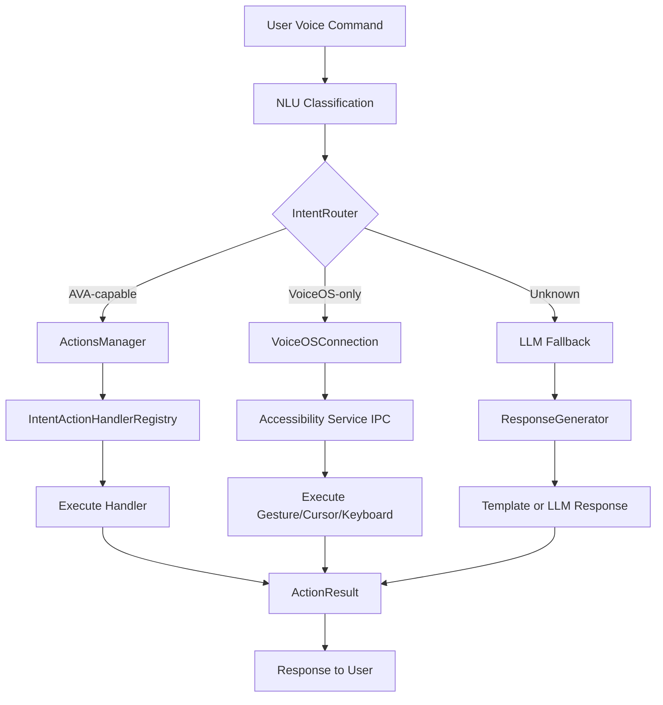
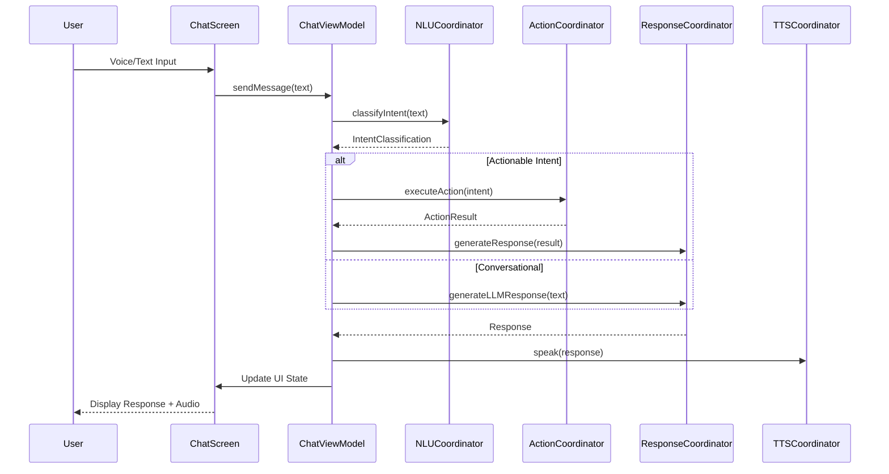

# AVA - AI Voice Assistant Platform

**Version:** 1.0.0
**Platform:** Kotlin Multiplatform (Android, iOS, Desktop, Web)
**Module Path:** `/Volumes/M-Drive/Coding/NewAvanues/Modules/AVA`
**Total Files:** 288 Kotlin files

---

## Executive Summary

AVA (Augmented Voice Assistant) is an advanced AI-powered voice assistant platform built on Kotlin Multiplatform. It provides intelligent voice command processing, natural language understanding, and seamless integration with VoiceOS accessibility services.

### Key Capabilities

- **Dual NLU Engine:** MobileBERT for English + mALBERT for 52 languages
- **90+ Intent Handlers:** System, media, productivity, and accessibility commands
- **Self-Learning Architecture:** LLM-as-Teacher for continuous improvement
- **RAG Integration:** Document retrieval for context-enhanced responses
- **Wake Word Detection:** Porcupine-powered "Hey AVA" / "OK AVA"
- **VisionOS Design:** Glassmorphic UI with Ocean theme

---

## Architecture Overview

```
+------------------------------------------------------------------+
|                        AVA PLATFORM                               |
+------------------------------------------------------------------+
|                                                                   |
|  +----------------------+    +----------------------+             |
|  |     CHAT MODULE      |    |    ACTIONS MODULE    |             |
|  |  - ChatViewModel     |    |  - ActionsManager    |             |
|  |  - SOLID Coordinators|<-->|  - IntentRouter      |             |
|  |  - WakeWordEventBus  |    |  - 90+ Handlers      |             |
|  +----------------------+    +----------------------+             |
|           |                           |                           |
|           v                           v                           |
|  +----------------------+    +----------------------+             |
|  |     NLU MODULE       |    |   VOICEOS BRIDGE     |             |
|  |  - IntentClassifier  |    |  - VoiceOSConnection |             |
|  |  - NLU Self-Learner  |    |  - Accessibility IPC |             |
|  +----------------------+    +----------------------+             |
|           |                           |                           |
|           v                           v                           |
|  +----------------------+    +----------------------+             |
|  |    MEMORY MODULE     |    |    TEACH MODULE      |             |
|  |  - MemoryManager     |    |  - TeachAvaScreen    |             |
|  |  - Decay & Consolidate    |  - TrainingAnalytics |             |
|  +----------------------+    +----------------------+             |
|           |                           |                           |
|           v                           v                           |
|  +----------------------+    +----------------------+             |
|  |   OVERLAY MODULE     |    |   WAKEWORD MODULE    |             |
|  |  - VoiceOrb          |    |  - WakeWordDetector  |             |
|  |  - GlassMorphicPanel |    |  - Porcupine Engine  |             |
|  +----------------------+    +----------------------+             |
|                                                                   |
|  +------------------------------------------------------------+  |
|  |                       CORE MODULE                           |  |
|  |  - Data: Repositories, SQLDelight, Mappers                 |  |
|  |  - Domain: Models, Use Cases, Resolution                   |  |
|  |  - Theme: Glassmorphic Components, Ocean Design            |  |
|  |  - Utils: Crash Reporting, Model Scanner, AVA3 Decoder     |  |
|  +------------------------------------------------------------+  |
|                                                                   |
+------------------------------------------------------------------+
```

---

## Module Structure

### Directory Layout

```
AVA/
+-- .claude/                    # Claude Code configuration
+-- .ideacode/                  # IDEACODE registries
|   +-- registries/
|       +-- FOLDER-REGISTRY.md
|       +-- FILE-REGISTRY.md
|       +-- COMPONENT-REGISTRY.md
|
+-- core/                       # Core KMP module
|   +-- Data/                   # Data layer
|   |   +-- src/commonMain/     # Cross-platform data
|   |   +-- src/androidMain/    # Android-specific
|   |   +-- src/iosMain/        # iOS-specific
|   +-- Domain/                 # Domain layer
|   |   +-- src/commonMain/     # Models, repositories, use cases
|   |   +-- src/androidMain/    # Android resolution
|   +-- Theme/                  # UI theming
|   |   +-- src/commonMain/     # Glassmorphic components
|   +-- Utils/                  # Utilities
|       +-- src/commonMain/     # Cross-platform utils
|       +-- src/androidMain/    # Android-specific utils
|
+-- Actions/                    # Intent action handlers
|   +-- src/main/               # Handler implementations
|   +-- src/androidMain/        # VoiceOS connection
|   +-- src/test/               # Unit tests
|
+-- Chat/                       # Chat UI and logic
|   +-- src/main/               # Android Compose UI
|   +-- src/commonMain/         # Cross-platform interfaces
|   +-- src/iosMain/            # SwiftUI components
|   +-- src/test/               # Unit tests
|
+-- memory/                     # Memory management
|   +-- src/commonMain/         # MemoryManager, MemoryStore
|   +-- src/commonTest/         # Memory tests
|
+-- NLU/                        # Natural Language Understanding
|   +-- src/androidMain/        # UnifiedNluBridge
|
+-- Overlay/                    # System overlay UI
|   +-- src/main/               # VoiceOrb, GlassMorphicPanel
|   +-- src/test/               # Overlay tests
|
+-- Teach/                      # Teaching interface
|   +-- src/androidMain/        # TeachAvaScreen, ViewModel
|   +-- src/commonMain/         # Business logic
|
+-- WakeWord/                   # Wake word detection
|   +-- src/main/               # WakeWordDetector, Service
|   +-- src/commonMain/         # Interfaces, models
|   +-- src/test/               # Wake word tests
|
+-- voice/                      # Voice recognition (placeholder)
```

---

## Core Module (`core/`)

### Data Layer

| Class | Path | Purpose |
|-------|------|---------|
| `DatabaseDriverFactory` | core/Data/src/commonMain/.../db/ | SQLDelight driver creation |
| `ColumnAdapters` | core/Data/src/commonMain/.../db/ | Type adapters for database |
| `ConversationMapper` | core/Data/src/commonMain/.../mapper/ | Conversation entity mapping |
| `MessageMapper` | core/Data/src/commonMain/.../mapper/ | Message entity mapping |
| `MemoryMapper` | core/Data/src/commonMain/.../mapper/ | Memory entity mapping |
| `DecisionMapper` | core/Data/src/commonMain/.../mapper/ | Decision entity mapping |
| `LearningMapper` | core/Data/src/commonMain/.../mapper/ | Learning entity mapping |
| `TrainExampleMapper` | core/Data/src/commonMain/.../mapper/ | Training example mapping |
| `TokenCacheMapper` | core/Data/src/commonMain/.../mapper/ | Token cache mapping |
| `ConversationRepositoryImpl` | core/Data/src/commonMain/.../repository/ | Conversation data access |
| `MessageRepositoryImpl` | core/Data/src/commonMain/.../repository/ | Message data access |
| `MemoryRepositoryImpl` | core/Data/src/commonMain/.../repository/ | Memory data access |
| `DecisionRepositoryImpl` | core/Data/src/commonMain/.../repository/ | Decision data access |
| `LearningRepositoryImpl` | core/Data/src/commonMain/.../repository/ | Learning data access |
| `ChatPreferences` | core/Data/src/main/.../prefs/ | User preferences |
| `VuidHelper` | core/Data/src/commonMain/.../util/ | VUID generation |

### Domain Layer

| Class | Path | Purpose |
|-------|------|---------|
| `Conversation` | core/Domain/src/commonMain/.../model/ | Chat session model |
| `Message` | core/Domain/src/commonMain/.../model/ | Message model |
| `Memory` | core/Domain/src/commonMain/.../model/ | Long-term memory model |
| `Decision` | core/Domain/src/commonMain/.../model/ | Decision tracking model |
| `Learning` | core/Domain/src/commonMain/.../model/ | Learning record model |
| `TrainExample` | core/Domain/src/commonMain/.../model/ | Training example model |
| `TokenCache` | core/Domain/src/commonMain/.../model/ | Token caching model |
| `AppResolution` | core/Domain/src/commonMain/.../model/ | App resolution result |
| `ConversationRepository` | core/Domain/src/commonMain/.../repository/ | Conversation interface |
| `MessageRepository` | core/Domain/src/commonMain/.../repository/ | Message interface |
| `MemoryRepository` | core/Domain/src/commonMain/.../repository/ | Memory interface |
| `DecisionRepository` | core/Domain/src/commonMain/.../repository/ | Decision interface |
| `LearningRepository` | core/Domain/src/commonMain/.../repository/ | Learning interface |
| `TrainExampleRepository` | core/Domain/src/commonMain/.../repository/ | Training interface |
| `TokenCacheRepository` | core/Domain/src/commonMain/.../repository/ | Token cache interface |
| `AppPreferencesRepository` | core/Domain/src/commonMain/.../repository/ | App prefs interface |
| `SendMessageUseCase` | core/Domain/src/commonMain/.../usecase/ | Send message use case |
| `ClassifyIntentUseCase` | core/Domain/src/commonMain/.../usecase/ | Intent classification |
| `TeachIntentUseCase` | core/Domain/src/commonMain/.../usecase/ | Teaching use case |
| `ExportConversationUseCase` | core/Domain/src/commonMain/.../usecase/ | Export conversations |
| `AppResolverService` | core/Domain/src/androidMain/.../resolution/ | App resolution service |
| `CapabilityRegistry` | core/Domain/src/androidMain/.../resolution/ | Capability registry |
| `PreferencePromptManager` | core/Domain/src/androidMain/.../resolution/ | Preference prompts |

### Theme Layer

| Class | Path | Purpose |
|-------|------|---------|
| `AvaTheme` | core/Theme/src/commonMain/.../theme/ | Theme configuration |
| `DesignTokens` | core/Theme/src/commonMain/.../theme/ | Design token definitions |
| `GlassmorphicComponents` | core/Theme/src/commonMain/.../theme/ | Glass UI components |
| `OceanThemeExtensions` | core/Theme/src/commonMain/.../theme/ | Ocean theme extensions |

### Utils Layer

| Class | Path | Purpose |
|-------|------|---------|
| `Result` | core/Utils/src/commonMain/.../common/ | Result wrapper |
| `Exceptions` | core/Utils/src/commonMain/.../common/ | Custom exceptions |
| `AVAExceptionHandler` | core/Utils/src/commonMain/.../coroutines/ | Coroutine handler |
| `Initializable` | core/Utils/src/commonMain/.../init/ | Initialization interface |
| `InitializationCoordinator` | core/Utils/src/commonMain/.../init/ | Init coordination |
| `ModelScanner` | core/Utils/src/androidMain/.../common/ | ML model scanner |
| `AVA3Decoder` | core/Utils/src/androidMain/.../ava3/ | AVA3 format decoder |
| `InferenceBackendSelector` | core/Utils/src/androidMain/.../backend/ | Inference backend |
| `ExternalStorageMigration` | core/Utils/src/androidMain/.../storage/ | Storage migration |
| `CrashReporter` | core/Utils/src/androidMain/.../crashreporting/ | Crash reporting |

---

## Actions Module (`Actions/`)

The Actions module handles all voice command execution with intelligent routing between AVA-local and VoiceOS accessibility commands.

### Core Components

| Class | Path | Purpose |
|-------|------|---------|
| `ActionsManager` | Actions/src/main/.../actions/ | Hilt-injectable action manager |
| `ActionsInitializer` | Actions/src/main/.../actions/ | Handler registration |
| `IntentRouter` | Actions/src/main/.../actions/ | AVA/VoiceOS routing |
| `IntentActionHandler` | Actions/src/main/.../actions/ | Handler interface |
| `IntentActionHandlerRegistry` | Actions/src/main/.../actions/ | Handler registry |
| `CategoryCapabilityRegistry` | Actions/src/main/.../actions/ | Capability registry |
| `CategorySeeder` | Actions/src/main/.../actions/ | Category seeding |
| `ActionResult` | Actions/src/main/.../actions/ | Action result wrapper |
| `VoiceOSConnection` | Actions/src/androidMain/.../actions/ | VoiceOS IPC bridge |
| `EntityExtractor` | Actions/src/main/.../entities/ | Entity extraction |

### Intent Routing Flow



### Intent Handlers by Category

#### System Control (10 handlers)
| Handler | Intent | Description |
|---------|--------|-------------|
| `BluetoothOnActionHandler` | bluetooth_on | Enable Bluetooth |
| `BluetoothOffActionHandler` | bluetooth_off | Disable Bluetooth |
| `WifiOnActionHandler` | wifi_on | Enable WiFi |
| `WifiOffActionHandler` | wifi_off | Disable WiFi |
| `VolumeUpActionHandler` | volume_up | Increase volume |
| `VolumeDownActionHandler` | volume_down | Decrease volume |
| `VolumeMuteActionHandler` | volume_mute | Mute audio |
| `BatteryStatusActionHandler` | battery_status | Check battery |
| `FlashlightOnActionHandler` | flashlight_on | Enable flashlight |
| `FlashlightOffActionHandler` | flashlight_off | Disable flashlight |

#### Navigation (12 handlers)
| Handler | Intent | Description |
|---------|--------|-------------|
| `GoHomeActionHandler` | go_home | Go to home screen |
| `NavigateHomeActionHandler` | navigate_home | Navigate home |
| `GoBackActionHandler` | go_back | Go back |
| `BackActionHandler` | back | Back action |
| `RecentAppsActionHandler` | recent_apps | Show recents |
| `OpenRecentAppsActionHandler` | open_recent_apps | Open recents |
| `NotificationsActionHandler` | notifications | Show notifications |
| `ShowNotificationsActionHandler` | show_notifications | Show notifications |
| `HideNotificationsActionHandler` | hide_notifications | Hide notifications |
| `OpenBrowserActionHandler` | open_browser | Open browser |
| `MenuActionHandler` | menu | Open menu |
| `ReturnToDashboardActionHandler` | return_to_dashboard | Return to dashboard |

#### Media Control (7 handlers)
| Handler | Intent | Description |
|---------|--------|-------------|
| `PlayMusicActionHandler` | play_music | Play media |
| `PauseMusicActionHandler` | pause_music | Pause media |
| `NextTrackActionHandler` | next_track | Next track |
| `PreviousTrackActionHandler` | previous_track | Previous track |
| `ShuffleOnActionHandler` | shuffle_on | Enable shuffle |
| `RepeatModeActionHandler` | repeat_mode | Toggle repeat |
| `ResumeMusicActionHandler` | resume_media | Resume playback |

#### Productivity (7 handlers)
| Handler | Intent | Description |
|---------|--------|-------------|
| `CheckCalendarActionHandler` | check_calendar | View calendar |
| `SearchWebActionHandler` | search_web | Web search |
| `NavigateURLActionHandler` | navigate_url | Open URL |
| `CreateReminderActionHandler` | create_reminder | Create reminder |
| `CreateCalendarEventActionHandler` | create_calendar_event | Create event |
| `AddTodoActionHandler` | add_todo | Add todo item |
| `CreateNoteActionHandler` | create_note | Create note |

#### Information (3 handlers)
| Handler | Intent | Description |
|---------|--------|-------------|
| `TimeActionHandler` | show_time | Show current time |
| `WeatherActionHandler` | check_weather | Check weather |
| `CalculationActionHandler` | perform_calculation | Calculate math |

#### Communication (3 handlers)
| Handler | Intent | Description |
|---------|--------|-------------|
| `CallContactActionHandler` | call_contact | Make phone call |
| `SendMessageActionHandler` | send_message | Send SMS |
| `SendEmailActionHandler` | send_email | Send email |

#### VoiceOS Cursor Control (6 handlers)
| Handler | Intent | Description |
|---------|--------|-------------|
| `CenterCursorActionHandler` | center_cursor | Center cursor |
| `ShowCursorActionHandler` | show_cursor | Show cursor |
| `HideCursorActionHandler` | hide_cursor | Hide cursor |
| `HandCursorActionHandler` | hand_cursor | Hand cursor |
| `NormalCursorActionHandler` | normal_cursor | Normal cursor |
| `ChangeCursorActionHandler` | change_cursor | Change cursor |

#### VoiceOS Gesture Control (8 handlers)
| Handler | Intent | Description |
|---------|--------|-------------|
| `SwipeUpActionHandler` | swipe_up | Swipe up |
| `SwipeDownActionHandler` | swipe_down | Swipe down |
| `SwipeLeftActionHandler` | swipe_left | Swipe left |
| `SwipeRightActionHandler` | swipe_right | Swipe right |
| `PinchOpenActionHandler` | pinch_open | Pinch open/zoom in |
| `PinchCloseActionHandler` | pinch_close | Pinch close/zoom out |
| `SingleClickActionHandler` | single_click | Single click |
| `DoubleClickActionHandler` | double_click | Double click |

#### VoiceOS Keyboard Control (12 handlers)
| Handler | Intent | Description |
|---------|--------|-------------|
| `BackspaceActionHandler` | backspace | Backspace |
| `EnterActionHandler` | enter | Enter key |
| `ClearTextActionHandler` | clear_text | Clear text |
| `OpenKeyboardActionHandler` | open_keyboard | Open keyboard |
| `CloseKeyboardActionHandler` | close_keyboard | Close keyboard |
| `HideKeyboardActionHandler` | hide_keyboard | Hide keyboard |
| `DismissKeyboardActionHandler` | dismiss_keyboard | Dismiss keyboard |
| `ChangeKeyboardActionHandler` | change_keyboard | Change keyboard |
| `SwitchKeyboardActionHandler` | switch_keyboard | Switch keyboard |
| `KeyboardModeActionHandler` | keyboard_mode | Keyboard mode |
| `KeyboardModeChangeActionHandler` | keyboard_mode_change | Change mode |
| `KeyboardChangeActionHandler` | keyboard_change | Change keyboard |

#### VoiceOS Scroll/Drag (5 handlers)
| Handler | Intent | Description |
|---------|--------|-------------|
| `ScrollUpActionHandler` | scroll_up | Scroll up |
| `ScrollDownActionHandler` | scroll_down | Scroll down |
| `DragStartActionHandler` | drag_start | Start drag |
| `DragStopActionHandler` | drag_stop | Stop drag |
| `DragUpDownActionHandler` | drag_up_down | Drag vertically |

#### VoiceOS Overlay Control (7 handlers)
| Handler | Intent | Description |
|---------|--------|-------------|
| `ShowNumberActionHandler` | show_number | Show numbers |
| `HideNumberActionHandler` | hide_number | Hide numbers |
| `ShowHelpActionHandler` | show_help | Show help |
| `HideHelpActionHandler` | hide_help | Hide help |
| `ShowCommandActionHandler` | show_command | Show commands |
| `HideCommandActionHandler` | hide_command | Hide commands |
| `ScanCommandsActionHandler` | scan_commands | Scan commands |

#### VoiceOS Volume Control (19 handlers)
| Handler | Intent | Description |
|---------|--------|-------------|
| `IncreaseVolumeActionHandler` | increase_volume | Volume up |
| `DecreaseVolumeActionHandler` | decrease_volume | Volume down |
| `MuteVolumeActionHandler` | mute_volume | Mute |
| `SetVolumeMaxActionHandler` | set_volume_max | Max volume |
| `SetVolume1-15ActionHandler` | set_volume_1..15 | Set specific level |

#### Other VoiceOS Handlers
| Handler | Intent | Description |
|---------|--------|-------------|
| `LongPressActionHandler` | long_press | Long press |
| `SelectActionHandler` | select | Select item |
| `DictationActionHandler` | dictation | Start dictation |
| `EndDictationActionHandler` | end_dictation | End dictation |
| `GazeOnActionHandler` | gaze_on | Enable gaze |
| `GazeOffActionHandler` | gaze_off | Disable gaze |
| `ConfirmActionHandler` | confirm | Confirm action |
| `CancelActionHandler` | cancel | Cancel action |
| `CloseActionHandler` | close | Close dialog |
| `SubmitActionHandler` | submit | Submit form |

**Total: 90+ Intent Handlers**

---

## Chat Module (`Chat/`)

The Chat module implements the conversational UI with SOLID architecture and coordinator pattern.

### Core Components

| Class | Path | Purpose |
|-------|------|---------|
| `ChatViewModel` | Chat/src/main/.../chat/ | Main chat ViewModel |
| `ChatScreen` | Chat/src/main/.../chat/ | Chat Compose screen |
| `ConversationListScreen` | Chat/src/main/.../chat/ | Conversation list |
| `ChatModule` | Chat/src/main/.../di/ | Hilt DI module |
| `ChatUIStateManager` | Chat/src/main/.../state/ | UI state management |
| `StatusIndicatorState` | Chat/src/main/.../state/ | Status indicators |

### SOLID Coordinators

| Coordinator | Interface | Purpose |
|-------------|-----------|---------|
| `ActionCoordinator` | `IActionCoordinator` | Action execution flow |
| `NLUCoordinator` | `INLUCoordinator` | Intent classification |
| `RAGCoordinator` | `IRAGCoordinator` | Document retrieval |
| `ResponseCoordinator` | `IResponseCoordinator` | Response generation |
| `TTSCoordinator` | `ITTSCoordinator` | Text-to-speech |
| `NLUDispatcher` | - | Fast-path keyword routing |

### UI Components

| Component | Path | Purpose |
|-----------|------|---------|
| `MessageBubble` | Chat/src/main/.../components/ | Chat message display |
| `StatusIndicator` | Chat/src/main/.../components/ | Status display |
| `HistoryOverlay` | Chat/src/main/.../components/ | Conversation history |
| `TTSControls` | Chat/src/main/.../components/ | TTS control panel |
| `TeachAvaBottomSheet` | Chat/src/main/.../components/ | Teaching interface |
| `ConfidenceLearningDialog` | Chat/src/main/.../components/ | Confidence prompt |
| `AppPreferenceBottomSheet` | Chat/src/main/.../components/ | App preferences |
| `DeviceConfigSelector` | Chat/src/main/.../components/ | Device configuration |
| `ModelStatusBanner` | Chat/src/main/.../components/ | Model status |
| `DocumentSelectorDialog` | Chat/src/main/.../dialogs/ | RAG document selection |
| `RAGSettingsSection` | Chat/src/main/.../settings/ | RAG settings UI |

### Message Processing Flow



### Built-In Intents

The Chat module defines fast-path intents for immediate response:

**System Control:**
- `system_stop`, `system_back`, `system_cancel`, `system_home`
- `system_help`, `system_quit`, `system_exit`
- `system_pause`, `system_resume`, `system_mute`, `system_unmute`

**Navigation:**
- `navigation_up`, `navigation_down`, `navigation_left`, `navigation_right`
- `navigation_next`, `navigation_previous`, `navigation_select`, `navigation_enter`

**Device Control:**
- `control_lights`, `control_temperature`

**Information:**
- `check_weather`, `show_time`

**Productivity:**
- `set_alarm`, `set_reminder`

**Meta Commands:**
- `show_history`, `new_conversation`, `teach_ava`

---

## Memory Module (`memory/`)

The Memory module implements cognitive-inspired memory management with decay and consolidation.

### Core Components

| Class | Path | Purpose |
|-------|------|---------|
| `MemoryManager` | memory/src/commonMain/.../memory/ | Memory operations interface |
| `MemoryStore` | memory/src/commonMain/.../memory/ | Storage interface |
| `InMemoryStore` | memory/src/commonMain/.../memory/ | In-memory implementation |
| `MemoryEntry` | memory/src/commonMain/.../memory/ | Memory entry model |
| `MemoryType` | memory/src/commonMain/.../memory/ | Memory type enum |

### Memory Types

| Type | Description | Persistence |
|------|-------------|-------------|
| `SHORT_TERM` | Current conversation context | Session-scoped |
| `LONG_TERM_PREFERENCES` | User preferences and settings | Permanent |
| `EPISODIC` | Past conversations and events | Summarized |
| `SEMANTIC` | Facts and knowledge about user | Permanent |

### Memory Operations

```kotlin
interface MemoryManager {
    // Storage
    suspend fun remember(type: MemoryType, content: String, importance: Float): MemoryEntry
    suspend fun recall(id: String): MemoryEntry?
    suspend fun forget(id: String)

    // Retrieval
    suspend fun search(query: String, limit: Int): List<MemoryEntry>
    suspend fun getConversationHistory(limit: Int): List<MemoryEntry>
    suspend fun getUserPreferences(): Map<String, String>

    // Cognitive processes
    suspend fun consolidateMemories()  // Short-term to long-term
    suspend fun applyDecay()           // Reduce old memory importance
    suspend fun summarizeConversation(conversationId: String): String

    // Observation
    fun observeMemories(type: MemoryType): Flow<List<MemoryEntry>>
}
```

---

## Overlay Module (`Overlay/`)

The Overlay module provides the floating voice interface with VisionOS-inspired glassmorphic design.

### Core Components

| Class | Path | Purpose |
|-------|------|---------|
| `OverlayService` | Overlay/src/main/.../service/ | Foreground service |
| `OverlayController` | Overlay/src/main/.../controller/ | Overlay state management |
| `VoiceRecognizer` | Overlay/src/main/.../controller/ | Voice input handling |
| `DialogQueueManager` | Overlay/src/main/.../service/ | Dialog sequencing |
| `OverlayZIndexManager` | Overlay/src/main/.../service/ | Z-order management |
| `OverlayPermissionActivity` | Overlay/src/main/.../service/ | Permission handling |

### UI Components

| Component | Path | Purpose |
|-----------|------|---------|
| `VoiceOrb` | Overlay/src/main/.../ui/ | Draggable voice button |
| `GlassMorphicPanel` | Overlay/src/main/.../ui/ | Glass effect panel |
| `OverlayComposables` | Overlay/src/main/.../ui/ | Shared composables |
| `SuggestionChips` | Overlay/src/main/.../ui/ | Quick suggestions |

### Integration Bridges

| Bridge | Path | Purpose |
|--------|------|---------|
| `AvaIntegrationBridge` | Overlay/src/main/.../integration/ | Main AVA integration |
| `ChatConnector` | Overlay/src/main/.../integration/ | Chat module connection |
| `NluConnector` | Overlay/src/main/.../integration/ | NLU module connection |
| `ContextEngine` | Overlay/src/main/.../context/ | Context awareness |

### Theme Components

| Component | Path | Purpose |
|-----------|------|---------|
| `GlassEffects` | Overlay/src/main/.../theme/ | Glass blur effects |
| `AnimationSpecs` | Overlay/src/main/.../theme/ | Animation definitions |
| `OceanGlassColors` | Overlay/src/main/.../theme/ | Ocean theme colors |

### VoiceOrb States

```
+-------------+     tap      +-------------+     detected    +---------------+
|    IDLE     | -----------> |  LISTENING  | -------------> |  PROCESSING   |
| (pulsing)   |              | (waveform)  |                | (spinning)    |
+-------------+              +-------------+                +---------------+
      ^                            |                              |
      |                            | timeout                      | complete
      |                            v                              v
      |                      +-------------+               +-------------+
      +----------------------|   STOPPED   |<--------------+  SPEAKING   |
                             +-------------+               | (glow)      |
                                                           +-------------+
```

---

## Teach Module (`Teach/`)

The Teach module enables user training of custom intents.

### Core Components

| Class | Path | Purpose |
|-------|------|---------|
| `TeachAvaScreen` | Teach/src/androidMain/.../teach/ | Main teaching UI |
| `TeachAvaViewModel` | Teach/src/androidMain/.../teach/ | Android ViewModel |
| `TeachAvaBusinessLogic` | Teach/src/commonMain/.../teach/ | Cross-platform logic |
| `TeachAvaContent` | Teach/src/androidMain/.../teach/ | Content composables |
| `TeachAvaUiState` | Teach/src/commonMain/.../teach/ | UI state sealed class |
| `TeachAvaViewModelInterface` | Teach/src/commonMain/.../teach/ | ViewModel interface |

### Analytics Components

| Class | Path | Purpose |
|-------|------|---------|
| `TrainingAnalyticsScreen` | Teach/src/androidMain/.../teach/ | Analytics dashboard |
| `TrainingAnalytics` | Teach/src/commonMain/.../teach/ | Analytics data |
| `IntentSimilarityAnalyzer` | Teach/src/commonMain/.../teach/ | Intent comparison |
| `SimilarityAnalysisScreen` | Teach/src/androidMain/.../teach/ | Similarity UI |

### UI Components

| Component | Path | Purpose |
|-----------|------|---------|
| `TrainingExampleCard` | Teach/src/androidMain/.../teach/ | Example display |
| `AddExampleDialog` | Teach/src/androidMain/.../teach/ | Add example dialog |
| `EditExampleDialog` | Teach/src/androidMain/.../teach/ | Edit example dialog |
| `BulkImportExportManager` | Teach/src/androidMain/.../teach/ | Bulk operations |

### Training Example Model

```kotlin
data class TrainExample(
    val id: Long,
    val exampleHash: String,
    val utterance: String,         // "play some jazz music"
    val intent: String,            // "play_music"
    val locale: String,            // "en-US"
    val source: TrainExampleSource,
    val createdAt: Long,
    val usageCount: Int,
    val lastUsed: Long?,
    val confidence: Float,         // 0.0-1.0
    val userConfirmed: Boolean,
    val timesMatched: Int,
    val embeddingVector: List<Float>?,
    val embeddingDimension: Int
)

enum class TrainExampleSource {
    MANUAL,          // User manually added
    AUTO_LEARN,      // Learned from interaction
    CORRECTION,      // User corrected mistake
    LLM_AUTO,        // LLM-generated
    LLM_VARIATION,   // LLM variation
    LLM_CONFIRMED,   // LLM confirmed by user
    USER_TAUGHT      // Explicit teaching
}
```

---

## WakeWord Module (`WakeWord/`)

The WakeWord module provides hands-free voice activation using Picovoice Porcupine.

### Core Components

| Class | Path | Purpose |
|-------|------|---------|
| `WakeWordDetector` | WakeWord/src/main/.../detector/ | Porcupine wrapper |
| `WakeWordService` | WakeWord/src/main/.../service/ | Background service |
| `WakeWordModule` | WakeWord/src/main/.../di/ | Hilt DI module |
| `WakeWordViewModel` | WakeWord/src/main/.../settings/ | Settings ViewModel |
| `WakeWordSettingsRepository` | WakeWord/src/main/.../settings/ | Settings persistence |

### Models and Interfaces

| Class | Path | Purpose |
|-------|------|---------|
| `IWakeWordDetector` | WakeWord/src/commonMain/.../wakeword/ | Detector interface |
| `IWakeWordSettingsRepository` | WakeWord/src/commonMain/.../wakeword/ | Settings interface |
| `WakeWordModels` | WakeWord/src/commonMain/.../wakeword/ | Settings, State, Keyword |
| `WakeWordSettingsParcelable` | WakeWord/src/main/.../wakeword/ | Android parcelable |

### Supported Keywords

| Keyword | Model | Description |
|---------|-------|-------------|
| `HEY_AVA` | hey-ava_android.ppn | Custom "Hey AVA" |
| `OK_AVA` | ok-ava_android.ppn | Custom "OK AVA" |
| `JARVIS` | Built-in | Fallback for Hey AVA |
| `ALEXA` | Built-in | Fallback for OK AVA |
| `COMPUTER` | Built-in | Alternative option |

### Detector States

```kotlin
enum class WakeWordState {
    UNINITIALIZED,  // Not yet initialized
    INITIALIZING,   // Loading Porcupine
    STOPPED,        // Initialized but not listening
    LISTENING,      // Actively listening for wake word
    PAUSED,         // Temporarily paused (e.g., screen off)
    ERROR           // Initialization or runtime error
}
```

---

## NLU Module (`NLU/`)

### UnifiedNluBridge

The NLU module provides a unified bridge for natural language understanding.

```kotlin
// NLU/src/androidMain/.../migration/UnifiedNluBridge.kt
class UnifiedNluBridge {
    // Bridges between MobileBERT (English) and mALBERT (multilingual)
    // Provides single interface for intent classification
}
```

### NLU Architecture

```
+------------------------------------------------------------------+
|                        NLU PIPELINE                               |
+------------------------------------------------------------------+
|                                                                   |
|  +-----------------+                                              |
|  |   Fast Path     |  Single-word commands (stop, back, home)    |
|  |   Keywords      |  Sub-millisecond response                   |
|  +-----------------+                                              |
|          |                                                        |
|          v                                                        |
|  +-----------------+    +-------------------+                     |
|  |  MobileBERT     |    |    mALBERT        |                    |
|  |  (English)      |    |  (52 Languages)   |                    |
|  +-----------------+    +-------------------+                     |
|          |                      |                                 |
|          v                      v                                 |
|  +-----------------+    +-------------------+                     |
|  |  Intent         |    |  Multilingual     |                    |
|  |  Classification |    |  Classification   |                    |
|  +-----------------+    +-------------------+                     |
|          |                      |                                 |
|          +----------+-----------+                                 |
|                     v                                             |
|          +-----------------------+                                |
|          |  NLU Self-Learner     |                               |
|          |  (LLM-as-Teacher)     |                               |
|          +-----------------------+                                |
|                     |                                             |
|                     v                                             |
|          +-----------------------+                                |
|          |  TrainExampleRepository                               |
|          |  (Continuous Learning)                                |
|          +-----------------------+                                |
|                                                                   |
+------------------------------------------------------------------+
```

---

## UI Design System

### Ocean Theme

AVA uses a VisionOS-inspired glassmorphic design system called "Ocean Theme."

#### Color Tokens

| Token | Value | Usage |
|-------|-------|-------|
| GradientStart | #0A1929 | Dark blue background top |
| GradientMid | #0D47A1 | Blue gradient middle |
| GradientEnd | #1E293B | Slate blue bottom |
| GlassUltraLight | rgba(255,255,255,0.05) | Very subtle glass |
| GlassLight | rgba(255,255,255,0.10) | Default surfaces |
| GlassMedium | rgba(255,255,255,0.15) | Cards, containers |
| GlassHeavy | rgba(255,255,255,0.20) | Elevated surfaces |
| GlassDense | rgba(255,255,255,0.30) | Prominent elements |
| CoralBlue | #3B82F6 | Primary accent |
| SeafoamGreen | #10B981 | Success state |
| CoralRed | #EF4444 | Error state |
| TextPrimary | rgba(255,255,255,0.95) | Main text |
| TextSecondary | rgba(255,255,255,0.70) | Secondary text |
| TextHint | rgba(255,255,255,0.50) | Hint text |

#### Glassmorphic Components

| Component | Description |
|-----------|-------------|
| `GlassSurface` | Base glass surface with optional border |
| `GlassCard` | Glass card for content containers |
| `GlassBubble` | Chat message bubble (user/assistant variants) |
| `OceanButton` | PRIMARY/SECONDARY/TERTIARY/ERROR variants |
| `GlassTextField` | Glass-styled text input |
| `GlassChip` | Glass tag/badge component |
| `GlassIndicator` | Status indicator bar |
| `OceanGradientBackground` | Full-screen gradient |

---

## Integration Points

### VoiceOS Integration

AVA integrates with VoiceOS for accessibility commands via IPC:

```kotlin
class VoiceOSConnection(context: Context) {
    // Check VoiceOS availability
    fun isVoiceOSInstalled(): Boolean
    fun isReady(): Boolean
    fun getConnectionState(): ConnectionState

    // Execute commands via accessibility service
    suspend fun executeCommand(intent: String, category: String): CommandResult

    // Connection management
    fun connect()
    fun disconnect()
}
```

### RAG Integration

RAG (Retrieval-Augmented Generation) provides context from user documents:

```kotlin
interface RAGCoordinator {
    val ragEnabled: StateFlow<Boolean>
    val selectedDocumentIds: StateFlow<List<String>>

    suspend fun retrieveContext(query: String): List<SearchResult>
    suspend fun buildRAGContext(query: String): RAGContext
}
```

### LLM Integration

Multiple LLM providers with fallback chain:

1. **Anthropic Claude** (Primary)
2. **OpenAI GPT** (Fallback 1)
3. **OpenRouter** (Fallback 2)
4. **Groq** (Fallback 3)

### Event Bus

Wake word events are distributed via event bus:

```kotlin
interface WakeWordEventBus {
    val wakeWordDetected: SharedFlow<WakeWordEvent>
    fun emit(event: WakeWordEvent)
}
```

---

## Configuration

### Confidence Thresholds

| Threshold | Default | Purpose |
|-----------|---------|---------|
| Teach Threshold | 0.50 | Below this, show "Teach AVA" button |
| LLM Fallback | 0.65 | Below this, route to LLM |
| Self-Learning | 0.65 | Above this, auto-learn from LLM responses |

### Conversation Modes

| Mode | Behavior |
|------|----------|
| `APPEND` | Continue last conversation on app open |
| `NEW` | Start fresh conversation each time |

---

## Dependencies

### Internal Dependencies

| Dependency | Purpose |
|------------|---------|
| `Common/Core` | Shared utilities |
| `Common/NLU` | NLU engine (MobileBERT, mALBERT) |
| `Common/LLM` | LLM client and inference |
| `Common/RAG` | RAG repository and search |

### External Dependencies

| Library | Purpose |
|---------|---------|
| Kotlin Multiplatform | Cross-platform code sharing |
| Ktor Client | HTTP networking |
| kotlinx.serialization | JSON serialization |
| SQLDelight | Cross-platform database |
| Hilt | Dependency injection (Android) |
| Jetpack Compose | Android UI |
| Porcupine | Wake word detection |

---

## Building

### Requirements

| Requirement | Version |
|-------------|---------|
| JDK | 17 (required, 18+ incompatible) |
| Gradle | 8.x |
| Android SDK | 34 |

### Build Commands

```bash
# Set JDK 17 (macOS)
export JAVA_HOME=$(/usr/libexec/java_home -v 17)

# Build Android
./gradlew :Modules:AVA:Chat:assembleDebug

# Run tests
./gradlew :Modules:AVA:Chat:test

# Build all modules
./gradlew :Modules:AVA:build
```

---

## Platform Status

| Platform | Status | Notes |
|----------|--------|-------|
| Android | Complete | Production-ready |
| iOS | In Progress | SwiftUI integration |
| Desktop | Planned | Tauri-based |
| Web | Complete | React integration |

---

## Version History

| Version | Date | Changes |
|---------|------|---------|
| 1.0.0 | 2026-01 | Initial documentation |

---

## Author

**Manoj Jhawar**
Augmentalis Inc, Intelligent Devices LLC
(c) 2025-2026

---

*Document generated: 2026-01-11*
