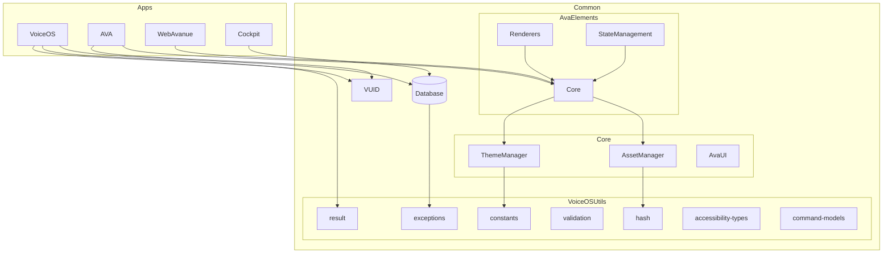
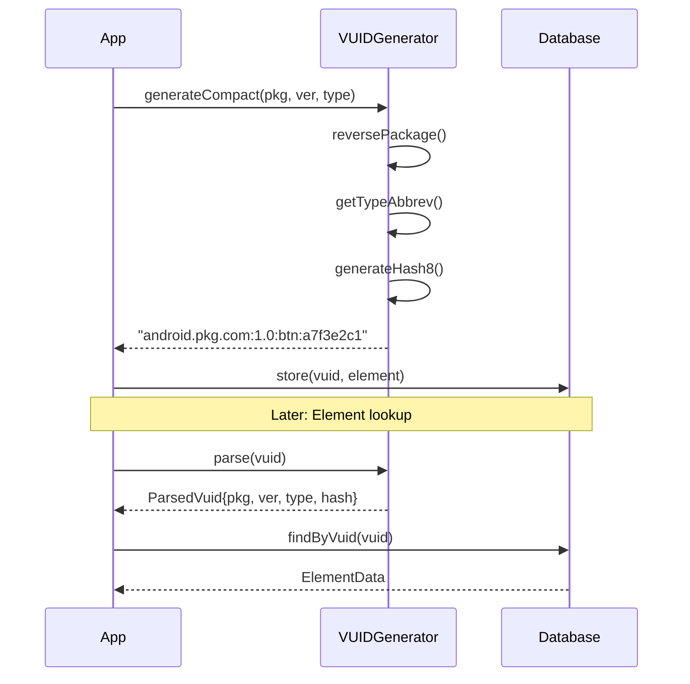

# NewAvanues Common Libraries

**Version:** 1.0.0
**Last Updated:** 2026-01-11
**Platforms:** Android, iOS, Desktop (JVM), Web (JS)

---

## Overview

The Common libraries provide cross-platform Kotlin Multiplatform (KMP) utilities and components shared across all NewAvanues applications. These libraries eliminate code duplication, ensure consistency, and enable true cross-platform development.

```
                    +----------------------------------+
                    |        Applications Layer        |
                    |  VoiceOS | AVA | WebAvanue | ... |
                    +----------------------------------+
                                   |
                    +----------------------------------+
                    |        Common Libraries          |
                    +----------------------------------+
                    |                                  |
    +---------------+-------+-------+-------+---------+
    |               |       |       |       |         |
+-------+     +--------+ +-----+ +------+ +--------+ +----+
| VUID  |     | VoiceOS| | Core| | Ava  | |Database| |Libs|
|       |     |  Utils |       |Elements|          |     |
+-------+     +--------+ +-----+ +------+ +--------+ +----+
    |             |         |       |         |        |
    +-------------+---------+-------+---------+--------+
                            |
              +-------------+-------------+
              |             |             |
           Android        iOS         Desktop
```

---

## Library Categories (14 Libraries)

| Category | Libraries | Purpose |
|----------|-----------|---------|
| **Identity** | VUID | Voice Unique Identifiers |
| **VoiceOS Utils** | 10 sub-libraries | Core VoiceOS utilities |
| **Core** | 8 sub-libraries | Universal platform components |
| **AvaElements** | 13 modules | UI component system |
| **Database** | SQLDelight | Cross-platform persistence |

---

## Quick Start

### 1. Add Maven Local Repository

```kotlin
// settings.gradle.kts
dependencyResolutionManagement {
    repositories {
        mavenLocal()
        google()
        mavenCentral()
    }
}
```

### 2. Add Dependencies

```kotlin
// build.gradle.kts
dependencies {
    // VUID - Unique identifiers
    implementation("com.augmentalis.vuid:vuid:1.0.0")

    // VoiceOS utilities
    implementation("com.augmentalis.voiceos:result:1.0.0")
    implementation("com.augmentalis.voiceos:hash:1.0.0")
    implementation("com.augmentalis.voiceos:constants:1.0.0")
    implementation("com.augmentalis.voiceos:exceptions:1.0.0")

    // Database
    implementation("com.augmentalis.database:database:1.0.0")
}
```

---

## Dependency Graph

```
+------------------------------------------------------------------+
|                     DEPENDENCY FLOW DIAGRAM                       |
+------------------------------------------------------------------+

Level 4 (Apps):
    VoiceOS App  -->  AVA App  -->  WebAvanue  -->  Cockpit
         |              |              |              |
         +------+-------+------+-------+------+-------+
                |              |              |
Level 3 (Modules):
    VoiceOSCoreNG         AVACore          WebCore
         |                   |                |
         +------+------------+----------------+
                |
Level 2 (Common):
    +--------------------------------------------------+
    |              AvaElements (UI Layer)              |
    |    Core | Renderers | StateManagement | Theme    |
    +--------------------------------------------------+
                            |
    +--------------------------------------------------+
    |                  Core Libraries                  |
    |  ThemeManager | AssetManager | AvaUI | AvaCode   |
    +--------------------------------------------------+
                            |
    +--------------------------------------------------+
    |               Foundation Libraries               |
    |     VUID | Database | VoiceOS Utils (10 libs)    |
    +--------------------------------------------------+

Level 1 (Platform):
    +--------------------------------------------------+
    |              Kotlin Multiplatform                |
    |     Android | iOS | Desktop (JVM) | Web (JS)     |
    +--------------------------------------------------+
```

---

## 1. VUID Library

**Package:** `com.augmentalis.vuid`
**Purpose:** Cross-platform Voice Unique Identifier generation

### VUID Format

```
Third-Party Apps:    {reversedPackage}:{version}:{typeAbbrev}:{hash8}
Internal Modules:    {module}:{version}:{typeAbbrev}:{hash8}
Simple Format:       {module}:{typeAbbrev}:{hash8}

Examples:
  android.instagram.com:12.0.0:btn:a7f3e2c1   # Instagram button
  ava:1.0.0:msg:b8d4f2a9                       # AVA message
  vos:btn:c3e7a1d5                             # VoiceOS button
```

### API Reference

```kotlin
import com.augmentalis.vuid.core.VUIDGenerator

// Third-party app elements
val vuid = VUIDGenerator.generateCompact(
    packageName = "com.instagram.android",
    version = "12.0.0",
    typeName = "button",
    elementHash = "a7f3e2c1"
)
// Result: "android.instagram.com:12.0.0:btn:a7f3e2c1"

// Internal module entities
val msgVuid = VUIDGenerator.generateMessageVuid()      // ava:msg:xxxxxxxx
val convVuid = VUIDGenerator.generateConversationVuid() // ava:cnv:xxxxxxxx
val tabVuid = VUIDGenerator.generateTabVuid()           // web:tab:xxxxxxxx

// Parse existing VUID
val parsed = VUIDGenerator.parse("android.instagram.com:12.0.0:btn:a7f3e2c1")
println(parsed?.typeName)  // "button"
println(parsed?.version)   // "12.0.0"

// Validate
VUIDGenerator.isValid(vuid)        // true
VUIDGenerator.isCompact(vuid)      // true
VUIDGenerator.isCompactApp(vuid)   // true
```

### Type Abbreviations

| Category | Abbreviation | Full Name |
|----------|--------------|-----------|
| **UI Elements** | btn | button |
| | inp | input |
| | txt | text |
| | img | image |
| | crd | card |
| | lst | list |
| | dlg | dialog |
| **AVA Entities** | msg | message |
| | cnv | conversation |
| | doc | document |
| | mem | memory |
| | int | intent |
| **WebAvanue** | tab | tab |
| | fav | favorite |
| | hst | history |
| **Cockpit** | win | window |
| | req | request |
| | dev | device |

### Module Constants

```kotlin
VUIDGenerator.Module.VOICEOS  // "vos"
VUIDGenerator.Module.AVA      // "ava"
VUIDGenerator.Module.WEBAVANUE // "web"
VUIDGenerator.Module.NLU      // "nlu"
VUIDGenerator.Module.COCKPIT  // "cpt"
```

---

## 2. VoiceOS Utilities (10 Libraries)

```
VoiceOS/
+-- result/           # Type-safe error handling
+-- hash/             # SHA-256 hashing
+-- constants/        # Configuration values
+-- validation/       # Input sanitization
+-- exceptions/       # Exception hierarchy
+-- accessibility-types/  # A11y type definitions
+-- command-models/   # Command data structures
+-- json-utils/       # JSON serialization
+-- text-utils/       # String utilities
+-- logging/          # Structured logging
```

### 2.1 voiceos-result

**Purpose:** Railway-oriented programming with type-safe error handling

```kotlin
import com.augmentalis.voiceos.result.*

// Function returning Result
fun fetchUser(id: String): VoiceOSResult<User> {
    return try {
        VoiceOSResult.Success(database.getUser(id))
    } catch (e: Exception) {
        VoiceOSResult.Failure(VoiceOSError(
            code = "USER_NOT_FOUND",
            message = "User $id not found",
            cause = e
        ))
    }
}

// Usage patterns
when (val result = fetchUser("123")) {
    is VoiceOSResult.Success -> println("Found: ${result.data.name}")
    is VoiceOSResult.Failure -> println("Error: ${result.error.code}")
    is VoiceOSResult.NotFound -> println("Not found: ${result.identifier}")
    is VoiceOSResult.PermissionDenied -> println("Need: ${result.permission}")
    is VoiceOSResult.Timeout -> println("Timed out after ${result.durationMs}ms")
}

// Functional chaining
fetchUser("123")
    .map { it.email }
    .flatMap { validateEmail(it) }
    .onSuccess { sendEmail(it) }
    .onFailure { logError(it) }

// Get or throw
val user = fetchUser("123").getOrThrow()

// Get or default
val email = fetchUser("123")
    .getOrDefault(User.GUEST)
    .email
```

**Result Types:**

| Type | Purpose | Properties |
|------|---------|------------|
| `Success<T>` | Operation succeeded | `data: T`, `message: String?` |
| `Failure` | Operation failed | `error: VoiceOSError` |
| `NotFound` | Resource not found | `identifier`, `resourceType` |
| `PermissionDenied` | Access denied | `permission`, `reason` |
| `Timeout` | Operation timed out | `operation`, `durationMs`, `timeoutMs` |

---

### 2.2 voiceos-hash

**Purpose:** SHA-256 hashing for content identification

```kotlin
import com.augmentalis.voiceos.hash.HashUtils

// App hash (unique per version)
val appHash = HashUtils.calculateAppHash("com.instagram.android", 42)
// Returns: 64-char hex string

// Generic hash
val contentHash = HashUtils.calculateHash("Hello, World!")
// Returns: "dffd6021bb2bd5b0af676290809ec3a53191dd81c7f70a4b28688a362182986f"

// Validation
HashUtils.isValidHash(appHash)  // true for 64-char hex
```

**Platform Implementation:**
- Android: `java.security.MessageDigest`
- iOS: Pure Kotlin (180 LOC)
- JVM: `java.security.MessageDigest`

---

### 2.3 voiceos-constants

**Purpose:** Centralized configuration values (eliminates magic numbers)

```kotlin
import com.augmentalis.voiceos.constants.VoiceOSConstants

// Tree traversal
val maxDepth = VoiceOSConstants.TreeTraversal.MAX_DEPTH  // 50

// Timing
val throttle = VoiceOSConstants.Timing.THROTTLE_DELAY_MS  // 500L

// Cache sizes
val cacheSize = VoiceOSConstants.Cache.DEFAULT_CACHE_SIZE  // 100
val largeCache = VoiceOSConstants.Cache.LARGE_CACHE_SIZE   // 500

// Database
val batchSize = VoiceOSConstants.Database.BATCH_INSERT_SIZE  // 100
val retentionDays = VoiceOSConstants.Database.DATA_RETENTION_DAYS  // 30

// Rate limiting
val maxPerMin = VoiceOSConstants.RateLimit.MAX_COMMANDS_PER_MINUTE  // 60

// Circuit breaker
val failThreshold = VoiceOSConstants.CircuitBreaker.FAILURE_THRESHOLD  // 5

// Overlays
val autoHide = VoiceOSConstants.Overlays.AUTO_HIDE_MEDIUM_MS  // 10000L
```

**Categories (18):**

| Category | Purpose | Example Values |
|----------|---------|----------------|
| TreeTraversal | A11y tree limits | MAX_DEPTH=50 |
| Timing | Delays/throttles | THROTTLE_DELAY_MS=500 |
| Cache | Buffer sizes | DEFAULT_CACHE_SIZE=100 |
| Database | DB operations | BATCH_INSERT_SIZE=100 |
| Performance | Resource limits | MAX_CONCURRENT_OPERATIONS=10 |
| RateLimit | Anti-spam | MAX_COMMANDS_PER_MINUTE=60 |
| CircuitBreaker | Fault tolerance | FAILURE_THRESHOLD=5 |
| Logging | Log config | MAX_LOG_LENGTH=4000 |
| UI | Display settings | ANIMATION_DURATION_MS=300 |
| Security | Auth/encryption | AES_KEY_SIZE_BITS=256 |
| Network | HTTP timeouts | CONNECTION_TIMEOUT_MS=10000 |
| VoiceRecognition | Speech settings | MIN_CONFIDENCE_THRESHOLD=0.7 |
| Validation | Input limits | MAX_INPUT_LENGTH=1000 |
| Storage | File limits | MAX_UPLOAD_SIZE_MB=10 |
| Testing | Test config | TEST_TIMEOUT_MS=30000 |
| Accessibility | A11y settings | MAX_TRACKED_ELEMENTS=1000 |
| Metrics | Analytics | METRICS_WINDOW_DURATION_MS=3600000 |
| Overlays | Overlay timing | AUTO_HIDE_SHORT_MS=5000 |

---

### 2.4 voiceos-validation

**Purpose:** SQL injection prevention and input sanitization

```kotlin
import com.augmentalis.voiceos.validation.SqlEscapeUtils

// Escape SQL wildcards
val safe = SqlEscapeUtils.escapeLikePattern("50% off")
// Returns: "50\\% off"

// Wrap for LIKE queries
val pattern = SqlEscapeUtils.wrapWithWildcards("search term")
// Returns: "%search term%"

// Prefix/suffix matching
val prefix = SqlEscapeUtils.prefixWithWildcard("ending")   // "%ending"
val suffix = SqlEscapeUtils.suffixWithWildcard("starting") // "starting%"

// Detection
SqlEscapeUtils.containsWildcards("test%")  // true
SqlEscapeUtils.containsWildcards("test")   // false

// In DAO
@Query("SELECT * FROM items WHERE name LIKE :pattern ESCAPE '\\'")
fun search(pattern: String): List<Item>

// Usage
dao.search(SqlEscapeUtils.wrapWithWildcards(userInput))
```

---

### 2.5 voiceos-exceptions

**Purpose:** Structured exception hierarchy with error codes

```kotlin
import com.augmentalis.voiceos.exceptions.*

// Database exceptions
throw DatabaseException.BackupException("Backup failed", cause = e)
throw DatabaseException.MigrationException("Migration failed",
    cause = e, fromVersion = 5, toVersion = 6)

// Security exceptions
throw SecurityException.UnauthorizedException("Access denied",
    packageName = "com.malicious.app")

// Command exceptions
throw CommandException.ExecutionException("Click failed",
    commandText = "click button 3")
throw CommandException.RateLimitException("Too many commands",
    retryAfterMs = 60000L)

// Handling
try {
    performBackup()
} catch (e: DatabaseException.BackupException) {
    logger.error(e.getFullMessage())  // "[DB_BACKUP_FAILED] Backup failed"
}

// Cause chain inspection
exception.isCausedBy<IOException>()  // Deep cause check
```

**Exception Hierarchy (22 types):**

```
VoiceOSException
+-- DatabaseException
|   +-- BackupException      (DB_BACKUP_FAILED)
|   +-- RestoreException     (DB_RESTORE_FAILED)
|   +-- IntegrityException   (DB_INTEGRITY_FAILED)
|   +-- MigrationException   (DB_MIGRATION_FAILED)
|   +-- TransactionException (DB_TRANSACTION_FAILED)
+-- SecurityException
|   +-- EncryptionException  (SECURITY_ENCRYPTION_FAILED)
|   +-- DecryptionException  (SECURITY_DECRYPTION_FAILED)
|   +-- SignatureException   (SECURITY_SIGNATURE_INVALID)
|   +-- UnauthorizedException (SECURITY_UNAUTHORIZED)
|   +-- KeystoreException    (SECURITY_KEYSTORE_FAILED)
+-- CommandException
|   +-- ExecutionException   (COMMAND_EXECUTION_FAILED)
|   +-- ParsingException     (COMMAND_PARSING_FAILED)
|   +-- RateLimitException   (COMMAND_RATE_LIMIT)
|   +-- CircuitBreakerException (COMMAND_CIRCUIT_BREAKER_OPEN)
+-- ScrapingException
|   +-- ElementException     (SCRAPING_ELEMENT_FAILED)
|   +-- HierarchyException   (SCRAPING_HIERARCHY_FAILED)
|   +-- CacheException       (SCRAPING_CACHE_FAILED)
+-- PrivacyException
|   +-- ConsentException     (PRIVACY_CONSENT_REQUIRED)
|   +-- RetentionException   (PRIVACY_RETENTION_VIOLATION)
+-- AccessibilityException
    +-- ServiceException     (ACCESSIBILITY_SERVICE_UNAVAILABLE)
    +-- NodeException        (ACCESSIBILITY_NODE_FAILED)
    +-- ActionException      (ACCESSIBILITY_ACTION_FAILED)
```

---

## 3. Core Libraries (8 Sub-Libraries)

```
Core/
+-- AssetManager/    # Icon & image management
+-- ThemeManager/    # Universal theme system
+-- AvaUI/           # KMP UI abstraction
+-- AvaCode/         # Code generation
+-- UIConvertor/     # Theme conversion
+-- ThemeBridge/     # Legacy compatibility
+-- Database/        # KMP database wrapper
+-- VoiceOSBridge/   # VoiceOS integration
```

### 3.1 AssetManager

**Purpose:** Cross-platform icon and image asset management

```kotlin
// Load icon by name
val icon = AssetManager.loadIcon("home", IconSize.Medium)

// Icon libraries supported
val materialIcon = MaterialIconsLibrary.getIcon("settings")
val fontAwesome = FontAwesomeLibrary.getIcon("fa-user")
val remoteIcon = RemoteIconLibrary.loadAsync("https://...")

// Image loading
val image = AssetManager.loadImage("banner.png")
val processed = AssetProcessor.resize(image, 200, 200)

// Caching
AssetManager.preload(listOf("home", "settings", "profile"))
AssetManager.clearCache()
```

**Platforms:** Android, iOS, JVM, macOS

---

### 3.2 ThemeManager

**Purpose:** Universal theme system supporting 7 design systems

```kotlin
import com.augmentalis.avaelements.core.*

// Predefined themes
val theme = Themes.Material3Light
val iosTheme = Themes.iOS26LiquidGlass
val winTheme = Themes.Windows11Fluent2
val visionTheme = Themes.visionOS2SpatialGlass

// Theme properties
theme.colorScheme.primary        // #6750A4
theme.typography.bodyLarge.size  // 16f
theme.shapes.medium              // 12dp corners
theme.spacing.md                 // 16f

// Glass effects (iOS/visionOS)
iosTheme.material?.glassMaterial?.blurRadius  // 30f

// Color schemes
ColorScheme.Material3Light
ColorScheme.iOS26Light
ColorScheme.Windows11Light
```

**Supported Platforms:**

| Platform | Theme | Material Effect |
|----------|-------|-----------------|
| iOS 26 | Liquid Glass | Glass blur |
| macOS 26 | Tahoe | Glass blur |
| visionOS 2 | Spatial Glass | 3D spatial |
| Windows 11 | Fluent 2 | Mica material |
| Android XR | Spatial Material | 3D spatial |
| Material 3 | Expressive | Elevation |
| Samsung | One UI 7 | Colored Glass |

---

## 4. AvaElements (Component System)

**189 UI Components** across 13 modules

```
AvaElements/
+-- Core/               # Component definitions (136 files)
+-- components/
|   +-- phase1/        # Foundation (13 components)
|   +-- phase3/        # Advanced (32 components)
|   +-- flutter-parity/ # Flutter equivalents (144 components)
|   +-- unified/       # Migration target
+-- Renderers/
|   +-- Android/       # Jetpack Compose (189 components)
|   +-- iOS/           # SwiftUI (48 components)
|   +-- Desktop/       # Compose Desktop (legacy)
+-- StateManagement/   # Reactive state
+-- PluginSystem/      # Plugin architecture
+-- ThemeBuilder/      # Theme creation
+-- TemplateLibrary/   # Component templates
+-- AssetManager/      # Icons & images
```

### Component Categories

```
Phase 1 - Foundation (13)
+-------+-------+-------+-------+
| Button| Text  | Field | Check |
| Switch| Image | Icon  | Card  |
| Row   | Column| List  | Scroll|
| Container                     |
+-------+-------+-------+-------+

Phase 3 - Advanced (32)
+-------+-------+-------+-------+
| Slider| Date  | Time  | Radio |
| Drop  | Auto  | Upload| Pick  |
| Rate  | Search| Badge | Chip  |
| Avatar| Divide| Skele | Spin  |
| Prog  | Tip   | Grid  | Stack |
| Space | Drawer| Tabs  | AppBar|
| Bottom| Bread | Page  | Alert |
| Snack | Modal | Toast | Confirm|
+-------+-------+-------+-------+

Flutter Parity (144)
+-------+-------+-------+-------+
| Layout    | Material  | Cards  |
| Display   | Feedback  | Nav    |
| Data      | Calendar  | Input  |
| Scrolling | Animation | Transit|
| Charts    |           |        |
+-------+-------+-------+-------+
```

### Platform Parity Status

| Platform | Phase 1 | Phase 3 | Flutter | Total | Gap |
|----------|---------|---------|---------|-------|-----|
| Android | 13 | 35 | 141 | **189** | 0 |
| iOS | 13 | 35 | 0 | 48 | 141 |
| Web | 13 | 32 | 33 | 78 | 111 |
| Desktop | 13 | 35 | 10 | 58 | 131 |

### Usage Example

```kotlin
// Define component
val button = MagicButton(
    text = "Click Me",
    onClick = { handleClick() },
    style = ButtonStyle.Filled,
    theme = Themes.Material3Light
)

// Render on Android
@Composable
fun ButtonView() {
    ComposeRenderer.render(button)
}

// Voice-enabled component
val voiceButton = MagicButton(
    vuid = "ava:btn:a7f3e2c1",
    voiceLabel = "submit form",
    text = "Submit"
)
```

---

## 5. Database (SQLDelight)

**Purpose:** Cross-platform persistence using SQLDelight 2.0.1

```kotlin
// Create database
val driver = DatabaseFactory.createDriver(context)
val db = VoiceOSDatabase(driver)

// Repository pattern
val repo = SQLDelightVoiceCommandRepository(db)

// CRUD operations
repo.insert(VoiceCommandDTO(
    vuid = "vos:cmd:a1b2c3d4",
    phrase = "scroll down",
    action = "scroll_down"
))

val commands = repo.findByPhrase("scroll")
repo.delete("vos:cmd:a1b2c3d4")
```

### Available Repositories (20+)

| Repository | Purpose |
|------------|---------|
| VoiceCommandRepository | Voice command storage |
| ScrapedAppRepository | App metadata |
| ScrapedElementRepository | UI elements |
| ScrapedHierarchyRepository | View hierarchies |
| ScreenContextRepository | Screen context |
| ScreenTransitionRepository | Navigation history |
| UUIDRepository | VUID mappings |
| CommandHistoryRepository | Command logs |
| UserPreferenceRepository | User settings |
| ElementStateHistoryRepository | State changes |
| PluginRepository | Plugin metadata |

### Platform Drivers

| Platform | Driver | Dependency |
|----------|--------|------------|
| Android | Android Driver | `sqldelight:android-driver:2.0.1` |
| iOS | Native Driver | `sqldelight:native-driver:2.0.1` |
| JVM | SQLite Driver | `sqldelight:sqlite-driver:2.0.1` |

---

## Mermaid Diagrams

### Library Dependency Graph



### VUID Flow



---

## Integration Checklist

### New Project Setup

- [ ] Add `mavenLocal()` to repositories
- [ ] Add required dependencies to `build.gradle.kts`
- [ ] Import `VUIDGenerator` for unique IDs
- [ ] Import `VoiceOSResult` for error handling
- [ ] Import `VoiceOSConstants` for configuration
- [ ] Setup `DatabaseFactory` for persistence
- [ ] Choose appropriate theme from `Themes`

### Migration from Legacy

- [ ] Replace `UUID.randomUUID()` with `VUIDGenerator.generateCompact()`
- [ ] Replace nullable returns with `VoiceOSResult<T>`
- [ ] Replace hardcoded values with `VoiceOSConstants.*`
- [ ] Replace Room with SQLDelight
- [ ] Replace MD5 hashing with `HashUtils.sha256()`

### Code Quality

- [ ] Use sealed exceptions from `voiceos-exceptions`
- [ ] Sanitize user input with `SqlEscapeUtils`
- [ ] Validate VUID format with `VUIDGenerator.isValid()`
- [ ] Use `runCatchingResult {}` for exception handling

---

## Test Coverage

| Library | Test Cases | Status |
|---------|------------|--------|
| VUID | 50+ | Passing |
| voiceos-result | 25+ | Passing |
| voiceos-hash | 18+ | Passing |
| voiceos-constants | 30+ | Passing |
| voiceos-validation | 42+ | Passing |
| voiceos-exceptions | 60+ | Passing |
| Database | 100+ | Passing |
| AvaElements | 200+ | Passing |

**Total: 500+ test cases**

---

## Publishing

### To Maven Local

```bash
# All libraries
./gradlew publishToMavenLocal

# Specific library
./gradlew :Common:VUID:publishToMavenLocal
./gradlew :Common:VoiceOS:result:publishToMavenLocal
./gradlew :Common:Database:publishToMavenLocal
```

### Build Commands

```bash
# Set JDK 17 (required)
export JAVA_HOME=$(/usr/libexec/java_home -v 17)

# Build all
./gradlew :Common:build

# Run tests
./gradlew :Common:allTests
```

---

## File Structure

```
Common/
+-- VUID/                      # Voice Unique Identifiers
|   +-- src/commonMain/        # Cross-platform code
|   +-- src/androidMain/       # Android-specific
|   +-- src/desktopMain/       # Desktop-specific
+-- VoiceOS/                   # VoiceOS utilities
|   +-- result/                # VoiceOSResult<T>
|   +-- hash/                  # SHA-256 hashing
|   +-- constants/             # Configuration values
|   +-- validation/            # SQL escaping
|   +-- exceptions/            # Exception hierarchy
|   +-- accessibility-types/   # A11y types
|   +-- command-models/        # Command DTOs
|   +-- database/              # DB integration
|   +-- json-utils/            # JSON helpers
|   +-- text-utils/            # String utilities
|   +-- voiceos-logging/       # Structured logging
+-- Core/                      # Platform core
|   +-- AssetManager/          # Icons & images
|   +-- ThemeManager/          # Theme system
|   +-- AvaUI/                 # UI abstraction
|   +-- AvaCode/               # Code generation
|   +-- UIConvertor/           # Theme conversion
|   +-- ThemeBridge/           # Legacy bridge
|   +-- Database/              # DB wrapper
|   +-- VoiceOSBridge/         # VoiceOS bridge
+-- AvaElements/               # Component system
|   +-- Core/                  # Definitions
|   +-- components/            # Component libs
|   +-- Renderers/             # Platform renderers
|   +-- StateManagement/       # Reactive state
|   +-- PluginSystem/          # Plugins
|   +-- ThemeBuilder/          # Theme builder
+-- Database/                  # SQLDelight
+-- Libraries/                 # Third-party wrappers
+-- SpatialRendering/          # 3D/XR rendering
+-- ThirdParty/                # External SDKs
```

---

## Support

| Resource | Location |
|----------|----------|
| Source Code | `/Volumes/M-Drive/Coding/NewAvanues/Common/` |
| Documentation | `/Volumes/M-Drive/Coding/NewAvanues/Docs/MasterDocs/Common/` |
| Issues | Project repository |
| Migration Help | Contact development team |

---

**Copyright (C) 2025-2026 Manoj Jhawar/Aman Jhawar, Intelligent Devices LLC**
**Author:** Manoj Jhawar
**License:** Proprietary
