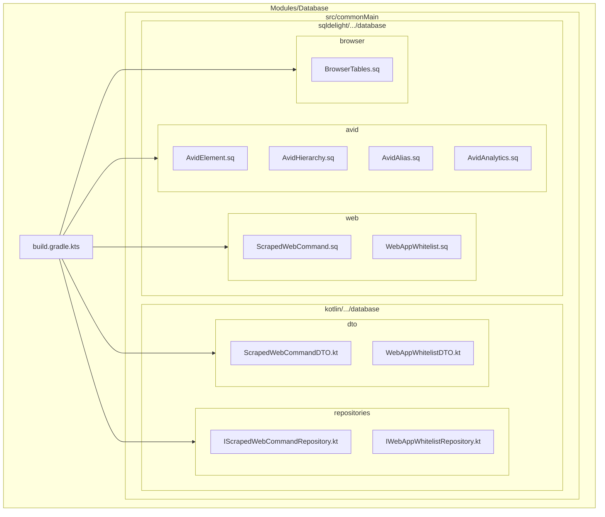
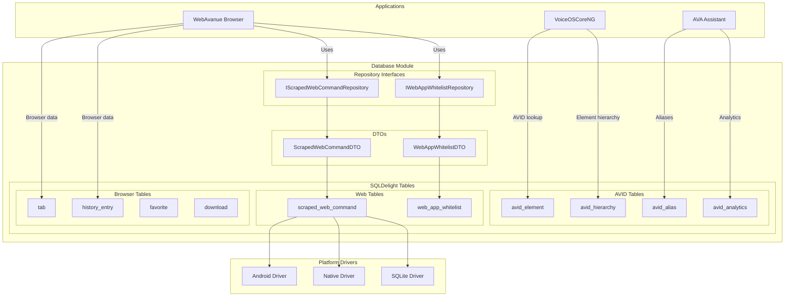
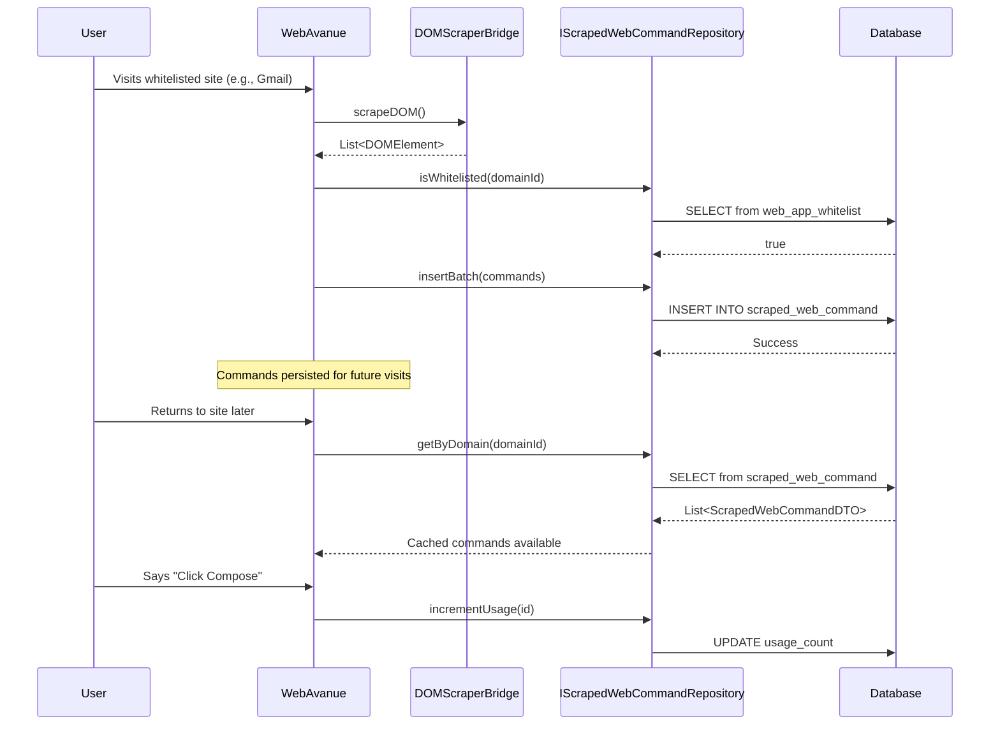
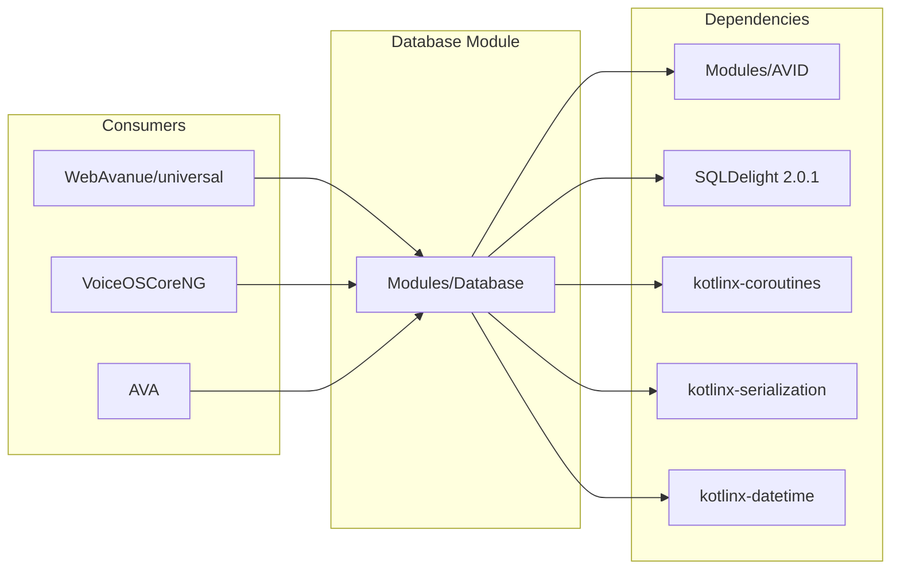

# Database Module

**Version:** 1.0.0
**Status:** Production
**Updated:** 2026-01-14

Unified cross-platform database module for all Avanues applications using SQLDelight.

---

## Module Structure

```
Modules/Database/
├── build.gradle.kts                    # KMP configuration (Android, iOS, Desktop)
└── src/
    └── commonMain/
        ├── kotlin/com/augmentalis/database/
        │   ├── dto/
        │   │   ├── ScrapedWebCommandDTO.kt     # Web voice command DTO
        │   │   └── WebAppWhitelistDTO.kt       # Whitelisted web app DTO
        │   └── repositories/
        │       ├── IScrapedWebCommandRepository.kt  # Web command CRUD
        │       └── IWebAppWhitelistRepository.kt    # Whitelist management
        └── sqldelight/com/augmentalis/database/
            ├── avid/
            │   ├── AvidElement.sq          # AVID element persistence
            │   ├── AvidHierarchy.sq        # Parent-child relationships
            │   ├── AvidAlias.sq            # Alternative names/synonyms
            │   └── AvidAnalytics.sq        # Usage analytics
            ├── web/
            │   ├── ScrapedWebCommand.sq    # Voice commands from web pages
            │   └── WebAppWhitelist.sq      # User-designated web apps
            └── browser/
                └── BrowserTables.sq        # Tabs, history, favorites, etc.
```

---

## Folder Structure Flowchart



---

## App Interactions Flowchart



---

## Data Flow: Web Command Persistence



---

## Database Tables Overview

### AVID Tables (Voice ID System)

| Table | Purpose | Key Fields |
|-------|---------|------------|
| `avid_element` | Element identification | avid, module, type, element_hash, bounds |
| `avid_hierarchy` | Parent-child relationships | parent_avid, child_avid, relationship_type |
| `avid_alias` | Alternative names | avid_id, alias, source, confidence |
| `avid_analytics` | Usage tracking | avid_id, event_type, count, last_used |

### Web Tables (Voice Commands)

| Table | Purpose | Key Fields |
|-------|---------|------------|
| `scraped_web_command` | Web element voice commands | element_hash, domain_id, command_text, css_selector |
| `web_app_whitelist` | User-designated web apps | domain_id, display_name, save_commands, auto_scan |

### Browser Tables

| Table | Purpose | Key Fields |
|-------|---------|------------|
| `tab` | Open browser tabs | url, title, favicon_url, position |
| `tab_group` | Tab grouping | name, color, collapsed |
| `favorite` | Bookmarks | url, title, folder_path |
| `history_entry` | Browsing history | url, title, visit_count, last_visited |
| `download` | Downloaded files | url, filename, status, progress |
| `browser_settings` | Browser config | setting_key, setting_value |
| `site_permission` | Per-site permissions | domain, permission_type, status |
| `session` | Saved sessions | name, tab_count |

---

## Dependencies



---

## Platform Support

| Platform | Driver | Status |
|----------|--------|--------|
| Android | `sqldelight-android-driver` | Production |
| iOS | `sqldelight-native-driver` | Production |
| Desktop (JVM) | `sqldelight-sqlite-driver` | Production |

---

## Usage Example

```kotlin
// Check if domain is whitelisted
val isWhitelisted = whitelistRepository.isWhitelisted("mail.google.com")

if (isWhitelisted) {
    // Get cached commands for this domain
    val commands = commandRepository.getByDomain("mail.google.com")

    // Use cached commands for voice matching
    commands.forEach { cmd ->
        println("Command: ${cmd.commandText} -> ${cmd.cssSelector}")
    }
}

// Save new commands after scraping
val newCommands = domScraperBridge.scrapeDOM().map { element ->
    ScrapedWebCommandDTO(
        elementHash = element.hash,
        domainId = "mail.google.com",
        commandText = element.text ?: element.ariaLabel ?: "",
        cssSelector = element.selector,
        elementTag = element.tagName,
        elementType = "button",
        createdAt = System.currentTimeMillis()
    )
}
commandRepository.insertBatch(newCommands)
```

---

## Related Documentation

- [PLATFORM-INDEX.ai.md](../AI/PLATFORM-INDEX.ai.md) - Module registry
- [CLASS-INDEX.ai.md](../AI/CLASS-INDEX.ai.md) - Class reference
- [AVID Module](../AVID/README.md) - Voice ID system

---

*Copyright (C) Manoj Jhawar/Aman Jhawar, Intelligent Devices LLC*
