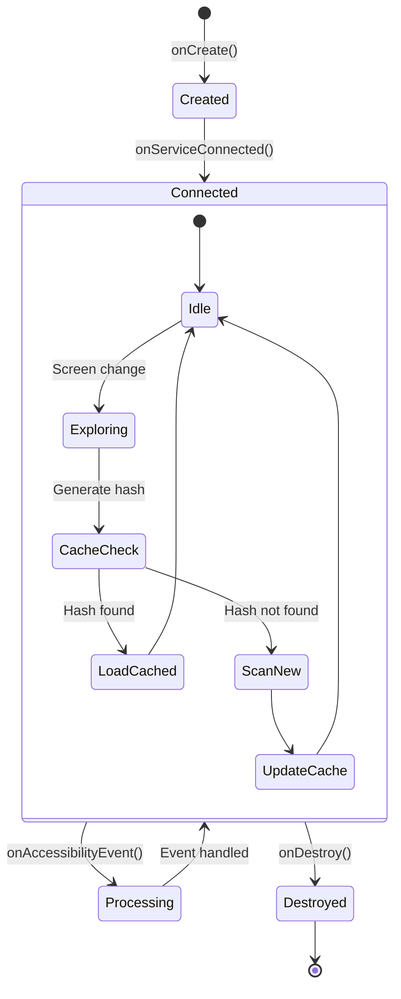
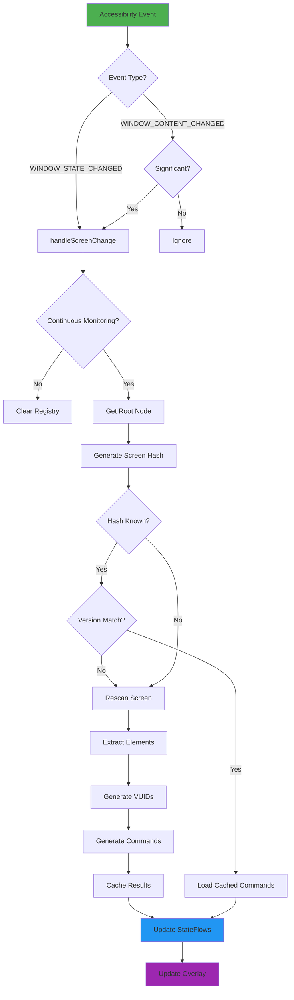
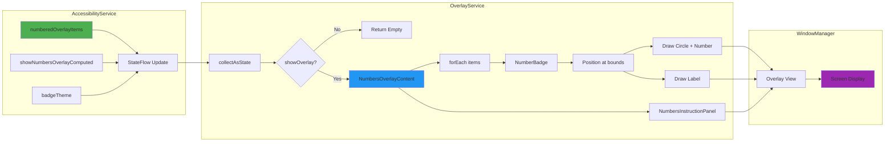

# VoiceOS Android Application

**Voice-First Accessibility Platform for Android**

---

## Executive Summary

### For Marketing Teams

VoiceOS is a revolutionary voice-first accessibility platform that empowers users to control any Android application entirely through voice commands. Unlike traditional accessibility solutions that require app developers to implement special features, VoiceOS works universally across all Android apps by intelligently analyzing UI elements in real-time.

**Key Differentiators:**
- **Universal Compatibility** - Works with any Android app without requiring developer integration
- **Intelligent UI Understanding** - Automatically learns and adapts to any app's interface
- **Numbered Selection** - Users can say "first", "second", or numbers to select list items (emails, messages, etc.)
- **Per-App Customization** - Remembers user preferences for each application
- **Offline-First** - Supports Vivoka offline speech recognition for privacy-conscious users
- **Smart Caching** - Learns app screens for instant response on repeat visits

**Target Markets:**
- Visually impaired users seeking full device control
- Motor-impaired users who cannot use touchscreens
- Hands-free operation for professional/industrial settings
- Elderly users who struggle with small touch targets
- Power users seeking productivity enhancements

---

### For Developers

VoiceOS is built on the **VoiceOSCoreNG** Kotlin Multiplatform library, providing a clean separation between the cross-platform voice command processing engine and the Android-specific accessibility implementation.

**Architecture Highlights:**
- **KMP Foundation** - Core logic shared across Android, iOS, and Desktop
- **Accessibility Service** - Deep integration with Android's accessibility framework
- **Real-time UI Exploration** - Extracts and indexes UI elements for voice targeting
- **VUID System** - Unique identifiers for every UI element enabling precise voice commands
- **Screen Hashing** - Dimension-aware caching system for performance optimization
- **SQLDelight Persistence** - Structured storage for learned commands and app data

---

## Architecture Overview

### System Architecture

```
+------------------------------------------------------------------+
|                        VoiceOS Android App                        |
|                                                                   |
|  +---------------------+    +---------------------+               |
|  |    MainActivity     |    | AccessibilitySettings|              |
|  |   (548 lines)       |    |    Activity         |              |
|  |                     |    |   (472 lines)       |              |
|  +----------+----------+    +----------+----------+              |
|             |                          |                          |
|             v                          v                          |
|  +----------------------------------------------------------+    |
|  |              VoiceOSCoreNGApplication                     |    |
|  |                  (DI Container)                           |    |
|  |  - DatabaseManager    - CommandPersistence                |    |
|  |  - ScrapedAppRepo     - ScrapedElementRepo                |    |
|  +----------------------------------------------------------+    |
|             |                          |                          |
|             v                          v                          |
|  +---------------------+    +---------------------+               |
|  | VoiceOSAccessibility|    |   OverlayService    |              |
|  |    Service          |<-->|   (666 lines)       |              |
|  |   (1789 lines)      |    +---------------------+              |
|  +---------------------+              |                          |
|             |                          v                          |
|             v                   +---------------+                 |
|  +---------------------+        | Numbers       |                 |
|  |  VoiceOSCoreNG      |        | Overlay       |                 |
|  |  (KMP Library)      |        | (Composable)  |                 |
|  +---------------------+        +---------------+                 |
+------------------------------------------------------------------+
```

### Component Interaction Flow

```
+-------------+     +------------------+     +------------------+
|   User      |     |  Accessibility   |     |   VoiceOSCoreNG  |
|   Voice     |---->|    Service       |---->|     Library      |
+-------------+     +------------------+     +------------------+
                           |                        |
                           v                        v
                    +-------------+          +-------------+
                    |   Screen    |          |  Command    |
                    |   Hash      |          |  Registry   |
                    |   Cache     |          |  (In-Memory)|
                    +-------------+          +-------------+
                           |                        |
                           v                        v
                    +-------------+          +-------------+
                    |  SQLDelight |          |   Speech    |
                    |  Database   |          |   Engine    |
                    +-------------+          +-------------+
```

---

## Class Inventory

### Activities

| Class | File | Lines | Purpose |
|-------|------|-------|---------|
| `MainActivity` | `/android/apps/voiceoscoreng/src/main/kotlin/com/augmentalis/voiceoscoreng/MainActivity.kt` | 548 | Main launcher activity with scanner controls, status cards, and feature configuration |
| `AccessibilitySettingsActivity` | `/android/apps/voiceoscoreng/src/main/kotlin/com/augmentalis/voiceoscoreng/AccessibilitySettingsActivity.kt` | 472 | Settings screen accessible from System Settings > Accessibility > VoiceOS > Settings |

### Services

| Class | File | Lines | Purpose |
|-------|------|-------|---------|
| `VoiceOSAccessibilityService` | `/android/apps/voiceoscoreng/src/main/kotlin/com/augmentalis/voiceoscoreng/service/VoiceOSAccessibilityService.kt` | 1789 | Core accessibility service - UI exploration, VUID generation, command processing |
| `OverlayService` | `/android/apps/voiceoscoreng/src/main/kotlin/com/augmentalis/voiceoscoreng/service/OverlayService.kt` | 666 | Foreground service displaying numbers overlay on top of all apps |

### Receivers

| Class | File | Lines | Purpose |
|-------|------|-------|---------|
| `BootReceiver` | `/android/apps/voiceoscoreng/src/main/kotlin/com/augmentalis/voiceoscoreng/service/BootReceiver.kt` | 61 | Auto-starts overlay service on device boot when permissions are granted |

### Application

| Class | File | Lines | Purpose |
|-------|------|-------|---------|
| `VoiceOSCoreNGApplication` | `/android/apps/voiceoscoreng/src/main/kotlin/com/augmentalis/voiceoscoreng/VoiceOSCoreNGApplication.kt` | 82 | Application class - database initialization, DI container |

### Theme

| Class | File | Lines | Purpose |
|-------|------|-------|---------|
| `Theme` | `/android/apps/voiceoscoreng/src/main/kotlin/com/augmentalis/voiceoscoreng/ui/theme/Theme.kt` | 79 | Material3 theme with VoiceOS brand colors |
| `Type` | `/android/apps/voiceoscoreng/src/main/kotlin/com/augmentalis/voiceoscoreng/ui/theme/Type.kt` | - | Typography definitions |

---

## Service Architecture

### VoiceOSAccessibilityService (Core Service)

The heart of VoiceOS - this accessibility service provides:

#### Key Responsibilities

1. **UI Exploration** - Extracts all UI elements from active windows
2. **VUID Generation** - Creates unique identifiers for voice targeting
3. **Screen Hashing** - Generates dimension-aware hashes for caching
4. **Command Generation** - Creates voice commands from UI elements
5. **Continuous Monitoring** - Auto-scans on screen changes
6. **Speech Engine Integration** - Delegates to VoiceOSCoreNG for voice processing

#### StateFlows (Reactive State)

```kotlin
// Connection status
val isConnected: StateFlow<Boolean>

// Numbers overlay mode (ON, OFF, AUTO)
val numbersOverlayMode: StateFlow<NumbersOverlayMode>

// Instruction bar mode (ON, OFF, AUTO)
val instructionBarMode: StateFlow<InstructionBarMode>

// Badge color theme
val badgeTheme: StateFlow<BadgeTheme>

// Continuous monitoring toggle
val isContinuousMonitoring: StateFlow<Boolean>

// Numbered overlay items for display
val numberedOverlayItems: StateFlow<List<NumberOverlayItem>>

// Exploration results for UI display
val explorationResults: StateFlow<ExplorationResult?>

// Current screen information
val currentScreenInfo: StateFlow<ScreenInfo?>

// App detection dialog control
val showAppDetectionDialog: StateFlow<String?>
val currentDetectedAppName: StateFlow<String?>
```

#### Badge Themes

```kotlin
enum class BadgeTheme(val backgroundColor: Long, val textColor: Long) {
    GREEN(0xFF4CAF50, 0xFFFFFFFF),   // Default
    BLUE(0xFF2196F3, 0xFFFFFFFF),
    PURPLE(0xFF9C27B0, 0xFFFFFFFF),
    ORANGE(0xFFFF9800, 0xFF000000),  // Black text
    RED(0xFFF44336, 0xFFFFFFFF),
    TEAL(0xFF009688, 0xFFFFFFFF),
    PINK(0xFFE91E63, 0xFFFFFFFF)
}
```

#### Target Apps for Numbers Overlay

The service automatically detects apps with list-based UIs:

```kotlin
val TARGET_APPS = setOf(
    // Email clients
    "com.google.android.gm",           // Gmail
    "com.microsoft.office.outlook",    // Outlook
    "com.samsung.android.email.provider", // Samsung Mail

    // Messaging apps
    "com.google.android.apps.messaging", // Google Messages
    "com.whatsapp",                    // WhatsApp
    "org.telegram.messenger",          // Telegram

    // Social media
    "com.twitter.android",             // Twitter/X
    "com.instagram.android",           // Instagram

    // Task/Note apps
    "com.todoist",                     // Todoist
    "com.google.android.keep",         // Google Keep
    // ... and more
)
```

### OverlayService

Foreground service that displays the visual overlay:

#### Key Features

1. **Numbers Overlay** - Full-screen transparent layer with numbered badges
2. **App Detection Dialog** - Asks user preferences for target apps
3. **Persistence** - Survives app closure via `onTaskRemoved` restart
4. **Lifecycle Management** - Proper LifecycleOwner implementation for Compose

#### Composable Components

- `NumbersOverlayContent()` - Main overlay with badges and instruction panel
- `NumberBadge()` - Individual badge at element position
- `NumbersInstructionPanel()` - Bottom instruction bar with fade animation
- `AppDetectionDialog()` - First-time app preference dialog
- `DialogButton()` - Styled buttons for dialog

---

## Mermaid Diagrams

### Service Lifecycle



### Screen Change Handling Flow



### Overlay Rendering Flow



---

## Integration with VoiceOSCoreNG

### KMP Module Structure

```
VoiceOSCoreNG/
├── src/
│   ├── commonMain/kotlin/          # Cross-platform code
│   │   └── com/augmentalis/voiceoscoreng/
│   │       ├── common/             # Data models, VUID generation
│   │       ├── handlers/           # Command handlers
│   │       ├── features/           # Speech engines, overlays
│   │       ├── extraction/         # UI element extraction
│   │       └── persistence/        # Database interfaces
│   │
│   └── androidMain/kotlin/         # Android implementations
│       └── com/augmentalis/voiceoscoreng/
│           ├── core/               # VoiceOSCoreNG facade
│           ├── handlers/           # Android executors
│           ├── features/           # Android speech engines
│           └── persistence/        # SQLDelight implementation
```

### Initialization Pattern

```kotlin
// In VoiceOSCoreNGApplication.onCreate()
VoiceOSCoreNGConfig.initialize(
    tier = LearnAppDevToggle.Tier.LITE,
    isDebug = BuildConfig.DEBUG,
    enableTestMode = BuildConfig.ENABLE_TEST_MODE
)

// In VoiceOSAccessibilityService.initializeVoiceOSCore()
voiceOSCore = VoiceOSCoreNG.createForAndroid(
    service = this,
    configuration = ServiceConfiguration(
        autoStartListening = false,
        speechEngine = "VIVOKA",
        debugMode = true
    ),
    commandRegistry = commandRegistry  // Shared registry
)
voiceOSCore?.initialize()
```

### Command Execution Flow

1. **VoiceOSCoreNG.processCommand(text)** - Entry point
2. **ActionCoordinator.processVoiceCommand()** - Routes command
3. **Execution Priority:**
   - Dynamic commands (screen-specific, VUID-based)
   - Static handlers (system commands)
   - NLU classification (BERT-based)
   - LLM interpretation (natural language fallback)
   - Voice interpreter (legacy keyword mapping)

---

## Setup Guide (Novice Developers)

### Prerequisites

1. **Android Studio** - Arctic Fox or newer
2. **JDK 17** - Required (JDK 18+ incompatible with Android Gradle)
3. **Android SDK 34** - Target API level
4. **Physical Device** - Accessibility services don't work in emulators

### Step 1: Clone and Setup

```bash
# Clone the repository
git clone https://github.com/your-org/NewAvanues.git
cd NewAvanues

# Set JDK 17
export JAVA_HOME=$(/usr/libexec/java_home -v 17)
java -version  # Verify: should show 17.x.x
```

### Step 2: Build the App

```bash
# Build VoiceOSCoreNG library
./gradlew :Modules:VoiceOSCoreNG:build

# Build Android app
./gradlew :android:apps:voiceoscoreng:assembleDebug
```

### Step 3: Install on Device

```bash
# Install via ADB
adb install android/apps/voiceoscoreng/build/outputs/apk/debug/app-debug.apk

# Or use Android Studio "Run" button
```

### Step 4: Grant Permissions

1. **Accessibility Service:**
   - Open the app
   - Tap "Enable Accessibility Service"
   - Find "VoiceOSCoreNG" in the list
   - Toggle ON and confirm

2. **Overlay Permission:**
   - Tap "Enable Overlay Permission"
   - Toggle "Allow display over other apps"

### Step 5: Start Using

1. Tap "Start Scanner Overlay"
2. Navigate to any app (Gmail, Messages, etc.)
3. Say "first", "second", or numbers to select items
4. Use voice commands like "scroll down", "go back"

---

## API Reference (Expert Developers)

### VoiceOSAccessibilityService Companion API

```kotlin
object VoiceOSAccessibilityService {
    companion object {
        // ===== Connection State =====
        val isConnected: StateFlow<Boolean>
        fun getInstance(): VoiceOSAccessibilityService?

        // ===== UI Exploration =====
        fun exploreCurrentApp()
        fun exploreAllApps()
        val explorationResults: StateFlow<ExplorationResult?>

        // ===== Command Registry =====
        fun getCurrentCommands(): List<QuantizedCommand>
        fun getDynamicCommandCount(): Int

        // ===== Voice Control =====
        fun startListening()
        fun stopListening()
        fun isListening(): Boolean

        // ===== Continuous Monitoring =====
        val isContinuousMonitoring: StateFlow<Boolean>
        fun setContinuousMonitoring(enabled: Boolean)
        fun isContinuousMonitoringEnabled(): Boolean

        // ===== Screen Cache =====
        fun rescanCurrentApp()
        fun rescanEverything()
        fun getCachedScreenCount(): Int
        fun getCachedScreenCountForCurrentApp(): Int
        val currentScreenInfo: StateFlow<ScreenInfo?>

        // ===== Numbers Overlay =====
        val numbersOverlayMode: StateFlow<NumbersOverlayMode>
        val numberedOverlayItems: StateFlow<List<NumberOverlayItem>>
        val showNumbersOverlayComputed: StateFlow<Boolean>

        fun setNumbersOverlayMode(mode: NumbersOverlayMode)
        fun cycleNumbersOverlayMode()
        fun setShowNumbersOverlay(show: Boolean)  // Legacy

        // ===== Instruction Bar =====
        val instructionBarMode: StateFlow<InstructionBarMode>
        fun setInstructionBarMode(mode: InstructionBarMode)
        fun cycleInstructionBarMode()

        // ===== Badge Theme =====
        val badgeTheme: StateFlow<BadgeTheme>
        fun setBadgeTheme(theme: BadgeTheme)
        fun cycleBadgeTheme()

        // ===== App Detection Dialog =====
        val showAppDetectionDialog: StateFlow<String?>
        val currentDetectedAppName: StateFlow<String?>
        fun showAppDetectionDialogFor(packageName: String, appName: String)
        fun dismissAppDetectionDialog()
        fun handleAppDetectionResponse(packageName: String, preference: AppNumbersPreference)
    }
}
```

### Data Classes

```kotlin
// Exploration result
data class ExplorationResult(
    val packageName: String,
    val timestamp: Long,
    val duration: Long,
    val totalElements: Int,
    val clickableElements: Int,
    val scrollableElements: Int,
    val elements: List<ElementInfo>,
    val vuids: List<VUIDInfo>,
    val hierarchy: List<HierarchyNode>,
    val duplicates: List<DuplicateInfo>,
    val deduplicationStats: DeduplicationStats,
    val commands: List<GeneratedCommand>,
    val avuOutput: String,
    val elementLabels: Map<Int, String>
)

// Numbered overlay item
data class NumberOverlayItem(
    val number: Int,           // 1-based display number
    val label: String,         // Short label for display
    val left: Int,             // Element bounds
    val top: Int,
    val right: Int,
    val bottom: Int,
    val vuid: String           // Target VUID for action
)

// Screen information
data class ScreenInfo(
    val hash: String,
    val packageName: String,
    val activityName: String?,
    val appVersion: String,
    val elementCount: Int,
    val actionableCount: Int,
    val commandCount: Int,
    val scannedAt: Long,
    val isCached: Boolean
)
```

### ADB Commands

```bash
# Control numbers overlay mode
adb shell am broadcast -a com.augmentalis.voiceoscoreng.SET_NUMBERS_MODE --es mode "ON"
adb shell am broadcast -a com.augmentalis.voiceoscoreng.SET_NUMBERS_MODE --es mode "OFF"
adb shell am broadcast -a com.augmentalis.voiceoscoreng.SET_NUMBERS_MODE --es mode "AUTO"

# Check accessibility service status
adb shell settings get secure enabled_accessibility_services

# Enable accessibility service (dangerous - use with caution)
adb shell settings put secure enabled_accessibility_services \
  com.augmentalis.voiceoscoreng/com.augmentalis.voiceoscoreng.service.VoiceOSAccessibilityService
```

---

## Build Configuration

### build.gradle.kts

```kotlin
android {
    namespace = "com.augmentalis.voiceoscoreng.app"
    compileSdk = 34

    defaultConfig {
        applicationId = "com.augmentalis.voiceoscoreng"
        minSdk = 28  // Android 9 (Pie)
        targetSdk = 34
        versionCode = 1
        versionName = "1.0.0"
    }

    compileOptions {
        sourceCompatibility = JavaVersion.VERSION_17
        targetCompatibility = JavaVersion.VERSION_17
    }
}

dependencies {
    // VoiceOSCoreNG KMP library
    implementation(project(":Modules:VoiceOSCoreNG"))

    // VoiceOS Database (SQLDelight)
    implementation(project(":Modules:VoiceOS:core:database"))

    // Compose BOM
    implementation(platform("androidx.compose:compose-bom:2024.02.00"))
    implementation("androidx.compose.material3:material3")
}
```

### AndroidManifest Permissions

```xml
<!-- Overlay for numbers display -->
<uses-permission android:name="android.permission.SYSTEM_ALERT_WINDOW" />

<!-- Foreground service for overlay -->
<uses-permission android:name="android.permission.FOREGROUND_SERVICE" />
<uses-permission android:name="android.permission.FOREGROUND_SERVICE_SPECIAL_USE" />

<!-- Notifications for foreground service -->
<uses-permission android:name="android.permission.POST_NOTIFICATIONS" />

<!-- Auto-start on boot -->
<uses-permission android:name="android.permission.RECEIVE_BOOT_COMPLETED" />
```

---

## Troubleshooting

### Common Issues

1. **Accessibility Service Not Connecting**
   - Verify service is enabled in Settings > Accessibility
   - Check logcat for `VoiceOSA11yService` tag
   - Restart device after enabling

2. **Numbers Overlay Not Showing**
   - Verify overlay permission is granted
   - Check if mode is set to OFF
   - Ensure OverlayService is running

3. **Voice Commands Not Working**
   - Check VoiceOSCoreNG initialization
   - Verify speech engine is loaded
   - Review logcat for `VoiceOSCoreNG` errors

4. **Build Fails**
   - Ensure JDK 17 is active: `java -version`
   - Clean build: `./gradlew clean`
   - Sync Gradle files in Android Studio

---

## License

Copyright (C) Manoj Jhawar/Aman Jhawar, Intelligent Devices LLC

---

## Contact

- **Development Team:** VOS4 Development Team
- **Repository:** `/Volumes/M-Drive/Coding/NewAvanues/android/apps/voiceoscoreng`
- **KMP Library:** `/Volumes/M-Drive/Coding/NewAvanues/Modules/VoiceOSCoreNG`

---

*Documentation generated: 2026-01-11*
*VoiceOS Android App v1.0.0*
