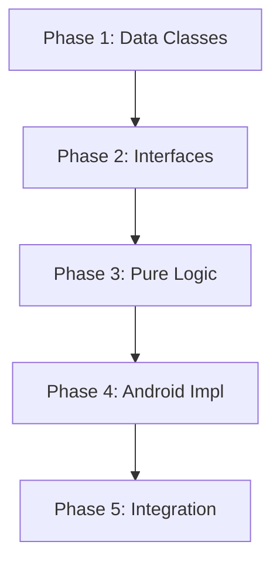

# Implementation Plan: Exploration Engine Migration to KMP

**Date:** 2026-01-15 | **Version:** V1
**Type:** CODE MIGRATION PLAN
**Source:** VoiceOSCore (OLD) → VoiceOSCoreNG (NEW KMP)
**Scope:** ~2,978 lines across 8 files

---

## Overview

| Metric | Value |
|--------|-------|
| **Platforms** | Android (primary), iOS/Desktop (future) |
| **Total Tasks** | 18 |
| **Estimated Effort** | 4-6 hours |
| **KMP Benefit** | ~40% code in commonMain (reusable) |
| **Swarm Recommended** | No (single platform focus) |

---

## Architecture

### Target Structure

```
Modules/VoiceOSCoreNG/src/
├── commonMain/kotlin/com/augmentalis/voiceoscoreng/exploration/
│   ├── ExplorationFrame.kt           # Data class
│   ├── DFSState.kt                   # Data class
│   ├── CumulativeTracking.kt         # Progress tracking
│   ├── ExploreScreenResult.kt        # Sealed class
│   ├── ExplorationConfig.kt          # Configuration
│   ├── DangerDetector.kt             # Pure logic
│   ├── IExplorationEngine.kt         # Interface
│   ├── IElementClicker.kt            # Interface
│   ├── IElementRegistrar.kt          # Interface
│   ├── IExplorationMetrics.kt        # Interface
│   ├── IExplorationNotifier.kt       # Interface
│   └── ExplorationDebugCallback.kt   # Callback interface
│
└── androidMain/kotlin/com/augmentalis/voiceoscoreng/exploration/
    ├── AndroidExplorationEngine.kt   # Full implementation
    ├── DFSExplorer.kt                # DFS algorithm
    ├── ElementClicker.kt             # Click operations
    ├── ElementRegistrar.kt           # UUID/alias
    ├── ExplorationMetrics.kt         # VUID metrics
    └── ExplorationNotifier.kt        # Notifications
```

---

## Phases

### Phase 1: Common Data Classes (commonMain)
**Goal:** Create KMP-compatible data structures

| # | Task | File | Lines |
|---|------|------|-------|
| 1.1 | Create ExplorationFrame data class | ExplorationFrame.kt | ~50 |
| 1.2 | Create DFSState data class | DFSState.kt | ~40 |
| 1.3 | Create CumulativeTracking class | CumulativeTracking.kt | ~50 |
| 1.4 | Create ExploreScreenResult sealed class | ExploreScreenResult.kt | ~30 |
| 1.5 | Create ExplorationConfig for settings | ExplorationConfig.kt | ~60 |

### Phase 2: Common Interfaces (commonMain)
**Goal:** Define abstractions for platform implementations

| # | Task | File | Lines |
|---|------|------|-------|
| 2.1 | Create IExplorationEngine interface | IExplorationEngine.kt | ~60 |
| 2.2 | Create IElementClicker interface | IElementClicker.kt | ~40 |
| 2.3 | Create IElementRegistrar interface | IElementRegistrar.kt | ~40 |
| 2.4 | Create IExplorationMetrics interface | IExplorationMetrics.kt | ~30 |
| 2.5 | Create IExplorationNotifier interface | IExplorationNotifier.kt | ~30 |
| 2.6 | Create ExplorationDebugCallback interface | ExplorationDebugCallback.kt | ~40 |

### Phase 3: Common Pure Logic (commonMain)
**Goal:** Extract platform-independent algorithms

| # | Task | File | Lines |
|---|------|------|-------|
| 3.1 | Migrate DangerDetector (pure string matching) | DangerDetector.kt | ~200 |

### Phase 4: Android Implementations (androidMain)
**Goal:** Implement Android-specific exploration

| # | Task | File | Lines |
|---|------|------|-------|
| 4.1 | Migrate ElementClicker | ElementClicker.kt | ~400 |
| 4.2 | Migrate ElementRegistrar | ElementRegistrar.kt | ~400 |
| 4.3 | Migrate DFSExplorer | DFSExplorer.kt | ~600 |
| 4.4 | Migrate ExplorationMetrics | ExplorationMetrics.kt | ~200 |
| 4.5 | Migrate ExplorationNotifier | ExplorationNotifier.kt | ~220 |
| 4.6 | Create AndroidExplorationEngine (orchestration) | AndroidExplorationEngine.kt | ~500 |

### Phase 5: Integration & Cleanup
**Goal:** Wire up and verify

| # | Task | Description |
|---|------|-------------|
| 5.1 | Update existing ExplorationEngine.kt | Make it delegate to AndroidExplorationEngine |
| 5.2 | Verify compilation | Run gradle build |
| 5.3 | Update imports in app layer | Point to new VoiceOSCoreNG classes |

---

## Dependencies



---

## File Mapping

| OLD File | NEW Location | Notes |
|----------|--------------|-------|
| ExplorationEngineRefactored.kt | androidMain/AndroidExplorationEngine.kt | Renamed, cleaned |
| DFSExplorer.kt | androidMain/DFSExplorer.kt | Minor changes |
| ElementClicker.kt | androidMain/ElementClicker.kt | Minor changes |
| ElementRegistrar.kt | androidMain/ElementRegistrar.kt | Minor changes |
| DangerDetector.kt | **commonMain**/DangerDetector.kt | Pure logic! |
| ExplorationMetrics.kt | androidMain/ExplorationMetrics.kt | Android context |
| ExplorationNotifier.kt | androidMain/ExplorationNotifier.kt | Android notifications |
| ExplorationDebugCallback.kt | **commonMain**/ExplorationDebugCallback.kt | Interface only |

---

## Risks & Mitigations

| Risk | Impact | Mitigation |
|------|--------|------------|
| Import conflicts | Medium | Update package to voiceoscoreng |
| Missing dependencies | High | Copy required models (ElementInfo, ScreenState) |
| Build failures | Medium | Incremental migration, compile after each phase |

---

## Success Criteria

- [ ] All 8 files migrated to VoiceOSCoreNG
- [ ] `./gradlew :Modules:VoiceOSCoreNG:compileDebugKotlinAndroid` succeeds
- [ ] Exploration can be triggered from VoiceOS app
- [ ] OLD exploration files can be deleted

---

## Time Estimates

| Phase | Sequential | Parallel |
|-------|------------|----------|
| Phase 1 | 30 min | 30 min |
| Phase 2 | 30 min | 30 min |
| Phase 3 | 20 min | 20 min |
| Phase 4 | 2.5 hours | 2.5 hours |
| Phase 5 | 30 min | 30 min |
| **TOTAL** | **4-5 hours** | **4-5 hours** |

---

**Plan created:** 2026-01-15
**Auto-implement:** YES (.auto flag)
