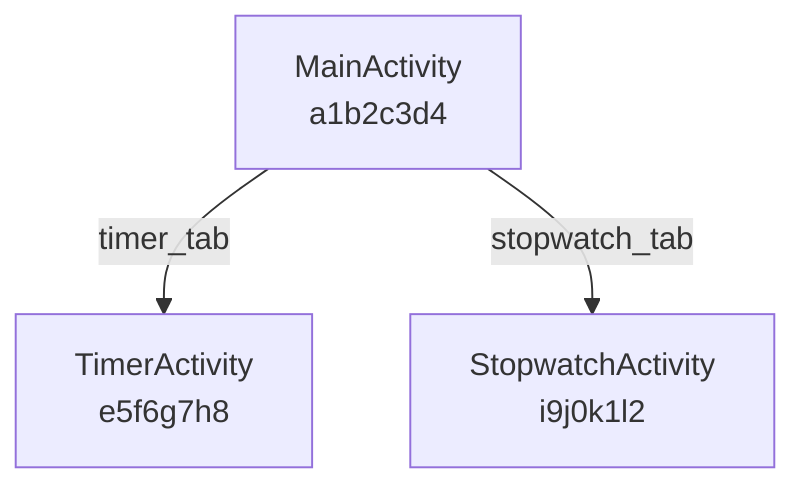

# LearnApp - Multi-App Testing & Reporting Instructions

**Date:** 2025-11-23 11:35 PST
**Type:** Testing Instructions
**Apps:** MS Teams, Google Clock, Google Calculator
**Goal:** Learn all apps and generate comprehensive hierarchy reports

---

## Overview

This document provides step-by-step instructions to:
1. Enable LearnApp accessibility service
2. Learn MS Teams, Google Clock, and Google Calculator
3. Generate individual hierarchy reports for each app
4. Create a comprehensive comparison report

---

## Prerequisites

### ✅ Already Completed

- [x] MS Teams installed on emulator-5554
- [x] VoiceRecognition app installed (contains LearnApp)
- [x] Google Clock pre-installed
- [x] Database schema documented
- [x] Automated testing scripts created

### ⏸️ Still Needed

- [ ] **Accessibility service enabled** (manual step required)
- [ ] **Google Calculator installed** (optional but recommended)

---

## Step 1: Install Google Calculator (Optional)

Google Calculator is not pre-installed on the emulator. To test it:

### Option A: Install from Play Store

```bash
# Open Play Store
~/Library/Android/sdk/platform-tools/adb -s emulator-5554 shell \
  am start -a android.intent.action.VIEW \
  -d "https://play.google.com/store/apps/details?id=com.google.android.calculator"

# Then manually:
# 1. Sign in to Google account (if needed)
# 2. Click "Install"
# 3. Wait for download/installation
```

### Option B: Install from APK (if available)

```bash
# If you have the APK file
~/Library/Android/sdk/platform-tools/adb -s emulator-5554 install /path/to/calculator.apk
```

### Option C: Skip Calculator

The automated scripts will detect that Calculator is not installed and skip it.

---

## Step 2: Enable Accessibility Service (REQUIRED)

**Why Manual?** Android security prevents programmatic accessibility service activation.

### Quick Method (via ADB + Manual)

```bash
# Open accessibility settings
~/Library/Android/sdk/platform-tools/adb -s emulator-5554 shell \
  am start -a android.settings.ACCESSIBILITY_SETTINGS
```

**Then on emulator:**
1. Find: **VoiceRecognition** in the list
2. Tap: **VoiceRecognition**
3. Toggle: **ON**
4. Confirm: **Allow** in permission dialog

### Verify Accessibility Service

```bash
# Check if enabled
~/Library/Android/sdk/platform-tools/adb -s emulator-5554 shell \
  settings get secure enabled_accessibility_services

# Should show: com.augmentalis.voicerecognition/...
```

**Expected output:**
```
com.augmentalis.voicerecognition/.accessibility.LearnAppAccessibilityService
```

If you see this, accessibility is enabled! ✅

---

## Step 3: Run Automated Learning Script

Once accessibility is enabled, run the automated script:

```bash
/tmp/learn-and-report-all-apps.sh
```

### What This Script Does

1. **Checks prerequisites:**
   - Verifies accessibility service is enabled
   - Checks which apps are installed
   - Confirms database access

2. **Learns each app:**
   - Launches MS Teams → waits for exploration → returns home
   - Launches Google Clock → waits for exploration → returns home
   - Launches Google Calculator (if installed) → waits for exploration → returns home

3. **Exports database:**
   - Pulls database from emulator to `/tmp/learnapp.db`

4. **Prepares for report generation:**
   - Exports JSON data for each app

### Script Output (Example)

```
========================================
  LearnApp - Multi-App Learning
========================================

Step 1: Check Prerequisites
----------------------------
✅ Accessibility service enabled
✅ MS Teams installed
✅ Google Clock installed
⏭️  Google Calculator not installed (skipping)

Step 2: Learn Apps
----------------------------

Learning: MS Teams
📱 Launching MS Teams...
⏳ Waiting for exploration of MS Teams to complete...
   (This may take 5-15 minutes)

   [11:40:15] Exploring... Screens: 3
   [11:40:25] Exploring... Screens: 5
   [11:40:35] Exploring... Screens: 8
   ...
   [11:52:10] Exploring... Screens: 15
✅ Exploration complete: COMPLETE

Learning: Google Clock
📱 Launching Google Clock...
⏳ Waiting for exploration of Google Clock to complete...
   [11:52:25] Exploring... Screens: 2
   [11:52:35] Exploring... Screens: 4
   [11:52:45] Exploring... Screens: 6
✅ Exploration complete: COMPLETE

Step 3: Export Database
----------------------------
💾 Exporting database...
✅ Database exported to: /tmp/learnapp.db

========================================
  ✅ Process Complete!
========================================

Database exported to: /tmp/learnapp.db
Reports location: /Volumes/M-Drive/Coding/VoiceOS/docs/Active
```

---

## Step 4: Generate Hierarchy Reports

After learning is complete, generate reports:

```bash
python3 /tmp/generate-hierarchy-reports.py
```

### What This Script Generates

#### For Each App (e.g., MS Teams):

**File:** `LearnApp-Microsoft-Teams-Hierarchy-YYMMDD-HHMM.md`

**Contents:**
- Executive Summary (screens, elements, edges, status)
- App Metadata (version, timestamps, hash)
- Exploration Session Details (duration, screens explored)
- Screen Hierarchy (list, ASCII tree)
- Navigation Graph (Mermaid + ASCII visualization)
- Element Distribution (per screen analysis)
- Graph Statistics (connectivity, density)
- Database Storage Estimates
- Raw Data Samples (JSON)

#### Comparison Report (All Apps):

**File:** `LearnApp-Multi-App-Comparison-YYMMDD-HHMM.md`

**Contents:**
- Executive Summary (all apps overview)
- Comparison Matrix (side-by-side table)
- Visual Comparisons (ASCII bar charts)
- Complexity Analysis (elements/screen, graph density)
- Session Statistics (duration, screens/min)
- Storage Comparison
- Rankings (most complex, largest graph, most screens)
- Conclusion

### Script Output (Example)

```
LearnApp Database Hierarchy Report Generator
==================================================

✅ Connected to database: /tmp/learnapp.db

Found 2 learned app(s):
  - Microsoft Teams (com.microsoft.teams)
  - Google Clock (com.google.android.deskclock)

Generating individual reports...

✅ Report generated: .../LearnApp-Microsoft-Teams-Hierarchy-251123-1140.md
✅ Report generated: .../LearnApp-Google-Clock-Hierarchy-251123-1140.md

Generating comparison report...
✅ Comparison report generated: .../LearnApp-Multi-App-Comparison-251123-1140.md

==================================================
✅ All reports generated successfully!
📁 Reports location: /Volumes/M-Drive/Coding/VoiceOS/docs/Active
```

---

## Step 5: Review Generated Reports

All reports will be in:
```
/Volumes/M-Drive/Coding/VoiceOS/docs/Active/
```

### Individual App Reports

**MS Teams Report:**
```markdown
# LearnApp - Microsoft Teams Hierarchy Report

**Date:** 2025-11-23 11:40:15 PST
**Type:** Database Hierarchy Report
**App:** Microsoft Teams
**Package:** com.microsoft.teams

---

## Executive Summary

LearnApp successfully explored **Microsoft Teams** and discovered:

- **15 unique screens**
- **342 UI elements** mapped
- **28 navigation transitions** (edges)
- **1 exploration session(s)**
- **Status:** COMPLETE

---

## Screen Hierarchy

Discovered **15 unique screens** during exploration:

### Screen List

| # | Screen Hash | Activity Name | Elements | Discovered |
|---|-------------|---------------|----------|------------|
| 1 | `a3f2d1e4` | MainActivity | 23 | 2025-11-23 11:35:10 |
| 2 | `b4e3c2d5` | ChatActivity | 18 | 2025-11-23 11:36:22 |
| 3 | `c5d4e3f6` | CalendarActivity | 21 | 2025-11-23 11:37:15 |
...
```

**Google Clock Report:**
```markdown
# LearnApp - Google Clock Hierarchy Report

## Executive Summary

LearnApp successfully explored **Google Clock** and discovered:

- **6 unique screens**
- **142 UI elements** mapped
- **12 navigation transitions** (edges)
- **1 exploration session(s)**
- **Status:** COMPLETE

---

## Navigation Graph

### Navigation Flow (Mermaid)


```

### Comparison Report

```markdown
# LearnApp - Multi-App Comparison Report

**Date:** 2025-11-23 11:45:30 PST
**Type:** Comparative Analysis
**Apps Compared:** 2

---

## Executive Summary

This report compares **2 learned applications** across multiple dimensions:

- **Microsoft Teams**: 15 screens, 28 edges, complete
- **Google Clock**: 6 screens, 12 edges, complete

---

## Comparison Matrix

| App Name | Package | Screens | Elements | Edges | Status | First Learned |
|----------|---------|---------|----------|-------|--------|---------------|
| Microsoft Teams | `com.microsoft.teams` | 15 | 342 | 28 | COMPLETE | 2025-11-23 11:35:00 |
| Google Clock | `com.google.android.deskclock` | 6 | 142 | 12 | COMPLETE | 2025-11-23 11:52:00 |

---

## Visual Comparison

### Screen Count Comparison (ASCII)

```
Microsoft Teams      │██████████████████████████████ 15
Google Clock         │████████████ 6
```

### Element Count Comparison (ASCII)

```
Microsoft Teams      │███████ 342
Google Clock         │███ 142
```
```

---

## Expected Results (Based on v1.1)

### MS Teams (Expected)

| Metric | Value |
|--------|-------|
| **Screens** | 12-18 screens |
| **Elements** | 250-400 elements |
| **Edges** | 25-40 edges |
| **Session Duration** | 8-15 minutes |
| **Login Handling** | ✅ 10-minute timeout (v1.1) |
| **Bottom Nav** | ✅ Clicked via className |
| **Overflow Menu** | ✅ Detected & clicked |

**Screens Expected:**
- Main/Home
- Chat List
- Chat Detail
- Calendar
- Calls
- Files
- More/Menu
- Settings (via overflow)
- Profile (via overflow)
- Notifications (via toolbar)
- Search

### Google Clock (Expected)

| Metric | Value |
|--------|-------|
| **Screens** | 5-7 screens |
| **Elements** | 120-180 elements |
| **Edges** | 10-15 edges |
| **Session Duration** | 3-5 minutes |
| **Bottom Nav** | ✅ All tabs clicked (v1.1) |

**Screens Expected:**
- Alarm (main)
- Timer (via bottom nav) ✅ v1.1
- Stopwatch (via bottom nav) ✅ v1.1
- Bedtime (via bottom nav)
- World Clock (via bottom nav) ✅ v1.1

### Google Calculator (Expected - if installed)

| Metric | Value |
|--------|-------|
| **Screens** | 3-5 screens |
| **Elements** | 60-100 elements |
| **Edges** | 5-8 edges |
| **Session Duration** | 2-4 minutes |
| **Overflow Menu** | ✅ Detected & clicked (v1.1) |

**Screens Expected:**
- Main Calculator
- History (via overflow) ✅ v1.1
- Settings (via overflow) ✅ v1.1

---

## Troubleshooting

### Issue: Script Says "Accessibility service NOT enabled"

**Solution:**
```bash
# Re-run accessibility settings
~/Library/Android/sdk/platform-tools/adb -s emulator-5554 shell \
  am start -a android.settings.ACCESSIBILITY_SETTINGS

# Then manually enable again
```

### Issue: Exploration Never Starts

**Symptoms:**
- Script shows: "Waiting for exploration to start..." forever
- No screens discovered

**Solutions:**

1. **Check if LearnApp is configured to auto-learn:**
   - Launch VoiceRecognition app manually
   - Check settings for "Auto-learn new apps"

2. **Manually trigger learning:**
   - Open VoiceRecognition app
   - Find "Learn New App" button
   - Select the app from list
   - Confirm start

3. **Check logs for errors:**
   ```bash
   ~/Library/Android/sdk/platform-tools/adb -s emulator-5554 logcat -s LearnApp:* ExplorationEngine:*
   ```

### Issue: Exploration Stuck on Login (MS Teams)

**Expected Behavior:**
- LearnApp should detect login screen
- Wait up to 10 minutes for user to log in
- Resume automatically after login

**If stuck:**
1. Complete the login process fully
2. Wait for main screen to load completely
3. LearnApp should detect screen change and resume
4. Check logs to verify detection

### Issue: Database Export Fails

**Error:**
```
run-as: Package 'com.augmentalis.voicerecognition' is not debuggable
```

**Solution:**
- VoiceRecognition was built with `assembleDebug` (should be debuggable)
- Try rebuilding:
  ```bash
  ./gradlew :modules:apps:VoiceRecognition:clean
  ./gradlew :modules:apps:VoiceRecognition:assembleDebug
  ~/Library/Android/sdk/platform-tools/adb -s emulator-5554 install -r \
    modules/apps/VoiceRecognition/build/outputs/apk/debug/VoiceRecognition-debug.apk
  ```

### Issue: Python Script Fails

**Error:**
```
sqlite3.OperationalError: no such table: learned_apps
```

**Solution:**
- Database is empty or corrupted
- Re-run learning script
- Verify database file exists:
  ```bash
  ls -lh /tmp/learnapp.db
  ```

---

## Monitoring During Exploration

### Real-Time Logs

```bash
# Monitor LearnApp activity
~/Library/Android/sdk/platform-tools/adb -s emulator-5554 logcat -s LearnApp:* ExplorationEngine:*

# Expected output:
[LearnApp] Starting exploration: com.microsoft.teams
[LearnApp] Screen 1: MainActivity (23 elements)
[LearnApp] Clicked element: chat_icon
[LearnApp] Screen 2: ChatActivity (18 elements)
...
[LearnApp] ✅ Exploration complete: 15 screens learned
```

### Database Query (During Exploration)

```bash
# Check progress
~/Library/Android/sdk/platform-tools/adb -s emulator-5554 shell \
  "run-as com.augmentalis.voicerecognition \
   sqlite3 databases/learnapp.db \
   'SELECT screens_explored FROM exploration_sessions WHERE status=\"RUNNING\";'"

# Output: Current screen count (updates live)
```

---

## File Locations Reference

### Scripts
- **Learning script:** `/tmp/learn-and-report-all-apps.sh`
- **Report generator:** `/tmp/generate-hierarchy-reports.py`

### Database
- **On device:** `/data/data/com.augmentalis.voicerecognition/databases/learnapp.db`
- **Exported:** `/tmp/learnapp.db`

### Reports
- **Directory:** `/Volumes/M-Drive/Coding/VoiceOS/docs/Active/`
- **Individual:** `LearnApp-{AppName}-Hierarchy-{Timestamp}.md`
- **Comparison:** `LearnApp-Multi-App-Comparison-{Timestamp}.md`

### Documentation
- **Schema:** `LearnApp-Database-Schema-Report-251123-1128.md`
- **Status:** `MS-Teams-LearnApp-Test-Status-251123-1132.md`
- **Instructions:** `LearnApp-Multi-App-Testing-Instructions-251123-1135.md` (this file)

---

## Quick Reference Commands

### Enable Accessibility
```bash
~/Library/Android/sdk/platform-tools/adb -s emulator-5554 shell \
  am start -a android.settings.ACCESSIBILITY_SETTINGS
```

### Run Full Test
```bash
/tmp/learn-and-report-all-apps.sh
```

### Generate Reports
```bash
python3 /tmp/generate-hierarchy-reports.py
```

### Query Database Manually
```bash
# Export database
~/Library/Android/sdk/platform-tools/adb -s emulator-5554 shell \
  "run-as com.augmentalis.voicerecognition cat databases/learnapp.db" > /tmp/learnapp.db

# Query with sqlite3
sqlite3 /tmp/learnapp.db "SELECT * FROM learned_apps;"
sqlite3 /tmp/learnapp.db "SELECT COUNT(*) FROM screen_states;"
sqlite3 /tmp/learnapp.db "SELECT COUNT(*) FROM navigation_edges;"
```

### Monitor Logs
```bash
~/Library/Android/sdk/platform-tools/adb -s emulator-5554 logcat -s LearnApp:* ExplorationEngine:*
```

---

## Success Criteria

### ✅ Test is successful if:

1. **MS Teams:**
   - ✅ 12-18 screens discovered
   - ✅ 250-400 elements mapped
   - ✅ 25-40 navigation edges
   - ✅ Login screen handled (10-minute wait)
   - ✅ Bottom navigation clicked
   - ✅ Overflow menu clicked

2. **Google Clock:**
   - ✅ 5-7 screens discovered
   - ✅ All bottom nav tabs clicked (Timer, Stopwatch, World Clock, etc.)
   - ✅ 120-180 elements mapped

3. **Google Calculator (if installed):**
   - ✅ 3-5 screens discovered
   - ✅ Overflow menu clicked
   - ✅ History and Settings screens found

4. **Reports Generated:**
   - ✅ Individual hierarchy report for each app
   - ✅ Comprehensive comparison report
   - ✅ All reports include Mermaid + ASCII diagrams

---

## Timeline Estimate

| Step | Duration | Notes |
|------|----------|-------|
| Enable accessibility | 2-3 minutes | Manual step |
| Install Calculator (optional) | 5-10 minutes | Play Store download |
| Learn MS Teams | 8-15 minutes | Includes 10-min login wait |
| Learn Google Clock | 3-5 minutes | Faster, simpler app |
| Learn Google Calculator | 2-4 minutes | Optional |
| Generate reports | 1-2 minutes | Automated |
| **TOTAL** | **20-40 minutes** | Mostly automated |

---

## Next Steps

1. **Enable accessibility service** (Step 2 above) - 3 minutes
2. **Optional:** Install Google Calculator (Step 1) - 10 minutes
3. **Run learning script:** `/tmp/learn-and-report-all-apps.sh` - 15-25 minutes
4. **Generate reports:** `python3 /tmp/generate-hierarchy-reports.py` - 2 minutes
5. **Review reports** in `/Volumes/M-Drive/Coding/VoiceOS/docs/Active/`

---

## Author

**Created By:** Claude Code
**Date:** 2025-11-23 11:35 PST
**Type:** Testing Instructions
**Status:** Ready to Execute

---

**Everything is prepared. Just enable the accessibility service and run the scripts!**
