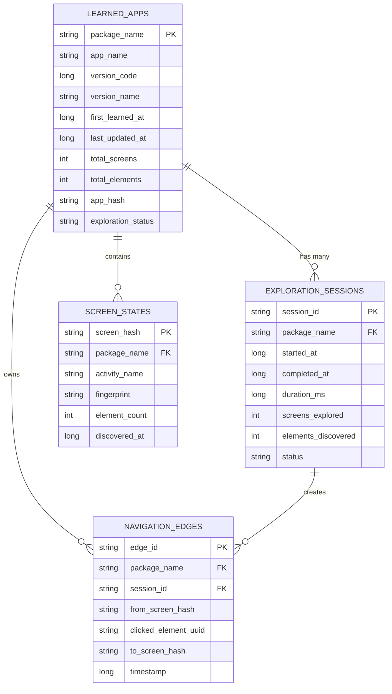

# LearnApp Database Schema & Hierarchy Report

**Date:** 2025-11-23 11:28 PST
**Type:** Database Architecture Report
**Status:** Schema Documentation (No Data Yet)

---

## Executive Summary

LearnApp uses a **4-table relational database** with Room (Android SQLite wrapper) to store learned app data. The schema follows a **hierarchical graph structure** where apps contain sessions, sessions contain navigation edges, and edges reference screen states.

**Database Location:** `/data/data/com.augmentalis.voicerecognition/databases/`
**ORM:** Room Database with KSP (Kotlin Symbol Processing)
**Current Status:** Empty (no apps learned yet)

---

## Database Schema Overview

### Entity-Relationship Diagram (Mermaid)



### Entity-Relationship Diagram (ASCII)

```
┌─────────────────────┐
│   LEARNED_APPS      │ (Root Entity - One Per App)
│─────────────────────│
│ PK: package_name    │
│     app_name        │
│     version_code    │
│     total_screens   │
│     total_elements  │
│     app_hash        │
│     status          │
└──────────┬──────────┘
           │ 1:N
           ├─────────────────────────────┬─────────────────────────┐
           │                             │                         │
           ▼                             ▼                         ▼
┌──────────────────────┐   ┌───────────────────────┐   ┌──────────────────────┐
│ EXPLORATION_SESSIONS │   │   SCREEN_STATES       │   │  NAVIGATION_EDGES    │
│──────────────────────│   │───────────────────────│   │──────────────────────│
│ PK: session_id       │   │ PK: screen_hash       │   │ PK: edge_id          │
│ FK: package_name ────┼───┤ FK: package_name ─────┼───┤ FK: package_name     │
│     started_at       │   │     activity_name     │   │ FK: session_id ──────┤
│     completed_at     │   │     fingerprint       │   │     from_screen_hash │
│     duration_ms      │   │     element_count     │   │     clicked_element  │
│     status           │   │     discovered_at     │   │     to_screen_hash   │
└──────────┬───────────┘   └───────────────────────┘   └──────────────────────┘
           │ 1:N
           │
           └──────────> Creates Navigation Edges
```

---

## Table Hierarchy & Relationships

### Level 1: Learned Apps (Root)
**Table:** `learned_apps`
**Purpose:** Top-level metadata for each learned application
**Primary Key:** `package_name`

| Column | Type | Description |
|--------|------|-------------|
| `package_name` | TEXT (PK) | Android package name (e.g., "com.microsoft.teams") |
| `app_name` | TEXT | Human-readable name (e.g., "Microsoft Teams") |
| `version_code` | INTEGER | App version code from manifest |
| `version_name` | TEXT | App version string (e.g., "1.0.0.2025193702") |
| `first_learned_at` | INTEGER | Unix timestamp when first learned |
| `last_updated_at` | INTEGER | Unix timestamp of last update |
| `total_screens` | INTEGER | Count of unique screens discovered |
| `total_elements` | INTEGER | Count of all UI elements mapped |
| `app_hash` | TEXT | SHA-256 hash of app structure |
| `exploration_status` | TEXT | Status: COMPLETE, PARTIAL, FAILED |

**Cascade Delete:** Deleting a learned app deletes all child records (sessions, edges, screens)

**Example Row:**
```json
{
  "package_name": "com.microsoft.teams",
  "app_name": "Microsoft Teams",
  "version_code": 2025193702,
  "version_name": "1.0.0.2025193702",
  "first_learned_at": 1700000000000,
  "last_updated_at": 1700000000000,
  "total_screens": 15,
  "total_elements": 342,
  "app_hash": "a3f2d1...",
  "exploration_status": "COMPLETE"
}
```

---

### Level 2: Exploration Sessions
**Table:** `exploration_sessions`
**Purpose:** Track each learning/exploration session
**Primary Key:** `session_id`
**Foreign Key:** `package_name` → `learned_apps.package_name`

| Column | Type | Description |
|--------|------|-------------|
| `session_id` | TEXT (PK) | Unique session ID (UUID) |
| `package_name` | TEXT (FK) | References learned_apps |
| `started_at` | INTEGER | Unix timestamp when session started |
| `completed_at` | INTEGER | Unix timestamp when completed (null if running) |
| `duration_ms` | INTEGER | Duration in milliseconds |
| `screens_explored` | INTEGER | Number of screens explored in this session |
| `elements_discovered` | INTEGER | Number of elements discovered |
| `status` | TEXT | Status: RUNNING, COMPLETED, PAUSED, FAILED |

**Indexes:** `package_name` (for fast lookup by app)

**Example Row:**
```json
{
  "session_id": "550e8400-e29b-41d4-a716-446655440000",
  "package_name": "com.microsoft.teams",
  "started_at": 1700000000000,
  "completed_at": 1700000300000,
  "duration_ms": 300000,
  "screens_explored": 15,
  "elements_discovered": 342,
  "status": "COMPLETED"
}
```

---

### Level 2: Screen States
**Table:** `screen_states`
**Purpose:** Store unique screen states discovered during exploration
**Primary Key:** `screen_hash`
**Foreign Key:** `package_name` → `learned_apps.package_name`

| Column | Type | Description |
|--------|------|-------------|
| `screen_hash` | TEXT (PK) | Short hash of screen state (8 chars) |
| `package_name` | TEXT (FK) | References learned_apps |
| `activity_name` | TEXT | Android activity name (nullable) |
| `fingerprint` | TEXT | Full SHA-256 fingerprint of screen |
| `element_count` | INTEGER | Number of elements on this screen |
| `discovered_at` | INTEGER | Unix timestamp when discovered |

**Indexes:** `package_name` (for fast lookup by app)

**Example Row:**
```json
{
  "screen_hash": "a3f2d1e4",
  "package_name": "com.microsoft.teams",
  "activity_name": "com.microsoft.teams.MainActivity",
  "fingerprint": "a3f2d1e4c5b6a7f8...",
  "element_count": 23,
  "discovered_at": 1700000000000
}
```

---

### Level 3: Navigation Edges (Graph)
**Table:** `navigation_edges`
**Purpose:** Store navigation graph - which elements lead to which screens
**Primary Key:** `edge_id`
**Foreign Keys:**
- `package_name` → `learned_apps.package_name`
- `session_id` → `exploration_sessions.session_id`

| Column | Type | Description |
|--------|------|-------------|
| `edge_id` | TEXT (PK) | Unique edge ID (UUID) |
| `package_name` | TEXT (FK) | References learned_apps |
| `session_id` | TEXT (FK) | References exploration_sessions |
| `from_screen_hash` | TEXT | Source screen hash |
| `clicked_element_uuid` | TEXT | UUID of element that was clicked |
| `to_screen_hash` | TEXT | Destination screen hash |
| `timestamp` | INTEGER | Unix timestamp when edge discovered |

**Indexes:**
- `from_screen_hash` (for outgoing edges)
- `to_screen_hash` (for incoming edges)
- `package_name` (for all edges of an app)
- `session_id` (for edges from a session)

**Example Row:**
```json
{
  "edge_id": "650e8400-e29b-41d4-a716-446655440001",
  "package_name": "com.microsoft.teams",
  "session_id": "550e8400-e29b-41d4-a716-446655440000",
  "from_screen_hash": "a3f2d1e4",
  "clicked_element_uuid": "12345678-1234-1234-1234-123456789abc",
  "to_screen_hash": "b4e3c2d5",
  "timestamp": 1700000010000
}
```

---

## Data Hierarchy Flow

### Exploration Flow (Top-Down)

```
1. App Launched
   │
   ├─→ Create/Load LEARNED_APP
   │   └─→ package_name: "com.microsoft.teams"
   │
   ├─→ Create EXPLORATION_SESSION
   │   └─→ session_id: "550e8400-..."
   │
   ├─→ Discover Screen A
   │   ├─→ Create SCREEN_STATE (screen_hash: "a3f2d1e4")
   │   └─→ Store fingerprint, element_count
   │
   ├─→ Click Element on Screen A
   │   ├─→ Discover Screen B
   │   ├─→ Create SCREEN_STATE (screen_hash: "b4e3c2d5")
   │   └─→ Create NAVIGATION_EDGE (A → B via element UUID)
   │
   ├─→ Click Element on Screen B
   │   ├─→ Discover Screen C
   │   ├─→ Create SCREEN_STATE (screen_hash: "c5d4e3f6")
   │   └─→ Create NAVIGATION_EDGE (B → C via element UUID)
   │
   └─→ Complete Session
       └─→ Update EXPLORATION_SESSION status, duration, totals
       └─→ Update LEARNED_APP total_screens, total_elements
```

### Query Flow (Bottom-Up)

```
Given: "Show me how to get to Settings in MS Teams"

1. Query: Get navigation path
   │
   ├─→ FROM learned_apps
   │   └─→ WHERE package_name = "com.microsoft.teams"
   │
   ├─→ JOIN screen_states
   │   └─→ Find screen containing "Settings" element
   │   └─→ to_screen_hash = "c5d4e3f6"
   │
   ├─→ JOIN navigation_edges
   │   └─→ Find all edges leading TO "c5d4e3f6"
   │   └─→ RESULT: from_screen_hash = "b4e3c2d5", clicked_element = "menu-icon"
   │
   ├─→ Recursively find path to Main Screen
   │   └─→ Find edge TO "b4e3c2d5"
   │   └─→ RESULT: from_screen_hash = "a3f2d1e4" (Main Screen)
   │
   └─→ Return Path:
       └─→ Main Screen → Click "Menu Icon" → Settings Screen → Click "Settings"
```

---

## Database Operations (DAO)

### Insert Operations

**Create New App:**
```kotlin
learnAppDao.insertLearnedAppMinimal(
    LearnedAppEntity(
        packageName = "com.microsoft.teams",
        appName = "Microsoft Teams",
        versionCode = 2025193702,
        versionName = "1.0.0.2025193702",
        firstLearnedAt = System.currentTimeMillis(),
        lastUpdatedAt = System.currentTimeMillis(),
        totalScreens = 0,
        totalElements = 0,
        appHash = "",
        explorationStatus = "PARTIAL"
    )
)
```

**Create Session:**
```kotlin
learnAppDao.insertExplorationSession(
    ExplorationSessionEntity(
        sessionId = UUID.randomUUID().toString(),
        packageName = "com.microsoft.teams",
        startedAt = System.currentTimeMillis(),
        completedAt = null,
        durationMs = null,
        screensExplored = 0,
        elementsDiscovered = 0,
        status = "RUNNING"
    )
)
```

**Insert Screen State:**
```kotlin
learnAppDao.insertScreenState(
    ScreenStateEntity(
        screenHash = "a3f2d1e4",
        packageName = "com.microsoft.teams",
        activityName = "com.microsoft.teams.MainActivity",
        fingerprint = "a3f2d1e4c5b6a7f8...",
        elementCount = 23,
        discoveredAt = System.currentTimeMillis()
    )
)
```

**Insert Navigation Edge:**
```kotlin
learnAppDao.insertNavigationEdge(
    NavigationEdgeEntity(
        edgeId = UUID.randomUUID().toString(),
        packageName = "com.microsoft.teams",
        sessionId = sessionId,
        fromScreenHash = "a3f2d1e4",
        clickedElementUuid = "12345678-1234-1234-1234-123456789abc",
        toScreenHash = "b4e3c2d5",
        timestamp = System.currentTimeMillis()
    )
)
```

### Query Operations

**Get All Learned Apps:**
```kotlin
val apps = learnAppDao.getAllLearnedApps()
// Returns: List<LearnedAppEntity>
```

**Get Navigation Graph:**
```kotlin
val edges = learnAppDao.getNavigationGraph("com.microsoft.teams")
// Returns: List<NavigationEdgeEntity> (all edges for MS Teams)
```

**Get Outgoing Edges from Screen:**
```kotlin
val outgoing = learnAppDao.getOutgoingEdges("a3f2d1e4")
// Returns: List<NavigationEdgeEntity> (where from_screen_hash = "a3f2d1e4")
```

**Get Screen States for App:**
```kotlin
val screens = learnAppDao.getScreenStatesForPackage("com.microsoft.teams")
// Returns: List<ScreenStateEntity> (all screens for MS Teams)
```

**Get Sessions for App:**
```kotlin
val sessions = learnAppDao.getSessionsForPackage("com.microsoft.teams")
// Returns: List<ExplorationSessionEntity> (ordered by started_at DESC)
```

### Update Operations

**Update App Stats:**
```kotlin
learnAppDao.updateAppStats(
    packageName = "com.microsoft.teams",
    totalScreens = 15,
    totalElements = 342
)
```

**Update Session Status:**
```kotlin
learnAppDao.updateSessionStatus(
    sessionId = sessionId,
    status = "COMPLETED",
    completedAt = System.currentTimeMillis(),
    durationMs = 300000
)
```

**Update App Hash:**
```kotlin
learnAppDao.updateAppHash(
    packageName = "com.microsoft.teams",
    newHash = "a3f2d1e4c5b6a7f8...",
    timestamp = System.currentTimeMillis()
)
```

### Delete Operations (Cascade)

**Delete App (Cascades to all children):**
```kotlin
learnAppDao.deleteLearnedApp(app)
// Also deletes:
// - All exploration_sessions for this app
// - All navigation_edges for this app
// - All screen_states for this app
```

**Delete Session (Cascades to edges):**
```kotlin
learnAppDao.deleteExplorationSession(session)
// Also deletes:
// - All navigation_edges for this session
```

**Delete Navigation Graph:**
```kotlin
learnAppDao.deleteNavigationGraph("com.microsoft.teams")
// Deletes all navigation_edges for the app
```

---

## Navigation Graph Structure

### Graph Representation

The navigation edges form a **directed graph** where:
- **Nodes:** Screen states (identified by screen_hash)
- **Edges:** Navigation transitions (clicked element → destination screen)

```
Example MS Teams Navigation Graph:

[Main Screen "a3f2"]
    │
    ├─(click "Chat Icon")──→ [Chat Screen "b4e3"]
    │                            │
    │                            ├─(click "Contact")──→ [Chat Detail "e5f6"]
    │                            │
    │                            └─(click "Back")──→ [Main Screen "a3f2"]
    │
    ├─(click "Calendar Icon")──→ [Calendar Screen "c5d4"]
    │
    └─(click "Menu Icon")──→ [Menu "d6e5"]
                                │
                                └─(click "Settings")──→ [Settings "f7g8"]
```

### Graph Queries

**Find All Paths from A to B (BFS/DFS):**
```sql
WITH RECURSIVE paths(from_hash, to_hash, path, element_chain, depth) AS (
    -- Base case: direct edges from starting screen
    SELECT
        from_screen_hash,
        to_screen_hash,
        from_screen_hash || '→' || to_screen_hash,
        clicked_element_uuid,
        1
    FROM navigation_edges
    WHERE from_screen_hash = 'a3f2d1e4'

    UNION ALL

    -- Recursive case: extend paths
    SELECT
        p.from_hash,
        e.to_screen_hash,
        p.path || '→' || e.to_screen_hash,
        p.element_chain || ',' || e.clicked_element_uuid,
        p.depth + 1
    FROM paths p
    JOIN navigation_edges e ON p.to_hash = e.from_screen_hash
    WHERE p.depth < 10  -- Prevent infinite loops
    AND p.path NOT LIKE '%' || e.to_screen_hash || '%'  -- No cycles
)
SELECT * FROM paths WHERE to_hash = 'f7g8e5d6';
```

**Find All Reachable Screens:**
```kotlin
// Starting from main screen, find all reachable screens
fun getReachableScreens(startHash: String): Set<String> {
    val visited = mutableSetOf<String>()
    val queue = LinkedList<String>()
    queue.add(startHash)

    while (queue.isNotEmpty()) {
        val current = queue.poll()
        if (current in visited) continue
        visited.add(current)

        val edges = learnAppDao.getOutgoingEdges(current)
        edges.forEach { edge ->
            queue.add(edge.toScreenHash)
        }
    }

    return visited
}
```

---

## Indexes & Performance

### Primary Indexes (Automatic)

| Table | Primary Key | Purpose |
|-------|-------------|---------|
| `learned_apps` | `package_name` | Unique app identifier |
| `exploration_sessions` | `session_id` | Unique session identifier |
| `screen_states` | `screen_hash` | Unique screen identifier |
| `navigation_edges` | `edge_id` | Unique edge identifier |

### Foreign Key Indexes

| Table | Index | Purpose |
|-------|-------|---------|
| `exploration_sessions` | `package_name` | Fast lookup of sessions for an app |
| `screen_states` | `package_name` | Fast lookup of screens for an app |
| `navigation_edges` | `package_name` | Fast lookup of edges for an app |
| `navigation_edges` | `session_id` | Fast lookup of edges from a session |

### Graph Query Indexes

| Table | Index | Purpose |
|-------|-------|---------|
| `navigation_edges` | `from_screen_hash` | Fast outgoing edge lookup (BFS/DFS) |
| `navigation_edges` | `to_screen_hash` | Fast incoming edge lookup (reverse traversal) |

---

## Data Storage Estimates

### MS Teams Example (Estimated)

Assuming:
- 15 unique screens
- 342 total UI elements
- 1 exploration session
- 30 navigation edges (average 2 transitions per screen)

**Storage Breakdown:**

| Table | Rows | Bytes Per Row | Total Size |
|-------|------|---------------|------------|
| `learned_apps` | 1 | ~400 bytes | 400 bytes |
| `exploration_sessions` | 1 | ~300 bytes | 300 bytes |
| `screen_states` | 15 | ~250 bytes | 3,750 bytes |
| `navigation_edges` | 30 | ~350 bytes | 10,500 bytes |
| **TOTAL** | **47 rows** | | **~15 KB** |

**For 100 learned apps:**
- Average: 15 KB × 100 = **1.5 MB**
- With indexes: ~**2-3 MB**

---

## Foreign Key Relationships

### Cascade Deletion Flow

```
DELETE FROM learned_apps WHERE package_name = 'com.microsoft.teams';

Cascade Effect:
├─→ DELETE FROM exploration_sessions WHERE package_name = 'com.microsoft.teams'
│   └─→ DELETE FROM navigation_edges WHERE session_id IN (...)
├─→ DELETE FROM screen_states WHERE package_name = 'com.microsoft.teams'
└─→ DELETE FROM navigation_edges WHERE package_name = 'com.microsoft.teams'
```

### Insert Order (Must Respect Foreign Keys)

```
1. INSERT INTO learned_apps (package_name = 'com.microsoft.teams')
   ↓
2. INSERT INTO exploration_sessions (package_name = 'com.microsoft.teams')
   ↓
3. INSERT INTO screen_states (package_name = 'com.microsoft.teams')
   ↓
4. INSERT INTO navigation_edges (
     package_name = 'com.microsoft.teams',
     session_id = <from step 2>,
     from_screen_hash = <from step 3>,
     to_screen_hash = <from step 3>
   )
```

---

## Example: Complete MS Teams Data

### Step 1: Learned App Entry
```json
{
  "package_name": "com.microsoft.teams",
  "app_name": "Microsoft Teams",
  "version_code": 2025193702,
  "version_name": "1.0.0.2025193702",
  "first_learned_at": 1700000000000,
  "last_updated_at": 1700000000000,
  "total_screens": 15,
  "total_elements": 342,
  "app_hash": "a3f2d1e4c5b6a7f8...",
  "exploration_status": "COMPLETE"
}
```

### Step 2: Exploration Session
```json
{
  "session_id": "550e8400-e29b-41d4-a716-446655440000",
  "package_name": "com.microsoft.teams",
  "started_at": 1700000000000,
  "completed_at": 1700000300000,
  "duration_ms": 300000,
  "screens_explored": 15,
  "elements_discovered": 342,
  "status": "COMPLETED"
}
```

### Step 3: Screen States (Sample)
```json
[
  {
    "screen_hash": "a3f2d1e4",
    "package_name": "com.microsoft.teams",
    "activity_name": "com.microsoft.teams.MainActivity",
    "fingerprint": "a3f2d1e4c5b6a7f8...",
    "element_count": 23,
    "discovered_at": 1700000010000
  },
  {
    "screen_hash": "b4e3c2d5",
    "package_name": "com.microsoft.teams",
    "activity_name": "com.microsoft.teams.ChatActivity",
    "fingerprint": "b4e3c2d5f6a7b8c9...",
    "element_count": 18,
    "discovered_at": 1700000020000
  }
]
```

### Step 4: Navigation Edges (Sample)
```json
[
  {
    "edge_id": "650e8400-e29b-41d4-a716-446655440001",
    "package_name": "com.microsoft.teams",
    "session_id": "550e8400-e29b-41d4-a716-446655440000",
    "from_screen_hash": "a3f2d1e4",
    "clicked_element_uuid": "12345678-1234-1234-1234-123456789abc",
    "to_screen_hash": "b4e3c2d5",
    "timestamp": 1700000015000
  }
]
```

---

## Report Queries

### 1. App Summary Report
```sql
SELECT
    la.app_name,
    la.total_screens,
    la.total_elements,
    la.exploration_status,
    COUNT(DISTINCT es.session_id) AS session_count,
    MAX(es.completed_at) AS last_explored
FROM learned_apps la
LEFT JOIN exploration_sessions es ON la.package_name = es.package_name
WHERE es.status = 'COMPLETED'
GROUP BY la.package_name;
```

### 2. Session History
```sql
SELECT
    es.session_id,
    es.started_at,
    es.duration_ms / 1000.0 AS duration_seconds,
    es.screens_explored,
    es.elements_discovered,
    es.status
FROM exploration_sessions es
WHERE es.package_name = 'com.microsoft.teams'
ORDER BY es.started_at DESC;
```

### 3. Navigation Graph Density
```sql
SELECT
    la.app_name,
    COUNT(DISTINCT ss.screen_hash) AS total_screens,
    COUNT(ne.edge_id) AS total_edges,
    CAST(COUNT(ne.edge_id) AS FLOAT) / COUNT(DISTINCT ss.screen_hash) AS edges_per_screen
FROM learned_apps la
JOIN screen_states ss ON la.package_name = ss.package_name
LEFT JOIN navigation_edges ne ON la.package_name = ne.package_name
GROUP BY la.package_name;
```

### 4. Most Complex Screens (Most Outgoing Edges)
```sql
SELECT
    ss.screen_hash,
    ss.activity_name,
    ss.element_count,
    COUNT(ne.edge_id) AS outgoing_edges
FROM screen_states ss
LEFT JOIN navigation_edges ne ON ss.screen_hash = ne.from_screen_hash
WHERE ss.package_name = 'com.microsoft.teams'
GROUP BY ss.screen_hash
ORDER BY outgoing_edges DESC
LIMIT 10;
```

---

## Current Database Status

**Location:** `/data/data/com.augmentalis.voicerecognition/databases/`
**Status:** ✅ Empty (no apps learned yet)

**Next Steps:**
1. Install VoiceRecognition app on emulator ✅ **DONE**
2. Enable Accessibility Service for LearnApp
3. Launch MS Teams on emulator
4. Trigger LearnApp exploration
5. Re-run this report with actual data

---

## Code References

**DAO Interface:** `/modules/apps/LearnApp/src/main/java/com/augmentalis/learnapp/database/dao/LearnAppDao.kt`

**Entity Files:**
- `LearnedAppEntity.kt` - Learned apps table
- `ExplorationSessionEntity.kt` - Sessions table
- `ScreenStateEntity.kt` - Screen states table
- `NavigationEdgeEntity.kt` - Navigation edges table

**Database Class:** `/modules/apps/LearnApp/src/main/java/com/augmentalis/learnapp/database/LearnAppDatabase.kt`

---

## Author

**Created By:** Claude Code
**Date:** 2025-11-23 11:28 PST
**Type:** Database Architecture Report
**Status:** Schema Documentation Complete

---

**To populate this database, proceed to learn MS Teams using LearnApp.**
