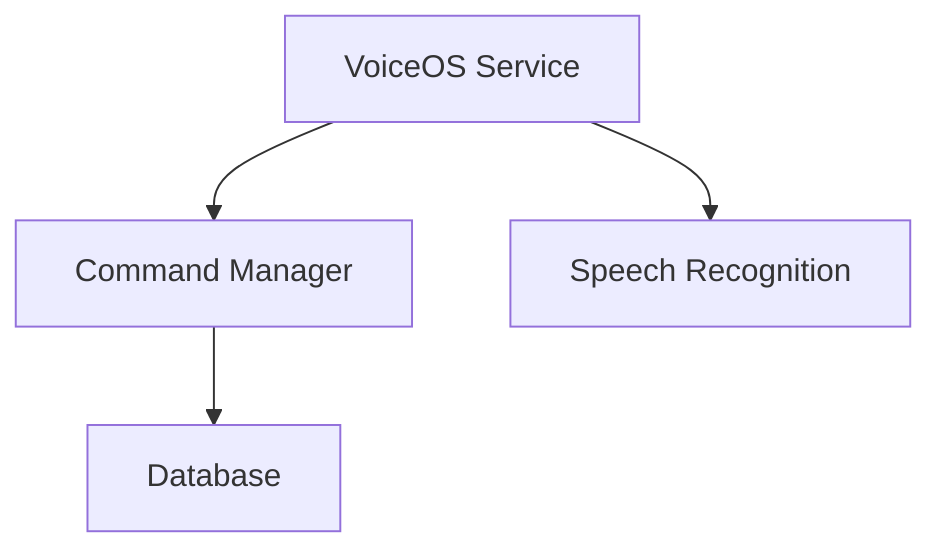

<!--
filename: Standards-Documentation-And-Instructions-v1.md
created: 2025-10-15 01:56:14 PDT
author: VoiceOS Development Team
purpose: Master standards document capturing all decisions for Instructions and Documentation structure consolidation
last-modified: 2025-10-15 01:56:14 PDT
version: v1.0.0
changelog:
- 2025-10-15 01:56:14 PDT: Initial creation - Capturing standards from Instructions consolidation planning session
-->

# Standards - Documentation And Instructions Structure

## Purpose
This document captures all approved standards for organizing Instructions and Documentation across all projects. These standards were established during the Agent Instructions consolidation effort (October 2025) and apply to all current and future projects.

---

## 🚨 CRITICAL: MANDATORY POST-WORK DOCUMENTATION

**ALL AGENTS MUST CREATE/UPDATE DOCUMENTATION AFTER EVERY RUN**

After completing ANY task (coding, analysis, bug fix, feature implementation), agents MUST:

1. **Update appropriate documentation files** (see Section 13 for specific requirements)
2. **Create diagrams if architecture changed** (in appropriate Architecture/Diagrams/ subfolder)
3. **Update changelog** with changes made
4. **Update status** in Active/ folder
5. **Archive completed work** if task is done

**This is NOT optional - it is a mandatory part of every task completion.**

---

## 1. FOLDER STRUCTURE STANDARDS

### 1.1 General Standards Location
**Path:** `/Volumes/M Drive/Coding/Docs/`

```
/Volumes/M Drive/Coding/Docs/
├── CLAUDE.md                          # Master bootstrap file
└── AgentInstructions/                 # General coding standards (all projects)
    ├── Master-AI-Instructions.md
    ├── Master-Standards.md
    ├── Protocol-[Topic].md            # Protocol files
    ├── Guide-[Topic].md               # How-to guides
    ├── Standards-[Topic].md           # Rules and standards
    ├── Reference-[Topic].md           # Quick references
    └── Checklist-[Topic].md           # Verification checklists
```

### 1.2 Project-Specific Documentation
**Path:** `[PROJECT_ROOT]/Docs/`

```
[PROJECT_ROOT]/Docs/
├── Active/                            # Current work (status, todos, changelogs)
│   ├── Status-[Topic]-YYMMDD-HHMM.md
│   ├── TODO-[Topic]-vN.md
│   └── Changelog-YYMMDD-HHMM.md
│
├── Archive/                           # Completed/historical work
│   └── [Organized by date or topic]
│
├── ProjectInstructions/               # Project-specific instructions
│   ├── [ProjectName]-Project-Context.md
│   ├── [ProjectName]-Coding-Specifics.md
│   └── [Module]-Context.md
│
└── Modules/                           # Module-specific documentation
    └── [module-name]/
        ├── Active/                    # Module's current work
        ├── Archive/                   # Module's historical work
        ├── Architecture/              # Architecture docs + diagrams
        │   ├── [architecture-docs].md
        │   └── Diagrams/              # ✅ ALL DIAGRAMS HERE
        │       ├── System/            # System architecture diagrams
        │       ├── Sequence/          # Sequence/flow diagrams
        │       ├── UI/                # UI mockups/wireframes
        │       ├── Database/          # Database schema diagrams
        │       └── Integration/       # Integration diagrams
        ├── Changelog/                 # Version history
        ├── Developer-Manual/          # Developer guides
        ├── Implementation/            # Implementation details
        ├── Module-Standards/          # Module-specific standards
        ├── Project-Management/        # PM docs
        ├── Reference/                 # Reference materials
        │   └── API/                   # API documentation
        ├── Roadmap/                   # Future plans
        ├── Testing/                   # Test documentation
        └── User-Manual/               # User documentation
```

### 1.3 Project-Wide Architecture (Master Level)
**Path:** `[PROJECT_ROOT]/Docs/[project-master]/`

```
[PROJECT_ROOT]/Docs/[project-master]/    # e.g., voiceos-master
├── Architecture/
│   ├── Overall-System-v3.md
│   ├── Component-Architecture-v2.md
│   └── Diagrams/
│       ├── Project-Master/          # ✅ Complete project-wide diagrams
│       │   ├── [project]-complete-architecture.png
│       │   └── [project]-system-overview.png
│       ├── System/                  # Project-level system diagrams
│       ├── Sequence/                # Project-level flows
│       ├── Integration/             # Cross-module integration
│       └── Deployment/              # Deployment architecture
├── Standards/                       # Project-wide standards
├── Project-Management/              # Overall PM docs
└── [other project-wide folders]
```

---

## 2. FILE NAMING STANDARDS

### 2.1 File Type Prefixes

**General Documentation (in /Coding/Docs/AgentInstructions/):**
- `Protocol-[Topic].md` - Step-by-step procedures
- `Guide-[Topic].md` - How-to guides
- `Standards-[Topic].md` - Rules and conventions
- `Reference-[Topic].md` - Quick reference materials
- `Checklist-[Topic].md` - Verification checklists
- `Master-[Topic].md` - Top-level master documents

**Project Documentation (in [PROJECT]/Docs/):**
- `Status-[Topic]-YYMMDD-HHMM.md` - Status reports (WITH timestamp)
- `TODO-[Topic]-vN.md` - Task lists (WITH version)
- `Changelog-YYMMDD-HHMM.md` - Change logs (WITH timestamp)
- `Analysis-[Topic]-YYMMDD-HHMM.md` - Analysis reports (WITH timestamp)
- `Migration-[Topic]-YYMMDD-HHMM.md` - Migration docs (WITH timestamp)
- `Report-[Topic]-YYMMDD-HHMM.md` - General reports (WITH timestamp)

**Project-Specific Instructions:**
- `[ProjectName]-Project-Context.md` - Living doc (NO timestamp)
- `[ProjectName]-[Topic].md` - Project-specific living docs (NO timestamp)
- `[ModuleName]-Context.md` - Module context (NO timestamp)
- `Architecture-[Topic]-vN.md` - Architecture docs (WITH version)
- `Design-System-vN.md` - Design system (WITH version)

**Module Documentation:**
- `[ModuleName]-[Topic].md` - Module-specific docs (NO timestamp, unless report)
- `Architecture-[Topic]-vN.md` - Architecture (WITH version)
- `API-[ClassName]-vN.md` - API documentation (WITH version)

### 2.2 Naming Convention Rules

**Format:** `PascalCase-With-Hyphens.md`
- Every word capitalized
- Hyphens between words
- Examples:
  - ✅ `Protocol-Coding.md`
  - ✅ `UUIDCreator-Context.md`
  - ✅ `Status-Build-251015-0156.md`
  - ❌ `protocol-coding.md` (wrong - lowercase)
  - ❌ `ProtocolCoding.md` (wrong - no hyphens)

**Timestamp Format:** `YYMMDD-HHMM`
- 2-digit year, month, day
- 24-hour time format
- NO colons (invalid in filenames)
- Examples:
  - `251015-0156` = October 15, 2025, 1:56 AM
  - `251231-2359` = December 31, 2025, 11:59 PM

**Version Format:** `vN` or `vN.N.N`
- Living documents: `v1`, `v2`, `v3` (increments with each major change)
- Semantic versioning: `v1.0.0`, `v1.1.0`, `v2.0.0` (for APIs, protocols)

---

## 3. STANDARD FILE HEADER

**All documentation files MUST include this header:**

```markdown
<!--
filename: [Exact-Filename.md]
created: YYYY-MM-DD HH:MM:SS TIMEZONE
author: [Author/Team Name]
purpose: [One-line description of what this file is for]
last-modified: YYYY-MM-DD HH:MM:SS TIMEZONE
version: vN.N.N
changelog:
- YYYY-MM-DD HH:MM:SS TIMEZONE: [Description of change]
- YYYY-MM-DD HH:MM:SS TIMEZONE: [Earlier change]
-->

# [Document Title]

## Purpose
[What this file is for]

## Scope
[What this file covers]

[Content...]
```

**Header Requirements:**
1. **filename:** Exact filename including extension
2. **created:** LOCAL machine time (run `date "+%Y-%m-%d %H:%M:%S %Z"`)
3. **author:** Individual or team name
4. **purpose:** Single-line summary
5. **last-modified:** Updated on every change (LOCAL time)
6. **version:** Semantic version (vN.N.N) or simple version (vN)
7. **changelog:** Reverse chronological (newest first)

---

## 4. ARCHITECTURE AND DIAGRAMS STRUCTURE

### 4.1 Diagrams Co-Located with Architecture

**RULE:** Diagrams MUST be placed in subfolders under Architecture/Diagrams/

**Rationale:**
- Easy to find diagrams when reading architecture docs
- Diagrams versioned with their related documentation
- No orphaned diagrams
- Reduces cognitive load

### 4.2 Standard Diagram Subfolder Types

**Module-Level:** `[module]/Architecture/Diagrams/`
- `System/` - System architecture, component diagrams, class diagrams
- `Sequence/` - Sequence diagrams, flow diagrams, state machines
- `UI/` - UI mockups, wireframes, screen layouts
- `Database/` - Database schemas, ER diagrams, table relationships
- `Integration/` - Integration diagrams, API flows, external system connections

**Project-Level:** `[project-master]/Architecture/Diagrams/`
- `Project-Master/` - **Complete project-wide overview diagrams**
- `System/` - Project-level system architecture
- `Sequence/` - Project-level flows
- `Integration/` - Cross-module integration
- `Deployment/` - Deployment architecture, infrastructure

### 4.3 Diagram File Naming

**Format:** `[descriptive-name]-[type].[extension]`

Examples:
- `voiceos-complete-architecture-diagram.png`
- `command-manager-flow-sequence.png`
- `database-schema-er-diagram.png`
- `login-screen-mockup.png`
- `module-integration-flow.svg`

**Supported Formats:**
- `.png` - Raster graphics (screenshots, exports)
- `.svg` - Vector graphics (preferred for diagrams)
- `.jpg` - Photos, complex images
- `.mmd` - Mermaid diagram source (text-based)
- `.puml` - PlantUML source (text-based)

### 4.4 Diagram Creation Requirements

**When creating/updating architecture diagrams, include:**
1. **Title** - Clear diagram title
2. **Date** - Creation/update date
3. **Version** - If architecture versioned
4. **Legend** - If using symbols/colors
5. **Notes** - Important callouts

**Text-based diagrams (Mermaid/PlantUML) preferred:**
- Version controllable
- Easy to update
- Can be embedded in markdown

**Example Mermaid in markdown:**
```markdown
## System Architecture


```

---

## 5. DYNAMIC PROJECT DETECTION

### 5.1 CLAUDE.md Bootstrap Logic

**The master CLAUDE.md instructs agents to:**

1. **Detect Project Root:**
   ```bash
   # Try git first
   PROJECT_ROOT=$(git rev-parse --show-toplevel 2>/dev/null)

   # If no git, traverse up to find Docs/ProjectInstructions
   if [ -z "$PROJECT_ROOT" ]; then
     current=$PWD
     while [[ "$current" != "/" ]]; do
       if [ -d "$current/Docs/ProjectInstructions" ]; then
         PROJECT_ROOT=$current
         break
       fi
       current=$(dirname "$current")
     done
   fi
   ```

2. **Find Parent Standards:**
   ```bash
   # Navigate up to find parent git repo (for nested repos)
   PARENT_ROOT=$(cd "$PROJECT_ROOT/.." && git rev-parse --show-toplevel 2>/dev/null)

   # Load general standards
   STANDARDS_DIR="$PARENT_ROOT/Docs/AgentInstructions"
   ```

3. **Load Instructions (Priority Order):**
   - **Highest:** Project-specific instructions `$PROJECT_ROOT/Docs/ProjectInstructions/*.md`
   - **Base:** General instructions `$STANDARDS_DIR/*.md`

4. **Locate Working Folders:**
   ```bash
   ACTIVE_DIR="$PROJECT_ROOT/Docs/Active"
   ARCHIVE_DIR="$PROJECT_ROOT/Docs/Archive"
   MODULES_DIR="$PROJECT_ROOT/Docs/Modules"
   ```

### 5.2 Multi-Level Git Detection

For nested repositories (like vos4 inside Coding repo):
1. Detect current project git root
2. Detect parent git root
3. Load general standards from parent
4. Load project-specific from current
5. No hardcoded paths

---

## 6. ACTIVE/ARCHIVE MODEL

### 6.1 Active Folder
**Purpose:** All current work - easy access to what matters now

**Contents:**
- Current status reports
- Active TODO lists
- Recent changelogs
- Ongoing analysis

**File Naming:**
- Prefix identifies type: `Status-`, `TODO-`, `Changelog-`, `Report-`
- Timestamps for reports: `Status-Build-251015-0156.md`
- Versions for living docs: `TODO-Master-v3.md`

**Example:**
```
Docs/Active/
├── Status-Session-251015-0156.md
├── Status-Build-251015-0130.md
├── TODO-Master-v3.md
├── TODO-CommandManager-v2.md
├── Changelog-251015-0100.md
└── Report-Performance-Analysis-251014-2300.md
```

### 6.2 Archive Folder
**Purpose:** Completed work - keeps Active folder clean

**Organization Options:**
- By date: `Archive/2025-10/`
- By topic: `Archive/CommandManager/`
- By type: `Archive/Status/`, `Archive/Reports/`

**When to Archive:**
- Sprint/milestone complete
- Issue resolved
- Analysis no longer relevant
- Regular cleanup (monthly/quarterly)

**Example:**
```
Docs/Archive/
├── 2025-10/
│   ├── Status-Sprint5-*.md
│   └── TODO-Sprint5-*.md
├── 2025-09/
└── Reports/
    └── Performance-Analysis-*.md
```

### 6.3 Active vs Archive Decision Tree

```
Is this work CURRENT or ONGOING?
├─ YES → Keep in Active/
│  ├─ Status report from this week
│  ├─ Current TODO list
│  └─ Latest changelog
│
└─ NO → Move to Archive/
   ├─ Completed sprint status
   ├─ Resolved issues
   ├─ Historical analysis
   └─ Superseded documents
```

---

## 7. MASTER FILE TYPE LIST

### 7.1 General Documentation Types
*Location: `/Coding/Docs/AgentInstructions/`*

| Type | Purpose | Example |
|------|---------|---------|
| `Protocol` | Step-by-step procedures | `Protocol-Coding.md` |
| `Guide` | How-to guides | `Guide-Documentation.md` |
| `Standards` | Rules and conventions | `Standards-Coding.md` |
| `Reference` | Quick reference | `Reference-AI-Abbreviations.md` |
| `Checklist` | Verification lists | `Checklist-Documentation.md` |
| `Master` | Top-level documents | `Master-AI-Instructions.md` |

### 7.2 Project-Specific Types
*Location: `[PROJECT]/Docs/ProjectInstructions/` or `[PROJECT]/Docs/Active/`*

| Type | Purpose | Timestamp? | Example |
|------|---------|-----------|---------|
| `Context` | Project/module context | No | `VoiceOS-Project-Context.md` |
| `Architecture` | Architecture docs | Version | `Architecture-Design-System-v3.md` |
| `Status` | Status reports | YES | `Status-Session-251015-0156.md` |
| `TODO` | Task lists | Version | `TODO-Master-v3.md` |
| `Changelog` | Change logs | YES | `Changelog-251015-0100.md` |
| `Analysis` | Analysis reports | YES | `Analysis-Performance-251014-2300.md` |
| `Migration` | Migration docs | YES | `Migration-Database-251014-1200.md` |
| `Report` | General reports | YES | `Report-Sprint5-Summary-251015-0000.md` |
| `Design` | Design documentation | Version | `Design-System-v3.md` |
| `Module` | Module-specific | No | `CommandManager-Context.md` |
| `Integration` | Integration guides | Version | `Integration-VOSK-v2.md` |

### 7.3 Module Documentation Structure

**Standard folders for EVERY module:**
```
[module-name]/
├── Active/                          # Current module work
├── Archive/                         # Historical module work
├── Architecture/                    # Architecture docs + diagrams
│   ├── [docs].md
│   └── Diagrams/                    # ✅ ALL diagrams here
│       ├── System/
│       ├── Sequence/
│       ├── UI/
│       ├── Database/
│       └── Integration/
├── Changelog/                       # Version history
├── Developer-Manual/                # How to develop this module
├── Implementation/                  # Implementation details
├── Module-Standards/                # Module-specific standards
├── Project-Management/              # Module PM docs
├── Reference/                       # Reference materials
│   └── API/                         # API documentation
├── Roadmap/                         # Future plans
├── Testing/                         # Test documentation
└── User-Manual/                     # User guides
```

---

## 8. VERSIONING STRATEGY

### 8.1 When to Use Timestamps vs Versions

**Use Timestamps (`YYMMDD-HHMM`):**
- Status reports
- Changelogs
- Analysis reports
- Any point-in-time snapshot
- **Rule:** Document captures state at specific moment

**Use Versions (`vN` or `vN.N.N`):**
- Living documents (TODOs, architecture)
- Standards and protocols
- Design systems
- API documentation
- **Rule:** Document evolves over time

**Use Neither:**
- Context documents
- Guides and references
- Module descriptions
- **Rule:** Document rarely changes, or changes tracked in header only

### 8.2 Version Incrementing Rules

**Simple Versioning (`vN`):**
- `v1` → `v2` → `v3`
- Increment on major change
- Used for TODOs, general living docs

**Semantic Versioning (`vN.N.N`):**
- `v1.0.0` → `v1.1.0` (minor) → `v2.0.0` (major)
- Major: Breaking changes
- Minor: New features, backward compatible
- Patch: Bug fixes
- Used for APIs, protocols, standards

### 8.3 Updating Versioned Files

**DO NOT edit files with timestamps** - Create new file:
```bash
# Wrong:
vim Status-Build-251015-0100.md  # Editing old timestamped file

# Right:
cp Status-Build-251015-0100.md Status-Build-251015-0156.md
vim Status-Build-251015-0156.md  # Edit new file
mv Status-Build-251015-0100.md ../Archive/  # Archive old
```

**DO edit files with versions** - Update version in place:
```markdown
<!-- Before: -->
version: v2.0.0

<!-- After editing: -->
version: v2.1.0
changelog:
- 2025-10-15 01:56:00 PDT: Added new feature X
- 2025-10-10 10:00:00 PDT: Initial v2.0.0 release
```

---

## 9. CONTENT EXTRACTION RULES

### 9.1 General vs Project-Specific

**When consolidating or organizing files:**

**Extract to Project-Specific IF:**
- References specific modules/components
- Contains project-specific patterns
- Includes project architecture details
- Names specific technologies used in project
- Contains project-specific naming conventions

**Keep in General IF:**
- Applies to any project
- Language-agnostic patterns
- Universal best practices
- General coding principles
- Platform-independent guidelines

**Example:**
```markdown
<!-- Protocol-Coding.md (General) -->
## Code Review Process
1. Check for code duplication
2. Verify error handling
3. Ensure proper documentation

<!-- VoiceOS-Coding-Specifics.md (Project) -->
## VoiceOS Code Review Checklist
1. Check CommandManager integration patterns
2. Verify Room database migrations
3. Ensure VoiceOS naming conventions (no "VOS" redundancy)
```

### 9.2 Overlapping File Consolidation

**When merging overlapping files (e.g., `CODING-STANDARDS.md`, `CODING-PROTOCOL.md`, `CODING-GUIDE.md`):**

1. **Read all files completely**
2. **Identify:**
   - Duplicate content (keep best version)
   - Conflicting guidance (flag for review)
   - Unique content (preserve all)
3. **Create merged file:**
   - Show sources in comments
   - Organize logically
   - Maintain all unique content
4. **Document in header:**
   ```markdown
   changelog:
   - 2025-10-15: Consolidated from CODING-STANDARDS.md, CODING-PROTOCOL.md, CODING-GUIDE.md
   ```

---

## 10. IMPLEMENTATION CHECKLIST

### 10.1 For Instructions Consolidation
- [ ] Create `/Volumes/M Drive/Coding/Docs/` structure
- [ ] Create `/Volumes/M Drive/Coding/Docs/AgentInstructions/`
- [ ] Analyze all files in both Agent-Instructions folders
- [ ] Categorize: General vs Project-Specific vs Archival
- [ ] Merge overlapping files
- [ ] Extract project-specific content
- [ ] Rename files to standard naming convention
- [ ] Add standard headers to all files
- [ ] Update CLAUDE.md with dynamic detection
- [ ] Create Project-Specific instructions in `/vos4/Docs/ProjectInstructions/`
- [ ] Test dynamic detection from various working directories
- [ ] Verify all cross-references updated
- [ ] Archive old Agent-Instructions folders

### 10.2 For Project Documentation
- [ ] Create `[PROJECT]/Docs/Active/` folder
- [ ] Create `[PROJECT]/Docs/Archive/` folder
- [ ] Create `[PROJECT]/Docs/ProjectInstructions/` folder
- [ ] Move current status files to Active/
- [ ] Move current TODO files to Active/
- [ ] Move historical files to Archive/
- [ ] Reorganize module documentation
- [ ] Eliminate duplicate module folders
- [ ] Create Architecture/Diagrams/ subfolders for all modules
- [ ] Move diagrams to appropriate Architecture/Diagrams/ subfolders
- [ ] Apply standard naming to all files
- [ ] Add standard headers to all files
- [ ] Update all cross-references
- [ ] Test agent navigation of new structure

---

## 11. MAINTENANCE GUIDELINES

### 11.1 Regular Maintenance Tasks

**Weekly:**
- Review Active/ folder - archive completed work
- Update current TODO versions
- Clean up outdated status reports

**Monthly:**
- Archive completed sprint documentation
- Review ProjectInstructions for updates
- Verify all headers have correct timestamps
- Check for orphaned files
- Update diagrams if architecture changed

**Quarterly:**
- Major archive organization
- Review and update standards
- Consolidate similar documents
- Update CLAUDE.md if structure evolved

### 11.2 File Lifecycle

```
Creation → Active Use → Completion → Archive → [Optional: Delete]
   ↓           ↓            ↓            ↓              ↓
 Active/    Active/      Active/     Archive/       [Gone]
 (new)      (edit)     (superseded)  (old)
```

**Never delete without approval:**
- Architecture documents
- Design decisions
- API documentation
- Historical changelogs
- Diagrams

**Safe to delete after archival:**
- Temporary analysis
- Debug reports
- Draft documents
- Superseded status reports (after 1+ year)

---

## 12. ADHERENCE AND ENFORCEMENT

### 12.1 Mandatory Standards

**ALL agents MUST:**
1. Use local machine time for timestamps
2. Follow naming conventions exactly
3. Include standard headers in all new files
4. Use Active/Archive model
5. Extract project-specific content appropriately
6. Update cross-references when moving files
7. Version files correctly
8. **Place diagrams in Architecture/Diagrams/ subfolders**
9. **Create/update documentation after every run** (see Section 13)

### 12.2 Review Requirements

**Before committing documentation:**
- [ ] File naming follows PascalCase-With-Hyphens
- [ ] Header includes all required fields
- [ ] Timestamp/version is correct
- [ ] File is in correct folder (Active/Archive/ProjectInstructions/etc)
- [ ] Content matches file type (Protocol, Guide, etc.)
- [ ] Cross-references are updated
- [ ] No redundant prefixes (e.g., "VOS4-" removed)
- [ ] Diagrams are in correct Architecture/Diagrams/ subfolder
- [ ] All required post-work documentation created (see Section 13)

---

## 13. MANDATORY POST-WORK DOCUMENTATION REQUIREMENTS

### 13.1 General Rule

**AFTER EVERY TASK, agents MUST create/update appropriate documentation files.**

**This applies to:**
- Coding tasks (new features, bug fixes, refactoring)
- Analysis tasks
- Architecture changes
- Configuration changes
- Any work that affects the project

### 13.2 Documentation Requirements by Task Type

#### A. New Feature Implementation

**MUST CREATE/UPDATE:**
1. **Architecture docs** (if structure changed)
   - Location: `[MODULE]/Architecture/[topic]-vN.md`
   - Update version, add changelog entry

2. **Diagrams** (if architecture changed)
   - Location: `[MODULE]/Architecture/Diagrams/[type]/`
   - System diagram, sequence diagram, or integration diagram

3. **API documentation** (if API changed)
   - Location: `[MODULE]/Reference/API/API-[ClassName]-vN.md`
   - Document new endpoints, methods, parameters

4. **Developer Manual** (implementation guidance)
   - Location: `[MODULE]/Developer-Manual/[topic].md`
   - How to use/extend the new feature

5. **Changelog**
   - Location: `[MODULE]/Changelog/` or `Docs/Active/Changelog-YYMMDD-HHMM.md`
   - What changed, why it changed

6. **Status Update**
   - Location: `Docs/Active/Status-[Topic]-YYMMDD-HHMM.md`
   - Current state, next steps

7. **TODO Update**
   - Location: `Docs/Active/TODO-[Topic]-vN.md`
   - Mark task completed, add new tasks discovered

**Example:**
```
After implementing "Voice Command Gesture Support":

Created/Updated:
✅ modules/voice-cursor/Architecture/Gesture-Integration-v2.md
✅ modules/voice-cursor/Architecture/Diagrams/Sequence/gesture-flow.png
✅ modules/voice-cursor/Reference/API/API-GestureProcessor-v1.md
✅ modules/voice-cursor/Developer-Manual/Gesture-Implementation-Guide.md
✅ Docs/Active/Changelog-251015-0156.md
✅ Docs/Active/Status-VoiceCursor-251015-0156.md
✅ Docs/Active/TODO-VoiceCursor-v3.md (marked task complete)
```

#### B. Bug Fix

**MUST CREATE/UPDATE:**
1. **Changelog**
   - Location: `[MODULE]/Changelog/` or `Docs/Active/`
   - Bug description, root cause, fix applied

2. **Status Update**
   - Location: `Docs/Active/Status-[Topic]-YYMMDD-HHMM.md`
   - Bug resolved, verification done

3. **Developer Manual** (if bug reveals gap)
   - Location: `[MODULE]/Developer-Manual/`
   - Document gotcha/common mistake

4. **TODO Update**
   - Mark bug task completed
   - Add follow-up tasks if needed

**Example:**
```
After fixing "CommandManager crash on null command":

Created/Updated:
✅ modules/command-manager/Changelog/Changelog-251015-0156.md
✅ Docs/Active/Status-CommandManager-BugFix-251015-0156.md
✅ modules/command-manager/Developer-Manual/Common-Pitfalls.md
✅ Docs/Active/TODO-CommandManager-v2.md (marked complete)
```

#### C. Architecture Change / Refactoring

**MUST CREATE/UPDATE:**
1. **Architecture docs** (primary change)
   - Location: `[MODULE]/Architecture/[topic]-vN.md`
   - Document new architecture, migration path

2. **Diagrams** (CRITICAL - visual representation)
   - Location: `[MODULE]/Architecture/Diagrams/[type]/`
   - BEFORE and AFTER diagrams if significant change

3. **Migration Guide**
   - Location: `[MODULE]/Implementation/` or `Docs/Active/`
   - How to migrate code/data to new structure

4. **Decision Record**
   - Location: `Docs/Active/` or `[MODULE]/Architecture/`
   - Why this change, alternatives considered, trade-offs

5. **API documentation** (if APIs changed)
   - Location: `[MODULE]/Reference/API/`
   - Updated signatures, deprecated methods

6. **Changelog**
   - Major version bump if breaking change

7. **Status Update**
   - Migration status, rollout plan

**Example:**
```
After refactoring "CommandManager to use Repository pattern":

Created/Updated:
✅ modules/command-manager/Architecture/Repository-Pattern-v3.md
✅ modules/command-manager/Architecture/Diagrams/System/repository-architecture.png
✅ modules/command-manager/Architecture/Diagrams/Sequence/command-flow-new.png
✅ modules/command-manager/Implementation/Migration-Guide-Repository-251015-0156.md
✅ Docs/Active/Analysis-CommandManager-Refactoring-Decision-251015-0156.md
✅ modules/command-manager/Reference/API/API-CommandRepository-v1.md
✅ modules/command-manager/Changelog/Changelog-Major-v3.0.0.md
✅ Docs/Active/Status-CommandManager-Refactoring-251015-0156.md
```

#### D. Analysis / Investigation

**MUST CREATE:**
1. **Analysis Report**
   - Location: `Docs/Active/Analysis-[Topic]-YYMMDD-HHMM.md`
   - Problem, investigation, findings, recommendations

2. **Diagrams** (if needed for analysis)
   - Location: Relevant `Architecture/Diagrams/` folder
   - Current state diagram, problem visualization

3. **TODO Update**
   - Add tasks based on findings

4. **Status Update**
   - What was analyzed, next steps

**Example:**
```
After analyzing "Performance bottleneck in speech recognition":

Created/Updated:
✅ Docs/Active/Analysis-SpeechRecognition-Performance-251015-0156.md
✅ modules/speech-recognition/Architecture/Diagrams/Sequence/current-flow-bottleneck.png
✅ Docs/Active/TODO-SpeechRecognition-v2.md (added optimization tasks)
✅ Docs/Active/Status-SpeechRecognition-251015-0156.md
```

#### E. Configuration / Setup Changes

**MUST CREATE/UPDATE:**
1. **Developer Manual**
   - Location: `[MODULE]/Developer-Manual/` or project-level
   - Updated setup instructions

2. **Changelog**
   - Configuration changes documented

3. **Status Update**
   - What changed, why, impact

**Example:**
```
After updating "Gradle build configuration for new dependency":

Created/Updated:
✅ docs/voiceos-master/Developer-Manual/Build-Setup-Guide.md
✅ Docs/Active/Changelog-251015-0156.md
✅ Docs/Active/Status-Build-Configuration-251015-0156.md
```

### 13.3 Mandatory Documentation Workflow

**EVERY agent run MUST follow this workflow:**

```bash
# 1. BEFORE starting work
date "+%Y-%m-%d %H:%M:%S %Z"  # Get local time
# Review existing docs for context

# 2. DO the work (coding, analysis, etc.)
[... perform task ...]

# 3. AFTER completing work
date "+%Y-%m-%d %H:%M:%S %Z"  # Get current time for docs

# 4. CREATE/UPDATE documentation (based on task type)
# - Architecture docs if structure changed
# - Diagrams if needed
# - API docs if APIs changed
# - Changelog
# - Status update
# - TODO update

# 5. VERIFY documentation
# - All files have standard headers
# - Naming conventions followed
# - Files in correct folders
# - Cross-references updated
# - Diagrams in Architecture/Diagrams/ subfolders

# 6. COMMIT (if authorized)
# Stage docs first, then code
```

### 13.4 Documentation File Location Decision Tree

```
What did I just work on?
│
├─ Feature/Bug in specific MODULE?
│  └─ Update: [MODULE]/Architecture/, [MODULE]/Changelog/, etc.
│
├─ Cross-cutting concern (multiple modules)?
│  └─ Update: Docs/voiceos-master/Architecture/, Docs/Active/
│
├─ Project-wide change (build, config)?
│  └─ Update: Docs/voiceos-master/, Docs/Active/
│
└─ Analysis/Investigation?
   └─ Create: Docs/Active/Analysis-[Topic]-YYMMDD-HHMM.md
```

### 13.5 Diagram Creation Decision Tree

```
Did architecture change?
│
├─ YES
│  ├─ Module-specific change?
│  │  └─ Create/Update: [MODULE]/Architecture/Diagrams/[type]/
│  │
│  └─ Project-wide change?
│     └─ Create/Update: voiceos-master/Architecture/Diagrams/[type]/
│
└─ NO
   └─ No diagram needed (unless analysis requires visualization)
```

### 13.6 Enforcement

**Agents MUST:**
- Check if documentation was created after each run
- Self-verify using checklist
- Report what documentation was created/updated
- If documentation not created, create it before finishing

**Review agents MUST:**
- Verify documentation exists for changes
- Check documentation completeness
- Flag missing documentation as CRITICAL issue

**Users should:**
- Reject commits without documentation
- Verify documentation updated before merging

---

## 14. MIGRATION STRATEGY

### 14.1 Phased Approach

**Phase 1: Instructions Consolidation**
- Focus: Agent-Instructions folders only
- Consolidate to `/Coding/Docs/`
- Update CLAUDE.md

**Phase 2: Project Documentation Structure**
- Focus: `/vos4/docs/` organization
- Eliminate duplicates
- Implement Active/Archive
- Move diagrams to Architecture/Diagrams/ subfolders

**Phase 3: Module Documentation**
- Focus: Individual module docs
- Apply standards to each module
- Ensure consistency
- Create missing Architecture/Diagrams/ subfolders

**Phase 4: Verification and Cleanup**
- Test all dynamic detection
- Verify agent navigation
- Archive old structures
- Validate all diagrams moved

### 14.2 Backward Compatibility

**During transition:**
- Keep old structures temporarily
- Add redirects/README files pointing to new locations
- Update gradually (don't break active work)
- Document migration in changelog

**Example Redirect:**
```markdown
# MOVED

This folder has been reorganized.

**Old Location:** `/Volumes/M Drive/Coding/Warp/Agent-Instructions/`
**New Location:** `/Volumes/M Drive/Coding/Docs/AgentInstructions/`

Please update your references.
```

---

## APPENDIX A: Quick Reference Tables

### A.1 Folder Location Quick Reference

| Content Type | Location | Example |
|-------------|----------|---------|
| General Standards | `/Coding/Docs/AgentInstructions/` | `Protocol-Coding.md` |
| Project Instructions | `[PROJECT]/Docs/ProjectInstructions/` | `VoiceOS-Project-Context.md` |
| Current Work | `[PROJECT]/Docs/Active/` | `Status-Build-251015-0156.md` |
| Historical Work | `[PROJECT]/Docs/Archive/` | `Status-Build-251001-*.md` |
| Module Docs | `[PROJECT]/Docs/Modules/[module]/` | `Architecture-Design-v3.md` |
| Module Diagrams | `[PROJECT]/Docs/Modules/[module]/Architecture/Diagrams/[type]/` | `system-diagram.png` |
| Project Diagrams | `[PROJECT]/Docs/[project-master]/Architecture/Diagrams/Project-Master/` | `voiceos-complete-architecture.png` |

### A.2 File Type Prefix Quick Reference

| Prefix | Type | Timestamp? | Version? | Example |
|--------|------|-----------|----------|---------|
| `Protocol-` | Procedure | No | Yes | `Protocol-Coding-v2.md` |
| `Guide-` | How-to | No | No | `Guide-Documentation.md` |
| `Standards-` | Rules | No | Yes | `Standards-Coding-v1.md` |
| `Reference-` | Quick ref | No | No | `Reference-AI-Abbreviations.md` |
| `Checklist-` | Verification | No | No | `Checklist-Documentation.md` |
| `Master-` | Top-level | No | Yes | `Master-AI-Instructions-v3.md` |
| `Status-` | Status report | YES | No | `Status-Build-251015-0156.md` |
| `TODO-` | Task list | No | YES | `TODO-Master-v3.md` |
| `Changelog-` | Change log | YES | No | `Changelog-251015-0156.md` |
| `Analysis-` | Analysis | YES | No | `Analysis-Performance-251014-2300.md` |
| `Report-` | Report | YES | No | `Report-Sprint5-251015-0000.md` |
| `Context-` | Context doc | No | No | `CommandManager-Context.md` |
| `Architecture-` | Architecture | No | YES | `Architecture-Design-v3.md` |
| `Design-` | Design doc | No | YES | `Design-System-v3.md` |

### A.3 Diagram Subfolder Types

| Subfolder | Purpose | Examples |
|-----------|---------|----------|
| `System/` | System architecture, components | component-diagram.png, class-diagram.png |
| `Sequence/` | Flows, sequences, states | user-flow.png, data-flow.png |
| `UI/` | UI mockups, wireframes | screen-mockup.png, layout-wireframe.png |
| `Database/` | Database schemas, ER diagrams | schema-diagram.png, er-diagram.png |
| `Integration/` | Integration, API flows | api-integration.png, external-systems.png |
| `Project-Master/` | Complete project overview | voiceos-complete-architecture.png |
| `Deployment/` | Infrastructure, deployment | deployment-diagram.png, infrastructure.png |

### A.4 Post-Work Documentation Checklist

| Task Type | Must Create/Update |
|-----------|-------------------|
| **New Feature** | Architecture, Diagrams, API docs, Developer Manual, Changelog, Status, TODO |
| **Bug Fix** | Changelog, Status, Developer Manual (if gap), TODO |
| **Architecture Change** | Architecture, Diagrams (before/after), Migration Guide, Decision Record, API docs, Changelog, Status |
| **Analysis** | Analysis Report, Diagrams (if needed), TODO, Status |
| **Configuration** | Developer Manual, Changelog, Status |

---

## APPENDIX B: Decision Log

**All decisions from consolidation planning session (2025-10-15):**

1. **Base Folder**: `/Volumes/M Drive/Coding/Docs/` (for consistency with project `/docs/` folders)
2. **Content Review**: Automatic categorization with VoiceOS-specific extraction
3. **Overlapping Files**: Agent merges intelligently, presents consolidated result
4. **File Naming**: PascalCase-With-Hyphens.md with standard headers
5. **Dynamic Detection**: Multi-level git detection (project + parent)
6. **CLAUDE.md Structure**: One master file, project context in ProjectInstructions
7. **Docs Folders**: Active/Archive model (not separate Status/Todo/Changelogs folders)
8. **Diagrams**: Co-located in Architecture/Diagrams/ subfolders (System, Sequence, UI, Database, Integration)
9. **Project-Master**: Separate Project-Master/ subfolder for complete project-wide diagrams
10. **Post-Work Documentation**: MANDATORY - agents must create/update docs after every run

---

## Document Control

**Approved By:** [Pending]
**Review Date:** 2025-11-15 (30 days)
**Next Revision:** v2.0.0

**Related Documents:**
- `/Coding/Docs/CLAUDE.md` - Master bootstrap file
- `/vos4/docs/voiceos-master/standards/NAMING-CONVENTIONS.md` - VoiceOS naming standards
- `/vos4/CLAUDE.md` - Current VoiceOS project instructions (to be migrated)

---

**End of Standards Document**
