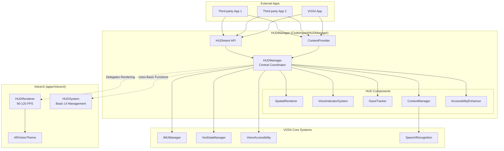

# HUD System Architecture

## Overview
The HUD (Heads-Up Display) system provides AR/smart glasses interface capabilities with a centralized manager architecture following VOS4's zero-overhead principles.

## Architecture Diagram



## Component Responsibilities

### HUDManager (Central Authority)
**Location**: `CodeImport/HUDManager/`
**Role**: Central coordinator and single source of truth

- **Core Management**: HUD lifecycle, consumer tracking, mode management
- **System Integration**: IMU, accessibility, data persistence
- **Public API**: Intent handling and ContentProvider management
- **Rendering Delegation**: Uses VoiceUI's HUDRenderer for display
- **Advanced Features**: Spatial rendering, gaze tracking, context awareness

### VoiceUI (Rendering Engine)
**Location**: `apps/VoiceUI/`
**Role**: UI rendering and visual components

- **HUDRenderer**: 90-120 FPS AR rendering with ARVision effects
- **ARVisionTheme**: Glass morphism and liquid iOS styling
- **HUDSystem**: Basic UI element management (pre-existing)

### Public APIs

#### Intent API
```kotlin
// Package: com.augmentalis.hudmanager.api
HUDIntent.createShowNotificationIntent(message, duration, position, priority)
HUDIntent.createShowVoiceCommandIntent(command, confidence, category)
HUDIntent.createSetHUDModeIntent(mode)
```

#### ContentProvider
```kotlin
// Authority: com.augmentalis.hudmanager.provider
content://com.augmentalis.hudmanager.provider/elements
content://com.augmentalis.hudmanager.provider/status
content://com.augmentalis.hudmanager.provider/config
```

## Data Flow

### 1. External App Requests HUD Display
```
External App → HUDIntent → HUDManager → Processing → VoiceUI HUDRenderer → Display
```

### 2. ContentProvider Query
```
External App → ContentProvider → HUDManager → Data Retrieval → Response
```

### 3. Context-Aware Adaptation
```
ContextManager → Environment Detection → Mode Change → HUDRenderer Update
```

### 4. Voice Command Display
```
SpeechRecognition → VoiceIndicatorSystem → Spatial Positioning → HUDRenderer
```

## Design Principles

### 1. Single Source of Truth
- **HUDManager** is the authoritative coordinator
- All HUD operations flow through HUDManager
- External apps interact only with HUDManager APIs

### 2. Separation of Concerns
- **HUDManager**: Logic, coordination, advanced features
- **VoiceUI**: Rendering, visual effects, UI components
- **ContentProvider**: Data access and sharing
- **Intent API**: External communication

### 3. Zero Overhead
- No duplicate rendering systems
- Direct delegation to VoiceUI renderer
- Minimal abstraction layers
- Efficient resource sharing

### 4. Extensibility
- Modular component design
- Plugin architecture for renderers
- Configurable modes and themes
- Third-party integration support

## Performance Characteristics

### Rendering Performance
- **Target FPS**: 90 (High), 60 (Standard), 120 (Ultra)
- **Frame Budget**: 11.1ms @ 90fps, 16.6ms @ 60fps, 8.3ms @ 120fps
- **Liquid Animations**: 60fps interpolated effects
- **Glass Morphism**: Hardware-accelerated blur and transparency

### Memory Usage
- **Singleton Pattern**: Single HUDManager instance
- **Consumer Tracking**: Automatic cleanup on app termination
- **Element Pooling**: Reuse HUD elements to minimize GC
- **Texture Caching**: Shared texture atlas for efficiency

### Battery Optimization
- **Adaptive FPS**: Lower rates when not in active use
- **Sensor Fusion**: Efficient IMU data processing
- **Context Awareness**: Reduce processing in battery-save modes
- **Background Throttling**: Pause non-critical animations

## Security Model

### Permissions
```xml
<!-- Basic usage -->
<uses-permission android:name="com.augmentalis.hudmanager.permission.USE_HUD" />

<!-- Advanced management -->
<uses-permission android:name="com.augmentalis.hudmanager.permission.MANAGE_HUD" />

<!-- Data access -->
<uses-permission android:name="com.augmentalis.hudmanager.permission.READ_HUD" />
<uses-permission android:name="com.augmentalis.hudmanager.permission.WRITE_HUD" />
```

### Access Control
- **Permission Validation**: All API calls check permissions
- **Content URI Security**: Parameterized queries prevent injection
- **Process Isolation**: Apps cannot directly access other app's HUD data
- **Rate Limiting**: Prevent API abuse with request throttling

## Integration Points

### With VOS4 Core Systems
- **IMUManager**: Head tracking and orientation data
- **VosDataManager**: Context learning and persistence
- **VoiceAccessibility**: Accessibility features and TTS
- **SpeechRecognition**: Voice command processing and confidence

### With Device Hardware
- **Camera**: Eye tracking via ML Kit
- **Sensors**: Accelerometer, gyroscope, magnetometer
- **Display**: Variable refresh rate support
- **Audio**: Spatial audio feedback

## Future Extensibility

### Planned Enhancements
- Multiple display support (glasses + phone)
- Cloud-based context learning
- AI-powered command prediction
- Gesture recognition integration
- Haptic feedback support

### Plugin Architecture
- Custom renderer plugins
- Third-party context providers
- Extension points for new sensors
- Customizable visual themes

## Migration Path

### From Separate Systems
1. **Phase 1**: Move APIs to HUDManager ✅
2. **Phase 2**: Centralize rendering in VoiceUI ✅  
3. **Phase 3**: Update external app integrations
4. **Phase 4**: Deprecate old interfaces
5. **Phase 5**: Remove duplicate code

### Backward Compatibility
- Intent action aliases for old namespaces
- ContentProvider URI mapping
- Gradual permission migration
- Documentation for migration path

This architecture provides a robust, scalable, and efficient HUD system that serves as the foundation for AR/smart glasses interfaces while maintaining clean separation of concerns and optimal performance.