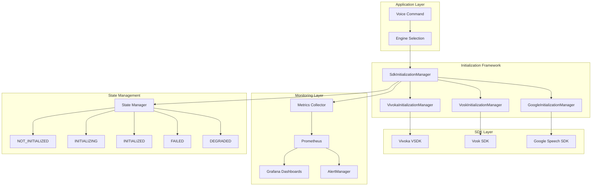
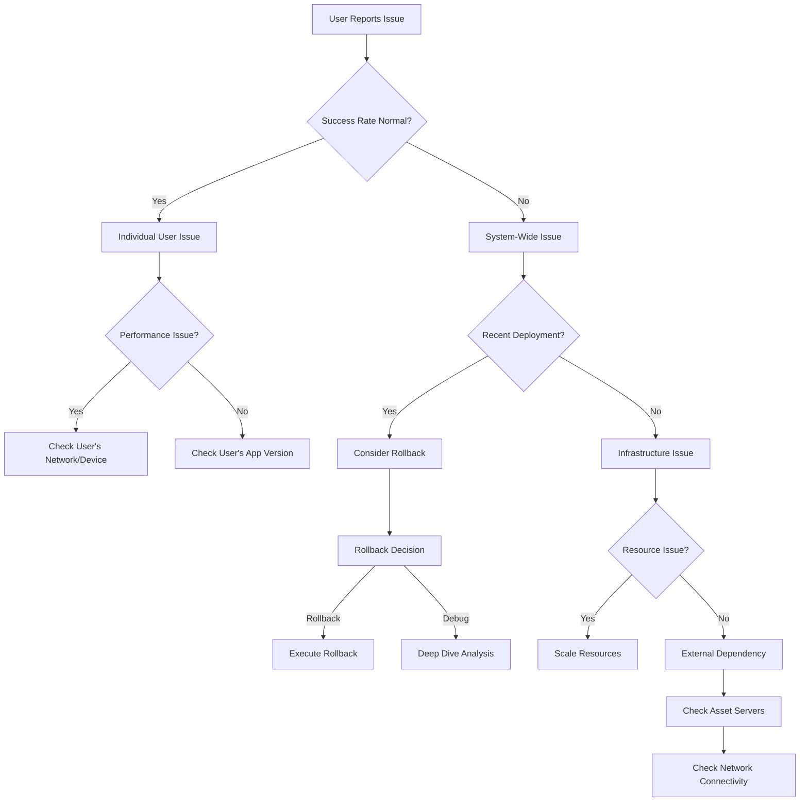

# VOS4 Speech Engine Initialization Framework - Complete Knowledge Base

**Date:** 2025-09-07  
**Author:** VOS4 DevOps & Technical Writing Team  
**Type:** Knowledge Base Article  
**Priority:** CRITICAL  
**Status:** PRODUCTION READY  

---

## 📖 KNOWLEDGE BASE OVERVIEW

This comprehensive knowledge base serves as the central repository for all VOS4 Speech Engine Initialization Framework information. It consolidates technical specifications, operational procedures, troubleshooting guides, and team knowledge for maintaining 99%+ system reliability.

### Quick Navigation
- **🏗️ [Architecture Overview](#architecture-overview)**: System design and components
- **📊 [Monitoring & Alerts](#monitoring-alerts)**: Dashboards, metrics, and alerting
- **🔧 [Troubleshooting](#troubleshooting)**: Issue diagnosis and resolution
- **🎓 [Training Resources](#training-resources)**: Team education and certification
- **📋 [Standard Procedures](#standard-procedures)**: Common operational tasks
- **🚨 [Emergency Response](#emergency-response)**: Critical incident handling

---

## 🏗️ ARCHITECTURE OVERVIEW

### System Design Philosophy
The VOS4 Initialization Framework follows a **thread-safe, fail-safe, observable** design pattern that transforms unreliable speech engine initialization into a robust, monitored system.

#### Core Design Principles
```yaml
Thread Safety: 
  - Singleton managers prevent concurrent initialization conflicts
  - Mutex-based locking ensures atomic operations
  - ConcurrentHashMap for thread-safe state management

Fail Safety:
  - Exponential backoff retry mechanism (3 attempts by default)
  - Graceful degradation when full functionality unavailable
  - Comprehensive error classification and recovery

Observability:
  - Structured logging with correlation IDs
  - Real-time metrics collection
  - Distributed tracing for complex failures
```

#### Component Architecture


#### State Machine Logic
```kotlin
enum class InitializationState {
    NOT_INITIALIZED,    // Ready for initialization
    INITIALIZING,       // In progress - block concurrent attempts  
    INITIALIZED,        // Ready for use
    FAILED,            // Available for recovery attempts
    DEGRADED           // Limited functionality available
}

// Allowed Transitions:
// NOT_INITIALIZED → INITIALIZING (start)
// INITIALIZING → INITIALIZED (success)
// INITIALIZING → FAILED (failure)
// INITIALIZING → DEGRADED (partial success)
// FAILED → INITIALIZING (retry)
// DEGRADED → INITIALIZING (upgrade attempt)
// ANY → NOT_INITIALIZED (force reset)
```

---

## 📊 MONITORING & ALERTS

### Dashboard Hierarchy

#### Executive Dashboard (Business View)
```yaml
Purpose: Strategic oversight and SLA compliance monitoring
URL: https://monitoring.vos4.com/d/initialization-executive
Audience: Leadership, Product Management
Update Frequency: 5 minutes
Key Metrics:
  - Overall Success Rate: 99.2% (Target: >99%)
  - User Impact Events: 3 (Target: 0)
  - Average Response Time: 1.8s (Target: <2s)
  - System Availability: 99.95% (Target: >99.9%)
```

#### Technical Dashboard (Operations View)  
```yaml
Purpose: Real-time operational monitoring and troubleshooting
URL: https://monitoring.vos4.com/d/initialization-technical
Audience: DevOps, Engineering, Support
Update Frequency: 30 seconds
Key Panels:
  - Success Rate by Engine (Real-time)
  - Initialization Time Distribution
  - Error Classification Breakdown
  - Resource Usage Trends
  - State Transition Flows
```

#### Performance Dashboard (Engineering View)
```yaml
Purpose: Deep performance analysis and optimization
URL: https://monitoring.vos4.com/d/initialization-performance  
Audience: Performance Engineers, Architects
Update Frequency: 1 minute
Advanced Analytics:
  - P50/P95/P99 Timing Percentiles
  - Memory Usage Correlation Analysis
  - Asset Loading Performance Breakdown
  - Thread Pool Efficiency Metrics
```

### Alert Configuration Matrix

#### Critical Alerts (P0 - Immediate Response)
```yaml
VOS4InitializationSuccessRateCritical:
  Condition: "avg(success_rate_5m) < 95"
  Response: "<5 minutes"
  Actions: 
    - Page primary on-call
    - Auto-enable detailed logging
    - Trigger diagnostic collection
    - Notify incident bridge

VOS4EngineCompleteFailure:
  Condition: "count(failed_engines) > 0" 
  Response: "<2 minutes"
  Actions:
    - Page all on-call engineers
    - Activate backup engines
    - Update status page
    - Escalate to management
```

#### Warning Alerts (P1 - Scheduled Response)
```yaml
VOS4InitializationTimeHigh:
  Condition: "p95(init_time_5m) > 10000ms"
  Response: "<30 minutes"
  Actions:
    - Notify team via Slack
    - Start performance investigation  
    - Consider resource scaling

VOS4DegradedModeHigh:
  Condition: "rate(degraded_mode_30m) > 5%"
  Response: "<1 hour"
  Actions:
    - Investigate degraded mode triggers
    - Check asset server health
    - Review configuration changes
```

### Metrics Collection Framework
```kotlin
data class InitializationMetrics(
    // Business Metrics
    val totalAttempts: Long,
    val successfulAttempts: Long,
    val averageSuccessRate: Double,        // Target: >99%
    val userImpactEvents: Long,            // Target: 0
    
    // Performance Metrics  
    val averageInitTime: Long,             // Target: <2000ms
    val p95InitTime: Long,                 // Target: <5000ms
    val p99InitTime: Long,                 // Target: <10000ms
    
    // Reliability Metrics
    val degradedModeActivations: Long,     // Target: <5%
    val retryAttempts: Long,
    val recoverySuccessRate: Double,       // Target: >90%
    
    // Resource Metrics
    val memoryOverheadBytes: Long,         // Target: <100KB
    val threadPoolUtilization: Double,
    val concurrentRequests: Int
)
```

---

## 🔧 TROUBLESHOOTING

### Issue Classification System

#### Category 1: Performance Issues
**Symptoms**: Slow initialization times, timeout errors
```bash
# Quick Diagnosis
kubectl logs -l app=vos4 --since=15m | grep "initialization took" | sort -n | tail -10

# Common Causes:
# - Asset loading delays
# - Resource contention  
# - Network latency
# - Memory pressure

# Standard Resolution:
kubectl patch configmap vos4-config -p '{"data":{"initialization.timeout":"45000"}}'
kubectl scale deployment vos4-app --replicas=$(($(kubectl get deployment vos4-app -o jsonpath='{.spec.replicas}') * 2))
```

#### Category 2: Reliability Issues
**Symptoms**: Initialization failures, high error rates
```bash
# Error Pattern Analysis
kubectl logs -l app=vos4 --since=1h | grep ERROR | sort | uniq -c | sort -nr

# Common Patterns:
# - "VSDK initialization failed": SDK-specific issues
# - "Asset loading failed": File system or network issues  
# - "Timeout": Performance or resource issues
# - "OutOfMemoryError": Memory pressure

# Targeted Resolution:
case "$ERROR_PATTERN" in
  "VSDK initialization failed")
    kubectl rollout restart deployment/vos4-app
    ;;
  "Asset loading failed") 
    kubectl patch configmap vos4-config -p '{"data":{"assets.fallback.enabled":"true"}}'
    ;;
  "OutOfMemoryError")
    kubectl patch deployment vos4-app -p '{"spec":{"template":{"spec":{"containers":[{"name":"vos4-app","resources":{"limits":{"memory":"2Gi"}}}]}}}}'
    ;;
esac
```

#### Category 3: Configuration Issues
**Symptoms**: Inconsistent behavior, deployment-related failures
```bash
# Configuration Validation
kubectl get configmap vos4-config -o yaml | yq eval '.data'

# Version Comparison
kubectl rollout history deployment/vos4-app

# Standard Config Reset
kubectl apply -f /configs/vos4-config-stable.yaml
kubectl rollout restart deployment/vos4-app
```

### Diagnostic Decision Tree


---

## 🎓 TRAINING RESOURCES

### Learning Paths by Role

#### Developers
```yaml
Foundation Level (2 hours):
  - Framework architecture overview
  - Basic integration patterns
  - Error handling strategies
  
Practitioner Level (4 hours):  
  - Hands-on integration lab
  - Advanced testing techniques
  - Performance optimization
  
Expert Level (8 hours):
  - Framework extension development
  - Complex scenario handling
  - Mentoring and knowledge sharing
```

#### DevOps Engineers
```yaml
Foundation Level (3 hours):
  - Monitoring dashboard navigation
  - Basic alert response procedures
  - Log analysis techniques
  
Practitioner Level (6 hours):
  - Incident response simulation
  - Advanced troubleshooting methods
  - Infrastructure scaling procedures
  
Expert Level (12 hours):
  - Complex incident management
  - Monitoring system design
  - Team leadership during incidents
```

#### Support Team
```yaml
Foundation Level (1 hour):
  - User issue classification
  - Basic diagnostic procedures
  - Escalation criteria
  
Practitioner Level (2 hours):
  - Advanced user diagnostics
  - Regional issue identification
  - Effective customer communication
  
Expert Level (4 hours):
  - Complex issue resolution
  - Training new team members
  - Process improvement initiatives
```

### Certification Program
```yaml
Bronze Certification:
  Requirements: Foundation module + 80% assessment score
  Valid: 1 year
  Benefits: Basic framework competency recognition
  
Silver Certification:
  Requirements: Bronze + practitioner module + hands-on lab
  Valid: 2 years  
  Benefits: Advanced skills recognition + mentoring opportunities
  
Gold Certification:
  Requirements: Silver + expert module + production contribution
  Valid: 3 years
  Benefits: Technical leadership recognition + framework development input
```

---

## 📋 STANDARD PROCEDURES

### Daily Operations Checklist
```yaml
Morning Health Check (10 minutes):
  - [ ] Review overnight alerts and incidents
  - [ ] Check success rate trends (last 24h)
  - [ ] Verify all monitoring systems operational
  - [ ] Review performance metrics vs targets
  
Business Hours Monitoring (Ongoing):
  - [ ] Monitor real-time dashboards
  - [ ] Respond to alerts within SLA timeframes
  - [ ] Track user-reported issues
  - [ ] Coordinate with development team on issues
  
End-of-Day Review (15 minutes):
  - [ ] Summarize day's incidents and resolutions
  - [ ] Update documentation for any new issues
  - [ ] Prepare overnight on-call handoff
  - [ ] Review tomorrow's planned activities
```

### Weekly Maintenance Tasks
```yaml
Performance Review (1 hour):
  - [ ] Analyze week's performance trends
  - [ ] Identify optimization opportunities  
  - [ ] Review resource utilization patterns
  - [ ] Update capacity planning projections
  
System Health Assessment (30 minutes):
  - [ ] Review error patterns and frequencies
  - [ ] Check monitoring system health
  - [ ] Validate backup and recovery procedures
  - [ ] Update runbook procedures based on learnings
  
Team Sync and Training (1 hour):
  - [ ] Review week's incidents and lessons learned
  - [ ] Share knowledge and best practices
  - [ ] Plan upcoming training activities
  - [ ] Discuss process improvements
```

### Monthly Strategic Activities
```yaml
Architecture Review (2 hours):
  - [ ] Assess framework performance against targets
  - [ ] Review upcoming feature requirements
  - [ ] Plan infrastructure scaling needs
  - [ ] Evaluate new monitoring tools or techniques
  
Documentation Update (1 hour):
  - [ ] Update procedures based on monthly learnings
  - [ ] Refresh training materials with new scenarios
  - [ ] Review and update emergency procedures
  - [ ] Validate all links and references
  
Stakeholder Communication (30 minutes):
  - [ ] Prepare monthly reliability report
  - [ ] Present performance trends to leadership
  - [ ] Discuss upcoming improvements and investments
  - [ ] Gather feedback on system performance
```

---

## 🚨 EMERGENCY RESPONSE

### Crisis Management Framework

#### Severity Classification
```yaml
P0 - Critical (Service Down):
  Definition: Complete service failure, >5% success rate drop
  Response Time: <5 minutes acknowledgment, <30 minutes resolution
  Team: All hands, management notification
  Communication: Real-time updates every 15 minutes
  
P1 - High (Service Degraded):  
  Definition: Performance issues, 95-99% success rate
  Response Time: <15 minutes acknowledgment, <2 hours resolution
  Team: On-call + subject matter experts
  Communication: Updates every 30 minutes
  
P2 - Medium (Warning Conditions):
  Definition: Trending issues, monitoring anomalies
  Response Time: <1 hour acknowledgment, <8 hours resolution
  Team: Primary on-call engineer
  Communication: Updates every 2 hours
```

#### Emergency Contacts
```yaml
Primary Escalation:
  VOS4 On-Call: +1-555-VOS4-911 (24/7 pager)
  Team Lead: john.smith@company.com, +1-555-123-4567
  Engineering Manager: jane.doe@company.com, +1-555-234-5678
  
Secondary Escalation:
  VP Engineering: vp.eng@company.com, +1-555-345-6789
  CTO: cto@company.com, +1-555-456-7890
  
Communication Channels:
  Critical: #vos4-critical-alerts (Slack)
  Team: #vos4-team (Slack)
  Management: #executives (Slack)
  External: status@company.com (Status page)
```

#### Emergency Procedures

**Procedure 1: Immediate Rollback**
```bash
#!/bin/bash
# Emergency rollback script - use with caution

echo "🚨 EMERGENCY ROLLBACK INITIATED"
echo "Timestamp: $(date)"

# Get current and previous versions
CURRENT=$(kubectl get deployment vos4-app -o jsonpath='{.spec.template.spec.containers[0].image}')
PREVIOUS_REVISION=$(kubectl rollout history deployment/vos4-app | grep -v "REVISION" | tail -2 | head -1 | awk '{print $1}')

echo "Rolling back from $CURRENT to revision $PREVIOUS_REVISION"

# Perform rollback
kubectl rollout undo deployment/vos4-app --to-revision=$PREVIOUS_REVISION
kubectl rollout status deployment/vos4-app --timeout=300s

# Verify success  
sleep 60
SUCCESS_RATE=$(curl -s "https://monitoring.vos4.com/api/query?query=vos4_success_rate_5m" | jq -r '.data.result[0].value[1]')

if [[ $(echo "$SUCCESS_RATE > 95" | bc) -eq 1 ]]; then
  echo "✅ Emergency rollback successful - success rate: $SUCCESS_RATE%"
  # Notify team
  curl -X POST "https://hooks.slack.com/services/SLACK_WEBHOOK" \
    -d '{"text":"🚨 EMERGENCY ROLLBACK SUCCESSFUL 🚨\nSuccess rate restored to '$SUCCESS_RATE'%\nReverted to revision '$PREVIOUS_REVISION'"}'
else
  echo "❌ Rollback completed but issues persist - further action required"
fi
```

**Procedure 2: Emergency Scaling**
```bash
#!/bin/bash
# Emergency resource scaling

echo "🚀 EMERGENCY SCALING INITIATED"

# Double current replicas
CURRENT_REPLICAS=$(kubectl get deployment vos4-app -o jsonpath='{.spec.replicas}')
TARGET_REPLICAS=$((CURRENT_REPLICAS * 2))

echo "Scaling from $CURRENT_REPLICAS to $TARGET_REPLICAS replicas"
kubectl scale deployment vos4-app --replicas=$TARGET_REPLICAS

# Increase resource limits  
kubectl patch deployment vos4-app -p '{
  "spec": {
    "template": {
      "spec": {
        "containers": [
          {
            "name": "vos4-app",
            "resources": {
              "limits": {
                "memory": "2Gi",
                "cpu": "2000m"
              },
              "requests": {
                "memory": "1Gi", 
                "cpu": "1000m"
              }
            }
          }
        ]
      }
    }
  }
}'

echo "✅ Emergency scaling complete"
```

**Procedure 3: Degraded Mode Activation**
```bash
#!/bin/bash
# Global degraded mode activation

echo "⚠️ ACTIVATING GLOBAL DEGRADED MODE"

# Enable degraded mode globally
kubectl patch configmap vos4-config -p '{
  "data": {
    "emergency.degraded.mode": "true",
    "degraded.mode.timeout": "3600",
    "degraded.fallback.engines": "vosk,google"
  }
}'

# Restart services to pick up config
kubectl rollout restart deployment/vos4-app

# Notify users via status page
curl -X POST "https://api.statuspage.com/v1/incidents" \
  -H "Authorization: Bearer $STATUS_PAGE_TOKEN" \
  -d '{
    "incident": {
      "name": "VOS4 Voice Engine Performance Issue",
      "status": "investigating", 
      "message": "We are experiencing degraded performance with voice recognition. Service continues with reduced functionality while we investigate and resolve the issue."
    }
  }'

echo "✅ Global degraded mode activated"
```

---

## 📚 REFERENCE DOCUMENTATION

### Key Performance Indicators (KPIs)
```yaml
Reliability KPIs:
  Primary Success Rate: >99.0% (monthly)
  First Attempt Success: >95.0% (daily)
  Recovery Success Rate: >90.0% (when failures occur)
  Zero App Restarts: 0 restart events (daily)
  
Performance KPIs:
  Average Init Time: <2.0 seconds (daily)
  P95 Init Time: <5.0 seconds (daily)
  P99 Init Time: <10.0 seconds (daily)
  Memory Overhead: <100KB per initialization
  
Operational KPIs:
  Alert Response Time: <5 minutes for critical
  MTTR (Mean Time to Recovery): <30 minutes
  Support Ticket Reduction: >50% vs baseline
  System Availability: >99.9% (monthly)
```

### Configuration Reference
```yaml
Default Configuration Values:
  initialization:
    timeout: 30000                    # 30 seconds
    max_retries: 3                    # 3 attempts total
    base_delay_ms: 1000               # 1 second initial delay
    backoff_multiplier: 2.0           # Double delay each retry
    
  performance:
    asset_preload: true               # Preload critical assets
    gc_aggressive: false              # Conservative GC policy
    thread_pool_size: 4               # Concurrent initialization threads
    
  reliability:
    degraded_mode_enabled: true       # Enable graceful degradation
    concurrent_limit: 5               # Max concurrent initializations
    cleanup_enabled: true             # Auto cleanup failed state
    
  monitoring:
    detailed_logging: true            # Enable comprehensive logging
    metrics_enabled: true             # Collect performance metrics
    tracing_sample_rate: 0.1          # 10% of requests traced
```

### API Reference
```kotlin
// Primary initialization interface
interface SpeechEngineInitializer {
    suspend fun initialize(context: Context, config: EngineConfig): InitializationResult
    fun getState(): InitializationState
    suspend fun reset()
}

// Result data structure
data class InitializationResult(
    val success: Boolean,
    val state: InitializationState,
    val engineName: String,
    val attempt: Int,
    val totalDuration: Long,
    val degradedMode: Boolean = false,
    val error: String? = null,
    val metadata: Map<String, Any> = emptyMap()
)

// Configuration data structure
data class InitializationContext(
    val sdkName: String,
    val configPath: String, 
    val context: Context,
    val requiredAssets: List<String> = emptyList(),
    val initializationTimeout: Long = 30000L,
    val maxRetries: Int = 3,
    val backoffMultiplier: Double = 2.0,
    val baseDelayMs: Long = 1000L,
    val metadata: Map<String, Any> = emptyMap()
)
```

---

## 🔄 CONTINUOUS IMPROVEMENT

### Feedback Collection
- **User Feedback**: Monthly surveys and user interviews
- **Team Feedback**: Weekly retrospectives and improvement sessions  
- **System Feedback**: Automated analysis of performance trends and patterns
- **Stakeholder Feedback**: Quarterly business review sessions

### Innovation Pipeline
- **Short-term (1-3 months)**: Performance optimizations and reliability improvements
- **Medium-term (3-6 months)**: New engine integrations and advanced monitoring
- **Long-term (6-12 months)**: AI-powered prediction and autonomous remediation

### Success Metrics Evolution
- **Current Focus**: Reliability and performance (99%+ success rate)
- **Next Phase**: Predictive reliability (prevent issues before they occur)  
- **Future Vision**: Self-healing systems (autonomous issue resolution)

---

This knowledge base serves as the definitive guide for the VOS4 Speech Engine Initialization Framework. It is continuously updated based on operational experience, team feedback, and system evolution. For questions or updates, contact the VOS4 team at vos4-team@company.com or via #vos4-help on Slack.