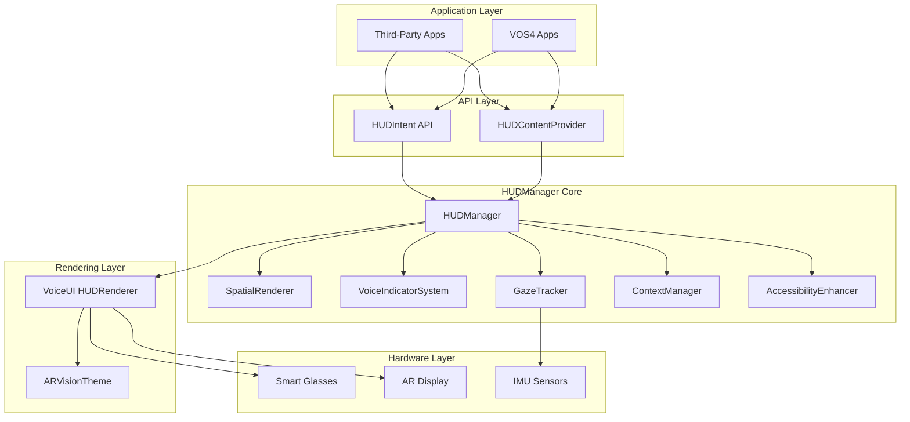

/**
 * HUDManager Developer Manual
 * Path: /docs/modules/HUDManager/HUDManager-Developer-Manual.md
 * 
 * Created: 2025-01-23
 * Last Modified: 2025-01-23
 * Author: VOS4 Development Team
 * Version: 1.0.0
 * 
 * Purpose: Comprehensive development guide for HUDManager module
 * Module: HUDManager
 */

# HUDManager Developer Manual

## Table of Contents
1. [Overview](#overview)
2. [Architecture](#architecture)
3. [Setup & Configuration](#setup--configuration)
4. [API Reference](#api-reference)
5. [Implementation Examples](#implementation-examples)
6. [Performance Optimization](#performance-optimization)
7. [Troubleshooting](#troubleshooting)
8. [Testing](#testing)

## Overview

HUDManager is VOS4's augmented reality HUD system coordinator, providing ARVision-inspired displays with iOS liquid UI vibrancy for smart glasses and AR interfaces.

### Key Features
- **ARVision Design**: Apple VisionOS-style glass morphism
- **Performance**: 90-120 FPS rendering
- **Localization**: 42+ languages
- **Spatial Rendering**: Full 3D positioning
- **Zero Overhead**: Direct implementation pattern

## Architecture

### System Architecture Diagram



### ASCII Architecture (Alternative)

```
┌─────────────────────────────────────────────┐
│           Third-Party Applications          │
└─────────────┬───────────────┬───────────────┘
              │               │
              ▼               ▼
    ┌──────────────┐  ┌──────────────────┐
    │ HUDIntent API│  │ ContentProvider  │
    └──────┬───────┘  └────────┬─────────┘
           │                   │
           ▼                   ▼
    ┌─────────────────────────────────┐
    │        HUDManager Core          │
    │  ┌─────────────────────────┐    │
    │  │ • SpatialRenderer       │    │
    │  │ • VoiceIndicatorSystem  │    │
    │  │ • GazeTracker          │    │
    │  │ • ContextManager       │    │
    │  └─────────────────────────┘    │
    └──────────────┬───────────────────┘
                   │ Delegates
                   ▼
    ┌─────────────────────────────────┐
    │    VoiceUI HUDRenderer         │
    │    (ARVisionTheme Applied)     │
    └─────────────────────────────────┘
                   │
                   ▼
    ┌─────────────────────────────────┐
    │    Smart Glasses / AR Display   │
    └─────────────────────────────────┘
```

### Component Structure

```kotlin
// Namespace organization
com.augmentalis.hudmanager/
├── HUDManager.kt              // Main coordinator
├── spatial/
│   ├── SpatialRenderer.kt     // 3D positioning
│   ├── VoiceIndicatorSystem.kt// Voice visualization
│   └── GazeTracker.kt         // Eye tracking
├── core/
│   └── ContextManager.kt      // Environment detection
└── accessibility/
    └── AccessibilityEnhancer.kt // A11y features
```

## Setup & Configuration

### 1. Add Dependency

```kotlin
// In your module's build.gradle.kts
dependencies {
    implementation(project(":managers:HUDManager"))
}
```

### 2. Add Permissions

```xml
<!-- In AndroidManifest.xml -->
<uses-permission android:name="com.augmentalis.voiceos.permission.USE_HUD" />
<uses-permission android:name="com.augmentalis.voiceos.permission.MANAGE_HUD" />
<uses-permission android:name="android.permission.CAMERA" />
```

### 3. Initialize HUDManager

```kotlin
class MyApplication : Application() {
    override fun onCreate() {
        super.onCreate()
        
        // Initialize HUDManager
        val hudManager = HUDManager.getInstance(this)
        hudManager.initialize()
        
        // Set default configuration
        hudManager.setHUDMode(HUDMode.STANDARD)
        hudManager.enablePerformanceMonitoring(BuildConfig.DEBUG)
    }
}
```

## API Reference

### Core Methods

#### Initialization
```kotlin
// Get singleton instance
val hudManager = HUDManager.getInstance(context)

// Initialize (required once)
hudManager.initialize()

// Check initialization status
val isReady = hudManager.isInitialized()
```

#### Display Notifications
```kotlin
// Simple notification
hudManager.showSpatialNotification(
    HUDNotification(
        message = "Connection established",
        priority = NotificationPriority.NORMAL,
        durationMs = 3000
    )
)

// Localized notification
hudManager.showLocalizedNotification(
    translationKey = "hud.notification.battery_low",
    args = arrayOf(15),  // Battery percentage
    position = SpatialPosition.TOP_RIGHT
)
```

#### Voice Commands
```kotlin
// Display voice command options
val commands = listOf(
    VoiceCommand(
        text = "Open settings",
        confidence = 0.95f,
        category = "NAVIGATION",
        translationKey = "cmd.open_settings"
    )
)
hudManager.showVoiceCommands(commands, uiContext)

// Update command feedback
hudManager.updateCommandFeedback(
    commandId = "cmd_123",
    state = CommandState.EXECUTING
)
```

#### HUD Modes
```kotlin
// Available modes
enum class HUDMode {
    STANDARD,       // Full features
    MEETING,        // Silent, minimal
    DRIVING,        // Voice-focused
    WORKSHOP,       // Safety indicators
    ACCESSIBILITY,  // Enhanced for disabilities
    GAMING,         // Performance mode
    ENTERTAINMENT   // Media-optimized
}

// Set mode
hudManager.setHUDMode(HUDMode.DRIVING)

// Get current mode
val currentMode = hudManager.getCurrentMode()
```

#### Spatial Positioning
```kotlin
// Position elements in 3D space
hudManager.positionElement(
    elementId = "notification_1",
    position = SpatialPosition(
        x = 0.5f,   // Center horizontally
        y = 0.8f,   // Near top
        z = -2.0f   // 2 meters in front
    )
)

// Anchor to real-world coordinates
hudManager.anchorToWorld(
    elementId = "waypoint_1",
    latitude = 37.7749,
    longitude = -122.4194,
    altitude = 10.0
)
```

### Intent API

```kotlin
// Show notification via Intent
val intent = Intent("com.augmentalis.voiceos.ACTION_SHOW_NOTIFICATION").apply {
    putExtra("message", "New message received")
    putExtra("priority", "HIGH")
    putExtra("duration", 5000)
    putExtra("position", "TOP_CENTER")
}
context.sendBroadcast(intent)

// Show localized notification
val localizedIntent = HUDIntent.createLocalizedNotificationIntent(
    context = context,
    translationKey = "hud.notification.incoming_call",
    args = arrayOf("John Doe")
)
context.sendBroadcast(localizedIntent)

// Available Intent actions
const val ACTION_SHOW_NOTIFICATION = "com.augmentalis.voiceos.ACTION_SHOW_NOTIFICATION"
const val ACTION_SHOW_VOICE_COMMANDS = "com.augmentalis.voiceos.ACTION_SHOW_VOICE_COMMANDS"
const val ACTION_UPDATE_HUD_STATUS = "com.augmentalis.voiceos.ACTION_UPDATE_HUD_STATUS"
const val ACTION_SET_HUD_MODE = "com.augmentalis.voiceos.ACTION_SET_HUD_MODE"
const val ACTION_CLEAR_HUD = "com.augmentalis.voiceos.ACTION_CLEAR_HUD"
```

### ContentProvider API

```kotlin
// Query HUD elements
val cursor = contentResolver.query(
    Uri.parse("content://com.augmentalis.voiceos.hud.provider/elements"),
    null, null, null, null
)

// Insert new element
val values = ContentValues().apply {
    put("type", "NOTIFICATION")
    put("message", "Task completed")
    put("position_x", 0.5f)
    put("position_y", 0.5f)
    put("position_z", -2.0f)
    put("duration_ms", 3000)
}
val uri = contentResolver.insert(
    Uri.parse("content://com.augmentalis.voiceos.hud.provider/elements"),
    values
)

// Update element
val updateValues = ContentValues().apply {
    put("state", "DISMISSED")
}
contentResolver.update(
    Uri.parse("content://com.augmentalis.voiceos.hud.provider/elements/$elementId"),
    updateValues, null, null
)
```

## Implementation Examples

### Example 1: Smart Glasses Integration

```kotlin
class SmartGlassesActivity : AppCompatActivity() {
    private lateinit var hudManager: HUDManager
    
    override fun onCreate(savedInstanceState: Bundle?) {
        super.onCreate(savedInstanceState)
        
        hudManager = HUDManager.getInstance(this)
        
        // Configure for AR glasses
        hudManager.apply {
            setHUDMode(HUDMode.STANDARD)
            setRenderingTarget(RenderTarget.SMART_GLASSES)
            setTargetFPS(HUDRenderer.TARGET_FPS_HIGH) // 120 FPS
            enableGazeTracking(true)
            enableHeadTracking(true)
        }
        
        // Show welcome message
        hudManager.showLocalizedNotification(
            translationKey = "hud.welcome.glasses_connected",
            position = SpatialPosition.CENTER
        )
    }
    
    override fun onResume() {
        super.onResume()
        hudManager.startRendering()
    }
    
    override fun onPause() {
        super.onPause()
        hudManager.pauseRendering()
    }
}
```

### Example 2: Voice Command Integration

```kotlin
class VoiceCommandHandler(private val context: Context) {
    private val hudManager = HUDManager.getInstance(context)
    
    fun onVoiceCommandReceived(command: String, confidence: Float) {
        // Show recognition feedback
        val voiceCommand = VoiceCommand(
            text = command,
            confidence = confidence,
            category = categorizeCommand(command),
            translationKey = getTranslationKey(command)
        )
        
        hudManager.showVoiceCommands(listOf(voiceCommand), context)
        
        // Process command
        when (command.lowercase()) {
            "show notifications" -> showNotificationPanel()
            "hide hud" -> hudManager.hideAllElements()
            "driving mode" -> hudManager.setHUDMode(HUDMode.DRIVING)
            else -> handleCustomCommand(command)
        }
    }
    
    private fun showNotificationPanel() {
        hudManager.showSpatialNotification(
            HUDNotification(
                message = "Notification panel",
                priority = NotificationPriority.HIGH,
                position = SpatialPosition.RIGHT,
                durationMs = 10000
            )
        )
    }
}
```

### Example 3: Localization

```kotlin
class LocalizedHUD(private val context: Context) {
    private val hudManager = HUDManager.getInstance(context)
    
    fun showMultilingualNotification() {
        // Get user's preferred language
        val locale = context.resources.configuration.locales[0]
        val languageCode = locale.language
        
        // Show localized notification
        hudManager.showLocalizedNotification(
            translationKey = "hud.notification.update_available",
            languageCode = languageCode,
            args = arrayOf("VOS4", "1.0.1")
        )
    }
    
    fun displayLocalizedCommands() {
        val commands = listOf(
            "cmd.navigation.home",
            "cmd.navigation.back",
            "cmd.action.select",
            "cmd.action.cancel"
        ).map { key ->
            VoiceCommand(
                translationKey = key,
                category = "NAVIGATION"
            )
        }
        
        hudManager.showVoiceCommands(commands, context)
    }
}
```

## Performance Optimization

### Rendering Optimization

```kotlin
// Configure for optimal performance
hudManager.apply {
    // Reduce quality for better performance
    setRenderQuality(RenderQuality.PERFORMANCE)
    
    // Limit particle effects
    setParticleEffectLevel(ParticleLevel.MINIMAL)
    
    // Disable non-essential animations
    setAnimationLevel(AnimationLevel.BASIC)
    
    // Set frame rate cap based on device
    val targetFPS = if (isHighEndDevice()) {
        HUDRenderer.TARGET_FPS_HIGH  // 120 FPS
    } else {
        HUDRenderer.TARGET_FPS_STANDARD  // 60 FPS
    }
    setTargetFPS(targetFPS)
}
```

### Memory Management

```kotlin
// Monitor memory usage
val metrics = hudManager.getPerformanceMetrics()
if (metrics.memoryUsage > 40_000_000) { // 40MB threshold
    // Reduce memory footprint
    hudManager.clearCachedElements()
    hudManager.reduceTextureQuality()
}

// Register memory pressure callback
hudManager.setMemoryPressureListener { level ->
    when (level) {
        MemoryPressure.LOW -> { /* Normal operation */ }
        MemoryPressure.MODERATE -> hudManager.clearCachedElements()
        MemoryPressure.CRITICAL -> hudManager.enterLowMemoryMode()
    }
}
```

### Battery Optimization

```kotlin
// Configure for battery saving
fun enableBatterySaving() {
    hudManager.apply {
        setHUDMode(HUDMode.STANDARD)
        setTargetFPS(30)  // Reduce frame rate
        setRenderQuality(RenderQuality.BATTERY_SAVER)
        disableParticleEffects()
        reduceAnimations()
        
        // Adaptive brightness
        setAdaptiveBrightness(true)
        setMaxBrightness(0.7f)  // 70% max
    }
}
```

## Troubleshooting

### Common Issues and Solutions

#### HUD Not Displaying

**Problem**: HUD elements not visible on device

**Solutions**:
1. Check permissions in manifest
2. Verify initialization:
   ```kotlin
   if (!hudManager.isInitialized()) {
       hudManager.initialize()
   }
   ```
3. Check overlay permission:
   ```kotlin
   if (!Settings.canDrawOverlays(context)) {
       // Request overlay permission
   }
   ```

#### Low Frame Rate

**Problem**: FPS below target (< 60 FPS)

**Solutions**:
1. Reduce render quality
2. Disable particle effects
3. Check background processes:
   ```kotlin
   val metrics = hudManager.getPerformanceMetrics()
   Log.d("HUD", "FPS: ${metrics.averageFPS}")
   Log.d("HUD", "Frame time: ${metrics.averageFrameTime}ms")
   ```

#### Localization Issues

**Problem**: Translations not appearing

**Solutions**:
1. Verify LocalizationManager is initialized
2. Check translation key exists:
   ```kotlin
   val hasKey = LocalizationModule.hasTranslation(
       "hud.notification.test",
       "en"
   )
   ```
3. Fallback to default language

### Debug Mode

```kotlin
// Enable debug mode for detailed logging
hudManager.enableDebugMode(true)

// Get debug information
val debugInfo = hudManager.getDebugInfo()
Log.d("HUD", """
    Status: ${debugInfo.status}
    Mode: ${debugInfo.currentMode}
    FPS: ${debugInfo.currentFPS}
    Elements: ${debugInfo.activeElements}
    Memory: ${debugInfo.memoryUsage} MB
""".trimIndent())
```

## Testing

### Unit Tests

```kotlin
@Test
fun testHUDInitialization() {
    val context = mockContext()
    val hudManager = HUDManager.getInstance(context)
    
    hudManager.initialize()
    
    assertTrue(hudManager.isInitialized())
    assertEquals(HUDMode.STANDARD, hudManager.getCurrentMode())
}

@Test
fun testNotificationDisplay() {
    val hudManager = HUDManager.getInstance(mockContext())
    
    val notification = HUDNotification(
        message = "Test",
        priority = NotificationPriority.HIGH
    )
    
    hudManager.showSpatialNotification(notification)
    
    val elements = hudManager.getActiveElements()
    assertTrue(elements.any { it.message == "Test" })
}
```

### Integration Tests

```kotlin
@Test
fun testLocalizationIntegration() {
    val hudManager = HUDManager.getInstance(context)
    val localizationManager = LocalizationModule.getInstance(context)
    
    // Set language to Spanish
    localizationManager.setLanguage("es")
    
    // Show localized notification
    hudManager.showLocalizedNotification(
        translationKey = "hud.notification.welcome"
    )
    
    // Verify Spanish text is displayed
    val elements = hudManager.getActiveElements()
    assertTrue(elements.any { it.message.contains("Bienvenido") })
}
```

### Performance Tests

```kotlin
@Test
fun testRenderingPerformance() {
    val hudManager = HUDManager.getInstance(context)
    hudManager.setTargetFPS(120)
    hudManager.startRendering()
    
    // Wait for stabilization
    Thread.sleep(1000)
    
    val metrics = hudManager.getPerformanceMetrics()
    
    // Verify performance targets
    assertTrue(metrics.averageFPS >= 90)
    assertTrue(metrics.averageFrameTime <= 11.1) // ms for 90 FPS
    assertTrue(metrics.memoryUsage < 50_000_000) // 50MB
}
```

## Best Practices

1. **Always initialize in Application class** for consistent state
2. **Use localization keys** instead of hardcoded strings
3. **Monitor performance metrics** in production
4. **Implement fallbacks** for low-end devices
5. **Test on multiple device types** (phones, tablets, glasses)
6. **Handle lifecycle properly** (pause/resume rendering)
7. **Use appropriate HUD modes** for different contexts
8. **Cache frequently used elements** for better performance
9. **Implement error handling** for all HUD operations
10. **Follow VOS4 direct implementation** pattern (no interfaces)

## Related Documentation

- [HUDManager API Reference](/docs/modules/HUDManager/HUDManager-API-Reference.md)
- [Localization Guide](/docs/modules/HUDManager/HUDManager-Localization-Guide.md)
- [VoiceUI Integration](/docs/modules/VoiceUI/VoiceUI-HUD-Integration.md)
- [Master Architecture](/docs/ARCHITECTURE.md)