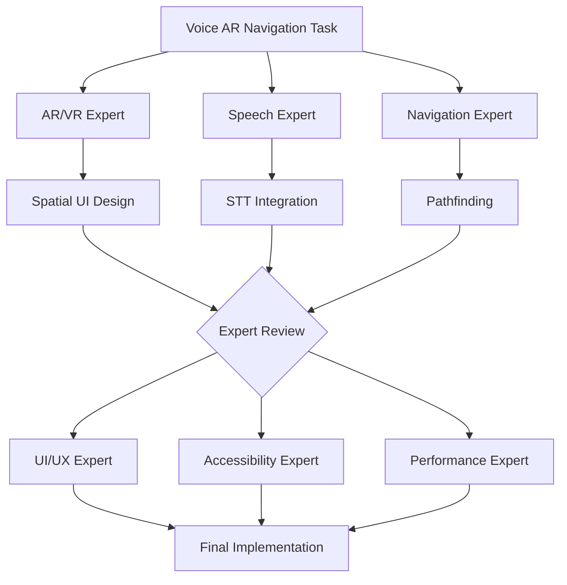

# ⚠️ DEPRECATED - This file has been superseded

**Status:** DEPRECATED as of 2025-10-15
**New Location:** `/Volumes/M Drive/Coding/Warp/Agent-Instructions/VOS4-AGENT-PROTOCOL.md`
**Reason:** Consolidated into VOS4-AGENT-PROTOCOL.md
**Archived By:** Documentation Consolidation Agent

This file is kept for historical reference only. DO NOT use for new development.

---

[Original content below]

<!--
filename: MULTI-AGENT-REQUIREMENTS.md
created: 2025-01-25 00:00:00 PST
author: Manoj Jhawar
copyright: Copyright (C) Manoj Jhawar/Aman Jhawar, Intelligent Devices LLC
purpose: Mandatory requirements for using specialized PhD-level agents for different tasks
last-modified: 2025-01-25 00:00:00 PST
version: 1.0.0
-->

# 🚨 MANDATORY: Multi-Agent Specialized Expertise Requirements

## Core Principle
**ALL work MUST be performed by PhD-level expert agents specialized in the specific domain and language being used.**

## Required Agent Specializations

### 📱 UI/UX Development
**Agent Requirements:**
- PhD-level expertise in Human-Computer Interaction (HCI)
- Deep knowledge of Material Design 3 and iOS Human Interface Guidelines
- Expertise in accessibility standards (WCAG 2.1, Android A11y)
- Proficiency in Jetpack Compose, SwiftUI, and Flutter
- Understanding of spatial UI for AR/VR applications

**When to Deploy:**
- Designing user interfaces
- Implementing gesture handlers
- Creating accessibility features
- Building AR/VR overlays
- Optimizing user experience flows

### 🏗️ System Architecture
**Agent Requirements:**
- PhD-level expertise in Software Architecture
- Deep understanding of SOLID principles and design patterns
- Experience with microservices and modular architectures
- Knowledge of Android system architecture
- Expertise in performance optimization and scalability

**When to Deploy:**
- Designing module architecture
- Refactoring system components
- Creating API contracts
- Planning module interactions
- Optimizing system performance

### 🔊 Audio & Speech Processing
**Agent Requirements:**
- PhD-level expertise in Digital Signal Processing
- Deep knowledge of speech recognition algorithms
- Experience with audio codecs and streaming protocols
- Understanding of acoustic modeling and language models
- Proficiency with Vosk, Vivoka, Whisper, and cloud STT APIs

**When to Deploy:**
- Implementing speech recognition
- Audio processing and filtering
- Voice activity detection
- Acoustic echo cancellation
- Multi-engine STT integration

### 🤖 Machine Learning & AI
**Agent Requirements:**
- PhD-level expertise in Machine Learning
- Deep knowledge of neural networks and NLP
- Experience with TensorFlow Lite and CoreML
- Understanding of on-device inference optimization
- Expertise in model quantization and pruning

**When to Deploy:**
- Implementing predictive features
- Natural language processing
- Command prediction models
- Gesture recognition
- Voice biometrics

### 🔒 Security & Cryptography
**Agent Requirements:**
- PhD-level expertise in Cybersecurity
- Deep knowledge of cryptographic algorithms
- Experience with secure coding practices
- Understanding of Android security model
- Expertise in vulnerability assessment

**When to Deploy:**
- Implementing authentication
- Data encryption
- Secure communication
- License management
- Privacy protection features

### 📊 Database & Data Management
**Agent Requirements:**
- PhD-level expertise in Database Systems
- Deep knowledge of Room (AndroidX) architecture
- Experience with hybrid storage patterns (Room + in-memory cache)
- KSP annotation processing expertise
- Experience with data modeling and optimization
- Understanding of sync and replication strategies
- Expertise in query optimization

**When to Deploy:**
- Database schema design
- Query optimization
- Data migration strategies
- Sync implementation
- Performance tuning

### 🎮 Graphics & Rendering
**Agent Requirements:**
- PhD-level expertise in Computer Graphics
- Deep knowledge of OpenGL ES and Vulkan
- Experience with AR/VR rendering pipelines
- Understanding of shader programming
- Expertise in performance optimization

**When to Deploy:**
- AR overlay rendering
- Custom view implementations
- Animation systems
- Glass morphism effects
- 3D spatial interfaces

### ♿ Accessibility Engineering
**Agent Requirements:**
- PhD-level expertise in Assistive Technology
- Deep knowledge of Android AccessibilityService
- Experience with screen readers and switch access
- Understanding of cognitive accessibility
- Expertise in universal design principles

**When to Deploy:**
- AccessibilityService implementation
- Screen reader compatibility
- Voice control features
- Gesture alternatives
- Cognitive assistance features

## Language-Specific Requirements

### Kotlin Development
**Agent MUST have:**
- PhD-level expertise in Kotlin
- Deep understanding of coroutines and Flow
- Knowledge of Kotlin Multiplatform
- Experience with Android KTX extensions
- Expertise in functional programming patterns

### Java Integration
**Agent MUST have:**
- PhD-level expertise in Java
- Understanding of Java-Kotlin interop
- Knowledge of JVM internals
- Experience with Android Java APIs
- Expertise in performance profiling

### C++ (NDK) Development
**Agent MUST have:**
- PhD-level expertise in C++
- Deep knowledge of JNI/NDK
- Experience with native Android development
- Understanding of memory management
- Expertise in SIMD optimizations

## Multi-Agent Collaboration Protocol

### 1. Task Assessment
```
Primary Agent: Analyzes task requirements
→ Identifies required specializations
→ Requests specific expert agents
```

### 2. Expert Assembly
```
For Complex Task:
- UI Expert: Interface design
- Architecture Expert: System design
- Security Expert: Security review
- Performance Expert: Optimization
```

### 3. Collaborative Review
```
All Experts: Review proposed solution
→ Each provides domain-specific feedback
→ Consensus reached before implementation
```

### 4. Implementation
```
Lead Expert: Implements with support from others
→ Other experts review continuously
→ Real-time corrections and improvements
```

## Example Multi-Agent Deployment

### Task: Implement Voice-Controlled AR Navigation

**Required Agents:**
1. **AR/VR Expert** - Spatial UI and 3D rendering
2. **Speech Expert** - Voice recognition integration
3. **Navigation Expert** - Pathfinding algorithms
4. **UI/UX Expert** - User interaction design
5. **Accessibility Expert** - Ensure universal access
6. **Performance Expert** - Optimize for 90-120 FPS

**Collaboration Flow:**


## Mandatory Requirements

### NEVER use a single agent for:
- ❌ Complex multi-domain tasks
- ❌ Language-specific optimizations without expertise
- ❌ Security-critical implementations
- ❌ Performance-critical code
- ❌ Accessibility features

### ALWAYS deploy specialists for:
- ✅ Domain-specific implementations
- ✅ Language-specific optimizations
- ✅ Security reviews
- ✅ Performance tuning
- ✅ Accessibility compliance

## Quality Assurance

### Each expert agent MUST:
1. Have PhD-level expertise in their domain
2. Be fluent in the implementation language
3. Understand Android/mobile constraints
4. Follow VOS4 coding standards
5. Collaborate with other experts

### Code Review Requirements:
- Minimum 2 expert reviews per feature
- Security expert review for sensitive code
- Performance expert review for critical paths
- Accessibility expert review for UI changes

## Escalation Protocol

### When expertise is insufficient:
1. **Acknowledge limitation** immediately
2. **Request specific expert** by domain
3. **Document requirement** for expert
4. **Wait for expert** before proceeding
5. **Never guess** or approximate in critical areas

## Example Agent Request

```
"I need a PhD-level Kotlin expert specializing in coroutines and Flow 
to optimize the CommandProcessor's async command handling. The current 
implementation has potential race conditions and memory leaks."

Required Expertise:
- Kotlin coroutines internals
- Structured concurrency
- Memory leak detection
- Android lifecycle awareness
```

## Compliance Verification

### Before ANY implementation:
- [ ] Correct expert agent deployed?
- [ ] Language expertise verified?
- [ ] Domain knowledge confirmed?
- [ ] VOS4 standards understood?
- [ ] Collaboration plan established?

### After implementation:
- [ ] Expert review completed?
- [ ] Security review (if needed)?
- [ ] Performance validated?
- [ ] Accessibility verified?
- [ ] Documentation updated?

---

**REMEMBER:** Quality over speed. The right expert for the right task. Always.

**ENFORCEMENT:** Any work done without proper expertise = immediate revision required.