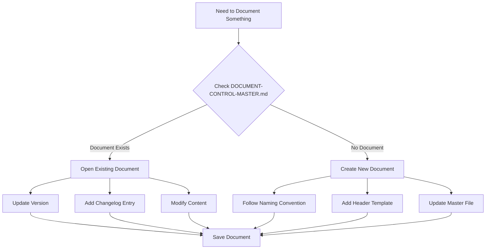
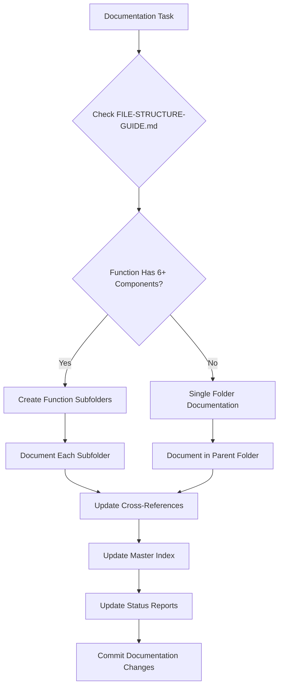

# ⚠️ DEPRECATED - This file has been superseded

**Status:** DEPRECATED as of 2025-10-15
**New Location:** `/Volumes/M Drive/Coding/Warp/Agent-Instructions/VOS4-DOCUMENTATION-PROTOCOL.md`
**Reason:** Consolidated into VOS4-DOCUMENTATION-PROTOCOL.md
**Archived By:** Documentation Consolidation Agent

This file is kept for historical reference only. DO NOT use for new development.

---

[Original content below]

/**
 * DOCUMENT-STANDARDS.md - AI Documentation Creation Standards
 * Path: /Agent-Instructions/DOCUMENT-STANDARDS.md
 * 
 * Created: 2025-01-21
 * Last Modified: 2025-01-21
 * Author: VOS4 Development Team
 * Version: 2.0.0
 * 
 * Purpose: Instructions for AI systems on document creation and management
 * 
 * Changelog:
 * - v1.0.0 (2025-01-21): Initial creation
 * - v2.0.0 (2025-01-21): Added file structure rules, function documentation, living document principles
 */

# AI Documentation Standards for VOS4

## CRITICAL: Always Reference the Master File
**BEFORE creating or updating ANY document, consult:**
`/docs/DOCUMENT-CONTROL-MASTER.md`

This master file contains:
- Current document registry
- Exact naming conventions
- Proper file locations
- Version tracking

---

## Document Creation Rules

### 1. Naming Convention
**Format:** `[Prefix]-[Type]-[Description].md`

#### Use These Prefixes:
- `VOS4-` for system-wide/master documents
- `[ModuleName]-` for module-specific (e.g., `SpeechRecognition-`, `AccessibilityService-`)
- `[AppName]-` for app-specific (e.g., `VoiceUI-`, `VoiceAccessibility-`)

#### Examples:
```
✅ CORRECT:
VOS4-Analysis-PerformanceOverhead.md
SpeechRecognition-Implementation-GrammarCache.md
AccessibilityService-Enhancement-Gestures.md

❌ INCORRECT:
PERFORMANCE-OVERHEAD-ANALYSIS.md
System-Analysis-CPU.md
accessibility_enhancements.md
```

### 2. File Paths
When documenting file paths, start from the VOS4 root:
```
✅ CORRECT: /modules/apps/SpeechRecognition/src/main/java/com/ai/
❌ INCORRECT: /Volumes/M Drive/Coding/Warp/VOS4/modules/apps/SpeechRecognition/...
```

### 3. Document Header (MANDATORY)
Every document MUST start with:

```markdown
/**
 * [Document Title]
 * Path: /[folder]/[filename].md
 * 
 * Created: YYYY-MM-DD HH:MM PST
 * Last Modified: YYYY-MM-DD HH:MM PST
 * Author: [Name/Team]
 * Version: X.Y.Z
 * 
 * Purpose: [Brief description]
 * Module: [Module name or System]
 * 
 * Changelog:
 * - v1.0.0 (YYYY-MM-DD HH:MM PST): Initial creation
 * - v1.1.0 (YYYY-MM-DD HH:MM PST): [Changes made]
 */
```

**Time Format Requirements:**
- Always use Pacific Time (PST/PDT as appropriate)
- Format: HH:MM using 24-hour format (e.g., 14:30 PST)
- Include timezone abbreviation

---

## Document Update Protocol

### When to UPDATE Existing Document:
1. **Check if document exists** in DOCUMENT-CONTROL-MASTER.md
2. If exists, **UPDATE it** with:
   - Increment version number
   - Add changelog entry
   - Update Last Modified date
   - Preserve all existing content (unless explicitly replacing)

### When to CREATE New Document:
1. Only if no existing document covers the topic
2. Must follow naming convention
3. Must update DOCUMENT-CONTROL-MASTER.md

### Version Numbering:
- **v1.0.x**: Minor fixes, typos, formatting
- **v1.x.0**: New sections, significant additions
- **vX.0.0**: Complete rewrite or major restructure

---

## V3 File Location Guide

**CRITICAL**: VOS4 uses V3 documentation structure as of 2025-01-21

| Document Type | V3 Location | Prefix | Example |
|--------------|-------------|--------|---------|
| **PLANNING** | | | |
| Master Planning | /docs/Planning/ | VOS4-Planning- | VOS4-Planning-Master.md |
| System Architecture | /docs/Planning/Architecture/ | VOS4-Architecture- | VOS4-Architecture-Master.md |
| App Architecture | /docs/Planning/Architecture/Apps/[App]/ | [App]-Architecture- | SpeechRecognition-Architecture.md |
| Manager Architecture | /docs/Planning/Architecture/Managers/[Manager]/ | [Manager]-Architecture- | CoreMGR-Architecture.md |
| Library Architecture | /docs/Planning/Architecture/Libraries/[Library]/ | [Library]-Architecture- | DeviceMGR-Architecture.md |
| PRDs | /docs/Planning/Architecture/[Category]/[Module]/ | [Module]-PRD | CommandsMGR-PRD.md |
| Sprint Planning | /docs/Planning/Sprints/ | VOS4-Sprint- | VOS4-Sprint-Current.md |
| Strategic Planning | /docs/Planning/Strategies/ | [Strategy]- | Optimum-Approach-Decision.md |
| **STATUS** | | | |
| Current Status | /docs/Status/Current/ | VOS4-Status- | VOS4-Status-Comprehensive.md |
| System Analysis | /docs/Status/Analysis/ | VOS4-Analysis- | VOS4-Analysis-CPUOptimization.md |
| Migration Status | /docs/Status/Migration/ | VOS4-Migration- | VOS4-Migration-Tracker.md |
| Phase Reports | /docs/Status/Migration/Phase-Reports/ | Phase[N]- | Phase2-Completion-Report.md |
| **TODO** | | | |
| Master TODO | /docs/TODO/ | VOS4-TODO- | VOS4-TODO-Master.md |
| Module TODOs | /docs/Planning/Architecture/[Category]/[Module]/ | TODO.md | Apps/SpeechRecognition/TODO.md |
| **OTHER** | | | |
| AI Instructions | /docs/Agent-Instructions/ | [TOPIC]- | CODING-STANDARDS.md |
| Archive | /docs/Archive/ | [Date]-[Original-Name] | 2025-01-21-Old-Document.md |

---

## Document Control Workflow



---

## Common Mistakes to Avoid

### ❌ DON'T:
1. Create duplicate documents with different names
2. Use inconsistent naming (CAPS, spaces, underscores)
3. Forget to update DOCUMENT-CONTROL-MASTER.md
4. Create deep folder hierarchies
5. Include system paths before VOS4 root
6. Forget document headers
7. Create version-numbered files (use changelog instead)

### ✅ DO:
1. Always check for existing documents first
2. Use consistent Module-Type-Description naming
3. Keep all related docs in their designated folders
4. Update version and changelog when modifying
5. Start paths from /modules/apps, /modules/managers, /modules/libraries, etc.
6. Include proper headers in every document
7. Maintain single living documents with changelogs

---

## Quick Commands for Document Management

### Check if document exists:
```bash
grep -i "[search-term]" /docs/DOCUMENT-CONTROL-MASTER.md
```

### Find all documents for a module:
```bash
find /ProjectDocs -name "ModuleName-*.md"
```

### Update master file after creating document:
1. Open `/docs/DOCUMENT-CONTROL-MASTER.md`
2. Add entry to appropriate section
3. Update version and Last Full Audit date

---

## Module Name Reference

Use these exact module names in document prefixes:

### Apps:
- AccessibilityService
- SpeechRecognition
- VoiceUI

### Managers:
- CoreMGR
- CommandsMGR
- DataMGR
- LocalizationMGR
- LicenseMGR

### Libraries:
- VoiceUIElements
- DeviceMGR
- UUIDManager

### System-wide (use VOS4 prefix):
- Architecture
- Performance
- Security
- Integration

---

## Emergency Recovery

If document structure becomes disorganized:
1. Refer to DOCUMENT-CONTROL-MASTER.md
2. Check git history for original names
3. Run document audit script (if available)
4. Reorganize following this guide

---

## Compliance Checklist

Before submitting any documentation:
- [ ] Document name follows Module-Type-Description format
- [ ] Correct prefix used (VOS4- or ModuleName-)
- [ ] Header template included and filled
- [ ] Version number appropriate
- [ ] Changelog entry added
- [ ] File in correct folder
- [ ] DOCUMENT-CONTROL-MASTER.md updated
- [ ] No duplicate documents created
- [ ] File paths start from VOS4 root

---

## File Structure Documentation Rules

### CRITICAL: Always Reference Structure Guide
**BEFORE working with any project files, consult:**
`/docs/Agent-Instructions/FILE-STRUCTURE-GUIDE.md`

### Function Documentation Requirements

#### When Documenting Functions with 6+ Components:
- **MUST create function subfolders** (like SpeechRecognition engines/)
- **Document each subfolder separately** with its own README.md
- **Include cross-references** to related functions
- **Maintain hierarchy documentation**

#### Examples Requiring Function Subfolders:
```
✅ SpeechRecognition with 6 engines:
/modules/apps/SpeechRecognition/engines/android/
/modules/apps/SpeechRecognition/engines/azure/
/modules/apps/SpeechRecognition/engines/google/
[etc.]

✅ CommandsMGR with 11 action categories:
/modules/managers/CommandsMGR/actions/AppActions.kt
/modules/managers/CommandsMGR/actions/CursorActions.kt
[etc. - all in same actions/ folder]

✅ AccessibilityService with multiple subsystems:
/modules/apps/VoiceAccessibility/touch/TouchBridge.kt
/modules/apps/VoiceAccessibility/extractors/UIElementExtractor.kt
[etc.]
```

### Function Documentation Standards

#### For Each Function Category:
1. **Create overview documentation** in parent folder
2. **Document individual implementations** in respective subfolders/files
3. **Maintain cross-reference maps** showing relationships
4. **Include usage examples** for each function

#### Function Naming in Documentation:
- Use exact folder/file names from codebase
- Include full path context from VOS4 root
- Reference related functions in other modules
- Maintain version tracking for function changes

---

## Living Document Principles

### Document Update Triggers

#### ALWAYS Update Documentation When:
1. **Adding new functions** (engines, actions, processors, etc.)
2. **Modifying module structure** (moving files, creating folders)
3. **Changing API interfaces** (public methods, data models)
4. **Completing implementations** (marking TODO items as done)
5. **Discovering missing components** (gaps in functionality)

#### Update Cycles:
- **Immediate**: API changes, structure modifications
- **End of session**: New implementations, completed features
- **Weekly**: Comprehensive reviews and cross-references
- **Major releases**: Full documentation audit

### Template Usage Requirements

#### Use These Templates for Function Documentation:
```markdown
## [Function Category] Overview
**Location**: `/path/to/function/folder/`
**Components**: X implementations
**Status**: [Complete|In Progress|Planned]

### Implementations:
1. **ComponentName** - Brief description
   - File: `path/to/file.kt`
   - Status: [Complete|Partial|TODO]
   - Dependencies: [List related components]

### Usage Examples:
[Include code examples]

### Cross-References:
- Related in [OtherModule]: `/path/to/related`
- Depends on: [List dependencies]
- Used by: [List consumers]
```

#### Function Documentation Checklist:
- [ ] All implementations documented
- [ ] Cross-references updated
- [ ] Usage examples provided
- [ ] Status accurately reflected
- [ ] File paths verified
- [ ] Dependencies mapped
- [ ] Version information current

---

## Context Access Patterns

### Before Any Documentation Task:

#### Step 1: Check Existing Documentation
```bash
# Check for existing docs
find /ProjectDocs -name "*[ModuleName]*" -name "*.md"
```

#### Step 2: Verify Current Structure
```bash
# Verify module structure
ls -la /modules/apps/[ModuleName]/src/main/java/com/ai/
```

#### Step 3: Cross-Reference Functions
```bash
# Find related implementations
grep -r "interface.*[FunctionName]" VOS4/ --include="*.kt"
```

#### Step 4: Update Documentation Chain
1. Update specific module docs
2. Update cross-references in related modules
3. Update master documentation index
4. Update status reports if significant changes

### Documentation Context Map

#### When Documenting SpeechRecognition:
- **Primary**: `/modules/apps/SpeechRecognition/docs/`
- **PRD**: `/docs/PRD/PRD-RECOGNITION.md`
- **Architecture**: `/docs/Architecture/VOS4-Final-Architecture.md`
- **Status**: `/docs/Status/SpeechRecognition-Implementation-Status-*.md`

#### When Documenting CommandsMGR:
- **Primary**: Module README (to be created)
- **PRD**: `/docs/PRD/PRD-COMMANDS.md`
- **Implementation**: `/docs/Implementation/VOS4-Implementation-*.md`
- **Analysis**: `/docs/Analysis/*CommandsMGR*.md`

#### When Documenting AccessibilityService:
- **Primary**: Module README (to be created)
- **PRD**: `/docs/PRD/PRD-ACCESSIBILITY.md`
- **Enhancement Plans**: `/docs/Analysis/AccessibilityService-Enhancement-Plan.md`
- **Status**: Various status reports in `/docs/Status/`

---

## Document Control Workflow Enhanced



---

## Advanced Documentation Rules

### For Complex Modules (6+ Functions):

#### Required Documentation Structure:
```
ModuleName/
├── docs/
│   ├── README.md                  # Module overview
│   ├── API_REFERENCE.md           # Public API documentation
│   ├── DEVELOPER_GUIDE.md         # Implementation guide
│   └── functions/                 # Function-specific docs
│       ├── function1/
│       │   └── README.md
│       ├── function2/
│       │   └── README.md
│       └── [etc.]
├── src/main/java/com/ai/
│   ├── function1/                 # Implementation folders
│   ├── function2/
│   └── [etc.]
```

#### Cross-Reference Matrix:
Must maintain in each module README:
- **Depends On**: List of required modules
- **Used By**: List of consumer modules  
- **Related Functions**: Cross-module function relationships
- **Status Matrix**: Implementation status of each function

---

## Emergency Documentation Recovery

### If Documentation Structure Breaks:
1. **Reference FILE-STRUCTURE-GUIDE.md** for canonical structure
2. **Check DOCUMENT-CONTROL-MASTER.md** for complete file registry
3. **Use git history** to recover naming patterns
4. **Rebuild from templates** using established patterns
5. **Verify against actual codebase structure**

### Documentation Audit Commands:
```bash
# Verify all documented files exist
grep -o '`/[^`]*`' /docs/**/*.md | xargs -I {} test -f VOS4{} || echo "Missing: {}"

# Check for undocumented modules
find VOS4/modules/apps VOS4/modules/managers VOS4/modules/libraries -type d -name src | while read dir; do
  module=$(echo $dir | cut -d'/' -f2-3)
  grep -q "$module" /docs/**/*.md || echo "Undocumented: $module"
done
```

---

## Final Compliance Checklist Enhanced

Before submitting any documentation:
- [ ] Document name follows Module-Type-Description format
- [ ] Correct prefix used (VOS4- or ModuleName-)
- [ ] Header template included and filled
- [ ] Version number appropriate
- [ ] Changelog entry added
- [ ] File in correct folder
- [ ] DOCUMENT-CONTROL-MASTER.md updated
- [ ] No duplicate documents created
- [ ] File paths start from VOS4 root
- [ ] **Function subfolders created if 6+ components**
- [ ] **Cross-references updated in related modules**
- [ ] **Status accurately reflects implementation**
- [ ] **Templates used for function documentation**
- [ ] **Living document principles followed**

---

*END OF ENHANCED DOCUMENT STANDARDS*