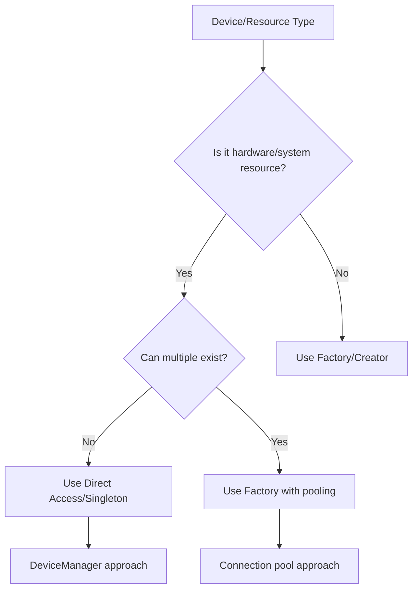

/**
 * DeviceManager Pattern Analysis - Registry vs Factory
 * Path: /ProjectDocs/Analysis/DeviceManager-Pattern-Analysis.md
 * 
 * Created: 2024-08-22
 * Last Modified: 2024-08-22
 * Author: VOS4 Development Team
 * Version: 1.0.0
 * 
 * Purpose: Analyze appropriate pattern for device management
 * Module: DeviceManager
 * 
 * Changelog:
 * - v1.0.0 (2024-08-22): Initial creation
 */

# DeviceManager: Registry vs Factory Analysis

## Current Implementation: Singleton with Lazy Components

```kotlin
// Current: Singleton pattern with lazy initialization
class DeviceManager(private val context: Context) {
    companion object {
        @Volatile
        private var instance: DeviceManager? = null
        
        fun getInstance(context: Context): DeviceManager {
            return instance ?: synchronized(this) {
                instance ?: DeviceManager(context).also { instance = it }
            }
        }
    }
    
    // Lazy-loaded components
    val audio: AudioDeviceManager by lazy { AudioDeviceManager(context) }
    val display: DisplayManager by lazy { DisplayManager(context) }
    val glasses: GlassesManager by lazy { GlassesManager(context) }
}
```

## The Question: What Pattern Should DeviceManager Use?

### Understanding Device Management Requirements

**Key Characteristics:**
1. **Hardware interfaces** - Audio devices, display, sensors
2. **System resources** - Limited, shared across app
3. **Stateful** - Device states need tracking
4. **Long-lived** - Exist for app lifetime
5. **Singleton nature** - One display, one audio system

---

## Analysis: Neither Registry nor Factory - Use Direct Access

### Why NOT Registry:

```kotlin
// ❌ BAD: Registry for devices
class DeviceRegistry {
    private val devices = mutableMapOf<String, Any>()
    
    fun registerDevice(name: String, device: Any) {
        devices[name] = device
    }
    
    fun getDevice(name: String) = devices[name]
}

// Problems:
// 1. Devices aren't interchangeable plugins
// 2. Runtime lookup unnecessary
// 3. Type safety lost
```

### Why NOT Factory:

```kotlin
// ❌ BAD: Factory for devices
class DeviceFactory {
    fun createAudioDevice(): AudioDevice {
        return AudioDevice()  // New instance?
    }
}

// Problems:
// 1. Can't have multiple audio systems
// 2. Hardware is singleton by nature
// 3. State would be lost between creates
```

---

## Recommended Approach: Direct Component Access

### Option 1: Current Approach (Good for Simple Cases) ✅

```kotlin
/**
 * Direct access to device components
 * Good when all components are always needed
 */
class DeviceManager(private val context: Context) {
    // Direct properties - clear, type-safe
    val audio = AudioDeviceManager(context)
    val display = DisplayManager(context)
    val glasses = GlassesManager(context)
    val xr = XRManager(context)
    
    fun initialize() {
        audio.initialize()
        display.initialize()
        // etc.
    }
}

// Usage - direct and clear
deviceManager.audio.setVolume(50)
deviceManager.display.setBrightness(80)
```

### Option 2: Lazy Loading (Current Implementation) ✅

```kotlin
/**
 * Lazy initialization for resource efficiency
 * Good when not all components are always used
 */
class DeviceManager(private val context: Context) {
    // Only created when accessed
    val audio by lazy { AudioDeviceManager(context) }
    val display by lazy { DisplayManager(context) }
    val glasses by lazy { GlassesManager(context) }
    val xr by lazy { XRManager(context) }
}

// Benefits:
// - Memory efficient
// - Faster startup
// - Only initializes what's needed
```

### Option 3: Component Provider Pattern (Best for Complex Systems) ⭐

```kotlin
/**
 * Provider pattern - controls lifecycle while maintaining direct access
 */
class DeviceProvider(private val context: Context) {
    private var _audio: AudioDeviceManager? = null
    private var _display: DisplayManager? = null
    
    // Controlled creation with direct access
    val audio: AudioDeviceManager
        get() = _audio ?: createAudioManager()
    
    val display: DisplayManager
        get() = _display ?: createDisplayManager()
    
    private fun createAudioManager(): AudioDeviceManager {
        return AudioDeviceManager(context).also {
            it.initialize()
            _audio = it
        }
    }
    
    private fun createDisplayManager(): DisplayManager {
        return DisplayManager(context).also {
            it.initialize()
            _display = it
        }
    }
    
    fun releaseAudio() {
        _audio?.release()
        _audio = null
    }
}
```

---

## Special Case: Audio Services

For AudioServices specifically, since multiple engines need it:

### Recommended: Shared Service Pattern

```kotlin
/**
 * AudioServices as a shared service, not created per-engine
 */
class AudioServices(context: Context) {
    val capture = AudioCapture(context)
    val deviceManager = AudioDeviceManager(context)
    val sessionManager = AudioSessionManager(context)
    
    fun startCapture(): Flow<ByteArray> {
        return capture.startRecording()
    }
}

// Speech engines receive the shared service
class VoskEngine(
    private val audioServices: AudioServices  // Injected, not created
) {
    fun startRecognition() {
        val audioFlow = audioServices.startCapture()
        processAudio(audioFlow)
    }
}

// Assembly/creation
object VOS4SystemAssembler {
    fun assemble(context: Context): VOS4System {
        // Create shared audio services once
        val audioServices = AudioServices(context)
        
        // Pass to all engines
        val voskEngine = VoskEngine(audioServices)
        val googleEngine = GoogleEngine(audioServices)
        val azureEngine = AzureEngine(audioServices)
        
        return VOS4System(...)
    }
}
```

---

## Decision Tree for Device Management



---

## Final Recommendation for VOS4

### 1. Keep DeviceManager as-is (with improvements):

```kotlin
/**
 * DeviceManager - Direct access to device components
 * Not a registry, not a factory - just organized access
 */
class DeviceManager(private val context: Context) {
    // Hardware/System components (singletons)
    val audio by lazy { AudioDeviceManager(context) }
    val display by lazy { DisplayManager(context) }
    val sensors by lazy { SensorManager(context) }
    val glasses by lazy { GlassesManager(context) }
    val xr by lazy { XRManager(context) }
    
    // Proper lifecycle management
    fun initialize() { /* Initialize core components */ }
    fun shutdown() { /* Release all resources */ }
}
```

### 2. Create AudioServices for shared audio:

```kotlin
/**
 * Shared audio services for all speech engines
 */
class AudioServices(
    val capture: AudioCapture,
    val deviceManager: AudioDeviceManager,
    val sessionManager: AudioSessionManager
) {
    companion object {
        fun create(context: Context): AudioServices {
            return AudioServices(
                capture = AudioCapture(context, AudioConfig.forSpeechRecognition()),
                deviceManager = AudioDeviceManager(context),
                sessionManager = AudioSessionManager(context)
            )
        }
    }
}
```

### 3. Use Assembler for wiring:

```kotlin
object VOS4SystemAssembler {
    fun assemble(context: Context): VOS4System {
        // Create device manager
        val deviceManager = DeviceManager(context)
        
        // Create shared audio services
        val audioServices = AudioServices.create(context)
        
        // Create engines with shared audio
        val engines = createEngines(audioServices)
        
        return VOS4System(
            deviceManager = deviceManager,
            audioServices = audioServices,
            engines = engines
        )
    }
}
```

---

## Summary

**For DeviceManager:** Neither Registry nor Factory is appropriate. Use:
- **Direct access** for hardware/system resources
- **Lazy initialization** for efficiency
- **Singleton/shared instances** for system resources
- **Dependency injection** for sharing between components

**Key Principle:** Device management is about **organizing access** to system resources, not creating or storing arbitrary objects.