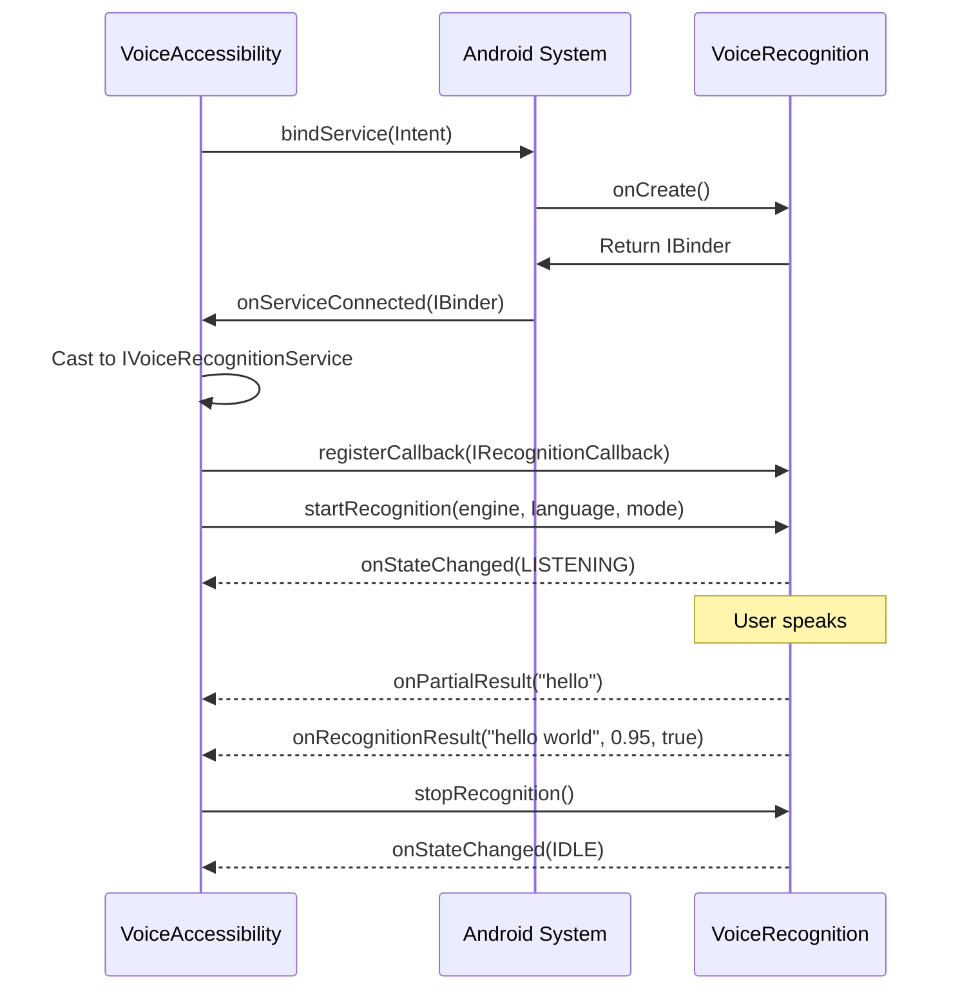

# VOS4 AIDL Interface Documentation

> **Last Updated:** 2025-01-06  
> **Version:** 1.0.0  
> **Status:** Active

## Table of Contents
1. [Overview](#overview)
2. [Architecture](#architecture)
3. [Interface Definitions](#interface-definitions)
4. [Module Integration](#module-integration)
5. [Usage Examples](#usage-examples)
6. [Security Considerations](#security-considerations)
7. [Testing](#testing)

---

## Overview

### What is AIDL?
Android Interface Definition Language (AIDL) enables Inter-Process Communication (IPC) between Android applications. In VOS4, AIDL facilitates secure, type-safe communication between separate app modules running in isolated processes.

### Why AIDL in VOS4?
- **Security Isolation**: Each app runs with its own permissions
- **Stability**: Process crashes don't affect other modules
- **Modularity**: Independent deployment and updates
- **Performance**: Efficient binary serialization
- **Type Safety**: Compile-time interface validation

---

## Architecture

### IPC Communication Flow

```
┌──────────────────────────────────────────────────────────────────────────┐
│                           VOS4 AIDL Architecture                         │
├──────────────────────────────────────────────────────────────────────────┤
│                                                                          │
│  ┌─────────────────────┐  AIDL IPC   ┌─────────────────────┐           │
│  │ VoiceAccessibility  │◄────────────►│  VoiceRecognition   │           │
│  │    (Client App)     │              │   (Service App)     │           │
│  ├─────────────────────┤              ├─────────────────────┤           │
│  │ • Accessibility Svc │              │ • Speech Recognition│           │
│  │ • Command Execution │              │ • Multiple Engines  │           │
│  │ • UI Automation     │              │ • Audio Processing  │           │
│  │                     │              │                     │           │
│  │ Permissions:        │              │ Permissions:        │           │
│  │ - BIND_ACCESSIBILITY│              │ - RECORD_AUDIO      │           │
│  │ - SYSTEM_ALERT     │              │ - INTERNET          │           │
│  └─────────────────────┘              └─────────────────────┘           │
│         Process 1                           Process 2                   │
│                                                                          │
└──────────────────────────────────────────────────────────────────────────┘
```

### Service Binding Sequence



---

## Interface Definitions

### 1. IVoiceRecognitionService.aidl

**Location:** `/apps/VoiceRecognition/src/main/aidl/com/augmentalis/voicerecognition/`  
**Purpose:** Main service interface for voice recognition functionality

#### Methods:

| Method | Parameters | Returns | Description |
|--------|-----------|---------|-------------|
| `startRecognition` | `String engine`<br>`String language`<br>`int mode` | `boolean` | Starts voice recognition<br>Engines: "vivoka" (default), "vosk", "android_stt", "whisper", "google_cloud"<br>Pass empty string ("") to use default/saved preference<br>Modes: 0=continuous, 1=single, 2=streaming |
| `stopRecognition` | None | `boolean` | Stops active recognition session |
| `isRecognizing` | None | `boolean` | Checks if currently recognizing |
| `registerCallback` | `IRecognitionCallback callback` | `void` | Registers result callback |
| `unregisterCallback` | `IRecognitionCallback callback` | `void` | Unregisters callback |
| `getAvailableEngines` | None | `List<String>` | Returns available engines |
| `getStatus` | None | `String` | Gets service status |

### 2. IRecognitionCallback.aidl

**Location:** `/apps/VoiceRecognition/src/main/aidl/com/augmentalis/voicerecognition/`  
**Purpose:** Callback interface for recognition events

#### Callbacks:

| Callback | Parameters | Description |
|----------|-----------|-------------|
| `onRecognitionResult` | `String text`<br>`float confidence`<br>`boolean isFinal` | Final or intermediate recognition result |
| `onError` | `int errorCode`<br>`String message` | Recognition error occurred |
| `onStateChanged` | `int state`<br>`String message` | State change notification<br>States: 0=idle, 1=listening, 2=processing, 3=error |
| `onPartialResult` | `String partialText` | Partial recognition result during processing |

### 3. RecognitionData.aidl

**Location:** `/apps/VoiceRecognition/src/main/aidl/com/augmentalis/voicerecognition/`  
**Purpose:** Parcelable data structure for complex recognition data

#### Parcelable Fields:

```kotlin
data class RecognitionData(
    val text: String,           // Recognized text
    val confidence: Float,       // Confidence score (0.0-1.0)
    val timestamp: Long,         // Recognition timestamp
    val engineUsed: String,      // Engine that produced result
    val isFinal: Boolean        // Final vs intermediate result
)
```

---

## Module Integration

### VoiceAccessibility Module
**Role:** AIDL Client  
**Package:** `com.augmentalis.voiceaccessibility`

#### Responsibilities:
- Binds to VoiceRecognition service
- Registers callbacks for recognition results
- Translates voice commands to accessibility actions
- Manages service lifecycle

#### Key Files:
- `/apps/VoiceAccessibility/src/main/aidl/` - AIDL interface copies
- `VoiceAccessibilityService.kt` - Main service implementation
- `ActionCoordinator.kt` - Command processing

### VoiceRecognition Module
**Role:** AIDL Service Provider  
**Package:** `com.augmentalis.voicerecognition`

#### Responsibilities:
- Implements IVoiceRecognitionService
- Manages speech recognition engines
- Handles audio recording and processing
- Sends results via callbacks

#### Key Files:
- `/apps/VoiceRecognition/src/main/aidl/` - AIDL interface definitions
- `VoiceRecognitionService.kt` - Service implementation
- `EngineManager.kt` - Recognition engine management

---

## Usage Examples

### Client Side (VoiceAccessibility)

```kotlin
class VoiceAccessibilityService : AccessibilityService() {
    
    private var recognitionService: IVoiceRecognitionService? = null
    
    // Service connection
    private val serviceConnection = object : ServiceConnection {
        override fun onServiceConnected(name: ComponentName?, service: IBinder?) {
            recognitionService = IVoiceRecognitionService.Stub.asInterface(service)
            setupRecognition()
        }
        
        override fun onServiceDisconnected(name: ComponentName?) {
            recognitionService = null
        }
    }
    
    // Recognition callback
    private val recognitionCallback = object : IRecognitionCallback.Stub() {
        override fun onRecognitionResult(text: String, confidence: Float, isFinal: Boolean) {
            if (isFinal && confidence > 0.7f) {
                processVoiceCommand(text)
            }
        }
        
        override fun onError(errorCode: Int, message: String?) {
            Log.e(TAG, "Recognition error: $message")
        }
        
        override fun onStateChanged(state: Int, message: String?) {
            updateUIState(state)
        }
        
        override fun onPartialResult(partialText: String?) {
            showPartialResult(partialText)
        }
    }
    
    private fun setupRecognition() {
        recognitionService?.apply {
            registerCallback(recognitionCallback)
            startRecognition("google", "en-US", 0) // Continuous mode
        }
    }
    
    private fun processVoiceCommand(command: String) {
        when (command.lowercase()) {
            "go back" -> performGlobalAction(GLOBAL_ACTION_BACK)
            "go home" -> performGlobalAction(GLOBAL_ACTION_HOME)
            "scroll down" -> performScrollAction(AccessibilityNodeInfo.ACTION_SCROLL_FORWARD)
            // ... more commands
        }
    }
}
```

### Service Side (VoiceRecognition)

```kotlin
class VoiceRecognitionService : Service() {
    
    private val callbacks = mutableListOf<IRecognitionCallback>()
    private var currentEngine: RecognitionEngine? = null
    
    private val binder = object : IVoiceRecognitionService.Stub() {
        
        override fun startRecognition(engine: String, language: String, mode: Int): Boolean {
            return try {
                currentEngine = EngineFactory.create(engine, language)
                currentEngine?.start { result ->
                    notifyCallbacks(result)
                }
                true
            } catch (e: Exception) {
                notifyError(e)
                false
            }
        }
        
        override fun stopRecognition(): Boolean {
            currentEngine?.stop()
            currentEngine = null
            return true
        }
        
        override fun isRecognizing(): Boolean {
            return currentEngine?.isActive() == true
        }
        
        override fun registerCallback(callback: IRecognitionCallback) {
            callbacks.add(callback)
        }
        
        override fun unregisterCallback(callback: IRecognitionCallback) {
            callbacks.remove(callback)
        }
        
        override fun getAvailableEngines(): List<String> {
            return listOf("google", "vivoka", "vosk", "whisper")
        }
        
        override fun getStatus(): String {
            return buildString {
                append("Service: Active\n")
                append("Engine: ${currentEngine?.name ?: "None"}\n")
                append("Callbacks: ${callbacks.size}")
            }
        }
    }
    
    private fun notifyCallbacks(result: RecognitionResult) {
        callbacks.forEach { callback ->
            try {
                callback.onRecognitionResult(
                    result.text,
                    result.confidence,
                    result.isFinal
                )
            } catch (e: RemoteException) {
                // Handle dead callback
            }
        }
    }
    
    override fun onBind(intent: Intent?): IBinder {
        return binder
    }
}
```

---

## Security Considerations

### Permission Requirements

#### VoiceAccessibility
```xml
<uses-permission android:name="android.permission.BIND_ACCESSIBILITY_SERVICE" />
<uses-permission android:name="android.permission.SYSTEM_ALERT_WINDOW" />
```

#### VoiceRecognition
```xml
<uses-permission android:name="android.permission.RECORD_AUDIO" />
<uses-permission android:name="android.permission.INTERNET" />
```

### Service Declaration

```xml
<!-- In VoiceRecognition AndroidManifest.xml -->
<service
    android:name=".VoiceRecognitionService"
    android:exported="true"
    android:permission="com.augmentalis.voicerecognition.BIND">
    <intent-filter>
        <action android:name="com.augmentalis.voicerecognition.SERVICE" />
    </intent-filter>
</service>
```

### Security Best Practices
1. **Permission Checks**: Validate caller permissions before accepting connections
2. **Input Validation**: Sanitize all AIDL parameters
3. **Rate Limiting**: Prevent DoS attacks via excessive calls
4. **Secure Defaults**: Use secure communication modes by default
5. **Audit Logging**: Log all IPC transactions for security monitoring

---

## Testing

### Unit Testing AIDL Interfaces

```kotlin
@Test
fun testAIDLCommunication() = runTest {
    // Create mock service
    val mockService = object : IVoiceRecognitionService.Stub() {
        override fun startRecognition(engine: String, language: String, mode: Int): Boolean {
            return engine == "test" && language == "en-US"
        }
        // ... implement other methods
    }
    
    // Test service binding
    val serviceRule = ServiceTestRule()
    val binder = serviceRule.bindService(
        Intent(context, VoiceRecognitionService::class.java)
    )
    
    val service = IVoiceRecognitionService.Stub.asInterface(binder)
    assertTrue(service.startRecognition("google", "en-US", 0))
}
```

### Integration Testing

```kotlin
@Test
fun testEndToEndRecognition() = runTest {
    val resultLatch = CountDownLatch(1)
    var receivedText: String? = null
    
    val callback = object : IRecognitionCallback.Stub() {
        override fun onRecognitionResult(text: String, confidence: Float, isFinal: Boolean) {
            if (isFinal) {
                receivedText = text
                resultLatch.countDown()
            }
        }
        // ... other callbacks
    }
    
    service.registerCallback(callback)
    service.startRecognition("test", "en-US", 0)
    
    // Simulate recognition
    assertTrue(resultLatch.await(5, TimeUnit.SECONDS))
    assertEquals("test command", receivedText)
}
```

---

## Performance Considerations

### Optimization Tips
1. **Batch Operations**: Group multiple AIDL calls when possible
2. **Async Callbacks**: Use callbacks instead of blocking calls
3. **Connection Pooling**: Reuse service connections
4. **Data Compression**: Compress large data before transmission
5. **Timeout Management**: Set appropriate timeouts for all operations

### Memory Management
- AIDL calls copy data across processes
- Large data structures should be passed by reference when possible
- Use `oneway` modifier for fire-and-forget calls
- Implement proper cleanup in `onServiceDisconnected`

---

## Troubleshooting

### Common Issues

| Issue | Cause | Solution |
|-------|-------|----------|
| DeadObjectException | Service process died | Implement reconnection logic |
| SecurityException | Missing permissions | Verify manifest permissions |
| ClassNotFoundException | AIDL not generated | Clean and rebuild project |
| RemoteException | IPC failure | Add try-catch around AIDL calls |
| Service not binding | Incorrect intent filter | Verify service declaration |

### Debug Commands

```bash
# List active services
adb shell dumpsys activity services | grep voicerecognition

# Check service connections
adb shell dumpsys activity services com.augmentalis.voicerecognition

# Monitor AIDL transactions
adb shell dumpsys activity providers | grep augmentalis
```

---

## Future Enhancements

### Planned Improvements
1. **Bidirectional Streaming**: Real-time audio streaming via AIDL
2. **Multi-Client Support**: Allow multiple apps to use recognition service
3. **Enhanced Security**: Add encryption for sensitive data
4. **Performance Monitoring**: Built-in metrics for AIDL calls
5. **Version Negotiation**: Handle interface version mismatches

### Potential New Interfaces
- `IVoiceTrainingService`: For custom voice model training
- `IVoiceSynthesisService`: Text-to-speech service
- `IVoiceAnalyticsService`: Voice usage analytics

---

## References

- [Android AIDL Documentation](https://developer.android.com/guide/components/aidl)
- [Android IPC Mechanisms](https://developer.android.com/reference/android/os/Binder)
- [Parcelable vs Serializable](https://developer.android.com/reference/android/os/Parcelable)
- VOS4 Architecture Documentation: `/docs/architecture/`

---

*Document maintained by VOS4 Development Team*