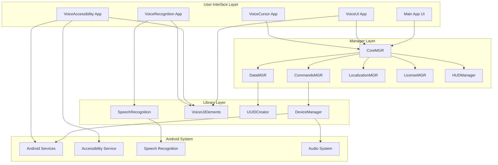
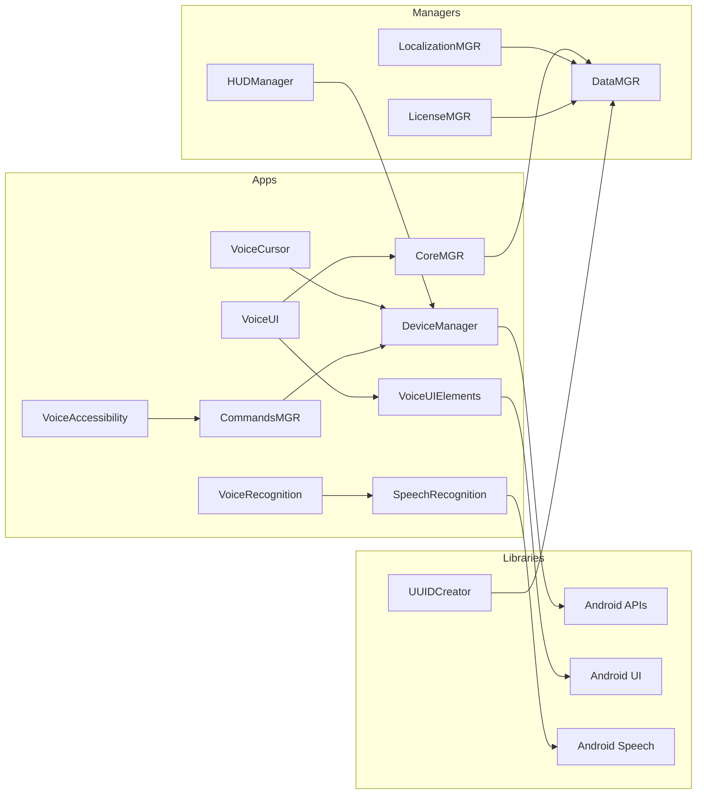

# VOS4 System Architecture
**Version**: 4.0.0-alpha  
**Date**: January 30, 2025  
**Status**: ✅ Building Successfully

## System Overview



## Component Communication

### Inter-Module Communication Pattern
```
┌─────────────────────────────────────────────────────────┐
│                    User Interaction                       │
└─────────────────┬───────────────────────────────────────┘
                  │
┌─────────────────▼───────────────────────────────────────┐
│                    Main Application                       │
│  - Coordinates all modules                                │
│  - Manages UI state                                      │
│  - Handles navigation                                    │
└─────────────────┬───────────────────────────────────────┘
                  │
        ┌─────────┴─────────┬──────────┬──────────┐
        ▼                   ▼          ▼          ▼
┌──────────────┐   ┌──────────────┐  ┌──────────────┐
│ Applications │   │   Managers   │  │  Libraries   │
│              │   │              │  │              │
│ - VoiceUI    │   │ - CoreMGR    │  │ - DeviceMgr  │
│ - VoiceCursor│   │ - DataMGR    │  │ - VoiceUI    │
│ - VoiceAccess│   │ - CommandMGR │  │   Elements   │
│ - VoiceRecog │   │ - LocalizMGR │  │ - UUIDMgr    │
│              │   │ - LicenseMGR │  │ - SpeechRec  │
│              │   │ - HUDManager │  │              │
└──────────────┘   └──────────────┘  └──────────────┘
        │                   │                 │
        └───────────────────┼─────────────────┘
                           │
                ┌──────────▼──────────┐
                │   Android System    │
                │ - System Services   │
                │ - Hardware Access   │
                │ - Permissions       │
                └─────────────────────┘
```

## Module Dependencies

### Dependency Graph


## Data Flow

### Voice Command Processing
```
1. User Speech Input
       │
       ▼
2. VoiceRecognition App
   - Captures audio
   - Selects engine
       │
       ▼
3. SpeechRecognition Library
   - Process with selected engine
   - Return transcription
       │
       ▼
4. CommandsMGR
   - Parse command
   - Validate syntax
   - Determine action
       │
       ▼
5. CoreMGR
   - Route to handler
   - Coordinate modules
       │
       ▼
6. Target Module
   - Execute action
   - Return result
       │
       ▼
7. UI Feedback
   - Visual confirmation
   - Audio feedback
```

## Security Architecture

### Permission Model
```
┌─────────────────────────────────────────────────────┐
│                 Permission Layer                     │
├─────────────────────────────────────────────────────┤
│ CRITICAL                                             │
│ - RECORD_AUDIO                                      │
│ - ACCESSIBILITY_SERVICE                             │
│ - SYSTEM_ALERT_WINDOW                               │
├─────────────────────────────────────────────────────┤
│ IMPORTANT                                           │
│ - BLUETOOTH_SCAN, BLUETOOTH_CONNECT                 │
│ - ACCESS_NETWORK_STATE                              │
│ - VIBRATE                                           │
│ - USE_BIOMETRIC                                     │
├─────────────────────────────────────────────────────┤
│ OPTIONAL                                            │
│ - CAMERA                                            │
│ - ACCESS_FINE_LOCATION                              │
│ - FOREGROUND_SERVICE                                │
└─────────────────────────────────────────────────────┘
```

### Security Features
- **Runtime Permission Checks**: All permissions requested at runtime
- **API Level Compatibility**: Automatic fallbacks for older APIs
- **Secure Storage**: Encrypted preferences for sensitive data
- **License Validation**: Secure license checking
- **Network Security**: TLS for all network communication

## Performance Optimization

### Memory Management
```
Target Memory Usage:
├── Base System: 50MB
├── Speech Engine: 50-100MB
├── UI Components: 30MB
├── Cache & Buffers: 20MB
└── Total: <200MB
```

### Optimization Strategies
1. **Lazy Loading**: Modules loaded on demand
2. **View Recycling**: Efficient UI component reuse
3. **Coroutines**: Non-blocking async operations
4. **Caching**: Intelligent result caching
5. **Resource Management**: Automatic cleanup

## Build Architecture

### Module Structure
```
VOS4/
├── settings.gradle.kts     # Module registration
├── build.gradle.kts        # Root build config
│
├── app/
│   └── build.gradle.kts   # Main app config
│
├── apps/
│   ├── VoiceUI/
│   │   └── build.gradle.kts
│   ├── VoiceCursor/
│   │   └── build.gradle.kts
│   ├── VoiceAccessibility/
│   │   └── build.gradle.kts
│   └── VoiceRecognition/
│       └── build.gradle.kts
│
├── managers/
│   ├── CoreMGR/
│   │   └── build.gradle.kts
│   ├── DataMGR/
│   │   └── build.gradle.kts
│   ├── CommandsMGR/
│   │   └── build.gradle.kts
│   ├── LocalizationMGR/
│   │   └── build.gradle.kts
│   ├── LicenseMGR/
│   │   └── build.gradle.kts
│   └── HUDManager/
│       └── build.gradle.kts
│
└── libraries/
    ├── DeviceManager/
    │   └── build.gradle.kts
    ├── VoiceUIElements/
    │   └── build.gradle.kts
    ├── UUIDCreator/
    │   └── build.gradle.kts
    └── SpeechRecognition/
        └── build.gradle.kts
```

### Build Dependencies
```kotlin
// Root build.gradle.kts
buildscript {
    ext {
        compileSdk = 34
        minSdk = 28
        targetSdk = 34
        kotlinVersion = "1.9.25"
        composeVersion = "1.5.15"
    }
}

// Module dependencies example
dependencies {
    implementation(project(":libraries:DeviceManager"))
    implementation(project(":libraries:VoiceUIElements"))
    implementation(project(":managers:CoreMGR"))
    
    // External dependencies
    implementation("androidx.core:core-ktx:1.12.0")
    implementation("org.jetbrains.kotlinx:kotlinx-coroutines-android:1.8.1")
}
```

## Testing Architecture

### Test Strategy
```
┌─────────────────────────────────────────────────────┐
│                   Test Pyramid                       │
├─────────────────────────────────────────────────────┤
│ E2E Tests (5%)                                      │
│ - Full voice command flow                           │
│ - Cross-module integration                          │
├─────────────────────────────────────────────────────┤
│ Integration Tests (25%)                             │
│ - Module interactions                               │
│ - API contracts                                     │
│ - Database operations                               │
├─────────────────────────────────────────────────────┤
│ Unit Tests (70%)                                    │
│ - Business logic                                    │
│ - Utility functions                                 │
│ - Data models                                       │
└─────────────────────────────────────────────────────┘
```

### Test Execution
```bash
# All tests
./gradlew test

# Module-specific tests
./gradlew :libraries:DeviceManager:test

# Instrumented tests
./gradlew connectedAndroidTest

# Coverage report
./gradlew jacocoTestReport
```

## Deployment Architecture

### Release Pipeline
```
1. Development
   ├── Feature branches
   ├── Local testing
   └── Code review
       │
       ▼
2. Integration
   ├── Merge to VOS4 branch
   ├── Automated tests
   └── Build validation
       │
       ▼
3. Staging
   ├── Beta release
   ├── User testing
   └── Performance monitoring
       │
       ▼
4. Production
   ├── Release build
   ├── Play Store deployment
   └── OTA updates
```

## API Versioning

### Version Strategy
- **Major**: Breaking changes (4.x.x)
- **Minor**: New features (x.1.x)
- **Patch**: Bug fixes (x.x.1)

### API Contracts
```kotlin
interface VoiceCommandAPI {
    @Since("4.0.0")
    fun executeCommand(command: String): Result
    
    @Since("4.1.0")
    fun executeCommandWithContext(
        command: String, 
        context: CommandContext
    ): Result
    
    @Deprecated("Use executeCommandWithContext")
    fun executeCommandLegacy(command: String): Boolean
}
```

## Future Architecture Plans

### Q2 2025
- Cloud integration layer
- Remote configuration
- Analytics pipeline
- A/B testing framework

### Q3 2025
- Plugin architecture
- Third-party integrations
- Enterprise features
- Advanced AI capabilities

### Q4 2025
- Distributed processing
- Edge computing support
- Offline-first architecture
- Cross-platform support

---
*Architecture Document Version 1.0*  
*Last Updated: January 30, 2025*