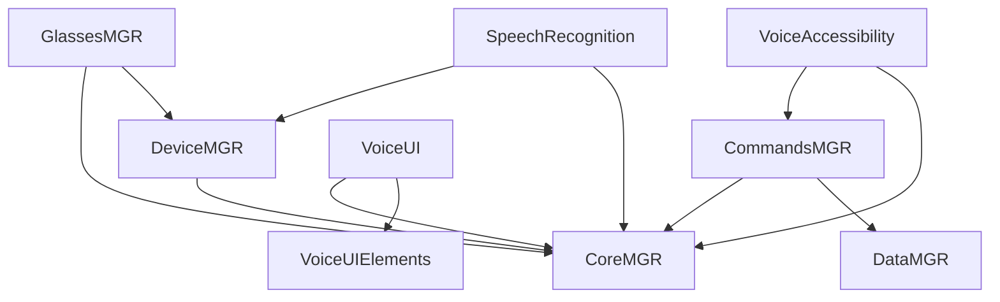

# VOS4 - Final Architecture
**Module:** Core Architecture
**Author:** Manoj Jhawar
**Created:** 240820
**Last Updated:** 240820

## Changelog
- 240820: Complete architectural restructuring with DeviceMGR consolidation

## Final Module Architecture

### Standalone Apps
1. **VoiceAccessibility** (`com.ai.voiceaccessibility`)
   - Android accessibility service for voice control
   - Standalone accessibility app
   
2. **SpeechRecognition** (`com.ai.speechrecognition`)
   - Multi-engine speech-to-text
   - Standalone speech recognition app
   
3. **VoiceUI** (`com.ai.voiceui`)
   - UI creation framework for voice and spatial-compliant interfaces
   - SDK/Framework for building accessible voice-driven UIs
   - Provides tools, builders, and templates for UI creation
   
4. **DeviceMGR** (`com.ai.devicemgr`)
   - Unified hardware management app
   - Submodules:
     - AudioMGR - Audio input/output control
     - DisplayMGR - Overlay and screen management  
     - IMUMGR - Motion sensors
     - DeviceInfo - Device detection/profiling
     - SensorMGR - Other sensors (future)
     - CameraMGR - Camera control (future)
     - BatteryMGR - Power management (future)

### System Managers (Not Standalone)
1. **CoreMGR** (`com.ai.coremgr`)
   - Core framework and module registry
   
2. **CommandsMGR** (`com.ai.commandsmgr`)
   - Command processing and execution
   
3. **DataMGR** (`com.ai.datamgr`)
   - ObjectBox persistence layer
   
4. **GlassesMGR** (`com.ai.glassesmgr`)
   - Smart glasses device support
   - Brand structure: vuzix/, realwear/, xreal/, etc.
   
5. **LocalizationMGR** (`com.ai.localizationmgr`)
   - Multi-language support
   
6. **LicenseMGR** (`com.ai.licensemgr`)
   - License and subscription management

### Shared Libraries
1. **VoiceUIElements** (`com.ai.voiceuielements`)
   - Pre-made UI components and themes (formerly uiblocks)
   - Shared library of Compose components for voice/spatial UIs
   - Glass morphism themes, spatial buttons, voice indicators
   - Used by all apps needing UI components

## Namespace Structure

### Pattern
- Standalone Apps: `com.ai.[appname]`
- Managers: `com.ai.[managername]`
- No deep nesting (max 3 levels)

### Examples
```
com.ai.devicemgr.audio.*
com.ai.devicemgr.display.*
com.ai.devicemgr.imu.*
com.ai.speechrecognition.*
com.ai.voiceaccessibility.*
com.ai.coremgr.*
```

## Benefits of This Architecture

1. **Clear Separation**: Apps vs Managers
2. **Single Responsibility**: Each module has clear purpose
3. **Unified Hardware**: All device access through DeviceMGR
4. **Clean Permissions**: One app for hardware permissions
5. **Maintainable**: Logical grouping of related functionality
6. **Scalable**: Easy to add new managers or apps
7. **User-Friendly**: Fewer apps for users to manage

## Module Dependencies



## Migration Path

### Phase 1: Create DeviceMGR Structure
1. Create DeviceMGR module
2. Create submodule directories
3. Move audio → DeviceMGR/AudioMGR
4. Move overlay → DeviceMGR/DisplayMGR
5. Move deviceinfo → DeviceMGR/DeviceInfo

### Phase 2: Rename Modules
1. core → CoreMGR
2. accessibility → VoiceAccessibility
3. srstt → SpeechRecognition
4. commandmgr → CommandsMGR
5. database → DataMGR
6. smartglasses → GlassesMGR
7. localization → LocalizationMGR
8. licensing → LicenseMGR
9. uikit → VoiceUI
10. uiblocks → VoiceUIElements

### Phase 3: Update Namespaces
1. Update all package declarations
2. Update all imports
3. Update build.gradle.kts files
4. Update settings.gradle.kts

### Phase 4: Documentation Updates
1. Update all .md files
2. Update code comments
3. Update README files

## File Structure

```
/VOS4/
├── apps/                    # Standalone Apps
│   ├── VoiceAccessibility/
│   ├── SpeechRecognition/
│   ├── VoiceUI/
│   └── DeviceMGR/
│       ├── AudioMGR/
│       ├── DisplayMGR/
│       ├── IMUMGR/
│       └── DeviceInfo/
├── modules/                 # System Managers
│   ├── CoreMGR/
│   ├── CommandsMGR/
│   ├── DataMGR/
│   ├── GlassesMGR/
│   ├── LocalizationMGR/
│   └── LicenseMGR/
└── libraries/              # Shared Libraries
    └── VoiceUIElements/
```

## Implementation Status

| Module | Old Name | New Name | Namespace | Status |
|--------|----------|----------|-----------|--------|
| Core | core | CoreMGR | com.ai.coremgr | ⏳ Pending |
| Audio | audiomgr | DeviceMGR/AudioMGR | com.ai.devicemgr.audio | ⏳ Pending |
| Display | overlay | DeviceMGR/DisplayMGR | com.ai.devicemgr.display | ⏳ Pending |
| Device | deviceinfo | DeviceMGR/DeviceInfo | com.ai.devicemgr.info | ⏳ Pending |
| Speech | srstt | SpeechRecognition | com.ai.speechrecognition | ⏳ Pending |
| Access | accessibility | VoiceAccessibility | com.ai.voiceaccessibility | ⏳ Pending |
| Commands | commandmgr | CommandsMGR | com.ai.commandsmgr | ⏳ Pending |
| Data | database | DataMGR | com.ai.datamgr | ⏳ Pending |
| Glasses | smartglasses | GlassesMGR | com.ai.glassesmgr | ⏳ Pending |
| Locale | localization | LocalizationMGR | com.ai.localizationmgr | ⏳ Pending |
| License | licensing | LicenseMGR | com.ai.licensemgr | ⏳ Pending |
| UI | uikit | VoiceUI | com.ai.voiceui | ⏳ Pending |
| UILib | uiblocks | VoiceUIElements | com.ai.voiceuielements | ⏳ Pending |