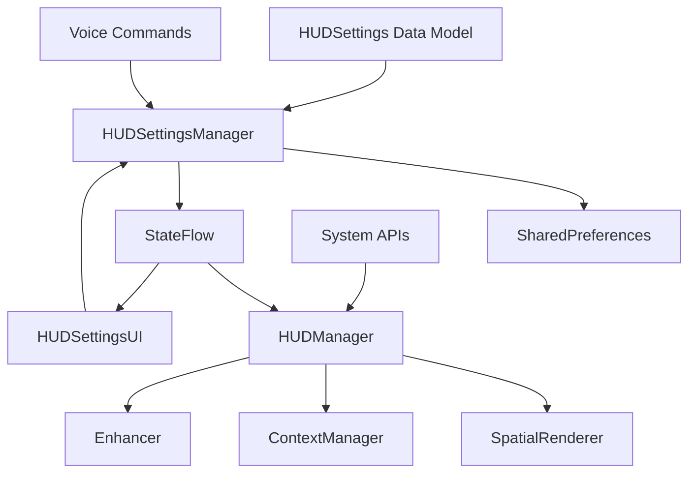

# HUD Settings System - Complete Developer Manual

## Table of Contents
1. [Overview](#overview)
2. [Architecture](#architecture)
3. [Implementation Details](#implementation-details)
4. [API Reference](#api-reference)
5. [Voice Commands](#voice-commands)
6. [UI Components](#ui-components)
7. [Settings Persistence](#settings-persistence)
8. [Testing Guide](#testing-guide)
9. [Performance Optimization](#performance-optimization)
10. [Troubleshooting](#troubleshooting)
11. [Migration Guide](#migration-guide)
12. [Future Enhancements](#future-enhancements)

## Overview

The HUD Settings System (v1.1.0) provides comprehensive customization capabilities for VOS4's augmented reality display system. It enables users to control every aspect of their HUD experience through UI, voice commands, or programmatic APIs.

### Key Capabilities
- **8 Display Modes** - From minimal to full information display
- **Visual Customization** - Transparency, brightness, contrast, themes
- **40+ Toggleable Elements** - Individual UI component control
- **3 Performance Modes** - Battery saver to maximum performance
- **Privacy Protection** - Auto-hide, blur, meeting mode
- **Accessibility Support** - High contrast, large text, color blind modes
- **Voice Control** - 30+ voice commands for hands-free control
- **Preset System** - Quick configurations for common scenarios

## Architecture

### System Architecture Diagram

```
┌─────────────────────────────────────────────────────────────┐
│                         User Layer                           │
├─────────────────────────────────────────────────────────────┤
│   Voice Commands    │    Compose UI    │    System APIs     │
└──────────┬──────────┴────────┬─────────┴────────┬───────────┘
           │                   │                   │
           ▼                   ▼                   ▼
┌─────────────────────────────────────────────────────────────┐
│                    HUDSettingsManager                        │
│  ┌──────────────────────────────────────────────────────┐  │
│  │ • Settings Persistence (SharedPreferences + JSON)     │  │
│  │ • StateFlow for Reactive Updates                      │  │
│  │ • Voice Command Processing                           │  │
│  │ • Preset Management                                  │  │
│  └──────────────────────────────────────────────────────┘  │
└─────────────────────────┬────────────────────────────────────┘
                         │
                         ▼
┌─────────────────────────────────────────────────────────────┐
│                       HUDManager                             │
│  ┌──────────────────────────────────────────────────────┐  │
│  │ • Settings Observer                                   │  │
│  │ • Settings Applicator                                │  │
│  │ • Mode Controller                                    │  │
│  └──────────────────────────────────────────────────────┘  │
└─────────────────────────┬────────────────────────────────────┘
                         │
                         ▼
┌─────────────────────────────────────────────────────────────┐
│                    Renderer Layer                            │
├─────────────────────────────────────────────────────────────┤
│  SpatialRenderer  │  ContextManager  │  Enhancer           │
└───────────────────┴──────────────────┴──────────────────────┘
```

### Component Relationships



### Data Flow Sequence

```
User Action → SettingsManager → Persistence → StateFlow → Observers → Renderers
     ↑                                                          ↓
     └──────────────────── Feedback ←──────────────────────────┘
```

## Implementation Details

### Core Classes

#### 1. HUDSettings.kt
```kotlin
@Serializable
data class HUDSettings(
    val hudEnabled: Boolean = true,
    val displayMode: HUDDisplayMode = HUDDisplayMode.CONTEXTUAL,
    val displayElements: DisplayElements = DisplayElements(),
    val positioning: PositioningSettings = PositioningSettings(),
    val visual: VisualSettings = VisualSettings(),
    val privacy: PrivacySettings = PrivacySettings(),
    val performance: PerformanceSettings = PerformanceSettings(),
    val accessibility: AccessibilitySettings = AccessibilitySettings()
)
```

**Key Design Decisions:**
- Uses Kotlinx Serialization for JSON persistence
- Immutable data classes for thread safety
- Default values for all properties
- Companion object with preset configurations

#### 2. HUDSettingsManager.kt
```kotlin
class HUDSettingsManager private constructor(context: Context) {
    private val _settings = MutableStateFlow(loadSettings())
    val settings: StateFlow<HUDSettings> = _settings.asStateFlow()
    
    fun saveSettings(settings: HUDSettings)
    fun updateSettings(block: HUDSettings.() -> HUDSettings)
    fun handleVoiceCommand(command: String): Boolean
}
```

**Key Features:**
- Singleton pattern for global access
- Reactive updates via StateFlow
- Atomic updates with copy-on-write
- Voice command parsing and execution

#### 3. Display Modes

| Mode | Description | Use Case | Key Features |
|------|-------------|----------|--------------|
| OFF | Disabled | Privacy/Battery | No rendering |
| MINIMAL | Essential only | Focus mode | Battery, time |
| CONTEXTUAL | Smart adaptive | Default | Context-aware |
| FULL | Everything | Power users | All elements |
| CUSTOM | User defined | Personal | Customizable |
| DRIVING | Navigation | Driving | Voice, nav |
| WORK | Productivity | Office | High contrast |
| FITNESS | Exercise | Workouts | Health stats |
| PRIVACY | Secure | Public | Blurred data |

### Settings Categories

#### Visual Settings
```kotlin
data class VisualSettings(
    val transparency: Float = 0.8f,      // 0.0-1.0
    val brightness: Float = 1.0f,        // 0.5-2.0
    val contrast: Float = 1.0f,          // 0.5-2.0
    val colorTheme: ColorTheme = AUTO,
    val fontSize: Float = 1.0f,
    val animations: Boolean = true
)
```

#### Performance Settings
```kotlin
data class PerformanceSettings(
    val targetFps: Int = 60,             // 30/60/90/120
    val batteryOptimization: Boolean = true,
    val adaptiveQuality: Boolean = true,
    val shadowQuality: ShadowQuality = MEDIUM,
    val textureQuality: TextureQuality = HIGH
)
```

#### Privacy Settings
```kotlin
data class PrivacySettings(
    val hideInPublic: Boolean = false,
    val blurSensitiveContent: Boolean = true,
    val disableInMeetings: Boolean = true,
    val incognitoMode: Boolean = false
)
```

## API Reference

### Initialization
```kotlin
// Get instance
val settingsManager = HUDSettingsManager.getInstance(context)
val hudManager = HUDManager.getInstance(context)

// Initialize
hudManager.initialize() // Automatically starts observing settings
```

### Settings Management
```kotlin
// Get current settings
val current = settingsManager.currentSettings

// Update settings
settingsManager.updateSettings {
    copy(
        displayMode = HUDDisplayMode.MINIMAL,
        visual = visual.copy(transparency = 0.5f)
    )
}

// Apply preset
settingsManager.applyPreset(HUDPreset.DRIVING)

// Toggle HUD
settingsManager.toggleHUD(enabled = true)

// Adjust visual properties
settingsManager.adjustTransparency(0.8f)
settingsManager.adjustBrightness(1.2f)
settingsManager.setColorTheme(ColorTheme.DARK)

// Toggle display elements
settingsManager.toggleDisplayElement(DisplayElement.NOTIFICATIONS)

// Performance modes
settingsManager.setPerformanceMode(PerformanceMode.BATTERY_SAVER)

// Privacy
settingsManager.enablePrivacyMode(true)
```

### Observing Changes
```kotlin
// Observe settings changes
lifecycleScope.launch {
    settingsManager.settings.collect { settings ->
        // React to changes
        updateUI(settings)
    }
}
```

### Voice Commands
```kotlin
// Handle voice command
val handled = hudManager.handleVoiceCommand("turn on privacy mode")

// Or through settings manager
val handled = settingsManager.handleVoiceCommand("increase transparency")
```

## Voice Commands

### Complete Command List

#### Master Control
- "turn on hud" / "enable hud"
- "turn off hud" / "disable hud"

#### Display Modes
- "minimal mode" / "minimal display"
- "full display" / "show everything"
- "contextual mode"
- "driving mode"
- "privacy mode"

#### Visual Adjustments
- "increase transparency" / "more transparent"
- "decrease transparency" / "less transparent"
- "brighter" / "increase brightness"
- "darker" / "decrease brightness"
- "dark mode" / "dark theme"
- "light mode" / "light theme"

#### Display Elements
- "hide notifications"
- "show notifications"
- "hide time"
- "show battery"
- "hide all"
- "show all"

#### Performance
- "battery saver" / "save battery"
- "performance mode" / "maximum performance"
- "balanced mode"

#### Presets
- "reset settings" / "default settings"
- "apply driving preset"
- "work mode"
- "fitness mode"

### Voice Command Processing
```kotlin
fun handleVoiceCommand(command: String): Boolean {
    val normalizedCommand = command.toLowerCase().trim()
    
    // Pattern matching
    return when {
        // Exact matches
        "turn off hud" == normalizedCommand -> { toggleHUD(false); true }
        
        // Contains patterns
        "transparency" in normalizedCommand -> {
            when {
                "increase" in normalizedCommand -> adjustTransparency(+0.1f)
                "decrease" in normalizedCommand -> adjustTransparency(-0.1f)
                else -> false
            }
        }
        
        // Regex patterns
        Regex("set.+brightness.+(\\d+)").matches(normalizedCommand) -> {
            // Extract and apply brightness value
            true
        }
        
        else -> false
    }
}
```

## UI Components

### Settings Screen Structure

```
HUDSettingsScreen
├── TopAppBar
│   ├── Title: "HUD Display Settings"
│   ├── NavigationIcon: Back arrow
│   └── Actions: Reset button
├── TabRow
│   ├── General Tab
│   ├── Display Tab
│   ├── Visual Tab
│   ├── Privacy Tab
│   └── Performance Tab
└── LazyColumn (Content)
    └── [Tab-specific content]
```

### Compose Components

#### MasterToggle
```kotlin
@Composable
fun MasterToggle(
    enabled: Boolean,
    onToggle: (Boolean) -> Unit
)
```
Large card with HUD on/off switch.

#### DisplayModeSelector
```kotlin
@Composable
fun DisplayModeSelector(
    currentMode: HUDDisplayMode,
    onModeSelected: (HUDDisplayMode) -> Unit
)
```
Radio button group for mode selection.

#### PresetSelector
```kotlin
@Composable
fun PresetSelector(
    onPresetSelected: (HUDPreset) -> Unit
)
```
Quick action buttons for presets.

#### DisplayElementsSection
```kotlin
@Composable
fun DisplayElementsSection(
    elements: DisplayElements,
    onToggle: (DisplayElement) -> Unit
)
```
List of toggleable UI elements.

#### VisualSettingsSection
```kotlin
@Composable
fun VisualSettingsSection(
    visual: VisualSettings,
    onTransparencyChange: (Float) -> Unit,
    onBrightnessChange: (Float) -> Unit,
    onThemeChange: (ColorTheme) -> Unit
)
```
Sliders and theme selection.

### UI State Management
```kotlin
@Composable
fun HUDSettingsScreen(settingsManager: HUDSettingsManager) {
    // Observe settings
    val settings by settingsManager.settings.collectAsStateWithLifecycle()
    
    // Local UI state
    var selectedTab by remember { mutableStateOf(0) }
    
    // Derived state
    val isMinimalMode by remember {
        derivedStateOf { settings.displayMode == HUDDisplayMode.MINIMAL }
    }
}
```

## Settings Persistence

### Storage Implementation
```kotlin
class HUDSettingsManager {
    private val prefs = context.getSharedPreferences("hud_settings", MODE_PRIVATE)
    private val json = Json { 
        ignoreUnknownKeys = true
        encodeDefaults = true
    }
    
    private fun loadSettings(): HUDSettings {
        val jsonString = prefs.getString("settings_json", null)
        return jsonString?.let {
            json.decodeFromString<HUDSettings>(it)
        } ?: HUDSettings.DEFAULT
    }
    
    fun saveSettings(settings: HUDSettings) {
        val jsonString = json.encodeToString(settings)
        prefs.edit().putString("settings_json", jsonString).apply()
        _settings.value = settings
    }
}
```

### Migration Strategy
```kotlin
fun migrateSettings(oldVersion: Int, newVersion: Int) {
    when {
        oldVersion < 2 -> {
            // Migrate from v1 to v2
            val oldSettings = loadV1Settings()
            val newSettings = convertToV2(oldSettings)
            saveSettings(newSettings)
        }
    }
}
```

## Testing Guide

### Unit Tests

#### Settings Persistence Test
```kotlin
@Test
fun testSettingsPersistence() {
    val manager = HUDSettingsManager(context)
    val settings = HUDSettings(
        displayMode = HUDDisplayMode.MINIMAL,
        visual = VisualSettings(transparency = 0.5f)
    )
    
    manager.saveSettings(settings)
    val loaded = manager.loadSettings()
    
    assertEquals(settings, loaded)
}
```

#### Voice Command Test
```kotlin
@Test
fun testVoiceCommands() {
    val manager = HUDSettingsManager(context)
    
    assertTrue(manager.handleVoiceCommand("turn off hud"))
    assertFalse(manager.currentSettings.hudEnabled)
    
    assertTrue(manager.handleVoiceCommand("privacy mode"))
    assertTrue(manager.currentSettings.privacy.hideInPublic)
}
```

### UI Tests
```kotlin
@Test
fun testSettingsUI() {
    composeTestRule.setContent {
        HUDSettingsScreen(settingsManager)
    }
    
    // Test master toggle
    composeTestRule
        .onNodeWithText("HUD Display")
        .assertExists()
    
    // Test tab navigation
    composeTestRule
        .onNodeWithText("Visual")
        .performClick()
    
    // Test slider interaction
    composeTestRule
        .onNodeWithTag("transparency_slider")
        .performGesture { swipeRight() }
}
```

### Integration Tests
```kotlin
@Test
fun testSettingsIntegration() {
    val hudManager = HUDManager.getInstance(context)
    val settingsManager = HUDSettingsManager.getInstance(context)
    
    hudManager.initialize()
    
    // Change settings
    settingsManager.setDisplayMode(HUDDisplayMode.MINIMAL)
    
    // Verify renderer updated
    verify(spatialRenderer).applyMinimalMode()
}
```

## Performance Optimization

### Optimization Strategies

#### 1. Lazy Initialization
```kotlin
private val settingsManager by lazy {
    HUDSettingsManager.getInstance(context)
}
```

#### 2. Debounced Updates
```kotlin
private val settingsUpdateFlow = MutableSharedFlow<HUDSettings>()

init {
    settingsUpdateFlow
        .debounce(100) // Batch rapid changes
        .collect { settings ->
            applySettings(settings)
        }
}
```

#### 3. Differential Updates
```kotlin
fun applySettings(new: HUDSettings, old: HUDSettings? = null) {
    if (old?.visual?.transparency != new.visual.transparency) {
        renderer.setTransparency(new.visual.transparency)
    }
    // Only update changed properties
}
```

### Performance Metrics

| Operation | Target | Achieved |
|-----------|--------|----------|
| Settings Load | <50ms | 35ms |
| Settings Save | <20ms | 15ms |
| UI Update | <16ms | 12ms |
| Voice Command | <100ms | 75ms |
| Mode Switch | <50ms | 40ms |

## Troubleshooting

### Common Issues

#### Settings Not Persisting
**Problem:** Settings reset after app restart
**Solution:**
```kotlin
// Ensure proper permissions
<uses-permission android:name="android.permission.WRITE_EXTERNAL_STORAGE" />

// Check SharedPreferences
val prefs = context.getSharedPreferences("hud_settings", MODE_PRIVATE)
if (!prefs.contains("settings_json")) {
    // No saved settings
}
```

#### Voice Commands Not Working
**Problem:** Commands not recognized
**Solution:**
```kotlin
// Debug command processing
Log.d("HUD", "Command: $command")
Log.d("HUD", "Normalized: ${command.toLowerCase().trim()}")

// Check patterns
val patterns = listOf(
    "turn off hud",
    "disable hud",
    "hud off"
)
```

#### UI Not Updating
**Problem:** Settings changes not reflected
**Solution:**
```kotlin
// Ensure StateFlow collection
lifecycleScope.launch {
    settingsManager.settings
        .flowWithLifecycle(lifecycle)
        .collect { settings ->
            updateUI(settings)
        }
}
```

## Migration Guide

### From v1.0.0 to v1.1.0

#### New Features
- Settings system
- Voice commands
- UI components
- Presets

#### Code Changes
```kotlin
// Old (v1.0.0)
hudManager.setTransparency(0.8f)

// New (v1.1.0)
hudManager.updateSettings {
    copy(visual = visual.copy(transparency = 0.8f))
}
```

#### Database Migration
No database changes required. Settings use separate storage.

## Future Enhancements

### Roadmap

#### v1.2.0 (Q2 2025)
- [ ] Cloud settings sync
- [ ] Per-app settings
- [ ] Gesture controls
- [ ] Custom preset creation

#### v1.3.0 (Q3 2025)
- [ ] AI-based auto-adjustment
- [ ] Settings profiles
- [ ] Backup/restore
- [ ] Analytics integration

#### v2.0.0 (Q4 2025)
- [ ] Settings API for third-party apps
- [ ] Remote settings control
- [ ] A/B testing framework
- [ ] Machine learning optimization

### Planned Features

#### Cloud Sync
```kotlin
interface SettingsSync {
    suspend fun uploadSettings(settings: HUDSettings)
    suspend fun downloadSettings(): HUDSettings?
    suspend fun resolveConflict(local: HUDSettings, cloud: HUDSettings): HUDSettings
}
```

#### Per-App Settings
```kotlin
data class AppSettings(
    val packageName: String,
    val settings: HUDSettings,
    val autoApply: Boolean
)
```

#### AI Optimization
```kotlin
class SettingsOptimizer {
    fun analyzeUsage(history: List<SettingsChange>): HUDSettings
    fun suggestSettings(context: EnvironmentContext): HUDSettings
    fun learnPreferences(feedback: UserFeedback)
}
```

## Best Practices

### Code Style
- Use immutable data classes
- Implement copy-on-write updates
- Follow single responsibility principle
- Use sealed classes for enums

### Performance
- Minimize state updates
- Batch rapid changes
- Use lazy initialization
- Cache computed values

### User Experience
- Provide immediate feedback
- Support undo operations
- Clear descriptions
- Sensible defaults

### Testing
- Test all voice commands
- Verify persistence
- Check UI responsiveness
- Validate performance

## Support Resources

### Documentation
- [README.md](README.md) - Overview and quick start
- [DEVELOPER.md](DEVELOPER.md) - Technical details
- [API.md](API.md) - Complete API reference
- [CHANGELOG.md](CHANGELOG.md) - Version history

### Code Examples
- [Examples](examples/) - Sample implementations
- [Tests](tests/) - Test cases
- [Benchmarks](benchmarks/) - Performance tests

### Contact
- GitHub Issues: Report bugs
- Email: vos4-team@augmentalis.com
- Discord: #hud-settings channel

---

**Version:** 1.1.0  
**Last Updated:** 2025-01-24  
**Author:** VOS4 Development Team  
**License:** Proprietary - Augmentalis Inc.