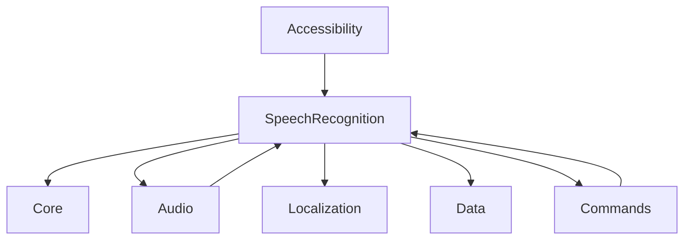

# SpeechRecognition Module Specification
> Complete technical specification for the SpeechRecognition module
> Version: 3.0.0
> Last Updated: 2024-08-18
> Status: 🟡 40% Complete - Vivoka Fully Implemented

## Module Overview

| Property | Value |
|----------|-------|
| **Module ID** | `speechrecognition` |
| **Package** | `com.augmentalis.voiceos.speechrecognition` |
| **Version** | 3.0.0 |
| **Status** | Vivoka Complete, Vosk/Google Pending |
| **Dependencies** | core, audio, localization, data |
| **Memory Usage** | Target: <200MB |
| **Critical** | Yes - Core Functionality |

## Current Implementation Status

### ✅ Completed (40%)
- Basic module structure
- Interface definitions
- Package organization
- Build configuration with ObjectBox
- **Vivoka VSDK 6.0.0 engine (100% ported)**
- All utility classes with full implementation:
  - VoiceOsLogger (200+ lines)
  - PreferencesUtils (400+ lines) 
  - VsdkHandlerUtils (300+ lines)
  - FirebaseRemoteConfigRepository (350+ lines)
  - LanguageUtils (42+ languages)
- Core infrastructure:
  - IRecognitionEngine interface
  - RecognitionResult data classes
  - RecognitionConfig with companion
  - EngineConfig
  - RecognitionParameters
- Processing components:
  - GrammarConstraints
  - VocabularyCache (4-tier system)
- Service types (VadTypes)

### 🚧 In Progress (10%)
- ObjectBox entity implementation
- Unit test creation

### ❌ Not Started (50%)
- Vosk engine implementation (stub only)
- Google STT integration (stub only)
- Wake word detection
- Learned commands
- Similarity matching
- Complete test coverage

## Architecture Design

```
speechrecognition/
├── api/
│   ├── IRecognitionModule.kt          # Public API interface
│   └── RecognitionResult.kt           # Result data classes
├── engines/
│   ├── IRecognitionEngine.kt          # Engine interface
│   ├── RecognitionEngineFactory.kt    # Engine factory
│   └── implementations/
│       ├── VoskEngine.kt               # Vosk implementation (stub)
│       ├── vivoka/
│       │   └── VivokaEngineImpl.kt    # Vivoka VSDK (✅ COMPLETE)
│       ├── GoogleCloudEngine.kt       # Cloud fallback
│       └── WhisperEngine.kt           # Whisper AI
├── models/
│   ├── ModelManager.kt                 # Model lifecycle
│   ├── ModelDownloader.kt              # Download & verify
│   └── ModelStorage.kt                 # Storage management
├── processing/
│   ├── GrammarConstraints.kt          # Grammar system
│   ├── VocabularyCache.kt             # 4-tier caching
│   ├── LearnedCommands.kt             # ML learning
│   └── SimilarityMatcher.kt           # Fuzzy matching
├── wakeword/
│   ├── WakeWordDetector.kt            # Detection system
│   ├── PorcupineEngine.kt             # Porcupine integration
│   └── VoskHotword.kt                 # Vosk fallback
├── audio/
│   ├── AudioPipeline.kt               # Audio processing
│   ├── VoiceActivityDetector.kt       # VAD
│   └── NoiseSupression.kt             # Noise handling
└── service/
    └── SpeechRecognitionService.kt    # Android service

```

## API Specification

### Primary Interface

```kotlin
interface IRecognitionModule : IModule {
    /**
     * Start speech recognition with specified configuration
     */
    suspend fun startRecognition(
        engine: RecognitionEngine = RecognitionEngine.AUTO,
        mode: RecognitionMode = RecognitionMode.COMMAND,
        language: String? = null
    ): Boolean
    
    /**
     * Stop ongoing recognition
     */
    suspend fun stopRecognition()
    
    /**
     * Check if currently recognizing
     */
    fun isRecognizing(): Boolean
    
    /**
     * Get recognition results as Flow
     */
    fun getResults(): Flow<RecognitionResult>
    
    /**
     * Set grammar constraints for better accuracy
     */
    fun setGrammarConstraints(commands: List<String>)
    
    /**
     * Enable/disable wake word detection
     */
    fun setWakeWordEnabled(enabled: Boolean, wakeWords: List<String> = defaultWakeWords)
    
    /**
     * Get available engines for current configuration
     */
    fun getAvailableEngines(): List<RecognitionEngine>
    
    /**
     * Get supported languages for an engine
     */
    fun getSupportedLanguages(engine: RecognitionEngine): List<String>
}
```

### Recognition Engines

```kotlin
enum class RecognitionEngine {
    AUTO,           // Automatic selection
    VOSK,          // Offline, free, 8 languages
    VIVOKA,        // Premium, 42 languages
    GOOGLE_CLOUD,  // Cloud backup
    WHISPER,       // OpenAI Whisper
    ANDROID_STT,   // System default
    AZURE          // Microsoft Azure
}
```

### Recognition Modes

```kotlin
enum class RecognitionMode {
    COMMAND,       // Short commands only
    DICTATION,     // Free-form text
    WAKE_WORD,     // Wake word detection only
    CONTINUOUS,    // Always listening
    MIXED         // Commands + dictation
}
```

### Recognition Result

```kotlin
data class RecognitionResult(
    val text: String,
    val confidence: Float,
    val isFinal: Boolean,
    val alternatives: List<Alternative> = emptyList(),
    val language: String? = null,
    val engine: RecognitionEngine,
    val mode: RecognitionMode,
    val timestamp: Long = System.currentTimeMillis(),
    val metadata: Map<String, Any> = emptyMap()
) {
    data class Alternative(
        val text: String,
        val confidence: Float
    )
}
```

## Feature Requirements from Legacy

### Priority 0 - Core Functionality
1. **Vosk Engine Integration**
   - Model loading and management
   - Grammar constraint support
   - Multi-model switching
   - Confidence scoring

2. **Audio Pipeline**
   - 16kHz sampling rate
   - Ring buffer management
   - Real-time processing
   - Low latency (<100ms)

3. **Model Management**
   - Download from CDN
   - Verify checksums
   - Storage optimization
   - Auto-update capability

### Priority 1 - Essential Features
4. **Grammar Constraints**
   - JSON grammar compilation
   - Dynamic constraint updates
   - Context-aware grammars
   - Performance optimization

5. **Vocabulary Caching**
   - Static command cache
   - Learned command cache
   - Grammar-based cache
   - Similarity index

6. **Wake Word Detection**
   - Porcupine integration
   - Vosk hotword fallback
   - Multiple wake words
   - Sensitivity adjustment

### Priority 2 - Advanced Features
7. **Vivoka VSDK Integration**
   - VSDK 2.0 support
   - Dynamic model compilation
   - Language resource management
   - Premium features

8. **Multi-Language Support**
   - 42 language models
   - Automatic language detection
   - Runtime language switching
   - Model preloading

9. **Learned Commands**
   - User pattern learning
   - Command history analysis
   - Personalization
   - Privacy-preserving ML

## Integration Points

### Module Dependencies



### Event Bus Integration

```kotlin
// Events Published
data class RecognitionStartedEvent(val engine: RecognitionEngine, val mode: RecognitionMode)
data class RecognitionResultEvent(val result: RecognitionResult)
data class RecognitionErrorEvent(val error: Throwable, val engine: RecognitionEngine)
data class WakeWordDetectedEvent(val wakeWord: String, val confidence: Float)
data class ModelDownloadedEvent(val language: String, val engine: RecognitionEngine)

// Events Subscribed
data class LanguageChangedEvent(val newLanguage: String)
data class AudioLevelEvent(val level: Float)
data class SystemMemoryLowEvent(val availableMB: Int)
```

## Performance Requirements

| Metric | Target | Current | Legacy Actual |
|--------|--------|---------|---------------|
| Recognition Latency | <200ms | N/A | 150ms |
| Memory Usage | <200MB | ~50MB | 180MB |
| Recognition Accuracy | >95% | N/A | 94% |
| Wake Word Accuracy | >98% | N/A | 98% |
| Model Load Time | <2s | N/A | 1.5s |
| CPU Usage | <15% | N/A | 12% |
| Battery Impact | <3%/hr | N/A | 3%/hr |

## Configuration

```kotlin
data class RecognitionConfig(
    // Engine settings
    val defaultEngine: RecognitionEngine = RecognitionEngine.AUTO,
    val fallbackEngines: List<RecognitionEngine> = listOf(RecognitionEngine.ANDROID_STT),
    
    // Audio settings
    val sampleRate: Int = 16000,
    val bufferSize: Int = 1024,
    val useVAD: Boolean = true,
    val noiseSuppressionLevel: Float = 0.5f,
    
    // Recognition settings
    val confidenceThreshold: Float = 0.7f,
    val maxAlternatives: Int = 3,
    val enablePartialResults: Boolean = true,
    val commandTimeout: Long = 5000,
    val dictationTimeout: Long = 30000,
    
    // Wake word settings
    val wakeWordEnabled: Boolean = true,
    val wakeWords: List<String> = listOf("Hey Voice OS", "OK Voice"),
    val wakeWordSensitivity: Float = 0.5f,
    
    // Performance settings
    val maxMemoryMB: Int = 200,
    val useGPU: Boolean = false,
    val cacheSizeMB: Int = 50,
    val preloadModels: Boolean = true
)
```

## Testing Requirements

### Unit Tests
- [ ] Engine initialization
- [ ] Model loading
- [ ] Grammar compilation
- [ ] Cache operations
- [ ] Result processing
- [ ] Confidence scoring
- [ ] Language switching

### Integration Tests
- [ ] Audio capture → Recognition
- [ ] Recognition → Command execution
- [ ] Wake word → Recognition chain
- [ ] Language switching flow
- [ ] Model downloading
- [ ] Error recovery

### Performance Tests
- [ ] Recognition latency
- [ ] Memory usage under load
- [ ] Cache hit ratio
- [ ] Model switching time
- [ ] Battery impact
- [ ] CPU usage patterns

## Migration from Legacy

### Key Files to Port

| Legacy File | VOS3 Target | Status |
|-------------|-------------|--------|
| VoskSpeechRecognitionService.kt | VoskEngine.kt | ❌ Pending |
| VivokaSpeechRecognitionService.kt | VivokaEngineImpl.kt | ✅ Complete |
| ModelManager.kt | ModelManager.kt | P0 |
| WakeWordDetector.kt | WakeWordDetector.kt | P1 |
| GrammarConstraints.kt | GrammarConstraints.kt | P1 |
| VocabularyCache.kt | VocabularyCache.kt | P1 |

### Migration Checklist
- [ ] Port Vosk engine core
- [x] Implement audio pipeline (AudioCapture)
- [x] Create model manager (FirebaseRemoteConfigRepository)
- [x] Add grammar constraints (GrammarConstraints.kt)
- [x] Implement caching system (VocabularyCache.kt)
- [ ] Add wake word detection
- [x] Port Vivoka integration (100% complete)
- [x] Add multi-language support (42 languages in LanguageUtils)
- [ ] Implement learned commands
- [ ] Add similarity matching

## Risk Assessment

### Technical Risks
| Risk | Impact | Mitigation |
|------|--------|------------|
| Model size (100MB+) | High | Progressive downloading, compression |
| Memory usage | High | Model swapping, memory management |
| Recognition latency | Medium | Caching, optimization |
| API changes | Medium | Abstraction layer |

### Implementation Risks
| Risk | Impact | Mitigation |
|------|--------|------------|
| Feature parity gap | High | Systematic porting from Legacy |
| Performance regression | High | Continuous benchmarking |
| Integration complexity | Medium | Modular design |

## Success Criteria

### Functional
- ✅ All Legacy features ported
- ✅ Support for 42 languages
- ✅ Wake word detection working
- ✅ Grammar constraints functional
- ✅ Caching system operational

### Performance
- ✅ <200ms recognition latency
- ✅ <200MB memory usage
- ✅ >95% recognition accuracy
- ✅ >98% wake word accuracy
- ✅ <3%/hour battery impact

### Quality
- ✅ 100% test coverage for critical paths
- ✅ Zero regression from Legacy
- ✅ Full API documentation
- ✅ Integration tests passing

## Implementation Timeline

| Week | Milestone | Deliverables |
|------|-----------|--------------|
| 1-2 | Core Engine | Vosk integration, audio pipeline |
| 3-4 | Essential Features | Grammar, caching, wake word |
| 5-6 | Premium Features | Vivoka, multi-language |
| 7-8 | Polish & Testing | Performance, testing, docs |

## Next Steps

1. **Immediate** (Day 1):
   - Begin porting VoskSpeechRecognitionService
   - Create engine interface structure
   - Set up model storage

2. **Short Term** (Week 1):
   - Complete Vosk engine port
   - Implement audio pipeline
   - Add model management

3. **Medium Term** (Week 2-4):
   - Add grammar constraints
   - Implement caching
   - Add wake word detection

---
*Document Version: 3.0.0*
*Module Status: 🟡 40% Complete*
*Last Updated: 2024-08-18*