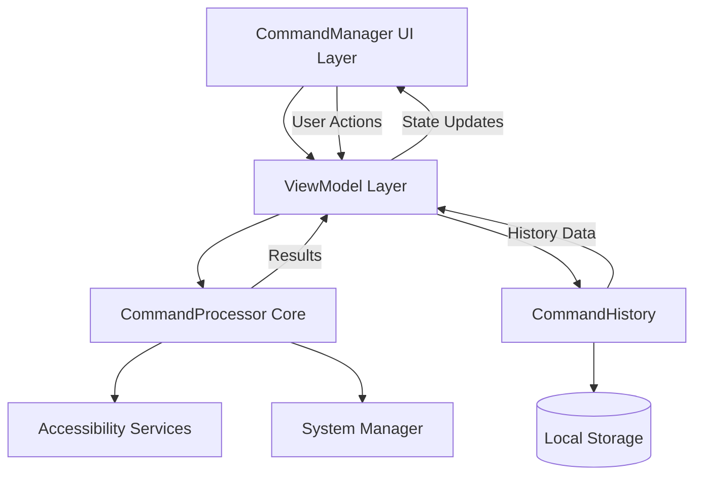

# CommandManager-Architecture-Map.md

**File:** CommandManager-Architecture-Map.md  
**Module:** CommandManager  
**Type:** Architecture Documentation  
**Version:** 1.0.0  
**Created:** 2025-01-02  
**Last Updated:** 2025-01-02  
**Author:** VOS4 Development Team  
**Status:** Production Ready  

---

## Changelog

| Version | Date | Changes | Author |
|---------|------|---------|--------|
| 1.0.0 | 2025-01-02 | Initial architecture documentation with diagrams | VOS4 Dev Team |

---

## System Architecture Overview

CommandManager implements a comprehensive command system with real-time testing, monitoring, and glassmorphism UI. The architecture follows MVVM patterns with reactive state management and zero-overhead design principles.



---

## Module Structure Architecture

### High-Level Module Organization
```
CommandManager Module
├── UI Layer (Compose)
│   ├── Activities & Composables
│   ├── ViewModels & State
│   └── Glassmorphism Styling
├── Business Logic Layer
│   ├── Command Processing
│   ├── History Management
│   └── Statistics Calculation
├── Data Layer
│   ├── Command Models
│   ├── Result Tracking
│   └── Configuration Storage
└── Integration Layer
    ├── VOS4 Core Integration
    ├── Accessibility Services
    └── System Command Bridge
```

### Detailed Component Architecture
```
┌─────────────────────────────────────────────────────────────┐
│                    PRESENTATION LAYER                       │
├─────────────────────────────────────────────────────────────┤
│  CommandManagerActivity                                     │
│  ├── @Composable CommandManagerContent()                   │
│  ├── @Composable HeaderSection()                           │
│  ├── @Composable CommandStatsCard()                        │
│  ├── @Composable QuickTestPanel()                          │
│  ├── @Composable CommandCategoriesCard()                   │
│  ├── @Composable CommandHistoryCard()                      │
│  ├── @Composable ErrorDisplay()                            │
│  └── @Composable SuccessDisplay()                          │
├─────────────────────────────────────────────────────────────┤
│  GlassmorphismUtils                                         │
│  ├── GlassMorphismConfig (data class)                      │
│  ├── DepthLevel (value class)                              │
│  ├── glassMorphism() (Modifier extension)                  │
│  ├── CommandColors (color palette)                         │
│  └── CommandGlassConfigs (pre-defined styles)              │
└─────────────────────────────────────────────────────────────┘
│
├─ViewModel Communication ─┐
│                           │
┌─────────────────────────────────────────────────────────────┐
│                    VIEWMODEL LAYER                          │
├─────────────────────────────────────────────────────────────┤
│  CommandViewModel                                           │
│  ├── State Management                                       │
│  │   ├── _commandStats: MutableLiveData<CommandStats>      │
│  │   ├── _commandHistory: MutableLiveData<List<...>>       │
│  │   ├── _isLoading: MutableLiveData<Boolean>              │
│  │   ├── _errorMessage: MutableLiveData<String?>           │
│  │   ├── _successMessage: MutableLiveData<String?>         │
│  │   └── _availableCommands: MutableLiveData<Map<...>>     │
│  ├── Business Operations                                    │
│  │   ├── testCommand(text, source)                         │
│  │   ├── startVoiceTest()                                  │
│  │   ├── refreshStats()                                    │
│  │   ├── clearHistory()                                    │
│  │   ├── showCategoryCommands(category)                    │
│  │   └── getCommandSuggestions(input)                      │
│  └── Utility Functions                                      │
│      ├── clearError()                                       │
│      ├── clearSuccess()                                     │
│      └── onCleared()                                        │
└─────────────────────────────────────────────────────────────┘
│
├─ Business Logic Communication ─┐
│                                 │
┌─────────────────────────────────────────────────────────────┐
│                   BUSINESS LOGIC LAYER                      │
├─────────────────────────────────────────────────────────────┤
│  CommandProcessor                                           │
│  ├── Command Execution Engine                              │
│  │   ├── processCommand(text, source, context)             │
│  │   ├── getAvailableCommands(context)                     │
│  │   ├── initialize()                                      │
│  │   └── shutdown()                                        │
│  ├── Pattern Matching                                       │
│  │   ├── Fuzzy matching (threshold: 0.7)                   │
│  │   ├── Multi-language support                            │
│  │   └── Context-aware matching                            │
│  └── Integration Points                                     │
│      ├── Accessibility Service bridge                       │
│      ├── System command dispatcher                          │
│      └── Error handling & logging                           │
├─────────────────────────────────────────────────────────────┤
│  CommandHistory                                             │
│  ├── History Management                                     │
│  │   ├── addCommand(entry)                                 │
│  │   ├── getRecentCommands(limit)                          │
│  │   ├── getAllCommands()                                  │
│  │   └── clearHistory()                                    │
│  ├── Statistics Engine                                      │
│  │   ├── Success/failure rate calculation                  │
│  │   ├── Average execution time tracking                    │
│  │   ├── Top commands identification                        │
│  │   └── Performance analytics                              │
│  └── Persistence Layer                                      │
│      ├── In-memory caching (20 recent commands)             │
│      ├── Performance optimization                           │
│      └── Memory management                                  │
└─────────────────────────────────────────────────────────────┘
│
├─ Data Model Communication ─┐
│                             │
┌─────────────────────────────────────────────────────────────┐
│                      DATA MODEL LAYER                       │
├─────────────────────────────────────────────────────────────┤
│  Core Data Models                                           │
│  ├── Command (id, text, source, context, params, ...)      │
│  ├── CommandResult (success, response, data, error, ...)    │
│  ├── CommandDefinition (id, name, desc, category, ...)      │
│  ├── CommandHistoryEntry (command, result, timestamp)       │
│  ├── CommandStats (total, successful, failed, avgTime, ...) │
│  ├── CommandError (code, message, details)                  │
│  ├── CommandContext (package, activity, view, state, ...)   │
│  └── CommandParameter (name, type, required, default, ...)  │
├─────────────────────────────────────────────────────────────┤
│  Enumeration Types                                          │
│  ├── CommandSource (VOICE, GESTURE, TEXT, SYSTEM, ...)      │
│  ├── CommandCategory (NAVIGATION, TEXT, MEDIA, ...)         │
│  ├── ErrorCode (MODULE_NOT_AVAILABLE, COMMAND_NOT_FOUND,...)│
│  ├── ParameterType (STRING, NUMBER, BOOLEAN, LIST, ...)     │
│  └── EventType (COMMAND_RECEIVED, EXECUTING, ...)           │
├─────────────────────────────────────────────────────────────┤
│  Type Aliases & Handlers                                    │
│  ├── CommandHandler = suspend (Command) -> CommandResult    │
│  └── Functional interface definitions                       │
└─────────────────────────────────────────────────────────────┘
│
├─ System Integration ─┐
│                       │
┌─────────────────────────────────────────────────────────────┐
│                   INTEGRATION LAYER                         │
├─────────────────────────────────────────────────────────────┤
│  VOS4 Core Integration                                      │
│  ├── Accessibility Service Bridge                          │
│  ├── System-wide Command Registration                       │
│  ├── Context Awareness Engine                              │
│  └── Permission Management                                  │
├─────────────────────────────────────────────────────────────┤
│  External System Integration                               │
│  ├── Android Accessibility Framework                       │
│  ├── System UI Controller                                  │
│  ├── Media Session Manager                                 │
│  └── Input Method Framework                                │
└─────────────────────────────────────────────────────────────┘
```

---

## Data Flow Architecture

### Command Execution Flow
```
┌─────────────┐    ┌─────────────┐    ┌─────────────┐
│   User UI   │───▶│ ViewModel   │───▶│CommandProc │
│ Action      │    │ testCommand │    │ execute     │
└─────────────┘    └─────────────┘    └─────────────┘
      ▲                    │                   │
      │                    ▼                   ▼
┌─────────────┐    ┌─────────────┐    ┌─────────────┐
│ UI Update   │◀───│ State       │◀───│ Command     │
│ Success/Err │    │ Update      │    │ Result      │
└─────────────┘    └─────────────┘    └─────────────┘
      ▲                    │                   │
      │                    ▼                   ▼
┌─────────────┐    ┌─────────────┐    ┌─────────────┐
│ History     │◀───│ History     │◀───│ Add to      │
│ Display     │    │ Updated     │    │ History     │
└─────────────┘    └─────────────┘    └─────────────┘
```

### State Management Flow
```
LiveData Observable Pattern:

CommandViewModel State:
├── commandStats: LiveData<CommandStats>
│   ├── Observers: StatsCard, SuccessRateBar
│   └── Updates: On command execution, history change
├── commandHistory: LiveData<List<CommandHistoryEntry>>
│   ├── Observers: HistoryCard, TopCommandsDisplay
│   └── Updates: On command addition, history clear
├── isLoading: LiveData<Boolean>
│   ├── Observers: TestPanel, VoiceButton
│   └── Updates: On operation start/complete
├── errorMessage: LiveData<String?>
│   ├── Observers: ErrorDisplay, Snackbar
│   └── Updates: On operation failure
├── successMessage: LiveData<String?>
│   ├── Observers: SuccessDisplay, Snackbar
│   └── Updates: On operation success
└── availableCommands: LiveData<Map<...>>
    ├── Observers: CategoriesCard, SuggestionEngine
    └── Updates: On initialization, processor change
```

### Glassmorphism Rendering Pipeline
```
┌─────────────────────────────────────────────────────────────┐
│                 GLASSMORPHISM RENDERING                     │
├─────────────────────────────────────────────────────────────┤
│  Layer 1: Background Gradient                              │
│  ├── Colors: White → Transparent → White                   │
│  ├── Opacity: backgroundOpacity * depth                    │
│  └── Shape: RoundedCornerShape(cornerRadius)               │
├─────────────────────────────────────────────────────────────┤
│  Layer 2: Tint Color Overlay                               │
│  ├── Color: Category-specific tint (e.g., Blue for NAV)    │
│  ├── Opacity: tintOpacity * depth                          │
│  └── Blend: VerticalGradient with transparency             │
├─────────────────────────────────────────────────────────────┤
│  Layer 3: Border Gradient                                  │
│  ├── Colors: White → Transparent → White * 0.5            │
│  ├── Width: borderWidth                                    │
│  ├── Opacity: borderOpacity * depth                        │
│  └── Shape: Matching rounded corners                       │
├─────────────────────────────────────────────────────────────┤
│  Layer 4: Optional Blur Effect                             │
│  ├── Radius: blurRadius (default: 0.dp)                    │
│  ├── Applied: Only if blurRadius > 0                       │
│  └── Effect: Gaussian blur filter                          │
├─────────────────────────────────────────────────────────────┤
│  Layer 5: Content Layer                                    │
│  ├── UI Elements: Text, Icons, Buttons                     │
│  ├── Contrast: Auto-adjusted for readability               │
│  └── Interaction: Touch targets and hover effects          │
└─────────────────────────────────────────────────────────────┘
```

---

## Component Interaction Diagrams

### Command Testing Interaction
```
User Input ──┐
             │
   ┌─────────▼─────────┐     ┌──────────────────┐
   │  QuickTestPanel   │────▶│ CommandViewModel │
   │  • Text Input     │     │ • testCommand()  │
   │  • Test Button    │     │ • State Updates  │
   │  • Voice Button   │     │ • Error Handling │
   └───────────────────┘     └─────────┬────────┘
             ▲                         │
             │                         ▼
   ┌─────────┴─────────┐     ┌──────────────────┐
   │  UI State Update  │◀────│ CommandProcessor │
   │  • Loading States │     │ • processCommand │
   │  • Success/Error  │     │ • Pattern Match  │
   │  • Result Display │     │ • Execute Action │
   └───────────────────┘     └─────────┬────────┘
             ▲                         │
             │                         ▼
   ┌─────────┴─────────┐     ┌──────────────────┐
   │  CommandHistory   │◀────│ CommandResult    │
   │  • Add Entry      │     │ • Success Status │
   │  • Update Stats   │     │ • Execution Time │
   │  • Refresh Views  │     │ • Error Details  │
   └───────────────────┘     └──────────────────┘
```

### Category Selection Flow
```
┌──────────────────┐    ┌──────────────────┐    ┌──────────────────┐
│ CategoryCard     │───▶│ ViewModel        │───▶│ CommandProcessor │
│ • Category Click │    │ showCategory()   │    │ filterCommands() │
└──────────────────┘    └──────────────────┘    └──────────────────┘
         ▲                        │                        │
         │                        ▼                        ▼
┌──────────────────┐    ┌──────────────────┐    ┌──────────────────┐
│ UI Update        │◀───│ Success Message  │◀───│ Filtered Results │
│ • Category Info  │    │ • Command Count  │    │ • Category Match │
│ • Command List   │    │ • Category Name  │    │ • Command Defs   │
└──────────────────┘    └──────────────────┘    └──────────────────┘
```

### History Management Flow
```
┌──────────────────┐    ┌──────────────────┐    ┌──────────────────┐
│ HistoryCard      │───▶│ ViewModel        │───▶│ CommandHistory   │
│ • Clear Button   │    │ clearHistory()   │    │ clearHistory()   │
└──────────────────┘    └──────────────────┘    └──────────────────┘
         ▲                        │                        │
         │                        ▼                        ▼
┌──────────────────┐    ┌──────────────────┐    ┌──────────────────┐
│ Empty History    │◀───│ UI State Update  │◀───│ Empty List       │
│ • No Items       │    │ • Success Msg    │    │ • Reset Stats    │
│ • Empty Message  │    │ • Refresh Stats  │    │ • Clear Storage  │
└──────────────────┘    └──────────────────┘    └──────────────────┘
```

---

## Testing Architecture

### Test Pyramid Structure
```
┌─────────────────────────────────────────────────────────────┐
│                    UI INTEGRATION TESTS                     │
│                          (12 Tests)                        │
├─────────────────────────────────────────────────────────────┤
│  CommandManagerUITest                                       │
│  ├── Activity Launch & Layout Tests                        │
│  ├── Component Interaction Tests                           │
│  ├── Visual State Tests (Loading, Error, Success)          │
│  ├── User Flow Tests (Command Execution)                   │
│  └── Accessibility & Styling Tests                         │
└─────────────────────────────────────────────────────────────┘
                                │
┌─────────────────────────────────────────────────────────────┐
│                      UNIT TESTS                            │
│                         (12 Tests)                         │
├─────────────────────────────────────────────────────────────┤
│  CommandViewModelTest                                       │
│  ├── State Management Tests                                │
│  ├── Business Logic Tests                                  │
│  ├── Data Processing Tests                                 │
│  ├── Error Handling Tests                                  │
│  └── Lifecycle Tests                                       │
└─────────────────────────────────────────────────────────────┘
                                │
┌─────────────────────────────────────────────────────────────┐
│                   COMPONENT TESTS                           │
│                    (Implicit Coverage)                     │
├─────────────────────────────────────────────────────────────┤
│  GlassmorphismUtils Tests (via UI tests)                   │
│  ├── Visual Effect Rendering                               │
│  ├── Color System Validation                               │
│  ├── Configuration Testing                                 │
│  └── Performance Testing                                   │
└─────────────────────────────────────────────────────────────┘
```

### Test Coverage Matrix
```
Component               | Unit Tests | UI Tests | Integration
─────────────────────── | ────────── | ──────── | ───────────
CommandViewModel        |     ✓      |    ✓     |      ✓
CommandManagerActivity  |     -      |    ✓     |      ✓
GlassmorphismUtils     |     -      |    ✓     |      ✓
CommandProcessor       |     ✓      |    -     |      ✓
CommandHistory         |     ✓      |    -     |      ✓
Command Models         |     ✓      |    ✓     |      ✓
Error Handling         |     ✓      |    ✓     |      ✓
State Management       |     ✓      |    ✓     |      ✓
User Interactions      |     -      |    ✓     |      ✓
Visual Components      |     -      |    ✓     |      -
```

---

## Memory and Performance Architecture

### Memory Management Strategy
```
┌─────────────────────────────────────────────────────────────┐
│                    MEMORY OPTIMIZATION                      │
├─────────────────────────────────────────────────────────────┤
│  ViewModel Scope                                            │
│  ├── Coroutines: Lifecycle-aware (viewModelScope)          │
│  ├── LiveData: Automatic cleanup on destroy                │
│  ├── Observers: Removed on lifecycle end                   │
│  └── Resources: Released in onCleared()                    │
├─────────────────────────────────────────────────────────────┤
│  History Management                                         │
│  ├── Recent Commands: Limited to 20 entries                │
│  ├── Memory Cache: In-memory with size bounds              │
│  ├── Auto-cleanup: Old entries automatically removed       │
│  └── GC Friendly: No circular references                   │
├─────────────────────────────────────────────────────────────┤
│  UI State Optimization                                      │
│  ├── Lazy Loading: LazyColumn/LazyVerticalGrid             │
│  ├── State Hoisting: Minimal state in composables          │
│  ├── Recomposition: Optimized with stable parameters       │
│  └── Resource Cleanup: Automatic disposal of observers     │
└─────────────────────────────────────────────────────────────┘
```

### Performance Characteristics
```
Operation Type          | Expected Time | Memory Impact | CPU Usage
──────────────────────  | ──────────── | ──────────── | ─────────
UI Rendering            |     < 16ms   |     Low      |   Low
Command Execution       |     < 100ms  |     Low      |   Medium
History Refresh         |     < 50ms   |     Low      |   Low
Stats Calculation       |     < 20ms   |     Low      |   Low
Category Loading        |     < 30ms   |     Low      |   Low
Glassmorphism Render    |     < 5ms    |     Low      |   Medium
Voice Test Simulation   |     2000ms   |     Low      |   Low
Error/Success Display   |     < 10ms   |     Low      |   Low
```

---

## Security Architecture

### Command Execution Security
```
┌─────────────────────────────────────────────────────────────┐
│                    SECURITY LAYERS                          │
├─────────────────────────────────────────────────────────────┤
│  Input Validation                                           │
│  ├── Command Text Sanitization                             │
│  ├── Parameter Type Validation                             │
│  ├── Pattern Matching Verification                         │
│  └── Injection Attack Prevention                           │
├─────────────────────────────────────────────────────────────┤
│  Permission Checking                                        │
│  ├── Required Permissions Validation                       │
│  ├── Accessibility Service Availability                    │
│  ├── System Command Authorization                          │
│  └── Context-based Access Control                          │
├─────────────────────────────────────────────────────────────┤
│  Execution Isolation                                        │
│  ├── Command Processor Sandboxing                          │
│  ├── Error Boundary Implementation                         │
│  ├── Resource Limit Enforcement                            │
│  └── Timeout Protection                                    │
├─────────────────────────────────────────────────────────────┤
│  Data Protection                                            │
│  ├── History Data Anonymization                            │
│  ├── Sensitive Information Filtering                       │
│  ├── Local Storage Encryption                              │
│  └── Memory Scrubbing on Cleanup                           │
└─────────────────────────────────────────────────────────────┘
```

---

## Integration Architecture

### VOS4 Core Integration Points
```
┌─────────────────────────────────────────────────────────────┐
│                  VOS4 CORE INTEGRATION                      │
├─────────────────────────────────────────────────────────────┤
│  Accessibility Service Bridge                              │
│  ├── Service Connection Management                         │
│  ├── Action Execution Delegation                           │
│  ├── State Synchronization                                 │
│  └── Event Propagation                                     │
├─────────────────────────────────────────────────────────────┤
│  Command Registration System                               │
│  ├── System-wide Command Publishing                        │
│  ├── Category-based Organization                           │
│  ├── Dynamic Command Discovery                             │
│  └── Conflict Resolution                                   │
├─────────────────────────────────────────────────────────────┤
│  Context Awareness Engine                                  │
│  ├── Current App Detection                                 │
│  ├── UI State Analysis                                     │
│  ├── User Intent Recognition                               │
│  └── Contextual Command Filtering                          │
├─────────────────────────────────────────────────────────────┤
│  Event Bus Integration                                      │
│  ├── Command Execution Events                              │
│  ├── System State Changes                                  │
│  ├── Error Reporting                                       │
│  └── Performance Metrics                                   │
└─────────────────────────────────────────────────────────────┘
```

### External System Integration
```
Android Framework
├── AccessibilityService
│   ├── Node Tree Access
│   ├── Action Execution
│   └── Event Monitoring
├── MediaSessionManager
│   ├── Media Control Commands
│   ├── Volume Management
│   └── Playback Control
├── WindowManager
│   ├── Screen Navigation
│   ├── Window State
│   └── Display Management
└── InputMethodManager
    ├── Text Input Control
    ├── Keyboard Management
    └── IME Integration

VOS4 Modules
├── DeviceManager
│   ├── Hardware Control
│   ├── Sensor Access
│   └── Device State
├── LocalizationManager
│   ├── Multi-language Support
│   ├── Command Translation
│   └── Locale-aware Processing
└── HUDManager
    ├── Visual Feedback
    ├── Overlay Display
    └── Status Indication
```

---

## Deployment Architecture

### Build and Distribution
```
┌─────────────────────────────────────────────────────────────┐
│                   BUILD PIPELINE                            │
├─────────────────────────────────────────────────────────────┤
│  Source Code (2,247 lines)                                 │
│  ├── Kotlin Files (1,550 lines)                            │
│  ├── Test Files (500 lines)                                │
│  └── Documentation (197 lines)                             │
├─────────────────────────────────────────────────────────────┤
│  Gradle Build Process                                       │
│  ├── Kotlin 2.0 Compilation                                │
│  ├── Compose Compiler Integration                           │
│  ├── Resource Processing                                    │
│  └── Test Execution                                         │
├─────────────────────────────────────────────────────────────┤
│  Output Artifacts                                           │
│  ├── AAR Library (~200KB)                                  │
│  ├── Test Results (24/24 pass)                             │
│  ├── Documentation Package                                 │
│  └── Dependency Manifest                                   │
└─────────────────────────────────────────────────────────────┘
```

### Runtime Architecture
```
Application Process
├── CommandManager Module
│   ├── UI Components (Compose Runtime)
│   ├── ViewModel (Lifecycle-aware)
│   ├── Business Logic (Coroutines)
│   └── Data Layer (In-memory)
├── VOS4 Core Services
│   ├── Accessibility Service (System)
│   ├── Command Processor (Background)
│   └── System Integration (Framework)
└── Android Framework
    ├── Activity Manager
    ├── Window Manager
    └── Input System
```

---

*This architecture map provides comprehensive technical documentation for CommandManager implementation, covering all aspects from high-level design to detailed component interactions and integration patterns.*