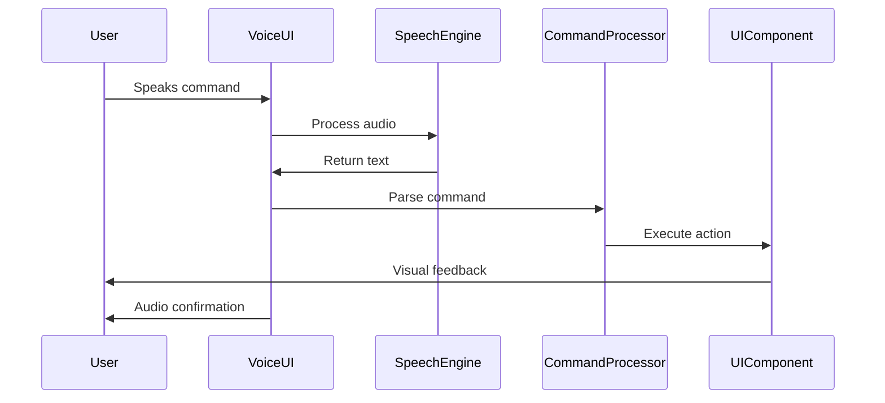

# VoiceUI Module Architecture
*Last Updated: 2025-08-31*

## Overview
VoiceUI is a comprehensive voice-enabled UI framework for Android that provides voice interaction capabilities to any Android app through a unified API.

## Architecture Diagram

```
┌─────────────────────────────────────────────────────────────┐
│                        VoiceUI Module                        │
├─────────────────────────────────────────────────────────────┤
│                                                              │
│  ┌──────────────────────────────────────────────────────┐  │
│  │                    API Layer                          │  │
│  ├──────────────────────────────────────────────────────┤  │
│  │ • SimplifiedAPI.kt    - Ultra-simple voice API       │  │
│  │ • VoiceScreen.kt      - Screen-level DSL             │  │
│  │ • VoiceScreenScope.kt - DSL scope implementation     │  │
│  │ • AIContext.kt        - AI context management        │  │
│  └──────────────────────────────────────────────────────┘  │
│                             ↓                               │
│  ┌──────────────────────────────────────────────────────┐  │
│  │                 Components Layer                      │  │
│  ├──────────────────────────────────────────────────────┤  │
│  │ • VoiceUIButton.kt    - Voice-enabled button         │  │
│  │ • VoiceUITextField.kt - Voice input field            │  │
│  │ • VoiceUIText.kt      - Voice-announced text         │  │
│  │ • VoiceScreenDSL.kt   - DSL for screen building      │  │
│  └──────────────────────────────────────────────────────┘  │
│                             ↓                               │
│  ┌──────────────────────────────────────────────────────┐  │
│  │                  Designer Layer                       │  │
│  ├──────────────────────────────────────────────────────┤  │
│  │ • VoiceUIDesigner.kt  - Visual design system         │  │
│  │ • ElementAnimation.kt - Animation framework          │  │
│  │ • AdaptiveVoiceUI.kt  - Device adaptation            │  │
│  └──────────────────────────────────────────────────────┘  │
│                             ↓                               │
│  ┌──────────────────────────────────────────────────────┐  │
│  │                  Android Layer                        │  │
│  ├──────────────────────────────────────────────────────┤  │
│  │ • AndroidThemeSelector.kt - Theme selection UI       │  │
│  │ • AndroidThemeSystem.kt    - Theme implementation    │  │
│  │ • FontManager.kt           - Font management         │  │
│  └──────────────────────────────────────────────────────┘  │
│                             ↓                               │
│  ┌──────────────────────────────────────────────────────┐  │
│  │                  Theming Layer                        │  │
│  ├──────────────────────────────────────────────────────┤  │
│  │ • ThemeIntegrationPipeline.kt - Theme pipeline       │  │
│  │ • CustomTheme.kt              - Custom theming       │  │
│  └──────────────────────────────────────────────────────┘  │
│                                                              │
└─────────────────────────────────────────────────────────────┘
                              ↓
┌─────────────────────────────────────────────────────────────┐
│                    External Dependencies                     │
├─────────────────────────────────────────────────────────────┤
│ • CommandManager     - Voice command processing              │
│ • UUIDCreator        - Unique identifier management          │
│ • DeviceManager      - Device profile detection              │
│ • SpeechRecognition  - Speech-to-text engines                │
└─────────────────────────────────────────────────────────────┘
```

## Component Flow Diagram

```
User Voice Input
       ↓
┌──────────────┐
│Speech Engine │ (Vosk/Vivoka/Google)
└──────────────┘
       ↓
┌──────────────┐
│Voice Command │
│  Processor   │
└──────────────┘
       ↓
┌──────────────┐
│ VoiceUI API  │
└──────────────┘
       ↓
┌──────────────┐
│  UI Update   │
└──────────────┘
       ↓
User Sees Result
```

## Data Flow Sequence



## Class Hierarchy

```
VoiceUIModule
├── API Layer
│   ├── SimplifiedAPI
│   │   ├── VoiceButton()
│   │   ├── VoiceInput()
│   │   └── VoiceText()
│   ├── VoiceScreen
│   │   └── VoiceScreenScope
│   └── AIContext
│       ├── ScreenContext
│       └── AccessibilityContext
├── Components
│   ├── VoiceUIButton
│   ├── VoiceUITextField
│   ├── VoiceUIText
│   └── VoiceScreenDSL
├── Designer
│   ├── VoiceUIElement
│   ├── ElementAnimation
│   └── DeviceProfile
└── Theming
    ├── CustomTheme
    └── ThemeIntegrationPipeline
```

## Key Design Patterns

### 1. DSL Pattern
- Simplified API for voice UI creation
- Kotlin DSL for intuitive screen building
- Auto-generation of voice commands

### 2. Builder Pattern
- CustomThemeBuilder for theme creation
- VoiceScreenScope for screen composition
- Fluent interface design

### 3. Strategy Pattern
- Multiple speech engines (Vosk, Vivoka, Google)
- Pluggable animation systems
- Device-specific adaptations

### 4. Observer Pattern
- Voice command listeners
- State change notifications
- Real-time UI updates

## Module Interfaces

### Public API
```kotlin
// Simple voice button
VoiceButton("Login") { performLogin() }

// Voice input field
VoiceInput("Email") { email = it }

// Voice screen DSL
VoiceScreen("login") {
    text("Welcome")
    input("email")
    password()
    button("Login")
}
```

### Internal API
```kotlin
// Element creation
VoiceUIElement(
    type = ElementType.BUTTON,
    name = "Login"
)

// Theme application
ThemeIntegrationPipeline.applyTheme(element, theme)

// Device adaptation
AdaptiveVoiceUI.adaptForDevice(element, deviceProfile)
```

## Current Status (2025-08-31)

### Completed
- ✅ Core component structure
- ✅ Basic API implementation
- ✅ Theme system framework
- ✅ Device adaptation logic
- ✅ 75% compilation fixes

### In Progress
- 🔧 Simplified package implementation
- 🔧 Animation system integration
- 🔧 Final compilation fixes

### TODO
- ⏳ Integration testing
- ⏳ Demo app creation
- ⏳ Performance optimization
- ⏳ Documentation completion

## Performance Considerations

### Memory Usage
- Lazy loading of components
- Efficient state management
- Minimal object allocation

### CPU Usage
- Optimized voice processing
- Cached command recognition
- Efficient UI updates

### Battery Impact
- Smart voice activation
- Power-aware processing
- Minimal background activity

## Security Considerations

### Voice Privacy
- No voice data stored
- Local processing preferred
- Encrypted command transmission

### UI Security
- No passwords in voice
- Secure input masking
- Permission-based access

## Future Enhancements

### Version 2.0
- Multi-language support
- Custom voice training
- Advanced gestures

### Version 3.0
- AR/VR integration
- Cross-platform support
- Cloud synchronization

## Dependencies Graph

```
VoiceUI
├── androidx.compose.* (UI framework)
├── CommandManager (command processing)
├── UUIDCreator (identifier management)
├── DeviceManager (device detection)
└── SpeechRecognition (STT engines)
    ├── Vosk (offline)
    ├── Vivoka (hybrid)
    └── Google (online)
```