# IMU System Architecture Diagram

## System Overview

## Data Processing Pipeline

```mermaid
flowchart LR
    %% Raw Data Input
    RAW[Raw Sensor Data<br/>120Hz Sample Rate]
    
    %% Processing Stages
    PRIORITY[Sensor Priority<br/>Selection]
    FUSION[Sensor Fusion<br/>α=0.98 Filter]
    KALMAN[Kalman Filter<br/>Noise Reduction]
    BIAS[Bias Compensation<br/>Drift Correction]
    PREDICT[Motion Prediction<br/>16ms Lookahead]
    CLASSIFY[Movement Classification<br/>GENTLE/RAPID/JITTER]
    ADAPTIVE[Adaptive Filtering<br/>Dynamic Smoothing]
    CALIB[User Calibration<br/>Personalization]
    
    %% Output
    OUTPUT[Position/Orientation<br/>Output to Apps]

    %% Flow
    RAW --> PRIORITY
    PRIORITY --> FUSION
    FUSION --> KALMAN
    KALMAN --> BIAS
    BIAS --> PREDICT
    PREDICT --> CLASSIFY
    CLASSIFY --> ADAPTIVE
    ADAPTIVE --> CALIB
    CALIB --> OUTPUT

    %% Styling
    classDef input fill:#ffebee,stroke:#c62828,stroke-width:2px
    classDef process fill:#e3f2fd,stroke:#1565c0,stroke-width:2px
    classDef output fill:#e8f5e8,stroke:#2e7d32,stroke-width:2px

    class RAW input
    class PRIORITY,FUSION,KALMAN,BIAS,PREDICT,CLASSIFY,ADAPTIVE,CALIB process
    class OUTPUT output
```

## Multi-Consumer Architecture

## Sensor Priority and Fallback Strategy

```mermaid
flowchart TD
    START[IMU System Initialization]
    
    %% Priority 1
    CHECK_GAME[Check for<br/>TYPE_GAME_ROTATION_VECTOR<br/>🎯 XR Optimized]
    GAME_AVAILABLE{Available?}
    USE_GAME[✅ Use Game Rotation Vector<br/>Best for XR/AR]
    
    %% Priority 2
    CHECK_ROT[Check for<br/>TYPE_ROTATION_VECTOR<br/>🔄 Standard Fusion]
    ROT_AVAILABLE{Available?}
    USE_ROT[✅ Use Rotation Vector<br/>Good General Purpose]
    
    %% Priority 3 (Fallback)
    CHECK_ORIENT[Check for<br/>TYPE_ORIENTATION<br/>⚠️ Deprecated]
    ORIENT_AVAILABLE{Available?}
    USE_ORIENT[⚠️ Use Orientation<br/>Legacy Compatibility]
    
    %% Failure State
    NO_SENSORS[❌ No Compatible Sensors<br/>Disable IMU Features]
    
    %% Final States
    INIT_FUSION[Initialize Sensor Fusion<br/>Based on Selected Sensor]
    START_TRACKING[🚀 Begin IMU Tracking]

    %% Flow
    START --> CHECK_GAME
    CHECK_GAME --> GAME_AVAILABLE
    GAME_AVAILABLE -->|Yes| USE_GAME
    GAME_AVAILABLE -->|No| CHECK_ROT
    
    CHECK_ROT --> ROT_AVAILABLE
    ROT_AVAILABLE -->|Yes| USE_ROT
    ROT_AVAILABLE -->|No| CHECK_ORIENT
    
    CHECK_ORIENT --> ORIENT_AVAILABLE
    ORIENT_AVAILABLE -->|Yes| USE_ORIENT
    ORIENT_AVAILABLE -->|No| NO_SENSORS
    
    USE_GAME --> INIT_FUSION
    USE_ROT --> INIT_FUSION
    USE_ORIENT --> INIT_FUSION
    INIT_FUSION --> START_TRACKING

    %% Styling
    classDef start fill:#e1f5fe,stroke:#01579b,stroke-width:2px
    classDef check fill:#fff3e0,stroke:#e65100,stroke-width:2px
    classDef decision fill:#f3e5f5,stroke:#4a148c,stroke-width:2px
    classDef success fill:#e8f5e8,stroke:#2e7d32,stroke-width:2px
    classDef warning fill:#fff8e1,stroke:#f57f17,stroke-width:2px
    classDef error fill:#ffebee,stroke:#c62828,stroke-width:2px

    class START,INIT_FUSION,START_TRACKING start
    class CHECK_GAME,CHECK_ROT,CHECK_ORIENT check
    class GAME_AVAILABLE,ROT_AVAILABLE,ORIENT_AVAILABLE decision
    class USE_GAME,USE_ROT success
    class USE_ORIENT warning
    class NO_SENSORS error
```

## Component Responsibilities

| Component | Primary Responsibility | Key Features |
|-----------|----------------------|--------------|
| **IMUManager** | Centralized sensor management | Singleton pattern, multi-consumer support, lifecycle management |
| **EnhancedSensorFusion** | Data fusion and filtering | Complementary filter (α=0.98), Kalman smoothing, bias compensation |
| **MotionPredictor** | Latency compensation | 16ms prediction, movement classification, adaptive filtering |
| **CalibrationManager** | User personalization | Neutral position calibration, sensitivity adjustment, range detection |
| **IMUMathUtils** | Mathematical operations | Quaternion math, Vector3 operations, SLERP interpolation |
| **CursorIMUAdapter** | Application interface | Simple API, Flow-based updates, legacy compatibility |

## Performance Characteristics

### Sensor Sampling Rates
- **Game Rotation Vector**: Up to 200Hz (XR optimized)
- **Rotation Vector**: Up to 100Hz (standard rate)
- **Orientation**: Up to 60Hz (legacy fallback)

### Processing Pipeline Latency
- **Sensor to Fusion**: <2ms
- **Fusion to Prediction**: <3ms  
- **Prediction to Output**: <1ms
- **Total Latency**: <6ms (target <10ms)

### Memory Usage
- **Base IMU System**: ~8MB
- **Per Consumer**: ~1MB additional
- **Sensor Buffers**: ~512KB total

---

*This architecture provides centralized, efficient, and scalable IMU data management for all VOS4 applications while maintaining optimal performance and user experience.*