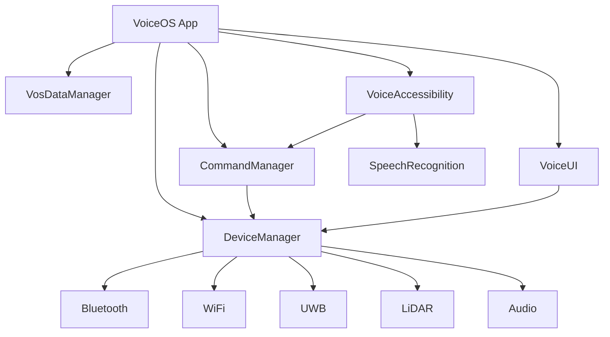

# VOS4 Master Developer Reference
## Complete System Architecture & Implementation Guide
**Version**: 4.0.0  
**Last Updated**: 2025-01-30  
**Authors**: Manoj Jhawar, VOS4 Development Team

---

## Table of Contents

1. [System Overview](#system-overview)
2. [Architecture Principles](#architecture-principles)
3. [Application Structure](#application-structure)
4. [Core Modules](#core-modules)
5. [Device Management](#device-management)
6. [Speech Recognition](#speech-recognition)
7. [Command System](#command-system)
8. [Data Management](#data-management)
9. [Voice UI System](#voice-ui-system)
10. [Accessibility Services](#accessibility-services)
11. [Implementation Patterns](#implementation-patterns)
12. [Module Communication](#module-communication)
13. [Performance Guidelines](#performance-guidelines)
14. [Testing & Debugging](#testing-debugging)

---

## System Overview

VOS4 (Voice Operating System 4) is a comprehensive Android voice control system built with zero-overhead architecture principles. The system provides complete device control through natural voice commands without unnecessary abstraction layers.

### Key Features
- **Direct Implementation**: No interfaces, no wrappers, minimal overhead
- **Unified Device Management**: Single source for all hardware capabilities
- **Multi-Engine Speech Recognition**: Support for offline and online engines
- **Comprehensive Command System**: 500+ built-in commands
- **Accessibility Integration**: Deep Android accessibility service integration

### System Requirements
- **Minimum Android**: API 28 (Android 9.0)
- **Target Android**: API 34 (Android 14)
- **Memory**: 15MB idle, 50MB active
- **CPU**: <2% idle, <10% active

---

## Architecture Principles

### 1. Zero Overhead Architecture
```kotlin
// ❌ AVOID: Unnecessary abstractions
interface DeviceManager {
    fun initialize()
}
class DeviceManagerImpl : DeviceManager { }

// ✅ PREFER: Direct implementation
class DeviceManager(context: Context) {
    fun initialize() { }
}
```

### 2. Direct Access Pattern
```kotlin
// ❌ AVOID: CoreManager pattern
class CoreManager {
    fun getDeviceManager(): DeviceManager
}

// ✅ PREFER: Direct module access
class VoiceOS : Application() {
    lateinit var deviceManager: DeviceManager
}
```

### 3. Functional Types Over Interfaces
```kotlin
// ❌ AVOID: Interface callbacks
interface OnResultListener {
    fun onResult(result: String)
}

// ✅ PREFER: Functional types
typealias OnResultListener = (result: String) -> Unit
```

### 4. Single Source of Truth
```kotlin
// Each module is the single source for its domain
DeviceManager.getInstance(context) // Singleton for device operations
CommandManager.getInstance(context) // Singleton for commands
```

---

## Application Structure

### Main Application Class
```kotlin
// Path: app/src/main/java/com/augmentalis/voiceos/VoiceOS.kt
class VoiceOS : Application() {
    companion object {
        @Volatile
        private var instance: VoiceOS? = null
        
        @JvmStatic
        fun getInstance(): VoiceOS? = instance
    }
    
    // Direct module access - no wrappers
    lateinit var deviceManager: DeviceManager
    lateinit var dataManager: DatabaseModule
    lateinit var speechConfig: SpeechConfig  // Direct config, not a module
    lateinit var commandManager: CommandManager
    lateinit var voiceUI: VoiceUIModule
    
    override fun onCreate() {
        super.onCreate()
        instance = this
        initializeModules()
    }
    
    private fun initializeModules() {
        deviceManager = DeviceManager.getInstance(this)
        dataManager = DatabaseModule(this)
        speechConfig = SpeechConfig(
            language = "en-US",
            mode = SpeechMode.DYNAMIC_COMMAND
        )
        commandManager = CommandManager.getInstance(this)
        voiceUI = VoiceUIModule.getInstance(this)
    }
}
```

### Module Access Pattern
```kotlin
// In any Activity, Fragment, or Service
val app = application as VoiceOS

// Direct usage
app.deviceManager.bluetooth.startScanning()
app.commandManager.execute("open settings")
app.voiceUI.showOverlay()
```

---

## Core Modules

### Module Structure
```
VOS4/
├── app/                           # Main application
├── apps/                          # Standalone apps
│   ├── VoiceAccessibility/       # Accessibility service
│   ├── VoiceUI/                  # UI components
│   └── VoiceCursor/              # Cursor control
├── libraries/                     # Shared libraries
│   ├── DeviceManager/            # Unified device management
│   ├── SpeechRecognition/        # Speech engines
│   └── VoiceUIElements/          # UI elements
└── managers/                      # System managers
    ├── CommandManager/           # Command processing
    ├── VosDataManager/           # Data persistence
    └── LocalizationManager/      # Localization
```

---

## Device Management

### DeviceManager - Unified Hardware Control
```kotlin
// Path: libraries/DeviceManager/src/main/java/com/augmentalis/devicemanager/DeviceManager.kt
class DeviceManager(private val context: Context) : DefaultLifecycleObserver {
    companion object {
        @Volatile
        private var instance: DeviceManager? = null
        
        @JvmStatic
        fun getInstance(context: Context): DeviceManager {
            return instance ?: synchronized(this) {
                instance ?: DeviceManager(context).also { instance = it }
            }
        }
    }
    
    // Direct access to sub-managers
    val info: DeviceInfo by lazy { DeviceInfo(context) }
    val display: DisplayOverlayManager by lazy { DisplayOverlayManager(context) }
    val glasses: GlassesManager by lazy { GlassesManager(context) }
    val xr: XRManager by lazy { XRManager(context) }
    val video: VideoManager by lazy { VideoManager(context) }
    
    // Network managers
    val bluetooth: BluetoothManager by lazy { BluetoothManager(context) }
    val wifi: WiFiManager by lazy { WiFiManager(context) }
    val uwb: UwbManager by lazy { UwbManager(context) }
    
    // Sensor managers
    val lidar: LidarManager by lazy { LidarManager(context) }
    val biometric: BiometricManager by lazy { BiometricManager(context) }
    
    // Audio control
    val audio: AudioDeviceManager by lazy { AudioDeviceManager(context) }
    val audioEnhanced: AudioDeviceManagerEnhanced by lazy { AudioDeviceManagerEnhanced(context) }
    val audioSession: AudioSessionManager by lazy { AudioSessionManager(context) }
    val audioCapture: AudioCapture by lazy { AudioCapture(context) }
    
    // Device detection
    val deviceDetection: DeviceDetection by lazy { DeviceDetection(context) }
}
```

### Bluetooth Manager
```kotlin
class BluetoothManager(context: Context) {
    // State management
    val bluetoothState: StateFlow<BluetoothState>
    val discoveredDevices: StateFlow<List<BluetoothDevice>>
    val connectedDevices: StateFlow<List<BluetoothDevice>>
    
    // Scanning
    fun startScanning()
    fun stopScanning()
    fun startLEScanning(filters: List<ScanFilter> = emptyList())
    
    // Connection
    fun connect(device: BluetoothDevice): Boolean
    fun disconnect(device: BluetoothDevice)
    fun pair(device: BluetoothDevice)
    
    // LE Features
    fun startAdvertising(data: AdvertiseData)
    fun createGattServer()
    
    // Mesh Support
    fun joinMesh(networkKey: String)
    fun sendMeshMessage(message: ByteArray)
}
```

### WiFi Manager
```kotlin
class WiFiManager(context: Context) {
    val wifiState: StateFlow<WifiState>
    val availableNetworks: StateFlow<List<WifiNetwork>>
    
    // Network operations
    fun startScan()
    fun connect(network: WifiNetwork, password: String? = null)
    fun disconnect()
    
    // WiFi 6E/7 features
    fun enable6GHzBand()
    fun getMloCapabilities(): MloCapabilities?
    
    // WiFi Direct
    fun startP2pDiscovery()
    fun createGroup()
    
    // WiFi Aware
    fun publishService(serviceName: String)
    fun subscribeToService(serviceName: String)
    
    // WiFi RTT
    fun startRanging(accessPoints: List<ScanResult>)
}
```

### UWB Manager
```kotlin
class UwbManager(context: Context) {
    val uwbState: StateFlow<UwbState>
    val rangingSessions: StateFlow<List<RangingSession>>
    
    // Discovery
    fun startDiscovery()
    fun stopDiscovery()
    
    // Ranging
    fun startRanging(params: RangingParams): RangingSession
    fun stopRanging(sessionId: String)
    
    // Positioning
    fun getDistance(device: UwbDevice): Float
    fun getAngle(device: UwbDevice): AngleInfo
    fun track3DPosition(device: UwbDevice): Flow<Position3D>
}
```

### LiDAR Manager
```kotlin
class LidarManager(context: Context) {
    val lidarState: StateFlow<LidarState>
    
    // Scanning
    fun startScanning()
    fun stopScanning()
    
    // Data acquisition
    fun getDepthMap(): DepthMap
    fun getPointCloud(): PointCloud
    fun get3DMesh(): Mesh3D
    
    // Processing
    fun detectObjects(): List<DetectedObject>
    fun measureDistance(point: Point): Float
    fun scanRoom(): RoomScan
}
```

---

## Speech Recognition

### Configuration-Based System
```kotlin
// Path: libraries/SpeechRecognition/src/main/java/com/augmentalis/speechrecognition/SpeechConfiguration.kt

data class SpeechConfig(
    val language: String = "en-US",
    val mode: SpeechMode = SpeechMode.DYNAMIC_COMMAND,
    val enableVAD: Boolean = true,
    val confidenceThreshold: Float = 0.7f,
    val maxRecordingDuration: Long = 30000,
    val timeoutDuration: Long = 5000,
    val dictationTimeout: Long = 2000,
    val voiceTimeoutMinutes: Long = 5,
    val enableProfanityFilter: Boolean = false,
    val staticCommandsPath: String = "static_commands/",
    val voiceEnabled: Boolean = true
)

enum class SpeechEngine {
    VOSK,           // Offline, multiple languages
    VIVOKA,         // Hybrid offline/online
    ANDROID_STT,    // Native Android
    GOOGLE_CLOUD,   // Cloud-based
    WHISPER        // OpenAI Whisper
}

enum class SpeechMode {
    STATIC_COMMAND,   // Predefined commands only
    DYNAMIC_COMMAND,  // UI-based commands
    DICTATION,       // Continuous speech
    FREE_SPEECH,     // Unrestricted
    HYBRID          // Auto-switching
}
```

### Speech Engine Usage
```kotlin
// Direct engine usage in services
class VoiceAccessibilityService : AccessibilityService() {
    private val speechConfig = SpeechConfig(
        mode = SpeechMode.DYNAMIC_COMMAND,
        engine = SpeechEngine.VOSK
    )
    
    private val voskEngine = VoskEngine(context, speechConfig)
    
    fun startListening() {
        voskEngine.startRecognition { result ->
            processCommand(result.text)
        }
    }
}
```

---

## Command System

### CommandManager
```kotlin
// Path: managers/CommandManager/src/main/java/com/augmentalis/commandmanager/CommandManager.kt
class CommandManager(context: Context) {
    companion object {
        @Volatile
        private var instance: CommandManager? = null
        
        @JvmStatic
        fun getInstance(context: Context): CommandManager {
            return instance ?: synchronized(this) {
                instance ?: CommandManager(context).also { instance = it }
            }
        }
    }
    
    // Direct action execution
    fun execute(command: String): ActionResult {
        return when {
            command.startsWith("open") -> AppActions.openApp(command)
            command.startsWith("scroll") -> ScrollActions.scroll(command)
            command.startsWith("click") -> CursorActions.click(command)
            else -> ActionResult.failure("Unknown command")
        }
    }
    
    // Batch execution
    fun executeBatch(commands: List<String>): List<ActionResult>
    
    // Command validation
    fun validate(command: String): ValidationResult
    fun getSuggestions(partial: String): List<String>
}
```

### Action Categories
```kotlin
// All actions use direct implementation
object NavigationActions {
    fun goBack(): ActionResult = performGlobalAction(GLOBAL_ACTION_BACK)
    fun goHome(): ActionResult = performGlobalAction(GLOBAL_ACTION_HOME)
    fun openRecents(): ActionResult = performGlobalAction(GLOBAL_ACTION_RECENTS)
}

object AppActions {
    fun openApp(packageName: String): ActionResult {
        val intent = context.packageManager.getLaunchIntentForPackage(packageName)
        return if (intent != null) {
            context.startActivity(intent)
            ActionResult.success()
        } else {
            ActionResult.failure("App not found")
        }
    }
}

object ScrollActions {
    fun scrollUp(pixels: Int = 500): ActionResult
    fun scrollDown(pixels: Int = 500): ActionResult
    fun scrollToTop(): ActionResult
    fun scrollToBottom(): ActionResult
}
```

---

## Data Management

### VosDataManager
```kotlin
// Path: managers/VosDataManager/src/main/java/com/augmentalis/vosdatamanager/core/DatabaseModule.kt
class DatabaseModule(context: Context) {
    private val boxStore: BoxStore = MyObjectBox.builder()
        .androidContext(context.applicationContext)
        .build()
    
    // Direct repository access
    val commands = boxStore.boxFor<CommandEntity>()
    val preferences = boxStore.boxFor<PreferenceEntity>()
    val history = boxStore.boxFor<HistoryEntity>()
    val gestures = boxStore.boxFor<GestureEntity>()
    
    // Batch operations
    fun saveCommands(commands: List<CommandEntity>) {
        this.commands.put(commands)
    }
    
    // Query operations
    fun findCommand(phrase: String): CommandEntity? {
        return commands.query()
            .equal(CommandEntity_.phrase, phrase)
            .build()
            .findFirst()
    }
}
```

---

## Voice UI System

### VoiceUIModule
```kotlin
// Path: apps/VoiceUI/src/main/java/com/augmentalis/voiceui/VoiceUIModule.kt
class VoiceUIModule(context: Context) {
    companion object {
        @Volatile
        private var instance: VoiceUIModule? = null
        
        @JvmStatic
        fun getInstance(context: Context): VoiceUIModule {
            return instance ?: synchronized(this) {
                instance ?: VoiceUIModule(context).also { instance = it }
            }
        }
    }
    
    // Direct UI control
    fun showOverlay(content: @Composable () -> Unit)
    fun hideOverlay()
    fun showNotification(message: String)
    fun showTooltip(text: String, duration: Long = 2000)
    
    // Theme management
    fun applyTheme(theme: VoiceUITheme)
    fun toggleDarkMode()
}
```

---

## Accessibility Services

### VoiceAccessibilityService
```kotlin
// Path: apps/VoiceAccessibility/src/main/java/com/augmentalis/voiceaccessibility/service/VoiceAccessibilityService.kt
class VoiceAccessibilityService : AccessibilityService() {
    companion object {
        @Volatile
        private var instanceRef: WeakReference<VoiceAccessibilityService>? = null
        
        @JvmStatic
        fun getInstance(): VoiceAccessibilityService? = instanceRef?.get()
        
        @JvmStatic
        fun executeCommand(commandText: String): Boolean {
            val service = instanceRef?.get() ?: return false
            val command = commandText.lowercase().trim()
            
            return when {
                // Direct command execution
                command == "back" -> service.performGlobalAction(GLOBAL_ACTION_BACK)
                command == "home" -> service.performGlobalAction(GLOBAL_ACTION_HOME)
                command == "recent" -> service.performGlobalAction(GLOBAL_ACTION_RECENTS)
                else -> service.processComplexCommand(command)
            }
        }
    }
    
    // Lazy-loaded managers for performance
    private val cursorManager by lazy { CursorManager(this) }
    private val dynamicCommandGenerator by lazy { DynamicCommandGenerator(this) }
    private val uiScrapingEngine by lazy { UIScrapingEngine(this) }
}
```

---

## Implementation Patterns

### Singleton Pattern (Thread-Safe)
```kotlin
class Manager(context: Context) {
    companion object {
        @Volatile
        private var instance: Manager? = null
        
        @JvmStatic
        fun getInstance(context: Context): Manager {
            return instance ?: synchronized(this) {
                instance ?: Manager(context).also { instance = it }
            }
        }
    }
}
```

### Lazy Initialization
```kotlin
class DeviceManager(context: Context) {
    // Only initialize when accessed
    val bluetooth by lazy { BluetoothManager(context) }
    val wifi by lazy { WiFiManager(context) }
}
```

### State Flow Pattern
```kotlin
class BluetoothManager {
    private val _state = MutableStateFlow(BluetoothState())
    val state: StateFlow<BluetoothState> = _state.asStateFlow()
    
    fun updateState(update: BluetoothState.() -> BluetoothState) {
        _state.update { it.update() }
    }
}
```

### Functional Callbacks
```kotlin
// Use typealias instead of interfaces
typealias OnResultCallback = (result: String) -> Unit
typealias OnErrorCallback = (error: Exception) -> Unit

fun performAction(
    onResult: OnResultCallback,
    onError: OnErrorCallback = { }
) {
    try {
        val result = doWork()
        onResult(result)
    } catch (e: Exception) {
        onError(e)
    }
}
```

---

## Module Communication

### Direct Access Pattern
```kotlin
// Modules communicate directly without message passing
class CommandManager(context: Context) {
    private val deviceManager = DeviceManager.getInstance(context)
    
    fun executeDeviceCommand(command: String) {
        when (command) {
            "bluetooth on" -> deviceManager.bluetooth.enable()
            "wifi scan" -> deviceManager.wifi.startScan()
        }
    }
}
```

### Shared State Pattern
```kotlin
// Modules share state through StateFlow
class VoiceUIModule {
    val uiState = MutableStateFlow(UIState())
}

class AccessibilityService {
    private val voiceUI = VoiceUIModule.getInstance(context)
    
    init {
        voiceUI.uiState.onEach { state ->
            updateUI(state)
        }.launchIn(serviceScope)
    }
}
```

---

## Performance Guidelines

### Memory Management
```kotlin
// Use weak references for singleton callbacks
private var listenerRef: WeakReference<Listener>? = null

// Clear resources when not needed
override fun onDestroy() {
    audioCapture.release()
    bluetoothManager.cleanup()
    nodeCache.clear()
}
```

### Coroutine Best Practices
```kotlin
// Use SupervisorJob for resilience
private val scope = CoroutineScope(SupervisorJob() + Dispatchers.Main)

// Cancel operations appropriately
override fun onDestroy() {
    scope.cancel()
}

// Use appropriate dispatchers
suspend fun processCommand(command: String) = withContext(Dispatchers.Default) {
    // CPU-intensive work
}
```

### Caching Strategy
```kotlin
// Cache frequently accessed data
private val commandCache = LruCache<String, ActionResult>(100)

fun executeCommand(command: String): ActionResult {
    return commandCache[command] ?: run {
        val result = processCommand(command)
        commandCache.put(command, result)
        result
    }
}
```

---

## Testing & Debugging

### Unit Testing
```kotlin
@Test
fun testBluetoothManager() {
    val manager = BluetoothManager(mockContext)
    manager.startScanning()
    
    assertTrue(manager.bluetoothState.value.isScanning)
}
```

### Integration Testing
```kotlin
@Test
fun testCommandExecution() {
    val command = "open settings"
    val result = CommandManager.getInstance(context).execute(command)
    
    assertEquals(ActionResult.Status.SUCCESS, result.status)
}
```

### Performance Monitoring
```kotlin
// Measure command execution time
val startTime = System.nanoTime()
val result = executeCommand(command)
val elapsed = (System.nanoTime() - startTime) / 1_000_000

if (elapsed > COMMAND_TIMEOUT_MS) {
    Log.w(TAG, "Slow command: $command took ${elapsed}ms")
}
```

---

## Module Dependencies



---

## Version History

- **4.0.0** (2025-01-30): Complete rewrite with zero-overhead architecture
- **3.0.0** (2024-08-22): Removed CoreManager pattern
- **2.0.0** (2024-06-15): Added unified DeviceManager
- **1.0.0** (2024-03-01): Initial release

---

## License

Copyright (C) 2025 Manoj Jhawar/Aman Jhawar, Intelligent Devices LLC  
All rights reserved. Proprietary and confidential.
