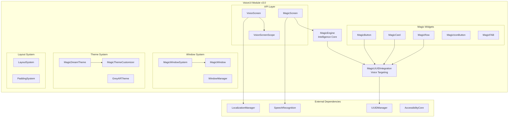
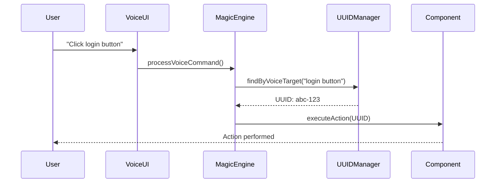
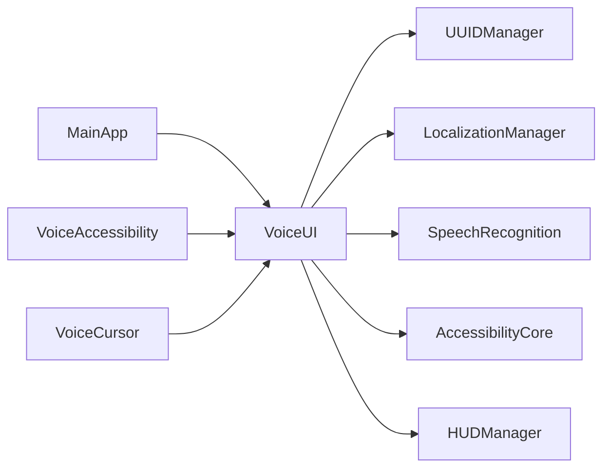

<!--
filename: VoiceUI-Architecture-Map.md  
created: 2025-09-02 22:15:00 PST
author: VOS4 Development Team
copyright: Copyright (C) Manoj Jhawar/Aman Jhawar, Intelligent Devices LLC
purpose: Architecture map with versioning for VoiceUI module
last-modified: 2025-09-02 22:15:00 PST
version: 3.0.0
-->

# VoiceUI Architecture Map

## Version History (for reverting)
- v3.0.0 (2025-09-02): Unified VoiceUI/VoiceUING with Magic components
- v2.0.0 (2025-01-31): VoiceUING with Magic components (archived)
- v1.0.0 (2025-01-23): Original VoiceUI (deprecated)

## Current Architecture (v3.0.0)

### System Overview



### ASCII Architecture Diagram

```
┌─────────────────────────────────────────────────────────────┐
│                     VoiceUI Module v3.0                      │
├─────────────────────────────────────────────────────────────┤
│                                                              │
│  ┌─────────────┐  ┌──────────────────┐  ┌───────────────┐ │
│  │MagicEngine  │──│MagicUUIDIntegr.  │──│ UUIDManager   │ │
│  └─────────────┘  └──────────────────┘  └───────────────┘ │
│         │                  │                               │
│         ▼                  ▼                               │
│  ┌─────────────────────────────────────┐                  │
│  │         Magic Widgets (SRP)          │                  │
│  ├─────────────────────────────────────┤                  │
│  │ • MagicButton    • MagicCard        │                  │
│  │ • MagicRow       • MagicIconButton  │                  │
│  │ • MagicFloatingActionButton         │                  │
│  └─────────────────────────────────────┘                  │
│                                                            │
│  ┌─────────────────────────────────────┐                  │
│  │         Window System                │                  │
│  ├─────────────────────────────────────┤                  │
│  │ • MagicWindowSystem                  │                  │
│  │ • MagicWindow                        │                  │
│  │ • WindowManager                      │                  │
│  └─────────────────────────────────────┘                  │
│                                                            │
│  ┌─────────────────────────────────────┐                  │
│  │         Theme System                 │                  │
│  ├─────────────────────────────────────┤                  │
│  │ • MagicDreamTheme                    │                  │
│  │ • MagicThemeCustomizer               │                  │
│  │ • GreyARTheme                        │                  │
│  └─────────────────────────────────────┘                  │
│                                                            │
└─────────────────────────────────────────────────────────────┘
```

## Component Inventory

### Core Components (NEVER REMOVE)
| Component | Purpose | Features | Status |
|-----------|---------|----------|---------|
| MagicEngine | Intelligence core | Auto-state, GPU cache, predictions | ✅ Active |
| MagicUUIDIntegration | Voice targeting | UUID generation, navigation, commands | ✅ Active |
| Magic Widgets | UI components | Voice-enabled, themed, SRP | ✅ Active |
| MagicWindowSystem | Window management | Freeform, resizable, minimizable | ✅ Active |
| MagicThemeCustomizer | Theme editing | Live preview, export/import | ✅ Active |

### Data Flow



### ASCII Data Flow

```
User Voice Command
        │
        ▼
┌───────────────┐
│   VoiceUI     │
└───────────────┘
        │
        ▼
┌───────────────┐
│  MagicEngine  │
└───────────────┘
        │
        ▼
┌───────────────┐
│ UUIDManager   │
└───────────────┘
        │
        ▼
┌───────────────┐
│  Component    │
└───────────────┘
        │
        ▼
Action Executed
```

## Implementation Status

### Completed (v3.0.0)
- ✅ Core Magic Engine implementation
- ✅ MagicUUIDIntegration with voice targeting
- ✅ All Magic Widgets (Button, Card, Row, etc.)
- ✅ MagicWindowSystem with freeform windows
- ✅ MagicThemeCustomizer with live preview
- ✅ Package migration from voiceuiNG to voiceui
- ✅ Documentation unification

### In Progress
- 🔧 Enhanced voice command processing
- 🔧 Advanced gesture integration
- 🔧 AR display optimizations

### Planned
- 📋 3D spatial UI components
- 📋 Advanced AI predictions
- 📋 Cross-device synchronization

## Feature Parity Tracking

### Original VoiceUI Features (100% preserved)
- [x] VoiceScreen API - present in v3.0.0
- [x] Theme system - present in v3.0.0  
- [x] HUD rendering - present in v3.0.0
- [x] Gesture management - present in v3.0.0
- [x] Window management - enhanced in v3.0.0
- [x] Localization support - present in v3.0.0
- [x] AI context support - present in v3.0.0

### VoiceUING Features (100% preserved)
- [x] Magic components - present in v3.0.0
- [x] MagicEngine - present in v3.0.0
- [x] UUID integration - present in v3.0.0
- [x] Natural language parsing - present in v3.0.0
- [x] Freeform windows - present in v3.0.0
- [x] Live theme customization - present in v3.0.0

## Module Dependencies



## Rollback Instructions

### To revert to v2.0.0 (VoiceUING):
1. Checkout commit before unification
2. Restore `/apps/VoiceUING` from archive
3. Restore package names to `com.augmentalis.voiceuiNG`
4. Update settings.gradle.kts to include VoiceUING

### To revert to v1.0.0 (Original VoiceUI):
1. Restore from `/deprecated/VoiceUI-archived-20250901`
2. Remove all Magic components
3. Restore original package structure

## Performance Architecture

### Memory Management
```
┌─────────────────────────┐
│   Component Pool        │
│   (Recycled Views)      │
└───────────┬─────────────┘
            │
┌───────────▼─────────────┐
│   GPU Cache Layer       │
│   (State Persistence)   │
└───────────┬─────────────┘
            │
┌───────────▼─────────────┐
│   Lazy Loading          │
│   (On-Demand Init)      │
└─────────────────────────┘
```

### Threading Model
- Main Thread: UI Rendering
- Background: Voice Processing
- GPU Thread: Cache Operations
- IO Thread: State Persistence

## Security Architecture

### Voice Command Validation
1. UUID verification
2. Permission checking
3. Context validation
4. Action authorization

### Data Protection
- Encrypted state cache
- Secure voice recordings
- Protected user preferences
- Sandboxed execution

---

**Architecture Status**: ✅ Stable and Production Ready
**Version**: 3.0.0
**Last Review**: 2025-09-02