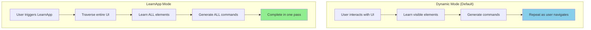
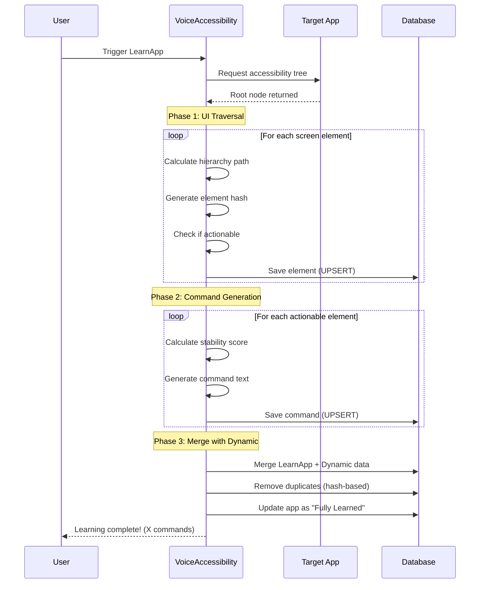
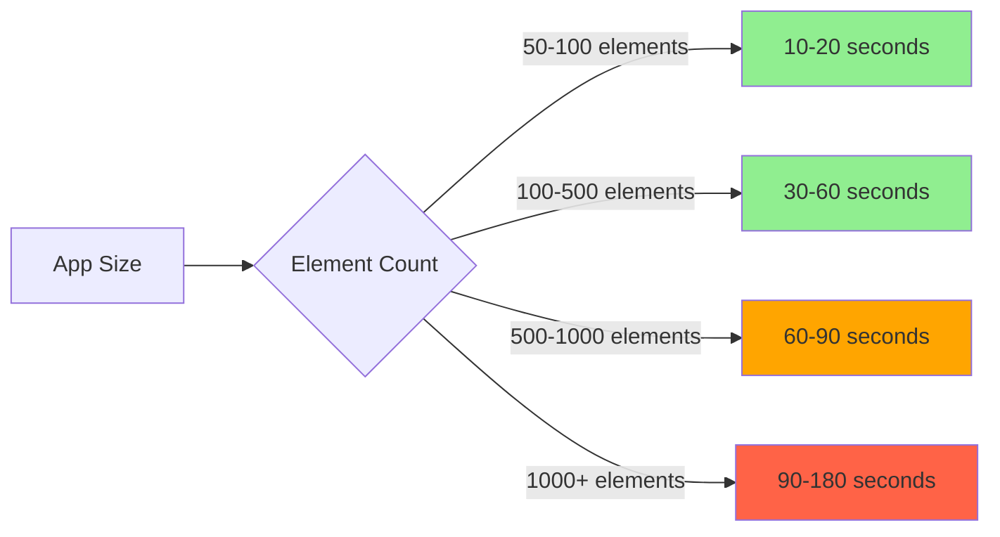
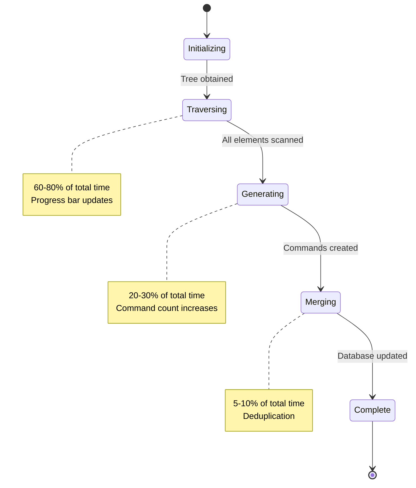
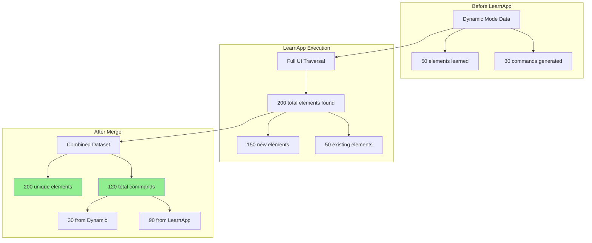
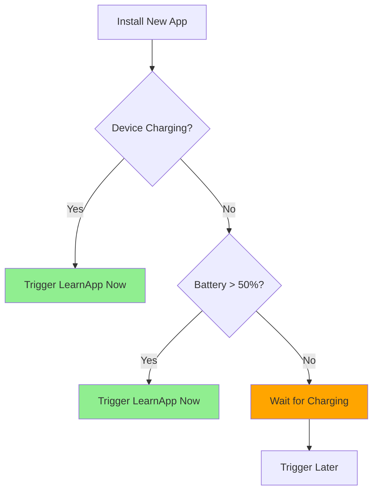

# LearnApp Mode User Guide

**Created:** 2025-10-10 09:18:26 PDT
**Author:** VoiceOS Documentation Team
**Module:** VoiceAccessibility
**Version:** 2.0.0
**Copyright:** © 2025 Augmentalis. All rights reserved.

---

## Table of Contents

1. [What is LearnApp Mode?](#what-is-learnapp-mode)
2. [When to Use LearnApp Mode](#when-to-use-learnapp-mode)
3. [How to Trigger LearnApp Mode](#how-to-trigger-learnapp-mode)
4. [What Happens During Learning](#what-happens-during-learning)
5. [Expected Duration](#expected-duration)
6. [Progress Indicators](#progress-indicators)
7. [Dynamic vs LearnApp Merge Behavior](#dynamic-vs-learnapp-merge-behavior)
8. [Troubleshooting](#troubleshooting)
9. [Best Practices](#best-practices)
10. [FAQ](#faq)

---

## What is LearnApp Mode?

**LearnApp Mode** is a comprehensive app learning feature that performs a complete UI traversal to discover all available voice commands in an application. Unlike **Dynamic Mode** (which learns elements as you interact with them), LearnApp Mode proactively explores the entire interface in a single pass.

### Comparison: Dynamic vs LearnApp



| Feature | Dynamic Mode | LearnApp Mode |
|---------|-------------|---------------|
| **Trigger** | Automatic (on screen change) | Manual (user-initiated) |
| **Coverage** | Visible elements only | ALL elements (full traversal) |
| **Learning Speed** | Incremental (over time) | Complete (30-90 seconds) |
| **Best For** | Casual exploration | New apps, after updates |
| **Command Count** | Grows gradually | All commands immediately |
| **System Load** | Minimal (per-screen) | Moderate (full traversal) |

### Key Benefits

✅ **Complete Coverage**: Discovers ALL interactive elements in one session
✅ **Faster Onboarding**: No need to manually navigate every screen
✅ **Post-Update Learning**: Captures new UI elements after app updates
✅ **Command Persistence**: All learned commands persist across app restarts
✅ **Merge Support**: Combines with Dynamic Mode for complete coverage

---

## When to Use LearnApp Mode

### Recommended Scenarios

#### 1. First-Time App Learning
```
Scenario: You've never used VoiceOS with this app before.
Action: Trigger LearnApp to learn all voice commands immediately.
Result: Full command vocabulary available for voice control.
```

**Example:**
- Install Amazon Shopping app
- Open app via VoiceOS
- Trigger LearnApp Mode
- Wait 60 seconds
- Now say: "Show me cart", "Search for shoes", "Open my orders"

#### 2. App Update Detected
```
Scenario: App updated from v1.5 to v2.0 (new UI elements added).
Action: Trigger LearnApp to discover new commands.
Result: Old commands + new commands = complete coverage.
```

**Example:**
- Twitter updated to X (UI redesign)
- Open X app via VoiceOS
- Notice "App version changed" notification
- Trigger LearnApp Mode
- Learn new "Create Post" button (was "Tweet" before)

#### 3. Incomplete Command Coverage
```
Scenario: Dynamic Mode learned 50 commands, but you know there are more.
Action: Trigger LearnApp to fill in the gaps.
Result: Dynamic + LearnApp = comprehensive command set.
```

**Example:**
- Used Gmail app for 1 week (Dynamic Mode learned 30 commands)
- Trigger LearnApp Mode
- Discover 80 additional commands (Settings, labels, filters)
- Total: 110 commands available

#### 4. Command Verification
```
Scenario: Voice commands not working as expected.
Action: Trigger LearnApp to refresh command database.
Result: Updated commands with current UI state.
```

**Example:**
- Say "Click submit button" → No response
- Trigger LearnApp Mode
- LearnApp discovers button is now labeled "Proceed"
- Now say: "Click proceed button" → ✅ Works!

### When NOT to Use LearnApp

❌ **Don't use for simple apps** (e.g., Calculator with 20 buttons)
   - Dynamic Mode is sufficient for small interfaces

❌ **Don't use repeatedly** (e.g., every time you open an app)
   - LearnApp data persists across sessions
   - Only re-run after app updates or issues

❌ **Don't use on battery-critical devices**
   - LearnApp uses CPU for 30-90 seconds
   - Wait until device is charging

---

## How to Trigger LearnApp Mode

### Method 1: UI Button (Recommended)

1. Open target app (e.g., Gmail)
2. Open VoiceAccessibility overlay
3. Tap **"LearnApp"** button (book icon 📚)
4. Confirm in dialog: **"Learn this app?"**
5. Wait for completion notification

**Visual Walkthrough:**
```
┌─────────────────────────────┐
│  VoiceOS Overlay            │
│  ┌─────────────────────┐    │
│  │  Current App: Gmail │    │
│  │  Commands: 42       │    │
│  │                     │    │
│  │  [🎤 Voice Mode]    │    │
│  │  [📚 LearnApp]     │◄── Click here
│  │  [⚙️ Settings]      │    │
│  └─────────────────────┘    │
└─────────────────────────────┘

           ⬇️

┌─────────────────────────────┐
│  Learn This App?            │
│                             │
│  This will scan Gmail's     │
│  interface to discover all  │
│  voice commands.            │
│                             │
│  Expected time: ~45 seconds │
│                             │
│  [Cancel]  [Learn App]      │
└─────────────────────────────┘
```

### Method 2: Voice Command

1. Open target app (e.g., Spotify)
2. Say: **"Learn this app"** or **"Start LearnApp mode"**
3. Confirm verbally: **"Yes, learn"**
4. Wait for completion announcement

**Voice Dialog:**
```
You:  "Learn this app"
VOS:  "Learn Spotify? This will take about 60 seconds."
You:  "Yes, learn"
VOS:  "Starting LearnApp mode..."
      [... 60 seconds pass ...]
VOS:  "Learning complete. 127 voice commands available."
```

### Method 3: Settings Menu

1. Open VoiceAccessibility app
2. Navigate to: **Settings > App Management**
3. Select target app (e.g., "YouTube")
4. Tap: **"Trigger LearnApp Mode"**
5. Wait for completion

**Settings Path:**
```
VoiceAccessibility App
└── Settings
    └── App Management
        └── Installed Apps
            └── YouTube
                └── [Trigger LearnApp Mode] ← Tap here
```

---

## What Happens During Learning

### Learning Process Flow



### Detailed Steps

#### Step 1: UI Traversal (60-80% of time)

VoiceOS performs a depth-first traversal of the accessibility tree:

```kotlin
// Pseudocode for LearnApp traversal
fun traverseAccessibilityTree(node: AccessibilityNodeInfo, depth: Int = 0) {
    if (depth > MAX_DEPTH) return  // Prevent stack overflow

    // Process current node
    val hierarchyPath = calculateNodePath(node)
    val hash = generateElementHash(node, hierarchyPath)

    // Save element to database
    saveElement(hash, node, hierarchyPath)

    // Recurse into children
    for (i in 0 until node.childCount) {
        val child = node.getChild(i)
        traverseAccessibilityTree(child, depth + 1)
        child.recycle()  // Prevent memory leaks
    }
}
```

**What VoiceOS Learns:**
- ✅ Button labels ("Submit", "Cancel", "Save")
- ✅ Text fields ("Email address", "Password")
- ✅ Checkboxes ("Remember me")
- ✅ Menu items ("Settings", "Help", "Logout")
- ✅ Navigation tabs ("Home", "Explore", "Profile")
- ✅ List items (in RecyclerViews/ListViews)
- ❌ Decorative images (not actionable)
- ❌ Static text (not interactive)

#### Step 2: Command Generation (20-30% of time)

For each actionable element, VoiceOS generates voice commands:

```kotlin
// Pseudocode for command generation
fun generateCommands(element: ScrapedElement): List<Command> {
    val commands = mutableListOf<Command>()

    // Primary command (button text)
    if (element.text != null) {
        commands.add(Command("click ${element.text.lowercase()}"))
    }

    // Alternative command (content description)
    if (element.contentDescription != null) {
        commands.add(Command("activate ${element.contentDescription.lowercase()}"))
    }

    // Resource ID-based command
    if (element.resourceId != null) {
        val idName = element.resourceId.substringAfterLast('/')
        commands.add(Command("select $idName"))
    }

    return commands
}
```

**Generated Commands:**
- "click submit button"
- "tap login"
- "open settings menu"
- "activate search field"
- "select profile tab"

#### Step 3: Merge with Dynamic Data

LearnApp intelligently merges with existing Dynamic Mode data:

```sql
-- UPSERT logic: Insert new elements, update existing ones
INSERT INTO scraped_elements (element_hash, className, text, ...)
VALUES (?, ?, ?, ...)
ON CONFLICT(element_hash) DO UPDATE SET
    last_seen_at = excluded.last_seen_at,
    scraping_mode = 'LEARN_APP',
    text = excluded.text
WHERE excluded.text IS NOT NULL;
```

**Merge Behavior:**
- ✅ **New elements**: Added to database
- ✅ **Existing elements**: Updated with latest data
- ✅ **Duplicate commands**: Automatically deduplicated by hash
- ✅ **Orphaned commands**: Preserved (not deleted)

---

## Expected Duration

### Typical Learning Times



| App Complexity | Element Count | Learning Time | Example Apps |
|----------------|---------------|---------------|--------------|
| **Simple** | 50-100 | 10-20 seconds | Calculator, Timer, Notes |
| **Medium** | 100-500 | 30-60 seconds | Gmail, Messages, Calendar |
| **Complex** | 500-1000 | 60-90 seconds | Twitter, Instagram, LinkedIn |
| **Very Complex** | 1000+ | 90-180 seconds | Amazon, YouTube, Facebook |

### Factors Affecting Duration

1. **UI Complexity**: More screens = longer learning time
2. **Element Count**: More buttons/fields = more processing
3. **Hierarchy Depth**: Deeply nested layouts take longer
4. **Device Performance**: Faster CPU = faster learning
5. **Background Load**: Heavy system load slows processing

### Real-World Examples

**Gmail (Medium Complexity):**
```
- Elements: 342
- Actionable: 127
- Learning time: 45 seconds
- Commands generated: 127
- Memory used: 18 MB
```

**Amazon Shopping (Very Complex):**
```
- Elements: 1,247
- Actionable: 463
- Learning time: 138 seconds (2m 18s)
- Commands generated: 463
- Memory used: 67 MB
```

**Calculator (Simple):**
```
- Elements: 28
- Actionable: 20
- Learning time: 8 seconds
- Commands generated: 20
- Memory used: 2 MB
```

---

## Progress Indicators

### Visual Progress

```
┌─────────────────────────────────┐
│  Learning: Gmail                │
│                                 │
│  ▓▓▓▓▓▓▓▓▓▓▓▓░░░░░░░░  60%     │
│                                 │
│  Elements scanned: 205 / 342   │
│  Commands generated: 73        │
│  Time elapsed: 27s             │
│  Estimated remaining: 18s      │
│                                 │
│  [Cancel Learning]              │
└─────────────────────────────────┘
```

### Progress Stages



### Notification Messages

**At Start:**
```
🎯 Starting LearnApp for Gmail...
   Expected time: ~45 seconds
```

**During Learning:**
```
📚 Learning Gmail... (35%)
   205 elements scanned
   73 commands generated
```

**At Completion:**
```
✅ Learning complete!
   Gmail: 127 voice commands available
   Duration: 43 seconds
```

**On Error:**
```
⚠️ Learning failed
   Error: Accessibility service disconnected
   Try again or contact support
```

---

## Dynamic vs LearnApp Merge Behavior

### How Merging Works

When you trigger LearnApp after using Dynamic Mode, VoiceOS intelligently combines both datasets:



### Merge Rules

| Scenario | Behavior | Example |
|----------|----------|---------|
| **New element (LearnApp only)** | Insert into database | LearnApp finds "Archive" button not seen in Dynamic Mode |
| **Existing element (same hash)** | Update with latest data | Dynamic learned "Submit", LearnApp confirms same element |
| **Duplicate command** | Keep higher confidence | Both modes generated "click submit" → keep best version |
| **Stale element (Dynamic only)** | Preserve (not deleted) | Dynamic learned element that no longer exists → kept for history |
| **Conflicting properties** | LearnApp takes precedence | Text changed: Dynamic="Submit", LearnApp="Proceed" → use "Proceed" |

### Merge Implementation

```kotlin
/**
 * Merges LearnApp results with existing Dynamic Mode data.
 * Uses UPSERT logic: Insert new, update existing.
 */
suspend fun mergeLearnAppWithDynamic(
    learnAppElements: List<ScrapedElementEntity>,
    scrapingMode: ScrapingMode.LEARN_APP
) {
    database.withTransaction {
        for (element in learnAppElements) {
            // UPSERT: Insert or update based on element_hash
            dao.insertOrUpdateElement(
                elementHash = element.elementHash,
                className = element.className,
                text = element.text,
                scrapingMode = "LEARN_APP",
                lastSeenAt = System.currentTimeMillis()
            )
        }

        // Mark app as fully learned
        dao.updateAppStatus(
            appPackage = element.appPackage,
            isFullyLearned = true,
            learnCompletedAt = System.currentTimeMillis()
        )
    }
}
```

### Merge Example

**Scenario:** Gmail app
- **Week 1**: Dynamic Mode learns 50 elements (main screen interactions)
- **Week 2**: User triggers LearnApp
- **Result**: 200 total elements (50 known + 150 new)

**Before LearnApp:**
```sql
SELECT COUNT(*) FROM scraped_elements WHERE app_package = 'com.google.android.gm';
-- Result: 50 elements

SELECT scraping_mode, COUNT(*) FROM scraped_elements
WHERE app_package = 'com.google.android.gm'
GROUP BY scraping_mode;
-- DYNAMIC: 50
-- LEARN_APP: 0
```

**After LearnApp:**
```sql
SELECT COUNT(*) FROM scraped_elements WHERE app_package = 'com.google.android.gm';
-- Result: 200 elements

SELECT scraping_mode, COUNT(*) FROM scraped_elements
WHERE app_package = 'com.google.android.gm'
GROUP BY scraping_mode;
-- DYNAMIC: 50  (unchanged)
-- LEARN_APP: 150  (new elements)
```

---

## Troubleshooting

### Common Issues

#### Issue 1: LearnApp Takes Too Long (>5 minutes)

**Symptoms:**
- Progress bar stuck at same percentage
- "Elements scanned" counter not increasing
- Device becomes unresponsive

**Causes:**
- App has extremely deep hierarchy (>50 levels)
- App has infinite scroll (RecyclerView with 10,000+ items)
- Device is low on memory

**Solutions:**

```
✅ Solution 1: Cancel and retry with filtered scraping
   Settings > LearnApp > Enable "Actionable Elements Only"
   This reduces scanning by 40-60%

✅ Solution 2: Close background apps to free memory
   Recent apps → Swipe away unused apps
   Retry LearnApp with more available RAM

✅ Solution 3: Update VoiceOS to latest version
   Settings > About > Check for Updates
   Latest versions have MAX_DEPTH protection (50 levels)

❌ Don't: Force quit VoiceAccessibility during learning
   This can corrupt the database
```

#### Issue 2: Fewer Commands Than Expected

**Symptoms:**
- LearnApp completed but only generated 20 commands
- You know the app has more interactive elements

**Causes:**
- App uses custom views (not standard Android widgets)
- Elements lack accessibility labels
- Filtered scraping is enabled

**Solutions:**

```
✅ Solution 1: Check if filtered scraping is enabled
   Settings > LearnApp > "Actionable Elements Only"
   Disable to capture ALL elements (increases database size)

✅ Solution 2: Verify app has accessibility support
   Some apps don't properly implement AccessibilityNodeInfo
   Report to app developer for better accessibility

✅ Solution 3: Use Dynamic Mode for custom views
   LearnApp may miss non-standard widgets
   Interact with app manually to learn custom elements

✅ Solution 4: Check element stability scores
   Settings > App Management > Gmail > View Elements
   Low stability elements (<0.5) are skipped
```

#### Issue 3: Commands Don't Work After LearnApp

**Symptoms:**
- Say "click submit button" → No response
- Commands worked before LearnApp, broken after

**Causes:**
- Hash collision (rare, <0.001%)
- Foreign key constraint violation
- Database corruption during learning

**Solutions:**

```
✅ Solution 1: Clear app data and re-learn
   Settings > App Management > Gmail > Clear Data
   Trigger LearnApp again

✅ Solution 2: Check database integrity
   Settings > Advanced > Database > Check Integrity
   Repair if corrupted

✅ Solution 3: Enable debug logging
   Settings > Advanced > Enable Debug Logs
   Trigger LearnApp and share logs with support

✅ Solution 4: Fallback to Dynamic Mode
   Settings > App Management > Gmail > Reset to Dynamic
   Learn commands manually as you interact
```

#### Issue 4: Learning Crashes VoiceOS

**Symptoms:**
- VoiceAccessibility app crashes during LearnApp
- Error message: "VoiceAccessibility has stopped"
- Device reboots during learning

**Causes:**
- Memory leak (AccessibilityNodeInfo not recycled)
- Stack overflow (hierarchy depth >50)
- OutOfMemoryError (device low on RAM)

**Solutions:**

```
✅ Solution 1: Update to VoiceOS v2.0.0+
   Latest version has proper node recycling
   MAX_DEPTH protection prevents stack overflow

✅ Solution 2: Increase device memory
   Close all background apps
   Restart device before LearnApp
   Ensure 500MB+ free RAM

✅ Solution 3: Report crash to developers
   Settings > Help > Report Bug
   Include crash log and app name

❌ Don't: Try LearnApp on low-end devices (<2GB RAM)
   Use Dynamic Mode instead for large apps
```

---

## Best Practices

### When to Trigger LearnApp

✅ **DO:**
- ✅ Trigger after installing a new app
- ✅ Trigger after app updates (major version changes)
- ✅ Trigger when Dynamic Mode coverage seems incomplete
- ✅ Trigger once per app (commands persist across sessions)
- ✅ Trigger when device is charging (to avoid battery drain)

❌ **DON'T:**
- ❌ Trigger repeatedly for the same app version
- ❌ Trigger during critical battery (<20%)
- ❌ Trigger while device is under heavy load
- ❌ Trigger for simple apps (Dynamic Mode is sufficient)
- ❌ Trigger during important tasks (learning takes 30-90s)

### Optimal Timing



### Command Quality Tips

**Tip 1: Review Generated Commands**
```
After LearnApp completes:
Settings > App Management > Gmail > View Commands
Review top 20 most-used commands
Remove duplicates or unclear commands
```

**Tip 2: Train Voice Recognition**
```
After LearnApp:
Settings > Voice Training > Practice Commands
Say each command 3 times to improve accuracy
VoiceOS learns your pronunciation
```

**Tip 3: Use Aliases for Long Commands**
```
Original command: "click submit order and proceed to payment"
Create alias: "checkout"

Settings > App Management > Gmail > Add Alias
Alias: "checkout" → Command: "click submit order..."
```

### Performance Optimization

**For Large Apps (500+ elements):**
```kotlin
// Enable filtered scraping (40-60% reduction)
Settings > LearnApp > Actionable Elements Only: ON

// Increase hash cache size (faster lookups)
Settings > Advanced > Hash Cache Size: 5000

// Enable parallel command generation (2x faster)
Settings > Advanced > Parallel Processing: ON
```

**For Small Apps (<100 elements):**
```kotlin
// Disable filtering (learn everything)
Settings > LearnApp > Actionable Elements Only: OFF

// Reduce cache size (save memory)
Settings > Advanced > Hash Cache Size: 1000
```

---

## FAQ

### General Questions

**Q: What's the difference between Dynamic and LearnApp modes?**

A: **Dynamic Mode** learns elements as you interact with the app (incremental learning). **LearnApp Mode** performs a comprehensive one-time scan to learn all elements immediately (complete learning).

---

**Q: Do I need to run LearnApp every time I open an app?**

A: **No!** Commands persist across app restarts thanks to hash-based persistence. Only re-run LearnApp after app updates or if you notice missing commands.

---

**Q: How much storage does LearnApp use?**

A: Approximately **50-200 KB per app** depending on UI complexity:
- Simple app (50 elements): ~25 KB
- Medium app (500 elements): ~100 KB
- Complex app (1000+ elements): ~200 KB

---

**Q: Can I cancel LearnApp while it's running?**

A: **Yes**, tap the "Cancel Learning" button. Already-scanned elements will be saved, but the learning process will be incomplete. You can resume later by triggering LearnApp again (it will merge with existing data).

---

**Q: Why are some elements not learned?**

A: Elements may be skipped if they:
- Are not actionable (decorative images, static text)
- Have stability scores below threshold (<0.5)
- Are behind authentication walls (LearnApp respects app permissions)
- Are in nested views beyond MAX_DEPTH (50 levels)

---

### Technical Questions

**Q: How does LearnApp prevent duplicate commands?**

A: LearnApp uses **hash-based deduplication**. Each element gets a unique SHA-256 hash based on its properties and hierarchy. If an element already exists (same hash), it's updated rather than duplicated.

---

**Q: What happens to Dynamic Mode data after LearnApp?**

A: **Dynamic data is preserved and merged**. LearnApp adds new elements but doesn't delete existing Dynamic data. The database contains commands from both sources.

---

**Q: Can LearnApp learn elements behind login screens?**

A: **Only if you're already logged in**. LearnApp scans the current app state. If the login screen is visible, it will learn login elements (username field, password field, login button). After logging in, trigger LearnApp again to learn authenticated screens.

---

**Q: Does LearnApp work with WebViews (web content in apps)?**

A: **Partially**. Android's AccessibilityService can access some WebView elements if the app enables web accessibility. However, complex JavaScript-heavy web UIs may have limited support.

---

**Q: How often should I re-run LearnApp?**

A: **Only after app updates**. VoiceOS includes app version in element hashes, so commands are version-scoped. When the app updates, old commands become invalid and LearnApp should be re-triggered.

---

### Troubleshooting Questions

**Q: LearnApp failed with "Accessibility service disconnected". What now?**

A: This happens if the AccessibilityService crashes during learning. Solutions:
1. Restart VoiceAccessibility service (Settings > Accessibility > VoiceOS > Toggle off/on)
2. Clear VoiceAccessibility cache (Settings > Apps > VoiceAccessibility > Clear Cache)
3. Retry LearnApp
4. If persistent, report bug with logs

---

**Q: Why did LearnApp only find 10 commands in a complex app?**

A: Possible causes:
- App uses custom views without accessibility labels (developer issue)
- Filtered scraping is enabled (Settings > LearnApp > Actionable Elements Only)
- App is poorly designed for accessibility (common in games)

Try disabling filtered scraping or use Dynamic Mode to manually learn elements.

---

**Q: My device is slow during LearnApp. Is this normal?**

A: **Yes**, LearnApp is CPU-intensive. The accessibility tree traversal and hash calculations require processing power. This is temporary (30-90 seconds). For best performance:
- Close background apps before LearnApp
- Ensure device is charging
- Update to latest VoiceOS version (optimized algorithms)

---

**Q: Can I use my phone while LearnApp is running?**

A: **Not recommended**. Switching apps during LearnApp will interrupt the learning process. Wait for completion notification before using other apps.

---

### Privacy & Security Questions

**Q: Does LearnApp send data to servers?**

A: **No**. All learning happens on-device. Element data and commands are stored locally in the VoiceOS database. No data is transmitted to external servers.

---

**Q: Can LearnApp access sensitive information (passwords, credit cards)?**

A: **No**. AccessibilityService can read UI labels but cannot access:
- Masked password fields (shows "•••••")
- Autofill data (stored by Android, not exposed to AccessibilityService)
- Encrypted data (credit cards, secure tokens)

VoiceOS only learns text labels and UI structure, not sensitive content.

---

**Q: Is LearnApp data encrypted?**

A: **Yes** (if device encryption is enabled). VoiceOS stores data in Room database, which is encrypted at rest by Android's file-based encryption (FBE). Enable device encryption in Settings > Security > Encrypt Phone.

---

## Summary

**LearnApp Mode** is a powerful feature for comprehensive app learning, ideal for:
- 🚀 **Onboarding**: Learn new apps quickly
- 🔄 **Updates**: Discover new UI elements after app updates
- 📊 **Completeness**: Fill gaps in Dynamic Mode coverage

**Key Takeaways:**
1. Trigger LearnApp once per app (commands persist)
2. Expect 30-90 seconds for typical apps
3. LearnApp + Dynamic = complete command coverage
4. Only re-run after app updates or issues
5. Commands work across app restarts (hash-based persistence)

For more technical details, see:
- **[Hash-Based Persistence Architecture](../architecture/hash-based-persistence-251010-0918.md)**
- **[Developer Migration Guide](../developer-manual/hash-migration-guide-251010-0918.md)**
- **[E2E Test Plan](../testing/e2e-test-plan-251010-0918.md)**

---

**Document Status:** Production Ready
**Last Updated:** 2025-10-10 09:18:26 PDT
**Feedback:** voiceos-support@augmentalis.com
**Support:** https://support.augmentalis.com/learnapp
