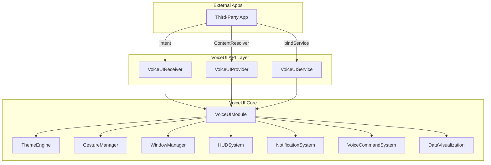
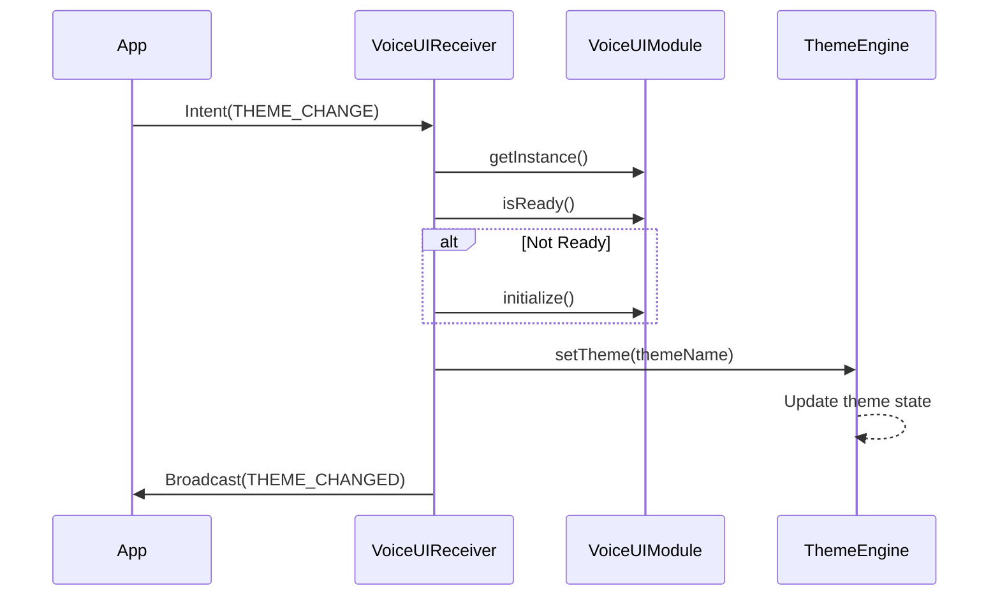
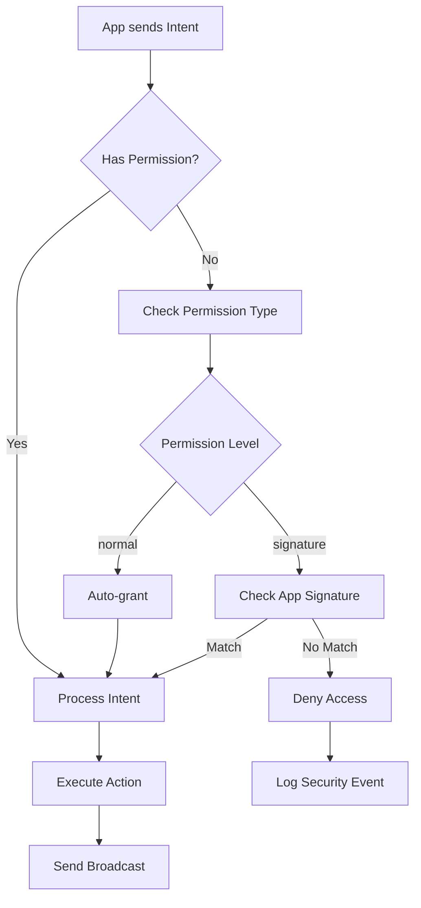
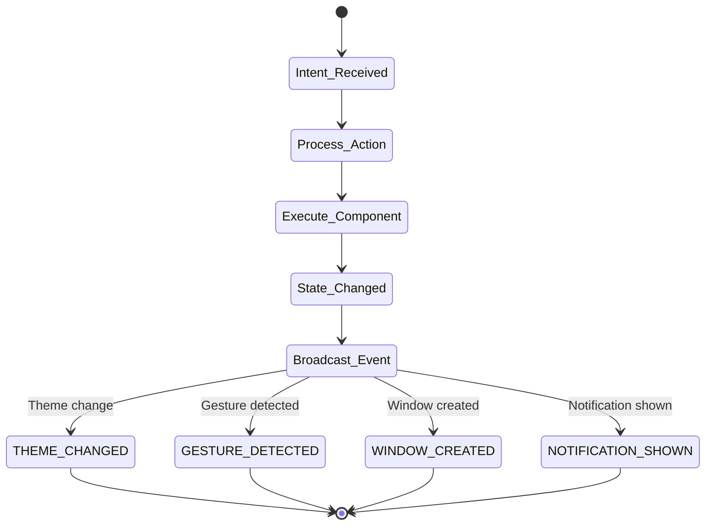

# VoiceUI Architecture Diagrams & Flows

## 🏗️ System Architecture

### High-Level Architecture (ASCII)
```
┌─────────────────────────────────────────────────────────────┐
│                     Third-Party Apps                         │
├─────────────────────────────────────────────────────────────┤
│                         ↓ Intents                            │
│                    ↓ Content Provider                        │
│                      ↓ Service Binding                       │
├─────────────────────────────────────────────────────────────┤
│                    VoiceUI API Layer                         │
│  ┌──────────────┬──────────────┬──────────────────────┐    │
│  │   Receiver   │   Provider   │      Service         │    │
│  │              │              │                      │    │
│  │  25+ Intent  │  6 Endpoints │  Bindable Interface  │    │
│  │   Actions    │   CRUD Ops   │   Direct Access      │    │
│  └──────┬───────┴──────┬───────┴──────────┬──────────┘    │
│         ↓              ↓                   ↓                │
├─────────────────────────────────────────────────────────────┤
│                  VoiceUI Module Core                         │
│  ┌────────────────────────────────────────────────────┐    │
│  │            VoiceUIModule (Singleton)                │    │
│  │                                                     │    │
│  │  ┌─────────┐ ┌─────────┐ ┌─────────┐ ┌─────────┐ │    │
│  │  │ Theme   │ │ Gesture │ │ Window  │ │   HUD   │ │    │
│  │  │ Engine  │ │ Manager │ │ Manager │ │ System  │ │    │
│  │  └─────────┘ └─────────┘ └─────────┘ └─────────┘ │    │
│  │                                                     │    │
│  │  ┌─────────┐ ┌─────────┐ ┌─────────────────────┐ │    │
│  │  │ Notif.  │ │  Voice  │ │ Data Visualization  │ │    │
│  │  │ System  │ │ Command │ │                     │ │    │
│  │  └─────────┘ └─────────┘ └─────────────────────┘ │    │
│  └────────────────────────────────────────────────────┘    │
└─────────────────────────────────────────────────────────────┘
```

### Component Interaction Flow (Mermaid)


## 📊 Intent Processing Flow

### Intent Flow Sequence (ASCII)
```
Third-Party App        VoiceUIReceiver       VoiceUIModule        Component
      │                      │                     │                  │
      │   Send Intent        │                     │                  │
      ├─────────────────────>│                     │                  │
      │                      │                     │                  │
      │                      │  Get Instance       │                  │
      │                      ├───────────────────>│                  │
      │                      │                     │                  │
      │                      │  Check Ready        │                  │
      │                      ├───────────────────>│                  │
      │                      │                     │                  │
      │                      │                     │  Initialize      │
      │                      │                     ├────────────────>│
      │                      │                     │                  │
      │                      │  Process Intent     │                  │
      │                      ├───────────────────>│                  │
      │                      │                     │                  │
      │                      │                     │  Execute Action  │
      │                      │                     ├────────────────>│
      │                      │                     │                  │
      │                      │                     │  Return Result   │
      │                      │                     │<────────────────│
      │                      │                     │                  │
      │                      │  Send Broadcast     │                  │
      │<─────────────────────│                     │                  │
      │                      │                     │                  │
```

### Theme Change Flow (Mermaid)


## 🔄 Service Binding Flow

### Service Binding Sequence (ASCII)
```
┌──────────┐      ┌──────────────┐      ┌──────────────┐      ┌────────────┐
│   App    │      │VoiceUIService│      │VoiceUIModule │      │ Components │
└────┬─────┘      └──────┬───────┘      └──────┬───────┘      └─────┬──────┘
     │                    │                      │                    │
     │  bindService()     │                      │                    │
     ├───────────────────>│                      │                    │
     │                    │                      │                    │
     │                    │  getInstance()       │                    │
     │                    ├─────────────────────>│                    │
     │                    │                      │                    │
     │                    │  initialize()        │                    │
     │                    ├─────────────────────>│                    │
     │                    │                      │                    │
     │                    │                      │  init components   │
     │                    │                      ├───────────────────>│
     │                    │                      │                    │
     │  onServiceConnected│                      │                    │
     │<───────────────────│                      │                    │
     │                    │                      │                    │
     │  getBinder()       │                      │                    │
     ├───────────────────>│                      │                    │
     │                    │                      │                    │
     │  Direct Access     │                      │                    │
     ├────────────────────┼──────────────────────┼───────────────────>│
     │                    │                      │                    │
```

## 📱 Content Provider Query Flow

### Provider Query Flow (ASCII)
```
App Query: content://com.augmentalis.voiceui.provider/themes

     App              VoiceUIProvider         VoiceUIModule         ThemeEngine
      │                     │                      │                     │
      │  query(URI)         │                      │                     │
      ├────────────────────>│                      │                     │
      │                     │                      │                     │
      │                     │  match URI           │                     │
      │                     ├──────────┐           │                     │
      │                     │          │           │                     │
      │                     │<─────────┘           │                     │
      │                     │                      │                     │
      │                     │  getInstance()      │                     │
      │                     ├─────────────────────>│                     │
      │                     │                      │                     │
      │                     │                      │  getThemes()       │
      │                     │                      ├────────────────────>│
      │                     │                      │                     │
      │                     │                      │  List<Theme>       │
      │                     │                      │<────────────────────│
      │                     │                      │                     │
      │                     │  MatrixCursor       │                     │
      │                     │<─────────────────────│                     │
      │                     │                      │                     │
      │  Cursor             │                      │                     │
      │<────────────────────│                      │                     │
      │                     │                      │                     │
```

## 🎯 Component Direct Access Pattern

### VOS4 Direct Access (ASCII)
```
Traditional Pattern (OLD):              VOS4 Direct Pattern (NEW):
┌──────────────────┐                   ┌──────────────────┐
│      App         │                   │      App         │
└────────┬─────────┘                   └────────┬─────────┘
         │                                       │
         ↓                                       ↓
┌──────────────────┐                   ┌──────────────────┐
│   IVoiceUIModule │ ❌ REMOVED        │   VoiceUIModule  │
│   (Interface)    │                   │   (Direct)       │
└────────┬─────────┘                   └────────┬─────────┘
         │                                       │
         ↓                                       │
┌──────────────────┐                            │
│  VoiceUIModule   │                            │
│ (Implementation) │                            │
└────────┬─────────┘                            │
         │                                       │
         ↓ getGestureManager()                  ↓ .gestureManager
┌──────────────────┐                   ┌──────────────────┐
│  GestureManager  │                   │  GestureManager  │
└──────────────────┘                   └──────────────────┘

Code Impact:
OLD: val mgr = module.getGestureManager()
NEW: val mgr = module.gestureManager  ✅
```

## 🔐 Permission Flow

### Permission Check Flow (Mermaid)


## 📈 Data Flow Architecture

### Data Flow Between Components (ASCII)
```
┌─────────────────────────────────────────────────────────────────┐
│                         Data Flow Architecture                   │
├─────────────────────────────────────────────────────────────────┤
│                                                                  │
│   ┌──────────┐     Intent      ┌──────────────┐               │
│   │   App    ├────────────────>│   Receiver   │               │
│   └──────────┘                 └──────┬───────┘               │
│                                        │                        │
│                                        ↓                        │
│   ┌──────────┐   ContentURI    ┌──────────────┐               │
│   │   App    ├────────────────>│   Provider   │               │
│   └──────────┘                 └──────┬───────┘               │
│                                        │                        │
│                                        ↓                        │
│   ┌──────────┐    Binding      ┌──────────────┐               │
│   │   App    ├────────────────>│   Service    │               │
│   └──────────┘                 └──────┬───────┘               │
│                                        │                        │
│                    ┌───────────────────┴────────────┐          │
│                    ↓                                ↓          │
│            ┌──────────────┐                ┌──────────────┐   │
│            │ VoiceUIModule│────────────────│  ObjectBox   │   │
│            └──────┬───────┘                └──────────────┘   │
│                   │                                            │
│     ┌─────────────┼─────────────┬─────────────┐              │
│     ↓             ↓             ↓             ↓              │
│ ┌────────┐  ┌────────┐  ┌────────┐  ┌────────┐             │
│ │Theme   │  │Gesture │  │Window  │  │  HUD   │             │
│ └────────┘  └────────┘  └────────┘  └────────┘             │
│                                                              │
└──────────────────────────────────────────────────────────────┘
```

## 🚀 Initialization Sequence

### Module Initialization (ASCII)
```
VoiceOS.onCreate()
      │
      ├─> initializeModules()
      │        │
      │        ├─> deviceManager = DeviceManager.getInstance()
      │        ├─> dataManager = DatabaseModule()
      │        ├─> speechRecognition = RecognitionModule()
      │        ├─> commandManager = CommandManager.getInstance()
      │        └─> voiceUI = VoiceUIModule.getInstance() ← NEW
      │
      └─> applicationScope.launch {
               │
               └─> initializeCoreModules()
                        │
                        ├─> deviceManager.initialize()
                        ├─> dataManager.initialize()
                        ├─> speechRecognition.initialize()
                        ├─> commandManager.initialize()
                        └─> voiceUI.initialize() ← NEW
                                 │
                                 ├─> themeEngine = ThemeEngine()
                                 ├─> gestureManager = GestureManager()
                                 ├─> notificationSystem = NotificationSystem()
                                 ├─> voiceCommandSystem = VoiceCommandSystem()
                                 ├─> windowManager = WindowManager()
                                 ├─> hudSystem = HUDSystem()
                                 └─> dataVisualization = DataVisualization()
```

## 📡 Broadcast Events

### Event Broadcasting Flow (Mermaid)


## 🔧 API Usage Examples

### Complete Usage Flow (ASCII)
```
1. Check Permission
   │
   ├─> Has com.augmentalis.voiceui.permission.CHANGE_THEME?
   │
2. Send Intent
   │
   ├─> Intent("com.augmentalis.voiceui.action.THEME_CHANGE")
   │   └─> putExtra("theme_name", "arvision")
   │
3. Receive Broadcast
   │
   ├─> BroadcastReceiver
   │   └─> onReceive("com.augmentalis.voiceui.broadcast.THEME_CHANGED")
   │
4. Query State
   │
   ├─> ContentResolver.query(
   │       "content://com.augmentalis.voiceui.provider/themes"
   │   )
   │
5. Direct Control (Service)
   │
   └─> bindService() → VoiceUIBinder
       └─> binder.themeEngine.setTheme("material")
```

## 📊 Performance Metrics

### API Response Times (Target)
```
┌────────────────────┬──────────────┬─────────────┐
│     Operation      │  Target (ms) │  Actual*    │
├────────────────────┼──────────────┼─────────────┤
│ Intent Processing  │     < 50     │     TBD     │
│ Service Binding    │     < 100    │     TBD     │
│ Provider Query     │     < 30     │     TBD     │
│ Theme Change       │     < 100    │     TBD     │
│ Gesture Detection  │     < 16     │     TBD     │
│ Window Creation    │     < 200    │     TBD     │
│ HUD Update         │     < 33     │     TBD     │
└────────────────────┴──────────────┴─────────────┘
* To be measured during testing phase
```

---
**Document Version:** 1.0  
**Created:** 2025-08-24  
**Module:** VoiceUI  
**Status:** Architecture Documentation Complete