# VoiceCursor Data Flow Diagrams
**Last Updated:** 2025-01-28

## 1. Complete Data Flow Pipeline

```mermaid
graph TB
    subgraph "Hardware Sensors"
        ACC[Accelerometer<br/>3-axis acceleration]
        GYRO[Gyroscope<br/>3-axis rotation]
        MAG[Magnetometer<br/>3-axis magnetic field]
    end
    
    subgraph "IMUManager"
        SF[Sensor Fusion<br/>Madgwick/Mahony]
        QO[Quaternion Output<br/>w,x,y,z]
    end
    
    subgraph "CursorAdapter - FIXED 2025-01-28"
        PO[Previous Orientation<br/>Storage]
        DC[Delta Calculation<br/>Q⁻¹ × Q]
        EC[Euler Conversion<br/>yaw, pitch, roll]
        TS[Tangent Scaling<br/>tan θ × screen × sensitivity]
        PU[Position Update<br/>cumulative]
    end
    
    subgraph "CursorFilter"
        DZ[Dead Zone<br/>< 0.001 rad]
        JF[Jitter Filter<br/>moving average]
        MS[Motion Smoothing<br/>interpolation]
    end
    
    subgraph "CursorView"
        REN[Renderer<br/>Canvas draw]
        ANI[Animations<br/>pulse, glow]
        GES[Gestures<br/>tap, swipe]
    end
    
    ACC --> SF
    GYRO --> SF
    MAG --> SF
    SF --> QO
    QO --> DC
    PO --> DC
    DC --> EC
    EC --> TS
    TS --> PU
    PU --> DZ
    DZ --> JF
    JF --> MS
    MS --> REN
    REN --> ANI
    ANI --> GES
    
    DC -.->|Store| PO
```



## 2. Coordinate Transformation Pipeline

```mermaid
graph LR
    subgraph "Input Space"
        Q1[Quaternion t-1<br/>Previous frame]
        Q2[Quaternion t<br/>Current frame]
    end
    
    subgraph "Delta Processing"
        INV[Q1 Inverse]
        MUL[Multiply<br/>Q1⁻¹ × Q2]
        DQ[Delta Quaternion]
    end
    
    subgraph "Angular Space"
        E[Euler Angles<br/>Δyaw, Δpitch]
        TAN[Tangent Function<br/>tan(Δθ)]
    end
    
    subgraph "Screen Space"
        SC[Scale by Screen<br/>× width, × height]
        SEN[Apply Sensitivity<br/>× 2.0, × 3.0]
        POS[Add to Position<br/>P += ΔP]
        CL[Clamp to Bounds<br/>[0,w] × [0,h]]
    end
    
    Q1 --> INV
    Q2 --> MUL
    INV --> MUL
    MUL --> DQ
    DQ --> E
    E --> TAN
    TAN --> SC
    SC --> SEN
    SEN --> POS
    POS --> CL
```

## 3. Initialization & Recovery Flow


## 4. Bug Fix Visualization (Before vs After)

```mermaid
graph TB
    subgraph "BEFORE - Broken"
        B1[Orientation Data]
        B2[Direct Euler<br/>absolute angles]
        B3[Linear Scale<br/>angle × screen × 1.2]
        B4[Kill Movement<br/>× 0.1 😱]
        B5[Result: 2 pixels<br/>X=0, Y=0 stuck]
        
        B1 --> B2
        B2 --> B3
        B3 --> B4
        B4 --> B5
    end
    
    subgraph "AFTER - Fixed ✅"
        A1[Orientation Data]
        A2[Delta Processing<br/>frame-to-frame]
        A3[Tangent Scale<br/>tan(Δθ) × screen]
        A4[Proper Sensitivity<br/>× 2.0, × 3.0]
        A5[Result: 336 pixels<br/>Smooth movement]
        
        A1 --> A2
        A2 --> A3
        A3 --> A4
        A4 --> A5
    end
    
    style B5 fill:#f99
    style A5 fill:#9f9
```

## 5. State Machine


## 6. Performance Flow


## 7. Module Integration


## 8. Error Recovery Paths


---
**Diagrams Version:** 1.0.0  
**Created:** 2025-01-28  
**Format:** Mermaid Markdown