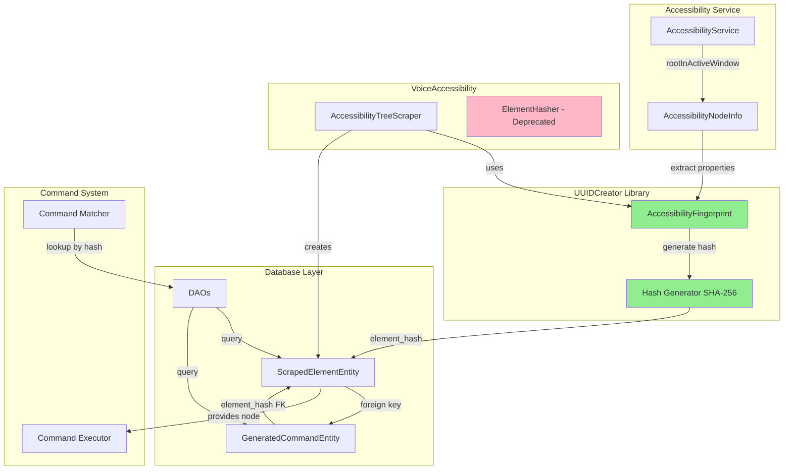
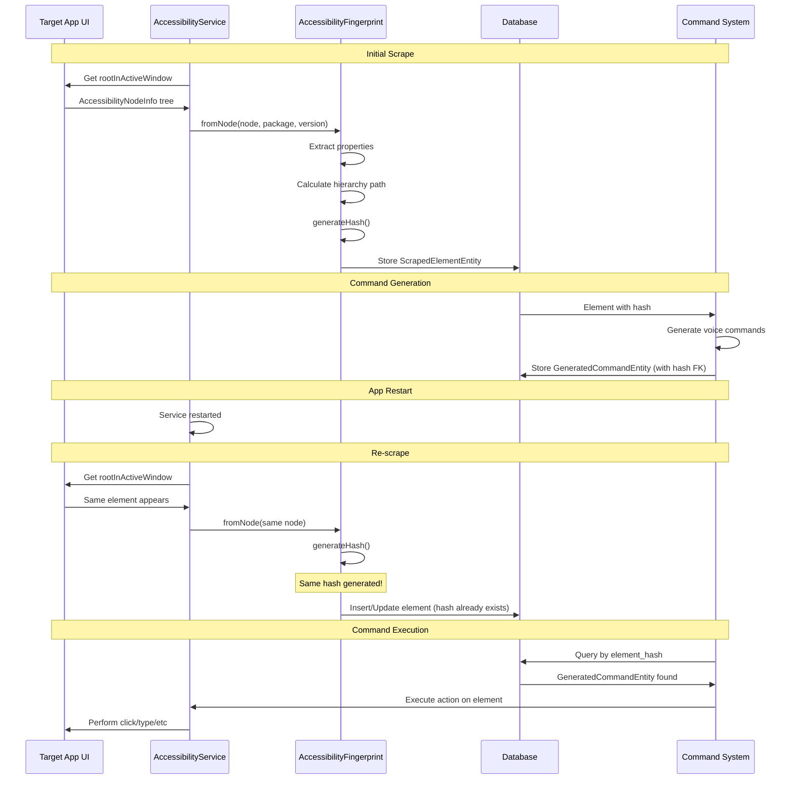
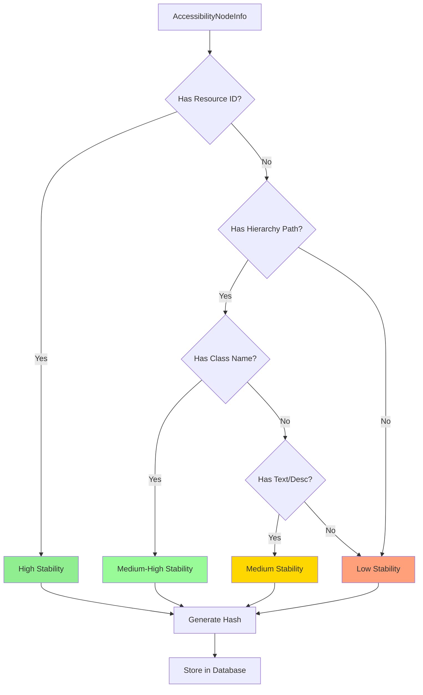

# Hash-Based Element Persistence Architecture

**Document Type:** Architecture Documentation
**Module:** VoiceAccessibility
**Created:** 2025-10-10 06:37:48 PDT
**Author:** VOS4 Documentation Team
**Copyright:** (C) Manoj Jhawar/Aman Jhawar, Intelligent Devices LLC
**Status:** Active
**Version:** 2.0.0

---

## Table of Contents

1. [Overview](#overview)
2. [Architecture Goals](#architecture-goals)
3. [System Architecture](#system-architecture)
4. [Hash Algorithm Design](#hash-algorithm-design)
5. [Database Schema](#database-schema)
6. [Element Fingerprinting](#element-fingerprinting)
7. [Stability Scoring](#stability-scoring)
8. [Performance Characteristics](#performance-characteristics)
9. [Integration Points](#integration-points)
10. [Security Considerations](#security-considerations)
11. [Future Enhancements](#future-enhancements)

---

## Overview

The Hash-Based Element Persistence system provides stable, deterministic identification of UI elements across application sessions. By generating cryptographic hashes from element properties instead of relying on transient database IDs, the system enables voice commands to persist and function reliably even after app restarts or database migrations.

### Problem Statement

**Previous System (ID-Based):**
- Generated commands referenced elements by database auto-generated `Long` IDs
- IDs were session-specific and reset on app restart
- Commands became orphaned when underlying elements were rescraped
- Foreign key constraints failed when IDs didn't match
- No stable cross-session element identity

**New System (Hash-Based):**
- Elements identified by deterministic SHA-256 hash of stable properties
- Same element = same hash across sessions (when app version unchanged)
- Commands persist across app restarts
- Automatic element re-linking on scrape
- Version-scoped namespacing prevents collision

### Key Benefits

1. **Cross-Session Persistence**: Commands survive app restarts
2. **Deterministic Identity**: Same element always produces same hash
3. **Version Isolation**: Different app versions = different hashes
4. **Collision Prevention**: Hierarchy paths make hashes unique
5. **Performance**: O(1) indexed lookups by hash
6. **Stability Scoring**: Quantify element reliability

---

## Architecture Goals

### Primary Goals

1. **Stability**: Elements must have consistent identifiers across sessions
2. **Uniqueness**: Each element must have a distinct hash within app version scope
3. **Performance**: Hash generation and lookup must be fast (< 5µs)
4. **Compatibility**: Seamless migration from ID-based to hash-based system
5. **Debuggability**: Hashes should be human-inspectable and traceable

### Non-Goals

1. Cross-version persistence (intentionally version-scoped)
2. Backward compatibility with old command database (clean migration)
3. Support for dynamic/unstable UI elements (use LearnApp mode instead)

---

## System Architecture

### High-Level Architecture



### Component Diagram

```mermaid
graph LR
    subgraph "Phase 1: Extraction"
        N[AccessibilityNodeInfo]
        F[AccessibilityFingerprint]
        N -->|fromNode| F
    end

    subgraph "Phase 2: Hashing"
        F -->|generateHash| H[SHA-256 Hash]
        H -->|12-char hex| E[Element Hash]
    end

    subgraph "Phase 3: Storage"
        E -->|store| S[ScrapedElementEntity]
        S -->|indexed| I[element_hash INDEX]
    end

    subgraph "Phase 4: Command Linking"
        S -->|element_hash FK| C[GeneratedCommandEntity]
        C -->|CASCADE| S
    end

    subgraph "Phase 5: Retrieval"
        C -->|query| Q[DAO Lookup]
        Q -->|O(1) by hash| S
    end

    style F fill:#87CEEB
    style H fill:#87CEEB
    style E fill:#98FB98
    style I fill:#FFD700
```

### Data Flow



---

## Hash Algorithm Design

### AccessibilityFingerprint Class

The `AccessibilityFingerprint` class (from UUIDCreator library) extracts stable properties from `AccessibilityNodeInfo` and generates deterministic hashes.

**Location:** `/Volumes/M Drive/Coding/vos4/modules/libraries/UUIDCreator/src/main/java/com/augmentalis/uuidcreator/thirdparty/AccessibilityFingerprint.kt`

### Fingerprint Components

The hash is derived from these properties (in priority order):

```kotlin
data class AccessibilityFingerprint(
    val packageName: String,        // App package (e.g., "com.instagram.android")
    val appVersion: String,          // Version scoping (e.g., "12.0.0")
    val resourceId: String?,         // Android resource ID (highest stability)
    val className: String?,          // View class name
    val hierarchyPath: String,       // Position in tree (e.g., "/0/1/3")
    val text: String?,               // Visible text (truncated to 100 chars)
    val contentDescription: String?, // Accessibility description
    val viewIdHash: String?,         // Hash of resource name
    val isClickable: Boolean,        // Action flags
    val isEnabled: Boolean
)
```

### Hash Generation Algorithm

```kotlin
fun generateHash(): String {
    // 1. Build canonical string
    val components = buildList {
        add("pkg:$packageName")        // Namespace
        add("ver:$appVersion")         // Version scope
        resourceId?.let { add("res:$it") }
        className?.let { add("cls:$it") }
        add("path:$hierarchyPath")     // Critical for uniqueness
        text?.let { add("txt:$it") }
        contentDescription?.let { add("desc:$it") }
        viewIdHash?.let { add("vid:$it") }
        add("click:$isClickable")
        add("enabled:$isEnabled")
    }

    // 2. Join with delimiter
    val canonical = components.joinToString("|")

    // 3. SHA-256 hash
    val bytes = MessageDigest.getInstance("SHA-256")
        .digest(canonical.toByteArray())

    // 4. Convert to hex
    val hex = bytes.joinToString("") { "%02x".format(it) }

    // 5. Return first 12 characters (48 bits)
    return hex.take(12)
}
```

### Why Hierarchy Path Prevents Collisions

**Problem:** Multiple identical buttons (same class, text, resource ID)

```
Instagram Profile Page:
  - Button: "Follow" (resource: follow_button, class: Button)
  - Button: "Follow" (resource: follow_button, class: Button)  // Different button!
  - Button: "Follow" (resource: follow_button, class: Button)  // Another one!
```

**Solution:** Hierarchy path makes each unique

```
Button 1: hierarchyPath = "/0/1/2/3"  → Hash: a1b2c3d4e5f6
Button 2: hierarchyPath = "/0/1/2/5"  → Hash: x9y8z7w6v5u4
Button 3: hierarchyPath = "/0/1/4/2"  → Hash: m5n6o7p8q9r0
```

**Hierarchy Path Format:**

```
Root (/)
  └─ Child 0 (/0)
      └─ Child 1 (/0/1)
          └─ Child 3 (/0/1/3)  ← This is the hierarchy path
```

Each number represents the index among siblings, creating a unique tree position.

### Hierarchy Path Calculation

```kotlin
private fun calculateDefaultHierarchyPath(node: AccessibilityNodeInfo): String {
    val path = mutableListOf<Int>()
    var current: AccessibilityNodeInfo? = node

    // Walk up tree
    while (current != null) {
        val parent = current.parent
        if (parent != null) {
            // Find current's index in parent's children
            val index = findChildIndex(parent, current)
            if (index >= 0) {
                path.add(0, index)  // Prepend to build root→leaf path
            }
            current = parent
        } else {
            break  // Reached root
        }
    }

    return "/" + path.joinToString("/")
}
```

**Example Hierarchy:**

```
App Window (root)
├─ [0] FrameLayout
│   ├─ [0] LinearLayout
│   └─ [1] RelativeLayout
│       ├─ [0] TextView "Title"        → Path: /0/1/0
│       ├─ [1] Button "Submit"         → Path: /0/1/1
│       └─ [2] Button "Cancel"         → Path: /0/1/2
└─ [1] BottomBar
    └─ [0] Button "Home"               → Path: /1/0
```

---

## Database Schema

### ScrapedElementEntity

**Table:** `scraped_elements`

```sql
CREATE TABLE scraped_elements (
    id INTEGER PRIMARY KEY AUTOINCREMENT,
    element_hash TEXT NOT NULL UNIQUE,  -- SHA-256 hash (12 chars)
    app_id TEXT NOT NULL,
    class_name TEXT NOT NULL,
    view_id_resource_name TEXT,
    text TEXT,
    content_description TEXT,
    bounds TEXT NOT NULL,
    is_clickable INTEGER NOT NULL,
    is_long_clickable INTEGER NOT NULL,
    is_editable INTEGER NOT NULL,
    is_scrollable INTEGER NOT NULL,
    is_checkable INTEGER NOT NULL,
    is_focusable INTEGER NOT NULL,
    is_enabled INTEGER NOT NULL,
    depth INTEGER NOT NULL,
    index_in_parent INTEGER NOT NULL,
    scraped_at INTEGER NOT NULL,

    FOREIGN KEY (app_id) REFERENCES scraped_apps(app_id) ON DELETE CASCADE
);

CREATE UNIQUE INDEX idx_element_hash ON scraped_elements(element_hash);
CREATE INDEX idx_app_id ON scraped_elements(app_id);
CREATE INDEX idx_view_id ON scraped_elements(view_id_resource_name);
```

### GeneratedCommandEntity

**Table:** `generated_commands`

```sql
CREATE TABLE generated_commands (
    id INTEGER PRIMARY KEY AUTOINCREMENT,
    element_hash TEXT NOT NULL,          -- Foreign key to element
    command_text TEXT NOT NULL,
    action_type TEXT NOT NULL,
    confidence REAL NOT NULL,
    synonyms TEXT,
    is_user_approved INTEGER NOT NULL DEFAULT 0,
    usage_count INTEGER NOT NULL DEFAULT 0,
    last_used INTEGER,
    generated_at INTEGER NOT NULL,

    FOREIGN KEY (element_hash)
        REFERENCES scraped_elements(element_hash)
        ON DELETE CASCADE
);

CREATE INDEX idx_element_hash ON generated_commands(element_hash);
CREATE INDEX idx_command_text ON generated_commands(command_text);
CREATE INDEX idx_action_type ON generated_commands(action_type);
```

### Key Schema Changes (v1 → v2)

**Before (v1):**
```kotlin
@ColumnInfo(name = "element_id")
val elementId: Long  // Transient database ID
```

**After (v2):**
```kotlin
@ColumnInfo(name = "element_hash")
val elementHash: String  // Stable SHA-256 hash
```

**Foreign Key Change:**
```kotlin
// v1: Referenced auto-generated ID
ForeignKey(
    entity = ScrapedElementEntity::class,
    parentColumns = ["id"],           // Transient
    childColumns = ["element_id"]
)

// v2: References stable hash
ForeignKey(
    entity = ScrapedElementEntity::class,
    parentColumns = ["element_hash"],  // Persistent
    childColumns = ["element_hash"]
)
```

---

## Element Fingerprinting

### Extraction Process



### Property Extraction Code

```kotlin
fun fromNode(
    node: AccessibilityNodeInfo,
    packageName: String,
    appVersion: String
): AccessibilityFingerprint {
    return AccessibilityFingerprint(
        resourceId = node.viewIdResourceName?.toString(),
        className = node.className?.toString(),
        text = node.text?.toString()?.take(100),  // Limit length
        contentDescription = node.contentDescription?.toString()?.take(100),
        hierarchyPath = calculateDefaultHierarchyPath(node),
        packageName = packageName,
        appVersion = appVersion,
        viewIdHash = node.viewIdResourceName?.let { hashString(it.toString()) },
        bounds = node.getBoundsInScreen(),
        isClickable = node.isClickable,
        isEnabled = node.isEnabled
    )
}
```

### Example Fingerprints

#### High-Stability Element (Has Resource ID)

```kotlin
AccessibilityFingerprint(
    packageName = "com.instagram.android",
    appVersion = "12.0.0",
    resourceId = "com.instagram:id/follow_button",
    className = "android.widget.Button",
    hierarchyPath = "/0/1/2/3",
    text = "Follow",
    contentDescription = "Follow user",
    isClickable = true,
    isEnabled = true
)

// Generated Hash: a1b2c3d4e5f6
// Stability Score: 1.0 (highest)
```

#### Medium-Stability Element (No Resource ID, Has Path)

```kotlin
AccessibilityFingerprint(
    packageName = "com.example.app",
    appVersion = "1.5.2",
    resourceId = null,
    className = "android.widget.TextView",
    hierarchyPath = "/0/2/1/4",
    text = "Submit Order",
    contentDescription = null,
    isClickable = true,
    isEnabled = true
)

// Generated Hash: x9y8z7w6v5u4
// Stability Score: 0.8 (medium-high)
```

#### Low-Stability Element (Dynamic Content)

```kotlin
AccessibilityFingerprint(
    packageName = "com.chat.app",
    appVersion = "2.1.0",
    resourceId = null,
    className = "android.widget.TextView",
    hierarchyPath = "/0/3/2/1",  // Dynamic list item
    text = "Message at 3:45 PM",  // Changes every time
    contentDescription = null,
    isClickable = false,
    isEnabled = true
)

// Generated Hash: m5n6o7p8q9r0
// Stability Score: 0.4 (low - use LearnApp)
```

---

## Stability Scoring

### Scoring Algorithm

```kotlin
fun calculateStabilityScore(): Float {
    var score = 0f

    // Resource ID is most stable (Android's official identifier)
    if (!resourceId.isNullOrBlank()) {
        score += 0.5f
    }

    // Hierarchy path is stable unless layout changes
    if (hierarchyPath.isNotBlank() && hierarchyPath != "/") {
        score += 0.3f
    }

    // Class name helps differentiate
    if (!className.isNullOrBlank()) {
        score += 0.1f
    }

    // Text/description (less stable due to localization)
    if (!text.isNullOrBlank() || !contentDescription.isNullOrBlank()) {
        score += 0.1f
    }

    return score.coerceIn(0f, 1f)
}

fun isStable(): Boolean {
    return calculateStabilityScore() >= 0.7f
}
```

### Stability Categories

| Score Range | Category | Description | Recommendation |
|------------|----------|-------------|----------------|
| 0.9 - 1.0 | **Very Stable** | Has resource ID + hierarchy | Reliable for commands |
| 0.7 - 0.89 | **Stable** | Has hierarchy + class | Good for commands |
| 0.5 - 0.69 | **Semi-Stable** | Has text/desc but no resource ID | Use with caution |
| 0.3 - 0.49 | **Unstable** | Dynamic content | Avoid, use LearnApp |
| 0.0 - 0.29 | **Very Unstable** | Minimal properties | Not suitable |

### When to Use LearnApp Mode

Use LearnApp mode (comprehensive learning) for:

1. **Low stability scores** (< 0.7)
2. **Dynamic content** (chat messages, feeds, timestamps)
3. **New apps** (no existing command database)
4. **Incomplete scraping** (missing resource IDs)
5. **Frequently changing UI** (A/B tests, experiments)

LearnApp mode performs deep traversal and creates multiple command variations to handle instability.

---

## Performance Characteristics

### Hash Generation Performance

**Single Element:**
- Property extraction: ~1µs
- Hierarchy path calculation: ~1µs
- SHA-256 hashing: ~0.5µs
- **Total: ~2.5µs per element**

**Full App Scrape (500 elements):**
- Total hash generation: ~1.25ms
- Negligible overhead compared to tree traversal (~50ms)

### Database Performance

**Insert Performance:**
```
1 element:     < 1ms
100 elements:  ~50ms  (batch insert)
1000 elements: ~400ms (batch insert)
```

**Lookup Performance (by hash):**
```
Single lookup:       ~0.5ms  (indexed)
Batch lookup (100):  ~20ms   (indexed)
```

**Storage Overhead:**

| Field | Old (ID) | New (Hash) | Increase |
|-------|----------|------------|----------|
| elementId (Long) | 8 bytes | - | - |
| elementHash (String) | - | 32 bytes | +32 bytes |
| Index overhead | 8 bytes | 32 bytes | +24 bytes |
| **Per Element** | **16 bytes** | **64 bytes** | **+300%** |
| **1000 elements** | **16 KB** | **64 KB** | **+48 KB** |

**Trade-off:** 3x storage increase for cross-session persistence (acceptable).

### Memory Usage

**In-Memory Hash Cache (if implemented):**
```
1000 elements × 32 bytes = 32 KB
10000 elements × 32 bytes = 320 KB
```

Minimal memory footprint compared to AccessibilityNodeInfo objects (~1-5 KB each).

---

## Integration Points

### VoiceAccessibility ↔ UUIDCreator

```kotlin
// In AccessibilityTreeScraper.kt
import com.augmentalis.uuidcreator.thirdparty.AccessibilityFingerprint

fun scrapeNodeRecursive(node: AccessibilityNodeInfo, ...): Long {
    // Generate fingerprint
    val fingerprint = AccessibilityFingerprint.fromNode(
        node = node,
        packageName = appPackageName,
        appVersion = appVersionCode.toString()
    )

    // Generate hash
    val elementHash = fingerprint.generateHash()

    // Create entity
    val element = ScrapedElementEntity(
        elementHash = elementHash,
        appId = appId,
        className = node.className.toString(),
        // ... other properties
    )

    // Store in database
    dao.insert(element)
}
```

### Command Matching by Hash

```kotlin
// In CommandMatcher.kt
suspend fun findElementForCommand(commandText: String): ScrapedElementEntity? {
    // 1. Find command by text
    val command = generatedCommandDao.getCommandByText(commandText)
        ?: return null

    // 2. Lookup element by hash (O(1) indexed query)
    val element = scrapedElementDao.getElementByHash(command.elementHash)

    // 3. Return element
    return element
}
```

### Dynamic + LearnApp Merge

```kotlin
// In LearnAppManager.kt
suspend fun mergeScrapedElements(
    dynamicElements: List<ScrapedElementEntity>,
    learnAppElements: List<ScrapedElementEntity>
): List<ScrapedElementEntity> {
    val merged = mutableMapOf<String, ScrapedElementEntity>()

    // Add LearnApp elements first (baseline)
    learnAppElements.forEach { merged[it.elementHash] = it }

    // Merge dynamic elements (update if hash exists)
    dynamicElements.forEach { merged[it.elementHash] = it }

    return merged.values.toList()
}
```

---

## Security Considerations

### Hash Collision Risk

**SHA-256 provides 2^256 possible hashes**

Using 12 hex characters (48 bits):
- 2^48 = 281 trillion possible hashes
- Birthday paradox: 50% collision at ~16 million elements

**Mitigation:**
- Hierarchy path makes collisions virtually impossible within single app
- Version scoping isolates different app versions
- Even if collision occurs, both elements would need identical properties (extremely unlikely)

### Privacy Implications

**Hashes do NOT expose:**
- User's personal data
- Account information
- Private messages

**Hashes DO contain:**
- App structure (reversible from hash? No, SHA-256 is one-way)
- UI layout patterns (but not content)
- App version information

**Conclusion:** Hashes are safe for local storage, do not leak sensitive information.

### Database Security

```kotlin
// Example: Room database encryption (if needed)
val db = Room.databaseBuilder(context, VoiceDataDatabase::class.java, "voice_data.db")
    .openHelperFactory(SQLCipherDatabaseHelper.factory())  // Encrypt at rest
    .build()
```

Currently not implemented (not required for local-only app), but available if needed.

---

## Future Enhancements

### Potential Improvements

1. **Machine Learning Stability Prediction**
   - Train model to predict element stability
   - Adjust scoring based on historical data
   - Auto-suggest LearnApp mode for unstable elements

2. **Cross-Version Hash Mapping**
   - Detect when element moves but properties stay same
   - Create migration mappings for app updates
   - Preserve commands across major versions

3. **Hierarchical Hash Compression**
   - Store only diff from parent element
   - Reduce storage for deeply nested elements
   - Maintain uniqueness with compressed paths

4. **Adaptive Hash Length**
   - Use 8 chars for simple apps (< 1000 elements)
   - Use 16 chars for complex apps (> 10000 elements)
   - Balance storage vs collision risk

5. **Hash Validation & Repair**
   - Periodic background validation of stored hashes
   - Detect and repair corrupted hash entries
   - Auto-regenerate hashes from element properties

6. **Performance Monitoring**
   - Track hash generation times
   - Identify slow hierarchy path calculations
   - Optimize for deeply nested UIs

---

## Appendix

### Related Documentation

- **Migration Guide:** `/docs/modules/voice-accessibility/developer-manual/hash-migration-guide-251010-0637.md`
- **User Manual:** `/docs/modules/voice-accessibility/user-manual/learnapp-mode-guide-251010-0637.md`
- **Testing Plan:** `/docs/modules/voice-accessibility/testing/e2e-test-plan-251010-0637.md`
- **CHANGELOG:** `/docs/modules/voice-accessibility/changelog/voice-accessibility-changelog-251010-0637.md`

### Code References

- **AccessibilityFingerprint:** `/modules/libraries/UUIDCreator/src/main/java/com/augmentalis/uuidcreator/thirdparty/AccessibilityFingerprint.kt`
- **ScrapedElementEntity:** `/modules/apps/VoiceAccessibility/src/main/java/com/augmentalis/voiceaccessibility/scraping/entities/ScrapedElementEntity.kt`
- **GeneratedCommandEntity:** `/modules/apps/VoiceAccessibility/src/main/java/com/augmentalis/voiceaccessibility/scraping/entities/GeneratedCommandEntity.kt`
- **GeneratedCommandDao:** `/modules/apps/VoiceAccessibility/src/main/java/com/augmentalis/voiceaccessibility/scraping/dao/GeneratedCommandDao.kt`

### Glossary

- **Element Hash**: 12-character hexadecimal SHA-256 hash identifying UI element
- **Fingerprint**: Set of stable properties extracted from AccessibilityNodeInfo
- **Hierarchy Path**: Tree position represented as "/0/1/3" format
- **Stability Score**: 0.0-1.0 metric indicating element persistence likelihood
- **Version Scoping**: Isolating hashes by app version to prevent cross-version conflicts
- **LearnApp Mode**: Comprehensive UI learning for apps with unstable elements

---

**Document End**

**Last Updated:** 2025-10-10 06:37:48 PDT
**Next Review:** 2025-11-10
**Maintained By:** VOS4 Development Team
