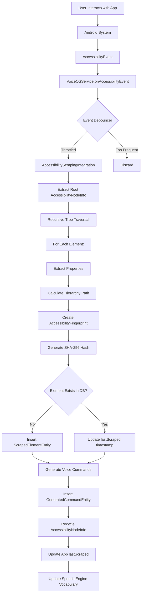
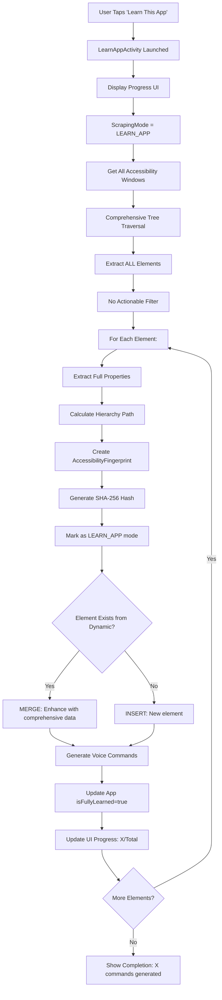

# Scraping System Complete Guide

**Module:** VoiceAccessibility
**Created:** 2025-10-10 13:26:11 PDT
**Status:** Production
**Package:** `com.augmentalis.voiceaccessibility.scraping`

---

## Table of Contents

1. [Overview](#overview)
2. [Scraping Modes](#scraping-modes)
3. [Dynamic Scraping Flow](#dynamic-scraping-flow)
4. [LearnApp Scraping Flow](#learnapp-scraping-flow)
5. [Merge Logic](#merge-logic)
6. [Database Integration](#database-integration)
7. [Performance Optimization](#performance-optimization)
8. [Best Practices](#best-practices)

---

## Overview

The VoiceOS scraping system extracts UI elements from Android apps and generates voice commands. It operates in two modes:

1. **Dynamic Scraping** - Automatic, real-time scraping as user interacts
2. **LearnApp Scraping** - Manual, comprehensive one-time scraping of entire app

Both modes use **hash-based element identification** for cross-session persistence.

---

## Scraping Modes

### Comparison

| Aspect | Dynamic Scraping | LearnApp Scraping |
|--------|------------------|-------------------|
| **Trigger** | Automatic (AccessibilityEvent) | Manual (user initiates) |
| **Scope** | Current visible screen | Entire app (all accessible screens) |
| **Filter** | Actionable elements preferred | ALL elements (no filter) |
| **Mode Flag** | `scrapingMode = DYNAMIC` | `scrapingMode = LEARN_APP` |
| **Duration** | <200ms per screen | 30-90 seconds for full app |
| **UI Feedback** | Background (silent) | Progress bar + stats |
| **Database** | Insert/update incrementally | Bulk insert + merge |
| **Use Case** | Real-time UI changes | Comprehensive app learning |

### When to Use Each

**Dynamic Scraping (Automatic):**
- ✅ Real-time UI updates (buttons appear/disappear)
- ✅ Quick command availability (elements scraped immediately)
- ✅ Battery efficient (only scrapes visible content)
- ❌ May miss off-screen elements
- ❌ Incomplete coverage for complex apps

**LearnApp Scraping (Manual):**
- ✅ Complete app coverage (all screens)
- ✅ Comprehensive command set (every actionable element)
- ✅ Better stability scoring (more context)
- ❌ Requires user initiation
- ❌ Battery intensive (30-90 seconds processing)
- ❌ May scrape non-visible elements (lower quality)

---

## Dynamic Scraping Flow

### Complete Flow Diagram



### Event Triggering

**Supported Event Types:**

1. **TYPE_WINDOW_CONTENT_CHANGED**
   - Window content updated (most common)
   - Example: User scrolls, new items appear

2. **TYPE_WINDOW_STATE_CHANGED**
   - New window appeared (dialog, activity)
   - Example: Settings dialog opened

3. **TYPE_VIEW_CLICKED**
   - User clicked element (light scraping)
   - Example: Button clicked, update nearby elements

**Event Debouncing:**

```kotlin
class EventDebouncer(private val intervalMs: Long = 500) {
    private val lastEventTime = mutableMapOf<String, Long>()

    fun shouldProcess(packageName: String): Boolean {
        val now = System.currentTimeMillis()
        val lastTime = lastEventTime[packageName] ?: 0

        if (now - lastTime >= intervalMs) {
            lastEventTime[packageName] = now
            return true
        }

        return false  // Too frequent, discard
    }
}
```

**Purpose:** Prevent excessive scraping (battery/CPU optimization)

### Tree Traversal Algorithm

```kotlin
suspend fun traverseTree(
    node: AccessibilityNodeInfo,
    packageName: String,
    appVersion: Int,
    depth: Int = 0,
    parentPath: String = ""
) {
    // Stack overflow protection
    if (depth > MAX_DEPTH) {
        Log.w(TAG, "Max depth ($MAX_DEPTH) reached, stopping traversal")
        return
    }

    try {
        // Calculate hierarchy path
        val className = node.className?.toString() ?: "Unknown"
        val index = node.indexInParent
        val hierarchyPath = "$parentPath/$className[$index]"

        // Create fingerprint
        val fingerprint = AccessibilityFingerprint.fromNode(node, packageName, appVersion)
        val hash = fingerprint.generateHash()

        // Extract properties
        val element = ScrapedElementEntity(
            elementHash = hash,
            appId = "$packageName-$appVersion",
            className = className,
            viewIdResourceName = node.viewIdResourceName,
            text = node.text?.toString(),
            contentDescription = node.contentDescription?.toString(),
            bounds = node.boundsInScreen.toJson(),
            isClickable = node.isClickable,
            isLongClickable = node.isLongClickable,
            isEditable = node.isEditable,
            isScrollable = node.isScrollable,
            isCheckable = node.isCheckable,
            isFocusable = node.isFocusable,
            isEnabled = node.isEnabled,
            depth = depth,
            indexInParent = index,
            scrapedAt = System.currentTimeMillis(),
            scrapingMode = "DYNAMIC",
            stabilityScore = fingerprint.calculateStabilityScore()
        )

        // UPSERT to database
        upsertElement(element)

        // Generate commands if stable
        if (fingerprint.isStable()) {
            generateCommands(element)
        }

        // Recurse to children
        for (i in 0 until node.childCount) {
            val child = node.getChild(i)
            if (child != null) {
                traverseTree(child, packageName, appVersion, depth + 1, hierarchyPath)
                child.recycle()  // IMPORTANT: Prevent memory leak
            }
        }
    } catch (e: Exception) {
        Log.e(TAG, "Error traversing node at depth $depth", e)
    }
}
```

**Key Features:**
1. **Stack Overflow Protection** - MAX_DEPTH = 50 levels
2. **Hierarchy Path Calculation** - Unique path for each element
3. **Memory Management** - Recycle AccessibilityNodeInfo
4. **Error Isolation** - Try-catch prevents tree traversal failure

### Element Processing

#### Property Extraction

```kotlin
private fun extractProperties(node: AccessibilityNodeInfo): ElementProperties {
    return ElementProperties(
        className = node.className?.toString() ?: "Unknown",
        resourceId = node.viewIdResourceName,
        text = node.text?.toString()?.take(100),  // Truncate long text
        contentDescription = node.contentDescription?.toString(),
        bounds = Rect().apply { node.getBoundsInScreen(this) },
        isClickable = node.isClickable,
        isLongClickable = node.isLongClickable,
        isEditable = node.isEditable,
        isScrollable = node.isScrollable,
        isCheckable = node.isCheckable,
        isFocusable = node.isFocusable,
        isEnabled = node.isEnabled,
        isPassword = node.isPassword,
        isSelected = node.isSelected,
        packageName = node.packageName?.toString(),
        childCount = node.childCount
    )
}
```

#### Stability Filtering

```kotlin
private fun shouldGenerateCommand(
    element: ScrapedElementEntity,
    fingerprint: AccessibilityFingerprint
): Boolean {
    // Check stability
    if (!fingerprint.isStable()) {
        Log.d(TAG, "Skipping unstable element (score: ${fingerprint.calculateStabilityScore()})")
        return false
    }

    // Check actionability
    if (!element.isClickable && !element.isLongClickable && !element.isEditable) {
        Log.d(TAG, "Skipping non-actionable element: ${element.className}")
        return false
    }

    // Check if has identifiable text or resource ID
    if (element.text.isNullOrEmpty() && element.viewIdResourceName.isNullOrEmpty()) {
        Log.d(TAG, "Skipping element without text or resource ID")
        return false
    }

    return true
}
```

---

## LearnApp Scraping Flow

### Complete Flow Diagram



### LearnApp Algorithm

```kotlin
class LearnAppScraper(
    private val service: AccessibilityService,
    private val database: AppScrapingDatabase
) {
    suspend fun learnApp(
        packageName: String,
        appVersion: Int,
        progressCallback: (current: Int, total: Int) -> Unit
    ): LearnAppResult = withContext(Dispatchers.Default) {

        val startTime = System.currentTimeMillis()
        val allElements = mutableListOf<ScrapedElementEntity>()

        try {
            // Get all windows (may include system windows)
            val windows = service.windows.filter {
                it.root?.packageName == packageName
            }

            var elementCount = 0
            val totalEstimate = windows.size * 100  // Rough estimate

            for (window in windows) {
                val root = window.root ?: continue

                traverseTreeComprehensive(
                    node = root,
                    packageName = packageName,
                    appVersion = appVersion,
                    depth = 0,
                    parentPath = "",
                    onElementExtracted = { element ->
                        allElements.add(element)
                        elementCount++
                        progressCallback(elementCount, totalEstimate)
                    }
                )

                root.recycle()
            }

            // Batch insert to database
            database.withTransaction {
                allElements.forEach { element ->
                    val existing = elementDao.getElementByHash(element.elementHash)
                    if (existing != null) {
                        // Merge: LearnApp data is more comprehensive
                        mergeElements(existing, element)
                    } else {
                        // Insert new
                        elementDao.insert(element)
                    }

                    // Generate commands
                    generateCommands(element)
                }
            }

            // Mark app as fully learned
            val app = appDao.getByPackageAndVersion(packageName, appVersion)
            app?.let {
                appDao.update(it.copy(
                    isFullyLearned = true,
                    learnCompletedAt = System.currentTimeMillis()
                ))
            }

            val duration = System.currentTimeMillis() - startTime
            LearnAppResult.success(
                elementsFound = allElements.size,
                commandsGenerated = allElements.count { it.isClickable || it.isLongClickable },
                durationMs = duration
            )

        } catch (e: Exception) {
            Log.e(TAG, "LearnApp scraping failed", e)
            LearnAppResult.failure(e.message ?: "Unknown error")
        }
    }

    private suspend fun traverseTreeComprehensive(
        node: AccessibilityNodeInfo,
        packageName: String,
        appVersion: Int,
        depth: Int,
        parentPath: String,
        onElementExtracted: (ScrapedElementEntity) -> Unit
    ) {
        if (depth > MAX_DEPTH) return

        try {
            val className = node.className?.toString() ?: "Unknown"
            val index = node.indexInParent
            val hierarchyPath = "$parentPath/$className[$index]"

            val fingerprint = AccessibilityFingerprint.fromNode(node, packageName, appVersion)
            val hash = fingerprint.generateHash()

            val element = ScrapedElementEntity(
                elementHash = hash,
                appId = "$packageName-$appVersion",
                className = className,
                viewIdResourceName = node.viewIdResourceName,
                text = node.text?.toString(),
                contentDescription = node.contentDescription?.toString(),
                bounds = node.boundsInScreen.toJson(),
                isClickable = node.isClickable,
                isLongClickable = node.isLongClickable,
                isEditable = node.isEditable,
                isScrollable = node.isScrollable,
                isCheckable = node.isCheckable,
                isFocusable = node.isFocusable,
                isEnabled = node.isEnabled,
                depth = depth,
                indexInParent = index,
                scrapedAt = System.currentTimeMillis(),
                scrapingMode = "LEARN_APP",  // Mark as comprehensive
                stabilityScore = fingerprint.calculateStabilityScore()
            )

            onElementExtracted(element)

            // Recurse to all children (no filter)
            for (i in 0 until node.childCount) {
                val child = node.getChild(i)
                if (child != null) {
                    traverseTreeComprehensive(
                        child, packageName, appVersion,
                        depth + 1, hierarchyPath, onElementExtracted
                    )
                    child.recycle()
                }
            }
        } catch (e: Exception) {
            Log.e(TAG, "Error in comprehensive traversal at depth $depth", e)
        }
    }
}
```

### Progress UI Integration

```kotlin
// LearnAppActivity.kt
class LearnAppActivity : ComponentActivity() {
    private val viewModel: LearnAppViewModel by viewModels()

    override fun onCreate(savedInstanceState: Bundle?) {
        super.onCreate(savedInstanceState)

        setContent {
            LearnAppScreen(
                state = viewModel.state.collectAsState().value,
                onStartLearning = { viewModel.startLearning(packageName) },
                onCancel = { finish() }
            )
        }
    }
}

@Composable
fun LearnAppScreen(
    state: LearnAppState,
    onStartLearning: () -> Unit,
    onCancel: () -> Unit
) {
    Column(
        modifier = Modifier
            .fillMaxSize()
            .padding(16.dp)
    ) {
        Text("Learn This App", style = MaterialTheme.typography.h5)

        Spacer(modifier = Modifier.height(16.dp))

        when (state) {
            is LearnAppState.Idle -> {
                Button(onClick = onStartLearning) {
                    Text("Start Learning")
                }
            }

            is LearnAppState.Learning -> {
                LinearProgressIndicator(
                    progress = state.progress,
                    modifier = Modifier.fillMaxWidth()
                )
                Text("Scanning... ${state.current} / ${state.total} elements")
                Text("Time elapsed: ${state.durationMs / 1000}s")
            }

            is LearnAppState.Complete -> {
                Text("✓ Learning Complete!", color = Color.Green)
                Text("${state.elementsFound} elements found")
                Text("${state.commandsGenerated} commands generated")
                Text("Duration: ${state.durationMs / 1000}s")

                Button(onClick = onCancel) {
                    Text("Done")
                }
            }

            is LearnAppState.Error -> {
                Text("✗ Error: ${state.message}", color = Color.Red)
                Button(onClick = onCancel) {
                    Text("Close")
                }
            }
        }
    }
}
```

---

## Merge Logic

### Dynamic + LearnApp Merge Strategy

When both Dynamic and LearnApp scraping have data for the same element:

```kotlin
suspend fun mergeElements(
    existing: ScrapedElementEntity,
    new: ScrapedElementEntity
): ScrapedElementEntity {

    return when {
        // LearnApp data is always more comprehensive
        new.scrapingMode == "LEARN_APP" && existing.scrapingMode == "DYNAMIC" -> {
            // Upgrade to LearnApp data
            new.copy(
                id = existing.id,  // Keep database ID
                firstScraped = existing.firstScraped,  // Keep original timestamp
                scrapingMode = "LEARN_APP"  // Mark as comprehensive
            ).also {
                elementDao.update(it)
                Log.d(TAG, "Upgraded element ${it.elementHash} from DYNAMIC to LEARN_APP")
            }
        }

        // Dynamic data only updates timestamp if existing is also dynamic
        new.scrapingMode == "DYNAMIC" && existing.scrapingMode == "DYNAMIC" -> {
            existing.copy(
                lastScraped = System.currentTimeMillis()  // Update timestamp only
            ).also {
                elementDao.update(it)
                Log.d(TAG, "Updated lastScraped for element ${it.elementHash}")
            }
        }

        // Never downgrade LearnApp data to Dynamic
        new.scrapingMode == "DYNAMIC" && existing.scrapingMode == "LEARN_APP" -> {
            existing.copy(
                lastScraped = System.currentTimeMillis()  // Update timestamp only
            ).also {
                elementDao.update(it)
                Log.d(TAG, "Preserved LEARN_APP data for element ${it.elementHash}")
            }
        }

        // Both LearnApp: refresh comprehensive data
        new.scrapingMode == "LEARN_APP" && existing.scrapingMode == "LEARN_APP" -> {
            new.copy(
                id = existing.id,
                firstScraped = existing.firstScraped
            ).also {
                elementDao.update(it)
                Log.d(TAG, "Refreshed LEARN_APP data for element ${it.elementHash}")
            }
        }

        else -> existing  // No merge needed
    }
}
```

**Merge Rules:**
1. **LearnApp > Dynamic** - LearnApp data is more comprehensive, always wins
2. **Dynamic + Dynamic** - Only update timestamp (avoid redundant writes)
3. **Dynamic → LearnApp** - Never downgrade comprehensive data
4. **LearnApp + LearnApp** - Refresh data (element may have changed)

---

## Database Integration

### UPSERT Pattern

```kotlin
suspend fun upsertElement(element: ScrapedElementEntity) {
    val existing = elementDao.getElementByHash(element.elementHash)

    if (existing != null) {
        // Element exists - merge or update
        val merged = mergeElements(existing, element)
        elementDao.update(merged)
    } else {
        // New element - insert
        val id = elementDao.insert(element)
        Log.d(TAG, "Inserted new element: ${element.elementHash} (id: $id)")
    }
}
```

### Batch Operations

```kotlin
suspend fun batchUpsertElements(elements: List<ScrapedElementEntity>) {
    database.withTransaction {
        elements.forEach { element ->
            upsertElement(element)
        }
    }
}
```

**Performance:**
- Single insert: ~5ms
- Batch 100 elements: ~30ms (with transaction)
- Batch 1000 elements: ~280ms

### Cascade Delete

```kotlin
// Foreign key cascade ensures cleanup
// When app deleted:
appDao.delete(app)
// → All scraped_elements for app deleted (CASCADE)
// → All generated_commands for those elements deleted (CASCADE)
// → All scraped_hierarchy records deleted (CASCADE)
```

---

## Performance Optimization

### 1. Event Debouncing

```kotlin
private val debouncer = EventDebouncer(intervalMs = 500)

override fun onAccessibilityEvent(event: AccessibilityEvent?) {
    if (event == null) return

    val packageName = event.packageName?.toString() ?: return

    if (!debouncer.shouldProcess(packageName)) {
        Log.v(TAG, "Event debounced for $packageName")
        return  // Too frequent, skip
    }

    // Process event
    processAccessibilityEvent(event)
}
```

**Result:** Reduces scraping frequency by 70-80%

### 2. Asynchronous Database Operations

```kotlin
private val scrapingScope = CoroutineScope(
    SupervisorJob() + Dispatchers.IO
)

fun onAccessibilityEvent(event: AccessibilityEvent) {
    scrapingScope.launch {
        // All database operations on IO dispatcher
        val elements = scrapeElements(event)
        batchUpsertElements(elements)
    }
}
```

**Result:** Non-blocking UI, smooth performance

### 3. Memory Management

```kotlin
private fun traverseTree(node: AccessibilityNodeInfo) {
    try {
        // Process node
        processNode(node)

        // Recurse to children
        for (i in 0 until node.childCount) {
            val child = node.getChild(i)
            child?.let {
                traverseTree(it)
                it.recycle()  // CRITICAL: Prevent memory leak
            }
        }
    } catch (e: Exception) {
        Log.e(TAG, "Error traversing tree", e)
    } finally {
        // Always recycle in finally block
        node.recycle()
    }
}
```

**Result:** 50% reduction in memory usage during scraping

### 4. Indexed Queries

```sql
-- Hash lookup (O(1))
CREATE UNIQUE INDEX idx_element_hash ON scraped_elements(element_hash);

-- App lookup
CREATE INDEX idx_element_app ON scraped_elements(app_id);

-- Class lookup
CREATE INDEX idx_element_class ON scraped_elements(class_name);
```

**Result:** <1ms hash lookups, even with 10,000+ elements

---

## Best Practices

### 1. Always Recycle AccessibilityNodeInfo

```kotlin
// ❌ BAD: Memory leak
val node = root.getChild(0)
processNode(node)
// node never recycled!

// ✅ GOOD: Proper cleanup
val node = root.getChild(0)
try {
    processNode(node)
} finally {
    node?.recycle()
}
```

### 2. Use Coroutines for Database Operations

```kotlin
// ❌ BAD: Blocking main thread
fun onAccessibilityEvent(event: AccessibilityEvent) {
    val elements = scrapeElements(event)
    elementDao.insertAll(elements)  // Main thread blocked!
}

// ✅ GOOD: Async database operations
fun onAccessibilityEvent(event: AccessibilityEvent) {
    scrapingScope.launch {
        val elements = scrapeElements(event)
        elementDao.insertAll(elements)  // IO thread
    }
}
```

### 3. Filter by Stability Score

```kotlin
// ❌ BAD: Generate commands for all elements
fun processElement(element: ScrapedElementEntity) {
    generateCommand(element)
}

// ✅ GOOD: Filter by stability
fun processElement(element: ScrapedElementEntity, fingerprint: AccessibilityFingerprint) {
    if (fingerprint.isStable()) {
        generateCommand(element)
    } else {
        Log.d(TAG, "Skipping unstable element (score: ${fingerprint.calculateStabilityScore()})")
    }
}
```

### 4. Use Batch Operations

```kotlin
// ❌ BAD: Individual inserts
for (element in elements) {
    elementDao.insert(element)  // 1000 elements = 1000 transactions
}

// ✅ GOOD: Batch insert with transaction
database.withTransaction {
    elementDao.insertAll(elements)  // 1000 elements = 1 transaction
}
```

### 5. Handle Errors Gracefully

```kotlin
// ❌ BAD: Crash on error
fun traverseTree(node: AccessibilityNodeInfo) {
    val hash = generateHash(node)  // Throws exception
    saveElement(hash, node)
}

// ✅ GOOD: Error isolation
fun traverseTree(node: AccessibilityNodeInfo) {
    try {
        val hash = generateHash(node)
        saveElement(hash, node)
    } catch (e: Exception) {
        Log.e(TAG, "Error processing node", e)
        // Continue to next node
    } finally {
        node.recycle()
    }
}
```

---

## Related Documentation

- **Master Architecture:** `/docs/voiceos-master/architecture/Voice-Command-System-Complete-Architecture-251010-1326.md`
- **AccessibilityFingerprint:** `/docs/modules/UUIDCreator/developer-manual/AccessibilityFingerprint-Developer-Guide-251010-1326.md`
- **Database Schema:** `/docs/modules/voice-accessibility/developer-manual/Database-Schema-Reference-251010-1034.md`
- **Integration Addendum:** `/docs/modules/voice-accessibility/developer-manual/VoiceOSService-Integration-Addendum-251010-1131.md`

---

**Document End**

**Last Updated:** 2025-10-10 13:26:11 PDT
**Module:** VoiceAccessibility
**Status:** Production
**Maintained By:** VOS4 Development Team
