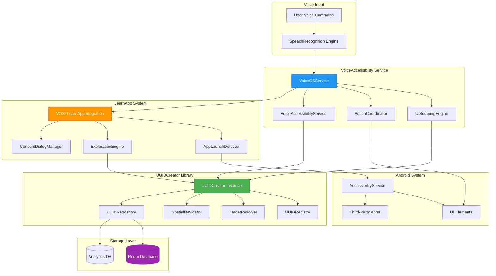
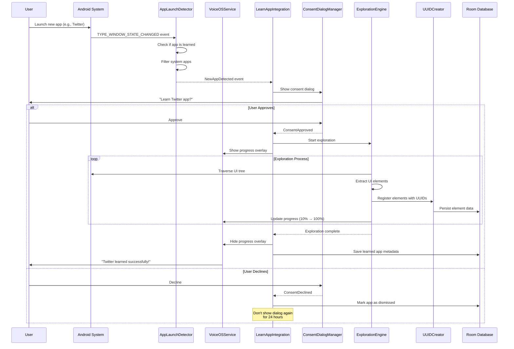
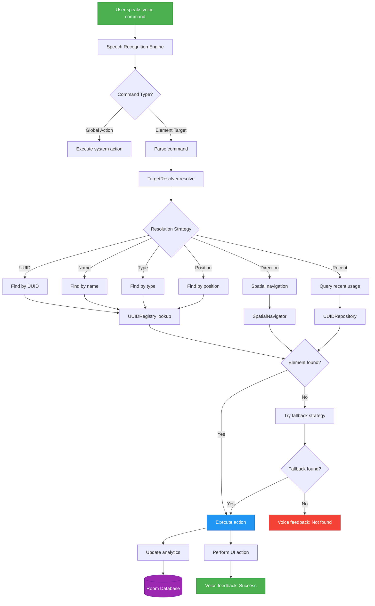
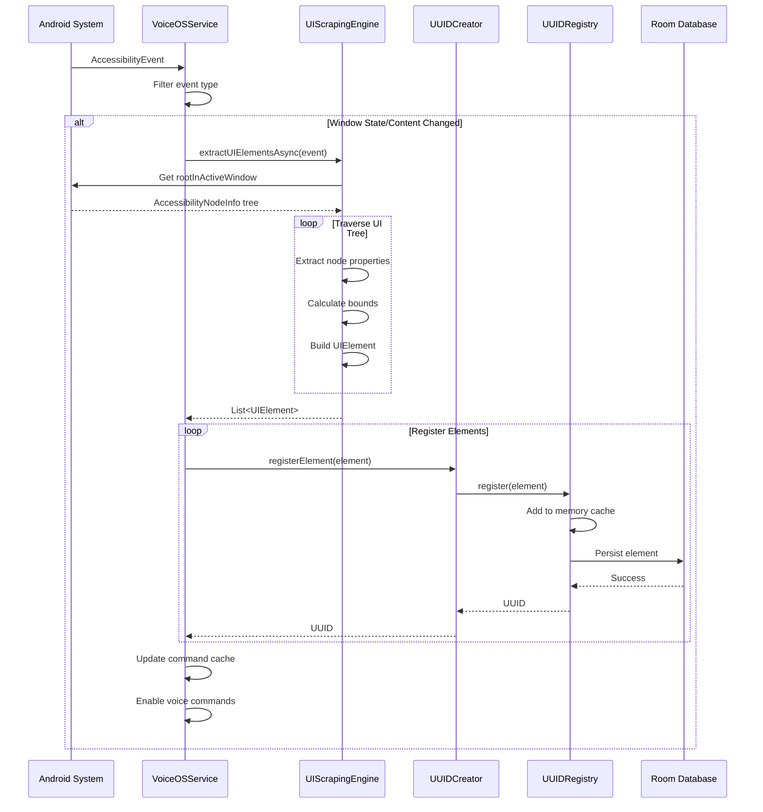

# UUIDCreator Integration with VoiceAccessibility

**Document Type:** Implementation Guide
**Last Updated:** 2025-10-09 02:58:06 PDT
**Status:** Complete Integration
**Module:** VoiceAccessibility + UUIDCreator
**Author:** Technical Documentation Specialist

---

## Table of Contents

1. [Overview](#overview)
2. [Architecture](#architecture)
3. [Integration Points](#integration-points)
4. [API Usage Examples](#api-usage-examples)
5. [Voice Command System](#voice-command-system)
6. [LearnApp Integration Flow](#learnapp-integration-flow)
7. [Data Flow](#data-flow)
8. [Troubleshooting](#troubleshooting)
9. [Performance Metrics](#performance-metrics)

---

## Overview

The UUIDCreator integration provides a comprehensive voice-controlled UI targeting system within VoiceAccessibility. This integration enables:

- **Automatic UUID Generation:** Every UI element is assigned a unique identifier
- **Voice-Based Targeting:** Users can target elements by name, type, position, or UUID
- **Spatial Navigation:** Navigate between elements using directional commands
- **Third-Party App Learning:** Automatically learn and generate UUIDs for third-party apps
- **Persistent Storage:** UUIDs are persisted in Room database for cross-session access

### Key Benefits

- **Framework-Agnostic:** Works with any Android UI framework
- **Voice-First Design:** Optimized for hands-free voice control
- **Intelligent Targeting:** Multiple resolution strategies with fallback support
- **High Performance:** Lazy loading and efficient caching
- **Zero Configuration:** Automatic initialization and setup

---

## Architecture

The integration consists of three main components:

### 1. UUIDCreator Core

**Location:** `/modules/libraries/UUIDCreator/`

**Responsibilities:**
- UUID generation and registration
- Element targeting and resolution
- Spatial navigation
- Room database persistence
- Analytics and tracking

**Key Classes:**
- `UUIDCreator` - Main library class, singleton instance
- `UUIDRegistry` - In-memory registry with database sync
- `TargetResolver` - Multi-strategy element targeting
- `SpatialNavigator` - Directional navigation
- `UUIDRepository` - Room database access layer

### 2. VoiceAccessibility Service

**Location:** `/modules/apps/VoiceAccessibility/`

**Responsibilities:**
- Accessibility event monitoring
- UI tree traversal and scraping
- Element registration with UUIDs
- Voice command processing
- User interaction handling

**Key Classes:**
- `VoiceOSService` - Main accessibility service
- `VoiceAccessibilityService` - UUID integration service
- `UIScrapingEngine` - Extracts UI elements from accessibility tree
- `ActionCoordinator` - Executes actions on elements

### 3. LearnApp Integration

**Location:** `/modules/libraries/UUIDCreator/src/main/java/com/augmentalis/learnapp/`

**Responsibilities:**
- Third-party app detection
- User consent management
- Automated UI exploration
- UUID generation for external apps
- Progress tracking and feedback

**Key Classes:**
- `VOS4LearnAppIntegration` - Main integration adapter
- `AppLaunchDetector` - Monitors for new app launches
- `ExplorationEngine` - Automated UI exploration
- `ConsentDialogManager` - User consent flow
- `ProgressOverlayManager` - Visual feedback

---

## Integration Points

### System Architecture Diagram



### Key Integration Points

#### 1. Service Initialization

**File:** `VoiceAccessibilityService.kt`

```kotlin
override fun onCreate() {
    super.onCreate()

    // Initialize UUIDCreator singleton
    uuidCreator = try {
        UUIDCreator.getInstance()
    } catch (e: IllegalStateException) {
        UUIDCreator.initialize(applicationContext)
    }

    Log.i(TAG, "UUIDCreator initialized successfully")
}
```

#### 2. Accessibility Event Processing

**File:** `VoiceAccessibilityService.kt`

```kotlin
override fun onAccessibilityEvent(event: AccessibilityEvent?) {
    event ?: return

    when (event.eventType) {
        TYPE_WINDOW_STATE_CHANGED,
        TYPE_WINDOW_CONTENT_CHANGED -> {
            serviceScope.launch {
                processAccessibilityTree(event)
            }
        }
    }
}

private suspend fun processAccessibilityTree(event: AccessibilityEvent) {
    val rootNode = rootInActiveWindow ?: return

    // Traverse tree and register elements
    traverseAndRegister(rootNode)
}
```

#### 3. Element Registration

```kotlin
private fun registerElement(node: AccessibilityNodeInfo) {
    val element = UUIDElement(
        uuid = UUIDCreator.generate(),
        name = node.text?.toString(),
        type = node.className?.toString() ?: "unknown",
        position = UUIDPosition(
            x = rect.centerX().toFloat(),
            y = rect.centerY().toFloat()
        ),
        metadata = UUIDMetadata(
            attributes = mapOf(
                "viewIdResourceName" to (node.viewIdResourceName ?: ""),
                "contentDescription" to (node.contentDescription?.toString() ?: "")
            ),
            accessibility = UUIDAccessibility(
                isAccessible = true,
                role = node.className?.toString() ?: ""
            )
        )
    )

    uuidCreator.registerElement(element)
}
```

#### 4. Voice Command Resolution

**File:** `VoiceOSService.kt`

```kotlin
private fun handleVoiceCommand(command: String, confidence: Float) {
    if (confidence < 0.5f) return

    serviceScope.launch {
        // Process through UUIDCreator
        val result = uuidCreator.processVoiceCommand(command)

        if (result.success && result.targetUUID != null) {
            val element = uuidCreator.findByUUID(result.targetUUID)
            element?.position?.let { pos ->
                performClick(pos.x.toInt(), pos.y.toInt())
            }
        }
    }
}
```

#### 5. LearnApp Integration

**File:** `VoiceOSService.kt`

```kotlin
private fun initializeLearnAppIntegration() {
    learnAppIntegration = VOS4LearnAppIntegration.initialize(
        context = applicationContext,
        accessibilityService = this
    )

    Log.i(TAG, "LearnApp integration initialized")
}

override fun onAccessibilityEvent(event: AccessibilityEvent) {
    // Forward events to LearnApp for app detection
    learnAppIntegration?.onAccessibilityEvent(event)

    // ... rest of event processing
}
```

---

## API Usage Examples

### Basic Element Registration

```kotlin
// Get UUIDCreator instance
val uuidCreator = UUIDCreator.getInstance()

// Create and register element
val element = UUIDElement(
    name = "Login Button",
    type = "button",
    position = UUIDPosition(x = 540f, y = 960f),
    actions = mapOf(
        "click" to { params ->
            // Perform click action
            performClick(540, 960)
        }
    )
)

val uuid = uuidCreator.registerElement(element)
Log.d(TAG, "Registered element with UUID: $uuid")
```

### Finding Elements

```kotlin
// Find by UUID
val element = uuidCreator.findByUUID("abc-123-def")

// Find by name
val loginButtons = uuidCreator.findByName("login")

// Find by type
val allButtons = uuidCreator.findByType("button")

// Find by position
val firstElement = uuidCreator.findByPosition(1)
val lastElement = uuidCreator.findByPosition(-1)
```

### Voice Command Processing

```kotlin
// Process voice command
val result = uuidCreator.processVoiceCommand("click login button")

when {
    result.success -> {
        Log.i(TAG, "Command executed: ${result.message}")
        Log.i(TAG, "Target UUID: ${result.targetUUID}")
        Log.i(TAG, "Execution time: ${result.executionTime}ms")
    }
    else -> {
        Log.e(TAG, "Command failed: ${result.error}")
    }
}
```

### Spatial Navigation

```kotlin
// Navigate from current element
val currentUUID = "abc-123"

// Move left
val leftElement = uuidCreator.findInDirection(currentUUID, "left")

// Move right
val rightElement = uuidCreator.findInDirection(currentUUID, "right")

// Move up/down
val upElement = uuidCreator.findInDirection(currentUUID, "up")
val downElement = uuidCreator.findInDirection(currentUUID, "down")

// Sequential navigation
val nextElement = uuidCreator.findInDirection(currentUUID, "next")
val previousElement = uuidCreator.findInDirection(currentUUID, "previous")
```

### Recent Element Access

```kotlin
// Get recently accessed elements
val recentElements = uuidCreator.processVoiceCommand("recent")

// Get recent buttons
val recentButtons = uuidCreator.processVoiceCommand("recent button")

// Get last 5 accessed elements
val last5 = uuidCreator.processVoiceCommand("recent 5")

// Get last 3 text fields
val recent3Fields = uuidCreator.processVoiceCommand("recent 3 text field")
```

---

## Voice Command System

### Supported Command Patterns

#### 1. Direct UUID Targeting

```
"click element uuid abc-123"
"select uuid def-456"
"focus element with uuid xyz-789"
```

**Use Case:** Precise targeting when UUID is known
**Confidence:** 1.0 (100%)

#### 2. Name-Based Targeting

```
"click login button"
"select username field"
"open settings menu"
"focus search box"
```

**Use Case:** Natural language targeting
**Confidence:** 0.8-1.0 (80-100%)
**Fallback:** Partial name matching (0.6 confidence)

#### 3. Type-Based Targeting

```
"select first button"
"click text field"
"focus checkbox"
"select image view"
```

**Use Case:** Type-specific selection
**Confidence:** 0.9 (90%)

#### 4. Position-Based Targeting

```
"select first"
"click second button"
"focus third text field"
"select last"
```

**Use Case:** Ordinal selection
**Confidence:** 1.0 (100%)
**Positions:** first, second, third, fourth, fifth, last, or numbers

#### 5. Directional Navigation

```
"move left"
"go right"
"move up"
"go down"
"next element"
"previous element"
"go to first"
"go to last"
```

**Use Case:** Spatial navigation
**Confidence:** 0.9-1.0 (90-100%)

#### 6. Recent Element Access

```
"recent"                  → Last 10 accessed elements
"recent button"           → Recent buttons only
"recent 5"                → Last 5 accessed elements
"recent 3 button"         → Last 3 accessed buttons
"recent text field"       → Recent text fields
```

**Use Case:** Quick access to previously used elements
**Confidence:** 0.85-0.9 (85-90%)

#### 7. Global Actions

```
"go back"
"go home"
"recent apps"
"notifications"
"quick settings"
"power menu"
"screenshot"
```

**Use Case:** System-level navigation
**Confidence:** 1.0 (100%)

### Voice Command Examples

```kotlin
// Example 1: Login workflow
uuidCreator.processVoiceCommand("click username field")
// User enters username via voice keyboard
uuidCreator.processVoiceCommand("next")
// User enters password
uuidCreator.processVoiceCommand("click login button")

// Example 2: Form navigation
uuidCreator.processVoiceCommand("select first text field")
uuidCreator.processVoiceCommand("next")
uuidCreator.processVoiceCommand("next")
uuidCreator.processVoiceCommand("click submit button")

// Example 3: Recent access
uuidCreator.processVoiceCommand("recent button")  // Shows recent buttons
uuidCreator.processVoiceCommand("select first")    // Select from recent list

// Example 4: Spatial navigation
uuidCreator.processVoiceCommand("click profile icon")
uuidCreator.processVoiceCommand("move down")       // Navigate to next element
uuidCreator.processVoiceCommand("click")           // Activate current element
```

---

## LearnApp Integration Flow

### Third-Party App Learning Process



### Exploration States

The exploration engine transitions through these states:

1. **Idle** - No exploration in progress
2. **Running** - Active exploration with progress updates
3. **PausedForLogin** - Waiting for user authentication
4. **PausedByUser** - User manually paused
5. **Completed** - Successfully finished
6. **Failed** - Error occurred during exploration

### Progress Feedback

```kotlin
// Monitor exploration state
learnAppIntegration.getExplorationState().collect { state ->
    when (state) {
        is ExplorationState.Running -> {
            Log.i(TAG, "Exploration progress: ${state.progress}%")
            Log.i(TAG, "Elements discovered: ${state.stats.elementsDiscovered}")
            Log.i(TAG, "Screens explored: ${state.stats.screensExplored}")
        }
        is ExplorationState.Completed -> {
            Log.i(TAG, "Exploration complete!")
            Log.i(TAG, "Total elements: ${state.stats.elementsDiscovered}")
            Log.i(TAG, "Total screens: ${state.stats.screensExplored}")
            Log.i(TAG, "Duration: ${state.stats.explorationDuration}ms")
        }
    }
}
```

### User Control

```kotlin
// Pause exploration
learnAppIntegration.pauseExploration()

// Resume exploration
learnAppIntegration.resumeExploration()

// Stop exploration
learnAppIntegration.stopExploration()
```

---

## Data Flow

### Complete Data Flow Diagram



### Accessibility Event Flow



---

## Troubleshooting

### Common Issues and Solutions

#### Issue 1: UUIDCreator Not Initialized

**Symptoms:**
```
IllegalStateException: UUIDCreator not initialized
```

**Solution:**
```kotlin
// Ensure initialization in Application or Service onCreate()
class VOS4Application : Application() {
    override fun onCreate() {
        super.onCreate()
        UUIDCreator.initialize(this)
    }
}
```

#### Issue 2: Elements Not Registered

**Symptoms:**
- Voice commands fail to find elements
- Empty registry

**Diagnosis:**
```kotlin
val stats = uuidCreator.getStats()
Log.d(TAG, "Registry stats: $stats")
Log.d(TAG, "Element count: ${stats.totalElements}")
Log.d(TAG, "Enabled count: ${stats.enabledElements}")
```

**Solution:**
- Verify accessibility event processing is active
- Check accessibility permissions are granted
- Ensure UI tree traversal is working
- Verify elements have non-null names or types

#### Issue 3: Voice Commands Not Recognized

**Symptoms:**
- Commands processed but no action taken
- Low confidence scores

**Diagnosis:**
```kotlin
val result = uuidCreator.processVoiceCommand(command)
Log.d(TAG, "Result: ${result.success}")
Log.d(TAG, "Message: ${result.message}")
Log.d(TAG, "Target: ${result.targetUUID}")
Log.d(TAG, "Time: ${result.executionTime}ms")
```

**Solution:**
- Check command syntax matches supported patterns
- Verify element names match command
- Use more specific commands (e.g., "click login button" vs "login")
- Try alternative targeting (position, type, UUID)

#### Issue 4: Database Errors

**Symptoms:**
```
SQLiteException: table not found
```

**Solution:**
```kotlin
// Force database recreation (debug only)
context.deleteDatabase("uuid_creator_database")
UUIDCreator.initialize(context)
```

#### Issue 5: LearnApp Integration Not Working

**Symptoms:**
- New apps not detected
- Consent dialog not showing

**Diagnosis:**
```kotlin
learnAppIntegration?.getExplorationState()?.collect { state ->
    Log.d(TAG, "Exploration state: $state")
}
```

**Solution:**
- Verify LearnApp integration initialized
- Check accessibility service is running
- Ensure app is not a system app
- Verify app not already learned or dismissed

### Debug Logging

Enable verbose logging for detailed diagnostics:

```kotlin
// In VoiceOSService.kt
private val config = ServiceConfiguration.loadFromPreferences(this).copy(
    verboseLogging = true
)

// In UUIDCreator
UUIDCreator.getInstance().apply {
    // Enable debug mode if available
}
```

### Performance Monitoring

```kotlin
// Get performance metrics
val stats = uuidCreator.getStats()
Log.i(TAG, """
    === UUIDCreator Performance ===
    Total Elements: ${stats.totalElements}
    Enabled Elements: ${stats.enabledElements}
    Cache Hit Rate: ${stats.cacheHitRate}%
    Avg Query Time: ${stats.avgQueryTimeMs}ms
    Memory Usage: ${stats.memoryUsageBytes / 1024}KB
""".trimIndent())
```

---

## Performance Metrics

### Expected Performance

| Metric | Target | Typical |
|--------|--------|---------|
| Element Registration | < 10ms | 3-5ms |
| UUID Lookup | < 5ms | 1-2ms |
| Name Search | < 20ms | 8-12ms |
| Voice Command Processing | < 100ms | 40-60ms |
| Spatial Navigation | < 15ms | 5-8ms |
| Database Write | < 50ms | 20-30ms |
| Database Read | < 20ms | 5-10ms |
| UI Tree Traversal | < 200ms | 80-120ms |
| LearnApp Exploration | 30-60s | 45s |

### Memory Usage

| Component | Memory | Notes |
|-----------|--------|-------|
| UUIDCreator Instance | ~2MB | Singleton with lazy loading |
| Registry Cache | ~5-10MB | 1000-2000 elements |
| Database | ~1-5MB | Depends on element count |
| LearnApp Integration | ~3MB | During exploration |
| Total VoiceAccessibility | ~15-25MB | Including all components |

### Optimization Tips

1. **Lazy Loading**
   ```kotlin
   // UUIDs loaded on-demand
   val uuidCreator by lazy { UUIDCreator.getInstance() }
   ```

2. **Batch Registration**
   ```kotlin
   // Register multiple elements efficiently
   val elements = extractAllElements()
   elements.forEach { uuidCreator.registerElement(it) }
   ```

3. **Cache Management**
   ```kotlin
   // Clear old entries periodically
   serviceScope.launch {
       delay(300000) // 5 minutes
       repository.clearOldEntries(maxAge = 3600000) // 1 hour
   }
   ```

4. **Event Debouncing**
   ```kotlin
   // Prevent excessive processing
   private val eventDebouncer = Debouncer(1000L)

   if (eventDebouncer.shouldProceed(key)) {
       processEvent(event)
   }
   ```

---

## Related Documentation

- [UUIDCreator Module Status](/coding/STATUS/UUIDCreator-Status.md)
- [VoiceAccessibility Module Status](/coding/STATUS/VoiceAccessibility-Status.md)
- [Voice Control Usage Guide](/docs/voiceos-master/guides/voice-control-usage-guide.md)
- [UUIDCreator Architecture](/docs/modules/UUIDCreator/architecture/ARCHITECTURE-VISUAL-SUMMARY.md)
- [LearnApp Integration Guide](/docs/modules/UUIDCreator/UUIDCreator+Learnapp.md)

---

**Document Status:** ✅ Complete
**Review Status:** Pending peer review
**Next Update:** When integration changes occur
