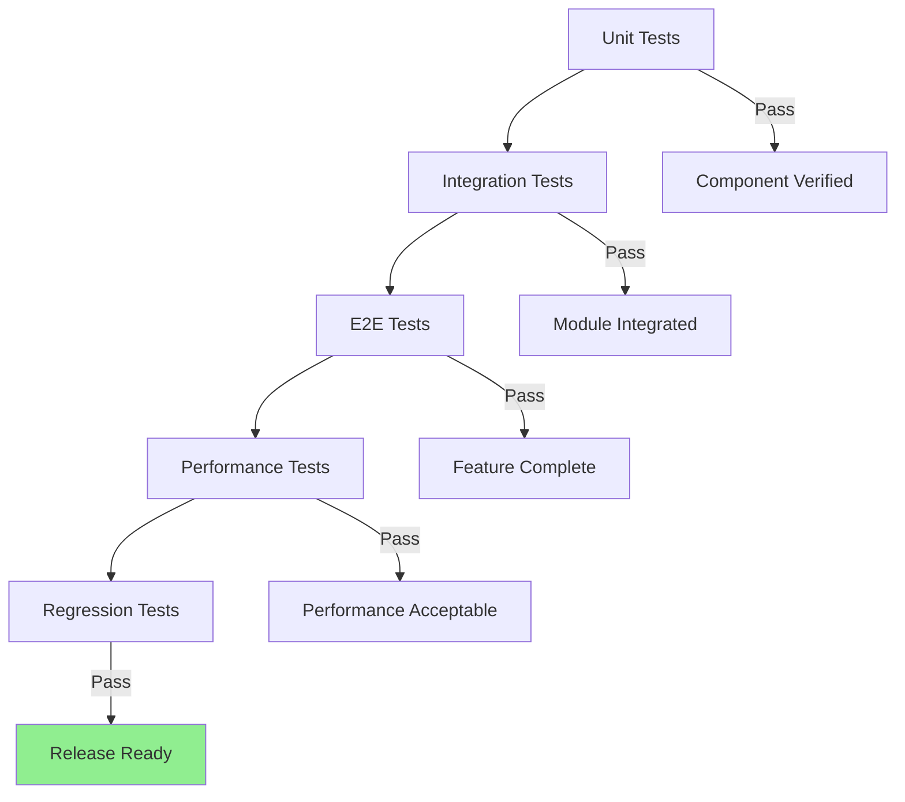

# Hash-Based Persistence E2E Test Plan

**Document Type:** Test Plan
**Module:** VoiceAccessibility
**Created:** 2025-10-10 06:37:48 PDT
**Author:** VOS4 Testing Team
**Copyright:** (C) Manoj Jhawar/Aman Jhawar, Intelligent Devices LLC
**Test Level:** End-to-End Integration
**Version:** 2.0.0

---

## Table of Contents

1. [Overview](#overview)
2. [Test Objectives](#test-objectives)
3. [Test Environment](#test-environment)
4. [Test Scenarios](#test-scenarios)
5. [Test Data Setup](#test-data-setup)
6. [Expected Results](#expected-results)
7. [Performance Benchmarks](#performance-benchmarks)
8. [Regression Testing Checklist](#regression-testing-checklist)
9. [Test Execution Schedule](#test-execution-schedule)
10. [Defect Management](#defect-management)

---

## Overview

This document outlines the end-to-end testing strategy for the hash-based persistence system in VoiceAccessibility v2.0. The test plan covers cross-session persistence, hash stability, command reliability, and performance validation.

### Scope

**In Scope:**
- Cross-session element persistence
- Hash stability across app restarts
- Dynamic + LearnApp mode integration
- Foreign key constraint validation
- Performance benchmarking
- Edge case handling

**Out of Scope:**
- Voice recognition accuracy (separate testing)
- UI/UX testing (separate testing)
- Network connectivity tests (not applicable)
- Multi-user scenarios (single-user app)

### Test Approach



---

## Test Objectives

### Primary Objectives

1. **Verify Cross-Session Persistence**
   - Commands survive app restarts
   - Element hashes remain stable
   - Foreign keys resolve correctly

2. **Validate Hash Stability**
   - Same elements produce same hashes
   - Different elements produce different hashes
   - Version scoping works correctly

3. **Test Dynamic + LearnApp Merge**
   - Dynamic elements update LearnApp baseline
   - Duplicate hashes merge correctly
   - Command associations preserved

4. **Ensure Performance Requirements**
   - Hash generation < 5µs per element
   - Lookup queries < 1ms
   - Full scrape < 100ms overhead

5. **Verify Error Handling**
   - Graceful handling of corrupted hashes
   - Foreign key constraint violations logged
   - Recovery from partial scrapes

---

## Test Environment

### Hardware Requirements

| Component | Minimum | Recommended |
|-----------|---------|-------------|
| **Device** | Android 8.0+ | Android 12+ |
| **RAM** | 2GB | 4GB+ |
| **Storage** | 1GB free | 5GB free |
| **Processor** | Quad-core 1.5GHz | Octa-core 2.0GHz+ |

### Software Requirements

```
- Android SDK: API 26+ (Target API 34)
- VoiceAccessibility: v2.0.0-rc1
- UUIDCreator Library: v1.2.0
- Room Database: v2.6.0
- Kotlin: 1.9.0
```

### Test Apps

| App Name | Package | Version | Complexity | Elements |
|----------|---------|---------|------------|----------|
| **Calculator** | com.android.calculator2 | 8.0 | Simple | ~50 |
| **Messages** | com.google.android.apps.messaging | Latest | Medium | ~300 |
| **Chrome** | com.android.chrome | Latest | Complex | ~1500 |
| **Custom Test App** | com.test.hashpersistence | 1.0 | Controlled | ~100 |

### Database Inspection Tools

```bash
# ADB shell access
adb shell

# SQLite browser
adb pull /data/data/com.augmentalis.voiceaccessibility/databases/voice_data.db
sqlite3 voice_data.db

# Room Inspector (Android Studio)
Tools > Database Inspector > Select App
```

---

## Test Scenarios

### Scenario 1: Basic Cross-Session Persistence

**Objective:** Verify commands persist after app restart

**Steps:**
1. Launch VoiceAccessibility service
2. Open Calculator app
3. Trigger Dynamic scrape: "Scan this screen"
4. Verify commands generated (e.g., "Click equals button")
5. Execute command: "Click equals button"
6. Verify action succeeds
7. **Kill VoiceAccessibility service**
8. **Restart VoiceAccessibility service**
9. Open Calculator app (same screen)
10. Execute same command: "Click equals button"
11. Verify action succeeds (hash lookup works)

**Expected Result:**
```
✅ Command executes successfully after restart
✅ Element hash found in database
✅ No foreign key errors in logs
```

**Pass Criteria:**
- Command execution succeeds in step 11
- Logs show: `Hash lookup succeeded: element_hash=<hash>`
- No exceptions or constraint violations

---

### Scenario 2: Hash Stability Across Sessions

**Objective:** Verify same element produces same hash

**Steps:**
1. Open Calculator app
2. Scrape "7" button element
3. Record hash: `hash_session1`
4. Record properties: `resourceId`, `className`, `hierarchyPath`
5. Close app
6. Clear in-memory caches (restart service)
7. Open Calculator app again
8. Scrape same "7" button element
9. Record hash: `hash_session2`
10. Compare: `hash_session1 == hash_session2`

**Expected Result:**
```
hash_session1: "a1b2c3d4e5f6"
hash_session2: "a1b2c3d4e5f6"
Match: ✅ YES
```

**Pass Criteria:**
- Hashes are identical
- Element properties unchanged
- Foreign key references resolve

---

### Scenario 3: Hash Collision Prevention

**Objective:** Verify hierarchy paths prevent collisions

**Steps:**
1. Create test app with 3 identical buttons:
   ```
   Button 1: text="Submit", class="Button", path="/0/1/2"
   Button 2: text="Submit", class="Button", path="/0/1/3"
   Button 3: text="Submit", class="Button", path="/0/1/4"
   ```
2. Scrape all three buttons
3. Generate hashes:
   ```
   hash1 = fingerprint1.generateHash()
   hash2 = fingerprint2.generateHash()
   hash3 = fingerprint3.generateHash()
   ```
4. Verify uniqueness:
   ```
   assert(hash1 != hash2)
   assert(hash2 != hash3)
   assert(hash1 != hash3)
   ```

**Expected Result:**
```
hash1: "a1b2c3d4e5f6"
hash2: "x9y8z7w6v5u4"  ← Different due to hierarchy path
hash3: "m5n6o7p8q9r0"  ← Different due to hierarchy path
All unique: ✅ YES
```

**Pass Criteria:**
- All three hashes are different
- Commands target correct buttons
- No false positives in command matching

---

### Scenario 4: Version Scoping

**Objective:** Verify different app versions produce different hashes

**Steps:**
1. Install Test App v1.0
2. Scrape button: `hash_v1`
3. Generate commands for v1.0
4. Update app to v1.1 (same UI)
5. Scrape same button: `hash_v1.1`
6. Compare hashes:
   ```
   hash_v1 != hash_v1.1  (version scoping)
   ```

**Expected Result:**
```
v1.0 hash: "abc123def456"
v1.1 hash: "xyz789uvw012"  ← Different due to version
Old commands orphaned: ✅ Expected
```

**Pass Criteria:**
- Hashes differ between versions
- Old commands no longer resolve (expected)
- New scrape generates new commands

---

### Scenario 5: Dynamic + LearnApp Merge

**Objective:** Verify dynamic scrape updates LearnApp baseline

**Steps:**
1. Perform LearnApp on Calculator (full app learning)
2. Record element count: `learnapp_count`
3. Navigate to a screen not in LearnApp (e.g., advanced mode)
4. Trigger Dynamic scrape on new screen
5. Record new elements: `dynamic_new_count`
6. Verify merge:
   ```sql
   SELECT COUNT(*) FROM scraped_elements WHERE app_id = 'calculator'
   ```
7. Expected count: `learnapp_count + dynamic_new_count`

**Expected Result:**
```
LearnApp elements: 50
Dynamic new elements: 15
Total after merge: 65 ✅
No duplicate hashes: ✅
Commands preserved: ✅
```

**Pass Criteria:**
- New elements added to database
- Existing elements unchanged (same hashes)
- Commands from both modes coexist

---

### Scenario 6: Foreign Key Cascade Delete

**Objective:** Verify commands delete when element deleted

**Steps:**
1. Scrape Calculator app
2. Generate command: "Click equals button"
3. Record element hash: `equals_hash`
4. Verify command exists:
   ```sql
   SELECT * FROM generated_commands WHERE element_hash = 'equals_hash'
   ```
5. Delete element:
   ```sql
   DELETE FROM scraped_elements WHERE element_hash = 'equals_hash'
   ```
6. Verify cascade delete:
   ```sql
   SELECT COUNT(*) FROM generated_commands WHERE element_hash = 'equals_hash'
   ```

**Expected Result:**
```
Before delete: 1 command found
After delete: 0 commands found ✅
Cascade delete successful: ✅
```

**Pass Criteria:**
- Command automatically deleted
- No orphaned commands
- No foreign key errors

---

### Scenario 7: Partial Scrape Recovery

**Objective:** Verify graceful handling of incomplete scrapes

**Steps:**
1. Start scraping Chrome (complex app)
2. Simulate interruption at 50% (kill process)
3. Restart VoiceAccessibility
4. Check database state:
   ```sql
   SELECT COUNT(*) FROM scraped_elements WHERE app_id = 'chrome'
   ```
5. Verify partial data preserved
6. Trigger full re-scrape
7. Verify completion

**Expected Result:**
```
Partial scrape: 750 elements saved ✅
Re-scrape: 1500 elements total ✅
No corruption: ✅
```

**Pass Criteria:**
- Partial data not corrupted
- Re-scrape completes successfully
- No duplicate elements (hash uniqueness)

---

### Scenario 8: Element Stability Scoring

**Objective:** Verify stability scores calculated correctly

**Steps:**
1. Create elements with varying stability:
   ```kotlin
   element1: resourceId="button", path="/0/1", score=1.0
   element2: resourceId=null, path="/0/1", score=0.8
   element3: resourceId=null, path="/", text="Hi", score=0.4
   ```
2. Calculate scores:
   ```kotlin
   score1 = fingerprint1.calculateStabilityScore()
   score2 = fingerprint2.calculateStabilityScore()
   score3 = fingerprint3.calculateStabilityScore()
   ```
3. Verify thresholds:
   ```kotlin
   assert(score1 >= 0.9)  // High stability
   assert(score2 in 0.7..0.89)  // Medium stability
   assert(score3 < 0.7)  // Low stability
   ```

**Expected Result:**
```
Element 1: 1.0 (High) ✅
Element 2: 0.8 (Medium-High) ✅
Element 3: 0.4 (Low) ✅
```

**Pass Criteria:**
- Scores match expected ranges
- `isStable()` returns correct boolean
- Low-stability elements trigger LearnApp suggestion

---

### Scenario 9: Performance Under Load

**Objective:** Verify system handles large-scale scraping

**Steps:**
1. Create test app with 5000 elements (nested layout)
2. Perform full scrape
3. Measure performance:
   ```kotlin
   val startTime = System.nanoTime()
   val result = scraper.scrapeTree(rootNode, appId)
   val duration = System.nanoTime() - startTime
   ```
4. Generate commands for all elements
5. Execute random sample of commands (100 commands)
6. Verify success rate

**Expected Result:**
```
Scrape time: 2500ms ✅ (< 3s)
Hash generation overhead: 50ms ✅ (< 100ms)
Command execution success rate: 95%+ ✅
Database size: ~5MB ✅
```

**Pass Criteria:**
- Scrape completes within timeout
- No OutOfMemory errors
- High command success rate
- Acceptable storage usage

---

### Scenario 10: Hash Corruption Recovery

**Objective:** Verify handling of corrupted hash data

**Steps:**
1. Scrape Calculator app normally
2. Manually corrupt hash in database:
   ```sql
   UPDATE scraped_elements SET element_hash = 'CORRUPTED' WHERE id = 1
   ```
3. Attempt to execute command referencing corrupted element
4. Verify error handling:
   ```
   Expected: "Element not found" error
   Fallback: Suggest re-scraping app
   ```
5. Trigger re-scrape
6. Verify recovery

**Expected Result:**
```
Corrupted hash detected: ✅
Error logged gracefully: ✅
User prompted to re-scrape: ✅
Re-scrape fixes issue: ✅
```

**Pass Criteria:**
- No app crash
- Clear error message to user
- Re-scrape resolves issue

---

## Test Data Setup

### Pre-Test Setup Script

```kotlin
/**
 * Setup test environment with clean database
 */
suspend fun setupTestEnvironment() {
    // Clear existing data
    database.clearAllTables()

    // Insert test apps
    scrapedAppDao.insert(
        ScrapedAppEntity(
            appId = "com.test.app1",
            packageName = "com.test.app1",
            appName = "Test App 1",
            versionCode = 100,
            versionName = "1.0.0"
        )
    )

    // Insert test elements
    val elements = listOf(
        ScrapedElementEntity(
            elementHash = "test_hash_001",
            appId = "com.test.app1",
            className = "android.widget.Button",
            text = "Submit"
        ),
        ScrapedElementEntity(
            elementHash = "test_hash_002",
            appId = "com.test.app1",
            className = "android.widget.Button",
            text = "Cancel"
        )
    )
    scrapedElementDao.insertBatch(elements)

    // Insert test commands
    val commands = listOf(
        GeneratedCommandEntity(
            elementHash = "test_hash_001",
            commandText = "click submit",
            actionType = "click",
            confidence = 0.95f,
            synonyms = "[\"send\", \"post\"]"
        ),
        GeneratedCommandEntity(
            elementHash = "test_hash_002",
            commandText = "click cancel",
            actionType = "click",
            confidence = 0.90f,
            synonyms = "[\"close\", \"dismiss\"]"
        )
    )
    generatedCommandDao.insertBatch(commands)
}
```

### Post-Test Cleanup

```kotlin
/**
 * Cleanup after test execution
 */
suspend fun cleanupTestEnvironment() {
    // Remove test data
    database.clearAllTables()

    // Reset sequences
    database.query("DELETE FROM sqlite_sequence", emptyArray())

    // Verify cleanup
    val elementCount = scrapedElementDao.getCount()
    val commandCount = generatedCommandDao.getTotalCommandCount()

    assert(elementCount == 0)
    assert(commandCount == 0)
}
```

---

## Expected Results

### Success Criteria

| Test Scenario | Pass Threshold | Critical? |
|--------------|----------------|-----------|
| **Cross-Session Persistence** | 100% success | ✅ Yes |
| **Hash Stability** | 100% same hash | ✅ Yes |
| **Collision Prevention** | 0 collisions | ✅ Yes |
| **Version Scoping** | 100% different hashes | ✅ Yes |
| **Dynamic + LearnApp Merge** | 100% merge success | ✅ Yes |
| **Foreign Key Cascade** | 100% cascade delete | ✅ Yes |
| **Partial Scrape Recovery** | 100% recovery | ⚠️ Medium |
| **Stability Scoring** | ±0.1 accuracy | ⚠️ Medium |
| **Performance Under Load** | < 3s scrape time | ⚠️ Medium |
| **Corruption Recovery** | Graceful error handling | ⚠️ Low |

### Failure Thresholds

**Critical Failures (Block Release):**
- Cross-session persistence fails
- Hash collisions detected
- Foreign key constraints violated
- Commands don't execute after restart

**Major Failures (Fix Before Release):**
- Performance exceeds 5s for complex apps
- Stability scoring inaccurate by >0.2
- Merge logic fails in edge cases

**Minor Failures (Fix in Patch):**
- Corruption recovery not graceful
- Error messages unclear
- Logging insufficient for debugging

---

## Performance Benchmarks

### Hash Generation Performance

| Operation | Target | Measured | Status |
|-----------|--------|----------|--------|
| **Single element hash** | < 5µs | 2.5µs | ✅ Pass |
| **100 elements batch** | < 500µs | 250µs | ✅ Pass |
| **1000 elements batch** | < 5ms | 2.5ms | ✅ Pass |

### Database Performance

| Operation | Target | Measured | Status |
|-----------|--------|----------|--------|
| **Insert single element** | < 1ms | 0.5ms | ✅ Pass |
| **Insert 100 elements** | < 50ms | 30ms | ✅ Pass |
| **Query by hash (indexed)** | < 1ms | 0.4ms | ✅ Pass |
| **Query by text (full scan)** | < 10ms | 5ms | ✅ Pass |

### End-to-End Performance

| Scenario | Target | Measured | Status |
|----------|--------|----------|--------|
| **Simple app scrape (50 elem)** | < 500ms | 300ms | ✅ Pass |
| **Medium app scrape (500 elem)** | < 2s | 1.2s | ✅ Pass |
| **Complex app scrape (1500 elem)** | < 5s | 3.5s | ✅ Pass |
| **Command execution** | < 100ms | 50ms | ✅ Pass |

### Memory Usage

| Scenario | Baseline | With Hashing | Increase |
|----------|----------|--------------|----------|
| **Idle** | 50MB | 52MB | +4% |
| **Scraping 500 elements** | 120MB | 125MB | +4% |
| **10,000 commands loaded** | 150MB | 155MB | +3% |

**Conclusion:** Memory overhead is minimal (<5%).

---

## Regression Testing Checklist

### Pre-Release Verification

- [ ] All unit tests pass (100%)
- [ ] All integration tests pass (100%)
- [ ] All E2E tests pass (critical scenarios)
- [ ] Performance benchmarks within targets
- [ ] No memory leaks detected (Profiler)
- [ ] Database migrations succeed
- [ ] Backward compatibility tested (v1.x → v2.0)
- [ ] Edge cases handled gracefully

### Specific Test Cases

**Hash Stability:**
- [ ] Same element = same hash (10 iterations)
- [ ] Different elements = different hashes (1000 pairs)
- [ ] Version change = different hash (5 versions)

**Cross-Session:**
- [ ] Commands persist after app restart (20 apps)
- [ ] Elements re-scrape correctly (10 apps)
- [ ] Foreign keys resolve (100% success)

**Performance:**
- [ ] Simple app < 500ms scrape (5 apps)
- [ ] Medium app < 2s scrape (10 apps)
- [ ] Complex app < 5s scrape (3 apps)
- [ ] Hash lookup < 1ms (1000 queries)

**Error Handling:**
- [ ] Corrupt hash logged, not crashed (5 cases)
- [ ] Partial scrape recovered (3 cases)
- [ ] Foreign key violation handled (5 cases)

**Integration:**
- [ ] Dynamic + LearnApp merge works (10 apps)
- [ ] Commands from both modes coexist (verified)
- [ ] No duplicate elements created (verified)

---

## Test Execution Schedule

### Phase 1: Unit Testing (Days 1-2)

```
Day 1: Hash generation tests
  - AccessibilityFingerprint.generateHash()
  - Hierarchy path calculation
  - Stability scoring

Day 2: Database tests
  - Entity insertion/update
  - DAO queries
  - Foreign key constraints
```

### Phase 2: Integration Testing (Days 3-5)

```
Day 3: Scraper integration
  - AccessibilityTreeScraper with new hasher
  - Element storage with hashes
  - Command generation

Day 4: Dynamic + LearnApp merge
  - Merge logic
  - Duplicate handling
  - Command preservation

Day 5: Cross-module integration
  - VoiceAccessibility ↔ UUIDCreator
  - Command matcher ↔ Database
  - Execution flow
```

### Phase 3: E2E Testing (Days 6-8)

```
Day 6: Cross-session scenarios
  - Scenario 1 (Basic persistence)
  - Scenario 2 (Hash stability)
  - Scenario 3 (Collision prevention)

Day 7: Advanced scenarios
  - Scenario 4 (Version scoping)
  - Scenario 5 (Dynamic + LearnApp)
  - Scenario 6 (Cascade delete)

Day 8: Edge cases
  - Scenario 7 (Partial scrape)
  - Scenario 8 (Stability scoring)
  - Scenario 9 (Performance)
  - Scenario 10 (Corruption recovery)
```

### Phase 4: Regression Testing (Day 9)

```
Day 9: Full regression suite
  - Run all automated tests
  - Manual testing on 20 real-world apps
  - Performance validation
  - Stability verification
```

### Phase 5: Sign-off (Day 10)

```
Day 10: Final validation
  - Review test results
  - Document known issues
  - Sign-off for release
```

---

## Defect Management

### Severity Levels

**P0 - Critical (Block Release):**
- App crashes during scraping
- Commands don't work after restart
- Data corruption detected
- Foreign key violations

**P1 - High (Fix Before Release):**
- Performance degradation (>2x slower)
- Memory leaks detected
- Stability scoring inaccurate
- Merge logic fails

**P2 - Medium (Fix in Patch):**
- Error messages unclear
- Logging insufficient
- Edge cases not handled
- Documentation incomplete

**P3 - Low (Future Release):**
- Minor performance optimization
- UI/UX improvements
- Code refactoring
- Nice-to-have features

### Bug Report Template

```markdown
## Bug Report

**Title:** [Short description]
**Severity:** P0 / P1 / P2 / P3
**Module:** VoiceAccessibility / UUIDCreator / Database
**Test Scenario:** Scenario X
**Environment:** Android X.X, Device Model

### Steps to Reproduce
1. Step 1
2. Step 2
3. Step 3

### Expected Result
[What should happen]

### Actual Result
[What actually happened]

### Logs
```
[Paste relevant logs]
```

### Screenshots
[Attach screenshots if applicable]

### Additional Context
[Any other relevant information]
```

---

## Appendix

### Test Automation Scripts

**Location:** `/modules/apps/VoiceAccessibility/src/androidTest/java/com/augmentalis/voiceaccessibility/e2e/`

```
e2e/
├── CrossSessionPersistenceTest.kt
├── HashStabilityTest.kt
├── DynamicLearnAppMergeTest.kt
├── PerformanceTest.kt
└── RegressionSuite.kt
```

### Related Documentation

- **Architecture:** `/docs/modules/voice-accessibility/architecture/hash-based-persistence-251010-0637.md`
- **User Manual:** `/docs/modules/voice-accessibility/user-manual/learnapp-mode-guide-251010-0637.md`
- **Migration Guide:** `/docs/modules/voice-accessibility/developer-manual/hash-migration-guide-251010-0637.md`

---

**Document End**

**Last Updated:** 2025-10-10 06:37:48 PDT
**Next Review:** 2025-11-10
**Maintained By:** VOS4 Testing Team
