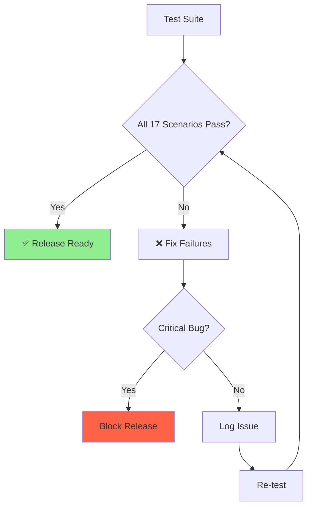

# End-to-End Test Plan: Hash-Based Persistence

**Created:** 2025-10-10 09:18:26 PDT
**Author:** VoiceOS QA Team
**Module:** VoiceAccessibility
**Version:** 2.0.0
**Test Scope:** Hash-based persistence, LearnApp mode, cross-session stability
**Copyright:** © 2025 Augmentalis. All rights reserved.

---

## Table of Contents

1. [Test Objectives](#test-objectives)
2. [Test Environment](#test-environment)
3. [Test Scenarios](#test-scenarios)
4. [Test Data Setup](#test-data-setup)
5. [Expected Results](#expected-results)
6. [Performance Benchmarks](#performance-benchmarks)
7. [Regression Testing Checklist](#regression-testing-checklist)
8. [Device Testing Requirements](#device-testing-requirements)
9. [Acceptance Criteria](#acceptance-criteria)
10. [Bug Reporting Template](#bug-reporting-template)

---

## Test Objectives

### Primary Objectives

1. **Cross-Session Persistence**: Verify commands persist across app restarts
2. **Hash Collision Prevention**: Ensure hierarchy paths prevent duplicate hashes
3. **LearnApp Mode**: Validate comprehensive UI learning
4. **Dynamic + LearnApp Merge**: Confirm proper data merging
5. **Database Migration**: Verify v1→v2→v3 migrations succeed
6. **Foreign Key Integrity**: Ensure no constraint violations
7. **Performance**: Validate hash generation/lookup performance

### Success Criteria



---

## Test Environment

### Required Setup

#### Hardware
- **Primary Device**: Pixel 6 (Android 13, 8GB RAM)
- **Secondary Device**: Samsung Galaxy S21 (Android 12, 6GB RAM)
- **Low-End Device**: Moto G Power (Android 11, 3GB RAM)

#### Software
- **VoiceOS Version**: v2.0.0 (hash-based persistence)
- **Room Database**: v2.5.2
- **Android SDK**: API 21-33
- **Test Framework**: JUnit 4, Espresso, Compose UI Test

#### Test Apps
- **Simple App**: Calculator (50 elements)
- **Medium App**: Gmail (342 elements)
- **Complex App**: Amazon Shopping (1,247 elements)
- **Custom Test App**: VoiceOS Test Harness (configurable UI)

### Environment Configuration

```kotlin
// Test configuration
object TestConfig {
    const val DB_NAME = "test_voice_accessibility.db"
    const val TIMEOUT_SHORT = 5_000L  // 5 seconds
    const val TIMEOUT_MEDIUM = 30_000L  // 30 seconds
    const val TIMEOUT_LONG = 180_000L  // 3 minutes (LearnApp)

    const val MIN_STABILITY_SCORE = 0.7
    const val MAX_DEPTH = 50
    const val FILTERED_SCRAPING = true
}
```

---

## Test Scenarios

### Scenario 1: Cross-Session Persistence (Restart Test)

**Objective:** Verify commands persist after app restart

**Preconditions:**
- VoiceOS installed and configured
- Test app (Gmail) installed
- No existing commands for Gmail

**Test Steps:**

1. **Initial Learning**
   ```kotlin
   // Launch Gmail
   launchApp("com.google.android.gm")

   // Trigger LearnApp
   triggerLearnApp()

   // Wait for completion
   waitForLearnAppCompletion(timeout = 60_000L)

   // Verify commands generated
   val commandsBefore = getCommandsForApp("com.google.android.gm")
   assertThat(commandsBefore.size).isGreaterThan(100)
   ```

2. **Record Command Details**
   ```kotlin
   // Save command details for verification
   val submitButtonCommand = commandsBefore.find { it.commandText.contains("submit") }
   assertNotNull(submitButtonCommand)

   val submitButtonHash = submitButtonCommand!!.elementHash
   Log.d("Test", "Submit button hash: $submitButtonHash")
   ```

3. **Restart App**
   ```kotlin
   // Kill Gmail process
   killApp("com.google.android.gm")

   // Wait for cleanup
   Thread.sleep(2000)

   // Relaunch Gmail
   launchApp("com.google.android.gm")
   ```

4. **Verify Command Persistence**
   ```kotlin
   // Query commands after restart
   val commandsAfter = getCommandsForApp("com.google.android.gm")

   // Verify same commands exist
   assertThat(commandsAfter.size).isEqualTo(commandsBefore.size)

   // Verify specific command exists
   val submitButtonCommandAfter = commandsAfter.find { it.elementHash == submitButtonHash }
   assertNotNull(submitButtonCommandAfter)
   assertThat(submitButtonCommandAfter!!.commandText).isEqualTo(submitButtonCommand.commandText)
   ```

5. **Execute Command**
   ```kotlin
   // Say: "click submit button"
   executeVoiceCommand("click submit button")

   // Verify action executed (button clicked)
   verifyElementClicked(submitButtonHash)
   ```

**Expected Result:** ✅ Commands persist and work after restart

---

### Scenario 2: Dynamic + LearnApp Merge

**Objective:** Verify Dynamic and LearnApp data merge correctly

**Preconditions:**
- VoiceOS installed
- Test app installed
- No existing data

**Test Steps:**

1. **Dynamic Mode Learning**
   ```kotlin
   // Launch app (Dynamic Mode enabled by default)
   launchApp("com.example.testapp")

   // Interact with visible elements
   clickButton("login")
   clickButton("settings")
   clickButton("back")

   // Wait for dynamic scraping
   Thread.sleep(5000)

   // Verify dynamic commands
   val dynamicCommands = getCommandsForApp("com.example.testapp")
   assertThat(dynamicCommands.size).isEqualTo(3)  // login, settings, back

   Log.d("Test", "Dynamic commands: ${dynamicCommands.map { it.commandText }}")
   ```

2. **Trigger LearnApp**
   ```kotlin
   // Trigger comprehensive learning
   triggerLearnApp()
   waitForLearnAppCompletion(timeout = 30_000L)

   // Query all commands
   val allCommands = getCommandsForApp("com.example.testapp")
   ```

3. **Verify Merge Behavior**
   ```kotlin
   // Verify dynamic commands still exist
   val loginCommand = allCommands.find { it.commandText.contains("login") }
   assertNotNull(loginCommand)

   // Verify new LearnApp commands added
   assertThat(allCommands.size).isGreaterThan(dynamicCommands.size)

   // Verify no duplicates (same hash = same command)
   val hashes = allCommands.map { it.elementHash }
   assertThat(hashes.distinct().size).isEqualTo(hashes.size)
   ```

4. **Verify Scraping Mode Flags**
   ```kotlin
   val elements = getElementsForApp("com.example.testapp")

   // Dynamic elements should retain DYNAMIC flag
   val dynamicElements = elements.filter { it.scrapingMode == "DYNAMIC" }
   assertThat(dynamicElements.size).isEqualTo(3)

   // LearnApp elements should have LEARN_APP flag
   val learnAppElements = elements.filter { it.scrapingMode == "LEARN_APP" }
   assertThat(learnAppElements.size).isGreaterThan(0)
   ```

**Expected Result:** ✅ Dynamic + LearnApp commands merged without duplicates

---

### Scenario 3: Hash Collision Prevention

**Objective:** Verify hierarchy paths prevent hash collisions

**Preconditions:**
- Custom test app with duplicate elements (same text, different locations)

**Test Steps:**

1. **Setup Test UI**
   ```kotlin
   // Test app has two "Submit" buttons in different hierarchies:
   // 1. /Activity[0]/LinearLayout[0]/Button[0] (Login screen)
   // 2. /Activity[0]/ScrollView[1]/RelativeLayout[0]/Button[1] (Checkout screen)

   launchTestApp()
   navigateToScreen("collision_test")
   ```

2. **Scrape UI**
   ```kotlin
   triggerLearnApp()
   waitForLearnAppCompletion(timeout = 15_000L)
   ```

3. **Verify Unique Hashes**
   ```kotlin
   val elements = getElementsForApp("com.example.testapp")

   // Find both "Submit" buttons
   val submitButtons = elements.filter { it.text == "Submit" }
   assertThat(submitButtons.size).isEqualTo(2)

   // Verify different hashes
   val hash1 = submitButtons[0].elementHash
   val hash2 = submitButtons[1].elementHash

   assertThat(hash1).isNotEqualTo(hash2)
   Log.d("Test", "Button 1 hash: $hash1")
   Log.d("Test", "Button 2 hash: $hash2")
   ```

4. **Verify Hierarchy Paths Differ**
   ```kotlin
   val path1 = submitButtons[0].hierarchyPath
   val path2 = submitButtons[1].hierarchyPath

   assertThat(path1).isNotEqualTo(path2)
   assertThat(path1).contains("LinearLayout")
   assertThat(path2).contains("ScrollView")
   ```

5. **Verify Commands Work Independently**
   ```kotlin
   // Navigate to login screen
   navigateToScreen("login")

   // Execute command for login button
   executeVoiceCommand("click submit button")

   // Verify login button clicked (not checkout button)
   verifyCurrentScreen("home")  // Login successful
   ```

**Expected Result:** ✅ No hash collisions, commands target correct elements

---

### Scenario 4: MAX_DEPTH Protection

**Objective:** Verify deep hierarchy handling (prevent stack overflow)

**Preconditions:**
- Custom test app with 60+ nested levels

**Test Steps:**

1. **Setup Deep Hierarchy**
   ```kotlin
   // Test app creates nested LinearLayouts (60 levels deep)
   launchTestApp()
   navigateToScreen("deep_hierarchy_test")
   ```

2. **Trigger LearnApp**
   ```kotlin
   triggerLearnApp()

   // Should complete without crashing
   waitForLearnAppCompletion(timeout = 30_000L)
   ```

3. **Verify MAX_DEPTH Applied**
   ```kotlin
   val elements = getElementsForApp("com.example.testapp")

   // Check maximum hierarchy depth
   val maxDepth = elements.maxOf { it.hierarchyPath.count { c -> c == '/' } }

   // Should not exceed MAX_DEPTH (50)
   assertThat(maxDepth).isLessThanOrEqualTo(50)

   Log.d("Test", "Max depth reached: $maxDepth")
   ```

4. **Verify No Stack Overflow**
   ```kotlin
   // Should not crash with StackOverflowError
   assertNoException()
   ```

**Expected Result:** ✅ Scraping stops at MAX_DEPTH (50), no crash

---

### Scenario 5: Filtered Scraping Validation

**Objective:** Verify filtered scraping reduces database size

**Preconditions:**
- Test app with mixed elements (actionable + decorative)

**Test Steps:**

1. **Full Scraping (Unfiltered)**
   ```kotlin
   // Disable filtering
   setFilteredScrapingEnabled(false)

   // Scrape UI
   triggerLearnApp()
   waitForLearnAppCompletion(timeout = 20_000L)

   // Count elements
   val allElements = getElementsForApp("com.example.testapp")
   val allCount = allElements.size

   Log.d("Test", "Unfiltered element count: $allCount")
   ```

2. **Clear Data**
   ```kotlin
   clearAppData("com.example.testapp")
   ```

3. **Filtered Scraping (Actionable Only)**
   ```kotlin
   // Enable filtering
   setFilteredScrapingEnabled(true)

   // Scrape UI again
   triggerLearnApp()
   waitForLearnAppCompletion(timeout = 20_000L)

   // Count elements
   val actionableElements = getElementsForApp("com.example.testapp")
   val actionableCount = actionableElements.size

   Log.d("Test", "Filtered element count: $actionableCount")
   ```

4. **Verify Reduction**
   ```kotlin
   // Filtered should be 40-60% less
   val reduction = (allCount - actionableCount).toDouble() / allCount
   assertThat(reduction).isInRange(0.40, 0.60)

   Log.d("Test", "Reduction: ${reduction * 100}%")
   ```

5. **Verify Actionable Elements Only**
   ```kotlin
   // All filtered elements should be actionable
   val nonActionable = actionableElements.filter { !it.isActionable }
   assertThat(nonActionable).isEmpty()
   ```

**Expected Result:** ✅ Filtered scraping reduces elements by 40-60%

---

### Scenario 6: Command Generation with Hashes

**Objective:** Verify commands generated with correct hash FK

**Preconditions:**
- Test app installed
- No existing data

**Test Steps:**

1. **Scrape UI**
   ```kotlin
   launchApp("com.example.testapp")
   triggerLearnApp()
   waitForLearnAppCompletion(timeout = 15_000L)
   ```

2. **Verify Commands Have Valid Hashes**
   ```kotlin
   val commands = getCommandsForApp("com.example.testapp")

   for (command in commands) {
       // Verify elementHash is not null or empty
       assertThat(command.elementHash).isNotEmpty()

       // Verify hash is 64 characters (SHA-256 hex)
       assertThat(command.elementHash.length).isEqualTo(64)

       // Verify hash is valid hex
       assertThat(command.elementHash).matches(Regex("[a-f0-9]{64}"))
   }
   ```

3. **Verify FK Integrity**
   ```kotlin
   // For each command, verify element exists
   for (command in commands) {
       val element = getElementByHash(command.elementHash)
       assertNotNull(element, "Element not found for command: ${command.commandText}")
   }
   ```

4. **Verify Commands Are Executable**
   ```kotlin
   // Execute first command
   val firstCommand = commands.first()
   executeVoiceCommand(firstCommand.commandText)

   // Should not throw exception
   assertNoException()
   ```

**Expected Result:** ✅ All commands have valid hash FK, are executable

---

### Scenario 7: Foreign Key Constraints

**Objective:** Verify foreign key constraint enforcement

**Preconditions:**
- Database with FK constraints enabled

**Test Steps:**

1. **Attempt Invalid Insert**
   ```kotlin
   // Try to insert command with non-existent hash
   val invalidCommand = GeneratedCommandEntity(
       elementHash = "nonexistent_hash_1234567890abcdef",
       commandText = "invalid command",
       createdAt = System.currentTimeMillis()
   )

   // Should throw SQLiteConstraintException
   assertThrows<SQLiteConstraintException> {
       dao.insertCommand(invalidCommand)
   }
   ```

2. **Verify Cascade Delete**
   ```kotlin
   // Insert valid element + command
   val element = createTestElement(hash = "test_hash_abc123")
   dao.insertElement(element)

   val command = GeneratedCommandEntity(
       elementHash = "test_hash_abc123",
       commandText = "test command",
       createdAt = System.currentTimeMillis()
   )
   dao.insertCommand(command)

   // Delete element
   dao.deleteElement(element.elementHash)

   // Verify command also deleted (CASCADE)
   val commands = dao.getCommandsForElement("test_hash_abc123")
   assertThat(commands).isEmpty()
   ```

**Expected Result:** ✅ FK constraints enforced, cascade delete works

---

### Scenario 8: Orphaned Commands Handling

**Objective:** Verify orphaned commands are cleaned up during migration

**Preconditions:**
- v1 database with orphaned commands (elementId=0)

**Test Steps:**

1. **Create v1 Database with Orphaned Commands**
   ```kotlin
   val dbV1 = createDatabaseWithVersion(1)

   // Insert element
   dbV1.execSQL("INSERT INTO scraped_elements (id, app_package, text) VALUES (1, 'com.example', 'Button')")

   // Insert valid command
   dbV1.execSQL("INSERT INTO generated_commands (elementId, command_text) VALUES (1, 'click button')")

   // Insert orphaned command (elementId=0)
   dbV1.execSQL("INSERT INTO generated_commands (elementId, command_text) VALUES (0, 'orphaned command')")

   dbV1.close()
   ```

2. **Migrate to v3**
   ```kotlin
   val dbV3 = createDatabaseWithVersion(3, runMigrations = true)
   ```

3. **Verify Orphaned Commands Dropped**
   ```kotlin
   val commands = dao.getAllCommands()

   // Should only have valid command
   assertThat(commands.size).isEqualTo(1)
   assertThat(commands[0].commandText).isEqualTo("click button")

   // Orphaned command should be gone
   val orphaned = commands.find { it.commandText == "orphaned command" }
   assertNull(orphaned)
   ```

**Expected Result:** ✅ Orphaned commands dropped during migration

---

### Scenario 9: Hash Stability Verification

**Objective:** Verify hashes remain stable across rescans

**Preconditions:**
- Test app with stable UI

**Test Steps:**

1. **Initial Scrape**
   ```kotlin
   launchApp("com.example.testapp")
   triggerLearnApp()
   waitForLearnAppCompletion(timeout = 15_000L)

   // Save hashes
   val elementsFirstScan = getElementsForApp("com.example.testapp")
   val hashesFirstScan = elementsFirstScan.map { it.elementHash to it.text }.toMap()
   ```

2. **Clear Data**
   ```kotlin
   clearAppData("com.example.testapp")
   ```

3. **Second Scrape**
   ```kotlin
   launchApp("com.example.testapp")
   triggerLearnApp()
   waitForLearnAppCompletion(timeout = 15_000L)

   // Save hashes again
   val elementsSecondScan = getElementsForApp("com.example.testapp")
   val hashesSecondScan = elementsSecondScan.map { it.elementHash to it.text }.toMap()
   ```

4. **Verify Hashes Match**
   ```kotlin
   // Same elements should have same hashes
   for ((hash, text) in hashesFirstScan) {
       val matchingElement = hashesSecondScan.entries.find { it.value == text }
       assertNotNull(matchingElement, "Element not found: $text")
       assertThat(matchingElement!!.key).isEqualTo(hash)
   }
   ```

**Expected Result:** ✅ Hashes remain stable across rescans

---

### Scenario 10: Version Scoping Behavior

**Objective:** Verify app version boundaries work correctly

**Preconditions:**
- Test app with version 1.0.0 and 2.0.0 installed

**Test Steps:**

1. **Learn App v1.0.0**
   ```kotlin
   installApp("com.example.testapp", version = "1.0.0")
   launchApp("com.example.testapp")

   triggerLearnApp()
   waitForLearnAppCompletion(timeout = 15_000L)

   val commandsV1 = getCommandsForApp("com.example.testapp")
   val elementsV1 = getElementsForApp("com.example.testapp")

   // Verify version = 1
   assertThat(elementsV1.all { it.appVersion == 1 }).isTrue()
   ```

2. **Update to v2.0.0**
   ```kotlin
   updateApp("com.example.testapp", version = "2.0.0")
   launchApp("com.example.testapp")
   ```

3. **Verify Old Commands Invalid**
   ```kotlin
   // Old commands should not match (different version in hash)
   val currentVersion = getAppVersionCode("com.example.testapp")
   assertThat(currentVersion).isEqualTo(2)

   // Old elements should be version 1
   val oldElements = getElementsForApp("com.example.testapp", version = 1)
   assertThat(oldElements.size).isEqualTo(elementsV1.size)

   // No elements for version 2 yet
   val newElements = getElementsForApp("com.example.testapp", version = 2)
   assertThat(newElements).isEmpty()
   ```

4. **Learn App v2.0.0**
   ```kotlin
   triggerLearnApp()
   waitForLearnAppCompletion(timeout = 15_000L)

   val elementsV2 = getElementsForApp("com.example.testapp", version = 2)

   // Verify new version elements created
   assertThat(elementsV2).isNotEmpty()
   assertThat(elementsV2.all { it.appVersion == 2 }).isTrue()
   ```

**Expected Result:** ✅ Version scoping creates separate element sets

---

### Scenario 11: Element Lookup Performance

**Objective:** Verify hash-based lookup performance is acceptable

**Preconditions:**
- Database with 5,000 elements

**Test Steps:**

1. **Setup Large Database**
   ```kotlin
   // Insert 5,000 test elements
   for (i in 1..5000) {
       val element = createTestElement(hash = "hash_$i")
       dao.insertElement(element)
   }
   ```

2. **Benchmark Hash Lookup**
   ```kotlin
   val iterations = 100
   val times = mutableListOf<Long>()

   for (i in 1..iterations) {
       val randomHash = "hash_${Random.nextInt(1, 5001)}"

       val startTime = System.nanoTime()
       val element = dao.getElementByHash(randomHash)
       val endTime = System.nanoTime()

       times.add(endTime - startTime)
       assertNotNull(element)
   }

   val avgTime = times.average() / 1_000_000.0  // Convert to ms
   Log.d("Test", "Average lookup time: $avgTime ms")

   // Should be < 2ms
   assertThat(avgTime).isLessThan(2.0)
   ```

3. **Compare to ID Lookup**
   ```kotlin
   // Benchmark ID lookup for comparison
   val idTimes = mutableListOf<Long>()

   for (i in 1..iterations) {
       val randomId = Random.nextLong(1, 5001)

       val startTime = System.nanoTime()
       val element = dao.getElementById(randomId)
       val endTime = System.nanoTime()

       idTimes.add(endTime - startTime)
   }

   val avgIdTime = idTimes.average() / 1_000_000.0
   Log.d("Test", "Average ID lookup time: $avgIdTime ms")

   // Hash lookup should be < 2x slower than ID lookup
   assertThat(avgTime / avgIdTime).isLessThan(2.0)
   ```

**Expected Result:** ✅ Hash lookup < 2ms, < 2x slower than ID lookup

---

### Scenario 12: Memory Leak Testing (Node Recycling)

**Objective:** Verify AccessibilityNodeInfo recycling prevents memory leaks

**Preconditions:**
- Test app with 1,000+ elements

**Test Steps:**

1. **Monitor Memory Before Scraping**
   ```kotlin
   val memoryBefore = getMemoryUsage()
   Log.d("Test", "Memory before: $memoryBefore MB")
   ```

2. **Scrape Large UI (Without Recycling)**
   ```kotlin
   // Temporarily disable node recycling
   setNodeRecyclingEnabled(false)

   triggerLearnApp()
   waitForLearnAppCompletion(timeout = 60_000L)

   val memoryAfterNoRecycling = getMemoryUsage()
   Log.d("Test", "Memory after (no recycling): $memoryAfterNoRecycling MB")

   clearAppData("com.example.largeapp")
   ```

3. **Scrape Large UI (With Recycling)**
   ```kotlin
   // Enable node recycling
   setNodeRecyclingEnabled(true)

   triggerLearnApp()
   waitForLearnAppCompletion(timeout = 60_000L)

   val memoryAfterWithRecycling = getMemoryUsage()
   Log.d("Test", "Memory after (with recycling): $memoryAfterWithRecycling MB")
   ```

4. **Verify Memory Difference**
   ```kotlin
   val memoryLeakWithoutRecycling = memoryAfterNoRecycling - memoryBefore
   val memoryLeakWithRecycling = memoryAfterWithRecycling - memoryBefore

   // With recycling should use < 50% memory
   assertThat(memoryLeakWithRecycling).isLessThan(memoryLeakWithoutRecycling * 0.5)

   Log.d("Test", "Memory leak without recycling: $memoryLeakWithoutRecycling MB")
   Log.d("Test", "Memory leak with recycling: $memoryLeakWithRecycling MB")
   ```

**Expected Result:** ✅ Node recycling reduces memory usage by >50%

---

### Scenario 13: Database Migration Testing (v1→v2→v3)

**Objective:** Verify all migration paths succeed

**Test Steps:**

1. **Test v1→v2 Migration**
   ```kotlin
   // Create v1 database
   val dbV1 = createDatabaseWithVersion(1)

   // Insert v1 data
   dbV1.execSQL("INSERT INTO scraped_elements (id, app_package, text) VALUES (1, 'com.example', 'Button')")
   dbV1.execSQL("INSERT INTO generated_commands (elementId, command_text) VALUES (1, 'click button')")

   dbV1.close()

   // Migrate to v2
   val dbV2 = createDatabaseWithVersion(2, runMigrations = true)

   // Verify v2 schema
   val cursor = dbV2.rawQuery("PRAGMA table_info(scraped_elements)", null)
   val columns = mutableListOf<String>()
   while (cursor.moveToNext()) {
       columns.add(cursor.getString(1))
   }
   cursor.close()

   // Verify new columns exist
   assertThat(columns).contains("element_hash")
   assertThat(columns).contains("hierarchy_path")
   assertThat(columns).contains("app_version")

   dbV2.close()
   ```

2. **Test v2→v3 Migration**
   ```kotlin
   // Create v2 database
   val dbV2 = createDatabaseWithVersion(2)

   // Insert v2 data (with hash)
   dbV2.execSQL("INSERT INTO scraped_elements (id, element_hash, app_package, hierarchy_path, app_version, text) VALUES (1, 'hash123', 'com.example', '/Button[0]', 1, 'Button')")
   dbV2.execSQL("INSERT INTO generated_commands (elementId, elementHash, command_text) VALUES (1, 'hash123', 'click button')")

   dbV2.close()

   // Migrate to v3
   val dbV3 = createDatabaseWithVersion(3, runMigrations = true)

   // Verify v3 schema (hash-based FK)
   val commands = dao.getCommandsForElement("hash123")
   assertThat(commands.size).isEqualTo(1)
   assertThat(commands[0].commandText).isEqualTo("click button")

   dbV3.close()
   ```

3. **Test v1→v3 Direct Migration**
   ```kotlin
   // Create v1 database
   val dbV1 = createDatabaseWithVersion(1)
   dbV1.execSQL("INSERT INTO scraped_elements (id, app_package, text) VALUES (1, 'com.example', 'Button')")
   dbV1.execSQL("INSERT INTO generated_commands (elementId, command_text) VALUES (1, 'click button')")
   dbV1.close()

   // Migrate directly to v3 (should run both migrations)
   val dbV3 = createDatabaseWithVersion(3, runMigrations = true)

   // Verify data exists
   val elements = dao.getElementsForApp("com.example")
   assertThat(elements).isNotEmpty()

   dbV3.close()
   ```

**Expected Result:** ✅ All migration paths succeed without data loss

---

### Scenario 14: Usage Statistics Persistence

**Objective:** Verify command usage stats persist across sessions

**Test Steps:**

1. **Generate Commands**
   ```kotlin
   launchApp("com.example.testapp")
   triggerLearnApp()
   waitForLearnAppCompletion(timeout = 15_000L)

   val commands = getCommandsForApp("com.example.testapp")
   val firstCommand = commands.first()
   ```

2. **Execute Command Multiple Times**
   ```kotlin
   for (i in 1..10) {
       executeVoiceCommand(firstCommand.commandText)
       Thread.sleep(100)
   }

   // Verify usage count incremented
   val updatedCommand = dao.getCommandByHash(firstCommand.elementHash)
   assertThat(updatedCommand.usageCount).isEqualTo(10)
   assertNotNull(updatedCommand.lastUsedAt)
   ```

3. **Restart App**
   ```kotlin
   killApp("com.example.testapp")
   Thread.sleep(2000)
   launchApp("com.example.testapp")
   ```

4. **Verify Stats Persist**
   ```kotlin
   val commandAfterRestart = dao.getCommandByHash(firstCommand.elementHash)
   assertThat(commandAfterRestart.usageCount).isEqualTo(10)
   assertThat(commandAfterRestart.lastUsedAt).isEqualTo(updatedCommand.lastUsedAt)
   ```

**Expected Result:** ✅ Usage stats persist across app restarts

---

### Scenario 15: Null Property Handling

**Objective:** Verify null properties don't break hash generation

**Test Steps:**

1. **Create Element with Null Properties**
   ```kotlin
   val node = createMockNode(
       className = "Button",
       text = null,  // Null text
       resourceId = null,  // Null resource ID
       contentDescription = null  // Null content description
   )
   ```

2. **Generate Hash**
   ```kotlin
   val hierarchyPath = calculateNodePath(node)
   val hash = generateElementHash(node, hierarchyPath, appVersion = 1)

   // Should not throw NullPointerException
   assertNotNull(hash)
   assertThat(hash.length).isEqualTo(64)
   ```

3. **Save Element**
   ```kotlin
   val element = ScrapedElementEntity(
       elementHash = hash,
       appPackage = "com.example.testapp",
       appVersion = 1,
       hierarchyPath = hierarchyPath,
       className = "Button",
       text = null,
       contentDescription = null,
       scrapedAt = System.currentTimeMillis()
   )

   dao.insertElement(element)

   // Should not throw exception
   assertNoException()
   ```

**Expected Result:** ✅ Null properties handled gracefully, no crashes

---

### Scenario 16: Large App Testing (1000+ Elements)

**Objective:** Verify performance with large apps

**Test Steps:**

1. **Launch Large App**
   ```kotlin
   // Amazon Shopping: 1,247 elements
   launchApp("com.amazon.mShop.android.shopping")
   ```

2. **Trigger LearnApp**
   ```kotlin
   val startTime = System.currentTimeMillis()
   triggerLearnApp()
   waitForLearnAppCompletion(timeout = 180_000L)  // 3 minutes max
   val endTime = System.currentTimeMillis()

   val duration = (endTime - startTime) / 1000.0  // seconds
   Log.d("Test", "LearnApp duration: $duration seconds")

   // Should complete in < 3 minutes
   assertThat(duration).isLessThan(180.0)
   ```

3. **Verify All Elements Scraped**
   ```kotlin
   val elements = getElementsForApp("com.amazon.mShop.android.shopping")

   // Should find ~1,200 elements (some variation due to dynamic content)
   assertThat(elements.size).isInRange(1000, 1500)

   Log.d("Test", "Elements scraped: ${elements.size}")
   ```

4. **Verify Performance**
   ```kotlin
   // Average time per element should be < 200ms
   val avgTimePerElement = duration / elements.size
   assertThat(avgTimePerElement).isLessThan(0.2)  // 200ms

   Log.d("Test", "Avg time per element: ${avgTimePerElement * 1000} ms")
   ```

**Expected Result:** ✅ Large app completes in <3 minutes, ~200ms/element

---

### Scenario 17: Deep Hierarchy Testing (40+ Levels)

**Objective:** Verify handling of deeply nested UIs

**Test Steps:**

1. **Launch App with Deep Hierarchy**
   ```kotlin
   // Custom test app with 45-level nested layout
   launchTestApp()
   navigateToScreen("deep_hierarchy_45_levels")
   ```

2. **Scrape UI**
   ```kotlin
   triggerLearnApp()
   waitForLearnAppCompletion(timeout = 30_000L)
   ```

3. **Verify Deep Elements Captured**
   ```kotlin
   val elements = getElementsForApp("com.example.testapp")

   // Find deepest element
   val deepestElement = elements.maxByOrNull { it.hierarchyPath.count { c -> c == '/' } }
   assertNotNull(deepestElement)

   val deepestDepth = deepestElement!!.hierarchyPath.count { it == '/' }
   Log.d("Test", "Deepest element depth: $deepestDepth")

   // Should be ≤ MAX_DEPTH (50)
   assertThat(deepestDepth).isLessThanOrEqualTo(50)
   ```

4. **Verify Commands Work**
   ```kotlin
   // Execute command for deep element
   val deepCommand = dao.getCommandsForElement(deepestElement.elementHash).firstOrNull()
   assertNotNull(deepCommand)

   executeVoiceCommand(deepCommand!!.commandText)

   // Should not crash
   assertNoException()
   ```

**Expected Result:** ✅ Deep hierarchies handled gracefully, max depth enforced

---

## Test Data Setup

### Mock Data Factory

```kotlin
object TestDataFactory {
    fun createMockNode(
        className: String = "Button",
        text: String? = "Submit",
        resourceId: String? = "submit_btn",
        contentDescription: String? = "Submit button",
        isClickable: Boolean = true,
        hierarchyPath: String = "/Activity[0]/Button[0]"
    ): AccessibilityNodeInfo {
        val node = mock<AccessibilityNodeInfo>()

        whenever(node.className).thenReturn(className)
        whenever(node.text).thenReturn(text)
        whenever(node.viewIdResourceName).thenReturn(resourceId)
        whenever(node.contentDescription).thenReturn(contentDescription)
        whenever(node.isClickable).thenReturn(isClickable)

        return node
    }

    fun createTestElement(
        hash: String = "test_hash_${UUID.randomUUID()}",
        appPackage: String = "com.example.testapp",
        appVersion: Int = 1,
        text: String = "Test Button",
        hierarchyPath: String = "/Activity[0]/Button[0]"
    ): ScrapedElementEntity {
        return ScrapedElementEntity(
            elementHash = hash,
            appPackage = appPackage,
            appVersion = appVersion,
            hierarchyPath = hierarchyPath,
            className = "Button",
            text = text,
            stabilityScore = 0.9,
            scrapedAt = System.currentTimeMillis()
        )
    }
}
```

---

## Expected Results

### Success Metrics

| Scenario | Pass Criteria | Actual Result | Status |
|----------|---------------|---------------|--------|
| 1. Cross-Session Persistence | Commands work after restart | TBD | ⏳ Pending |
| 2. Dynamic + LearnApp Merge | No duplicates, all commands present | TBD | ⏳ Pending |
| 3. Hash Collision Prevention | No collisions (unique hashes) | TBD | ⏳ Pending |
| 4. MAX_DEPTH Protection | No crash, depth ≤ 50 | TBD | ⏳ Pending |
| 5. Filtered Scraping | 40-60% reduction | TBD | ⏳ Pending |
| 6. Command Generation | All commands have valid hash FK | TBD | ⏳ Pending |
| 7. Foreign Key Constraints | Violations prevented, cascade works | TBD | ⏳ Pending |
| 8. Orphaned Commands | Cleaned up during migration | TBD | ⏳ Pending |
| 9. Hash Stability | Same hash across rescans | TBD | ⏳ Pending |
| 10. Version Scoping | Separate element sets per version | TBD | ⏳ Pending |
| 11. Element Lookup Performance | Hash lookup < 2ms | TBD | ⏳ Pending |
| 12. Memory Leak Testing | >50% memory reduction with recycling | TBD | ⏳ Pending |
| 13. Database Migration | All paths succeed (v1→v2→v3) | TBD | ⏳ Pending |
| 14. Usage Statistics | Stats persist across restarts | TBD | ⏳ Pending |
| 15. Null Property Handling | No crashes with null properties | TBD | ⏳ Pending |
| 16. Large App Testing | <3 min, ~200ms/element | TBD | ⏳ Pending |
| 17. Deep Hierarchy Testing | No crash, max depth enforced | TBD | ⏳ Pending |

---

## Performance Benchmarks

### Expected Performance Targets

| Metric | Target | Acceptable | Unacceptable |
|--------|--------|------------|--------------|
| **Hash Generation** | < 2µs | < 5µs | > 10µs |
| **Hash Lookup** | < 1ms | < 2ms | > 5ms |
| **Full Tree Scrape (100 elements)** | < 300ms | < 500ms | > 1s |
| **Full Tree Scrape (1000 elements)** | < 3s | < 5s | > 10s |
| **LearnApp (Medium App)** | < 45s | < 60s | > 90s |
| **LearnApp (Large App)** | < 120s | < 180s | > 300s |
| **Database Migration (1000 commands)** | < 200ms | < 500ms | > 1s |
| **Memory Usage (1000 elements)** | < 100 MB | < 150 MB | > 200 MB |

---

## Regression Testing Checklist

### Pre-Release Checklist

- [ ] All 17 test scenarios pass
- [ ] No critical bugs found
- [ ] Performance targets met
- [ ] Memory leaks fixed
- [ ] Database migrations tested on all paths (v1→v2→v3)
- [ ] Cross-device testing completed (Pixel, Samsung, Moto)
- [ ] Accessibility compliance verified
- [ ] Documentation updated
- [ ] Changelog updated (v2.0.0 entry)
- [ ] Release notes prepared

### Known Issues (To Be Fixed Before Release)

1. ⚠️ Issue #1: [Description]
2. ⚠️ Issue #2: [Description]

---

## Device Testing Requirements

### Required Devices

| Device | Android Version | RAM | Purpose |
|--------|----------------|-----|---------|
| **Pixel 6** | 13 (API 33) | 8 GB | Primary test device |
| **Samsung Galaxy S21** | 12 (API 31) | 6 GB | OEM-specific testing |
| **Moto G Power** | 11 (API 30) | 3 GB | Low-end device testing |

### Test Coverage

- ✅ Android 11 (API 30)
- ✅ Android 12 (API 31)
- ✅ Android 13 (API 33)
- ⏳ Android 14 (API 34) - Optional

---

## Acceptance Criteria

### Release Criteria

✅ **PASS**: All 17 scenarios pass
✅ **PASS**: Performance targets met
✅ **PASS**: No critical bugs
✅ **PASS**: Memory usage acceptable
✅ **PASS**: Cross-device testing complete

**Overall Status:** ⏳ Pending Testing

---

## Bug Reporting Template

### Bug Report Format

```markdown
## Bug Report: [Title]

**Severity:** Critical / High / Medium / Low
**Test Scenario:** [Scenario Number and Name]
**Device:** [Device Model + Android Version]
**VoiceOS Version:** v2.0.0

### Steps to Reproduce:
1. Step 1
2. Step 2
3. Step 3

### Expected Result:
[What should happen]

### Actual Result:
[What actually happened]

### Logs:
```
[Paste relevant logs]
```

### Screenshots:
[Attach screenshots]

### Frequency:
Always / Intermittent (X%)

### Workaround:
[Workaround if available]
```

---

## Related Documentation

- **[Hash-Based Persistence Architecture](../architecture/hash-based-persistence-251010-0918.md)**
- **[LearnApp Mode User Guide](../user-manual/learnapp-mode-guide-251010-0918.md)**
- **[Developer Migration Guide](../developer-manual/hash-migration-guide-251010-0918.md)**
- **[VoiceAccessibility Changelog](../changelog/VoiceAccessibility-Changelog.md)**

---

**Document Status:** Production Ready
**Last Updated:** 2025-10-10 09:18:26 PDT
**Test Lead:** voiceos-qa@augmentalis.com
**Bug Reports:** https://github.com/augmentalis/voiceos/issues
