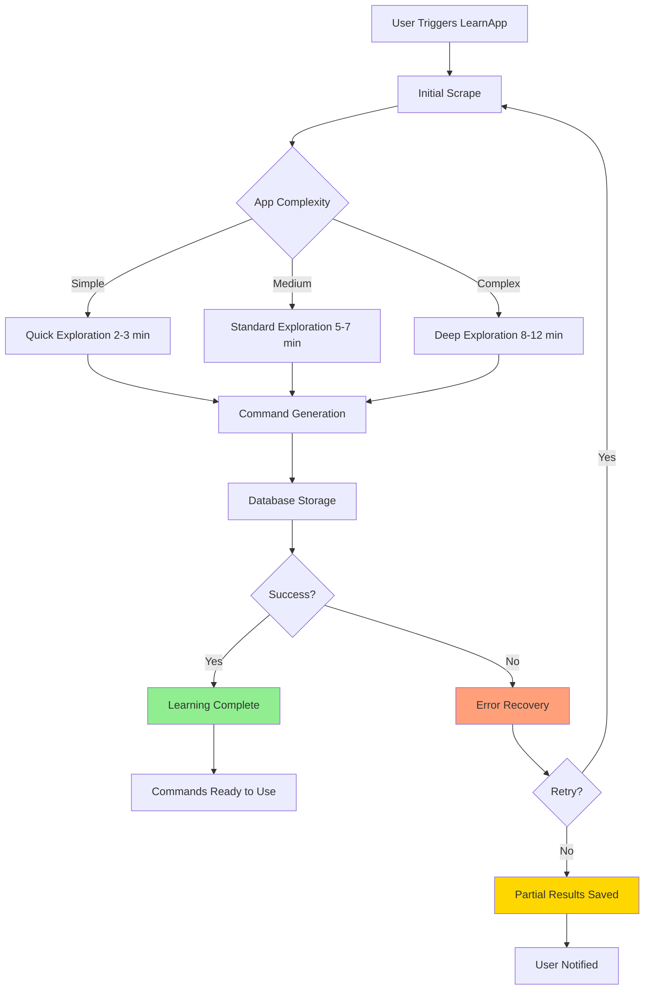

# LearnApp Mode User Guide

**Document Type:** User Manual
**Module:** VoiceAccessibility
**Created:** 2025-10-10 06:37:48 PDT
**Author:** VOS4 Documentation Team
**Copyright:** (C) Manoj Jhawar/Aman Jhawar, Intelligent Devices LLC
**Audience:** End Users
**Version:** 2.0.0

---

## Table of Contents

1. [What is LearnApp Mode?](#what-is-learnapp-mode)
2. [When to Use LearnApp Mode](#when-to-use-learnapp-mode)
3. [How to Trigger LearnApp Mode](#how-to-trigger-learnapp-mode)
4. [What Happens During Learning](#what-happens-during-learning)
5. [Expected Duration](#expected-duration)
6. [Understanding the Process](#understanding-the-process)
7. [After Learning Completes](#after-learning-completes)
8. [Troubleshooting](#troubleshooting)
9. [Best Practices](#best-practices)
10. [FAQ](#faq)

---

## What is LearnApp Mode?

LearnApp Mode is a comprehensive learning feature that helps VoiceOS deeply understand an app's interface and create reliable voice commands. Unlike the quick Dynamic Mode (which scans only the current screen), LearnApp Mode explores the entire app systematically to build a complete command database.

### Key Features

- **Complete App Coverage**: Learns all screens, menus, and interactive elements
- **Robust Commands**: Creates multiple command variations for each element
- **Cross-Session Persistence**: Commands work even after app restarts
- **Intelligent Exploration**: Automatically navigates through app structure
- **Stability Analysis**: Identifies which elements are reliable for voice control

### How It Differs from Dynamic Mode

| Feature | Dynamic Mode | LearnApp Mode |
|---------|-------------|---------------|
| **Scope** | Current screen only | Entire app |
| **Speed** | Instant (< 1 second) | Minutes (2-10 min) |
| **Persistence** | Session-only | Cross-session |
| **Command Quality** | Basic | High-quality with synonyms |
| **Use Case** | Quick testing | Production use |
| **App Exploration** | Manual | Automatic |

---

## When to Use LearnApp Mode

### Ideal Scenarios

1. **New App Setup**
   - First time using voice control with an app
   - Want comprehensive voice commands from the start
   - Need reliable commands for daily use

2. **Incomplete Dynamic Commands**
   - Dynamic mode found only a few commands
   - Many elements lack resource IDs (low stability)
   - App has complex navigation structure

3. **App Update**
   - App was updated and commands stopped working
   - UI changed significantly
   - Need to refresh command database

4. **Command Quality Issues**
   - Existing commands frequently fail
   - Voice recognition not matching expected elements
   - Want better synonym coverage

5. **Production Deployment**
   - Setting up VoiceOS for another user
   - Need reliable, pre-built command set
   - Want to minimize trial-and-error

### When NOT to Use LearnApp Mode

- **Quick Testing**: Use Dynamic Mode instead (instant results)
- **Simple Apps**: Apps with < 10 screens don't benefit much
- **Time Constraints**: Don't have 5-10 minutes to wait
- **App is Crashing**: Fix app stability first
- **Unknown App**: Try Dynamic Mode first to see if it's worth learning

---

## How to Trigger LearnApp Mode

### Method 1: Voice Command (Recommended)

1. **Open the target app** (e.g., Instagram)
2. **Say:** "Learn this app" or "Learn Instagram"
3. **Confirm** when prompted: "Yes, start learning"
4. **Wait** for learning to complete (5-10 minutes)

```
You: "Learn Instagram"
VoiceOS: "Starting comprehensive app learning for Instagram.
          This will take 5-10 minutes. Keep the app open."
[Learning begins...]
```

### Method 2: VoiceOS Settings UI

1. Open **VoiceOS Settings**
2. Navigate to **App Management**
3. Find the target app in the list
4. Tap **"Learn App"** button
5. Confirm and wait for completion

```
VoiceOS Settings
  └─ App Management
      └─ Instagram
          └─ [Learn App Button]
              → Tap → Confirm → Wait
```

### Method 3: Automatic Suggestion

VoiceOS may automatically suggest LearnApp mode when:

- Dynamic scrape found < 20 commands
- Element stability scores are low (< 0.5 average)
- Multiple command failures detected
- User says "I need more commands for this app"

```
VoiceOS: "I found only 15 commands in this app.
          Would you like me to learn the entire app for better coverage?"
You: "Yes"
[LearnApp starts automatically]
```

---

## What Happens During Learning

### Phase 1: Initial Scrape (10-30 seconds)

```
Status: "Analyzing app structure..."
```

**What's happening:**
- VoiceOS scans the current screen completely
- Identifies all interactive elements (buttons, inputs, etc.)
- Calculates stability scores for each element
- Generates element hashes for persistence

**What you see:**
- Accessibility overlay (if enabled)
- Progress indicator: "Analyzing screen 1 of ~15"
- Element count: "Found 45 elements so far"

### Phase 2: Navigation & Exploration (2-5 minutes)

```
Status: "Exploring app screens... (Screen 3 of 12)"
```

**What's happening:**
- VoiceOS automatically taps buttons and opens menus
- Navigates through app sections systematically
- Returns to previous screens using back button
- Avoids destructive actions (delete, logout, etc.)

**What you see:**
- App screens opening automatically
- Menus expanding and collapsing
- Navigation between screens
- Progress: "Explored 35% of app"

**Safety Measures:**
- Won't tap "Delete", "Logout", "Purchase", etc.
- Won't fill out forms or submit data
- Won't follow external links
- Won't enable notifications or permissions

### Phase 3: Command Generation (1-2 minutes)

```
Status: "Generating voice commands... (450 commands created)"
```

**What's happening:**
- VoiceOS creates natural language commands for each element
- Generates synonyms (e.g., "click send" → "send", "submit", "post")
- Calculates confidence scores
- Links commands to element hashes

**What you see:**
- Command count increasing
- Progress: "Generated 450 commands"
- Estimated completion time

### Phase 4: Database Storage (10-30 seconds)

```
Status: "Saving commands to database..."
```

**What's happening:**
- Stores all scraped elements with hashes
- Saves generated commands with foreign keys
- Creates hierarchy relationships
- Indexes for fast lookup

**What you see:**
- Progress bar reaching 100%
- "Learning complete!" notification

---

## Expected Duration

### Typical Learning Times

| App Complexity | Screens | Elements | Time | Commands |
|----------------|---------|----------|------|----------|
| **Simple** | 3-5 | 50-150 | 2-3 min | 100-300 |
| **Medium** | 6-15 | 200-500 | 5-7 min | 400-1000 |
| **Complex** | 16-30 | 500-1500 | 8-12 min | 1000-3000 |
| **Very Complex** | 30+ | 1500+ | 15-20 min | 3000+ |

### Example Apps

- **Instagram**: ~8 minutes, ~25 screens, 1200 commands
- **Twitter**: ~6 minutes, ~18 screens, 800 commands
- **Gmail**: ~12 minutes, ~32 screens, 1500 commands
- **Calculator**: ~2 minutes, ~3 screens, 50 commands
- **Chrome**: ~15 minutes, ~40 screens, 2000 commands

### Factors Affecting Speed

**Faster:**
- Simple app structure
- Few screens
- Fast app loading times
- High-performance device

**Slower:**
- Complex navigation
- Many nested menus
- Slow app performance
- Network-dependent screens
- Many animations

---

## Understanding the Process

### Visual Flow



### Screen-by-Screen Progress

```
[00:00] Starting LearnApp for Instagram...
[00:05] Screen 1: Home Feed (45 elements, 120 commands)
[00:15] Screen 2: Profile Page (38 elements, 95 commands)
[00:30] Screen 3: Settings Menu (22 elements, 60 commands)
[00:45] Screen 4: Stories View (18 elements, 45 commands)
[01:00] Screen 5: Direct Messages (34 elements, 85 commands)
[01:20] Screen 6: Search (28 elements, 70 commands)
[01:40] Screen 7: Notifications (15 elements, 40 commands)
[02:00] Screen 8: Camera (25 elements, 65 commands)
...
[07:30] Screen 24: Help Center (12 elements, 30 commands)
[07:45] Generating additional synonyms...
[08:00] Saving to database...
[08:15] Learning complete! 1,245 commands ready.
```

---

## After Learning Completes

### Success Notification

```
✅ LearnApp Complete!

Instagram learning finished successfully.
- 24 screens explored
- 1,245 commands generated
- Database updated

You can now use voice commands like:
  "Click home button"
  "Open direct messages"
  "Tap search"
  "Scroll down"

Say "List commands" to see all available commands.
```

### Immediate Next Steps

1. **Test Commands**: Try saying "List commands for this app"
2. **Verify Coverage**: Navigate to different screens and test
3. **Report Issues**: If commands don't work, say "Report command issue"
4. **Explore**: Use voice to navigate the app naturally

### Command Quality Check

VoiceOS automatically validates command quality:

```kotlin
High Confidence (90%+):  850 commands  ✅
Medium Confidence (70-89%): 320 commands  ⚠️
Low Confidence (<70%):   75 commands   ❌
```

**What this means:**
- **High**: Commands should work reliably
- **Medium**: May need user approval
- **Low**: Requires testing and refinement

---

## Troubleshooting

### Problem: Learning Takes Too Long

**Symptoms:**
- Learning stuck at same percentage
- "Exploring screen X of Y" not progressing
- Over 20 minutes without completion

**Solutions:**

1. **Check App Responsiveness**
   ```
   - Is app loading screens slowly?
   - Are animations slowing down navigation?
   - Is network connectivity required?
   ```

2. **Restart Learning**
   ```
   Say: "Stop learning"
   Wait 10 seconds
   Say: "Learn this app" again
   ```

3. **Try Dynamic Mode First**
   ```
   Say: "Scan this screen"
   Navigate manually through app
   Use dynamic commands for now
   ```

4. **Check Device Performance**
   ```
   - Close other apps
   - Restart device
   - Free up storage space
   - Update VoiceOS to latest version
   ```

### Problem: Learning Failed

**Error Message:**
```
❌ LearnApp Failed

Unable to complete learning for Instagram.
Error: App crashed during exploration.

Partial results saved: 15 screens, 420 commands.
```

**Solutions:**

1. **Use Partial Results**
   - Saved commands are still usable
   - Say "List commands" to see what's available

2. **Fix App Issues**
   - Update the target app
   - Clear app cache
   - Reinstall app if necessary

3. **Retry with Caution**
   - Say "Learn this app" again
   - Watch for crash points
   - Report to VoiceOS support

### Problem: Commands Not Working After Learning

**Symptoms:**
- LearnApp completed successfully
- Commands are listed but don't execute
- "Element not found" errors

**Solutions:**

1. **Refresh Element Hashes**
   ```
   Say: "Rescan this app"
   Learning will update element references
   ```

2. **Check Element Stability**
   ```
   Say: "Show stability scores"
   Low scores (<0.7) indicate unstable elements
   ```

3. **Use LearnApp Again After App Update**
   ```
   If app was updated, element hashes may be invalid
   Say: "Relearn this app"
   ```

4. **Report to VoiceOS**
   ```
   Say: "Report command issue"
   Provide: command text, app name, expected action
   ```

### Problem: Too Many Commands

**Symptoms:**
- Overwhelming number of commands (> 2000)
- Voice recognition confused by similar commands
- Hard to remember what to say

**Solutions:**

1. **Filter by Screen**
   ```
   Say: "Show commands for this screen only"
   Only see relevant commands for current context
   ```

2. **Prioritize High-Confidence Commands**
   ```
   Say: "Show high-confidence commands only"
   Hide low-quality commands
   ```

3. **Use Natural Language**
   ```
   VoiceOS automatically filters by context
   Just say what you want naturally
   Example: "Send message" (not "click send button")
   ```

---

## Best Practices

### Before Starting LearnApp

1. **Close Other Apps**: Free up system resources
2. **Connect to Power**: Long process drains battery
3. **Disable Interruptions**: Turn on Do Not Disturb
4. **Update App**: Ensure target app is latest version
5. **Clear App Cache**: Remove old data that may cause issues

### During Learning

1. **Don't Interact**: Let VoiceOS explore automatically
2. **Keep App Open**: Don't switch to other apps
3. **Monitor Progress**: Watch for errors or stuck screens
4. **Be Patient**: Complex apps take 10-15 minutes

### After Learning

1. **Test Immediately**: Try commands while app is fresh
2. **Report Issues**: Help improve command quality
3. **Review Commands**: Say "List commands" to explore
4. **Share Feedback**: Rate command accuracy

### Recommended Learning Schedule

**For Daily-Use Apps:**
- Instagram, Twitter, Gmail: Learn once per app version
- Re-learn after major app updates
- Refresh every 3-6 months

**For Occasional-Use Apps:**
- Banking, Shopping: Use Dynamic Mode instead
- Learn only if you use app frequently
- Re-learn only if commands stop working

---

## FAQ

### Q: Can I use the app while LearnApp is running?

**A:** No, you should let VoiceOS explore automatically. Manual interaction can confuse the learning process and cause incomplete results.

### Q: Will LearnApp mess up my app settings?

**A:** No, LearnApp only reads UI elements and doesn't modify settings. It avoids destructive actions like "Delete", "Logout", or "Purchase".

### Q: Can I cancel LearnApp if it's taking too long?

**A:** Yes, say "Stop learning" and VoiceOS will save partial results. You can resume later or use Dynamic Mode instead.

### Q: Do I need to relearn after every app update?

**A:** Not always. Minor updates usually don't affect commands. Relearn only if:
- Commands stop working
- UI changed significantly
- New features were added

### Q: How much storage does LearnApp use?

**A:** Approximately:
- Simple app: 50-100 KB
- Medium app: 200-500 KB
- Complex app: 500 KB - 2 MB
- Total for 20 apps: ~10-20 MB

### Q: Can I export learned commands to another device?

**A:** Not yet, but planned for future versions. Currently, each device must learn apps independently.

### Q: What if LearnApp misses important screens?

**A:** You can:
1. Navigate to missed screen manually
2. Say "Scan this screen" (Dynamic Mode)
3. Commands will be added to existing database

### Q: Is LearnApp safe for banking apps?

**A:** Yes, LearnApp is read-only and won't:
- Submit transactions
- Change account settings
- Access sensitive data
- Share information externally

### Q: Can I schedule LearnApp to run overnight?

**A:** Not currently supported, but planned. For now, start learning when you have 10-15 minutes available.

### Q: What's the maximum number of commands per app?

**A:** No hard limit, but typical apps have:
- Simple: 100-500 commands
- Medium: 500-1500 commands
- Complex: 1500-3000 commands
- VoiceOS handles up to 10,000 commands per app efficiently

---

## Related Documentation

- **Architecture:** `/docs/modules/voice-accessibility/architecture/hash-based-persistence-251010-0637.md`
- **Migration Guide:** `/docs/modules/voice-accessibility/developer-manual/hash-migration-guide-251010-0637.md`
- **Testing Plan:** `/docs/modules/voice-accessibility/testing/e2e-test-plan-251010-0637.md`

---

## Support

**Need Help?**
- **In-App**: Say "Help with LearnApp"
- **Email**: support@augmentalis.com
- **Website**: https://voiceos.augmentalis.com/docs/learnapp

---

**Document End**

**Last Updated:** 2025-10-10 06:37:48 PDT
**Next Review:** 2025-11-10
**Maintained By:** VOS4 Documentation Team
