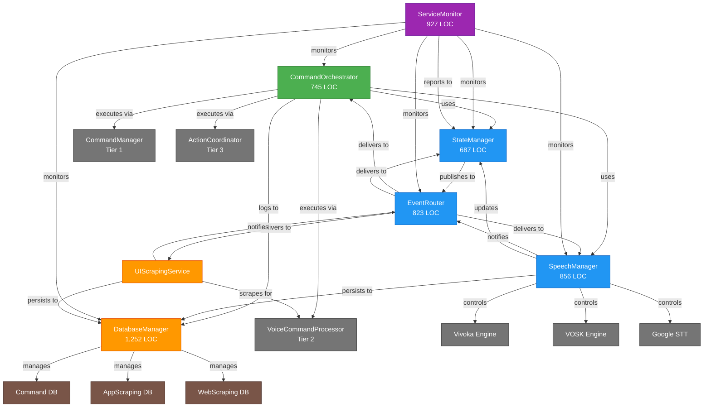
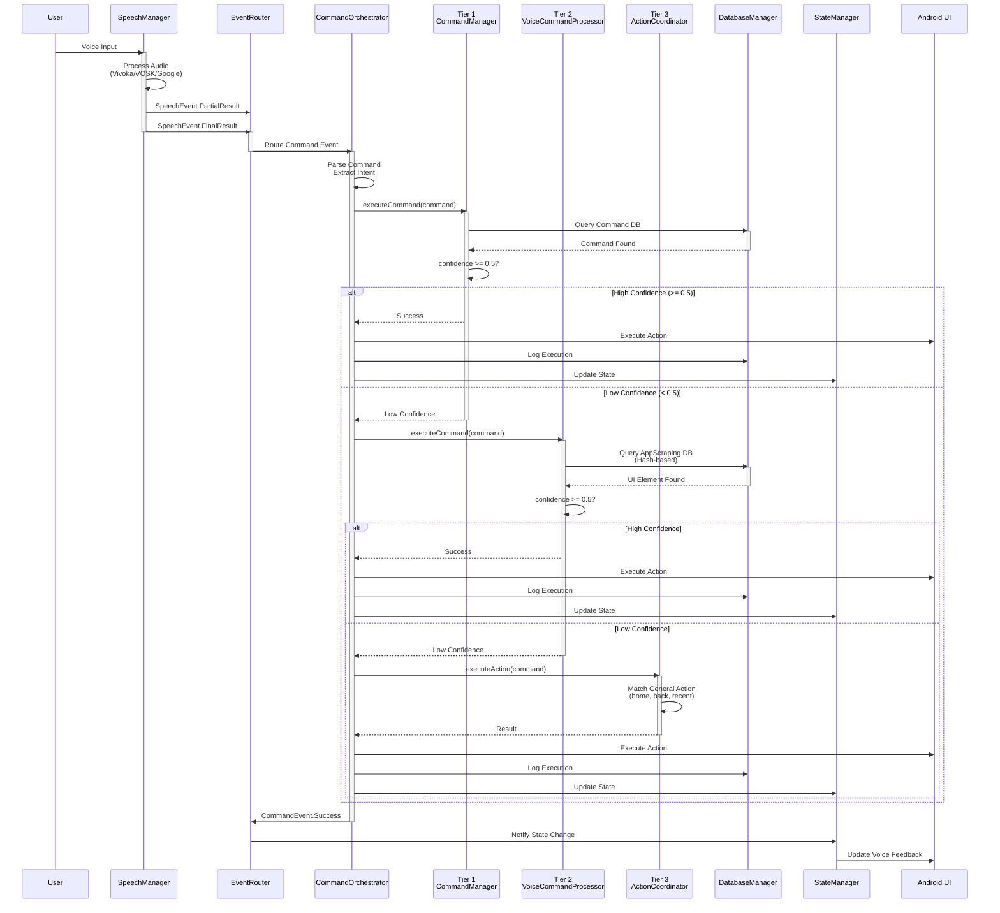
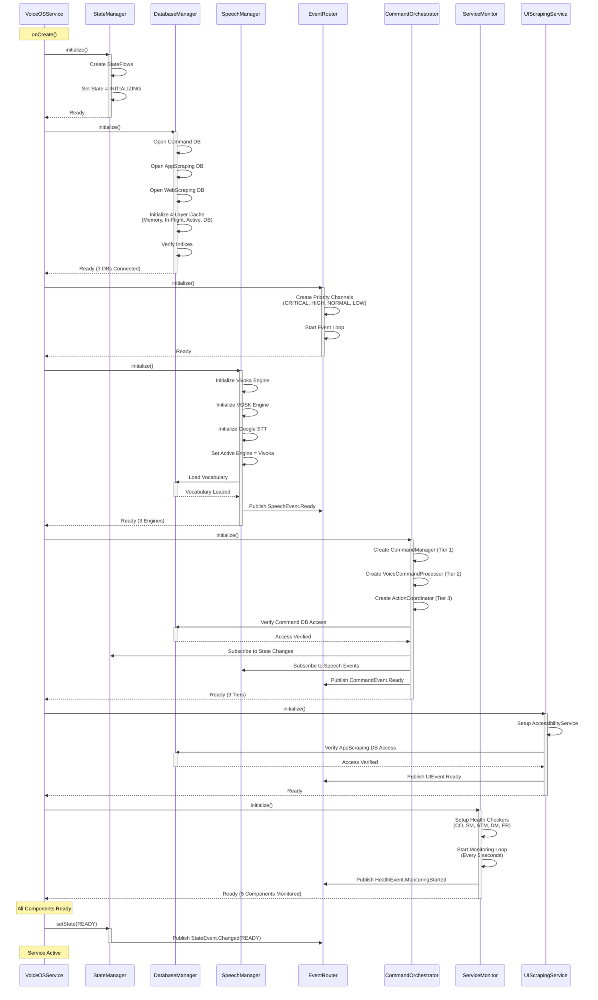

<!--
filename: Component-Interaction-Diagrams-251015-1627.md
created: 2025-10-15 16:27:29 PDT
author: VoiceOS Development Team / Claude Code
purpose: Component interaction diagrams for VoiceOS SOLID Refactoring
last-modified: 2025-10-15 16:27:29 PDT
version: v1
changelog:
- 2025-10-15 16:27:29 PDT: Initial version - 5 component interaction diagrams
-->

# VoiceOS SOLID Refactoring - Component Interaction Diagrams

**Document Type:** Architecture Visualization
**Version:** v1
**Created:** 2025-10-15 16:27:29 PDT
**Status:** ACTIVE - Testing Infrastructure Complete

---

## Document Purpose

This document provides comprehensive component interaction diagrams for the VoiceOS SOLID Refactoring. It visualizes how the 7 core components interact, communicate, and depend on each other to deliver voice command functionality.

**Related Documentation:**
- Architecture: `/docs/voiceos-master/architecture/Testing-Architecture-v1.md`
- Status: `/coding/STATUS/Status-VOS4-Project-251015-1348.md`
- Implementation: `/modules/apps/VoiceOSCore/src/main/java/com/augmentalis/voiceoscore/refactoring/impl/`

---

## Table of Contents

1. [Component Dependency Graph](#1-component-dependency-graph)
2. [Command Flow Diagram](#2-command-flow-diagram)
3. [Event Flow Diagram](#3-event-flow-diagram)
4. [Initialization Sequence](#4-initialization-sequence)
5. [Component Communication Matrix](#5-component-communication-matrix)

---

## 1. Component Dependency Graph

This diagram shows which components depend on which other components, establishing the dependency hierarchy.

**Key Observations:**
- **Zero-Dependency Monitor:** ServiceMonitor monitors all components but has no dependencies (monitors via reflection/inspection)
- **Central Hub:** EventRouter acts as central communication hub
- **State Management:** StateManager is used by CommandOrchestrator and SpeechManager for lifecycle coordination
- **Data Persistence:** DatabaseManager is used by CommandOrchestrator, SpeechManager, and UIScrapingService

---

## 2. Command Flow Diagram

This diagram shows the complete flow from voice input to command execution and UI update.

**Flow Characteristics:**
- **Sequential Tier Execution:** Only moves to next tier on failure/low confidence
- **Confidence Threshold:** Minimum 0.5 required for tier success
- **Database Queries:** Tier 1 & 2 query different databases
- **Universal Logging:** All executions logged regardless of tier
- **Reactive Updates:** State changes propagate via EventRouter

---

## 3. Event Flow Diagram

This diagram shows how events flow between components via the EventRouter's priority-based system.

```mermaid
graph TD
    %% Event Sources
    SM[SpeechManager]
    CO[CommandOrchestrator]
    STM[StateManager]
    UI[UIScrapingService]
    MON[ServiceMonitor]

    %% Event Router with Priority Queues
    ER[EventRouter]
    CRIT[CRITICAL Queue<br/>Priority: 100]
    HIGH[HIGH Queue<br/>Priority: 75]
    NORM[NORMAL Queue<br/>Priority: 50]
    LOW[LOW Queue<br/>Priority: 25]

    %% Event Subscribers
    SUB1[Command Handlers]
    SUB2[State Listeners]
    SUB3[UI Update Handlers]
    SUB4[Metric Collectors]

    %% Event Flow - Speech Events
    SM -->|SpeechEvent.Error<br/>Priority: CRITICAL| ER
    SM -->|SpeechEvent.FinalResult<br/>Priority: HIGH| ER
    SM -->|SpeechEvent.PartialResult<br/>Priority: NORMAL| ER
    SM -->|SpeechEvent.EngineSwitch<br/>Priority: LOW| ER

    %% Event Flow - Command Events
    CO -->|CommandEvent.Failed<br/>Priority: CRITICAL| ER
    CO -->|CommandEvent.Success<br/>Priority: HIGH| ER
    CO -->|CommandEvent.Started<br/>Priority: NORMAL| ER
    CO -->|CommandEvent.Queued<br/>Priority: LOW| ER

    %% Event Flow - State Events
    STM -->|StateEvent.Error<br/>Priority: CRITICAL| ER
    STM -->|StateEvent.Changed<br/>Priority: HIGH| ER
    STM -->|StateEvent.Transition<br/>Priority: NORMAL| ER

    %% Event Flow - UI Events
    UI -->|UIEvent.ScrapingFailed<br/>Priority: HIGH| ER
    UI -->|UIEvent.ElementFound<br/>Priority: NORMAL| ER
    UI -->|UIEvent.ScrapingComplete<br/>Priority: LOW| ER

    %% Event Flow - Monitor Events
    MON -->|HealthEvent.Degraded<br/>Priority: CRITICAL| ER
    MON -->|HealthEvent.Alert<br/>Priority: HIGH| ER
    MON -->|HealthEvent.Healthy<br/>Priority: NORMAL| ER

    %% Event Router Internal Flow
    ER --> CRIT
    ER --> HIGH
    ER --> NORM
    ER --> LOW

    %% Priority-Based Dispatch
    CRIT -->|Process First| SUB1
    HIGH -->|Process Second| SUB1
    NORM -->|Process Third| SUB2
    LOW -->|Process Last| SUB4

    CRIT --> SUB2
    HIGH --> SUB2
    NORM --> SUB3
    LOW --> SUB3

    CRIT --> SUB4
    HIGH --> SUB4

    %% Backpressure Handling
    CRIT -.->|If Full: Block| BP[Backpressure<br/>Strategy]
    HIGH -.->|If Full: Buffer| BP
    NORM -.->|If Full: Drop Oldest| BP
    LOW -.->|If Full: Drop New| BP

    %% Styling
    classDef source fill:#4CAF50,stroke:#2E7D32,color:#fff
    classDef router fill:#2196F3,stroke:#1565C0,color:#fff
    classDef queue fill:#FF9800,stroke:#E65100,color:#fff
    classDef subscriber fill:#9C27B0,stroke:#6A1B9A,color:#fff
    classDef backpressure fill:#F44336,stroke:#C62828,color:#fff

    class SM,CO,STM,UI,MON source
    class ER router
    class CRIT,HIGH,NORM,LOW queue
    class SUB1,SUB2,SUB3,SUB4 subscriber
    class BP backpressure
```

**Event Priorities:**
- **CRITICAL (100):** Errors, failures, health degradation - processed immediately
- **HIGH (75):** Final results, successes, state changes - processed quickly
- **NORMAL (50):** Partial results, transitions, standard events - normal processing
- **LOW (25):** Logging, metrics, non-urgent updates - delayed processing

**Backpressure Strategies:**
- **CRITICAL:** Block sender (wait for capacity)
- **HIGH:** Buffer events (expand queue if possible)
- **NORMAL:** Drop oldest events (maintain recency)
- **LOW:** Drop new events (preserve history)

---

## 4. Initialization Sequence

This diagram shows the startup sequence and component initialization order.

**Initialization Order Rationale:**
1. **StateManager First:** Required by all components for lifecycle tracking
2. **DatabaseManager Second:** Required by SpeechManager (vocabulary) and CommandOrchestrator (commands)
3. **EventRouter Third:** Required for component communication
4. **SpeechManager Fourth:** Loads vocabulary from DB, publishes to EventRouter
5. **CommandOrchestrator Fifth:** Depends on StateManager, SpeechManager, DatabaseManager
6. **UIScrapingService Sixth:** Independent, can initialize in parallel with CO
7. **ServiceMonitor Last:** Monitors all other components, started after everything is ready

**Initialization Timing:**
- **Total Startup:** ~2-3 seconds (depends on DB size and engine initialization)
- **Critical Path:** StateManager → DatabaseManager → SpeechManager → CommandOrchestrator
- **Parallel Paths:** UIScrapingService can initialize while CO initializes

---

## 5. Component Communication Matrix

This matrix shows which components directly communicate with which other components.

```mermaid
graph LR
    %% Components
    subgraph Legend
        direction TB
        L1[● = Synchronous Call]
        L2[◆ = Async Event]
        L3[▲ = Data Flow]
        L4[■ = Monitors]
    end

    subgraph "Component Communication Matrix"
        direction TB

        %% Matrix Headers
        M[" "]
        CO_H[CommandOrchestrator]
        SM_H[SpeechManager]
        STM_H[StateManager]
        DM_H[DatabaseManager]
        ER_H[EventRouter]
        MON_H[ServiceMonitor]
        UI_H[UIScrapingService]

        %% CommandOrchestrator Row
        CO_R[CommandOrchestrator]
        CO_CO["-"]
        CO_SM["◆ Subscribe<br/>● getState"]
        CO_STM["◆ Subscribe<br/>● getState"]
        CO_DM["▲ Log Commands<br/>● Query"]
        CO_ER["◆ Publish<br/>◆ Subscribe"]
        CO_MON[" "]
        CO_UI[" "]

        %% SpeechManager Row
        SM_R[SpeechManager]
        SM_CO[" "]
        SM_SM["-"]
        SM_STM["◆ Notify<br/>● getState"]
        SM_DM["▲ Vocabulary<br/>● Load/Save"]
        SM_ER["◆ Publish<br/>◆ Subscribe"]
        SM_MON[" "]
        SM_UI[" "]

        %% StateManager Row
        STM_R[StateManager]
        STM_CO["◆ State Events"]
        STM_SM["◆ State Events"]
        STM_STM["-"]
        STM_DM[" "]
        STM_ER["◆ Publish"]
        STM_MON[" "]
        STM_UI[" "]

        %% DatabaseManager Row
        DM_R[DatabaseManager]
        DM_CO["▲ Command Data"]
        DM_SM["▲ Vocabulary"]
        DM_STM[" "]
        DM_DM["-"]
        DM_ER[" "]
        DM_MON[" "]
        DM_UI["▲ Scraped Elements"]

        %% EventRouter Row
        ER_R[EventRouter]
        ER_CO["◆ Command Events"]
        ER_SM["◆ Speech Events"]
        ER_STM["◆ State Events"]
        ER_DM[" "]
        ER_ER["-"]
        ER_MON[" "]
        ER_UI["◆ UI Events"]

        %% ServiceMonitor Row
        MON_R[ServiceMonitor]
        MON_CO["■ Health Checks"]
        MON_SM["■ Health Checks"]
        MON_STM["■ Health Checks<br/>◆ Report Status"]
        MON_DM["■ Health Checks"]
        MON_ER["■ Health Checks<br/>◆ Publish Alerts"]
        MON_MON["-"]
        MON_UI[" "]

        %% UIScrapingService Row
        UI_R[UIScrapingService]
        UI_CO[" "]
        UI_SM[" "]
        UI_STM[" "]
        UI_DM["▲ Element Data<br/>● Save"]
        UI_ER["◆ Publish"]
        UI_MON[" "]
        UI_UI["-"]
    end

    %% Styling
    classDef header fill:#1976D2,stroke:#0D47A1,color:#fff,font-weight:bold
    classDef rowLabel fill:#424242,stroke:#212121,color:#fff,font-weight:bold
    classDef cell fill:#ECEFF1,stroke:#90A4AE,color:#000
    classDef empty fill:#FAFAFA,stroke:#E0E0E0,color:#999
    classDef legend fill:#FFF9C4,stroke:#F57F17,color:#000

    class M,CO_H,SM_H,STM_H,DM_H,ER_H,MON_H,UI_H header
    class CO_R,SM_R,STM_R,DM_R,ER_R,MON_R,UI_R rowLabel
    class CO_SM,CO_STM,CO_DM,CO_ER,SM_STM,SM_DM,SM_ER,STM_CO,STM_SM,STM_ER,DM_CO,DM_SM,DM_UI,ER_CO,ER_SM,ER_STM,ER_UI,MON_CO,MON_SM,MON_STM,MON_DM,MON_ER,UI_DM,UI_ER cell
    class CO_CO,SM_SM,STM_STM,DM_DM,ER_ER,MON_MON,UI_UI,CO_MON,CO_UI,SM_CO,SM_MON,SM_UI,STM_DM,STM_MON,STM_UI,DM_ER,DM_MON,ER_DM,ER_MON,MON_UI,UI_CO,UI_SM,UI_STM,UI_MON empty
    class L1,L2,L3,L4 legend
```

**Communication Matrix (Tabular View):**

|  | CommandOrchestrator | SpeechManager | StateManager | DatabaseManager | EventRouter | ServiceMonitor | UIScrapingService |
|---|---|---|---|---|---|---|---|
| **CommandOrchestrator** | - | ◆ Subscribe ● getState | ◆ Subscribe ● getState | ▲ Log Commands ● Query | ◆ Publish/Subscribe | - | - |
| **SpeechManager** | - | - | ◆ Notify ● getState | ▲ Vocabulary ● Load/Save | ◆ Publish/Subscribe | - | - |
| **StateManager** | ◆ State Events | ◆ State Events | - | - | ◆ Publish | - | - |
| **DatabaseManager** | ▲ Command Data | ▲ Vocabulary | - | - | - | - | ▲ Scraped Elements |
| **EventRouter** | ◆ Command Events | ◆ Speech Events | ◆ State Events | - | - | - | ◆ UI Events |
| **ServiceMonitor** | ■ Health Checks | ■ Health Checks | ■ Health Checks ◆ Report Status | ■ Health Checks | ■ Health Checks ◆ Publish Alerts | - | - |
| **UIScrapingService** | - | - | - | ▲ Element Data ● Save | ◆ Publish | - | - |

**Legend:**
- **● Synchronous Call:** Direct method invocation (blocking)
- **◆ Async Event:** Event published/subscribed via EventRouter (non-blocking)
- **▲ Data Flow:** Data read/write operations (query/persist)
- **■ Monitors:** Health monitoring (periodic checks, no dependency)

**Key Insights:**
- **EventRouter is Central Hub:** All components except DatabaseManager publish events
- **DatabaseManager is Pure Data:** No event publishing, only synchronous data operations
- **ServiceMonitor is Observer:** Monitors all components but doesn't create dependencies
- **StateManager is Broadcaster:** Only publishes events, doesn't subscribe to others
- **CommandOrchestrator is Most Connected:** Interacts with 5/7 components

---

## Appendix A: Component Statistics

### Component Size & Complexity

| Component | LOC | Tests | Test LOC | Test Ratio | Status |
|-----------|-----|-------|----------|------------|--------|
| DatabaseManager | 1,252 | 99 | 1,910 | 1.53:1 | ✅ Complete |
| ServiceMonitor | 927 | 83 | 1,374 | 1.48:1 | ✅ Complete |
| SpeechManager | 856 | 72 | 1,111 | 1.30:1 | ✅ Complete |
| EventRouter | 823 | 19 | 639 | 0.84:1 | ✅ Complete |
| CommandOrchestrator | 745 | 78 | 1,655 | 2.22:1 | ✅ Complete |
| StateManager | 687 | 70 | 1,100 | 1.60:1 | ✅ Complete |
| **TOTAL** | **5,290** | **496** | **9,146** | **1.73:1** | **93%** |

### Component Interaction Counts

| Component | Depends On | Used By | Publishes Events | Subscribes To Events |
|-----------|------------|---------|------------------|---------------------|
| CommandOrchestrator | 4 | 1 | ✅ | ✅ |
| SpeechManager | 3 | 2 | ✅ | ✅ |
| StateManager | 1 | 3 | ✅ | ❌ |
| DatabaseManager | 0 | 4 | ❌ | ❌ |
| EventRouter | 0 | 6 | ❌ | N/A (Router) |
| ServiceMonitor | 0 | 1 | ✅ | ❌ |
| UIScrapingService | 2 | 1 | ✅ | ❌ |

---

## Appendix B: Event Types & Priorities

### Speech Events
- **SpeechEvent.Error** - Priority: CRITICAL (100)
- **SpeechEvent.FinalResult** - Priority: HIGH (75)
- **SpeechEvent.PartialResult** - Priority: NORMAL (50)
- **SpeechEvent.EngineSwitch** - Priority: LOW (25)
- **SpeechEvent.VocabularyUpdated** - Priority: LOW (25)

### Command Events
- **CommandEvent.Failed** - Priority: CRITICAL (100)
- **CommandEvent.Timeout** - Priority: CRITICAL (100)
- **CommandEvent.Success** - Priority: HIGH (75)
- **CommandEvent.Started** - Priority: NORMAL (50)
- **CommandEvent.Queued** - Priority: LOW (25)

### State Events
- **StateEvent.Error** - Priority: CRITICAL (100)
- **StateEvent.Changed** - Priority: HIGH (75)
- **StateEvent.Transition** - Priority: NORMAL (50)

### Health Events
- **HealthEvent.Degraded** - Priority: CRITICAL (100)
- **HealthEvent.ComponentFailed** - Priority: CRITICAL (100)
- **HealthEvent.Alert** - Priority: HIGH (75)
- **HealthEvent.Recovered** - Priority: NORMAL (50)
- **HealthEvent.Healthy** - Priority: NORMAL (50)

### UI Events
- **UIEvent.ScrapingFailed** - Priority: HIGH (75)
- **UIEvent.ElementFound** - Priority: NORMAL (50)
- **UIEvent.ScrapingComplete** - Priority: LOW (25)

---

## Appendix C: Related Documentation

### Status Documents
- Overall Project Status: `/coding/STATUS/Status-VOS4-Project-251015-1348.md`
- Testing Status: `/coding/STATUS/Testing-Status-251015-1304.md`
- Compilation Success: `/coding/STATUS/Compilation-Success-251015-1205.md`

### Architecture Documents
- Testing Architecture: `/docs/voiceos-master/architecture/Testing-Architecture-v1.md`
- SOLID Analysis: `/docs/voiceos-master/architecture/VoiceOSService-SOLID-Analysis-251015-0018.md`
- Implementation Plan: `/docs/voiceos-master/architecture/Option4-Complete-Implementation-Plan-251015-0007.md`

### Implementation Files
- CommandOrchestratorImpl: `/modules/apps/VoiceOSCore/src/main/java/com/augmentalis/voiceoscore/refactoring/impl/CommandOrchestratorImpl.kt`
- SpeechManagerImpl: `/modules/apps/VoiceOSCore/src/main/java/com/augmentalis/voiceoscore/refactoring/impl/SpeechManagerImpl.kt`
- StateManagerImpl: `/modules/apps/VoiceOSCore/src/main/java/com/augmentalis/voiceoscore/refactoring/impl/StateManagerImpl.kt`
- DatabaseManagerImpl: `/modules/apps/VoiceOSCore/src/main/java/com/augmentalis/voiceoscore/refactoring/impl/DatabaseManagerImpl.kt`
- EventRouterImpl: `/modules/apps/VoiceOSCore/src/main/java/com/augmentalis/voiceoscore/refactoring/impl/EventRouterImpl.kt`
- ServiceMonitorImpl: `/modules/apps/VoiceOSCore/src/main/java/com/augmentalis/voiceoscore/refactoring/impl/ServiceMonitorImpl.kt`

---

## Document History

| Version | Date | Author | Changes |
|---------|------|--------|---------|
| v1 | 2025-10-15 16:27:29 PDT | Claude Code | Initial creation - 5 comprehensive component interaction diagrams |

---

**Last Updated:** 2025-10-15 16:27:29 PDT
**Status:** ACTIVE - Complete Visualization Set
**Next Review:** After testing infrastructure fixes
**Maintained By:** VOS4 Development Team
