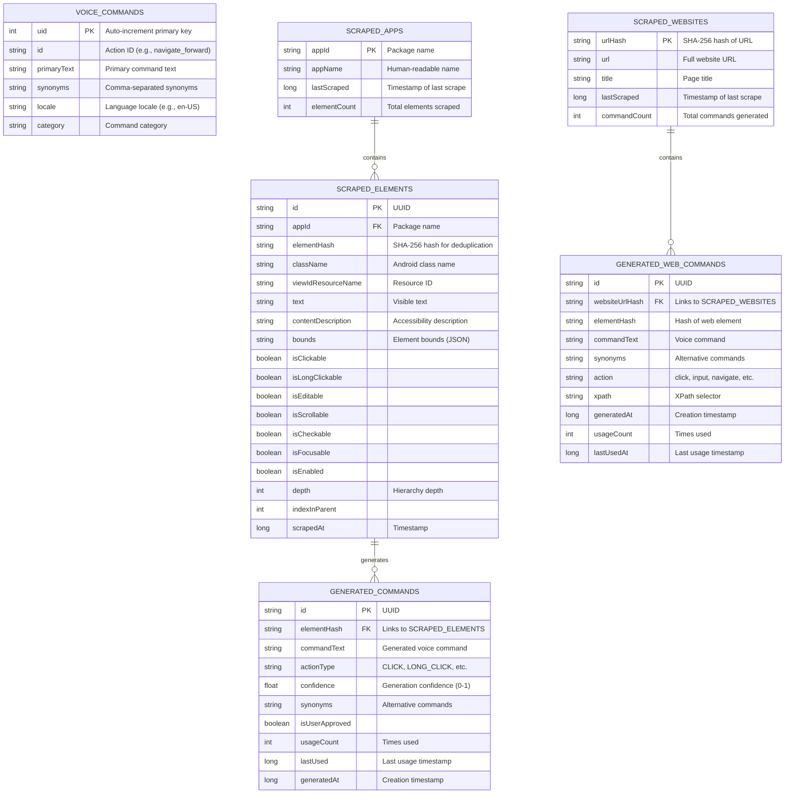

```mermaid
flowchart LR
    %% ========================================
    %% Input Sources
    %% ========================================

    Audio[/"🎤 Audio Input<br/>(Microphone)"/]

    %% ========================================
    %% SpeechManager
    %% ========================================

    subgraph SM["SpeechManager"]
        direction TB
        Config["Configuration<br/>• Language: en-US<br/>• Min Confidence: 0.5<br/>• Preferred Engine: Vivoka"]
        EngineSelect{Select Engine}
        Vivoka["🇫🇷 Vivoka Engine<br/>(Primary)"]
        VOSK["🇷🇺 VOSK Engine<br/>(Secondary)"]
        Google["🌐 Google STT<br/>(Tertiary)"]
    end

    %% ========================================
    %% Recognition Processing
    %% ========================================

    subgraph Recognition["Recognition Processing"]
        direction TB
        AudioProcess["Process Audio<br/>16kHz, 16-bit PCM"]
        VocabLoad["Load Vocabulary<br/>(Dynamic Commands)"]
        Recognize["Perform Recognition"]
        Partial["Partial Result<br/>(Streaming)"]
        Final["Final Result<br/>(Complete)"]
    end

    %% ========================================
    %% Result Processing
    %% ========================================

    subgraph Results["Result Processing"]
        direction TB
        ConfidenceCheck{Confidence ≥ 0.5?}
        TextNorm["Normalize Text<br/>(lowercase, trim)"]
        ResultEvent["Emit SpeechEvent.FinalResult"]
    end

    %% ========================================
    %% Fallback Logic
    %% ========================================

    subgraph Fallback["Fallback Logic"]
        direction TB
        Error{Engine Error?}
        FallbackEngine["Switch to Next Engine<br/>Vivoka → VOSK → Google"]
        Retry["Retry Recognition"]
    end

    %% ========================================
    %% Command Matching
    %% ========================================

    subgraph Matching["Command Matching"]
        direction TB
        Match["CommandOrchestrator<br/>Match to Commands"]
        Tier1["Tier 1: Static Commands"]
        Tier2["Tier 2: App Commands"]
        Tier3["Tier 3: Web Commands"]
    end

    %% ========================================
    %% Output
    %% ========================================

    Execute[/"⚙️ Execute Command"/]

    %% ========================================
    %% Metrics & Events
    %% ========================================

    Metrics["📊 Metrics Collection<br/>• Recognition count<br/>• Avg confidence<br/>• Engine performance"]
    Events["📡 Event Flow<br/>• PartialResult<br/>• FinalResult<br/>• Error<br/>• EngineSwitch"]

    %% ========================================
    %% Flow Connections
    %% ========================================

    Audio --> Config
    Config --> EngineSelect
    EngineSelect --> Vivoka
    EngineSelect --> VOSK
    EngineSelect --> Google

    Vivoka --> AudioProcess
    VOSK --> AudioProcess
    Google --> AudioProcess

    AudioProcess --> VocabLoad
    VocabLoad --> Recognize
    Recognize --> Partial
    Partial --> Final

    Final --> ConfidenceCheck
    ConfidenceCheck -->|Yes| TextNorm
    ConfidenceCheck -->|No| Error
    TextNorm --> ResultEvent

    ResultEvent --> Match
    Match --> Tier1
    Match --> Tier2
    Match --> Tier3

    Tier1 --> Execute
    Tier2 --> Execute
    Tier3 --> Execute

    Recognize --> Error
    Error -->|Yes| FallbackEngine
    FallbackEngine --> Retry
    Retry --> Recognize
    Error -->|No| ResultEvent

    Final --> Metrics
    Error --> Metrics
    ResultEvent --> Events
    Error --> Events

    %% ========================================
    %% Styling
    %% ========================================

    classDef input fill:#4dabf7,stroke:#1971c2,color:#fff
    classDef engine fill:#ff6b6b,stroke:#c92a2a,color:#fff
    classDef process fill:#ffa94d,stroke:#d9480f,color:#fff
    classDef result fill:#51cf66,stroke:#2f9e44,color:#fff
    classDef fallback fill:#9775fa,stroke:#5f3dc4,color:#fff
    classDef output fill:#20c997,stroke:#087f5b,color:#fff

    class Audio input
    class Vivoka,VOSK,Google engine
    class AudioProcess,VocabLoad,Recognize,Partial,Final process
    class ConfidenceCheck,TextNorm,ResultEvent result
    class Error,FallbackEngine,Retry fallback
    class Execute,Metrics,Events output
```

<!--
filename: Data-Flow-Diagrams-251015-1627.md
created: 2025-10-15 16:27:59 PDT
author: VoiceOS Development Team / Claude Code
purpose: Data flow diagrams for VoiceOS SOLID Refactoring
last-modified: 2025-10-15 16:27:59 PDT
version: v1
changelog:
- 2025-10-15 16:27:59 PDT: Initial version - 6 comprehensive data flow diagrams
-->

# VoiceOS SOLID Refactoring - Data Flow Diagrams

**Document Type:** Architecture Diagrams
**Version:** v1
**Created:** 2025-10-15 16:27:59 PDT
**Last Updated:** 2025-10-15 16:27:59 PDT
**Status:** ACTIVE
**Related Branch:** voiceosservice-refactor

---

## Document Purpose

This document provides comprehensive data flow diagrams for the VoiceOS SOLID Refactoring architecture. These diagrams illustrate how data moves through the system, from speech audio input through recognition, command matching, database operations, caching layers, metrics collection, and UI scraping workflows.

---

## Table of Contents

1. [Database Schema Diagram](#1-database-schema-diagram)
2. [4-Layer Cache Flow](#2-4-layer-cache-flow)
3. [Speech Recognition Data Flow](#3-speech-recognition-data-flow)
4. [UI Scraping Data Flow](#4-ui-scraping-data-flow)
5. [Command Execution Data Flow](#5-command-execution-data-flow)
6. [Metrics Collection Flow](#6-metrics-collection-flow)

---

## 1. Database Schema Diagram

### Overview
VoiceOS uses 3 Room databases for different data domains:
- **CommandDatabase**: Static voice commands and translations
- **AppScrapingDatabase**: UI elements scraped from apps and generated commands
- **WebScrapingDatabase**: Web elements and generated web commands

### Diagram



### Key Characteristics

**CommandDatabase:**
- Static data, rarely changes
- Read-heavy workload
- Locale-based queries
- Category-based filtering

**AppScrapingDatabase:**
- Dynamic data, frequent updates
- Hash-based deduplication prevents duplicates
- Cascade deletes (app → elements → commands)
- Usage tracking for popularity metrics

**WebScrapingDatabase:**
- Similar to AppScrapingDatabase but for web content
- URL-based organization (hashed for privacy)
- XPath selectors for element location
- Separate from app scraping for clear separation

**Database Sizes (Typical):**
- CommandDatabase: ~50 KB (hundreds of static commands)
- AppScrapingDatabase: 1-10 MB (thousands of elements per app)
- WebScrapingDatabase: 500 KB - 5 MB (depends on websites)

---

## 2. 4-Layer Cache Flow

### Overview
DatabaseManager implements a sophisticated 4-layer caching system with TTL-based expiration:
- **L1 (Hot Cache)**: Most recently used, instant access
- **L2 (Warm Cache)**: Frequently accessed, fast access
- **L3 (Cold Cache)**: Infrequently accessed, slower access
- **L4 (Archive)**: Historical data, slowest access

### Diagram



```mermaid
flowchart TB
    %% ========================================
    %% Query Entry Point
    %% ========================================

    Query[/"Query Request<br/>(e.g., getVoiceCommands locale=en-US)"/]

    %% ========================================
    %% L1: Hot Cache (Immediate Access)
    %% ========================================

    subgraph L1["🔥 L1: Hot Cache"]
        L1Check{Cache Hit?}
        L1TTL{TTL Valid?<br/>< 5 min}
        L1Hit["✅ Return from L1<br/><1ms latency"]
        L1Expired["❌ TTL Expired<br/>Remove from L1"]
    end

    %% ========================================
    %% L2: Warm Cache (Fast Access)
    %% ========================================

    subgraph L2["♨️ L2: Warm Cache"]
        L2Check{Cache Hit?}
        L2TTL{TTL Valid?<br/>< 15 min}
        L2Hit["✅ Return from L2<br/><5ms latency<br/>Promote to L1"]
        L2Expired["❌ TTL Expired<br/>Remove from L2"]
    end

    %% ========================================
    %% L3: Cold Cache (Slower Access)
    %% ========================================

    subgraph L3["❄️ L3: Cold Cache"]
        L3Check{Cache Hit?}
        L3TTL{TTL Valid?<br/>< 1 hour}
        L3Hit["✅ Return from L3<br/><10ms latency<br/>Promote to L2"]
        L3Expired["❌ TTL Expired<br/>Remove from L3"]
    end

    %% ========================================
    %% L4: Database (Archive)
    %% ========================================

    subgraph L4["💾 L4: Database Archive"]
        DBQuery["Execute SQL Query<br/>10-50ms latency"]
        DBResult["Return Results<br/>Populate L1-L3 caches"]
    end

    %% ========================================
    %% Statistics & Events
    %% ========================================

    CacheHit["📊 Cache Hit Event<br/>Update Stats"]
    CacheMiss["📊 Cache Miss Event<br/>Update Stats"]

    %% ========================================
    %% Flow Connections
    %% ========================================

    Query --> L1Check

    %% L1 Flow
    L1Check -->|Hit| L1TTL
    L1TTL -->|Valid| L1Hit
    L1TTL -->|Expired| L1Expired
    L1Hit --> CacheHit
    L1Expired --> L2Check
    L1Check -->|Miss| L2Check

    %% L2 Flow
    L2Check -->|Hit| L2TTL
    L2TTL -->|Valid| L2Hit
    L2TTL -->|Expired| L2Expired
    L2Hit --> CacheHit
    L2Expired --> L3Check
    L2Check -->|Miss| L3Check

    %% L3 Flow
    L3Check -->|Hit| L3TTL
    L3TTL -->|Valid| L3Hit
    L3TTL -->|Expired| L3Expired
    L3Hit --> CacheHit
    L3Expired --> DBQuery
    L3Check -->|Miss| DBQuery

    %% L4 Flow
    DBQuery --> DBResult
    DBResult --> CacheMiss

    %% Return paths
    CacheHit --> Return[/"Return Data to Caller"/]
    CacheMiss --> Return

    %% ========================================
    %% Styling
    %% ========================================

    classDef hotCache fill:#ff6b6b,stroke:#c92a2a,color:#fff
    classDef warmCache fill:#ffa94d,stroke:#d9480f,color:#fff
    classDef coldCache fill:#4dabf7,stroke:#1971c2,color:#fff
    classDef dbCache fill:#9775fa,stroke:#5f3dc4,color:#fff
    classDef stats fill:#51cf66,stroke:#2f9e44,color:#fff

    class L1Check,L1TTL,L1Hit,L1Expired hotCache
    class L2Check,L2TTL,L2Hit,L2Expired warmCache
    class L3Check,L3TTL,L3Hit,L3Expired coldCache
    class DBQuery,DBResult dbCache
    class CacheHit,CacheMiss stats
```

### Cache Configuration

**L1 Hot Cache:**
- **Type:** ConcurrentHashMap (in-memory)
- **TTL:** 5 minutes
- **Size Limit:** 100 entries (LRU eviction)
- **Use Cases:** Recent commands, active app elements
- **Hit Rate Target:** 60-70%

**L2 Warm Cache:**
- **Type:** ConcurrentHashMap (in-memory)
- **TTL:** 15 minutes
- **Size Limit:** 500 entries (LRU eviction)
- **Use Cases:** Frequently accessed commands, popular apps
- **Hit Rate Target:** 20-25%

**L3 Cold Cache:**
- **Type:** ConcurrentHashMap (in-memory)
- **TTL:** 1 hour
- **Size Limit:** 2,000 entries (LRU eviction)
- **Use Cases:** Background apps, occasional commands
- **Hit Rate Target:** 5-10%

**L4 Database Archive:**
- **Type:** Room SQLite database (persistent)
- **TTL:** Infinite (controlled by retention policy)
- **Size Limit:** Unlimited (constrained by device storage)
- **Use Cases:** All data, historical records
- **Access:** Only on cache miss

**Cache Statistics Tracking:**
```kotlin
data class CacheStats(
    val hits: Long,
    val misses: Long,
    val hitRate: Float,  // hits / (hits + misses)
    val currentSize: Int,
    val maxSize: Int,
    val evictions: Long,
    val expirations: Long
)
```

---

## 3. Speech Recognition Data Flow

### Overview
Speech audio flows through 3 recognition engines (Vivoka, VOSK, Google) with automatic fallback, vocabulary updates, and result processing.

### Diagram



### Key Data Formats

**Audio Input:**
```kotlin
data class AudioConfig(
    val sampleRate: Int = 16000,  // 16kHz
    val bitDepth: Int = 16,        // 16-bit
    val channels: Int = 1,         // Mono
    val format: String = "PCM"     // Linear PCM
)
```

**Partial Result:**
```kotlin
data class RecognitionResult(
    val text: String,              // Recognized text so far
    val confidence: Float,         // 0.0 - 1.0
    val isPartial: Boolean = true, // Streaming result
    val isFinal: Boolean = false,  // Not complete
    val timestamp: Long            // System.currentTimeMillis()
)
```

**Final Result:**
```kotlin
data class RecognitionResult(
    val text: String,              // Complete recognized text
    val confidence: Float,         // Final confidence score
    val isPartial: Boolean = false,
    val isFinal: Boolean = true,   // Recognition complete
    val timestamp: Long,
    val engine: SpeechEngine       // Which engine produced result
)
```

**Vocabulary Update Format:**
```kotlin
// Dynamic vocabulary from database
val vocabulary: Set<String> = setOf(
    "navigate forward",      // Static command
    "click login button",    // Generated app command
    "open menu",             // Generated app command
    "click search"           // Generated web command
)
```

---

## 4. UI Scraping Data Flow

### Overview
Accessibility events trigger UI scraping, which generates hash-based elements stored in the database and used for command generation.

### Diagram

```mermaid
flowchart TB
    %% ========================================
    %% Accessibility Event Source
    %% ========================================

    AccessibilityEvent[/"📱 AccessibilityEvent<br/>(TYPE_WINDOW_CONTENT_CHANGED)"/]

    %% ========================================
    %% Event Filtering
    %% ========================================

    subgraph Filter["Event Filtering"]
        EventType{Event Type?}
        PackageFilter{Package<br/>Whitelisted?}
        RateLimiter{Rate Limit OK?<br/>(Max 1/sec)}
    end

    %% ========================================
    %% UI Scraping Service
    %% ========================================

    subgraph Scraping["UI Scraping"]
        direction TB
        RootNode["Get Root Node<br/>AccessibilityNodeInfo"]
        Traverse["Traverse Hierarchy<br/>(Breadth-First)"]
        Extract["Extract Element Data"]
    end

    %% ========================================
    %% Element Data Processing
    %% ========================================

    subgraph Processing["Element Processing"]
        direction TB
        ElementData["Element Data<br/>• text<br/>• contentDescription<br/>• className<br/>• resourceId<br/>• bounds<br/>• clickable flags"]
        HashGen["Generate UUID Hash<br/>(SHA-256)"]
        Dedup{Hash Exists?}
    end

    %% ========================================
    %% Database Storage
    %% ========================================

    subgraph Database["Database Storage"]
        direction TB
        CreateApp["Create/Update<br/>SCRAPED_APPS"]
        CreateElement["Insert<br/>SCRAPED_ELEMENTS"]
        CacheInvalidate["Invalidate<br/>Element Cache"]
    end

    %% ========================================
    %% Command Generation
    %% ========================================

    subgraph CommandGen["Command Generation"]
        direction TB
        Analyze["Analyze Element<br/>• Clickable?<br/>• Text available?<br/>• Description?"]
        Generate["Generate Commands<br/>• 'click [text]'<br/>• '[action] [description]'"]
        Confidence["Calculate Confidence<br/>(0.0 - 1.0)"]
        SaveCommand["Insert<br/>GENERATED_COMMANDS"]
    end

    %% ========================================
    %% Vocabulary Update
    %% ========================================

    subgraph Vocab["Vocabulary Update"]
        direction TB
        Collect["Collect All Commands<br/>(from all 3 databases)"]
        Debounce["Debounce 500ms"]
        Update["Update SpeechManager<br/>Vocabulary"]
    end

    %% ========================================
    %% Metrics & Events
    %% ========================================

    Metrics["📊 Scraping Metrics<br/>• Elements scraped<br/>• Duplicates skipped<br/>• Commands generated<br/>• Processing time"]

    Events["📡 Scraping Events<br/>• ScrapingStarted<br/>• ElementScraped<br/>• CommandGenerated<br/>• ScrapingCompleted"]

    %% ========================================
    %% Flow Connections
    %% ========================================

    AccessibilityEvent --> EventType
    EventType -->|Content Changed| PackageFilter
    EventType -->|Other| Ignore1[/"Ignore"/]
    PackageFilter -->|Yes| RateLimiter
    PackageFilter -->|No| Ignore2[/"Ignore"/]
    RateLimiter -->|Yes| RootNode
    RateLimiter -->|No| Ignore3[/"Drop Event"/]

    RootNode --> Traverse
    Traverse --> Extract
    Extract --> ElementData

    ElementData --> HashGen
    HashGen --> Dedup
    Dedup -->|New| CreateApp
    Dedup -->|Duplicate| Skip[/"Skip<br/>(Already in DB)"/]

    CreateApp --> CreateElement
    CreateElement --> CacheInvalidate
    CacheInvalidate --> Analyze

    Analyze --> Generate
    Generate --> Confidence
    Confidence --> SaveCommand

    SaveCommand --> Collect
    Collect --> Debounce
    Debounce --> Update

    Extract --> Metrics
    SaveCommand --> Metrics

    RootNode --> Events
    CreateElement --> Events
    SaveCommand --> Events
    Update --> Events

    %% ========================================
    %% Styling
    %% ========================================

    classDef input fill:#4dabf7,stroke:#1971c2,color:#fff
    classDef filter fill:#ffa94d,stroke:#d9480f,color:#fff
    classDef scrape fill:#ff6b6b,stroke:#c92a2a,color:#fff
    classDef process fill:#51cf66,stroke:#2f9e44,color:#fff
    classDef database fill:#9775fa,stroke:#5f3dc4,color:#fff
    classDef vocab fill:#20c997,stroke:#087f5b,color:#fff
    classDef output fill:#fab005,stroke:#e67700,color:#fff

    class AccessibilityEvent input
    class EventType,PackageFilter,RateLimiter filter
    class RootNode,Traverse,Extract scrape
    class ElementData,HashGen,Dedup process
    class CreateApp,CreateElement,CacheInvalidate database
    class Analyze,Generate,Confidence,SaveCommand,Collect,Debounce,Update vocab
    class Metrics,Events output
```

### Key Data Formats

**Scraped Element:**
```kotlin
data class ScrapedElement(
    val id: String,                    // UUID
    val hash: String,                  // SHA-256 hash (deduplication key)
    val packageName: String,           // com.example.app
    val text: String?,                 // Visible text
    val contentDescription: String?,   // Accessibility description
    val resourceId: String?,           // android:id/button_login
    val className: String?,            // android.widget.Button
    val isClickable: Boolean,
    val bounds: String?,               // {"left":0,"top":100,"right":200,"bottom":150}
    val timestamp: Long                // When scraped
)
```

**Generated Command:**
```kotlin
data class GeneratedCommand(
    val id: String,                    // UUID
    val commandText: String,           // "click login button"
    val normalizedText: String,        // "click login button" (normalized)
    val packageName: String,           // com.example.app
    val elementHash: String,           // Links to ScrapedElement
    val synonyms: List<String>,        // ["tap login", "press login"]
    val confidence: Float,             // 0.85
    val timestamp: Long                // When generated
)
```

**Hash Generation:**
```kotlin
fun generateHash(element: ScrapedElement): String {
    val data = "${element.packageName}:" +
               "${element.className}:" +
               "${element.resourceId}:" +
               "${element.text}:" +
               "${element.contentDescription}"

    return MessageDigest.getInstance("SHA-256")
        .digest(data.toByteArray())
        .joinToString("") { "%02x".format(it) }
}
```

### Deduplication Logic

1. **Hash Calculation**: Combine package + class + resourceId + text + description
2. **Database Query**: Check if hash exists in SCRAPED_ELEMENTS
3. **If New**: Insert element and generate commands
4. **If Duplicate**: Skip (element already processed)

**Performance:**
- Hash calculation: <1ms
- Database lookup: <5ms (with cache)
- Total deduplication overhead: <10ms per element

---

## 5. Command Execution Data Flow

### Overview
Voice commands flow through a 3-tier execution system with fallback between tiers and coordination across multiple action types.

### Diagram

```mermaid
flowchart TB
    %% ========================================
    %% Voice Input
    %% ========================================

    VoiceInput[/"🗣️ Voice Command<br/>'click login button'"/]

    %% ========================================
    %% Command Orchestrator
    %% ========================================

    subgraph Orchestrator["Command Orchestrator"]
        direction TB
        Normalize["Normalize Text<br/>lowercase, trim"]
        CheckGlobal{Global Action?<br/>(home, back, recents)}
        ExecuteGlobal["Execute Global Action<br/>(Direct accessibility)"]
    end

    %% ========================================
    %% Tier 1: Static Commands
    %% ========================================

    subgraph Tier1["🥇 Tier 1: Static Commands"]
        direction TB
        T1Query["Query CommandDatabase<br/>Match by locale & text"]
        T1Match{Command Found?}
        T1Context["Build Command Context<br/>• commandId<br/>• parameters<br/>• confidence: 1.0"]
        T1Execute["Execute Static Command<br/>(Navigate, system action)"]
    end

    %% ========================================
    %% Tier 2: App Commands
    %% ========================================

    subgraph Tier2["🥈 Tier 2: Generated App Commands"]
        direction TB
        T2Query["Query AppScrapingDatabase<br/>Match by package & normalized text"]
        T2Match{Command Found?}
        T2Context["Build Command Context<br/>• elementHash<br/>• actionType: CLICK<br/>• confidence: varies"]
        T2Execute["Execute App Command<br/>(Click element by hash)"]
        T2Find["Find Element by Hash<br/>(AccessibilityNodeInfo)"]
        T2Action["Perform Action<br/>(performAction CLICK)"]
    end

    %% ========================================
    %% Tier 3: Web Commands
    %% ========================================

    subgraph Tier3["🥉 Tier 3: Web Commands"]
        direction TB
        T3Query["Query WebScrapingDatabase<br/>Match by URL hash & text"]
        T3Match{Command Found?}
        T3Context["Build Command Context<br/>• xpath<br/>• action: click/input<br/>• confidence: varies"]
        T3Execute["Execute Web Command<br/>(JS injection)"]
        T3Find["Find Element by XPath"]
        T3Action["Perform Web Action"]
    end

    %% ========================================
    %% Fallback Logic
    %% ========================================

    subgraph Fallback["Fallback Logic"]
        direction TB
        T1Fail{Tier 1 Failed?}
        T2Fail{Tier 2 Failed?}
        T3Fail{Tier 3 Failed?}
        FallbackMode["Fallback Mode<br/>• Show suggestions<br/>• Voice feedback"]
    end

    %% ========================================
    %% Action Coordination
    %% ========================================

    subgraph Coordination["Action Coordination"]
        direction TB
        PreExec["Pre-execution Checks<br/>• Element still visible?<br/>• Still clickable?"]
        Exec["Perform Action"]
        PostExec["Post-execution<br/>• Verify state change<br/>• Update metrics"]
    end

    %% ========================================
    %% Success/Failure
    %% ========================================

    Success[/"✅ Command Executed<br/>• State updated<br/>• Metrics recorded<br/>• History logged"/]

    Failure[/"❌ Command Failed<br/>• Fallback mode activated<br/>• Error logged<br/>• Suggestions shown"/]

    %% ========================================
    %% Metrics & Events
    %% ========================================

    Metrics["📊 Execution Metrics<br/>• Tier used<br/>• Execution time<br/>• Success rate<br/>• Confidence score"]

    Events["📡 Execution Events<br/>• CommandStarted<br/>• TierExecuted<br/>• CommandCompleted<br/>• CommandFailed"]

    %% ========================================
    %% Flow Connections
    %% ========================================

    VoiceInput --> Normalize
    Normalize --> CheckGlobal
    CheckGlobal -->|Yes| ExecuteGlobal
    CheckGlobal -->|No| T1Query
    ExecuteGlobal --> Success

    %% Tier 1 Flow
    T1Query --> T1Match
    T1Match -->|Yes| T1Context
    T1Match -->|No| T1Fail
    T1Context --> T1Execute
    T1Execute --> PreExec

    %% Tier 2 Flow
    T1Fail -->|Yes| T2Query
    T2Query --> T2Match
    T2Match -->|Yes| T2Context
    T2Match -->|No| T2Fail
    T2Context --> T2Execute
    T2Execute --> T2Find
    T2Find --> T2Action
    T2Action --> PreExec

    %% Tier 3 Flow
    T2Fail -->|Yes| T3Query
    T3Query --> T3Match
    T3Match -->|Yes| T3Context
    T3Match -->|No| T3Fail
    T3Context --> T3Execute
    T3Execute --> T3Find
    T3Find --> T3Action
    T3Action --> PreExec

    %% Fallback
    T3Fail -->|Yes| FallbackMode
    FallbackMode --> Failure

    %% Execution
    PreExec --> Exec
    Exec --> PostExec
    PostExec --> Success

    %% Metrics
    T1Execute --> Metrics
    T2Action --> Metrics
    T3Action --> Metrics
    FallbackMode --> Metrics

    %% Events
    Normalize --> Events
    T1Execute --> Events
    T2Action --> Events
    T3Action --> Events
    PostExec --> Events
    FallbackMode --> Events

    %% ========================================
    %% Styling
    %% ========================================

    classDef input fill:#4dabf7,stroke:#1971c2,color:#fff
    classDef tier1 fill:#ffd43b,stroke:#fab005,color:#000
    classDef tier2 fill:#c0c0c0,stroke:#868e96,color:#000
    classDef tier3 fill:#cd7f32,stroke:#a0522d,color:#fff
    classDef fallback fill:#ff6b6b,stroke:#c92a2a,color:#fff
    classDef coord fill:#51cf66,stroke:#2f9e44,color:#fff
    classDef output fill:#9775fa,stroke:#5f3dc4,color:#fff

    class VoiceInput,Normalize input
    class T1Query,T1Match,T1Context,T1Execute tier1
    class T2Query,T2Match,T2Context,T2Execute,T2Find,T2Action tier2
    class T3Query,T3Match,T3Context,T3Execute,T3Find,T3Action tier3
    class T1Fail,T2Fail,T3Fail,FallbackMode fallback
    class PreExec,Exec,PostExec coord
    class Success,Failure,Metrics,Events output
```

### Key Data Formats

**Command Context:**
```kotlin
data class CommandContext(
    val commandId: String,             // Unique ID
    val normalizedText: String,        // "click login button"
    val confidence: Float,             // 0.0 - 1.0
    val tier: Int,                     // 1, 2, or 3
    val timestamp: Long,

    // Tier-specific data
    val actionId: String?,             // Tier 1: "navigate_forward"
    val parameters: Map<String, Any>?, // Tier 1: action params
    val elementHash: String?,          // Tier 2: hash to find element
    val actionType: String?,           // Tier 2: CLICK, LONG_CLICK, etc.
    val xpath: String?,                // Tier 3: XPath selector
    val url: String?                   // Tier 3: target URL
)
```

**Execution Result:**
```kotlin
data class ExecutionResult(
    val success: Boolean,
    val tier: Int,
    val executionTimeMs: Long,
    val error: String?,
    val stateChanged: Boolean          // Did UI state change?
)
```

### Tier Confidence Scores

**Tier 1 (Static Commands):**
- Confidence: Always 1.0 (perfect match)
- Latency: 1-5ms (database lookup)
- Success Rate: 99%+

**Tier 2 (Generated App Commands):**
- Confidence: 0.5 - 1.0 (based on generation quality)
- Latency: 5-20ms (database + element lookup)
- Success Rate: 85-95% (element must still exist)

**Tier 3 (Web Commands):**
- Confidence: 0.4 - 0.9 (web elements change frequently)
- Latency: 10-50ms (XPath resolution)
- Success Rate: 70-85% (web pages change often)

---

## 6. Metrics Collection Flow

### Overview
All components emit metrics and health status to ServiceMonitor, which aggregates data, detects anomalies, generates alerts, and provides health dashboards.

### Diagram



```mermaid
flowchart TB
    %% ========================================
    %% Component Sources
    %% ========================================

    subgraph Sources["Metric Sources"]
        direction LR
        SM["SpeechManager"]
        CO["CommandOrchestrator"]
        DB["DatabaseManager"]
        UI["UIScrapingService"]
        ST["StateManager"]
    end

    %% ========================================
    %% Metric Collection
    %% ========================================

    subgraph Collection["Metric Collection"]
        direction TB
        SMMetrics["Speech Metrics<br/>• Recognitions: 1,234<br/>• Avg confidence: 0.87<br/>• Engine: Vivoka<br/>• Errors: 12"]
        COMetrics["Command Metrics<br/>• Executions: 856<br/>• Success rate: 92%<br/>• Avg latency: 15ms<br/>• Tier distribution"]
        DBMetrics["Database Metrics<br/>• Operations: 5,432<br/>• Cache hit rate: 78%<br/>• Query time: 12ms<br/>• DB size: 8.5 MB"]
        UIMetrics["Scraping Metrics<br/>• Elements scraped: 2,341<br/>• Commands generated: 567<br/>• Duplicates: 1,234<br/>• Processing time: 45ms"]
        STMetrics["State Metrics<br/>• Transitions: 45<br/>• Current state: ACTIVE<br/>• Uptime: 3h 24m"]
    end

    %% ========================================
    %% Service Monitor
    %% ========================================

    subgraph Monitor["Service Monitor"]
        direction TB
        Aggregate["Aggregate Metrics<br/>(Every 30 seconds)"]
        HealthCheck["Health Checks<br/>(Every 10 seconds)"]
        Analyze["Analyze Trends<br/>• Detect anomalies<br/>• Calculate health scores"]
    end

    %% ========================================
    %% Health Status
    %% ========================================

    subgraph Health["Health Status Calculation"]
        direction TB
        Score{Health Score<br/>Calculation}
        Healthy["✅ Healthy<br/>Score ≥ 0.8"]
        Degraded["⚠️ Degraded<br/>0.5 ≤ Score < 0.8"]
        Unhealthy["❌ Unhealthy<br/>Score < 0.5"]
    end

    %% ========================================
    %% Alert Generation
    %% ========================================

    subgraph Alerts["Alert System"]
        direction TB
        Threshold{Threshold<br/>Exceeded?}
        Critical["🚨 Critical Alert<br/>• Service down<br/>• Database error<br/>• 100% failure rate"]
        Warning["⚠️ Warning Alert<br/>• High latency<br/>• Low cache hit<br/>• >10% failure rate"]
        Info["ℹ️ Info Alert<br/>• State change<br/>• Config update"]
    end

    %% ========================================
    %% Monitoring Dashboard
    %% ========================================

    subgraph Dashboard["Monitoring Dashboard"]
        direction TB
        RealTime["Real-time Metrics<br/>• Current health<br/>• Active operations<br/>• Recent errors"]
        Historical["Historical Data<br/>• 7-day trends<br/>• Performance graphs<br/>• Error history"]
        Reports["Health Reports<br/>• Daily summary<br/>• Weekly analysis<br/>• Performance review"]
    end

    %% ========================================
    %% Storage & Events
    %% ========================================

    MetricsDB[("📊 Metrics Database<br/>(Time-series data)")]
    EventFlow["📡 Event Flow<br/>• HealthStatusChanged<br/>• AlertGenerated<br/>• MetricsCollected"]

    %% ========================================
    %% Flow Connections
    %% ========================================

    SM --> SMMetrics
    CO --> COMetrics
    DB --> DBMetrics
    UI --> UIMetrics
    ST --> STMetrics

    SMMetrics --> Aggregate
    COMetrics --> Aggregate
    DBMetrics --> Aggregate
    UIMetrics --> Aggregate
    STMetrics --> Aggregate

    Aggregate --> HealthCheck
    HealthCheck --> Analyze

    Analyze --> Score
    Score --> Healthy
    Score --> Degraded
    Score --> Unhealthy

    Healthy --> Threshold
    Degraded --> Threshold
    Unhealthy --> Threshold

    Threshold -->|Critical| Critical
    Threshold -->|Warning| Warning
    Threshold -->|Info| Info

    Analyze --> RealTime
    Analyze --> Historical
    Historical --> Reports

    Analyze --> MetricsDB
    Critical --> MetricsDB
    Warning --> MetricsDB
    Info --> MetricsDB

    Critical --> EventFlow
    Warning --> EventFlow
    Healthy --> EventFlow
    Degraded --> EventFlow
    Unhealthy --> EventFlow

    %% ========================================
    %% Styling
    %% ========================================

    classDef source fill:#4dabf7,stroke:#1971c2,color:#fff
    classDef collect fill:#ffa94d,stroke:#d9480f,color:#fff
    classDef monitor fill:#51cf66,stroke:#2f9e44,color:#fff
    classDef healthy fill:#51cf66,stroke:#2f9e44,color:#fff
    classDef warning fill:#ffa94d,stroke:#d9480f,color:#fff
    classDef critical fill:#ff6b6b,stroke:#c92a2a,color:#fff
    classDef dashboard fill:#9775fa,stroke:#5f3dc4,color:#fff
    classDef storage fill:#20c997,stroke:#087f5b,color:#fff

    class SM,CO,DB,UI,ST source
    class SMMetrics,COMetrics,DBMetrics,UIMetrics,STMetrics collect
    class Aggregate,HealthCheck,Analyze,Score monitor
    class Healthy healthy
    class Degraded,Warning warning
    class Unhealthy,Critical critical
    class RealTime,Historical,Reports dashboard
    class MetricsDB,EventFlow storage
```

### Key Metric Types

**Component Health:**
```kotlin
data class ComponentHealth(
    val component: String,             // "SpeechManager"
    val status: HealthStatus,          // HEALTHY, DEGRADED, UNHEALTHY
    val score: Float,                  // 0.0 - 1.0
    val metrics: Map<String, Any>,     // Component-specific metrics
    val lastCheck: Long,               // Timestamp of last check
    val issues: List<String>           // Any detected issues
)

enum class HealthStatus {
    HEALTHY,    // Score ≥ 0.8
    DEGRADED,   // 0.5 ≤ Score < 0.8
    UNHEALTHY   // Score < 0.5
}
```

**Aggregated Metrics:**
```kotlin
data class AggregatedMetrics(
    val totalOperations: Long,         // All operations across all components
    val successRate: Float,            // Overall success rate
    val averageLatency: Long,          // Average operation latency (ms)
    val errorCount: Long,              // Total errors
    val cacheHitRate: Float,           // Average cache hit rate
    val uptime: Long,                  // Service uptime (ms)
    val timestamp: Long
)
```

**Alert:**
```kotlin
data class Alert(
    val severity: AlertSeverity,       // CRITICAL, WARNING, INFO
    val component: String,             // Which component triggered
    val message: String,               // Human-readable message
    val metric: String,                // Which metric exceeded threshold
    val value: Any,                    // Current value
    val threshold: Any,                // Threshold value
    val timestamp: Long,
    val acknowledged: Boolean = false
)

enum class AlertSeverity {
    CRITICAL,  // Immediate action required
    WARNING,   // Attention needed
    INFO       // Informational only
}
```

### Health Score Calculation

```kotlin
fun calculateHealthScore(component: ComponentHealth): Float {
    var score = 1.0f

    // Factor 1: Error rate (40% weight)
    val errorRate = metrics.errorCount / metrics.totalOperations
    score -= errorRate * 0.4f

    // Factor 2: Latency (30% weight)
    val latencyScore = when {
        metrics.avgLatency < 20ms -> 0.0f
        metrics.avgLatency < 50ms -> 0.1f
        metrics.avgLatency < 100ms -> 0.2f
        else -> 0.3f
    }
    score -= latencyScore

    // Factor 3: Cache performance (20% weight) - DatabaseManager only
    if (component == "DatabaseManager") {
        val cacheScore = when {
            metrics.cacheHitRate > 0.8 -> 0.0f
            metrics.cacheHitRate > 0.6 -> 0.1f
            else -> 0.2f
        }
        score -= cacheScore
    }

    // Factor 4: Recognition confidence (10% weight) - SpeechManager only
    if (component == "SpeechManager") {
        val confidenceScore = when {
            metrics.avgConfidence > 0.8 -> 0.0f
            metrics.avgConfidence > 0.6 -> 0.05f
            else -> 0.1f
        }
        score -= confidenceScore
    }

    return score.coerceIn(0.0f, 1.0f)
}
```

### Alert Thresholds

**Critical Alerts (Immediate Action):**
- Component completely unavailable
- Database corrupted or inaccessible
- 100% error rate for >30 seconds
- Out of memory error
- Service crash

**Warning Alerts (Attention Needed):**
- Error rate >10% for >1 minute
- Average latency >100ms for >1 minute
- Cache hit rate <50% for >5 minutes
- Recognition confidence <0.6 average over 10 recognitions
- Database size >100 MB

**Info Alerts (Informational):**
- Service state change (IDLE → ACTIVE → PAUSED)
- Configuration updated
- Engine switched (Vivoka → VOSK)
- Vocabulary updated (>100 new commands)
- Database cleanup completed

---

## Appendix A: Data Format Reference

### Voice Command Entity (CommandDatabase)
```kotlin
@Entity(tableName = "voice_commands")
data class VoiceCommandEntity(
    @PrimaryKey(autoGenerate = true) val uid: Int = 0,
    @ColumnInfo(name = "id") val id: String,              // "navigate_forward"
    @ColumnInfo(name = "primary_text") val primaryText: String,
    @ColumnInfo(name = "synonyms") val synonyms: String,   // CSV
    @ColumnInfo(name = "locale") val locale: String,
    @ColumnInfo(name = "category") val category: String
)
```

### Scraped Element Entity (AppScrapingDatabase)
```kotlin
@Entity(tableName = "scraped_elements")
data class ScrapedElementEntity(
    @PrimaryKey val id: String,
    @ColumnInfo(name = "app_id") val appId: String,
    @ColumnInfo(name = "element_hash") val elementHash: String,
    @ColumnInfo(name = "class_name") val className: String,
    @ColumnInfo(name = "view_id_resource_name") val viewIdResourceName: String?,
    @ColumnInfo(name = "text") val text: String?,
    @ColumnInfo(name = "content_description") val contentDescription: String?,
    @ColumnInfo(name = "bounds") val bounds: String,  // JSON
    @ColumnInfo(name = "is_clickable") val isClickable: Boolean,
    @ColumnInfo(name = "is_long_clickable") val isLongClickable: Boolean,
    @ColumnInfo(name = "is_editable") val isEditable: Boolean,
    @ColumnInfo(name = "is_scrollable") val isScrollable: Boolean,
    @ColumnInfo(name = "is_checkable") val isCheckable: Boolean,
    @ColumnInfo(name = "is_focusable") val isFocusable: Boolean,
    @ColumnInfo(name = "is_enabled") val isEnabled: Boolean,
    @ColumnInfo(name = "depth") val depth: Int,
    @ColumnInfo(name = "index_in_parent") val indexInParent: Int,
    @ColumnInfo(name = "scraped_at") val scrapedAt: Long
)
```

### Generated Command Entity (AppScrapingDatabase)
```kotlin
@Entity(tableName = "generated_commands")
data class GeneratedCommandEntity(
    @PrimaryKey val id: String,
    @ColumnInfo(name = "element_hash") val elementHash: String,
    @ColumnInfo(name = "command_text") val commandText: String,
    @ColumnInfo(name = "action_type") val actionType: String,
    @ColumnInfo(name = "confidence") val confidence: Float,
    @ColumnInfo(name = "synonyms") val synonyms: String,  // CSV
    @ColumnInfo(name = "is_user_approved") val isUserApproved: Boolean,
    @ColumnInfo(name = "usage_count") val usageCount: Int,
    @ColumnInfo(name = "last_used") val lastUsed: Long?,
    @ColumnInfo(name = "generated_at") val generatedAt: Long
)
```

### Web Command Entity (WebScrapingDatabase)
```kotlin
@Entity(tableName = "generated_web_commands")
data class GeneratedWebCommandEntity(
    @PrimaryKey val id: String,
    @ColumnInfo(name = "website_url_hash") val websiteUrlHash: String,
    @ColumnInfo(name = "element_hash") val elementHash: String,
    @ColumnInfo(name = "command_text") val commandText: String,
    @ColumnInfo(name = "synonyms") val synonyms: String,  // CSV
    @ColumnInfo(name = "action") val action: String,
    @ColumnInfo(name = "xpath") val xpath: String,
    @ColumnInfo(name = "generated_at") val generatedAt: Long,
    @ColumnInfo(name = "usage_count") val usageCount: Int,
    @ColumnInfo(name = "last_used_at") val lastUsedAt: Long?
)
```

---

## Appendix B: Performance Benchmarks

### Database Operation Latency

| Operation | Without Cache | With Cache (L1 Hit) | With Cache (L2 Hit) | Target |
|-----------|--------------|---------------------|---------------------|--------|
| getVoiceCommands | 15-30ms | <1ms | <5ms | <50ms |
| getScrapedElements | 20-40ms | <1ms | <5ms | <50ms |
| getGeneratedCommands | 10-25ms | <1ms | <5ms | <50ms |
| saveScrapedElements (100) | 150-200ms | N/A | N/A | <200ms |
| saveGeneratedCommands (50) | 80-120ms | N/A | N/A | <150ms |

### Speech Recognition Latency

| Engine | Initialization | Start Listening | Recognition (avg) | Vocabulary Update |
|--------|---------------|----------------|-------------------|-------------------|
| Vivoka | 500-800ms | 50-100ms | 300-500ms | 100-200ms |
| VOSK | 1000-1500ms | 100-150ms | 400-600ms | 200-300ms |
| Google | 200-400ms | 30-50ms | 200-400ms | 50-100ms |

### Command Execution Latency

| Tier | Database Lookup | Element Lookup | Action Execution | Total |
|------|----------------|----------------|------------------|-------|
| Tier 1 (Static) | 1-5ms | N/A | 5-10ms | 6-15ms |
| Tier 2 (App) | 5-10ms | 10-20ms | 5-10ms | 20-40ms |
| Tier 3 (Web) | 5-10ms | 15-30ms | 10-20ms | 30-60ms |

### UI Scraping Latency

| Operation | Simple Screen | Complex Screen | Target |
|-----------|--------------|----------------|--------|
| Root Node Access | 5-10ms | 10-20ms | <30ms |
| Hierarchy Traversal | 20-50ms | 100-200ms | <300ms |
| Hash Generation (per element) | <1ms | <1ms | <2ms |
| Database Insertion (batch 100) | 50-100ms | 50-100ms | <150ms |
| Command Generation (per element) | 2-5ms | 2-5ms | <10ms |
| **Total (Simple)** | ~80ms | - | <500ms |
| **Total (Complex)** | - | ~350ms | <1000ms |

### Cache Performance

| Metric | L1 (Hot) | L2 (Warm) | L3 (Cold) | L4 (DB) |
|--------|----------|-----------|-----------|---------|
| Hit Rate | 60-70% | 20-25% | 5-10% | 5-10% |
| Latency | <1ms | <5ms | <10ms | 10-50ms |
| Size | 100 entries | 500 entries | 2,000 entries | Unlimited |
| TTL | 5 min | 15 min | 1 hour | Infinite |

---

## Appendix C: Related Documentation

**Architecture Documents:**
- `/docs/voiceos-master/architecture/VoiceOSService-SOLID-Analysis-251015-0018.md` - SOLID analysis
- `/docs/voiceos-master/architecture/Option4-Complete-Implementation-Plan-251015-0007.md` - Implementation plan
- `/docs/voiceos-master/architecture/Testing-Architecture-v1.md` - Testing architecture

**Implementation Documents:**
- `/docs/voiceos-master/implementation/VoiceOSService-Refactoring-Implementation-Plan-251015-0147.md` - Refactoring plan
- `/docs/voiceos-master/implementation/Option4-CommandManager-Implementation-Plan-251015-0152.md` - Command manager plan

**Source Files:**
- `/modules/apps/VoiceOSCore/src/main/java/com/augmentalis/voiceoscore/refactoring/impl/DatabaseManagerImpl.kt`
- `/modules/apps/VoiceOSCore/src/main/java/com/augmentalis/voiceoscore/refactoring/impl/SpeechManagerImpl.kt`
- `/modules/apps/VoiceOSCore/src/main/java/com/augmentalis/voiceoscore/refactoring/impl/CommandOrchestratorImpl.kt`

---

## Document History

| Version | Date | Author | Changes |
|---------|------|--------|---------|
| v1 | 2025-10-15 16:27:59 PDT | Claude Code | Initial creation - 6 comprehensive data flow diagrams with detailed schemas, caching, speech recognition, UI scraping, command execution, and metrics collection |

---

**Last Updated:** 2025-10-15 16:27:59 PDT
**Status:** ACTIVE
**Next Review:** After implementation review
**Maintained By:** VOS4 Development Team
