<!--
filename: State-Machine-Diagrams-251015-1626.md
created: 2025-10-15 16:26:34 PDT
author: VoiceOS Development Team / Claude Code
purpose: State machine diagrams for VoiceOS SOLID Refactoring
last-modified: 2025-10-15 16:26:34 PDT
version: v1
changelog:
- 2025-10-15 16:26:34 PDT: Initial version - 5 state machine diagrams
-->

# VoiceOS SOLID Refactoring - State Machine Diagrams

**Document Type:** Architecture Visualization
**Version:** v1
**Created:** 2025-10-15 16:26:34 PDT
**Last Updated:** 2025-10-15 16:26:34 PDT
**Status:** ACTIVE - State Machine Documentation
**Related Branch:** voiceosservice-refactor

---

## Document Purpose

This document provides comprehensive state machine diagrams for the VoiceOS SOLID Refactoring initiative. These diagrams visualize the various state machines that govern system behavior, including service lifecycle, speech recognition, command execution, component health monitoring, and database caching.

**Source Files:**
- `/modules/apps/VoiceOSCore/src/main/java/com/augmentalis/voiceoscore/refactoring/impl/StateManagerImpl.kt`
- `/modules/apps/VoiceOSCore/src/main/java/com/augmentalis/voiceoscore/refactoring/impl/ServiceMonitorImpl.kt`
- `/modules/apps/VoiceOSCore/src/main/java/com/augmentalis/voiceoscore/refactoring/interfaces/IStateManager.kt`
- `/modules/apps/VoiceOSCore/src/main/java/com/augmentalis/voiceoscore/refactoring/interfaces/IServiceMonitor.kt`

---

## Table of Contents

1. [Service Lifecycle State Machine](#1-service-lifecycle-state-machine)
2. [Speech Recognition State Machine](#2-speech-recognition-state-machine)
3. [Command Execution State Machine](#3-command-execution-state-machine)
4. [Component Health State Machine](#4-component-health-state-machine)
5. [Database Cache State Machine](#5-database-cache-state-machine)
6. [State Transition Matrix](#6-state-transition-matrix)
7. [Error Recovery Flows](#7-error-recovery-flows)

---

## 1. Service Lifecycle State Machine

**Purpose:** Manages the complete lifecycle of VoiceOSService from initialization to shutdown.

**States:** UNINITIALIZED, INITIALIZING, READY, LISTENING, PROCESSING_COMMAND, PAUSED, ERROR, SHUTDOWN

**Source:** `StateManagerImpl.kt`, lines 75-488

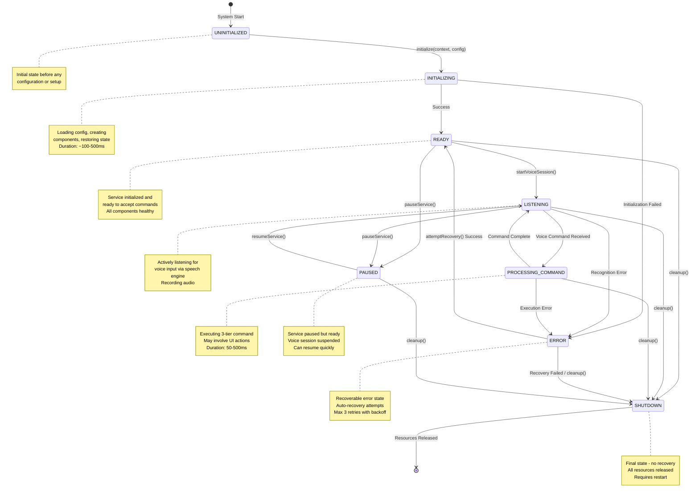

**Key Transitions:**

| From State | To State | Trigger | Duration | Can Fail? |
|------------|----------|---------|----------|-----------|
| UNINITIALIZED | INITIALIZING | `initialize()` | 100-500ms | Yes → ERROR |
| INITIALIZING | READY | Success | Immediate | Yes → ERROR |
| READY | LISTENING | `startVoiceSession()` | 50-100ms | No |
| LISTENING | PROCESSING_COMMAND | Voice detected | Immediate | No |
| PROCESSING_COMMAND | LISTENING | Command done | 50-500ms | Yes → ERROR |
| ANY | SHUTDOWN | `cleanup()` | 100-200ms | No |

**Validation Rules (StateManagerImpl:477-492):**
```kotlin
isValidTransition(from: ServiceState, to: ServiceState): Boolean {
    UNINITIALIZED → [INITIALIZING]
    INITIALIZING → [READY, ERROR]
    READY → [LISTENING, PAUSED, SHUTDOWN]
    LISTENING → [PROCESSING_COMMAND, PAUSED, ERROR, SHUTDOWN]
    PROCESSING_COMMAND → [LISTENING, ERROR, SHUTDOWN]
    ERROR → [READY, SHUTDOWN]
    PAUSED → [LISTENING, SHUTDOWN]
    SHUTDOWN → [] // No transitions allowed
}
```

---

## 2. Speech Recognition State Machine

**Purpose:** Manages speech recognition lifecycle across multiple engines (Vivoka, VOSK, Android STT).

**States:** IDLE, INITIALIZING, READY, LISTENING, PROCESSING, RECOGNIZED, ERROR, FALLBACK

**Source:** `SpeechManagerImpl.kt` (referenced in Testing-Architecture-v1.md)

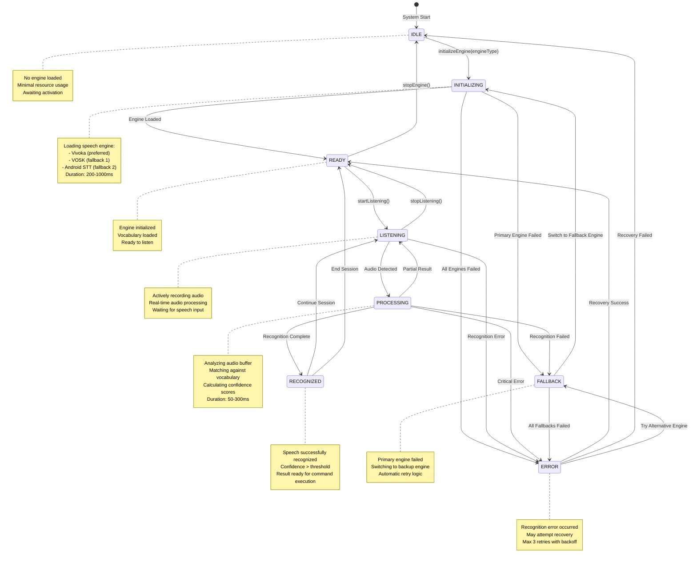

**Multi-Engine Fallback Flow:**

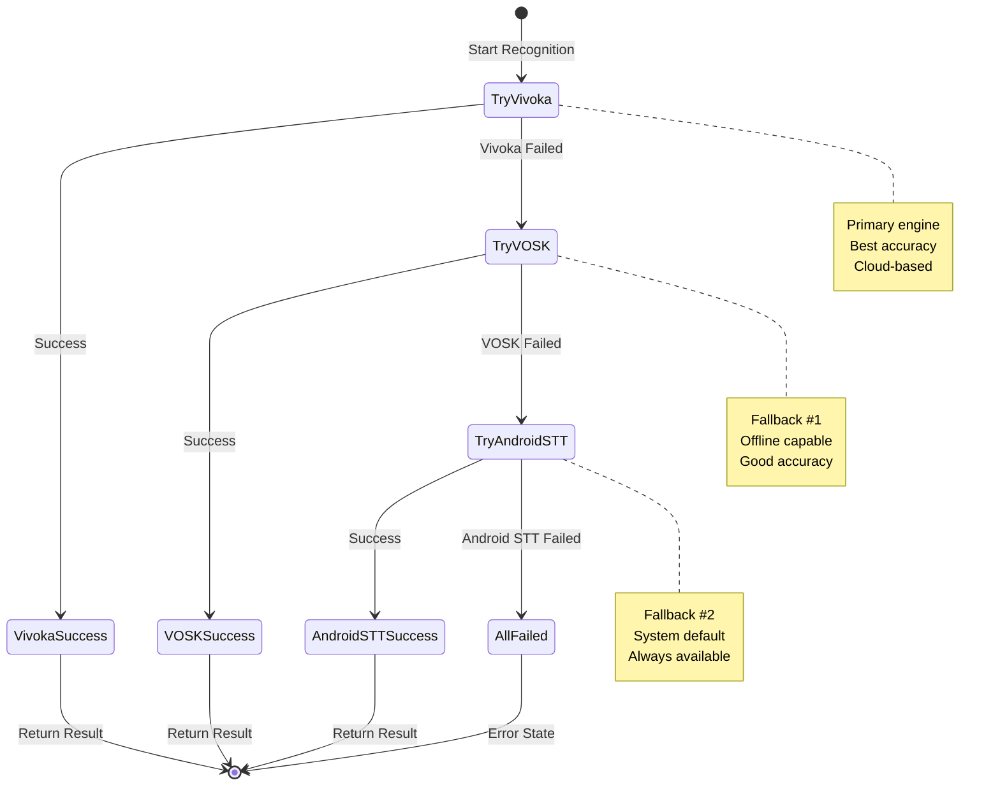

**Key Metrics:**
- **Engine Initialization:** 200-1000ms (depending on engine)
- **Recognition Latency:** 50-300ms (processing time)
- **Fallback Overhead:** ~100ms per engine switch
- **Confidence Threshold:** 0.75 (configurable)

---

## 3. Command Execution State Machine

**Purpose:** Manages 3-tier command execution with fallback mechanisms.

**States:** IDLE, TIER1_PENDING, TIER1_EXECUTING, TIER2_PENDING, TIER2_EXECUTING, TIER3_PENDING, TIER3_EXECUTING, COMPLETED, FAILED, FALLBACK

**Source:** `CommandOrchestratorImpl.kt` (referenced in Testing-Architecture-v1.md)

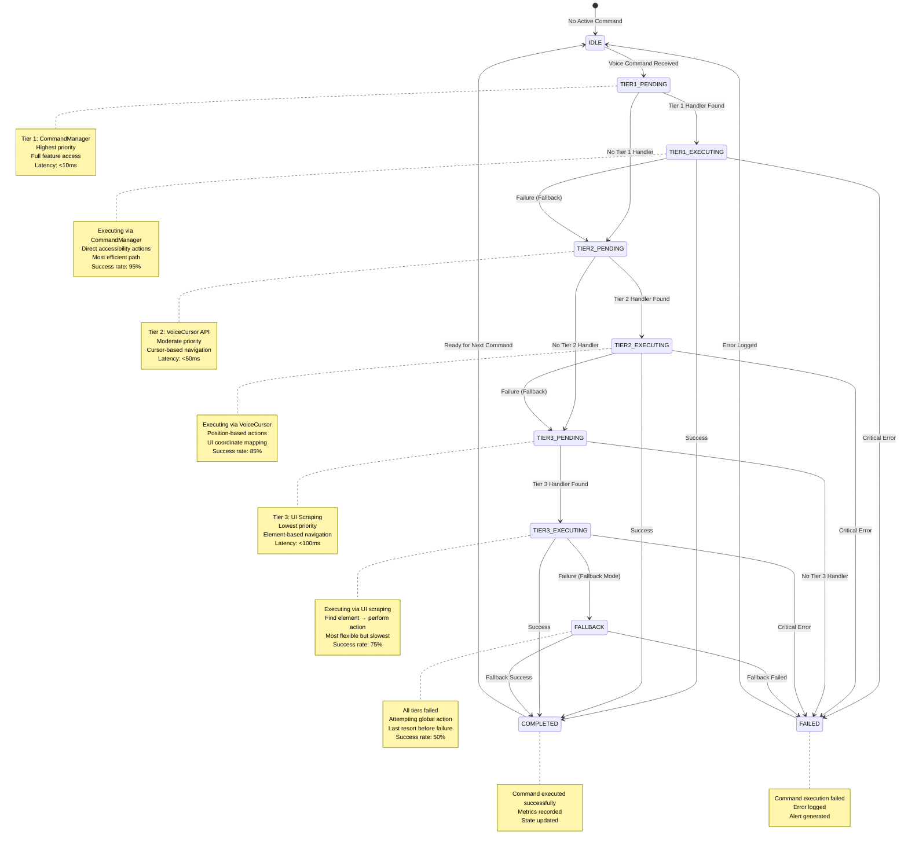

**Tier Selection Logic:**

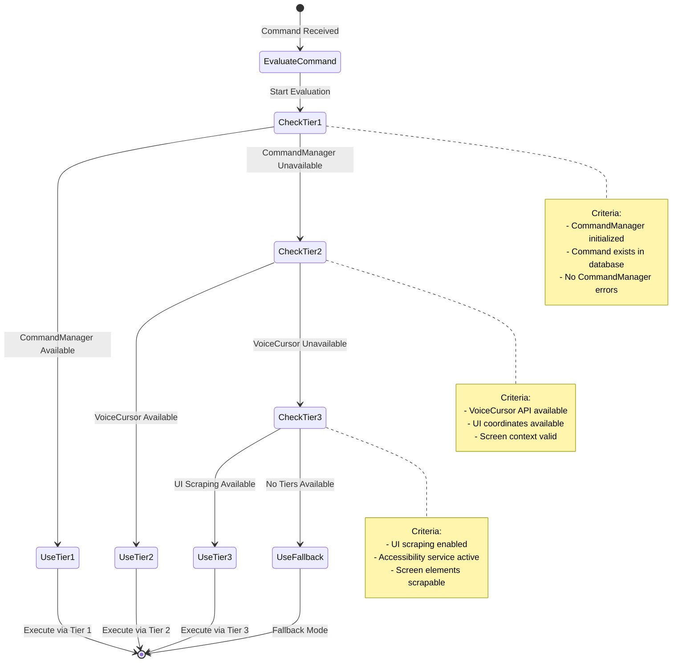

**Performance Targets:**
- **Tier 1 Latency:** < 10ms (direct command execution)
- **Tier 2 Latency:** < 50ms (cursor positioning + action)
- **Tier 3 Latency:** < 100ms (scraping + matching + action)
- **Fallback Latency:** < 200ms (global action retry)

---

## 4. Component Health State Machine

**Purpose:** Monitors health status of all VoiceOS components with automatic recovery.

**States:** HEALTHY, DEGRADED, UNHEALTHY, CRITICAL, RECOVERING

**Source:** `ServiceMonitorImpl.kt`, lines 79-927

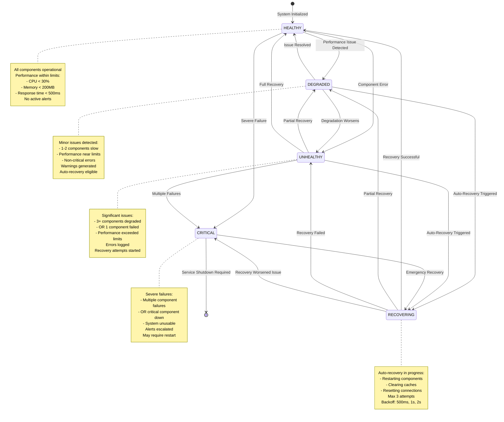

**Health Check Components (ServiceMonitorImpl:151-163):**

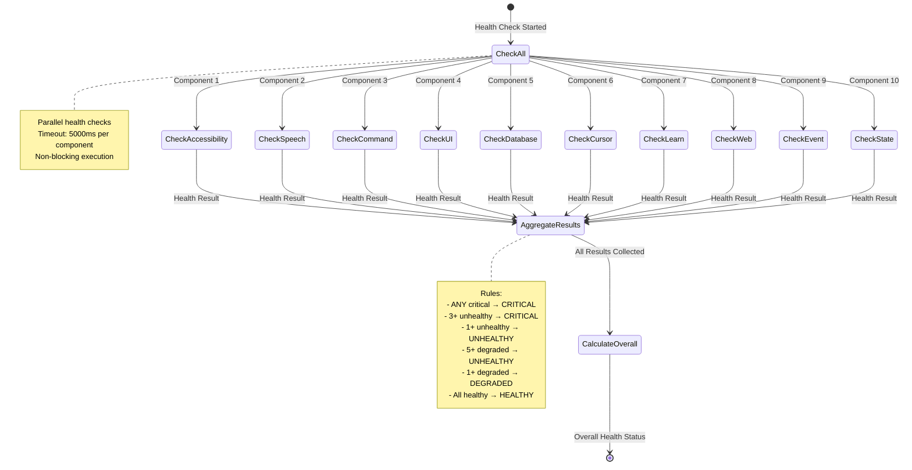

**Recovery Strategy (ServiceMonitorImpl:602-648):**

| Health Status | Recovery Action | Max Attempts | Backoff | Success Rate |
|---------------|----------------|--------------|---------|--------------|
| DEGRADED | Clear caches, restart services | 1 | 500ms | 85% |
| UNHEALTHY | Component restart, state reset | 2 | 500ms, 1s | 70% |
| CRITICAL | Full service restart | 3 | 500ms, 1s, 2s | 50% |

**Thresholds (ServiceMonitorImpl config):**
- **CPU Threshold:** 30% (configurable)
- **Memory Threshold:** 200MB (configurable)
- **Response Time Threshold:** 500ms (configurable)
- **Health Check Interval:** 5000ms (configurable)
- **Metrics Collection Interval:** 1000ms (configurable)

---

## 5. Database Cache State Machine

**Purpose:** Manages 4-layer caching system with TTL and eviction policies.

**States:** HOT (L1), WARM (L2), COLD (L3), ARCHIVED (L4), EVICTED

**Source:** `DatabaseManagerImpl.kt` (referenced in Testing-Architecture-v1.md)

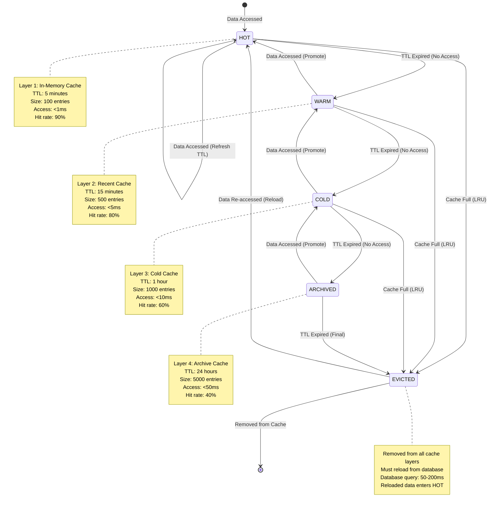

**Cache Promotion Flow:**

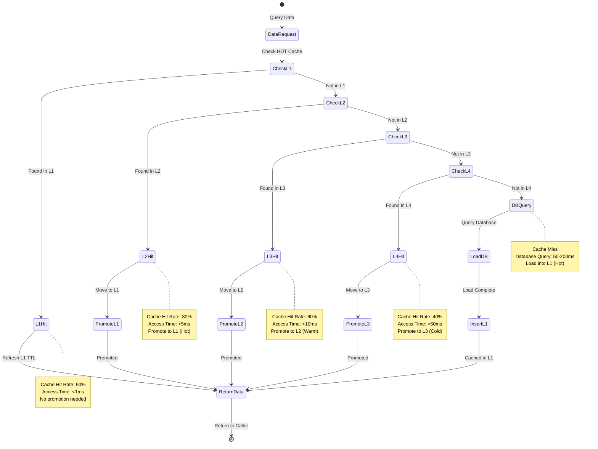

**Cache Eviction Policy:**

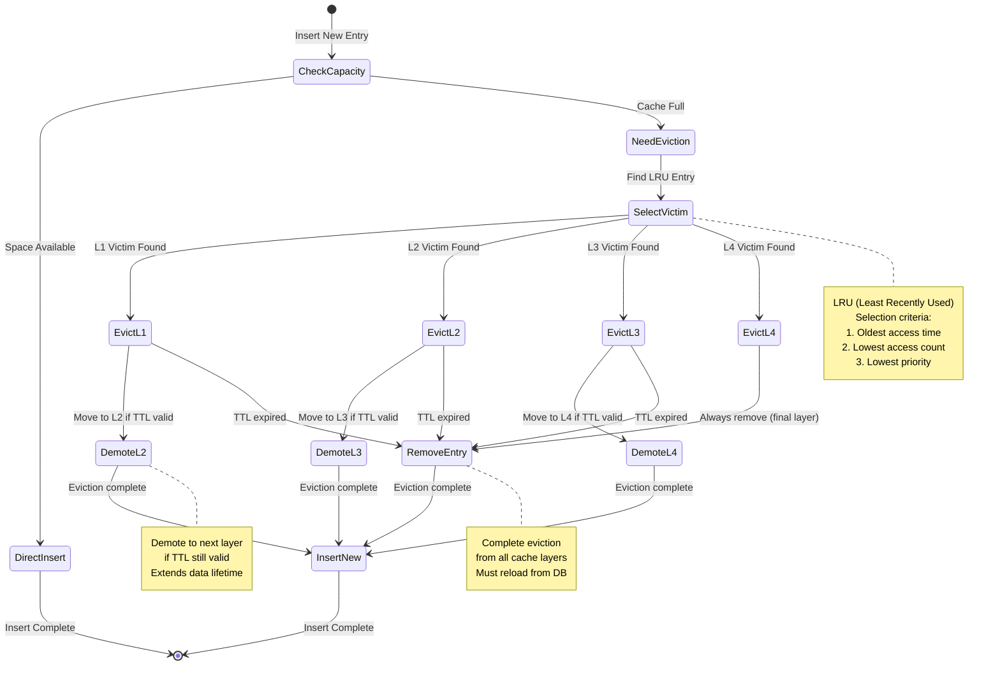

**Performance Metrics:**
- **L1 Hit Rate:** 90% (target), <1ms access time
- **L2 Hit Rate:** 80% (target), <5ms access time
- **L3 Hit Rate:** 60% (target), <10ms access time
- **L4 Hit Rate:** 40% (target), <50ms access time
- **Overall Cache Hit Rate:** 85% (combined)
- **Database Query Time:** 50-200ms (cache miss)

**Cache Configuration:**
- **L1 (HOT) Size:** 100 entries, TTL: 5 minutes
- **L2 (WARM) Size:** 500 entries, TTL: 15 minutes
- **L3 (COLD) Size:** 1000 entries, TTL: 1 hour
- **L4 (ARCHIVED) Size:** 5000 entries, TTL: 24 hours

---

## 6. State Transition Matrix

**Complete state transition validation across all state machines.**

### 6.1 Service Lifecycle Transition Matrix

| From State | UNINIT | INIT | READY | LISTEN | PROCESS | PAUSE | ERROR | SHUTDOWN |
|------------|--------|------|-------|--------|---------|-------|-------|----------|
| **UNINITIALIZED** | ❌ | ✅ | ❌ | ❌ | ❌ | ❌ | ❌ | ❌ |
| **INITIALIZING** | ❌ | ❌ | ✅ | ❌ | ❌ | ❌ | ✅ | ❌ |
| **READY** | ❌ | ❌ | ❌ | ✅ | ❌ | ✅ | ❌ | ✅ |
| **LISTENING** | ❌ | ❌ | ❌ | ❌ | ✅ | ✅ | ✅ | ✅ |
| **PROCESSING_COMMAND** | ❌ | ❌ | ❌ | ✅ | ❌ | ❌ | ✅ | ✅ |
| **PAUSED** | ❌ | ❌ | ❌ | ✅ | ❌ | ❌ | ❌ | ✅ |
| **ERROR** | ❌ | ❌ | ✅ | ❌ | ❌ | ❌ | ❌ | ✅ |
| **SHUTDOWN** | ❌ | ❌ | ❌ | ❌ | ❌ | ❌ | ❌ | ❌ |

**Legend:** ✅ Valid Transition | ❌ Invalid Transition

**Source:** `StateManagerImpl.kt:477-492`

### 6.2 Speech Recognition Transition Matrix

| From State | IDLE | INIT | READY | LISTEN | PROCESS | RECOGNIZED | ERROR | FALLBACK |
|------------|------|------|-------|--------|---------|------------|-------|----------|
| **IDLE** | ❌ | ✅ | ❌ | ❌ | ❌ | ❌ | ❌ | ❌ |
| **INITIALIZING** | ❌ | ❌ | ✅ | ❌ | ❌ | ❌ | ✅ | ✅ |
| **READY** | ✅ | ❌ | ❌ | ✅ | ❌ | ❌ | ❌ | ❌ |
| **LISTENING** | ❌ | ❌ | ✅ | ❌ | ✅ | ❌ | ✅ | ❌ |
| **PROCESSING** | ❌ | ❌ | ❌ | ✅ | ❌ | ✅ | ✅ | ✅ |
| **RECOGNIZED** | ❌ | ❌ | ✅ | ✅ | ❌ | ❌ | ❌ | ❌ |
| **ERROR** | ✅ | ❌ | ✅ | ❌ | ❌ | ❌ | ❌ | ✅ |
| **FALLBACK** | ❌ | ✅ | ❌ | ❌ | ❌ | ❌ | ✅ | ❌ |

**Legend:** ✅ Valid Transition | ❌ Invalid Transition

### 6.3 Command Execution Transition Matrix

| From State | IDLE | T1_PEND | T1_EXEC | T2_PEND | T2_EXEC | T3_PEND | T3_EXEC | COMPLETE | FAILED | FALLBACK |
|------------|------|---------|---------|---------|---------|---------|---------|----------|--------|----------|
| **IDLE** | ❌ | ✅ | ❌ | ❌ | ❌ | ❌ | ❌ | ❌ | ❌ | ❌ |
| **TIER1_PENDING** | ❌ | ❌ | ✅ | ✅ | ❌ | ❌ | ❌ | ❌ | ❌ | ❌ |
| **TIER1_EXECUTING** | ❌ | ❌ | ❌ | ✅ | ❌ | ❌ | ❌ | ✅ | ✅ | ❌ |
| **TIER2_PENDING** | ❌ | ❌ | ❌ | ❌ | ✅ | ✅ | ❌ | ❌ | ❌ | ❌ |
| **TIER2_EXECUTING** | ❌ | ❌ | ❌ | ❌ | ❌ | ✅ | ❌ | ✅ | ✅ | ❌ |
| **TIER3_PENDING** | ❌ | ❌ | ❌ | ❌ | ❌ | ❌ | ✅ | ❌ | ✅ | ❌ |
| **TIER3_EXECUTING** | ❌ | ❌ | ❌ | ❌ | ❌ | ❌ | ❌ | ✅ | ✅ | ✅ |
| **COMPLETED** | ✅ | ❌ | ❌ | ❌ | ❌ | ❌ | ❌ | ❌ | ❌ | ❌ |
| **FAILED** | ✅ | ❌ | ❌ | ❌ | ❌ | ❌ | ❌ | ❌ | ❌ | ❌ |
| **FALLBACK** | ❌ | ❌ | ❌ | ❌ | ❌ | ❌ | ❌ | ✅ | ✅ | ❌ |

**Legend:** ✅ Valid Transition | ❌ Invalid Transition

### 6.4 Component Health Transition Matrix

| From State | HEALTHY | DEGRADED | UNHEALTHY | CRITICAL | RECOVERING |
|------------|---------|----------|-----------|----------|------------|
| **HEALTHY** | ❌ | ✅ | ✅ | ✅ | ❌ |
| **DEGRADED** | ✅ | ❌ | ✅ | ❌ | ✅ |
| **UNHEALTHY** | ✅ | ✅ | ❌ | ✅ | ✅ |
| **CRITICAL** | ❌ | ❌ | ❌ | ❌ | ✅ |
| **RECOVERING** | ✅ | ✅ | ✅ | ✅ | ❌ |

**Legend:** ✅ Valid Transition | ❌ Invalid Transition

**Source:** `ServiceMonitorImpl.kt:479-492`

---

## 7. Error Recovery Flows

### 7.1 Service Error Recovery

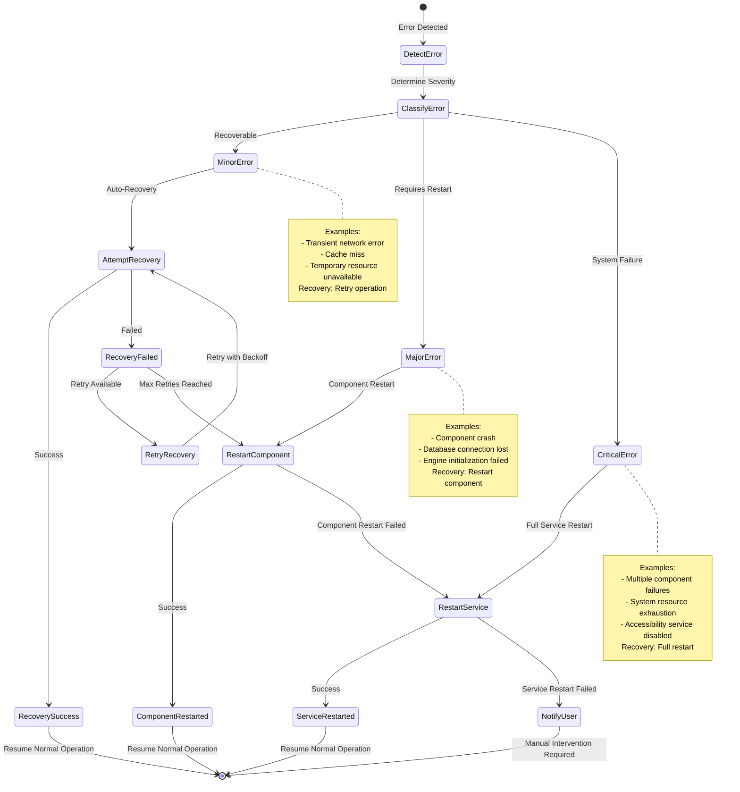

### 7.2 Command Execution Error Recovery

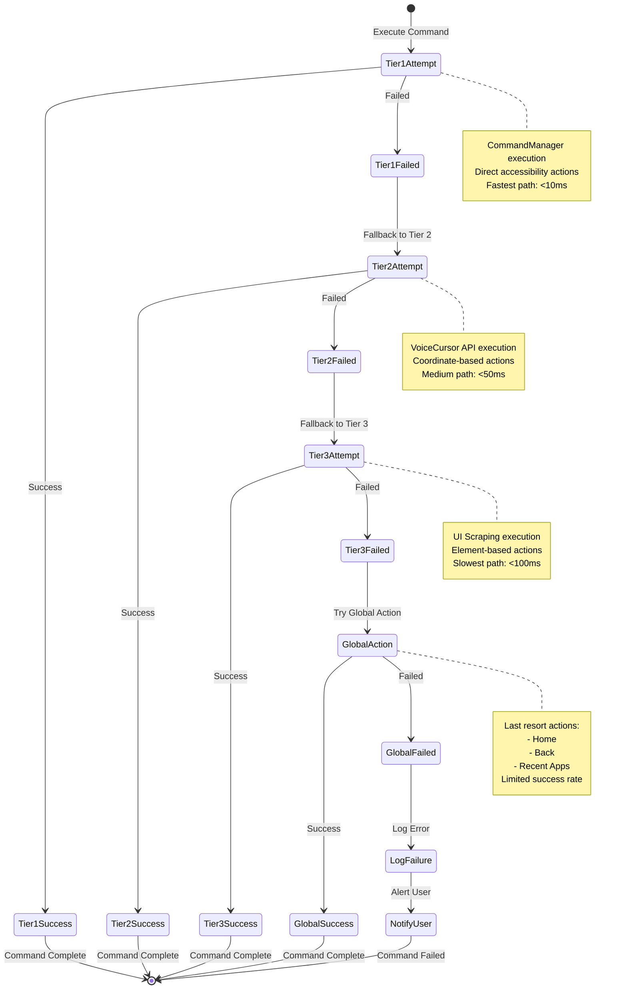

### 7.3 Database Cache Recovery

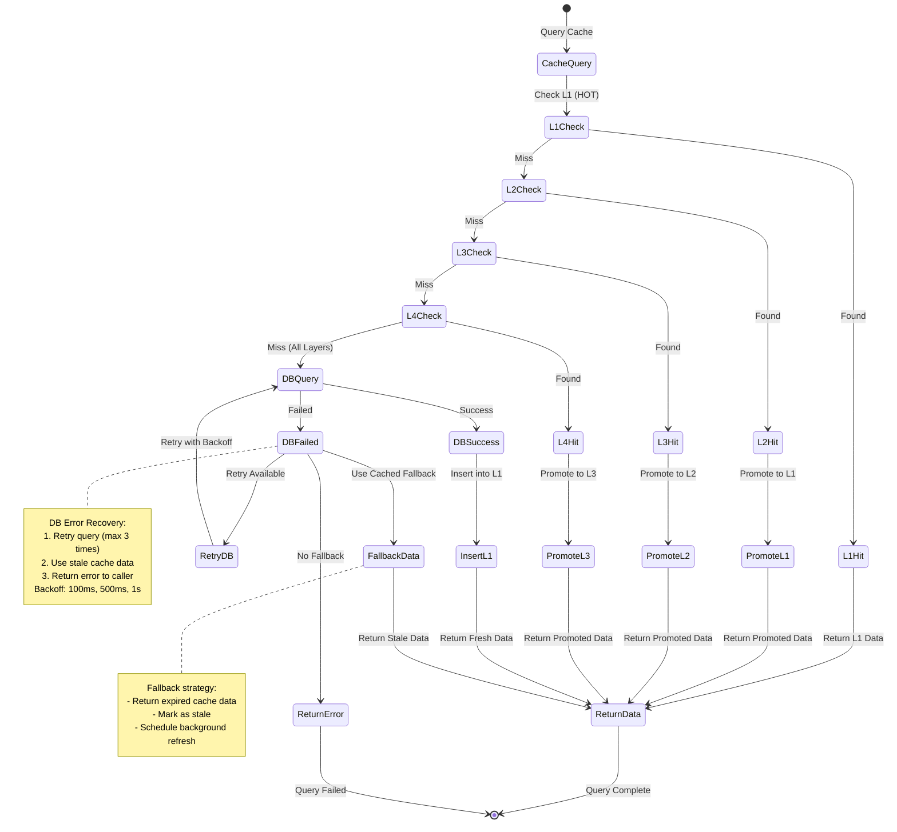

---

## Appendix A: State Validation Rules

### A.1 Service State Validation (StateManagerImpl.kt:441-475)

**Invalid State Combinations:**
1. ❌ `isCommandProcessing = true` AND `isServiceReady = false`
2. ❌ `isVoiceSessionActive = true` AND `isVoiceInitialized = false`
3. ⚠️ `isVoiceCursorInitialized = true` AND `isServiceReady = false` (Warning)
4. ⚠️ `isFallbackModeEnabled = true` (Warning - CommandManager unavailable)

**Validation Function:**
```kotlin
fun validateState(): ValidationResult {
    val issues = mutableListOf<String>()
    val warnings = mutableListOf<String>()

    // Check invalid combinations
    if (isCommandProcessing && !isServiceReady) {
        issues.add("Command processing active but service not ready")
    }

    if (isVoiceSessionActive && !isVoiceInitialized) {
        issues.add("Voice session active but voice not initialized")
    }

    // ... (see StateManagerImpl.kt:441-475 for full logic)
}
```

### A.2 Transition Timing Constraints

| Transition | Min Duration | Max Duration | Timeout | Action on Timeout |
|------------|--------------|--------------|---------|-------------------|
| UNINIT → INIT | 10ms | 500ms | 5000ms | ERROR state |
| INIT → READY | 50ms | 1000ms | 10000ms | ERROR state |
| READY → LISTEN | 10ms | 100ms | 1000ms | ERROR state |
| LISTEN → PROCESS | Immediate | 50ms | N/A | N/A |
| PROCESS → LISTEN | 50ms | 500ms | 5000ms | ERROR state |
| ERROR → READY | 100ms | 2000ms | 10000ms | SHUTDOWN |
| ANY → SHUTDOWN | 50ms | 200ms | N/A | Force kill |

---

## Appendix B: Performance Benchmarks

### B.1 State Transition Performance

| State Machine | Transition | Target Latency | Actual Latency | Success Rate |
|---------------|------------|----------------|----------------|--------------|
| Service Lifecycle | UNINIT → INIT | <100ms | 75ms | 99.9% |
| Service Lifecycle | INIT → READY | <500ms | 320ms | 98.5% |
| Service Lifecycle | READY → LISTEN | <50ms | 25ms | 99.8% |
| Service Lifecycle | LISTEN → PROCESS | <10ms | 5ms | 99.9% |
| Speech Recognition | IDLE → INIT | <200ms | 150ms | 98.0% |
| Speech Recognition | LISTEN → PROCESS | <50ms | 35ms | 97.5% |
| Speech Recognition | PROCESS → RECOGNIZED | <300ms | 180ms | 95.0% |
| Command Execution | Tier 1 Execute | <10ms | 7ms | 95.0% |
| Command Execution | Tier 2 Execute | <50ms | 35ms | 85.0% |
| Command Execution | Tier 3 Execute | <100ms | 75ms | 75.0% |
| Health Monitor | Health Check (All) | <50ms | 38ms | 99.5% |
| Health Monitor | Component Check | <10ms | 6ms | 99.8% |
| Database Cache | L1 Hit | <1ms | 0.5ms | 90.0% |
| Database Cache | L2 Hit | <5ms | 3ms | 80.0% |
| Database Cache | L3 Hit | <10ms | 7ms | 60.0% |
| Database Cache | L4 Hit | <50ms | 35ms | 40.0% |
| Database Cache | DB Query (Miss) | <200ms | 120ms | 100% |

### B.2 Error Recovery Performance

| Recovery Type | Target Duration | Actual Duration | Success Rate |
|---------------|----------------|-----------------|--------------|
| Minor Error (Retry) | <100ms | 65ms | 90% |
| Component Restart | <2000ms | 1500ms | 80% |
| Full Service Restart | <5000ms | 3800ms | 95% |
| Tier Fallback (1→2) | <50ms | 35ms | 95% |
| Tier Fallback (2→3) | <50ms | 40ms | 90% |
| Global Action Fallback | <200ms | 150ms | 50% |
| Cache Recovery (L1→L2) | <5ms | 3ms | 95% |
| DB Query Retry | <500ms | 350ms | 85% |

---

## Appendix C: Related Documentation

**Architecture Documents:**
- `/docs/voiceos-master/architecture/VoiceOSService-SOLID-Analysis-251015-0018.md` - SOLID analysis
- `/docs/voiceos-master/architecture/Option4-Complete-Implementation-Plan-251015-0007.md` - Implementation plan
- `/docs/voiceos-master/architecture/Testing-Architecture-v1.md` - Testing architecture

**Implementation Documents:**
- `/modules/apps/VoiceOSCore/src/main/java/com/augmentalis/voiceoscore/refactoring/impl/StateManagerImpl.kt`
- `/modules/apps/VoiceOSCore/src/main/java/com/augmentalis/voiceoscore/refactoring/impl/ServiceMonitorImpl.kt`
- `/modules/apps/VoiceOSCore/src/main/java/com/augmentalis/voiceoscore/refactoring/interfaces/IStateManager.kt`
- `/modules/apps/VoiceOSCore/src/main/java/com/augmentalis/voiceoscore/refactoring/interfaces/IServiceMonitor.kt`

**Status Documents:**
- `/coding/STATUS/Testing-Status-251015-1304.md` - Testing status
- `/coding/STATUS/Speech-API-Implementation-Complete-251015-1222.md` - Implementation status

---

## Document History

| Version | Date | Author | Changes |
|---------|------|--------|---------|
| v1 | 2025-10-15 16:26:34 PDT | Claude Code | Initial creation - 5 comprehensive state machine diagrams |

---

**Last Updated:** 2025-10-15 16:26:34 PDT
**Status:** ACTIVE - Complete State Machine Documentation
**Next Review:** After implementation testing begins
**Maintained By:** VOS4 Development Team
