# DeviceManager Architecture

## Overview
The DeviceManager module implements a capabilities-driven architecture where **DeviceDetector** serves as the central detection engine, providing device capabilities to all specialized managers through constructor injection. This design ensures consistent capability detection, reduces code duplication, and enables conditional loading of features based on device hardware availability.

## Architecture Diagram

```mermaid
graph TD
    %% Central Detection Engine
    DD[DeviceDetector<br/>📋 Central Capabilities Detection] 
    
    %% Core Capabilities
    DD --> CAP[Device Capabilities<br/>🔍 Complete Device Profile]
    
    %% Device Manager Hub
    CAP --> DM[DeviceManager<br/>🎯 Unified Entry Point]
    
    %% Core Always-Available Components
    DM --> DI[DeviceInfo<br/>📱 Device Information]
    DM --> DOM[DisplayOverlayManager<br/>🖥️ Display Management]
    DM --> AS[AudioService<br/>🔊 Core Audio]
    DM --> DDET[DeviceDetection<br/>🔍 Runtime Detection]
    
    %% Conditionally Loaded - Audio/Accessibility
    DM -->|"if hasSpeaker & !requiresDisableSpeech"| TTS[TTSManager<br/>🗣️ Text-to-Speech]
    DM -->|"if hasSpeaker OR !isWatch"| FM[FeedbackManager<br/>⚡ Haptic, Audio & Visual Feedback]
    
    %% Conditionally Loaded - Network Managers
    DM -->|"if hasBluetooth"| BM[BluetoothManager<br/>📶 BLE, Classic & Mesh]
    DM -->|"if hasWiFi"| WM[WiFiManager<br/>📡 WiFi 6E/7, Direct, Aware]
    DM -->|"if hasUwb"| UM[UwbManager<br/>📍 Ultra-Wideband Positioning]
    DM -->|"if hasNfc"| NM[NfcManager<br/>💳 Near Field Communication]
    DM -->|"if hasCellular"| CM[CellularManager<br/>📶 5G Network Management]
    DM -->|"if hasUsb"| UNM[UsbNetworkManager<br/>🔌 USB Host Networking]
    
    %% Conditionally Loaded - Hardware Managers  
    DM -->|"if totalSensorCount > 0"| LM[LidarManager<br/>📐 LiDAR/ToF Sensing]
    DM -->|"if biometric != null"| BIM[BiometricManager<br/>👆 Multi-modal Authentication]
    DM -->|"if camera != null"| VM[VideoManager<br/>📹 Video Capture & Processing]
    
    %% Always Available Device-Specific
    DM --> GM[GlassesManager<br/>👓 Smart Glasses Support]
    DM -->|"if hasXrSupport"| XRM[XRManager<br/>🥽 Extended Reality]
    
    %% Specialized Capability Detection
    DD --> HDC[Hardware Detection<br/>🔧 Physical Components]
    DD --> NDC[Network Detection<br/>🌐 Connectivity Features]
    DD --> SDC[Sensor Detection<br/>📊 Motion & Environmental]
    DD --> ADC[Audio Detection<br/>🎵 Input/Output Capabilities]
    DD --> CDC[Camera Detection<br/>📷 Imaging Systems]
    DD --> BDC[Biometric Detection<br/>🔐 Authentication Hardware]
    DD --> DISC[Display Detection<br/>📺 Screen Capabilities]
    DD --> BEHC[Behavioral Detection<br/>🎭 Device Usage Patterns]
    DD --> INTC[Integration Detection<br/>⚙️ Platform Requirements]
    
    %% Capability Flow
    HDC --> CAP
    NDC --> CAP
    SDC --> CAP
    ADC --> CAP
    CDC --> CAP
    BDC --> CAP
    DISC --> CAP
    BEHC --> CAP
    INTC --> CAP
    
    %% Audio Service Integration
    AS --> TTS
    AS --> FM
    
    %% Feedback Manager Components
    FM --> HF[Haptic Feedback<br/>⚡ Vibration Patterns]
    FM --> AF[Audio Feedback<br/>🔔 System Sounds]
    FM --> VF[Visual Feedback<br/>💡 Screen Indicators]
    
    %% Network Manager Specializations
    BM --> BLE[Bluetooth LE<br/>📱 Low Energy]
    BM --> BC[Bluetooth Classic<br/>🎧 Audio Devices]
    BM --> MESH[Bluetooth Mesh<br/>🕸️ Network Topology]
    
    WM --> W6[WiFi 6/6E/7<br/>⚡ High Speed]
    WM --> WD[WiFi Direct<br/>🤝 P2P Connection]
    WM --> WA[WiFi Aware<br/>🔍 Proximity Services]
    WM --> WR[WiFi RTT<br/>📍 Indoor Positioning]
    
    %% Smart Glasses Integration
    GM --> VD[Vuzix Detector<br/>👓 Vuzix Integration]
    GM --> RWD[RealWear Detector<br/>🔧 RealWear Integration]
    GM --> SGD[Smart Glass Detection<br/>🔍 Generic Glass Support]
    
    %% Styling
    classDef centralEngine fill:#ff6b6b,stroke:#d63031,stroke-width:3px,color:#fff
    classDef coreComponent fill:#4ecdc4,stroke:#00cec9,stroke-width:2px,color:#fff
    classDef conditionalManager fill:#a29bfe,stroke:#6c5ce7,stroke-width:2px,color:#fff
    classDef networkManager fill:#fd79a8,stroke:#e84393,stroke-width:2px,color:#fff
    classDef hardwareManager fill:#fdcb6e,stroke:#e17055,stroke-width:2px,color:#fff
    classDef detectionModule fill:#74b9ff,stroke:#0984e3,stroke-width:2px,color:#fff
    classDef feedback fill:#55a3ff,stroke:#2d3436,stroke-width:2px,color:#fff
    classDef glassesModule fill:#fd79a8,stroke:#e84393,stroke-width:2px,color:#fff
    
    class DD centralEngine
    class CAP,DM coreComponent
    class DI,DOM,AS,DDET coreComponent
    class TTS,FM conditionalManager
    class BM,WM,UM,NM,CM,UNM networkManager
    class LM,BIM,VM,GM,XRM hardwareManager
    class HDC,NDC,SDC,ADC,CDC,BDC,DISC,BEHC,INTC detectionModule
    class HF,AF,VF feedback
    class BLE,BC,MESH,W6,WD,WA,WR feedback
    class VD,RWD,SGD glassesModule
```



## ASCII Architecture (Alternative View)

```
                          ┌─────────────────────────────────┐
                          │        DeviceDetector           │
                          │   📋 Central Capabilities       │
                          │      Detection Engine           │
                          └──────────────┬──────────────────┘
                                         │
                          ┌──────────────▼──────────────────┐
                          │       Device Capabilities       │
                          │    🔍 Complete Device Profile   │
                          └──────────────┬──────────────────┘
                                         │
                          ┌──────────────▼──────────────────┐
                          │        DeviceManager            │
                          │     🎯 Unified Entry Point      │
                          └──────────────┬──────────────────┘
                                         │
       ┌─────────────────────────────────┼─────────────────────────────────┐
       │                                 │                                 │
   ┌───▼───┐                        ┌────▼────┐                      ┌─────▼─────┐
   │ CORE  │                        │CONDITNL │                      │  DEVICE   │
   │ALWAYS │                        │MANAGERS │                      │ SPECIFIC  │
   │LOADED │                        │ LOADED  │                      │ MANAGERS  │
   └───┬───┘                        └────┬────┘                      └─────┬─────┘
       │                                 │                                 │
   ┌───▼───────────────────────┐    ┌────▼─────────────────────┐      ┌─────▼─────────────────┐
   │ • DeviceInfo              │    │ AUDIO/ACCESSIBILITY      │      │ • GlassesManager      │
   │ • DisplayOverlayManager   │    │ ├─ TTSManager           │      │ • XRManager           │
   │ • AudioService            │    │ └─ FeedbackManager       │      │                       │
   │ • DeviceDetection         │    │                          │      └─────────────────────┘
   └───────────────────────────┘    │ NETWORK MANAGERS         │
                                    │ ├─ BluetoothManager      │
                                    │ ├─ WiFiManager           │
                                    │ ├─ UwbManager            │
                                    │ ├─ NfcManager            │
                                    │ ├─ CellularManager       │
                                    │ └─ UsbNetworkManager     │
                                    │                          │
                                    │ HARDWARE MANAGERS        │
                                    │ ├─ LidarManager          │
                                    │ ├─ BiometricManager      │
                                    │ └─ VideoManager          │
                                    └──────────────────────────┘
```

## Capability Detection Flow

```
DeviceDetector.getCapabilities()
├── Hardware Detection
│   ├── NFC, Camera, Microphone
│   ├── USB, Biometrics (Fingerprint, Face, Iris)
│   └── Device Types (Foldable, Watch, Automotive, TV)
├── Network Detection  
│   ├── Bluetooth (Classic + LE)
│   ├── WiFi (6/6E/7, Direct, Aware, RTT)
│   ├── UWB, NFC, Cellular (5G)
│   └── Ethernet
├── Sensor Detection
│   ├── IMU (Accel, Gyro, Magnetometer)
│   ├── Environmental (Barometer, Light, Temperature)
│   └── Health (Heart Rate, Step Counter)
├── Audio Detection
│   ├── Input/Output capabilities
│   ├── Low latency, Pro Audio
│   └── Supported sample rates
├── Camera Detection
│   ├── Front/Back/External cameras
│   ├── Hardware levels (Legacy → Full → Level 3)
│   └── Depth, Multi-camera support
├── Display Detection
│   ├── Resolution, DPI, Refresh rate
│   ├── HDR, Wide color gamut
│   └── XR support indicators
├── Biometric Detection
│   ├── Available methods
│   ├── Security levels
│   └── Enrollment status
├── Behavioral Detection
│   ├── Smart Glass identification
│   ├── Voice-first devices
│   └── UI adaptation requirements
└── Integration Requirements
    ├── Platform-specific speech systems
    ├── Manufacturer integrations
    └── Feature overrides
```

## Conditional Loading Logic

### Audio & Accessibility Managers
```kotlin
// TTSManager - Only if device has speaker and speech not disabled
val tts: TTSManager? by lazy {
    if (capabilities.audio.hasSpeaker && 
        !capabilities.integration.requiresDisableSpeech) 
        TTSManager(context, audio) 
    else null
}

// FeedbackManager - If has speaker OR not a watch
val feedback: FeedbackManager? by lazy {
    if (capabilities.audio.hasSpeaker || 
        !capabilities.hardware.isWatch) 
        FeedbackManager(context) 
    else null
}
```

### Network Managers
```kotlin
// Only create managers if hardware capability exists
val bluetooth: BluetoothManager? by lazy { 
    if (capabilities.network.hasBluetooth) 
        BluetoothManager(context, capabilities) 
    else null
}

val wifi: WiFiManager? by lazy { 
    if (capabilities.network.hasWiFi) 
        WiFiManager(context, capabilities) 
    else null
}
```

## Key Architecture Principles

### 1. **Central Detection Authority**
- **DeviceDetector** is the single source of truth for ALL capability detection
- Managers receive capabilities via constructor injection
- No manager performs its own detection logic
- Ensures consistency and reduces duplication

### 2. **Conditional Loading Pattern**
- Managers are only instantiated if required hardware/features exist
- Uses lazy initialization for memory efficiency
- Graceful degradation when features unavailable
- Clear logging when managers not loaded

### 3. **Separation of Concerns**
- **DeviceDetector**: Detection only
- **DeviceManager**: Orchestration and lifecycle
- **Specialized Managers**: Feature implementation only
- **TTSManager**: Text-to-Speech only (extracted from AccessibilityManager)
- **FeedbackManager**: Haptic, Audio, Visual feedback only

### 4. **Capability-Driven Architecture**
- All decisions based on detected device capabilities
- Behavioral adaptations (smart glass, wearable, automotive)
- Platform-specific integrations (RealWear, Vuzix, Samsung)
- Integration requirements handled transparently

## Manager Categories

### Core Components (Always Loaded)
- **DeviceInfo**: Basic device information
- **DisplayOverlayManager**: Screen overlay management
- **AudioService**: Core audio functionality
- **DeviceDetection**: Runtime detection utilities

### Accessibility Managers (Conditionally Loaded)
- **TTSManager**: Text-to-Speech synthesis and management
- **FeedbackManager**: Haptic, audio, and visual feedback systems

### Network Managers (Hardware-Dependent)
- **BluetoothManager**: Classic, LE, and Mesh support
- **WiFiManager**: Modern WiFi standards (6/6E/7) with advanced features
- **UwbManager**: Ultra-wideband positioning and ranging
- **NfcManager**: Near-field communication
- **CellularManager**: 5G and advanced cellular features
- **UsbNetworkManager**: USB host mode networking

### Hardware Managers (Feature-Dependent)
- **LidarManager**: LiDAR and ToF sensor management
- **BiometricManager**: Multi-modal authentication (fingerprint, face, iris)
- **VideoManager**: Camera and video processing

### Device-Specific Managers
- **GlassesManager**: Smart glasses support (always available for detection)
- **XRManager**: Extended reality features (if XR support detected)

## Translation Module Status

**Note**: No Translation module was found in the current codebase. If translation functionality is required, it should be implemented as a separate module following the same capability-driven pattern:

```
TranslationManager (if needed)
├── Language Detection
├── Translation Services Integration
├── Offline Translation Support
└── Text Processing Pipeline
```

## Benefits of This Architecture

1. **Performance**: Only loads managers for available hardware
2. **Memory Efficiency**: Lazy initialization prevents unnecessary allocations
3. **Maintainability**: Clear separation of detection vs. implementation
4. **Consistency**: Single detection logic eliminates discrepancies
5. **Extensibility**: Easy to add new managers following the same pattern
6. **Device Adaptation**: Automatic adaptation to device capabilities
7. **Testing**: Managers can be tested with mock capabilities

## Evolution and Refactoring

This architecture represents a significant improvement from previous versions where:
- **Old**: Each manager detected its own capabilities (duplication)
- **New**: Central detection with capability injection (DRY principle)

The split of AccessibilityManager into TTSManager and FeedbackManager demonstrates adherence to the Single Responsibility Principle while maintaining the capability-driven architecture pattern.

---

**Last Updated**: 2025-09-06  
**Architecture Version**: 2.1.0  
**DeviceDetector Version**: Central detection engine  
**Manager Count**: 15 specialized managers + 4 core components