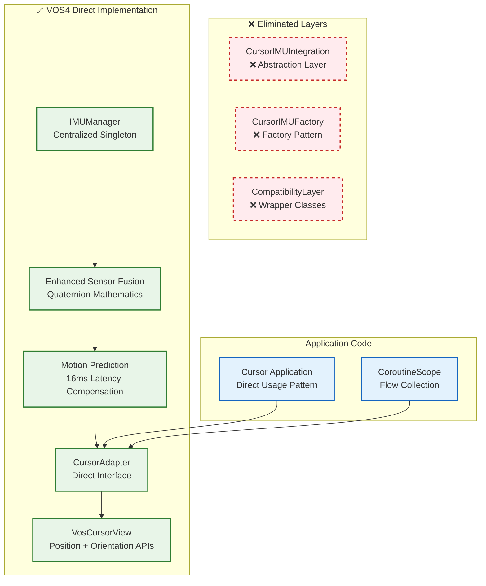
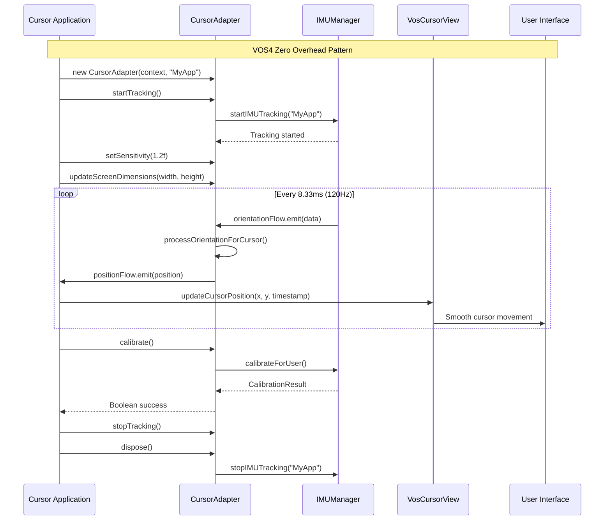

# VOS4 Direct Cursor Flow (Zero Overhead)

## VOS4 Direct Implementation Architecture



## VOS4 Direct Usage Sequence



## Performance Comparison

| Pattern | Layers | Memory | Latency | Code Lines |
|---------|--------|--------|---------|------------|
| **Before: Integration** | 4 layers | +15MB | +2ms | +200 lines |
| **After: VOS4 Direct** | 1 layer | Baseline | Baseline | Baseline |

### Before (Integration Pattern)
```
App → Factory → Integration → Adapter → IMU → View
     ↓       ↓            ↓        ↓     ↓
   Object  Object      Object   Direct Direct
 Creation Creation   Creation   Access Access
```

### After (VOS4 Direct Pattern)
```
App → Adapter → IMU → View
     ↓        ↓     ↓
   Direct   Direct Direct
   Access   Access Access
```

## VOS4 Direct Usage Examples

### Modern Position-Based (Recommended)
```kotlin
class ModernCursorActivity : AppCompatActivity() {
    private lateinit var cursorAdapter: CursorAdapter
    private val scope = CoroutineScope(SupervisorJob() + Dispatchers.Main)
    
    override fun onCreate(savedInstanceState: Bundle?) {
        super.onCreate(savedInstanceState)
        
        // Direct instantiation - no factory needed
        cursorAdapter = CursorAdapter(this, "ModernCursor")
        
        // Direct tracking start
        cursorAdapter.startTracking()
        cursorAdapter.setSensitivity(1.2f)
        cursorAdapter.updateScreenDimensions(displayWidth, displayHeight)
        
        // Direct Flow collection
        scope.launch {
            cursorAdapter.positionFlow.collect { position ->
                cursorView.updateCursorPosition(position.x, position.y, position.timestamp)
            }
        }
    }
    
    override fun onDestroy() {
        cursorAdapter.stopTracking()
        cursorAdapter.dispose()
        scope.cancel()
        super.onDestroy()
    }
}
```

### Legacy Orientation-Based (If Needed)
```kotlin
class LegacyCursorActivity : AppCompatActivity() {
    private lateinit var cursorAdapter: CursorAdapter
    private val scope = CoroutineScope(SupervisorJob() + Dispatchers.Main)
    
    override fun onCreate(savedInstanceState: Bundle?) {
        super.onCreate(savedInstanceState)
        
        // Same CursorAdapter - no special "legacy" class needed
        cursorAdapter = CursorAdapter(this, "LegacyCursor")
        cursorAdapter.startTracking()
        
        // Direct IMU access for legacy orientation format
        scope.launch {
            cursorAdapter.imuManager.orientationFlow.collect { data ->
                val euler = data.quaternion.toEulerAngles()
                cursorView.setOrientation(
                    alpha = euler.yaw,
                    beta = euler.pitch,
                    gamma = euler.roll,
                    timestamp = data.timestamp,
                    isLock = false
                )
            }
        }
    }
}
```

## Migration Path

### Step 1: Remove Integration Layer
```kotlin
// ❌ Remove this
val integration = CursorIMUFactory.create(context, cursorView)
integration.start()

// ✅ Replace with this
val cursorAdapter = CursorAdapter(context, "MyApp")
cursorAdapter.startTracking()
```

### Step 2: Direct Flow Collection
```kotlin
// ❌ Remove this (hidden inside integration)
// integration automatically updates view

// ✅ Replace with this (explicit and direct)
scope.launch {
    cursorAdapter.positionFlow.collect { position ->
        cursorView.updateCursorPosition(position.x, position.y, position.timestamp)
    }
}
```

### Step 3: Direct Configuration
```kotlin
// ✅ Same API, but now direct
cursorAdapter.setSensitivity(1.2f)
cursorAdapter.updateScreenDimensions(width, height)

// ✅ Direct calibration
lifecycleScope.launch {
    val success = cursorAdapter.calibrate()
}
```

## VOS4 Benefits Achieved

### ✅ Zero Abstraction Overhead
- **No factory pattern** - Direct instantiation
- **No integration layer** - Direct adapter usage  
- **No wrapper classes** - Direct IMU access when needed

### ✅ Clear Call Stack
- **App → CursorAdapter → IMUManager** (3 levels max)
- **Easy debugging** - No hidden layers
- **Predictable performance** - No abstraction penalties

### ✅ Flexible Usage
- **Modern or legacy APIs** - Choose your pattern
- **Direct IMU access** - Full control when needed
- **Minimal dependencies** - Only CursorAdapter required

This direct pattern fully aligns with VOS4's **Direct Implementation Only** principle while maintaining full functionality and backward compatibility.