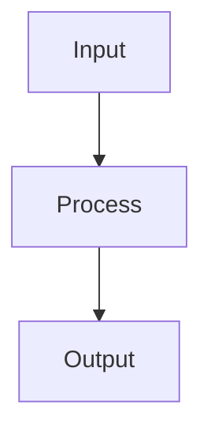

<!--
filename: MASTER-STANDARDS.md
created: 2025-01-23 18:55:00 PST
author: VOS4 Development Team
purpose: Core standards ALL agents must follow
last-modified: 2025-08-27 23:10:00 PDT
version: 1.5.0
changelog:
- 2025-08-27 23:10:00 PDT: Added MANDATORY COT/ROT/TOT analysis requirements for all code issues
- 2025-01-27 17:45:00 PST: Enhanced documentation requirements - MANDATORY updates before commits
- 2025-01-24 16:45:00 PST: Added mandatory Master Inventory checks and feature preservation requirements
- 2025-01-23 22:35:00 PST: Added requirement to document benefits achieved
- 2025-01-23 22:30:00 PST: Added mandatory functional equivalency requirements
- 2025-01-23: Initial creation - consolidated from claude.md, .warp.md, .clinerules
- 2025-01-24: Added Interface Exception Process for justified use cases
-->

# VOS4 Master Standards - MANDATORY FOR ALL AGENTS

## 🔴 CRITICAL: Core Principles (ZERO TOLERANCE)

### -1. MANDATORY Code Analysis Requirements (ENHANCED)
**ALL code issues, bugs, warnings MUST undergo formal analysis:**

#### Standard Analysis Process:
1. **Initial Analysis:** COT → ROT
2. **If NO Errors Found:** Proceed with implementation
3. **If Errors Found in COT+ROT:** MANDATORY TOT+COT+ROT Analysis

#### Enhanced Error Handling Protocol (When Errors Detected):
**MANDATORY FULL ANALYSIS WHEN ERRORS FOUND:**

1. **TOT (Tree of Thought) - Explore ALL Solution Paths:**
   - Branch A: Quick Fix (minimal change)
   - Branch B: Refactor (redesign component)
   - Branch C: Workaround (temporary solution)
   - Branch D: Rollback (revert changes)
   - Document: Time, Risk, Impact for each

2. **Enhanced COT (Chain of Thought) - Detailed Linear Analysis:**
   - Step-by-step plan for each branch
   - Dependencies and prerequisites
   - Expected outcomes
   - Failure points & mitigation

3. **Enhanced ROT (Reflection) - Deep Evaluation:**
   - Long-term maintainability
   - Performance implications
   - Technical debt assessment
   - Future extensibility

4. **Present Recommendation Matrix to User:**
   ```
   | Criteria | Branch A | Branch B | Branch C | Branch D |
   |----------|----------|----------|----------|----------|
   | Time     | X hrs    | X hrs    | X hrs    | X hrs    |
   | Risk     | L/M/H    | L/M/H    | L/M/H    | L/M/H    |
   | Quality  | 1-10     | 1-10     | 1-10     | 1-10     |
   | TOTAL    | Score    | Score    | Score    | Score    |
   
   Recommendation: [Branch X] because [detailed reasoning]
   ```

5. **Exception:** "work independently" = Select highest scoring option
6. **Always Document:** Create ERROR-LOG.md entry with full analysis

**Process Flow:**
```
Issue → COT → ROT → Errors Found? → No: Implement
                           ↓
                          Yes: TOT → Full Analysis → Matrix → User Decision
                                                             ↓
                                                    Document in ERROR-LOG.md
```

**Required Documentation:** `/docs/Errors/ERROR-LOG.md`
- Error description & severity
- TOT+COT+ROT analysis ID
- User decision & resolution
- Lessons learned

**References:**
- [CODING-GUIDE.md](./CODING-GUIDE.md#mandatory-cotrottot-analysis-for-all-code-issues)
- [AI-REVIEW-ABBREVIATIONS.md](./AI-REVIEW-ABBREVIATIONS.md)
- [ERROR-LOG-TEMPLATE.md](./ERROR-LOG-TEMPLATE.md)

### 0. MANDATORY Multi-Agent Expertise Requirements
**ALL work MUST use specialized PhD-level agents for each domain:**
- **UI/UX Work:** PhD HCI expert with Material Design 3 & Compose knowledge
- **Architecture:** PhD Software Architecture expert with SOLID expertise
- **Audio/Speech:** PhD DSP expert with STT/TTS experience
- **Security:** PhD Cybersecurity expert with Android security knowledge
- **Database:** PhD Database Systems expert with ObjectBox expertise
- **ML/AI:** PhD Machine Learning expert with on-device inference knowledge
- **Research/Analysis:** Use agentic agents for multi-file searches

**MANDATORY References:**
- [MULTI-AGENT-REQUIREMENTS.md](./MULTI-AGENT-REQUIREMENTS.md) - Specialized expertise requirements
- [AGENTIC-AGENT-INSTRUCTIONS.md](./AGENTIC-AGENT-INSTRUCTIONS.md) - When/how to deploy agents

### 0.1. Check Master Inventories BEFORE Creating
**MANDATORY: Check for duplicates before creating ANYTHING**
```
BEFORE creating new file/class/function:
1. CHECK VOS4-Master-Inventory.md
2. CHECK [Module]-Master-Inventory.md
3. VERIFY no duplicates exist
4. CREATE only after verification
5. UPDATE inventories immediately
```

### 1. Direct Implementation Only
**NO INTERFACES, NO ABSTRACTIONS, ZERO OVERHEAD**

```kotlin
// ✅ CORRECT - Direct implementation
class CommandsManager(private val context: Context) {
    fun processCommand(text: String): Result { }
}

// ❌ WRONG - Interface abstraction
interface IModule { }
class CommandsManager : IModule { }
```

### 2. Namespace Convention
**MANDATORY: All modules use com.augmentalis.* pattern**
- ALL modules now use: `com.augmentalis.*`
- Pattern: `com.augmentalis.[modulename]`
- NO MORE `com.ai.*` - this is deprecated

```kotlin
// ✅ CORRECT - New standard
package com.augmentalis.commandsmanager
package com.augmentalis.speechrecognition
package com.augmentalis.voiceaccessibility
package com.augmentalis.datamanager
package com.augmentalis.voiceos  // Master app

// ❌ WRONG - Old patterns
package com.ai.commandsmanager  // DEPRECATED
package com.ai.anything  // NO LONGER VALID
package com.augmentalis.modules.commands  // No redundancy
```

### 3. Database Standard
**ObjectBox ONLY - No SQLite, No Room, No SharedPreferences for data**

```kotlin
// ✅ CORRECT - ObjectBox
@Entity
data class Command(@Id var id: Long = 0, var text: String)

// ❌ WRONG - SQLite/Room
@Entity(tableName = "commands")  // NO!
```

### 4. No Helper Methods
**Direct parameter access only**

```kotlin
// ✅ CORRECT - Direct access
val language = config?.language ?: "en-US"

// ❌ WRONG - Helper methods
fun getParameter(name: String) = parameters[name]  // NO!
```

### 5. Self-Contained Modules
**ALL components in same module - organized for efficiency**
- Services declared where implemented
- Resources in module that uses them
- Permissions in module that needs them
- Each module independently buildable
- Internal organization allowed if it improves performance
- Balance between flat and organized based on module size

## 🎯 Performance Requirements (MANDATORY)

| Metric | Requirement | Reason |
|--------|------------|---------|
| Initialization | <1 second | User experience |
| Module load | <50ms per module | Responsiveness |
| Command recognition | <100ms latency | Real-time feel |
| Memory (Vosk) | <30MB | Device compatibility |
| Memory (Vivoka) | <60MB | Device compatibility |
| Battery drain | <2% per hour | All-day usage |
| XR rendering | 90-120 FPS | No motion sickness |

**CRITICAL**: NO TIMELINES OR ESTIMATES
- NEVER include "Week 1", "Day 1-2", "30 min", "2 hours" in plans
- NEVER promise completion dates or timeframes
- NEVER estimate effort or duration
- Focus on WHAT needs to be done, not WHEN

## 🔴 MANDATORY: Functional Equivalency Requirements

### When Refactoring, Merging, or Importing Code:
**100% FUNCTIONAL EQUIVALENCY IS MANDATORY - ZERO TOLERANCE**
**UNLESS EXPLICITLY TOLD OTHERWISE BY USER**

1. **Before ANY refactoring/merge:**
   - Document ALL existing features
   - List ALL existing methods/functions
   - Note ALL parameters and return types
   - Test ALL edge cases
   - Create feature comparison matrix

2. **During refactoring/merge:**
   - Maintain EVERY feature (no exceptions unless approved)
   - Keep ALL existing method signatures
   - Preserve ALL functionality
   - Enhancements are OK but NEVER remove features
   - ALL code mergers MUST be 100% functionally equivalent

3. **After refactoring/merge:**
   - Verify EVERY feature still works
   - Test ALL original functionality
   - Confirm 100% backward compatibility
   - Document any enhancements added
   - Document benefits achieved:
     * Performance improvements (with metrics)
     * Memory reduction (with measurements)
     * Code reduction (lines removed vs added)
     * Maintainability improvements
     * Bug fixes included
   - Update changelog with complete summary

4. **For code imports:**
   - Import must provide ALL original features
   - Must support ALL use cases
   - Must handle ALL edge cases
   - Performance must meet or exceed original

**VIOLATIONS:** Any reduction in functionality = IMMEDIATE ROLLBACK

## ⚠️ Critical Pitfalls to Avoid

### NEVER DO:
1. **Don't create interfaces** - Direct implementation only
2. **Don't use wrong namespaces** - com.augmentalis.* pattern strictly
3. **Don't use SQLite/Room** - ObjectBox only for data
4. **Don't pipe gradle commands** - Causes "Task '2' not found" errors
5. **Don't add helper methods** - Direct access only
6. **Don't split module components** - Self-contained only
7. **Don't skip feature verification** - 100% parity required
8. **Don't remove ANY functionality** - Even if seems unused
9. **Don't change method signatures** - Without maintaining backward compatibility
10. **Don't commit without documentation** - Update/create docs FIRST
11. **Don't mix doc and code commits** - Stage separately by category

### ALWAYS DO:
1. **Use direct implementation** - Zero overhead
2. **Follow com.augmentalis.* namespace** - Consistency
3. **Use ObjectBox** - Performance
4. **Fix errors individually** - No batch scripts
5. **Keep modules self-contained** - Independence
6. **Verify performance** - User experience
7. **Maintain feature parity** - No regression
8. **Document ALL changes** - In changelog
9. **Test before committing** - Verify functionality

## 📁 Project Structure

```
/VOS4/
├── Agent-Instructions/     # These instructions (root level)
├── app/                   # Master app (com.augmentalis.voiceos)
├── apps/                  # Standalone application modules
│   ├── SpeechRecognition/ # 6 engines complete
│   ├── VoiceAccessibility/# Direct command execution
│   └── VoiceUI/          # Overlay system
├── managers/             # System managers
│   ├── CommandsManager/  # 70+ commands
│   └── DataManager/      # ObjectBox integration
├── libraries/            # Shared libraries
│   └── UUIDManager/      # UUID targeting
└── docs/                 # Documentation

```

## 📝 Document Naming Convention

### MANDATORY Format for AI Notes & Tracking Documents
**Format:** `MODULENAME/APPNAME-WhatItIs-YYMMDD-HHMM.md`

**Examples:**
- `SPEECHRECOGNITION-MIGRATION-STATUS-250903-1430.md`
- `VOS4-BUILD-STATUS-250903-0430.md`
- `LEGACYAVENUE-INVENTORY-250903-0425.md`
- `SPEECHRECOGNITION-IMPLEMENTATION-GUIDE-250903-1615.md`
- `VOS4-ARCHITECTURE-DIAGRAM-250903-0930.md`

**Components:**
- **MODULENAME/APPNAME**: Module or application name (e.g., SPEECHRECOGNITION, VOS4, LEGACYAVENUE)
- **WhatItIs**: Brief description of what the file contains (e.g., MIGRATION-STATUS, BUILD-STATUS, INVENTORY)
- **YYMMDD**: Date in 6-digit format (year-month-day)
- **HHMM**: Time in 24-hour format (not 12-hour format)

**Apply to:**
- All documents in `/docs/ainotes/`
- Migration tracking documents
- Error logs and analysis reports
- Test results and reports
- Session-specific documentation
- Status reports and tracking documents
- Implementation guides
- Architecture diagrams
- Any temporary or session-specific files

**Document Header Template:**
```markdown
# [Document Title]
**File:** MODULENAME/APPNAME-WhatItIs-YYMMDD-HHMM.md
**Module/App:** [Module or application name]
**Created:** YYYY-MM-DD HH:MM (24-hour format)
**Purpose:** [Why this document exists]
```

## 📝 MANDATORY Commit Procedures

### Stage Files Command:
When user says "stage files" or "commit":
1. **FIRST:** Update/create ALL required documentation
2. **SECOND:** Stage by category:
   - Commit 1: Documentation files
   - Commit 2: Code files by module/app
   - Commit 3: Config/build files if any
3. **NEVER:** Mix categories in one commit

### SCP Command (Stage, Commit, Push):
1. Update ALL documentation FIRST
2. Stage files by category
3. Commit with clear messages
4. Push to branch
5. **MANDATORY:** Docs must be updated BEFORE staging

### Commit Message Format:
```
type(scope): Brief description

- Detail 1
- Detail 2
- Impact/benefit
```

## 🔧 Testing Commands

```bash
# Build specific module (NO PIPES!)
./gradlew :apps:VoiceUI:assembleRelease
./gradlew :managers:CommandsManager:compileDebugKotlin

# Full build
./gradlew clean build

# Run tests
./gradlew test
```

## 🚨 Feature Preservation Requirements

### 100% Feature Parity MANDATORY
1. **NEVER remove features without written approval**
2. **ALL merges/imports MUST maintain 100% functionality**
3. **NO features lost during refactoring**
4. **Document ALL features before and after changes**

### File/Folder Preservation
1. **NEVER delete files/folders without EXPLICIT written approval**
2. **Archive instead of delete**
3. **Move to deprecated/ if needed**
4. **Deletion requires user approval documented in commit message**
5. **DO NOT delete files and folders without approval - MANDATORY**

## 📋 Living Document Updates

### BEFORE Code Changes:
1. Check `VOS4-Master-Inventory.md` for duplicates
2. Check `/docs/modules/[module]/[Module]-Master-Inventory.md`
3. Check `/docs/modules/[module]/[Module]-Changelog.md`
4. Check `/docs/modules/[module]/[Module]-Developer-Manual.md`

## 🚨 MANDATORY: Documentation Visual Requirements

**ALL DOCUMENTATION MUST INCLUDE DIAGRAMS**
- Architecture docs: System diagrams (mermaid + ASCII)
- Process docs: Flow charts showing all steps
- API docs: Sequence diagrams for interactions
- Module docs: Component relationship diagrams
- PRDs: User journey and system architecture

Example formats required:


ASCII alternative:
```
[Input] ──→ [Process] ──→ [Output]
```

### AFTER Code Changes:
1. Update Master Inventories with new items
2. Update module changelog with: Date - What - Why
3. Verify Feature Matrix shows 100% parity
4. Update Architecture Map if structure changed
5. Update developer manual with examples
6. Update module README if significant
7. Update Implementation Status
8. Check NO duplicates created

### BEFORE Commits (MANDATORY):

**CRITICAL**: NEVER include "Claude", "Anthropic", "AI", or any AI tool references in commit messages!
- No "Generated with Claude Code"
- No "Co-Authored-By: Claude"
- Keep commits professional and tool-agnostic

**MANDATORY DOCUMENTATION UPDATES BEFORE ANY COMMIT:**
Prior to staging or committing, ALL of the following MUST be updated if affected:

1. **Master Architecture Documents** (if changed/affected):
   - `/docs/ARCHITECTURE.md` - Module dependencies, patterns, system design
   - `/docs/PRD.md` - Module status, features, requirements
   - `/docs/ROADMAP.md` - Completed tasks, timeline updates
   - `/docs/INTERACTION_MAP.md` - Module interactions, data flow
   - `/docs/Status/Current/` - Current project state
   - `/docs/TODO/VOS4-TODO-Master.md` - Active task updates

2. **Module-Specific Documentation** (ALWAYS for affected modules):
   - `/docs/modules/[module]/[Module]-Changelog.md` - MANDATORY for every change
   - `/docs/modules/[module]/[Module]-Developer-Manual.md` - API changes, usage
   - `/docs/modules/[module]/[Module]-Architecture.md` - Design changes
   - `/docs/modules/[module]/[Module]-Implementation-Status.md` - Progress updates
   - `/docs/modules/[module]/[Module]-API-Reference.md` - API documentation
   - `/docs/modules/[module]/[Module]-Master-Inventory.md` - New components

3. **Planning Documents** (if implementation affects plans):
   - `/docs/Planning/Architecture/` - Architecture plans
   - `/docs/Planning/Implementation/` - Implementation strategies
   - Module-specific TODO files

4. **Status and Progress** (ALWAYS):
   - Update implementation status
   - Mark completed TODO items
   - Document any new issues or blockers

**STAGING AND COMMIT PROCESS:**
1. Update ALL affected documentation FIRST
2. Stage documentation changes WITH code changes
3. Verify ALL updates with `git status`
4. Commit with descriptive message including what docs were updated
5. NEVER commit code without updating relevant documentation

**IMPORTANT**: When staging and committing files:
- Stage and commit ALL files you created or modified in current session
- CodeImport/ directory: ALL files should be committed (including deletions and additions)
  - This includes cleanup, archival, and reorganization of imported code
  - Deletions in CodeImport/ represent completed imports or archived code
- For other directories: Use `git add [specific-file]` not `git add .`
- Always verify with `git status` before committing
   - `/docs/modules/[module]/[Module]-API-Reference.md` (if applicable)
2. Update `/docs/INDEX.md` with new documentation links
3. Verify all documentation follows DOCUMENTATION-GUIDE.md standards
4. Include documentation in the commit
5. Use clear, descriptive commit message with author attribution

## 🚨 User Approval Required

**MANDATORY:** Before ANY of these changes:
- Architectural modifications
- Package restructuring
- File moves/renames
- Interface additions
- Database changes

**Process:**
1. Present proposed changes clearly
2. Explain options with pros/cons
3. Wait for explicit approval
4. Only proceed after "yes" or "proceed"

## 📍 Working Directory Rules

- **VOS4 folder:** `/Volumes/M Drive/Coding/Warp/VOS4` - READ/WRITE
- **vos3-dev folder:** READ-ONLY reference
- **vos2 folder:** READ-ONLY reference
- **Other VOS* folders:** READ-ONLY reference

**Branch:** VOS4 (STAY ON THIS BRANCH)

## 🚨 CRITICAL: Performance Claims Policy

**ZERO TOLERANCE FOR UNVERIFIED METRICS**

### ONLY STATE WHAT YOU CAN MEASURE:
- File counts (use ls, count actual files)
- Line counts (use wc -l on actual files)
- Class consolidation (count classes before/after)
- Dependencies (read actual build files)

### NEVER STATE WITHOUT MEASUREMENT:
- Runtime performance (latency, memory, CPU)
- Build times, crash rates, user experience
- Competitive comparisons
- Any "X% faster" or "Y% reduction" claims

### CORRECT PHRASING:
❌ "62% faster performance"
✅ "Should be faster due to [architectural reason], needs benchmarking"

❌ "45% memory reduction"  
✅ "Fewer objects created, actual memory impact unknown"

## 📋 AI Review Patterns & Abbreviations

### Core Review Commands
- **COT** = Chain of Thought (linear reasoning)
- **ROT** = Reflection (evaluation & assessment)
- **TOT** = Train of Thought (explore alternatives)
- **CRT** = Combined Review (full analysis with options)

### When to Use Review Patterns
- **Architecture decisions:** Use CRT for full analysis
- **Performance optimizations:** Use CRT-P (performance focus)
- **Bug fixes:** Use COT for step-by-step reasoning
- **Refactoring:** Use TRC (explore first, then validate)

### Review Requirements
When CRT is requested:
1. Present ALL options with pros/cons
2. Include effort estimates
3. Provide clear recommendation
4. Wait for approval before proceeding

See [AI-REVIEW-ABBREVIATIONS.md](./AI-REVIEW-ABBREVIATIONS.md) for complete patterns

---

**Remember:** These are MANDATORY standards. No exceptions without explicit user approval.
## 🔄 Interface Exception Process (Added 2025-01-24)

### When Interfaces May Be Justified:

While VOS4 follows a zero-overhead, direct implementation architecture, there are rare cases where interfaces may provide genuine value. Before implementing an interface:

#### 1. ANALYSIS REQUIRED:
- Identify the specific problem that requires an interface
- Document why direct implementation cannot solve it
- Calculate the actual overhead (memory, performance)
- List the benefits that outweigh the overhead

#### 2. VALID EXCEPTION CASES:
- **Plugin Architecture**: Multiple implementations that must be runtime-swappable
- **External API Contracts**: When interfacing with external systems that require it
- **Test Doubles**: For unit testing complex dependencies (mock/stub)
- **Future Extensibility**: When KNOWN future requirements will need polymorphism

#### 3. APPROVAL PROCESS:
1. **Document the Case**: Create a clear analysis showing:
   - Why an interface    - Why an interface    - Why an interface    - Why aative solutions considered
   - Benefits that justify the overhead

2. **Present for Review**: 
   - Share analysis with user/team
   - Explain the trade-offs
   - Wait for explicit approval

3. **Implementation**:
   - Mark interface with exception comment
   - Include approval date and approver
   - Keep interface minimal (only required methods)

#### 4. EXAMPLE EXCEPTION DOCUMENTATION:
```kotlin
/**
 * EXCEPTION TO VOS4 ZERO-OVERHEAD RULE:
 * This interface is maintained because [specific reason]
 * 
 * Analysis: [Link to analysis document or summary]
 * Approved by: [User/Team Member]
 * Date: [YYYY-MM-DD]
 * Review Date: [When to re-evaluate if still needed]
 */
interface IExampleInterface {
    // Minimal required methods only
}
```

#### 5. ONGOING REVIEW:
- Exce- Exce- Exce- Exce- Exce- Exce- Exce- Exce- Exce- Exce- Exce- Exce- Exce- Exce-he interface
- Document the removal in changelog

---
**Remember:** The default is still DIRECT IMPLEMENTATION. Interfaces are the exception, not the rule.
