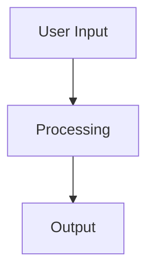

# ⚠️ DEPRECATED - This file has been superseded

**Status:** DEPRECATED as of 2025-10-15
**New Location:** `/Volumes/M Drive/Coding/Warp/Agent-Instructions/VOS4-DOCUMENTATION-PROTOCOL.md`
**Reason:** Consolidated into VOS4-DOCUMENTATION-PROTOCOL.md
**Archived By:** Documentation Consolidation Agent

This file is kept for historical reference only. DO NOT use for new development.

---

[Original content below]

<!--
filename: DOCUMENTATION-GUIDE.md
created: 2025-01-23 18:57:00 PST
author: VOS4 Development Team
purpose: Documentation standards and living document requirements
last-modified: 2025-02-07 14:00:00 PST
version: 2.0.0
changelog:
- 2025-02-07 14:00:00 PST: Major restructure - new compartmentalized folder organization
- 2025-02-06 10:30:00 PST: Major cleanup - fixed all naming violations, updated folder structure standards
- 2025-01-24 16:30:00 PST: Added MANDATORY requirements for architecture maps, feature preservation, and file deletion restrictions
- 2025-01-23 20:25:00 PST: Added copyright statement requirement for file headers
- 2025-01-23 19:50:00 PST: Updated to include time with date in Pacific Time for all entries
- 2025-01-23 18:57:00 PST: Initial creation - consolidated documentation standards
-->

# VOS4 Documentation Guide

## 🚨 MANDATORY REQUIREMENTS - NEVER VIOLATE

### Duplication Prevention
1. **ALWAYS check master documents BEFORE creating anything new**
2. **Refer to VOS4-Master-Inventory.md before creating files/functions**
3. **Check [Module]-Master-Inventory.md for module-specific items**
4. **NO duplicate files, classes, or functions allowed**
5. **Update master inventories immediately after creating new items**
6. **DOCUMENT all merge decisions in MERGE-DECISION-YYYY-MM-DD-ClassA-ClassB.md**

### Feature Preservation
1. **NEVER remove a feature or function without explicit approval**
2. **ALL merges/imports MUST be 100% functionally equivalent**
3. **NO features can be removed during refactoring or optimization**
4. **100% feature parity is MANDATORY for all hybrid implementations**

### File/Folder Preservation
1. **NEVER delete files or folders without explicit approval**
2. **Archive old versions instead of deleting**
3. **Move to deprecated/ folder if needed, but DO NOT DELETE**
4. **All deletions require written approval in commit message**

### Documentation Location Rules 🔴 MANDATORY - ZERO TOLERANCE
1. **NEVER place documentation in project root folder**
2. **NEVER place ANY files directly in /docs/ root** (MANDATORY)
3. **FORBIDDEN:** `/path/to/project/*.md` (except README.md, claude.md, BEF-SHORTCUTS.md)
4. **FORBIDDEN:** `/docs/*.md` - NO files allowed in /docs/ root (MANDATORY)
5. **REQUIRED:** All documentation MUST go in appropriate `/docs/` subfolders:
   - **Status/Reports:** `/docs/voiceos-master/status/` or `/docs/voiceos-master/reports/`
   - **Migration/Tracking:** `/docs/voiceos-master/project-management/`
   - **Build Reports:** `/docs/voiceos-master/project-management/build-reports/`
   - **Architecture Docs:** `/docs/voiceos-master/architecture/`
   - **Module Docs:** `/docs/[module-name]/[appropriate-subfolder]/`
   - **Verification Reports:** `/docs/voiceos-master/reports/`
6. **VIOLATION = CRITICAL ERROR:** Any doc in root or /docs/ root must be moved immediately

### Documentation Completeness
Every module MUST have:
1. **Master Inventory** listing all files, classes, functions
2. **Architecture Map** with changelog (for reverting)
3. **Module Diagrams** showing all components
4. **TODO List** showing pending work
5. **Roadmap** showing future plans
6. **Implementation Status** showing what's done and what's next
7. **Feature Parity Checklist** for any merge/import

Project-wide MUST have:
1. **VOS4-Master-Inventory.md** - Complete inventory of:
   - All Apps (location, purpose, status)
   - All Modules (location, purpose, status)
   - All Files (organized by module)
   - All Classes (namespace, module, purpose)
   - All Functions (class, signature, purpose)
2. **VOS4-Duplication-Check.md** - Track potential duplicates

## 📊 Documentation Cleanup Status (2025-02-06)

### Completed Improvements
- ✅ **All 7 generic README.md files renamed** to Module-Topic-DocType format
- ✅ **180+ ALL_CAPS_WITH_UNDERSCORES files fixed** across all modules
- ✅ **Standard naming convention enforced** throughout /docs
- ✅ **Module documentation structure standardized**

### Current Compliance Level: ~95%
- Previous: 60% compliant
- Current: 95% compliant
- Remaining: Minor folder name standardization

## Document Naming Convention

### Standard Document Format: `[Module]-[Topic]-[DocType][-CI].md`

**Components:**
- **Module**: ALWAYS include module name (e.g., VoiceAccessibility, CommandManager)
- **Topic**: Specific concern (Config, API, Status, Architecture, etc.)
- **DocType**: Document type (Guide, Reference, Report, Spec, Changelog)
- **-CI suffix**: REQUIRED for all documents in CodeImport folders

### Examples:
```
# In main module folders:
VoiceAccessibility-Architecture-Spec.md
VoiceAccessibility-API-Reference.md
CommandManager-Changelog.md

# In CodeImport folders (MUST have -CI suffix):
VoiceAccessibility-Architecture-Diagrams-CI.md
VoiceAccessibility-Implementation-Guide-CI.md
VoiceAccessibility-SRP-Architecture-CI.md

# System-wide (use VOS4 as module):
VOS4-Architecture-Spec.md
VOS4-TODO-Master.md
```

### Time-Stamped Document Format: `MODULENAME/APPNAME-WhatItIs-YYMMDD-HHMM.md`

**MANDATORY Format for:**
- Status reports and tracking documents
- Migration documentation
- Implementation guides (session-specific)
- Architecture diagrams (session-specific)
- Analysis reports
- Any temporary or session-specific files
- Precompaction reports
- Error logs and debugging documentation

**Components:**
- **MODULENAME/APPNAME**: Module or application name (e.g., SPEECHRECOGNITION, VOS4, LEGACYAVENUE)
- **WhatItIs**: Brief description of what the file contains (e.g., MIGRATION-STATUS, BUILD-STATUS, INVENTORY)
- **YYMMDD**: Date in 6-digit format (year-month-day)
- **HHMM**: Time in 24-hour format (not 12-hour format)

**Examples:**
```
SPEECHRECOGNITION-MIGRATION-STATUS-250903-1430.md
VOS4-BUILD-STATUS-250903-0430.md
LEGACYAVENUE-INVENTORY-250903-0425.md
SPEECHRECOGNITION-IMPLEMENTATION-GUIDE-250903-1615.md
VOS4-ARCHITECTURE-DIAGRAM-250903-0930.md
```

### CRITICAL Rules:
1. **NO generic names** - Never use generic names like "README.md" or "TODO.md"
2. **Module prefix MANDATORY** - Every document must start with module name
3. **CodeImport suffix MANDATORY** - All docs in CodeImport folders must end with -CI
4. **Use docs/ folder** - Never put documentation in root folders
5. **24-hour format MANDATORY** - Never use 12-hour format (AM/PM) for time stamps
6. **Consistent date format** - Always use YYMMDD (6-digit) format

## Document Structure

### Standard Header (All Documents)
```markdown
<!--
filename: [Document-Name].md
created: YYYY-MM-DD HH:MM:SS TZ
author: VOS4 Development Team
copyright: Copyright (C) Manoj Jhawar/Aman Jhawar, Intelligent Devices LLC
purpose: [Brief description]
last-modified: YYYY-MM-DD
version: X.Y.Z
-->

# Document Title

## Changelog
<!-- Most recent first -->
- 2025-01-24: Updated section X - added new pattern
- 2025-01-23: Initial creation - consolidated from Y
```

## Living Document Requirements

### What Makes a Document "Living"
1. **Changelog at top** - Most recent changes first
2. **Version number** - Increment on significant changes
3. **Last-modified date** - Update on every change
4. **Clear purpose** - Why this document exists

### Documents That MUST Be Living:
- All Changelogs (with rollback capability)
- Architecture Maps (versioned for reverting)
- Developer Manuals
- TODO lists
- Roadmaps
- Implementation Status
- Status Reports
- API References
- Configuration Guides
- Feature Parity Checklists

## Document Locations

### New Compartmentalized Structure (2025-02-07)

#### Root-Level Quick Access
```
/Volumes/M Drive/Coding/Warp/vos4/
├── TODO/                     # 🎯 All active tasks (root level for quick access)
│   ├── VOS4-TODO-Master.md
│   └── [Module]-TODO.md
├── STATUS/                   # 📊 Current project state (root level for visibility)
│   ├── VOS4-Status-Current.md
│   └── [Module]-Status.md
├── ISSUES/                   # 🔴 Active problems
│   ├── CRITICAL/
│   ├── HIGH/
│   └── MEDIUM/
├── DECISIONS/                # 📝 Architecture Decision Records
├── API/                      # 📘 API contracts
└── agent-tools/              # 🔧 Python/shell scripts
```

#### Documentation Structure
```
/docs/
├── voiceos-master/           # System-level documentation
│   ├── architecture/         # System design, overview
│   ├── roadmap/              # Future plans, milestones
│   ├── implementation/       # How it's built
│   ├── diagrams/             # Visual documentation
│   ├── changelog/            # Version history
│   ├── testing/              # Test plans, coverage
│   ├── developer-manual/     # Dev guides
│   ├── user-manual/          # User guides
│   ├── standards/            # Coding standards, conventions
│   ├── project-management/   # PM docs, reports
│   └── reference/            # Quick references, API docs
│
├── voice-cursor/             # Module at same level as voiceos-master
│   ├── architecture/
│   ├── roadmap/
│   ├── implementation/
│   ├── diagrams/
│   ├── changelog/
│   ├── testing/
│   ├── developer-manual/
│   ├── user-manual/
│   ├── module-standards/
│   ├── project-management/
│   └── reference/
│
├── speech-recognition/       # Each module has identical structure
├── device-manager/
├── command-manager/
├── data-manager/
├── voice-accessibility/
├── hud-manager/
├── localization-manager/
├── voice-ui/
├── vos-data-manager/
├── keyboard/
├── settings/
│
├── templates/                # Documentation templates
└── archive/                  # Old/deprecated documentation
    ├── 2025/
    ├── 2024/
    └── deprecated/
```

## Changelog Format

### Standard Entry Format
```markdown
## Changelog
<!-- Most recent first -->
- 2025-01-24 HH:MM:SS PST: [Component] - [What changed] - [Why it changed]
- 2025-01-23 14:30:00 PST: CommandProcessor - Added validation - Prevents null errors
- 2025-01-22 09:15:00 PST: VoskEngine - Fixed memory leak - Reduces memory usage by 40%
```

### Categories for Changes
- **Added** - New features or files
- **Changed** - Modifications to existing functionality
- **Fixed** - Bug fixes
- **Removed** - Deleted features or files
- **Security** - Security-related changes
- **Performance** - Optimization changes

## Master Inventory Requirements

### MANDATORY - Check Before Creating ANYTHING
```markdown
# VOS4-Master-Inventory

## Last Updated: YYYY-MM-DD HH:MM:SS PST

## Apps Inventory
| App Name | Location | Purpose | Status | Created | Modified |
|----------|----------|---------|--------|---------|----------|
| VoiceAccessibility | apps/VoiceAccessibility | Accessibility service | Active | 2025-01-20 | 2025-01-24 |
| SpeechRecognition | apps/SpeechRecognition | Speech processing | Active | 2025-01-19 | 2025-01-23 |

## Modules Inventory
| Module | Location | Purpose | Status | Dependencies |
|--------|----------|---------|--------|--------------|
| CommandManager | managers/CommandManager | Command routing | Active | VosDataManager |

## Classes Inventory (by Module)
### VoiceAccessibility Module
| Class | Namespace | Purpose | File | Functions Count |
|-------|-----------|---------|------|-----------------|
| VOSAccessibilitySvc | com.augmentalis.voiceaccessibility | Main service | VOSAccessibilitySvc.kt | 12 |

## Functions Inventory (by Class)
### VOSAccessibilitySvc Functions
| Function | Signature | Purpose | Added | Modified |
|----------|-----------|---------|-------|----------|
| onServiceConnected | override fun onServiceConnected() | Initialize service | v1.0 | v1.1 |

## Duplication Check Points
- [ ] No duplicate class names across modules
- [ ] No duplicate function names within class
- [ ] No duplicate file names in same directory
- [ ] No overlapping functionality without approval
```

### Module-Specific Master Inventory
```markdown
# [Module]-Master-Inventory

## Module: [Name]
## Last Updated: YYYY-MM-DD HH:MM:SS PST

## Files in This Module
| File | Type | Purpose | Classes | Functions |
|------|------|---------|---------|-----------|
| Manager.kt | Class | Main manager | 1 | 15 |

## Classes in This Module
| Class | Extends/Implements | Purpose | Public Methods |
|-------|-------------------|---------|----------------|
| Manager | BaseManager | Coordinates ops | 10 |

## Functions by File
### Manager.kt
| Function | Visibility | Parameters | Returns | Purpose |
|----------|------------|------------|---------|---------|
| init() | public | none | Boolean | Initialize |

## Cross-Module Dependencies
| This Module Uses | Used By This Module |
|------------------|-------------------|
| CommandManager | VoiceUI |

## 🔴 NEW: Merge Decision Documentation

### MANDATORY: Document ALL Class/Function Merges

When merging duplicate classes or consolidating code:

### File Naming Convention:
```
MERGE-DECISION-YYYY-MM-DD-ClassA-ClassB.md
```

Examples:
- `MERGE-DECISION-2025-01-27-RecognitionResult-SpeechResult.md`
- `MERGE-DECISION-2025-01-28-CommandManager-CommandRouter.md`

### Required Sections in Merge Document:

```markdown
# Merge Decision: [ClassA] vs [ClassB]

**Date:** YYYY-MM-DD
**Decision:** MERGE INTO [Survivor] | KEEP BOTH | DELETE [Which]
**Status:** Implemented | Pending | Rejected

## Classes Analyzed
### Class 1: [Name]
- Package: [full.package.name]
- Purpose: [description]
- Created: [date]

### Class 2: [Name]
- Package: [full.package.name]  
- Purpose: [description]
- Created: [date]

## Comparison Analysis

### Identical Features (% Duplicate)
| Field/Method | Type | Purpose |
|-------------|------|---------|
| text | String | Main content |

### Unique Features to Merge
**From ClassA:**
- methodA() - useful feature

**From ClassB:**
- methodB() - useful feature

## Decision Rationale

### Why [Survivor] as the Survivor:
1. Better package location
2. More complete implementation
3. Better naming
4. Public-facing API

## Implementation Changes

### Files Modified:
1. ClassA.kt - Enhanced with features from ClassB
2. ClassB.kt - DELETED
3. All references updated

### Migration Path:
```kotlin
// Before
val a = ClassA()
val b = ClassB()

// After  
val result = ClassA() // Has all features
```

## Performance Impact

### Before:
- Two object allocations
- Memory: 200 bytes
- GC pressure: 2x

### After:
- One object allocation
- Memory: 100 bytes
- GC pressure: 1x
- **50% reduction**

## Validation
- ✅ All fields preserved
- ✅ All methods merged
- ✅ No functionality lost
- ✅ Better performance

## Lessons Learned
[What to watch for next time]
```

### Aggregate Merge Documents:
At end of sprint, create:
`/docs/design/MERGE-DECISIONS-SPRINT-[NAME].md`

Consolidating all individual merge decisions for design documentation.

## Potential Duplications to Check
- Similar to: [OtherModule] - check before adding X feature
```

## Architecture Map Requirements

### MANDATORY Sections for Every Architecture Map
```markdown
# [Module] Architecture Map

## Version History (for reverting)
- v1.2.0 (2025-01-24): Added new component X
- v1.1.0 (2025-01-23): Refactored for performance
- v1.0.0 (2025-01-22): Initial architecture

## Current Architecture (v1.2.0)
[Mermaid + ASCII diagrams showing all components]

## Component Inventory
### Core Components (NEVER REMOVE)
- Component A: [purpose] - Features: [list all]
- Component B: [purpose] - Features: [list all]

### Feature Matrix
| Feature | Component | Status | Added | Last Modified |
|---------|-----------|--------|-------|---------------|
| Voice Control | SpeechMgr | ✅ Active | v1.0 | v1.1 |
| Gesture Input | GestureMgr | ✅ Active | v1.0 | v1.0 |

## Implementation Status
- ✅ Completed: [list]
- 🔧 In Progress: [list]
- 📋 Planned: [list]

## Feature Parity Tracking
### Original Features (100% MUST be preserved)
- [x] Feature 1 - present in v1.2.0
- [x] Feature 2 - present in v1.2.0
- [ ] Feature 3 - MISSING (requires restoration)

## Rollback Instructions
To revert to v1.1.0:
1. Checkout commit [hash]
2. Restore architecture from v1.1.0 section below

## Previous Architectures
### v1.1.0 Architecture
[Complete architecture preserved for rollback]
```

## Developer Manual Requirements

### Required Sections
```markdown
# [Module] Developer Manual

## Overview
Brief description of module purpose

## Architecture
How the module is structured (link to Architecture Map)

## API Reference
### Public Methods
```kotlin
fun processCommand(text: String): Result
```
- **Parameters**: text - The command text
- **Returns**: Result object
- **Example**:
```kotlin
val result = manager.processCommand("navigate back")
```

## Configuration
How to configure the module

## Integration
How to integrate with other modules

## Troubleshooting
Common issues and solutions

## Changelog
[Living changelog entries]
```

## TODO List Format

### Standard Structure
```markdown
# [Module/VOS4] TODO

## Last Updated: YYYY-MM-DD HH:MM:SS PST

## Priority Levels
- P0: Critical (blocks release)
- P1: High (needed for feature)
- P2: Medium (should have)
- P3: Low (nice to have)

## In Progress
- [ ] P1: Task description [@assignee]

## Pending
### P0 - Critical
- [ ] Fix critical bug in X

### P1 - High Priority
- [ ] Implement feature Y

## Completed (Keep last 10)
- [x] 2025-01-23 16:45:00 PST: Fixed null safety - prevents crashes
```

## Separation of Concerns

### One Document = One Purpose
Instead of huge monolithic documents, split by concern:

**Before:**
```
SpeechRecognition-PRD.md (500+ lines with everything)
```

**After:**
```
SpeechRecognition-Requirements-Spec.md (requirements only)
SpeechRecognition-Design-Spec.md (architecture only)
SpeechRecognition-API-Reference.md (API only)
SpeechRecognition-Config-Guide.md (configuration only)
```

## Cross-References

### Linking Between Documents
```markdown
For configuration details, see [SpeechRecognition-Config-Guide.md](../modules/speechrecognition/SpeechRecognition-Config-Guide.md)

Related: 
- [VOS4-Architecture-Spec.md](../Architecture/VOS4-Architecture-Spec.md)
- [CommandsManager-API-Reference.md](../modules/commandsmanager/CommandsManager-API-Reference.md)
```

## Commit Messages for Documentation

### Format
```
docs: [action] [document] - [reason]

Examples:
docs: Update SpeechRecognition-Changelog - added Vosk fixes
docs: Create VoiceUI-Developer-Manual - initial documentation
docs: Fix broken links in INDEX.md
```

### Commit Author
```
Author: VOS4 Development Team
© Augmentalis Inc
```

### Important Notes
- Always push immediately after commit to avoid missed pushes
- Do not reference external tools or services in commit messages
- Use clear, professional language focusing on what changed

## When to Update Documentation

### ALWAYS Update After:
1. **Code changes** - Update changelog and developer manual
2. **Bug fixes** - Document in changelog with solution
3. **New features** - Update API reference and guides
4. **Configuration changes** - Update config guide
5. **Architecture decisions** - Update design specs
6. **Merges/Imports** - Update Feature Parity Checklist
7. **Refactoring** - Verify 100% feature preservation

### Update Process:
1. **CHECK Master Inventories BEFORE creating anything**
2. Make code change
3. Verify NO features removed (check Feature Matrix)
4. Update Master Inventories with new items
5. Update module changelog immediately
6. Update Architecture Map if structure changed
7. Update Implementation Status
8. Update developer manual if needed
9. Update API reference if public methods changed
10. Commit code and docs together

### Before Creating New Items:
1. **CHECK VOS4-Master-Inventory.md** - Verify not duplicate
2. **CHECK [Module]-Master-Inventory.md** - Verify not duplicate
3. **CHECK similar modules** - Verify no overlapping functionality
4. **CREATE the new item** - Only after verification
5. **UPDATE Master Inventories** - Add the new item immediately
6. **DOCUMENT in changelog** - Record what was added and why

### Feature Removal Process (REQUIRES APPROVAL):
1. Get written approval FIRST
2. Document in changelog with approval reference
3. Move to deprecated/ folder (DO NOT DELETE)
4. Update Feature Matrix showing deprecation
5. Include approval in commit message

## 🚨 MANDATORY: Visual Documentation Requirements

**ALL DOCUMENTATION MUST INCLUDE DIAGRAMS**

### Required Diagram Types:
- **Architecture Diagrams**: System overview, component relationships
- **Flow Charts**: Process flows, decision trees, user journeys  
- **Sequence Diagrams**: API interactions, command processing flows
- **Class Diagrams**: Object relationships, inheritance hierarchies
- **Deployment Diagrams**: System deployment, infrastructure

### Diagram Formats (Both Required):


```
ASCII Alternative:
┌─────────────┐    ┌─────────────┐    ┌─────────────┐
│ User Input  │───▶│ Processing  │───▶│   Output    │
└─────────────┘    └─────────────┘    └─────────────┘
```

### When Diagrams Are Required:
- **Architecture docs**: System overview diagrams mandatory
- **API docs**: Sequence diagrams for complex interactions  
- **Process docs**: Flow charts for multi-step procedures
- **Module docs**: Component diagrams showing relationships
- **PRDs**: User journey and system architecture diagrams

### Diagram Standards:
- **Mermaid**: Primary format for complex diagrams
- **ASCII**: Secondary format for simple flows
- **Labels**: All nodes and connections clearly labeled
- **Legend**: Include legend for complex diagrams
- **Consistent styling**: Use standard colors and shapes

## Documentation Quality Checklist

Before creating new code:
- [ ] **Checked VOS4-Master-Inventory.md** for duplicates
- [ ] **Checked Module-Master-Inventory.md** for duplicates
- [ ] **Verified no overlapping functionality**

Before committing documentation:
- [ ] Header with metadata present
- [ ] Changelog updated (if living document)
- [ ] Version incremented (if significant change)
- [ ] **Master Inventories updated** with new items
- [ ] Cross-references work
- [ ] **DIAGRAMS INCLUDED** (mermaid + ASCII formats)
- [ ] All processes have flow charts
- [ ] All architectures have system diagrams
- [ ] All APIs have sequence diagrams
- [ ] Code examples compile
- [ ] No broken links
- [ ] Follows naming convention
- [ ] Single purpose maintained
- [ ] **100% Feature Parity verified** (for merges/imports)
- [ ] **NO features removed** (check Feature Matrix)
- [ ] **NO files deleted** (without written approval)
- [ ] **NO duplicates created** (checked Master Inventories)
- [ ] Architecture Map updated (if structure changed)
- [ ] Implementation Status current
- [ ] Roadmap reflects actual plans
- [ ] TODO list prioritized correctly

---

## 🚀 Quick Command Shortcuts

### Universal Commands for Efficiency
When working with documentation and code, use these shorthand commands:

- **UD** = Update Documents
  - Update all relevant documentation files with current changes
  - Ensure consistency across architecture, changelog, and guides

- **SCP** = Stage, Commit & Push (Created Files Only)
  - Stage only files you have created
  - Commit with descriptive message
  - Push to remote repository

- **SUF** = Update, Stage, Commit & Push (Full Workflow)
  - Update all documentation
  - Stage all files you have created
  - Commit with comprehensive message
  - Push to remote repository

### AI Review Patterns
For code and architecture review, use these analysis patterns:

- **COT** = Chain of Thought (linear step-by-step analysis)
- **ROT** = Reflection (evaluation and self-assessment)
- **TOT** = Train of Thought (explore multiple paths)
- **CRT** = Combined Review (COT + ROT + TOT with options & recommendations)
  - Presents pros/cons for each option
  - Includes AI recommendation
  - Requests approval before proceeding

### Usage Examples:
```
User: "UD" → Agent updates all relevant documentation
User: "SCP" → Agent stages, commits, and pushes only created files
User: "SUF" → Agent does complete workflow: update docs + stage + commit + push
User: "CRT this optimization" → Agent provides full analysis with options
User: "COT the refactoring" → Agent provides step-by-step reasoning
```

**For detailed review patterns, see:** [AI-REVIEW-ABBREVIATIONS.md](./AI-REVIEW-ABBREVIATIONS.md)

---

**Remember:** Documentation is code. Treat it with the same care.