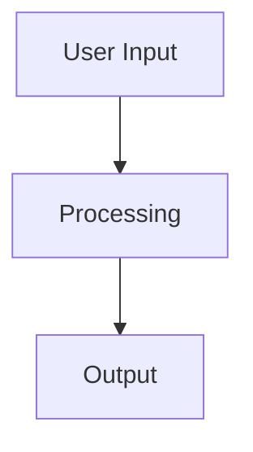

<!--
filename: VOS4-DOCUMENTATION-PROTOCOL.md
created: 2025-01-27 18:45:00 PST
author: VOS4 Development Team
copyright: Copyright (C) Manoj Jhawar/Aman Jhawar, Intelligent Devices LLC
purpose: Consolidated documentation protocol for VOS4 - replaces 4 separate files
last-modified: 2025-10-09 02:30:00 PDT
version: 1.2.0
-->

# VOS4 Documentation Protocol
**Unified Documentation Standards and Workflow**

## Changelog
<!-- Most recent first -->
- 2025-10-10 10:00:00 PDT: ✅ Added comprehensive naming conventions reference, consolidated scripts to /docs/scripts/
- 2025-10-09 02:30:00 PDT: 🔴 MANDATORY timestamp requirement added - all new docs must include YYMMDD-HHMM in filename
- 2025-09-07 10:35:00 PDT: Added TODO & STATUS file naming conventions section with examples
- 2025-01-27 18:45:00 PST: Initial creation - consolidated from 4 separate documentation files

## 🚨 MANDATORY REQUIREMENTS - ZERO TOLERANCE

### Critical Rules (NEVER VIOLATE)
1. **NEVER delete files/folders without explicit written approval**
2. **ALL code mergers/refactors MUST be 100% functionally equivalent (unless explicitly told otherwise)**
3. **ALL documentation MUST be updated BEFORE staging code changes**
4. **Stage documentation WITH code changes in same commit**
5. **NO AI/Claude references in commit messages**

### Documentation Location Rules 🔴 MANDATORY
1. **NEVER place documentation in project root folder** (except README.md, claude.md, BEF-SHORTCUTS.md)
2. **NEVER place ANY files directly in /docs/ root** - ZERO TOLERANCE
3. **REQUIRED:** All documentation MUST go in appropriate `/docs/` subfolders or new structure:
   - **Status/Reports:** `/coding/STATUS/` or `/docs/voiceos-master/status/`
   - **Active Work:** `/coding/TODO/`, `/coding/ISSUES/`, `/coding/DECISIONS/`
   - **Architecture Docs:** `/docs/voiceos-master/architecture/`
   - **Module Docs:** `/docs/modules/[module-name]/[appropriate-subfolder]/` (kebab-case)
   - **API Docs:** `/docs/modules/[module-name]/reference/api/` (kebab-case)
4. **VIOLATION = CRITICAL ERROR:** Any doc in wrong location must be moved immediately

### 🔴 MANDATORY: Q&A Before Documentation Architecture Decisions
**CRITICAL**: All AI agents MUST conduct Q&A sessions before making significant documentation structure or architecture decisions

**When Q&A Is Required for Documentation:**
- Restructuring documentation folders or hierarchies
- Creating new documentation standards or templates
- Changing documentation organization patterns
- Major documentation migrations (e.g., moving multiple modules)
- Documentation tooling decisions (e.g., choosing diagram formats)
- Documentation workflow changes

**Q&A Protocol:**
- Present 2-4 options with comprehensive pros/cons (minimum 5 each)
- Consider: usability (for users/developers), maintainability, scalability, searchability
- Provide clear recommendation with reasoning
- Suggest enhancements (e.g., automation scripts, templates, validation tools)
- ONE question at a time, wait for user answer before proceeding

**Examples Requiring Q&A:**
- "Should we use Mermaid or PlantUML for all diagrams?" → Q&A required
- "How should we organize multi-version documentation?" → Q&A required
- "Should we consolidate all module changelogs into one file?" → Q&A required

**Examples NOT Requiring Q&A:**
- Adding content to existing documentation file → No Q&A needed
- Fixing typos or formatting in docs → No Q&A needed
- Following established documentation patterns → No Q&A needed

**See Full Protocol:** `/Volumes/M Drive/Coding/Warp/vos4/Docs/ProjectInstructions/Protocol-VOS4-Pre-Implementation-QA.md`

---

## 📛 NAMING CONVENTIONS

**MANDATORY STANDARDS** - See `/docs/voiceos-master/standards/NAMING-CONVENTIONS.md` for complete reference

### Quick Reference Table

| Artifact Type | Convention | Example |
|--------------|------------|---------|
| **Kotlin/Java files** | `PascalCase.kt` | `AccessibilityScrapingIntegration.kt` |
| **Documentation files** | `PascalCase-With-Hyphens-YYMMDD-HHMM.md` | `Architecture-Refactor-Roadmap-251010-0157.md` |
| **Code module folders** | `PascalCase/` | `VoiceAccessibility/` |
| **Doc folders** | `kebab-case/` | `voice-accessibility/` |
| **Package names** | `lowercase.dot.separated` | `com.augmentalis.voiceaccessibility` |
| **Classes/Interfaces** | `PascalCase` | `VoiceCommandProcessor` |
| **Methods/Functions** | `camelCase` | `processVoiceCommand()` |
| **Variables/Properties** | `camelCase` | `elementHash` |
| **Constants** | `SCREAMING_SNAKE_CASE` | `MAX_DEPTH` |
| **XML layouts** | `lowercase_snake_case.xml` | `activity_main.xml` |
| **Database tables** | `lowercase_snake_case` | `scraped_elements` |
| **Database columns** | `lowercase_snake_case` | `element_hash` |
| **Scripts** | `kebab-case.sh` or `snake_case.sh` | `analyze-imports.sh` |

### Key Principles

1. **Source Files:** PascalCase for all .kt and .java files
2. **Documentation:** PascalCase-With-Hyphens-YYMMDD-HHMM.md format with timestamps
3. **Folders:** PascalCase for code modules, kebab-case for documentation folders
4. **Packages:** All lowercase with dots (com.augmentalis.modulename)
5. **Code:** Follow Kotlin/Java standards (PascalCase classes, camelCase methods)
6. **NO REDUNDANCY:** Avoid redundant prefixes in names

### Module Name Mapping

Code modules (PascalCase) map to documentation folders (kebab-case):

```
Code Module                          Documentation Folder
──────────────────────────────────  ──────────────────────────────────
modules/apps/VoiceAccessibility/  → docs/modules/voice-accessibility/
modules/apps/LearnApp/            → docs/modules/LearnApp/
modules/libraries/UUIDCreator/    → docs/modules/UUIDCreator/
modules/managers/CommandManager/  → docs/modules/CommandManager/
```

**Full Reference:** `/docs/voiceos-master/standards/NAMING-CONVENTIONS.md` (500+ lines with examples)

---

## 🔧 SCRIPTS AND AUTOMATION

**Location:** `/docs/scripts/` - All automation scripts consolidated here (2025-10-10)

### Script Categories

```
docs/scripts/
├── agent-tools/      # AI agent automation (analyze, fix, organize imports)
├── audit/           # Compliance audits (documentation structure verification)
├── build/           # Build automation (tests, git hooks, coverage guards)
└── development/     # Development utilities (code indexer, converters, sync)
```

### Common Scripts

**Agent Automation:**
- `agent-tools/analyze_imports.sh` - Analyze Kotlin import statements
- `agent-tools/fix_warnings.sh` - Auto-fix compiler warnings
- `agent-tools/organize_imports.sh` - Organize and cleanup imports

**Audit:**
- `audit/audit_docs_structure.sh` - Verify module documentation compliance

**Build:**
- `build/generate-test.sh` - Generate test boilerplate
- `build/setup-hooks.sh` - Setup Git hooks

**Full Documentation:** See `/docs/scripts/README.md` for detailed usage

---

## 📂 New Compartmentalized Structure (2025-02-07)

### Root-Level Quick Access (Active Development Work)
```
/Volumes/M Drive/Coding/Warp/vos4/
├── coding/                        # 🎯 ALL ACTIVE DEVELOPMENT WORK - CHECK FIRST
│   ├── TODO/                     # Active tasks
│   │   ├── VOS4-TODO-Master.md   # Overall project tasks
│   │   ├── [ModuleName]-TODO.md  # Module-specific tasks (e.g., VoiceAccessibility-TODO.md)
│   │   └── [BranchName]-TODO.md  # Branch-specific tasks (e.g., VOS4-LegacyIntegration-TODO.md)
│   ├── STATUS/                   # Current state - CHECK DAILY
│   │   ├── VOS4-Status-Current.md # Overall project status
│   │   ├── [ModuleName]-Status.md # Module-specific status (e.g., SpeechRecognition-Status.md)
│   │   └── [BranchName]-Status.md # Branch-specific status (e.g., VOS4-LegacyIntegration-Status.md)
│   ├── ISSUES/                   # Active problems to fix
│   │   ├── CRITICAL/             # Fix immediately
│   │   ├── HIGH/                 # Fix soon
│   │   ├── MEDIUM/               # Fix when possible
│   │   └── LOW/                  # Fix when time permits
│   ├── DECISIONS/                # Architecture Decision Records
│   ├── planning/                 # Sprint planning, roadmaps
│   ├── reviews/                  # Code review tracking
│   └── metrics/                  # Development metrics
├── docs/                         # 📚 All stable documentation
│   ├── scripts/                  # 🔧 All automation scripts (consolidated)
│   │   ├── agent-tools/         # AI agent automation scripts
│   │   ├── audit/               # Audit and compliance scripts
│   │   ├── build/               # Build and test automation
│   │   └── development/         # Development utilities
├── modules/                      # 📦 All application and library modules
└── tests/                        # Test code
```

### Documentation Structure (Stable Documentation)
```
docs/
├── voiceos-master/               # System-level documentation
│   ├── architecture/             # System design, overview
│   ├── roadmap/                  # Future plans, milestones
│   ├── implementation/           # How it's built
│   ├── diagrams/                 # Visual documentation
│   ├── changelog/                # Version history
│   ├── testing/                  # Test plans, coverage
│   ├── status/                   # Detailed status reports
│   ├── developer-manual/         # Dev guides
│   ├── user-manual/              # User guides
│   ├── standards/                # Coding standards, conventions
│   ├── project-management/       # PM docs, reports
│   └── reference/                # Quick references
│       └── api/                  # System-wide API documentation

├── modules/                      # Module documentation (15 total)
│   ├── apps/                     # Application modules (4 total)
│   │   ├── voice-accessibility/  # VoiceAccessibility (kebab-case)
│   │   ├── speech-recognition/   # SpeechRecognition (kebab-case)
│   │   ├── voice-cursor/         # VoiceCursor (kebab-case)
│   │   └── voice-ui/             # VoiceUI (kebab-case)
│   ├── libraries/                # Library modules (6 total)
│   │   ├── device-manager/       # DeviceManager (kebab-case)
│   │   ├── hud-manager/          # HUDManager (kebab-case)
│   │   ├── keyboard/             # Keyboard (kebab-case)
│   │   ├── localization-manager/ # LocalizationManager (kebab-case)
│   │   ├── settings/             # Settings (kebab-case)
│   │   └── voice-ui-elements/    # VoiceUIElements (kebab-case)
│   └── managers/                 # Manager modules (5 total)
│       ├── command-manager/      # CommandManager (kebab-case)
│       ├── core-manager/         # CoreManager (kebab-case)
│       ├── data-manager/         # DataManager (kebab-case)
│       ├── license-manager/      # LicenseManager (kebab-case)
│       └── vos-data-manager/     # VosDataManager (kebab-case)
│
│   # Each module folder has complete structure:
│   # ├── architecture/           # Module design, overview
│   # ├── roadmap/                # Module plans, milestones
│   # ├── implementation/         # How module is built
│   # ├── diagrams/               # Visual documentation
│   # ├── changelog/              # Module version history
│   # ├── testing/                # Module test plans
│   # ├── status/                 # Module status reports
│   # ├── developer-manual/       # Module dev guides
│   # ├── user-manual/            # Module user guides
│   # ├── module-standards/       # Module-specific standards
│   # ├── project-management/     # Module PM docs
│   # └── reference/              # Module quick references
│   #     └── api/                # Module API documentation

├── templates/                    # Documentation templates
└── archive/                      # Old/deprecated documentation
```

---

## 📝 Document Naming Conventions

### TODO & STATUS File Naming (in `/coding/` folders)

#### TODO Files (`/coding/TODO/`)
**Pattern:** `[Prefix]-TODO-[Suffix].md`
- **System-wide:** `VOS4-TODO-Master.md`, `VOS4-TODO-CurrentSprint.md`
- **Module-specific:** `[ModuleName]-TODO.md` (e.g., `VoiceAccessibility-TODO.md`, `SpeechRecognition-TODO.md`)
- **Branch-specific:** `[BranchName]-TODO.md` (e.g., `VOS4-LegacyIntegration-TODO.md`)
- **Time-stamped:** `[MODULE]-COMPLETION-CHECKLIST-YYMMDD.md` (e.g., `VOSK-COMPLETION-CHECKLIST-250903.md`)

#### STATUS Files (`/coding/STATUS/`)
**Pattern:** `[Prefix]-Status-[Suffix].md`
- **System-wide:** `VOS4-Status-Current.md`, `VOS4-Status-Comprehensive.md`
- **Module-specific:** `[ModuleName]-Status.md` (e.g., `SpeechRecognition-Status.md`)
- **Branch-specific:** `[BranchName]-Status.md` (e.g., `VOS4-LegacyIntegration-Status.md`)
- **Date-specific:** `[PREFIX]-Status-YYYY-MM-DD.md` (e.g., `VOS4-Status-2025-09-07.md`)
- **Build-specific:** `BUILD-STATUS-YYYY-MM-DD.md`

### Standard Document Format: `[Module]-[Topic]-[DocType][-CI].md`

**Components:**
- **Module**: ALWAYS include module name (e.g., VoiceAccessibility, CommandManager, VOS4)
- **Topic**: Specific concern (Config, API, Status, Architecture, etc.)
- **DocType**: Document type (Guide, Reference, Report, Spec, Changelog)
- **-CI suffix**: REQUIRED for all documents in CodeImport folders

**Examples:**
```
# In main module folders:
VoiceAccessibility-Architecture-Spec.md
VoiceAccessibility-API-Reference.md
CommandManager-Changelog.md

# In CodeImport folders (MUST have -CI suffix):
VoiceAccessibility-Architecture-Diagrams-CI.md
VoiceAccessibility-Implementation-Guide-CI.md

# System-wide (use VOS4 as module):
VOS4-Architecture-Spec.md
VOS4-TODO-Master.md
```

### 🚨 Time-Stamped Document Format: `MODULENAME-WhatItIs-YYMMDD-HHMM.md`

**🔴 MANDATORY Format for ALL New Documentation Files:**
- Status reports and tracking documents
- Migration documentation
- Implementation guides (session-specific)
- Analysis reports
- Any temporary or session-specific files
- Precompaction reports
- TODO lists (session-specific)
- Technical deep-dive documents
- **ALL files created in `/coding/TODO/`, `/coding/STATUS/`, `/docs/voiceos-master/status/`**

**Format Rules:**
- **MODULENAME**: Module or application name (e.g., SpeechRecognition, VOS4, LegacyAvenue)
- **WhatItIs**: Brief description (e.g., Status, TODO, Inventory, Analysis)
- **YYMMDD**: Date in 6-digit format (year-month-day)
- **HHMM**: Time in 24-hour format WITHOUT COLON (e.g., 1430 for 2:30 PM, 0425 for 4:25 AM)

**🔴 CRITICAL RULES:**
1. **ALWAYS include timestamp in filename** - NO EXCEPTIONS
2. **When updating a timestamped file, CREATE A NEW FILE with new timestamp** - DO NOT edit original
3. **Keep old timestamped files for history** - move to `/docs/archive/` if needed
4. **Use `date "+%y%m%d-%H%M"` command to get correct timestamp**
5. **NO COLONS in time portion** - filenames cannot contain colons

**Examples:**
```
# Correct format (NO COLON in time):
SpeechRecognition-Status-251009-0230.md
VOS4-TODO-Master-251009-1430.md
LegacyAvenue-Inventory-250903-0425.md
VOS4-Architecture-Analysis-251009-1645.md
VOS4-LegacyIntegration-Phase2-TODO-251009-0230.md
Legacy-Integration-Status-Summary-251009-0230.md

# INCORRECT (missing timestamp):
❌ SpeechRecognition-Status.md
❌ VOS4-TODO-Master.md

# INCORRECT (has colon in time):
❌ VOS4-Status-251009-02:30.md
❌ TODO-Master-251009-14:30.md
```

**Getting Correct Timestamp:**
```bash
# ALWAYS run this first:
date "+%y%m%d-%H%M"
# Example output: 251009-0230

# Then use in filename:
VOS4-Status-251009-0230.md
```

---

## 📋 Document Header Template (MANDATORY)

### Standard Header (All Documents)
```markdown
<!--
filename: [Document-Name].md
created: YYYY-MM-DD HH:MM:SS PST
author: VOS4 Development Team
copyright: Copyright (C) Manoj Jhawar/Aman Jhawar, Intelligent Devices LLC
purpose: [Brief description]
last-modified: YYYY-MM-DD HH:MM:SS PST
version: X.Y.Z
-->

# Document Title

## Changelog
<!-- Most recent first -->
- 2025-01-24 14:30:00 PST: Updated section X - added new pattern
- 2025-01-23 09:15:00 PST: Initial creation - consolidated from Y
```

**Time Format Requirements:**
- Always use Pacific Time (PST/PDT)
- Format: HH:MM:SS using 24-hour format (e.g., 14:30:00 PST)
- Include timezone abbreviation

---

## 🔄 When to Update Documentation

### ALWAYS Update Documentation After:
1. **Code changes** - Update changelog and developer manual
2. **Bug fixes** - Document in changelog with solution
3. **New features** - Update API reference and guides
4. **Architecture changes** - Update design specs and diagrams
5. **Merges/Imports** - Update Feature Parity Checklist
6. **File/folder creation or deletion** - Update master inventories

### MANDATORY Documentation Workflow

#### BEFORE Code Changes:
- [ ] Check `/coding/TODO/[Module]-TODO.md` for task context
- [ ] Check `/docs/modules/[module-name]/changelog/` for history  
- [ ] Check `/coding/STATUS/[Module]-Status.md` for current state
- [ ] Check Master Inventories to prevent duplicates

#### AFTER Code Changes:
- [ ] Update `/docs/modules/[module-name]/changelog/` with changes
- [ ] Update `/coding/STATUS/[Module]-Status.md` with progress
- [ ] Update `/coding/TODO/[Module]-TODO.md` with completion
- [ ] Update architecture/diagrams if structure changed
- [ ] Update Master Inventories with new items

---

## ✅ Pre-Commit MANDATORY Checklist

**BEFORE ANY COMMIT - ALL MUST BE COMPLETED:**

### 1️⃣ Code Changes Validation
- [ ] **Functional Equivalency Verified**
  - [ ] All original features preserved
  - [ ] All method signatures maintained
  - [ ] No functionality removed (unless approved)
  - [ ] 100% backward compatibility confirmed

- [ ] **File/Folder Preservation**
  - [ ] NO files deleted without approval
  - [ ] NO folders removed without permission
  - [ ] Archives created instead of deletions

### 2️⃣ Documentation Updates (MANDATORY for affected items)
- [ ] **Module Changelog Updated** - ALWAYS required
- [ ] **Architecture diagrams/flowcharts** (if structure changed)
- [ ] **API documentation** (if public methods changed)
- [ ] **Status and TODO updates** (progress tracking)
- [ ] **Master Inventories** (if new items created)

### 3️⃣ Visual Documentation (MANDATORY if created/changed)
- [ ] **Architecture Diagrams** (Mermaid + ASCII formats)
- [ ] **Flowcharts & Sequences** (process flows, APIs)
- [ ] **UI/UX Documentation** (layouts, wireframes)
- [ ] **Technical Diagrams** (class, database, network)

### 4️⃣ Staging Process
- [ ] Documentation staged WITH code changes
- [ ] Commit message ready (no AI refs)
- [ ] All changes verified with `git status`

---

## 📊 Changelog Format

### Standard Entry Format
```markdown
## Changelog
<!-- Most recent first -->
- 2025-01-24 14:30:00 PST: [Component] - [What changed] - [Why it changed]
- 2025-01-23 09:15:00 PST: CommandProcessor - Added validation - Prevents null errors
- 2025-01-22 16:45:00 PST: VoskEngine - Fixed memory leak - Reduces memory usage by 40%
```

### Change Categories
- **Added** - New features or files
- **Changed** - Modifications to existing functionality  
- **Fixed** - Bug fixes
- **Removed** - Deleted features or files (requires approval)
- **Security** - Security-related changes
- **Performance** - Optimization changes

---

## 🚨 MANDATORY Visual Documentation Requirements

**ALL DOCUMENTATION MUST INCLUDE DIAGRAMS**

### Required Diagram Types:
- **Architecture Diagrams**: System overview, component relationships
- **Flow Charts**: Process flows, decision trees, user journeys
- **Sequence Diagrams**: API interactions, command processing flows
- **Class Diagrams**: Object relationships, inheritance hierarchies

### Diagram Formats (Both Required):


```
ASCII Alternative:
┌─────────────┐    ┌─────────────┐    ┌─────────────┐
│ User Input  │───▶│ Processing  │───▶│   Output    │
└─────────────┘    └─────────────┘    └─────────────┘
```

### When Diagrams Are Required:
- **Architecture docs**: System overview diagrams mandatory
- **API docs**: Sequence diagrams for complex interactions
- **Process docs**: Flow charts for multi-step procedures
- **Module docs**: Component diagrams showing relationships

---

## 📋 Master Inventory Requirements

### MANDATORY - Check Before Creating ANYTHING
```markdown
# VOS4-Master-Inventory

## Last Updated: YYYY-MM-DD HH:MM:SS PST

## Apps Inventory
| App Name | Location | Purpose | Status | Created | Modified |
|----------|----------|---------|--------|---------|----------|
| VoiceAccessibility | apps/VoiceAccessibility | Accessibility service | Active | 2025-01-20 | 2025-01-24 |

## Modules Inventory  
| Module | Location | Purpose | Status | Dependencies |
|--------|----------|---------|--------|--------------|
| CommandManager | managers/CommandManager | Command routing | Active | VosDataManager |

## Classes Inventory (by Module)
### VoiceAccessibility Module
| Class | Namespace | Purpose | File | Functions Count |
|-------|-----------|---------|------|-----------------|
| VOSAccessibilitySvc | com.augmentalis.voiceaccessibility | Main service | VOSAccessibilitySvc.kt | 12 |

## Duplication Check Points
- [ ] No duplicate class names across modules
- [ ] No duplicate function names within class
- [ ] No duplicate file names in same directory
```

---

## 🔧 Function Subfolder Rules

### When to Create Function Subfolders (MANDATORY):
1. **Module has 6+ main functions** (like SpeechRecognition engines)
2. **Category has 5+ implementations** (like CommandsMGR actions)
3. **Logical grouping exists** (api/, utils/, models/, etc.)

### Examples:
#### SpeechRecognition (6 engines = separate folders):
```
engines/
├── android/     # Android native engine
├── azure/       # Microsoft Azure engine
├── google/      # Google Cloud engine
├── openai/      # OpenAI Whisper engine
├── vosk/        # Vosk offline engine
└── vivoka/      # Vivoka VDK engine
```

#### CommandsMGR (11 actions = same level):
```
actions/
├── AppActions.kt           # Each file is self-contained
├── CursorActions.kt
├── DictationActions.kt
└── [remaining actions...]
```

---

## 💻 Commit Message Requirements

### Format:
```
type(scope): Brief description

- List key changes
- Document what was updated  
- Note any documentation changes

Author: [Name]
```

### NEVER Include:
- ❌ "Claude", "Anthropic", "AI" references
- ❌ "Generated with [tool]" statements
- ❌ "Co-Authored-By: Claude"
- ✅ Keep professional and tool-agnostic

---

## 🔄 Staging Process

### 1. Update Documentation FIRST
```bash
# Check what needs updating
git status

# Update all affected docs
# Then stage documentation
git add coding/ docs/
```

### 2. Stage Code Changes WITH Documentation
```bash
# Stage specific code files
git add [specific-files]

# NEVER use git add . (except in CodeImport/)
```

### 3. Commit with Descriptive Message
```bash
git commit -m "type(scope): Description

- Updated [Module]-Changelog.md
- Modified architecture documentation
- Marked TODO items complete

Author: [Name]"
```

---

## 📊 Quick Reference Tables

### Documentation Priority Matrix
| Change Type | Changelog | Dev Manual | Architecture | API Ref | Status |
|------------|-----------|------------|--------------|---------|---------|
| Bug Fix | ✅ MUST | If needed | No | If API changed | ✅ MUST |
| Feature Add | ✅ MUST | ✅ MUST | If design changed | ✅ MUST | ✅ MUST |
| Refactor | ✅ MUST | If usage changed | If structure changed | If API changed | ✅ MUST |
| Import/Merge | ✅ MUST | ✅ MUST | ✅ MUST | ✅ MUST | ✅ MUST |

### Module Name Mapping (Code → Documentation)

**Total: 15 Modules (4 Apps + 6 Libraries + 5 Managers)**

#### Applications (4 modules in `/modules/apps/` → docs in `/docs/modules/apps/`):
| Code Name (CamelCase) | Doc Folder (kebab-case) | Location |
|----------------------|--------------------------|----------|
| VoiceAccessibility | voice-accessibility | `/modules/apps/VoiceAccessibility` |
| SpeechRecognition | speech-recognition | `/modules/apps/SpeechRecognition` |
| VoiceCursor | voice-cursor | `/modules/apps/VoiceCursor` |
| VoiceUI | voice-ui | `/modules/apps/VoiceUI` |

#### Libraries (6 modules in `/modules/libraries/` → docs in `/docs/modules/libraries/`):
| Code Name (CamelCase) | Doc Folder (kebab-case) | Location |
|----------------------|--------------------------|----------|
| DeviceManager | device-manager | `/modules/libraries/DeviceManager` |
| HUDManager | hud-manager | `/modules/libraries/HUDManager` |
| Keyboard | keyboard | `/modules/libraries/Keyboard` |
| LocalizationManager | localization-manager | `/modules/libraries/LocalizationManager` |
| Settings | settings | `/modules/libraries/Settings` |
| VoiceUIElements | voice-ui-elements | `/modules/libraries/VoiceUIElements` |

#### Managers (5 modules in `/modules/managers/` → docs in `/docs/modules/managers/`):
| Code Name (CamelCase) | Doc Folder (kebab-case) | Location |
|----------------------|--------------------------|----------|
| CommandManager | command-manager | `/modules/managers/CommandManager` |
| CoreManager | core-manager | `/modules/managers/CoreManager` |
| DataManager | data-manager | `/modules/managers/DataManager` |
| LicenseManager | license-manager | `/modules/managers/LicenseManager` |
| VosDataManager | vos-data-manager | `/modules/managers/VosDataManager` |

**System-wide:** Use VOS4 prefix for system-level documentation

---

## 🚀 Quick Command Shortcuts

### Universal Commands:
- **UD** = Update Documents (update all relevant documentation files)
- **SCP** = Stage, Commit & Push (stage → commit → push with docs updated FIRST)
- **SUF** = Stage, Update & Full workflow (complete workflow with docs)

### AI Review Patterns:
- **COT** = Chain of Thought (linear reasoning)
- **ROT** = Reflection on Thought (evaluation)
- **TOT** = Tree of Thought (explore alternatives)
- **CRT** = Combined Review Technique (full analysis with options)

---

## ⚡ Quick Checklist (Copy/Paste)

```
Pre-Commit Documentation Check:
- [ ] Functional equivalency verified (100%)
- [ ] No files/folders deleted without approval
- [ ] Module changelog updated (MANDATORY)
- [ ] Architecture diagrams updated (if changed)
- [ ] Status/TODO updated
- [ ] Master inventories updated (if new items)
- [ ] Documentation staged with code
- [ ] Visual docs created (Mermaid + ASCII)
- [ ] Commit message ready (no AI refs)
- [ ] git status verified
```

---

## 🔍 Verification Commands

```bash
# Check for uncommitted documentation
find docs -name "*.md" -newer .git/index

# Check changelog was updated
git diff docs/modules/[module-name]/changelog/[Module]-Changelog.md

# Verify no unapproved deletions
git status --porcelain | grep "^D"

# List all module documentation
ls -la docs/modules/*/
```

---

**FILES REPLACED BY THIS PROTOCOL:**
- DOCUMENTATION-CHECKLIST.md (Pre-commit checklist)
- DOCUMENTATION-GUIDE.md (General documentation standards)
- DOCUMENT-STANDARDS.md (AI documentation creation standards)
- FILE-STRUCTURE-GUIDE.md (File structure and organization rules)

**Remember:** Documentation is code. Treat it with the same care, precision, and standards.

---

**Last Updated:** 2025-01-27 18:45:00 PST  
**Purpose:** Single source of truth for all VOS4 documentation standards and workflows