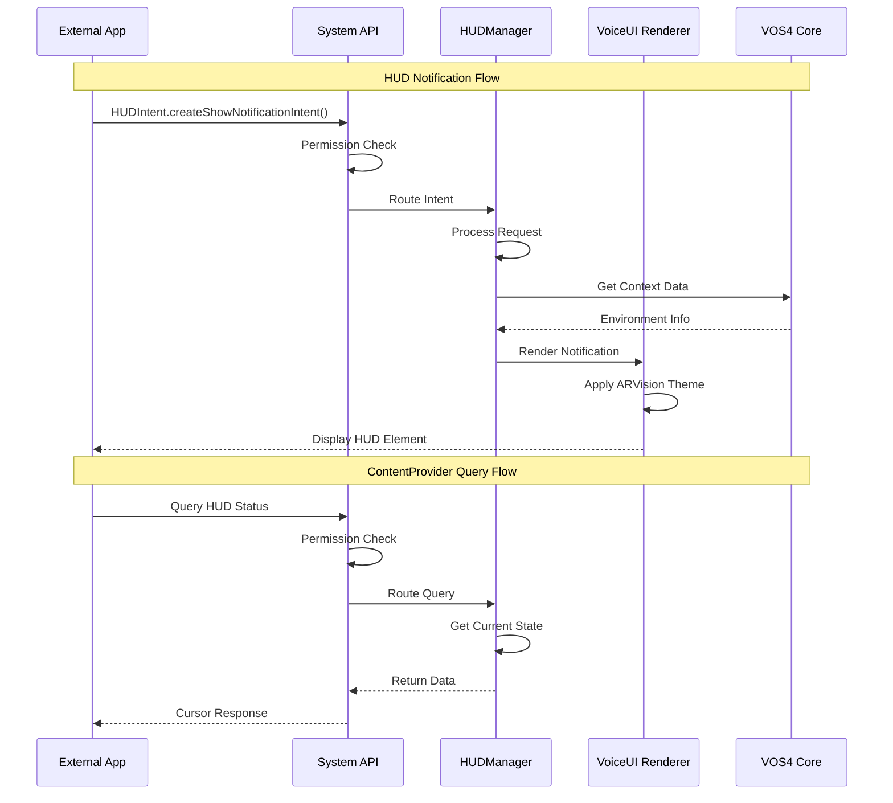
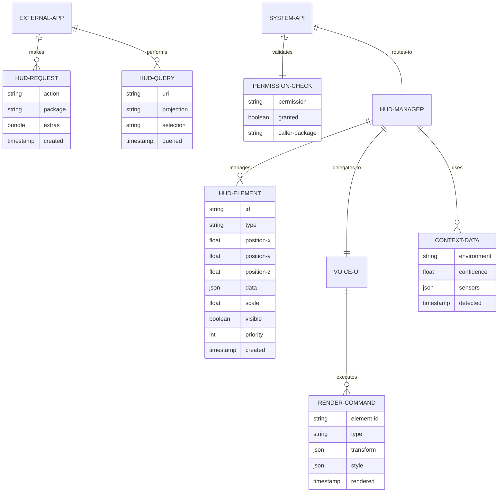
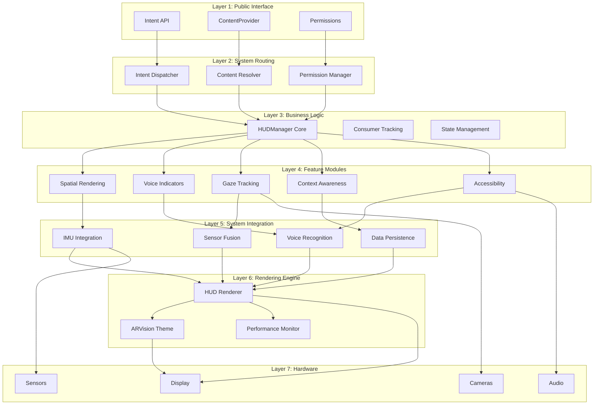
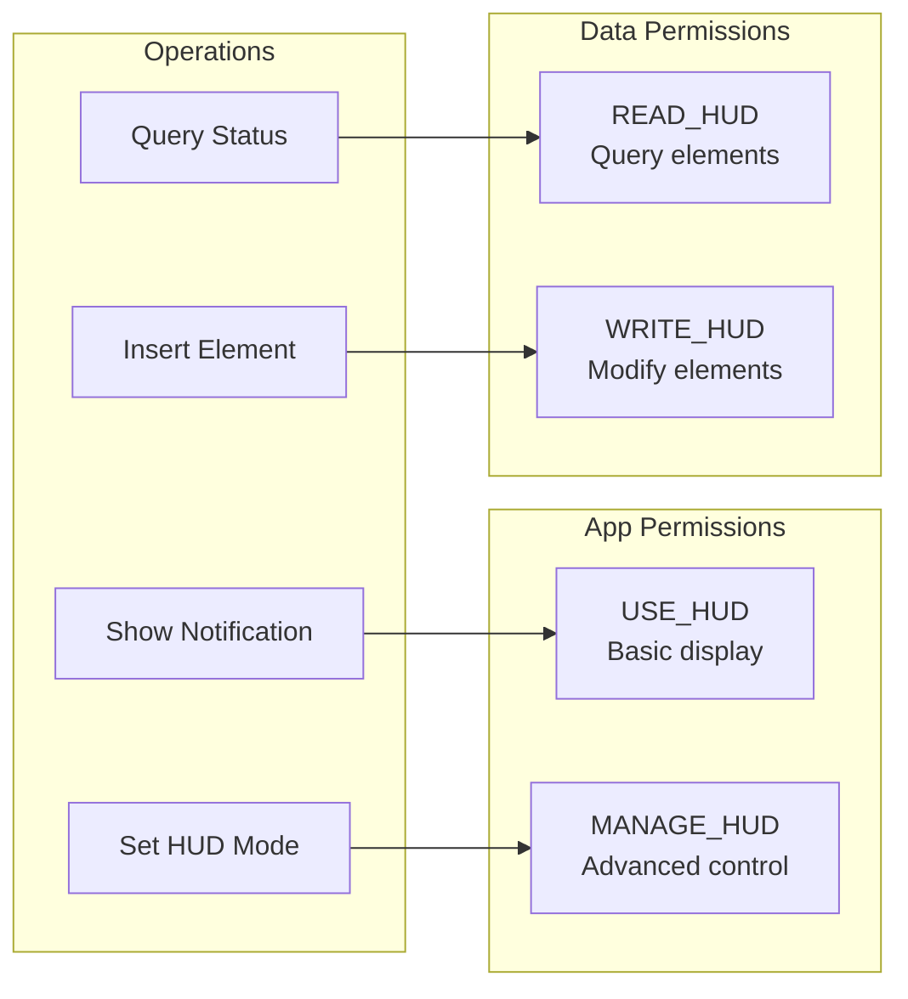

# HUD System Complete Architecture

## System Overview

```mermaid
graph TB
    subgraph "External Applications"
        EA1[Banking App]
        EA2[Navigation App]
        EA3[Gaming App]
        EA4[Productivity App]
    end
    
    subgraph "VoiceOS Main App (System-wide APIs)"
        subgraph "Public API Layer"
            API[HUDIntent API<br/>com.augmentalis.voiceos.api]
            CP[ContentProvider<br/>com.augmentalis.voiceos.hud.provider]
        end
        
        subgraph "Permission System"
            P1[USE_HUD]
            P2[MANAGE_HUD]
            P3[READ_HUD]
            P4[WRITE_HUD]
        end
    end
    
    subgraph "HUDManager (Implementation Authority)"
        HM[HUDManager<br/>Central Coordinator]
        
        subgraph "Advanced Features"
            SF[SpatialRenderer<br/>3D Positioning]
            VIS[VoiceIndicatorSystem<br/>Command Visualization]
            GT[GazeTracker<br/>Eye Tracking]
            CM[ContextManager<br/>Environment Detection]
            AE[AccessibilityEnhancer<br/>A11y Features]
        end
        
        subgraph "Implementation APIs"
            IAPI[HUDIntent Implementation]
            ICP[ContentProvider Implementation]
        end
    end
    
    subgraph "VoiceUI (Rendering Engine)"
        HR[HUDRenderer<br/>90-120 FPS]
        AT[ARVisionTheme<br/>Glass Morphism]
        HS[HUDSystem<br/>Basic UI Management]
    end
    
    subgraph "VOS4 Core Systems"
        IMU[IMUManager<br/>Head Tracking]
        VDM[VosDataManager<br/>Persistence]
        VAS[VoiceAccessibility<br/>A11y Services]
        SR[SpeechRecognition<br/>Voice Processing]
        DM[DeviceManager<br/>Sensors]
    end
    
    %% External app interactions
    EA1 --> API
    EA2 --> API
    EA3 --> CP
    EA4 --> CP
    
    %% API routing to implementation
    API -.->|Routes to| HM
    CP -.->|Routes to| HM
    
    %% Permission checks
    API --> P1
    CP --> P3
    CP --> P4
    
    %% HUDManager internal structure
    HM --> SF
    HM --> VIS
    HM --> GT
    HM --> CM
    HM --> AE
    HM --> IAPI
    HM --> ICP
    
    %% HUDManager delegates rendering
    HM -.->|Delegates Rendering| HR
    HR --> AT
    HM -.->|Uses Basic Functions| HS
    
    %% System integrations
    HM --> IMU
    HM --> VDM
    HM --> VAS
    CM --> SR
    GT --> DM
    
    %% Styling
    classDef external fill:#e1f5fe
    classDef system fill:#f3e5f5
    classDef manager fill:#e8f5e8
    classDef ui fill:#fff3e0
    classDef core fill:#fce4ec
    
    class EA1,EA2,EA3,EA4 external
    class API,CP,P1,P2,P3,P4 system
    class HM,SF,VIS,GT,CM,AE,IAPI,ICP manager
    class HR,AT,HS ui
    class IMU,VDM,VAS,SR,DM core
```



## Component Flow Diagram



## Data Architecture



## Layer Architecture



## Package Structure

```
com.augmentalis.voiceos/                    # System APIs
├── api/
│   └── HUDIntent.kt                        # Public Intent API
└── provider/
    └── HUDContentProvider.kt               # Data sharing

com.augmentalis.hudmanager/                 # Implementation
├── HUDManager.kt                           # Central coordinator
├── api/
│   └── HUDIntent.kt                        # Implementation copy
├── provider/
│   └── HUDContentProvider.kt               # Implementation copy
├── spatial/
│   ├── SpatialRenderer.kt                  # 3D positioning
│   ├── VoiceIndicatorSystem.kt             # Voice visualization
│   └── GazeTracker.kt                      # Eye tracking
├── core/
│   └── ContextManager.kt                   # Environment detection
├── accessibility/
│   └── AccessibilityEnhancer.kt            # A11y features
└── rendering/                              # Legacy (deprecated)

com.augmentalis.voiceui/                    # Rendering Engine
├── hud/
│   ├── HUDRenderer.kt                      # High-performance rendering
│   └── HUDSystem.kt                        # Basic UI management
└── theme/
    └── ARVisionTheme.kt                    # Visual styling
```

## Runtime Architecture

### Initialization Flow
1. **App Launch** → VoiceOS main app starts
2. **API Registration** → System APIs become available
3. **Service Discovery** → HUDManager registers as handler
4. **VoiceUI Integration** → HUDRenderer initializes
5. **Ready State** → External apps can use HUD APIs

### Request Processing
1. **Intent Reception** → System API receives request
2. **Permission Validation** → Check caller permissions
3. **Request Routing** → Forward to HUDManager
4. **Context Analysis** → Determine optimal rendering
5. **Rendering Delegation** → VoiceUI executes display
6. **Response** → Acknowledge to caller

### Resource Management
- **Memory**: Singleton pattern, element pooling
- **CPU**: Adaptive FPS, background throttling
- **Battery**: Context-aware optimization
- **Storage**: Efficient caching, cleanup policies

## Security Architecture

### Permission Model


This complete architecture provides a robust, scalable, and secure foundation for the HUD system with clear separation of concerns and optimal performance characteristics.