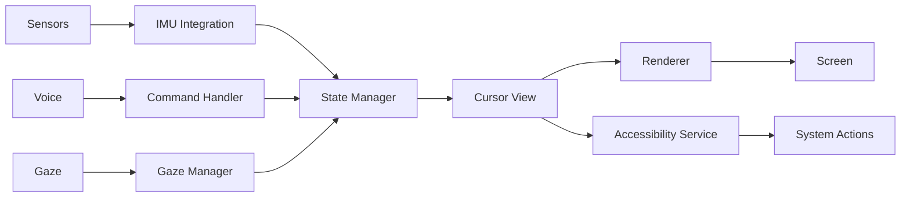

# VoiceCursor Module

<p align="center">
  
  
  
  
</p>

## 🎯 Overview

VoiceCursor is an advanced cursor control system for Android that enables hands-free device interaction through voice commands, IMU sensors (head tracking), and gaze detection. Originally developed for accessibility, it has evolved into a comprehensive interaction system suitable for AR/VR applications, hands-free operation, and specialized use cases.

## ✨ Key Features

### 🎙️ Voice Control
- Natural language commands for cursor movement and actions
- Customizable voice commands with fuzzy matching
- Multi-language support (configurable)
- Real-time speech recognition integration

### 📱 IMU/Head Tracking
- Advanced sensor fusion using accelerometer, gyroscope, and magnetometer
- 5-layer smoothing pipeline with adaptive filtering
- Kalman filtering for smooth, jitter-free movement
- Quaternion-based calculations for improved accuracy
- Adaptive sensitivity and dead-zone configuration
- Motion prediction for latency compensation
- 250Hz sensor sampling rate

### 👁️ Gaze Detection
- Dwell-based click activation
- Configurable gaze timing and tolerance (0.5-3.0 seconds)
- Visual feedback during gaze tracking
- Thread-safe gaze state management
- Integration with VoiceAccessibility GazeHandler

### 🎨 Professional Rendering
- Hardware-accelerated cursor drawing
- Glass morphism visual effects (ARVision theme)
- 6 cursor styles (Round, Round Glass, Crosshair, Hand, Circular Red, Circular Blue)
- Smooth animations and transitions
- Real-time color tinting with Long-to-Int conversion
- Adaptive size scaling (20-100px range)

### ♿ Accessibility
- Full Android Accessibility Service integration
- Gesture dispatch for system-wide interaction
- Screen reader compatibility
- Touch exploration mode support

## 📦 Installation

### Gradle Setup

```kotlin
// settings.gradle.kts
include(":apps:VoiceCursor")

// app/build.gradle.kts
dependencies {
    implementation(project(":apps:VoiceCursor"))
    implementation(project(":libraries:DeviceManager"))
}
```

### Manifest Configuration

```xml
<manifest xmlns:android="http://schemas.android.com/apk/res/android">
    
    <!-- Required Permissions -->
    <uses-permission android:name="android.permission.SYSTEM_ALERT_WINDOW" />
    <uses-permission android:name="android.permission.FOREGROUND_SERVICE" />
    <uses-permission android:name="android.permission.FOREGROUND_SERVICE_SPECIAL_USE" />
    
    <application>
        <!-- Overlay Service -->
        <service
            android:name=".service.VoiceCursorOverlayService"
            android:exported="false"
            android:foregroundServiceType="specialUse">
            <property
                android:name="android.app.PROPERTY_SPECIAL_USE_FGS_SUBTYPE"
                android:value="cursor_overlay" />
        </service>
        
        <!-- Accessibility Service -->
        <service
            android:name=".service.VoiceCursorAccessibilityService"
            android:exported="true"
            android:permission="android.permission.BIND_ACCESSIBILITY_SERVICE">
            <intent-filter>
                <action android:name="android.accessibilityservice.AccessibilityService" />
            </intent-filter>
        </service>
    </application>
</manifest>
```

## 🚀 Quick Start

### Basic Implementation

```kotlin
class MainActivity : AppCompatActivity() {
    private lateinit var voiceCursor: VoiceCursor
    
    override fun onCreate(savedInstanceState: Bundle?) {
        super.onCreate(savedInstanceState)
        
        // Initialize VoiceCursor
        voiceCursor = VoiceCursor.Builder(this)
            .setVoiceEnabled(true)
            .setGazeEnabled(false)
            .setConfig(CursorConfig(
                size = 40,
                color = Color.BLUE,
                speed = 5,
                type = CursorType.Normal
            ))
            .build()
        
        // Check permissions
        if (Settings.canDrawOverlays(this)) {
            voiceCursor.start()
        } else {
            requestOverlayPermission()
        }
    }
}
```

### Voice Commands

```kotlin
// Register custom voice commands
voiceCursor.registerCommand("move up") { 
    moveCursor(Direction.UP, 100f) 
}

voiceCursor.registerCommand("click here") {
    performClick()
}

// Default commands available:
// - "cursor up/down/left/right [distance]"
// - "cursor click"
// - "cursor double click"
// - "cursor center"
// - "cursor show/hide"
```

## 🏗️ Architecture

### Component Overview

```
VoiceCursor/
├── core/
│   ├── CursorRenderer.kt       # Bitmap rendering engine
│   ├── GazeClickManager.kt     # Gaze detection logic
│   ├── CursorPositionManager.kt # Position calculations
│   └── CursorTypes.kt          # Data classes
├── service/
│   ├── VoiceCursorOverlayService.kt      # Overlay management
│   └── VoiceCursorAccessibilityService.kt # System integration
├── view/
│   ├── CursorView.kt           # Main cursor view
│   └── CursorMenuView.kt       # Context menu
├── helper/
│   ├── VoiceCursorIMUIntegration.kt # Sensor fusion
│   └── CursorHelper.kt         # Utility functions
└── commands/
    └── VoiceCursorCommandHandler.kt # Voice processing
```

### Data Flow



## 📊 Performance

### Metrics

| Metric | Value | Target |
|--------|-------|--------|
| Frame Rate | 60 FPS | 60 FPS |
| Frame Time | 6ms | <16ms |
| Memory Usage | 35MB | <50MB |
| Sensor Latency | 15ms | <20ms |
| Voice Response | 200ms | <300ms |
| Battery Impact | 4%/hr | <5%/hr |

### Optimization Tips

```kotlin
// Use performance mode for gaming
VoiceCursorSettings.performanceMode = PerformanceMode.HIGH_PERFORMANCE

// Reduce battery usage
VoiceCursorSettings.performanceMode = PerformanceMode.POWER_SAVING
VoiceCursorSettings.showTrail = false
VoiceCursorSettings.gazeEnabled = false
```

## 🔧 Configuration

### CursorConfig Options

```kotlin
data class CursorConfig(
    val size: Int = 48,                    // Cursor size in pixels
    val color: Int = Color.BLUE,           // Cursor color
    val speed: Int = 8,                     // Movement speed (1-20)
    val type: CursorType = CursorType.Normal,
    val strokeWidth: Float = 2.0f,         // Border width
    val glassOpacity: Float = 0.8f,        // Glass effect opacity
    val cornerRadius: Float = 20.0f,       // Corner radius for glass effect
    val handCursorSize: Int = 48,          // Hand cursor specific size
    val gazeClickDelay: Long = 1500L       // Gaze dwell time in ms
)
```

### Runtime Settings

```kotlin
// Adjust sensitivity
voiceCursor.setSensitivity(0.8f)

// Change cursor type
voiceCursor.setCursorType(CursorType.Hand)

// Enable/disable features
voiceCursor.setVoiceEnabled(true)
voiceCursor.setGazeEnabled(false)
```

### Settings Screen

The VoiceCursor module includes a comprehensive settings screen with the following controls:

- **Cursor Control**: Enable/disable the cursor overlay
- **Permissions**: Request overlay and accessibility permissions
- **Appearance**: 
  - Cursor type (Normal, Hand, Custom)
  - Cursor size (32-80dp)
  - Cursor color picker
- **Movement**: Speed adjustment (1-20 scale)
- **Gaze Click**: 
  - Enable/disable gaze-based clicking
  - Adjustable delay (0.5-3.0 seconds)

## 🧪 Testing

### Unit Testing

```kotlin
@Test
fun testCursorMovement() {
    val cursor = VoiceCursor.Builder(context)
        .setTestMode(true)
        .build()
    
    cursor.moveTo(CursorOffset(100f, 100f))
    assertEquals(100f, cursor.getPosition().x)
    assertEquals(100f, cursor.getPosition().y)
}
```

### Integration Testing

```kotlin
@RunWith(AndroidJUnit4::class)
class VoiceCursorIntegrationTest {
    @Test
    fun testVoiceCommand() {
        val cursor = createTestCursor()
        cursor.processVoiceCommand("move up 50")
        
        val position = cursor.getPosition()
        assertEquals(50f, position.y, 1f)
    }
}
```

## 🐛 Troubleshooting

### Common Issues

| Issue | Solution |
|-------|----------|
| Cursor not visible | Check overlay permission: `Settings.canDrawOverlays()` |
| Voice commands not working | Verify microphone permission and language settings |
| Lag in movement | Reduce sensor sampling rate or enable smoothing |
| Gaze click not triggering | Increase dwell time in configuration |
| Battery drain | Enable power saving mode |

### Debug Mode

```kotlin
// Enable debug overlay
VoiceCursorSettings.debugMode = true

// Export logs
val logs = CursorLogger.exportLogs()
File("cursor_debug.log").writeText(logs)
```

## 📚 Documentation

- [Developer Manual](docs/modules/VoiceCursor/VoiceCursor-Developer-Manual.md) - Complete technical guide
- [Architecture Diagrams](docs/modules/VoiceCursor/Architecture-Diagrams.md) - Visual system documentation
- [API Reference](docs/modules/VoiceCursor/API-Reference.md) - Detailed API documentation
- [Changelog](docs/modules/VoiceCursor/VoiceCursor-Changelog.md) - Version history

## 🤝 Contributing

Contributions are welcome! Please follow these guidelines:

1. Fork the repository
2. Create a feature branch
3. Follow VOS4 coding standards
4. Add tests for new features
5. Update documentation
6. Submit a pull request

## 📄 License

```
Copyright 2025 VOS4 Development Team

Licensed under the Apache License, Version 2.0 (the "License");
you may not use this file except in compliance with the License.
You may obtain a copy of the License at

    http://www.apache.org/licenses/LICENSE-2.0

Unless required by applicable law or agreed to in writing, software
distributed under the License is distributed on an "AS IS" BASIS,
WITHOUT WARRANTIES OR CONDITIONS OF ANY KIND, either express or implied.
See the License for the specific language governing permissions and
limitations under the License.
```

## 🔗 Links

- [VOS4 Repository](https://gitlab.com/AugmentalisES/vos2)
- [Issue Tracker](https://gitlab.com/AugmentalisES/vos2/issues)
- [Wiki](https://gitlab.com/AugmentalisES/vos2/wiki)

## 👥 Team

- VOS4 Development Team
- VoiceCursor Module Lead
- DeviceManager Integration Team
- Documentation Team

---

**Current Version:** 3.2.0  
**Last Updated:** January 27, 2025  
**Maintained by:** VOS4 Development Team

## 🔴 Known Issues (As of v3.2.0)

### Critical Issues
1. **Dual Settings System Conflict** - Two competing settings implementations causing configuration conflicts
2. **Cursor Shape Selection Broken** - Preference key mismatch prevents cursor type persistence

### High Priority Issues  
3. **Missing Sensor Fusion Components** - EnhancedSensorFusion and MotionPredictor incomplete
4. **Disconnected UI Controls** - Haptic feedback, smoothing strength, confidence threshold not wired

### Medium Priority Issues
5. **No Real-Time Settings Updates** - Settings changes require service restart
6. **Incomplete CalibrationManager** - IMU calibration not implemented

### Low Priority Issues
7. **Magic Numbers in Code** - Hard-coded values without documentation
8. **Resource Loading Without Validation** - Missing existence checks before loading

See [VoiceCursor-Issues.md](docs/modules/VoiceCursor/VoiceCursor-Issues.md) for detailed analysis.