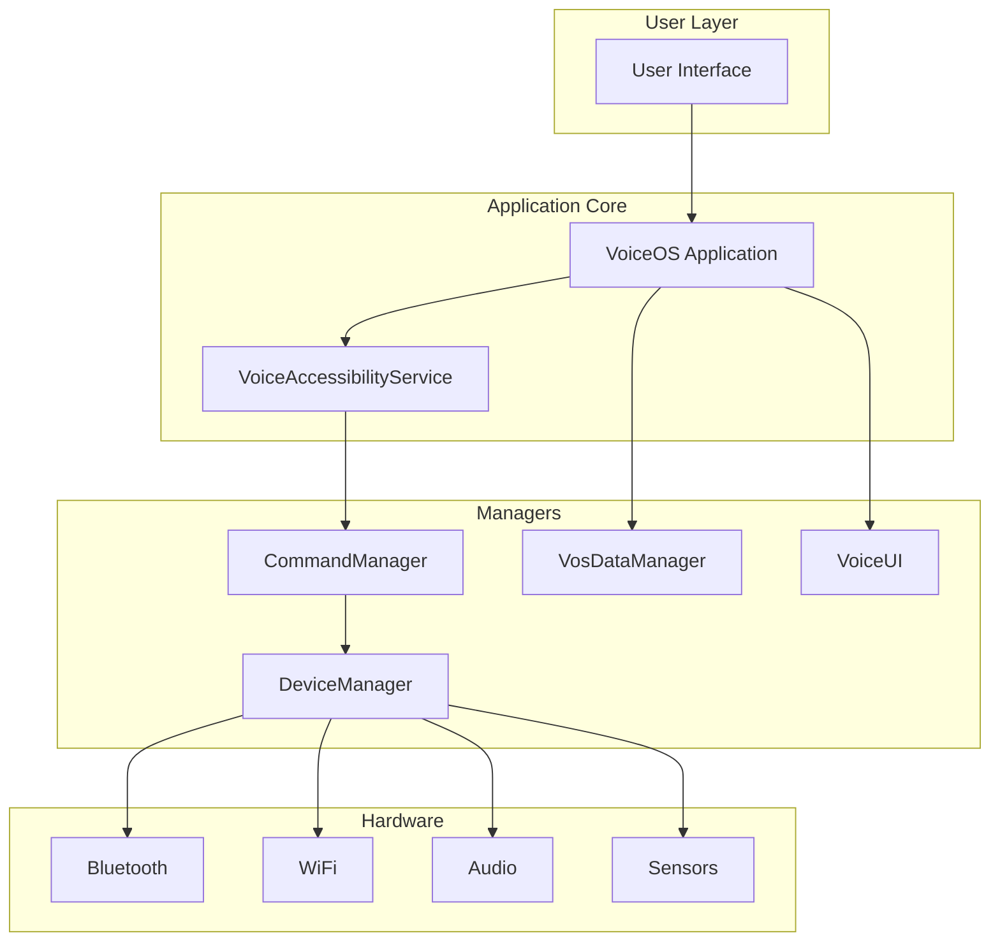
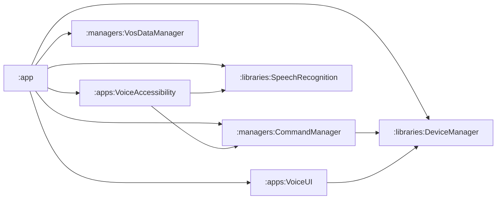

# VOS4 Architecture Guide
## Zero-Overhead Voice Operating System Architecture
**Version**: 4.0.0  
**Last Updated**: 2025-01-30  
**Author**: VOS4 Development Team

---

## Table of Contents

1. [Architecture Overview](#architecture-overview)
2. [Core Principles](#core-principles)
3. [System Architecture](#system-architecture)
4. [Module Architecture](#module-architecture)
5. [Communication Patterns](#communication-patterns)
6. [State Management](#state-management)
7. [Performance Architecture](#performance-architecture)
8. [Security Architecture](#security-architecture)
9. [Deployment Architecture](#deployment-architecture)
10. [Evolution & Migration](#evolution--migration)

---

## Architecture Overview

VOS4 implements a **Zero-Overhead Architecture** designed for maximum performance and minimal resource usage. The system eliminates unnecessary abstraction layers, interfaces, and wrapper classes in favor of direct implementation patterns.

### Key Architectural Decisions

1. **No CoreManager Pattern**: Direct module access instead of centralized management
2. **No Interfaces**: Direct class implementation for zero virtual dispatch overhead
3. **Functional Types**: Type aliases instead of interface callbacks
4. **Lazy Initialization**: Components loaded only when needed
5. **Single Source of Truth**: Each module owns its domain completely

### Architecture Goals

- **Performance**: <100ms command response, <2% idle CPU
- **Memory**: <15MB idle footprint
- **Scalability**: Support for 500+ commands
- **Maintainability**: Clear module boundaries
- **Testability**: Direct testing without mocks

---

## Core Principles

### 1. Zero-Overhead Principle
```kotlin
// ❌ AVOID: Interface overhead
interface Manager {
    fun process()
}
class ManagerImpl : Manager {
    override fun process() { }
}

// ✅ PREFER: Direct implementation
class Manager {
    fun process() { }
}
```

**Rationale**: Interfaces add virtual dispatch overhead and complicate the codebase without providing value in a single-implementation scenario.

### 2. Direct Access Pattern
```kotlin
// ❌ AVOID: Centralized access
class CoreManager {
    private val deviceManager = DeviceManager()
    fun getDeviceManager() = deviceManager
}

// ✅ PREFER: Direct module access
class VoiceOS : Application() {
    val deviceManager = DeviceManager.getInstance(this)
}
```

**Rationale**: Eliminates unnecessary indirection and improves code clarity.

### 3. Functional Programming
```kotlin
// ❌ AVOID: Class-based callbacks
interface Callback {
    fun onResult(result: String)
    fun onError(error: Exception)
}

// ✅ PREFER: Functional types
typealias OnResult = (String) -> Unit
typealias OnError = (Exception) -> Unit
```

**Rationale**: Reduces boilerplate and enables more flexible composition.

### 4. Lazy Loading
```kotlin
class DeviceManager {
    // Only initialized when first accessed
    val bluetooth by lazy { BluetoothManager(context) }
    val wifi by lazy { WiFiManager(context) }
}
```

**Rationale**: Improves startup time and reduces memory usage.

### 5. Single Responsibility
Each module has a clear, single responsibility:
- **DeviceManager**: Hardware control
- **CommandManager**: Command processing
- **VosDataManager**: Data persistence
- **VoiceUI**: User interface
- **SpeechRecognition**: Speech processing

---

## System Architecture

### High-Level Architecture
```
┌─────────────────────────────────────────────────────────┐
│                    User Interface Layer                  │
│                  (Activities, Fragments)                 │
└─────────────────────────────────────────────────────────┘
                              │
┌─────────────────────────────────────────────────────────┐
│                   Application Layer                      │
│                    (VoiceOS App Class)                   │
└─────────────────────────────────────────────────────────┘
                              │
┌─────────────────────────────────────────────────────────┐
│                     Service Layer                        │
│          (VoiceAccessibilityService, etc.)              │
└─────────────────────────────────────────────────────────┘
                              │
┌─────────────────────────────────────────────────────────┐
│                     Module Layer                         │
│   ┌──────────┐ ┌──────────┐ ┌──────────┐ ┌──────────┐ │
│   │  Device  │ │ Command  │ │   Data   │ │  Voice   │ │
│   │ Manager  │ │ Manager  │ │ Manager  │ │    UI    │ │
│   └──────────┘ └──────────┘ └──────────┘ └──────────┘ │
└─────────────────────────────────────────────────────────┘
                              │
┌─────────────────────────────────────────────────────────┐
│                    Hardware Layer                        │
│              (Android APIs, Device Drivers)              │
└─────────────────────────────────────────────────────────┘
```

### Component Relationships


---

## Module Architecture

### Module Structure
```
VOS4/
├── app/                        # Main application
│   └── VoiceOS.kt             # Application class
├── apps/                       # Standalone apps
│   ├── VoiceAccessibility/    # Accessibility service
│   ├── VoiceUI/              # UI components
│   └── VoiceCursor/          # Cursor control
├── libraries/                  # Shared libraries
│   ├── DeviceManager/         # Hardware abstraction
│   ├── SpeechRecognition/     # Speech engines
│   └── VoiceUIElements/       # UI elements
└── managers/                   # System managers
    ├── CommandManager/        # Command processing
    ├── VosDataManager/        # Data persistence
    └── LocalizationManager/   # Localization
```

### Module Independence
Each module is designed to be:
- **Self-contained**: No external dependencies except Android SDK
- **Independently testable**: Can be tested in isolation
- **Version independent**: Can be updated separately
- **Lazy loadable**: Initialized only when needed

### Module Communication Rules
1. **No circular dependencies**: Modules cannot depend on each other circularly
2. **Direct access only**: No message passing or event bus between modules
3. **Shared state via Flow**: Use Kotlin Flow for reactive state
4. **No global state**: Each module manages its own state

---

## Communication Patterns

### Direct Method Calls
```kotlin
// Direct communication between modules
class CommandManager(context: Context) {
    private val deviceManager = DeviceManager.getInstance(context)
    
    fun executeHardwareCommand(command: String) {
        when (command) {
            "bluetooth on" -> deviceManager.bluetooth.enable()
            "wifi scan" -> deviceManager.wifi.startScan()
        }
    }
}
```

### State Observation
```kotlin
// Reactive state observation
class AccessibilityService : AccessibilityService() {
    private val deviceManager = DeviceManager.getInstance(this)
    
    override fun onCreate() {
        // Observe Bluetooth state changes
        deviceManager.bluetooth.bluetoothState
            .onEach { state ->
                handleBluetoothStateChange(state)
            }
            .launchIn(serviceScope)
    }
}
```

### Callback Pattern
```kotlin
// Functional callbacks for async operations
deviceManager.biometric.authenticate(
    title = "Authenticate",
    onSuccess = { 
        // Handle success
    },
    onError = { code, message ->
        // Handle error
    }
)
```

---

## State Management

### StateFlow Pattern
```kotlin
class BluetoothManager {
    private val _state = MutableStateFlow(BluetoothState())
    val state: StateFlow<BluetoothState> = _state.asStateFlow()
    
    fun updateState(block: BluetoothState.() -> BluetoothState) {
        _state.update { it.block() }
    }
}
```

### State Composition
```kotlin
data class DeviceState(
    val bluetooth: BluetoothState,
    val wifi: WifiState,
    val uwb: UwbState,
    val errors: List<Error> = emptyList()
)

// Combine multiple states
val deviceState = combine(
    bluetooth.state,
    wifi.state,
    uwb.state
) { bt, wifi, uwb ->
    DeviceState(bt, wifi, uwb)
}.stateIn(scope, SharingStarted.Eagerly, DeviceState())
```

### State Persistence
```kotlin
class VosDataManager {
    private val prefs = context.getSharedPreferences("vos4", MODE_PRIVATE)
    
    fun saveState(state: AppState) {
        prefs.edit {
            putString("state", Json.encodeToString(state))
        }
    }
    
    fun loadState(): AppState {
        val json = prefs.getString("state", null) ?: return AppState()
        return Json.decodeFromString(json)
    }
}
```

---

## Performance Architecture

### Memory Management
```kotlin
class VoiceAccessibilityService : AccessibilityService() {
    // Use weak references for callbacks
    private var callbackRef: WeakReference<Callback>? = null
    
    // Cache frequently used data
    private val commandCache = LruCache<String, ActionResult>(100)
    
    // Clear resources on destroy
    override fun onDestroy() {
        commandCache.evictAll()
        callbackRef?.clear()
    }
}
```

### Threading Strategy
```kotlin
class DeviceManager {
    // Main thread for UI updates
    private val mainScope = CoroutineScope(Dispatchers.Main + SupervisorJob())
    
    // IO thread for network/disk operations
    private val ioScope = CoroutineScope(Dispatchers.IO + SupervisorJob())
    
    // Default thread for CPU-intensive work
    private val computeScope = CoroutineScope(Dispatchers.Default + SupervisorJob())
    
    fun processCommand(command: String) {
        computeScope.launch {
            val result = parseCommand(command)
            mainScope.launch {
                updateUI(result)
            }
        }
    }
}
```

### Lazy Initialization
```kotlin
class DeviceManager {
    // Managers created only when accessed
    val bluetooth by lazy { 
        Log.d(TAG, "Initializing Bluetooth Manager")
        BluetoothManager(context) 
    }
    
    val wifi by lazy { 
        Log.d(TAG, "Initializing WiFi Manager")
        WiFiManager(context) 
    }
}
```

### Caching Strategy
```kotlin
class CommandProcessor {
    // LRU cache for command results
    private val cache = LruCache<String, ActionResult>(50)
    
    fun process(command: String): ActionResult {
        return cache[command] ?: run {
            val result = executeCommand(command)
            cache.put(command, result)
            result
        }
    }
}
```

---

## Security Architecture

### Permission Management
```kotlin
class PermissionManager {
    private val requiredPermissions = mapOf(
        "bluetooth" to arrayOf(
            BLUETOOTH_SCAN,
            BLUETOOTH_CONNECT,
            BLUETOOTH_ADVERTISE
        ),
        "wifi" to arrayOf(
            ACCESS_FINE_LOCATION,
            CHANGE_WIFI_STATE
        ),
        "audio" to arrayOf(
            RECORD_AUDIO,
            MODIFY_AUDIO_SETTINGS
        )
    )
    
    fun checkPermissions(feature: String): Boolean {
        val permissions = requiredPermissions[feature] ?: return true
        return permissions.all { 
            context.checkSelfPermission(it) == PERMISSION_GRANTED 
        }
    }
}
```

### Data Protection
```kotlin
class SecureDataManager {
    private val masterKey = MasterKey.Builder(context)
        .setKeyScheme(MasterKey.KeyScheme.AES256_GCM)
        .build()
        
    private val encryptedPrefs = EncryptedSharedPreferences.create(
        context,
        "secure_prefs",
        masterKey,
        EncryptedSharedPreferences.PrefKeyEncryptionScheme.AES256_SIV,
        EncryptedSharedPreferences.PrefValueEncryptionScheme.AES256_GCM
    )
    
    fun saveSecureData(key: String, value: String) {
        encryptedPrefs.edit().putString(key, value).apply()
    }
}
```

### Input Validation
```kotlin
class CommandValidator {
    private val commandPattern = Regex("^[a-zA-Z0-9 ]{1,100}$")
    
    fun validate(command: String): ValidationResult {
        return when {
            command.isBlank() -> ValidationResult.Error("Empty command")
            command.length > 100 -> ValidationResult.Error("Command too long")
            !commandPattern.matches(command) -> ValidationResult.Error("Invalid characters")
            else -> ValidationResult.Success
        }
    }
}
```

---

## Deployment Architecture

### Build Configuration
```kotlin
// build.gradle.kts
android {
    buildTypes {
        release {
            isMinifyEnabled = true
            isShrinkResources = true
            proguardFiles("proguard-rules.pro")
        }
        debug {
            isDebuggable = true
            applicationIdSuffix = ".debug"
        }
    }
    
    flavorDimensions += "version"
    productFlavors {
        create("standard") {
            dimension = "version"
        }
        create("pro") {
            dimension = "version"
            applicationIdSuffix = ".pro"
        }
    }
}
```

### Module Dependencies


### Release Strategy
1. **Modular Updates**: Each module can be updated independently
2. **Backward Compatibility**: Maintain API compatibility
3. **Feature Flags**: Control feature rollout
4. **A/B Testing**: Test new features with subset of users

---

## Evolution & Migration

### From VOS3 to VOS4
```kotlin
// VOS3 - CoreManager pattern
class VOS3App {
    val coreManager = CoreManager()
    val deviceManager = coreManager.getDeviceManager()
}

// VOS4 - Direct access pattern
class VOS4App {
    val deviceManager = DeviceManager.getInstance(this)
}
```

### Migration Path
1. **Phase 1**: Remove CoreManager, implement direct access
2. **Phase 2**: Replace interfaces with direct implementations
3. **Phase 3**: Convert callbacks to functional types
4. **Phase 4**: Implement lazy loading
5. **Phase 5**: Optimize state management with StateFlow

### Future Architecture Considerations

#### Planned Enhancements
- **Modular Plugin System**: Dynamic feature loading
- **Remote Configuration**: Cloud-based settings
- **Multi-Device Sync**: Cross-device state synchronization
- **AI Integration**: On-device ML models

#### Architecture Principles to Maintain
1. Zero-overhead remains paramount
2. Direct access over abstraction
3. Functional over object-oriented where appropriate
4. Performance metrics guide decisions
5. Simplicity over complexity

---

## Performance Metrics

### Target Metrics
- **Startup Time**: < 1 second
- **Command Response**: < 100ms
- **Memory Usage**: < 15MB idle, < 50MB active
- **CPU Usage**: < 2% idle, < 10% active
- **Battery Impact**: < 1% per hour

### Monitoring
```kotlin
class PerformanceMonitor {
    fun measureCommandExecution(command: String): Long {
        val start = System.nanoTime()
        executeCommand(command)
        val duration = (System.nanoTime() - start) / 1_000_000
        
        if (duration > THRESHOLD_MS) {
            Log.w(TAG, "Slow command: $command took ${duration}ms")
        }
        
        return duration
    }
}
```

---

## Best Practices

### Do's
- ✅ Use direct class implementation
- ✅ Implement lazy initialization
- ✅ Use functional types for callbacks
- ✅ Manage state with StateFlow
- ✅ Cache frequently accessed data
- ✅ Clear resources properly

### Don'ts
- ❌ Don't create unnecessary interfaces
- ❌ Don't use abstract base classes without need
- ❌ Don't implement message passing between modules
- ❌ Don't create global state
- ❌ Don't use reflection
- ❌ Don't ignore performance metrics

---

## Conclusion

VOS4's Zero-Overhead Architecture represents a paradigm shift from traditional Android architecture patterns. By eliminating unnecessary abstraction layers and focusing on direct implementation, we achieve superior performance while maintaining code clarity and maintainability.

The architecture is designed to evolve with Android platform capabilities while maintaining backward compatibility and performance guarantees. Each architectural decision is driven by measurable performance improvements and real-world usage patterns.

---

## References

- [Android Performance Best Practices](https://developer.android.com/topic/performance)
- [Kotlin Coroutines Guide](https://kotlinlang.org/docs/coroutines-guide.html)
- [Android Architecture Components](https://developer.android.com/topic/libraries/architecture)

---

## License

Copyright (C) 2025 Manoj Jhawar/Aman Jhawar, Intelligent Devices LLC  
All rights reserved. Proprietary and confidential.
