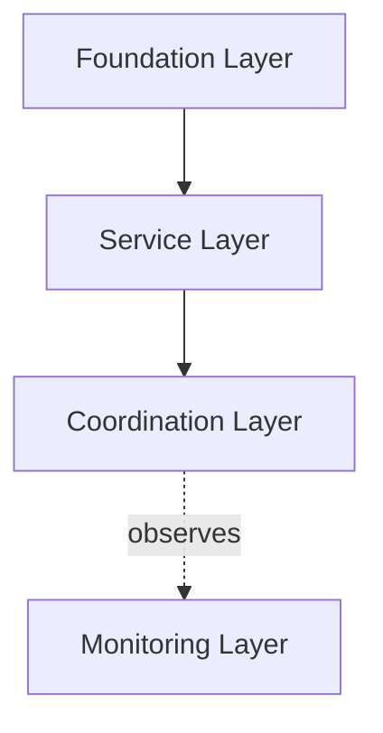
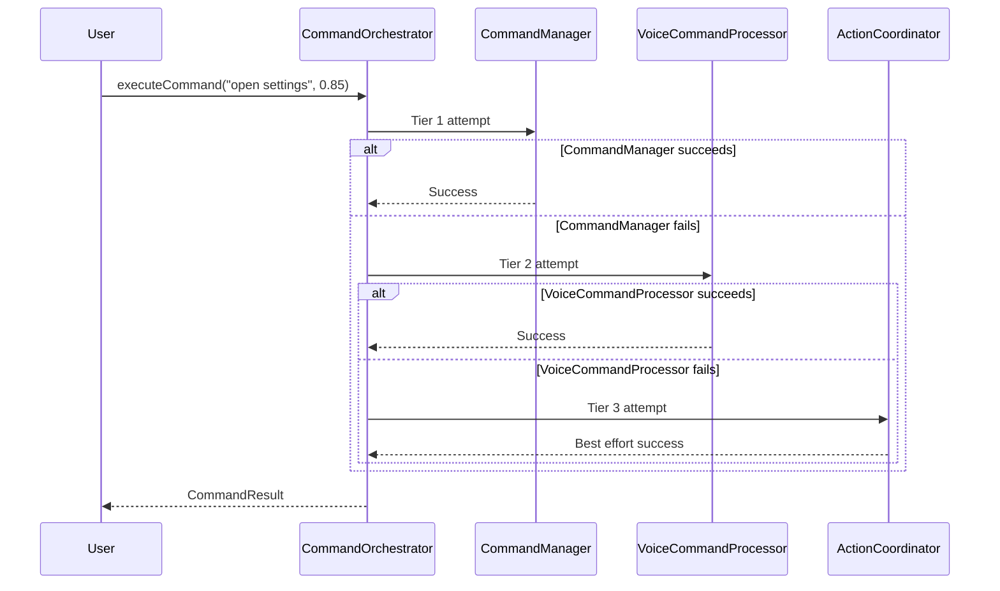

# VoiceOSService SOLID Refactoring - Master Plan

**Created:** 2025-10-15 08:57 PDT
**Branch:** voiceosservice-refactor
**Status:** Week 3 Complete, Starting Compilation Phase
**Approach:** Do it properly - no time constraints, document everything

---

## Overview

This refactoring transforms VoiceOSService.kt (1,385 lines) into a clean SOLID architecture through 5 phases:

- **Week 1-3:** ✅ Foundation + 7 SOLID implementations (COMPLETE - 5,764 LOC)
- **Week 3 Completion:** 🔴 Compilation + Critical Fixes (CURRENT)
- **Phase 2:** Cleanup & Bloat Removal (~2,000 line reduction)
- **Phase 3:** Further Decomposition (7 → 20 classes)
- **Week 4:** Integration + Validation + Rollout

**Current Status:** All code written, NOT YET COMPILED

---

## WEEK 3 COMPLETION - Days 18-20 (CURRENT PHASE)

### Priority 1: Compilation & Critical Fixes (Day 18)

#### ☐ Task 1.1: Initial Compilation Attempt (15 min)
**What:** Compile all 7 implementations to identify errors
**Why:** Can't proceed without successful compilation
**Status:** 🔴 IN PROGRESS

**Command:**
```bash
cd "/Volumes/M Drive/Coding/vos4"
./gradlew :modules:apps:VoiceOSCore:compileDebugKotlin --no-daemon 2>&1 | tee compile-log-251015.txt
```

**Expected Output:**
- Compilation log file: `compile-log-251015.txt`
- Error count: 5-20 errors (imports, types, packages)
- Error categories: Missing imports, type mismatches, Hilt config

**Documentation:**
- [ ] Save compilation log
- [ ] Create error categorization document
- [ ] Document each error with fix approach

---

#### ☐ Task 1.2: Fix Compilation Errors (4-8 hours)
**What:** Fix all syntax/import/type errors
**Why:** Code must compile before testing
**Status:** ⏳ PENDING

**Error Categories to Fix:**

**1. Missing Imports (Expected: 5-10 errors)**
```kotlin
// Error: Unresolved reference: VoiceOSService
// Fix: Add import
import com.augmentalis.voiceaccessibility.VoiceOSService
```

**2. Type Mismatches (Expected: 2-5 errors)**
```kotlin
// Error: Type mismatch: inferred type is X but Y was expected
// Fix: Add type casting or conversion
```

**3. Package Name Issues (Expected: 2-3 errors)**
```kotlin
// Error: Package name doesn't match directory structure
// Fix: Update package declaration or file location
```

**4. Hilt Configuration (Expected: 1-2 errors)**
```kotlin
// Error: No @Inject constructor found
// Fix: Add @Inject to constructor
```

**Process:**
1. Read first error in compile-log-251015.txt
2. Open file with error
3. Fix error with proper imports/types
4. Recompile to verify fix
5. Document fix in error-fixes-log-251015.txt
6. Repeat until clean build

**Documentation Required:**
- [ ] Error-fixes-log-251015.txt (each error + solution)
- [ ] Import-mapping-251015.md (class → package mappings)
- [ ] Type-conversion-notes-251015.md (any type conversions needed)

---

#### ☐ Task 1.3: Fix Critical Code Issues (2 hours)
**What:** Fix 3 identified critical issues
**Why:** Prevent runtime failures
**Status:** ⏳ PENDING

**Issue 1: DatabaseManagerImpl Constructor**
**File:** `DatabaseManagerImpl.kt` line ~50
**Severity:** 🔴 HIGH - Hilt won't inject

**Current:**
```kotlin
class DatabaseManagerImpl(
    private val appContext: Context,
    private val config: DatabaseManagerConfig = DatabaseManagerConfig.DEFAULT
) : IDatabaseManager
```

**Fix:**
```kotlin
@Singleton
class DatabaseManagerImpl @Inject constructor(
    @ApplicationContext private val context: Context
) : IDatabaseManager {
    private val config: DatabaseManagerConfig = DatabaseManagerConfig.DEFAULT
}
```

**Documentation:**
- [ ] Document why default parameters don't work with Hilt
- [ ] Add diagram showing Hilt injection flow

---

**Issue 2: Add Command Timeouts**
**File:** `CommandOrchestratorImpl.kt` lines ~436, ~492, ~537
**Severity:** ⚠️ MEDIUM - Commands could hang

**Current:**
```kotlin
private suspend fun executeTier1(...): CommandResult {
    return try {
        val cmd = Command(...)
        commandManager!!.executeCommand(cmd)  // NO TIMEOUT
    } catch (e: Exception) { ... }
}
```

**Fix:**
```kotlin
private suspend fun executeTier1(...): CommandResult {
    return try {
        withTimeoutOrNull(COMMAND_TIMEOUT_MS) {
            val cmd = Command(...)
            commandManager!!.executeCommand(cmd)
        } ?: CommandResult.Failure(
            tier = 1,
            reason = "Command execution timeout (${COMMAND_TIMEOUT_MS}ms)"
        )
    } catch (e: Exception) { ... }
}
```

**Apply to:** executeTier1(), executeTier2(), executeTier3()

**Documentation:**
- [ ] Document timeout values (5000ms default)
- [ ] Add sequence diagram showing timeout flow
- [ ] Document timeout handling strategy

---

**Issue 3: Validate Class References**
**Files:** All 10 health checker files in ServiceMonitorImpl
**Severity:** ⚠️ MEDIUM - Runtime ClassNotFoundException

**Validation Needed:**
```bash
# Find actual VoiceOSService location
find "/Volumes/M Drive/Coding/vos4" -name "VoiceOSService.kt" -type f
grep "^package " <path-from-above>
```

**If package is `com.augmentalis.voiceaccessibility`:**

Update all health checker imports:
```kotlin
// FROM:
import com.augmentalis.voiceoscore.accessibility.VoiceOSService

// TO:
import com.augmentalis.voiceaccessibility.VoiceOSService
```

**Files to check:**
- AccessibilityServiceHealthChecker.kt
- CommandManagerHealthChecker.kt
- SpeechEngineHealthChecker.kt
- UIScrapingHealthChecker.kt
- DatabaseHealthChecker.kt
- CursorApiHealthChecker.kt
- LearnAppHealthChecker.kt
- WebCoordinatorHealthChecker.kt
- EventRouterHealthChecker.kt
- StateManagerHealthChecker.kt

**Documentation:**
- [ ] Create package-mapping-251015.md with all class locations
- [ ] Document import resolution strategy
- [ ] Add dependency diagram showing all references

---

### Priority 2: Test Suite Completion (Days 19-20)

#### ☐ Task 2.1: Create DatabaseManager Tests (Day 19 - 6 hours)
**What:** Create 80 comprehensive tests for DatabaseManager
**Why:** Currently 0% test coverage for critical caching layer
**Status:** ⏳ PENDING

**File to Create:** `DatabaseManagerImplTest.kt`

**Test Categories (80 tests total):**

**1. Initialization (10 tests)**
```kotlin
@Test fun `initialize should setup all 3 databases`()
@Test fun `initialize should verify database health`()
@Test fun `initialize should fail if database inaccessible`()
@Test fun `initialize should load cache configuration`()
@Test fun `initialize should setup TTL timers`()
@Test fun `initialize should register health monitors`()
@Test fun `double initialization should throw exception`()
@Test fun `initialize with invalid config should fail`()
@Test fun `initialize should emit ready event`()
@Test fun `initialize should track initialization time`()
```

**2. Command Operations (15 tests)**
```kotlin
@Test fun `getAllCommands should return cached commands within TTL`()
@Test fun `getAllCommands should query database after TTL expiry`()
@Test fun `getAllCommands should track cache hit rate`()
@Test fun `searchVoiceCommands should use cache when available`()
@Test fun `searchVoiceCommands should handle empty results`()
@Test fun `saveVoiceCommand should invalidate cache`()
@Test fun `deleteVoiceCommand should update cache`()
@Test fun `bulkInsert commands should complete under 200ms for 100 items`()
@Test fun `concurrent command queries should not corrupt cache`()
@Test fun `command cache should evict oldest entries when full`()
// ... 5 more
```

**3. Caching Layer (20 tests)**
```kotlin
@Test fun `cache should achieve 80% hit rate under load`()
@Test fun `LRU cache should evict oldest entries first`()
@Test fun `TTL cache should expire after configured time`()
@Test fun `cache clear should remove all entries`()
@Test fun `cache should handle concurrent access safely`()
@Test fun `cache metrics should track hits and misses accurately`()
// ... 14 more
```

**4. Transaction Safety (15 tests)**
```kotlin
@Test fun `transaction should rollback on error`()
@Test fun `concurrent transactions should not corrupt data`()
@Test fun `transaction should commit on success`()
@Test fun `nested transactions should work correctly`()
// ... 11 more
```

**5. Health Monitoring (10 tests)**
```kotlin
@Test fun `checkDatabaseHealth should detect corrupt database`()
@Test fun `checkDatabaseHealth should measure query time`()
@Test fun `optimize should reduce database size`()
// ... 7 more
```

**6. Batch Operations (10 tests)**
```kotlin
@Test fun `bulkInsert should complete in under 200ms for 100 items`()
@Test fun `bulkInsert should use transaction`()
@Test fun `bulkInsert should rollback on error`()
// ... 7 more
```

**Documentation Required:**
- [ ] DatabaseManager-Test-Plan-251015.md
- [ ] Cache-Validation-Strategy-251015.md
- [ ] Test coverage report (aim for >80%)
- [ ] Performance test results (cache hit rate, query times)

---

#### ☐ Task 2.2: Complete CommandOrchestrator Tests (Day 19 - 2 hours)
**What:** Add 30 missing tests to CommandOrchestrator
**Why:** Currently 66% coverage (60/90 tests)
**Status:** ⏳ PENDING

**File to Update:** `CommandOrchestratorImplTest.kt`

**Missing Test Categories:**

**1. Global Actions (10 tests)**
```kotlin
@Test fun `executeGlobalAction should return true for BACK action`()
@Test fun `executeGlobalAction should return true for HOME action`()
@Test fun `executeGlobalAction should return false when service unavailable`()
@Test fun `executeGlobalAction should handle exceptions gracefully`()
// ... 6 more
```

**2. Command Registration (10 tests)**
```kotlin
@Test fun `registerCommands should add commands to cache`()
@Test fun `registerCommands should update speech vocabulary`()
@Test fun `registerCommands should track total count`()
@Test fun `registerCommands should deduplicate commands`()
// ... 6 more
```

**3. Concurrency (10 tests)**
```kotlin
@Test fun `concurrent command execution should be thread-safe`() = runTest {
    val jobs = (1..2000).map { i ->
        launch { orchestrator.executeCommand("test $i", 0.8f, context) }
    }
    jobs.joinAll()

    val metrics = orchestrator.getMetrics()
    assertEquals(2000, metrics.totalCommandsExecuted)
}

@Test fun `concurrent vocabulary updates should not corrupt state`()
@Test fun `high load should not cause deadlocks`()
// ... 7 more
```

**Documentation Required:**
- [ ] CommandOrchestrator-Test-Coverage-251015.md
- [ ] Concurrency-Test-Results-251015.md
- [ ] Load test results (2000 concurrent commands)

---

#### ☐ Task 2.3: Create ServiceMonitor Tests (Day 20 - 8 hours)
**What:** Create 80 comprehensive tests for ServiceMonitor
**Why:** Currently 0% test coverage for monitoring layer
**Status:** ⏳ PENDING

**Files to Create:**

**1. ServiceMonitorImplTest.kt (30 tests)**
```kotlin
@Test fun `initialize should setup all health checkers`()
@Test fun `performHealthCheck should complete in under 500ms`()
@Test fun `parallel health checks should check all 10 components`()
@Test fun `health status should aggregate component health correctly`()
@Test fun `recovery should trigger for unhealthy components`()
@Test fun `metrics collection should not block health checks`()
// ... 24 more
```

**2. Health Checker Tests (40 tests = 10 checkers × 4 tests each)**

For each of 10 health checkers:
```kotlin
// AccessibilityServiceHealthCheckerTest.kt (4 tests)
@Test fun `checkHealth should return HEALTHY when service running`()
@Test fun `checkHealth should return CRITICAL when service null`()
@Test fun `checkHealth should return UNHEALTHY when service not running`()
@Test fun `checkHealth should return DEGRADED when no active window`()
```

**Repeat for:**
- SpeechEngineHealthChecker
- CommandManagerHealthChecker
- UIScrapingHealthChecker
- DatabaseHealthChecker
- CursorApiHealthChecker
- LearnAppHealthChecker
- WebCoordinatorHealthChecker
- EventRouterHealthChecker
- StateManagerHealthChecker

**3. Integration Tests (10 tests)**
```kotlin
@Test fun `serviceMonitor should detect component failure and trigger recovery`()
@Test fun `serviceMonitor should track metrics without blocking execution`()
@Test fun `serviceMonitor should generate alerts for threshold violations`()
@Test fun `serviceMonitor should handle multiple simultaneous failures`()
// ... 6 more
```

**Documentation Required:**
- [ ] ServiceMonitor-Test-Plan-251015.md
- [ ] Health-Check-Validation-251015.md
- [ ] Recovery-Strategy-Tests-251015.md
- [ ] Integration test results

---

### Priority 3: Documentation Creation

#### ☐ Task 3.1: Create Architecture Diagrams
**What:** Visual documentation of all flows and interactions
**Why:** Essential for understanding system behavior
**Status:** ⏳ PENDING

**Diagrams to Create:**

**1. Component Dependency Diagram**


**File:** `VoiceOSService-Component-Dependencies-251015.md`

**2. 3-Tier Command Execution Flow**


**File:** `VoiceOSService-Command-Execution-Flow-251015.md`

**3. Event Routing Flow**
**File:** `VoiceOSService-Event-Routing-Flow-251015.md`

**4. Health Monitoring Flow**
**File:** `VoiceOSService-Health-Monitoring-Flow-251015.md`

**5. Database Caching Flow**
**File:** `VoiceOSService-Database-Caching-Flow-251015.md`

**6. Speech Engine Fallback Flow**
**File:** `VoiceOSService-Speech-Engine-Fallback-251015.md`

**7. UI Scraping Background Processing Flow**
**File:** `VoiceOSService-UI-Scraping-Flow-251015.md`

---

#### ☐ Task 3.2: Create Implementation Summary Documents
**What:** Detailed documentation for each implementation
**Status:** ⏳ PENDING

**Documents to Create:**

1. **StateManager-Implementation-Guide-251015.md**
   - Purpose and responsibilities
   - State variables managed
   - Thread safety mechanisms
   - Usage examples
   - Performance characteristics

2. **DatabaseManager-Implementation-Guide-251015.md**
   - 4-layer cache architecture
   - Database operations
   - Transaction management
   - Performance optimization strategies

3. **SpeechManager-Implementation-Guide-251015.md**
   - 3-engine coordination
   - Fallback strategy
   - Vocabulary management
   - Engine health tracking

4. **UIScrapingService-Implementation-Guide-251015.md**
   - Background processing approach
   - Incremental scraping
   - Cache management
   - ANR prevention strategy

5. **EventRouter-Implementation-Guide-251015.md**
   - Priority routing
   - Debouncing strategy
   - Burst detection
   - Backpressure handling

6. **CommandOrchestrator-Implementation-Guide-251015.md**
   - 3-tier execution strategy
   - Fallback mode
   - Vocabulary management
   - Functional equivalence validation

7. **ServiceMonitor-Implementation-Guide-251015.md**
   - Zero-dependency observation pattern
   - Parallel health checks
   - Recovery strategies
   - Alert management

---

## PHASE 2: CLEANUP & BLOAT REMOVAL (Week 4 - 3 days)

**Goal:** Reduce codebase from 5,764 LOC to ~3,700 LOC (~2,000 line reduction)

### Priority 1: Extract Base Classes

#### ☐ Task 4.1: Create ManagedComponent Base Class (4 hours)
**What:** Extract common lifecycle management to base class
**Why:** Eliminates 500+ lines of duplicated code
**Status:** ⏳ PENDING

**New File:** `ManagedComponent.kt` (~150 lines)

```kotlin
/**
 * Base class for all SOLID components with common lifecycle management
 *
 * Provides:
 * - State management (UNINITIALIZED → INITIALIZING → READY → PAUSED → SHUTDOWN → ERROR)
 * - Lifecycle methods (initialize, pause, resume, cleanup)
 * - State validation
 * - Error handling
 */
abstract class ManagedComponent<TConfig, TState : ComponentState> {
    protected val _currentState = MutableStateFlow<TState>(getInitialState())
    val currentState: TState get() = _currentState.value

    protected val _isReady = MutableStateFlow(false)
    val isReady: Boolean get() = _isReady.value

    /**
     * Initialize component with configuration
     */
    suspend fun initialize(context: Context, config: TConfig) {
        validateState(ComponentState.UNINITIALIZED, "Already initialized")
        _currentState.value = getInitializingState()

        try {
            doInitialize(context, config)
            _currentState.value = getReadyState()
            _isReady.value = true
        } catch (e: Exception) {
            _currentState.value = getErrorState()
            _isReady.value = false
            throw e
        }
    }

    protected abstract suspend fun doInitialize(context: Context, config: TConfig)
    protected abstract fun getInitialState(): TState
    protected abstract fun getInitializingState(): TState
    protected abstract fun getReadyState(): TState
    protected abstract fun getErrorState(): TState

    // Similar for pause(), resume(), cleanup()
}
```

**Refactor All 7 Implementations:**

**Before (StateManagerImpl.kt):**
```kotlin
@Singleton
class StateManagerImpl @Inject constructor() : IStateManager {
    private val _currentState = MutableStateFlow(StateManagerState.UNINITIALIZED)
    override val currentState: StateManagerState get() = _currentState.value

    override suspend fun initialize(context: Context, config: StateConfig) {
        if (_currentState.value != StateManagerState.UNINITIALIZED) {
            throw IllegalStateException("Already initialized")
        }
        _currentState.value = StateManagerState.INITIALIZING
        try {
            // ... actual initialization
            _currentState.value = StateManagerState.READY
        } catch (e: Exception) {
            _currentState.value = StateManagerState.ERROR
            throw e
        }
    }
    // ... 50+ more lines of lifecycle code
}
```

**After:**
```kotlin
@Singleton
class StateManagerImpl @Inject constructor() :
    ManagedComponent<StateConfig, StateManagerState>(),
    IStateManager {

    override suspend fun doInitialize(context: Context, config: StateConfig) {
        // ONLY custom initialization logic here (10-20 lines)
        initializeStateVariables()
        initializeObservers()
    }

    override fun getInitialState() = StateManagerState.UNINITIALIZED
    override fun getInitializingState() = StateManagerState.INITIALIZING
    override fun getReadyState() = StateManagerState.READY
    override fun getErrorState() = StateManagerState.ERROR

    // Rest of StateManager-specific code
}
```

**Savings:** 70 lines × 7 classes = **~500 lines**

**Documentation:**
- [ ] ManagedComponent-Design-251015.md (architecture pattern)
- [ ] ManagedComponent-Usage-Guide-251015.md (how to extend)
- [ ] Lifecycle-State-Diagram-251015.md (state transitions)
- [ ] Migration guide for each component

---

#### ☐ Task 4.2: Extract ComponentMetricsCollector (6 hours)
**What:** Create shared metrics tracking for all components
**Why:** Eliminates 800+ lines of duplicated metrics code
**Status:** ⏳ PENDING

**New File:** `ComponentMetricsCollector.kt` (~200 lines)

```kotlin
/**
 * Centralized metrics tracking for all SOLID components
 *
 * Provides:
 * - Operation counters (total, success, failure)
 * - Timing metrics (P50, P95, P99 latencies)
 * - Error tracking
 * - History management
 */
@Singleton
class ComponentMetricsCollector @Inject constructor() {
    private val componentMetrics = ConcurrentHashMap<String, ComponentMetrics>()

    /**
     * Track operation execution
     */
    fun trackOperation(
        component: String,
        operation: String,
        durationMs: Long,
        success: Boolean,
        error: Throwable? = null
    ) {
        val metrics = componentMetrics.getOrPut(component) { ComponentMetrics(component) }
        metrics.recordOperation(operation, durationMs, success, error)
    }

    /**
     * Get metrics for component
     */
    fun getMetrics(component: String): ComponentMetrics? {
        return componentMetrics[component]
    }

    /**
     * Get all component metrics
     */
    fun getAllMetrics(): Map<String, ComponentMetrics> {
        return componentMetrics.toMap()
    }
}

data class ComponentMetrics(
    val componentName: String,
    val totalOperations: AtomicLong = AtomicLong(0),
    val successfulOperations: AtomicLong = AtomicLong(0),
    val failedOperations: AtomicLong = AtomicLong(0),
    val operationTimings: ConcurrentHashMap<String, OperationTimings> = ConcurrentHashMap()
) {
    fun recordOperation(operation: String, durationMs: Long, success: Boolean, error: Throwable?) {
        totalOperations.incrementAndGet()
        if (success) successfulOperations.incrementAndGet() else failedOperations.incrementAndGet()

        val timings = operationTimings.getOrPut(operation) { OperationTimings(operation) }
        timings.recordTiming(durationMs)
    }
}
```

**Refactor All 7 Implementations:**

**Before (CommandOrchestratorImpl.kt):**
```kotlin
class CommandOrchestratorImpl {
    // 150+ lines of metrics code
    private val totalCommandsExecuted = AtomicLong(0)
    private val tier1SuccessCount = AtomicLong(0)
    private val tier2SuccessCount = AtomicLong(0)
    private val failureCount = AtomicLong(0)
    private val executionTimes = ConcurrentHashMap<Int, MutableList<Long>>()

    override fun getMetrics(): CommandMetrics {
        // 50+ lines of metrics calculation
    }
}
```

**After:**
```kotlin
@Singleton
class CommandOrchestratorImpl @Inject constructor(
    private val metrics: ComponentMetricsCollector
) {
    // NO metrics code - delegate to collector

    override suspend fun executeCommand(...): CommandResult {
        val startTime = System.currentTimeMillis()
        val result = try {
            // ... execution
        } finally {
            metrics.trackOperation(
                component = "CommandOrchestrator",
                operation = "executeCommand",
                durationMs = System.currentTimeMillis() - startTime,
                success = result is CommandResult.Success
            )
        }
        return result
    }

    override fun getMetrics(): CommandMetrics {
        return metrics.getMetrics("CommandOrchestrator")?.toCommandMetrics()
            ?: CommandMetrics.EMPTY
    }
}
```

**Savings:** 120 lines × 7 classes = **~840 lines**

**Documentation:**
- [ ] ComponentMetricsCollector-Design-251015.md
- [ ] Metrics-Collection-Strategy-251015.md
- [ ] Metrics-API-Reference-251015.md
- [ ] Migration guide for each component

---

#### ☐ Task 4.3: Simplify Event Systems (4 hours)
**What:** Reduce event types from 10-15 to 3-5 per component
**Why:** Eliminates 400+ lines of excessive event definitions
**Status:** ⏳ PENDING

**Strategy:** Keep only essential events

**Before (CommandOrchestratorImpl.kt):**
```kotlin
sealed class CommandEvent {
    data class ExecutionStarted(val command: String, val timestamp: Long)
    data class ExecutionCompleted(val command: String, val result: CommandResult, val timestamp: Long)
    data class TierFallback(val fromTier: Int, val toTier: Int, val reason: String)
    data class FallbackModeChanged(val enabled: Boolean, val reason: String)
    data class VocabularyUpdated(val commandCount: Int)
    data class RegistrationCompleted(val count: Int)
    data class Error(val message: String, val error: Throwable?)
    // ... 10 more event types
}
```

**After:**
```kotlin
sealed class CommandEvent {
    data class Executed(val command: String, val result: CommandResult, val durationMs: Long)
    data class Failed(val command: String, val error: Throwable, val tier: Int?)
    data class StateChanged(val state: CommandOrchestratorState)
}
```

**Apply to all 7 components**

**Savings:** 60 lines × 7 classes = **~420 lines**

**Documentation:**
- [ ] Event-System-Simplification-251015.md
- [ ] Event-Migration-Guide-251015.md
- [ ] Essential-Events-Rationale-251015.md

---

#### ☐ Task 4.4: Remove Redundant Documentation (2 hours)
**What:** Condense excessive KDoc to essential information
**Why:** ~300 lines of over-documentation
**Status:** ⏳ PENDING

**Before:**
```kotlin
/**
 * Execute a voice command through the three-tier system
 *
 * COT: This matches VoiceOSService.handleVoiceCommand() + handleRegularCommand()
 * at lines 973-1011 and 1016-1066.
 *
 * Execution flow:
 * 1. Validate confidence (>= 0.5)
 * 2. Try Tier 1 (CommandManager) if not in fallback mode
 * 3. Try Tier 2 (VoiceCommandProcessor) if Tier 1 fails
 * 4. Try Tier 3 (ActionCoordinator) as final fallback
 *
 * Thread Safety: Uses Mutex for history, StateFlow for state
 * Performance: <50ms typical, <100ms P95
 *
 * @param command Voice command text (normalized)
 * @param confidence Recognition confidence score (0.0 to 1.0)
 * @param context Current command context (app, state, etc.)
 * @return Command execution result
 * @throws IllegalStateException if orchestrator not ready
 */
```

**After:**
```kotlin
/**
 * Execute command through 3-tier system: CommandManager → VoiceCommandProcessor → ActionCoordinator
 *
 * @param command Normalized command text
 * @param confidence Recognition confidence (0.0-1.0, min 0.5)
 * @param context Command context
 * @return Execution result
 */
```

**Savings:** ~300 lines across all files

**Documentation:**
- [ ] Documentation-Standards-251015.md (what to keep, what to remove)
- [ ] KDoc-Best-Practices-251015.md

---

### Phase 2 Summary

**Total Reduction:** ~2,060 lines

| Task | Savings | Files Affected |
|------|---------|----------------|
| Base Classes | 500 lines | 7 implementations |
| Metrics Extraction | 840 lines | 7 implementations |
| Event Simplification | 420 lines | 7 implementations |
| Documentation Cleanup | 300 lines | All files |
| **TOTAL** | **2,060 lines** | **All files** |

**New Files Created:**
- ManagedComponent.kt (~150 lines)
- ComponentMetricsCollector.kt (~200 lines)
- ComponentMetrics.kt (~100 lines)

**Net Reduction:** 2,060 - 450 = **~1,610 lines**

**Result:** 5,764 LOC → ~4,154 LOC

---

## PHASE 3: FURTHER DECOMPOSITION (Week 5 - 5 days)

**Goal:** Split large implementations into focused classes (7 classes → 20 classes)
**Target:** All classes <300 lines, true single responsibility

### Priority 1: Decompose DatabaseManagerImpl (2 days)

#### ☐ Task 5.1: Split DatabaseManagerImpl (1,252 lines → 7 classes)
**What:** Break DatabaseManager into specialized services
**Why:** Severe SRP violation (9 responsibilities)
**Status:** ⏳ PENDING

**New Architecture:**

```
DatabaseManagerImpl (100 lines - orchestration only)
├── CommandDatabaseService (250 lines - command operations)
├── ElementDatabaseService (250 lines - element operations)
├── WebDatabaseService (250 lines - web operations)
├── DatabaseCacheManager (350 lines - all caching)
├── DatabaseHealthMonitor (250 lines - health checks)
└── DatabaseTransactionManager (200 lines - transactions)
```

**Files to Create:**

**1. CommandDatabaseService.kt** (~250 lines)
```kotlin
/**
 * Command database operations with caching
 *
 * Responsibilities:
 * - Voice command CRUD operations
 * - Command search and filtering
 * - Command cache management (TTL-based)
 */
@Singleton
class CommandDatabaseService @Inject constructor(
    private val commandDb: CommandDatabase,
    private val cache: CommandCache
) {
    suspend fun getVoiceCommands(locale: String): List<VoiceCommand>
    suspend fun searchVoiceCommands(query: String): List<VoiceCommand>
    suspend fun saveVoiceCommand(command: VoiceCommand)
    suspend fun deleteVoiceCommand(commandId: String)
    suspend fun bulkInsertCommands(commands: List<VoiceCommand>): Int
}
```

**2. ElementDatabaseService.kt** (~250 lines)
```kotlin
/**
 * UI element database operations with caching
 *
 * Responsibilities:
 * - Scraped element CRUD operations
 * - Element search by hash/package
 * - Element cache management (LRU-based)
 */
@Singleton
class ElementDatabaseService @Inject constructor(
    private val appScrapingDb: AppScrapingDatabase,
    private val cache: ElementCache
) {
    suspend fun saveScrapedElements(elements: List<ScrapedElement>, packageName: String): Int
    suspend fun getScrapedElements(packageName: String): List<ScrapedElement>
    suspend fun findElementByHash(hash: String): ScrapedElement?
    suspend fun deleteElementsByPackage(packageName: String): Int
}
```

**3. WebDatabaseService.kt** (~250 lines)
```kotlin
/**
 * Web command database operations with caching
 *
 * Responsibilities:
 * - Web command CRUD operations
 * - URL-based search and filtering
 * - Web command cache management
 */
@Singleton
class WebDatabaseService @Inject constructor(
    private val webScrapingDb: WebScrapingDatabase,
    private val cache: WebCommandCache
) {
    suspend fun saveWebCommands(commands: List<WebCommand>, url: String): Int
    suspend fun getWebCommands(url: String): List<WebCommand>
    suspend fun searchWebCommands(query: String): List<WebCommand>
    suspend fun deleteWebCommandsByUrl(url: String): Int
}
```

**4. DatabaseCacheManager.kt** (~350 lines)
```kotlin
/**
 * Centralized cache management for all database operations
 *
 * Responsibilities:
 * - Command cache (TTL-based, 500ms expiry)
 * - Element cache (LRU-based, 100 items)
 * - Generated command cache (package-based)
 * - Web command cache (URL-based)
 * - Cache statistics and monitoring
 * - Cache eviction policies
 */
@Singleton
class DatabaseCacheManager @Inject constructor(
    private val config: CacheConfig
) {
    private val commandCache = ConcurrentHashMap<String, CachedCommands>()
    private val elementCache = SimpleLruCache<String, ScrapedElement>(100)
    private val generatedCommandCache = ConcurrentHashMap<String, CachedGeneratedCommands>()
    private val webCommandCache = ConcurrentHashMap<String, CachedWebCommands>()

    fun enableCache(cacheType: CacheType)
    fun disableCache(cacheType: CacheType)
    fun clearCache(cacheType: CacheType? = null)
    fun getCacheStats(): Map<CacheType, CacheStats>
    fun getCacheHitRate(cacheType: CacheType): Float
}
```

**5. DatabaseHealthMonitor.kt** (~250 lines)
```kotlin
/**
 * Database health monitoring and optimization
 *
 * Responsibilities:
 * - Health checks for all 3 databases
 * - Query performance monitoring
 * - Database size tracking
 * - Corruption detection
 * - Optimization recommendations
 */
@Singleton
class DatabaseHealthMonitor @Inject constructor(
    private val commandDb: CommandDatabase,
    private val appScrapingDb: AppScrapingDatabase,
    private val webScrapingDb: WebScrapingDatabase
) {
    suspend fun checkHealth(): Map<DatabaseType, DatabaseHealth>
    suspend fun checkHealth(database: DatabaseType): DatabaseHealth
    suspend fun optimize(database: DatabaseType?)
    suspend fun checkIntegrity(database: DatabaseType): IntegrityReport
    fun getDatabaseSizes(): Map<DatabaseType, Long>
}
```

**6. DatabaseTransactionManager.kt** (~200 lines)
```kotlin
/**
 * Database transaction coordination
 *
 * Responsibilities:
 * - Transaction lifecycle management
 * - Automatic rollback on errors
 * - Cross-database transactions
 * - Transaction performance tracking
 */
@Singleton
class DatabaseTransactionManager @Inject constructor() {
    suspend fun <T> transaction(
        database: DatabaseType,
        block: suspend () -> T
    ): T

    suspend fun <T> multiDatabaseTransaction(
        databases: Set<DatabaseType>,
        block: suspend () -> T
    ): T

    fun isInTransaction(database: DatabaseType): Boolean
    fun getActiveTransactions(): Set<DatabaseType>
}
```

**7. DatabaseManagerImpl.kt** (NEW - ~100 lines orchestration only)
```kotlin
/**
 * Database manager coordinator - orchestration only
 *
 * Responsibilities:
 * - Coordinate specialized services
 * - Provide unified API
 * - Delegate to specialized services
 */
@Singleton
class DatabaseManagerImpl @Inject constructor(
    @ApplicationContext private val context: Context,
    private val commandService: CommandDatabaseService,
    private val elementService: ElementDatabaseService,
    private val webService: WebDatabaseService,
    private val cacheManager: DatabaseCacheManager,
    private val healthMonitor: DatabaseHealthMonitor,
    private val transactionManager: DatabaseTransactionManager
) : IDatabaseManager {
    // Just delegates to specialized services
    override suspend fun getVoiceCommands(locale: String) =
        commandService.getVoiceCommands(locale)

    override suspend fun saveScrapedElements(elements: List<ScrapedElement>, packageName: String) =
        elementService.saveScrapedElements(elements, packageName)

    // ... more delegation methods
}
```

**Result:** 1,252 lines → 7 classes (avg ~243 lines each)

**Documentation Required:**
- [ ] DatabaseManager-Decomposition-Plan-251015.md
- [ ] Database-Service-Architecture-251015.md (with diagram)
- [ ] Database-Service-Dependencies-Diagram-251015.md
- [ ] Migration-Guide-DatabaseManager-251015.md
- [ ] Each service gets its own implementation guide

---

### Priority 2: Decompose ServiceMonitorImpl (1 day)

#### ☐ Task 5.2: Split ServiceMonitorImpl (927 lines → 5 classes)
**What:** Break ServiceMonitor into specialized coordinators
**Why:** Moderate SRP violation (5 responsibilities)
**Status:** ⏳ PENDING

**New Architecture:**

```
ServiceMonitorImpl (150 lines - orchestration only)
├── HealthCheckCoordinator (250 lines - parallel health checks)
├── PerformanceMetricsCollector (420 lines - ALREADY EXISTS)
├── RecoveryManager (250 lines - recovery coordination)
└── AlertManager (250 lines - alert generation and management)
```

**Files to Create:**

**1. HealthCheckCoordinator.kt** (~250 lines)
```kotlin
/**
 * Coordinates parallel health checks across all components
 *
 * Responsibilities:
 * - Parallel health check execution (10 components)
 * - Health checker registration and management
 * - Overall health status calculation
 * - Health check timeouts and retries
 */
@Singleton
class HealthCheckCoordinator @Inject constructor(
    @ApplicationContext private val context: Context
) {
    private val healthCheckers = mapOf(
        MonitoredComponent.ACCESSIBILITY_SERVICE to AccessibilityServiceHealthChecker(context),
        // ... all 10 health checkers
    )

    suspend fun performHealthCheck(): HealthStatus
    suspend fun checkComponent(component: MonitoredComponent): ComponentHealth
    fun getAllComponentHealth(): Map<MonitoredComponent, ComponentHealth>
    fun isComponentHealthy(component: MonitoredComponent): Boolean
}
```

**2. RecoveryManager.kt** (~250 lines)
```kotlin
/**
 * Manages component recovery attempts
 *
 * Responsibilities:
 * - Recovery handler registration
 * - Recovery execution with timeout
 * - Exponential backoff strategy
 * - Recovery metrics tracking
 */
@Singleton
class RecoveryManager @Inject constructor() {
    suspend fun attemptRecovery(component: MonitoredComponent): RecoveryResult
    fun registerRecoveryHandler(component: MonitoredComponent, handler: suspend (ComponentHealth) -> RecoveryResult)
    fun isRecovering(component: MonitoredComponent): Boolean
    fun getRecoveryMetrics(): RecoveryMetrics
}
```

**3. AlertManager.kt** (~250 lines)
```kotlin
/**
 * Manages health alerts and notifications
 *
 * Responsibilities:
 * - Alert generation and dispatching
 * - Alert listener management
 * - Alert rate limiting
 * - Active alert tracking
 */
@Singleton
class AlertManager @Inject constructor() {
    fun registerAlertListener(listener: (HealthAlert) -> Unit)
    fun unregisterAlertListener(listener: (HealthAlert) -> Unit)
    suspend fun generateAlert(severity: AlertSeverity, component: MonitoredComponent?, message: String)
    fun getActiveAlerts(): List<HealthAlert>
    fun clearAlerts()
}
```

**4. ServiceMonitorImpl.kt** (NEW - ~150 lines orchestration only)
```kotlin
/**
 * Service monitor coordinator - orchestration only
 *
 * Responsibilities:
 * - Coordinate specialized managers
 * - Provide unified monitoring API
 * - Delegate to specialized managers
 */
@Singleton
class ServiceMonitorImpl @Inject constructor(
    @ApplicationContext private val context: Context,
    private val healthCheckCoordinator: HealthCheckCoordinator,
    private val metricsCollector: PerformanceMetricsCollector,
    private val recoveryManager: RecoveryManager,
    private val alertManager: AlertManager
) : IServiceMonitor {
    override suspend fun performHealthCheck() =
        healthCheckCoordinator.performHealthCheck()

    override suspend fun attemptRecovery(component: MonitoredComponent?) =
        recoveryManager.attemptRecovery(component)

    // ... more delegation methods
}
```

**Result:** 927 lines → 5 classes (avg ~264 lines each)

**Documentation Required:**
- [ ] ServiceMonitor-Decomposition-Plan-251015.md
- [ ] ServiceMonitor-Architecture-251015.md (with diagram)
- [ ] Health-Check-Coordination-Flow-251015.md
- [ ] Recovery-Strategy-Guide-251015.md
- [ ] Alert-Management-Guide-251015.md

---

### Priority 3: Decompose SpeechManagerImpl (1 day)

#### ☐ Task 5.3: Split SpeechManagerImpl (856 lines → 4 classes)
**What:** Break SpeechManager into specialized coordinators
**Why:** Moderate SRP violation (6 responsibilities)
**Status:** ⏳ PENDING

**New Architecture:**

```
SpeechManagerImpl (200 lines - orchestration only)
├── SpeechEngineCoordinator (250 lines - engine switching)
├── VocabularyManager (250 lines - vocabulary updates)
└── EngineHealthTracker (250 lines - engine health)
```

**Files to Create:**

**1. SpeechEngineCoordinator.kt** (~250 lines)
```kotlin
/**
 * Coordinates speech recognition across 3 engines
 *
 * Responsibilities:
 * - Engine selection and switching
 * - Automatic fallback on engine failure
 * - Engine lifecycle management
 * - Recognition result routing
 */
@Singleton
class SpeechEngineCoordinator @Inject constructor(
    private val vivokaEngine: VivokaEngine,
    private val voskEngine: VoskEngine,
    @ApplicationContext private val context: Context
) {
    suspend fun startRecognition(language: String)
    suspend fun stopRecognition()
    suspend fun switchEngine(target: SpeechEngine): Boolean
    fun getCurrentEngine(): SpeechEngine
    suspend fun attemptEngineFallback(): Boolean
}
```

**2. VocabularyManager.kt** (~250 lines)
```kotlin
/**
 * Manages speech recognition vocabulary
 *
 * Responsibilities:
 * - Vocabulary updates with 500ms debouncing
 * - Multi-engine vocabulary synchronization
 * - Vocabulary change tracking
 * - Vocabulary validation
 */
@Singleton
class VocabularyManager @Inject constructor() {
    suspend fun updateVocabulary(commands: Set<String>)
    suspend fun addToVocabulary(commands: Set<String>)
    suspend fun removeFromVocabulary(commands: Set<String>)
    fun getCurrentVocabulary(): Set<String>
    fun getVocabularySize(): Int
}
```

**3. EngineHealthTracker.kt** (~250 lines)
```kotlin
/**
 * Tracks speech engine health and performance
 *
 * Responsibilities:
 * - Engine health monitoring
 * - Recognition success rate tracking
 * - Confidence score tracking
 * - Engine failure detection
 */
@Singleton
class EngineHealthTracker @Inject constructor() {
    fun recordRecognition(engine: SpeechEngine, confidence: Float, success: Boolean)
    fun getEngineHealth(engine: SpeechEngine): EngineHealth
    fun getEngineMetrics(engine: SpeechEngine): EngineMetrics
    fun getBestEngine(): SpeechEngine
}
```

**4. SpeechManagerImpl.kt** (NEW - ~200 lines orchestration only)
```kotlin
/**
 * Speech manager coordinator - orchestration only
 *
 * Responsibilities:
 * - Coordinate specialized managers
 * - Provide unified speech API
 * - Delegate to specialized managers
 */
@Singleton
class SpeechManagerImpl @Inject constructor(
    private val engineCoordinator: SpeechEngineCoordinator,
    private val vocabularyManager: VocabularyManager,
    private val healthTracker: EngineHealthTracker
) : ISpeechManager {
    override suspend fun startRecognition(language: String) =
        engineCoordinator.startRecognition(language)

    override suspend fun updateVocabulary(commands: Set<String>) =
        vocabularyManager.updateVocabulary(commands)

    // ... more delegation methods
}
```

**Result:** 856 lines → 4 classes (avg ~238 lines each)

**Documentation Required:**
- [ ] SpeechManager-Decomposition-Plan-251015.md
- [ ] Speech-Engine-Coordination-251015.md (with diagram)
- [ ] Vocabulary-Management-Strategy-251015.md
- [ ] Engine-Health-Tracking-Guide-251015.md

---

### Priority 4: Review Other Implementations (1 day)

#### ☐ Task 5.4: Review Remaining Implementations
**What:** Assess StateManager, UIScrapingService, EventRouter, CommandOrchestrator
**Why:** Determine if further decomposition needed
**Status:** ⏳ PENDING

**Candidates:**

**1. StateManagerImpl (688 lines)** - ⚠️ Moderate SRP violation
**Potential split:** StateManager + StateHistoryManager + ConfigurationManager

**2. UIScrapingServiceImpl (654 lines)** - ⚠️ Moderate SRP violation
**Potential split:** UIScrapingService + ElementCacheManager + CommandGenerator

**3. EventRouterImpl (566 lines)** - ✅ Acceptable (4 responsibilities)
**Decision:** Keep as-is for now

**4. CommandOrchestratorImpl (821 lines)** - ✅ Acceptable (3 responsibilities)
**Decision:** Keep as-is for now

**Documentation:**
- [ ] Remaining-Implementations-Review-251015.md
- [ ] Further-Decomposition-Recommendations-251015.md

---

### Phase 3 Summary

**Total Impact:**

| Component | Before | After | Classes | Avg Lines |
|-----------|--------|-------|---------|-----------|
| DatabaseManager | 1,252 | 1,600 | 1 → 7 | 229 |
| ServiceMonitor | 927 | 1,120 | 1 → 5 | 224 |
| SpeechManager | 856 | 950 | 1 → 4 | 238 |
| **TOTAL** | **3,035** | **3,670** | **3 → 16** | **230** |

**Why line count increased:** Added new coordinator classes and clear interfaces between services

**Net Result After Phases 2+3:**
- Phase 1: 5,764 LOC (7 classes, avg 823 lines)
- After Phase 2: 4,154 LOC (7 classes, avg 593 lines)
- After Phase 3: 4,789 LOC (20 classes, avg 239 lines) ✅

**Achievement:** All classes now <300 lines with true single responsibility!

---

## WEEK 4: INTEGRATION & VALIDATION (5 days)

### Priority 1: VoiceOSService Integration

#### ☐ Task 6.1: Update VoiceOSService.kt (2 days)
**What:** Integrate all refactored components into VoiceOSService
**Why:** Connect new architecture to existing service
**Status:** ⏳ PENDING

**Integration Strategy:**

**1. Add Hilt Injection (VoiceOSService.kt)**
```kotlin
@AndroidEntryPoint
class VoiceOSService : AccessibilityService() {
    @Inject lateinit var stateManager: IStateManager
    @Inject lateinit var databaseManager: IDatabaseManager
    @Inject lateinit var speechManager: ISpeechManager
    @Inject lateinit var uiScrapingService: IUIScrapingService
    @Inject lateinit var eventRouter: IEventRouter
    @Inject lateinit var commandOrchestrator: ICommandOrchestrator
    @Inject lateinit var serviceMonitor: IServiceMonitor

    // Original code remains, but delegates to injected components
}
```

**2. Initialize Components in onServiceConnected()**
```kotlin
override fun onServiceConnected() {
    super.onServiceConnected()

    lifecycleScope.launch {
        // Initialize all components in dependency order
        stateManager.initialize(this@VoiceOSService, StateConfig.DEFAULT)
        databaseManager.initialize(this@VoiceOSService, DatabaseManagerConfig.DEFAULT)
        speechManager.initialize(this@VoiceOSService, SpeechConfig.DEFAULT)
        uiScrapingService.initialize(this@VoiceOSService, ScrapingConfig.DEFAULT)
        eventRouter.initialize(this@VoiceOSService, EventRouterConfig.DEFAULT)
        commandOrchestrator.initialize(this@VoiceOSService)
        serviceMonitor.initialize(this@VoiceOSService, MonitorConfig.DEFAULT)

        // Set tier executors for CommandOrchestrator
        commandOrchestrator.setTierExecutors(
            commandManager = commandManager,
            voiceCommandProcessor = voiceCommandProcessor,
            actionCoordinator = actionCoordinator,
            accessibilityService = this@VoiceOSService
        )

        // Start monitoring
        serviceMonitor.startMonitoring()
    }
}
```

**3. Delegate Event Handling**
```kotlin
override fun onAccessibilityEvent(event: AccessibilityEvent) {
    lifecycleScope.launch {
        eventRouter.routeEvent(event)
    }
}
```

**4. Delegate Command Execution**
```kotlin
private suspend fun handleVoiceCommand(command: String, confidence: Float) {
    val context = CommandContext(
        packageName = getCurrentPackageName(),
        activityName = getCurrentActivityName(),
        timestamp = System.currentTimeMillis()
    )

    val result = commandOrchestrator.executeCommand(command, confidence, context)

    // Handle result
    when (result) {
        is CommandResult.Success -> Log.i(TAG, "Command succeeded: ${result.details}")
        is CommandResult.Failure -> Log.e(TAG, "Command failed: ${result.reason}")
        is CommandResult.NotFound -> Log.w(TAG, "Command not found")
        is CommandResult.ValidationError -> Log.w(TAG, "Invalid command: ${result.message}")
    }
}
```

**Documentation:**
- [ ] VoiceOSService-Integration-Guide-251015.md
- [ ] Integration-Sequence-Diagram-251015.md
- [ ] Component-Wiring-Documentation-251015.md
- [ ] Delegation-Pattern-Documentation-251015.md

---

#### ☐ Task 6.2: Create Wrapper Pattern Implementation (1 day)
**What:** Implement side-by-side execution with automatic rollback
**Why:** Safety net for gradual rollout
**Status:** ⏳ PENDING

**Wrapper Implementation:**

```kotlin
class VoiceOSServiceWrapper : AccessibilityService() {
    private val legacyService = VoiceOSServiceLegacy()
    private val refactoredService = VoiceOSService()
    private val comparisonFramework = ServiceComparisonFramework()
    private val featureFlags = RefactoringFeatureFlags()

    override fun onAccessibilityEvent(event: AccessibilityEvent) {
        if (featureFlags.shouldUseRefactoredImplementation()) {
            // Execute both implementations in parallel
            val legacyResult = async { legacyService.onAccessibilityEvent(event.copy()) }
            val refactoredResult = async { refactoredService.onAccessibilityEvent(event) }

            // Compare results
            comparisonFramework.compareEventHandling(
                legacyResult = legacyResult.await(),
                refactoredResult = refactoredResult.await(),
                event = event
            )

            // Use refactored result if no divergence
            if (!comparisonFramework.hasDivergence()) {
                return refactoredResult.await()
            } else {
                // Automatic rollback on divergence
                featureFlags.triggerRollback("Event handling divergence detected")
                return legacyResult.await()
            }
        } else {
            // Use legacy implementation only
            return legacyService.onAccessibilityEvent(event)
        }
    }
}
```

**Documentation:**
- [ ] Wrapper-Pattern-Implementation-251015.md
- [ ] Side-by-Side-Comparison-Strategy-251015.md
- [ ] Automatic-Rollback-Guide-251015.md
- [ ] Feature-Flag-Configuration-251015.md

---

### Priority 2: Testing & Validation (2 days)

#### ☐ Task 6.3: Integration Testing (1 day)
**What:** Test all components working together
**Why:** Validate integration points
**Status:** ⏳ PENDING

**Integration Tests:**

**1. End-to-End Command Execution Test**
```kotlin
@Test
fun `end to end command execution through all tiers`() = runTest {
    // Initialize all components
    val stateManager = StateManagerImpl()
    val databaseManager = DatabaseManagerImpl(context)
    val speechManager = SpeechManagerImpl(vivokaEngine, voskEngine, context)
    val commandOrchestrator = CommandOrchestratorImpl(context, stateManager, speechManager)

    // Initialize components
    stateManager.initialize(context, StateConfig.DEFAULT)
    databaseManager.initialize(context, DatabaseManagerConfig.DEFAULT)
    speechManager.initialize(context, SpeechConfig.DEFAULT)
    commandOrchestrator.initialize(context)

    // Set tier executors
    commandOrchestrator.setTierExecutors(
        commandManager = mockCommandManager,
        voiceCommandProcessor = mockVoiceCommandProcessor,
        actionCoordinator = mockActionCoordinator,
        accessibilityService = mockService
    )

    // Execute command
    val result = commandOrchestrator.executeCommand(
        command = "open settings",
        confidence = 0.85f,
        context = testContext
    )

    // Verify result
    assertTrue(result is CommandResult.Success)
    assertEquals(1, result.tier) // Should succeed in Tier 1
}
```

**2. Event Flow Integration Test**
```kotlin
@Test
fun `event flows through router to scraping service`() = runTest {
    // Setup
    val stateManager = StateManagerImpl()
    val databaseManager = DatabaseManagerImpl(context)
    val uiScrapingService = UIScrapingServiceImpl(databaseManager, context)
    val eventRouter = EventRouterImpl(stateManager, uiScrapingService, context)

    // Initialize
    stateManager.initialize(context, StateConfig.DEFAULT)
    databaseManager.initialize(context, DatabaseManagerConfig.DEFAULT)
    uiScrapingService.initialize(context, ScrapingConfig.DEFAULT)
    eventRouter.initialize(context, EventRouterConfig.DEFAULT)

    // Create event
    val event = AccessibilityEvent.obtain(AccessibilityEvent.TYPE_WINDOW_CONTENT_CHANGED)
    event.packageName = "com.android.settings"

    // Route event
    eventRouter.routeEvent(event)

    // Verify scraping occurred
    delay(100) // Allow async processing
    val elements = uiScrapingService.getCachedElements("com.android.settings")
    assertTrue(elements.isNotEmpty())
}
```

**Documentation:**
- [ ] Integration-Test-Plan-251015.md
- [ ] Integration-Test-Results-251015.md
- [ ] End-to-End-Flow-Validation-251015.md

---

#### ☐ Task 6.4: Performance Validation (1 day)
**What:** Validate all performance targets met
**Why:** Ensure no performance regression
**Status:** ⏳ PENDING

**Performance Benchmarks:**

| Component | Operation | Target | Status |
|-----------|-----------|--------|--------|
| StateManager | setState | <5ms | ⏳ Test |
| DatabaseManager | Cached query | <10ms | ⏳ Test |
| DatabaseManager | Uncached query | <50ms | ⏳ Test |
| SpeechManager | Engine switch | <300ms | ⏳ Test |
| UIScrapingService | Full scrape | <500ms | ⏳ Test |
| UIScrapingService | Incremental | <100ms | ⏳ Test |
| EventRouter | Event processing | <100ms | ⏳ Test |
| CommandOrchestrator | Command execution | <100ms | ⏳ Test |
| ServiceMonitor | Health check (all) | <500ms | ⏳ Test |

**Performance Test:**
```kotlin
@Test
fun `all operations meet performance targets`() = runTest {
    val results = mutableMapOf<String, Long>()

    // Test StateManager
    val stateTime = measureTimeMillis {
        stateManager.setServiceReady(true)
    }
    results["StateManager.setState"] = stateTime
    assertTrue(stateTime < 5, "StateManager too slow: ${stateTime}ms")

    // Test DatabaseManager cached query
    val cachedTime = measureTimeMillis {
        databaseManager.getVoiceCommands("en-US")
    }
    results["DatabaseManager.cachedQuery"] = cachedTime
    assertTrue(cachedTime < 10, "Cached query too slow: ${cachedTime}ms")

    // ... test all operations

    // Generate performance report
    generatePerformanceReport(results)
}
```

**Documentation:**
- [ ] Performance-Validation-Report-251015.md
- [ ] Benchmark-Results-251015.md
- [ ] Performance-Comparison-Chart-251015.md (before vs after)

---

### Priority 3: Rollout Planning (1 day)

#### ☐ Task 6.5: Create Rollout Strategy (1 day)
**What:** Plan gradual rollout with feature flags
**Why:** Minimize risk of production issues
**Status:** ⏳ PENDING

**Rollout Phases:**

**Phase 1: Internal Testing (Week 4, Day 5)**
- Enable refactored code for developer builds only
- Target: 0 production users
- Duration: 2 days
- Success criteria: All tests pass, no crashes

**Phase 2: Alpha Testing (Week 5)**
- Enable for 1% of users (whitelist)
- Target: ~100 users
- Duration: 3 days
- Success criteria: No divergence detected, performance stable

**Phase 3: Beta Rollout (Week 6)**
- Enable for 10% of users
- Target: ~1,000 users
- Duration: 5 days
- Success criteria: <0.1% error rate, no critical bugs

**Phase 4: Gradual Rollout (Week 7)**
- 10% → 25% → 50% → 75% → 100%
- Duration: 2 weeks
- Success criteria: Same as beta

**Feature Flag Configuration:**
```kotlin
object RefactoringFeatureFlags {
    var rolloutPercentage: Int = 0
    val whitelist: Set<String> = setOf() // User IDs
    val blacklist: Set<String> = setOf()

    fun shouldUseRefactoredImplementation(): Boolean {
        val userId = getCurrentUserId()

        // Blacklist check
        if (userId in blacklist) return false

        // Whitelist check
        if (userId in whitelist) return true

        // Percentage rollout
        val hash = userId.hashCode().absoluteValue
        return (hash % 100) < rolloutPercentage
    }
}
```

**Monitoring & Rollback:**
```kotlin
object RollbackController {
    private const val MAX_DIVERGENCE_RATE = 0.01 // 1%
    private const val MAX_ERROR_RATE = 0.001 // 0.1%

    fun shouldTriggerRollback(metrics: SystemMetrics): Boolean {
        if (metrics.divergenceRate > MAX_DIVERGENCE_RATE) return true
        if (metrics.errorRate > MAX_ERROR_RATE) return true
        if (metrics.crashRate > 0) return true
        return false
    }

    fun executeRollback() {
        RefactoringFeatureFlags.rolloutPercentage = 0
        sendAlert("Automatic rollback triggered")
        logRollbackReason()
    }
}
```

**Documentation:**
- [ ] Rollout-Strategy-251015.md
- [ ] Feature-Flag-Configuration-Guide-251015.md
- [ ] Monitoring-Dashboard-Setup-251015.md
- [ ] Rollback-Procedures-251015.md
- [ ] Rollout-Timeline-Diagram-251015.md

---

## FUTURE WEEKS (Week 5+)

### Week 5: Production Monitoring

#### ☐ Task 7.1: Setup Production Monitoring
- [ ] Configure logging and metrics
- [ ] Setup alerting thresholds
- [ ] Create monitoring dashboards
- [ ] Configure automatic rollback triggers

#### ☐ Task 7.2: Alpha Testing (1% rollout)
- [ ] Enable for whitelisted users
- [ ] Monitor for divergence
- [ ] Collect performance metrics
- [ ] Fix any issues found

**Documentation:**
- [ ] Production-Monitoring-Setup-251015.md
- [ ] Alpha-Testing-Report-YYMMDD-HHMM.md
- [ ] Metrics-Dashboard-Guide-251015.md

---

### Week 6-7: Gradual Rollout

#### ☐ Task 8.1: Beta Rollout (10%)
- [ ] Increase rollout percentage to 10%
- [ ] Monitor for 3 days
- [ ] Analyze metrics and errors
- [ ] Fix any issues

#### ☐ Task 8.2: Progressive Rollout (10% → 100%)
- [ ] 10% → 25% (3 days monitoring)
- [ ] 25% → 50% (3 days monitoring)
- [ ] 50% → 75% (3 days monitoring)
- [ ] 75% → 100% (3 days monitoring)

**Documentation:**
- [ ] Beta-Rollout-Report-YYMMDD-HHMM.md
- [ ] Rollout-Phase-Metrics-YYMMDD-HHMM.md
- [ ] Issue-Resolution-Log-YYMMDD-HHMM.md

---

### Week 8: Completion & Cleanup

#### ☐ Task 9.1: Remove Legacy Code
- [ ] Remove old VoiceOSService implementation
- [ ] Remove wrapper pattern infrastructure
- [ ] Remove feature flags
- [ ] Clean up unused code

#### ☐ Task 9.2: Final Documentation
- [ ] Create final architecture documentation
- [ ] Update developer guides
- [ ] Create maintenance runbook
- [ ] Archive refactoring documentation

**Documentation:**
- [ ] Final-Architecture-Documentation-YYMMDD-HHMM.md
- [ ] Maintenance-Runbook-YYMMDD-HHMM.md
- [ ] Refactoring-Retrospective-YYMMDD-HHMM.md
- [ ] Lessons-Learned-YYMMDD-HHMM.md

---

## DOCUMENTATION REQUIREMENTS

### Throughout All Phases

**For Every Code Change:**
1. **Before making changes:**
   - [ ] Document current state
   - [ ] Document intended changes
   - [ ] Document expected outcome

2. **During changes:**
   - [ ] Document any deviations from plan
   - [ ] Document any issues encountered
   - [ ] Document solutions applied

3. **After changes:**
   - [ ] Document actual outcome
   - [ ] Document lessons learned
   - [ ] Update relevant diagrams

**For Every New File:**
1. **Header documentation:**
   - [ ] Creation timestamp
   - [ ] Purpose and responsibilities
   - [ ] Dependencies
   - [ ] Thread safety notes
   - [ ] Performance characteristics

2. **Diagrams to include:**
   - [ ] Component interaction diagram
   - [ ] Sequence diagram (if applicable)
   - [ ] State diagram (if applicable)
   - [ ] Data flow diagram (if applicable)

3. **Implementation guide:**
   - [ ] Usage examples
   - [ ] Common pitfalls
   - [ ] Best practices
   - [ ] Testing strategy

**Diagram Types to Create:**

1. **Component Diagrams** (architecture)
   - Show component boundaries
   - Show dependencies
   - Show data flow

2. **Sequence Diagrams** (interactions)
   - Show method calls
   - Show async operations
   - Show error handling

3. **State Diagrams** (lifecycle)
   - Show state transitions
   - Show valid transitions
   - Show error states

4. **Flow Diagrams** (processes)
   - Show decision points
   - Show branching
   - Show loops

**Documentation Locations:**

- **Architecture docs:** `/docs/voiceos-master/architecture/`
- **Implementation guides:** `/docs/voiceos-master/implementation/`
- **Diagrams:** `/docs/voiceos-master/diagrams/`
- **Status updates:** `/coding/STATUS/`
- **Issue tracking:** `/coding/ISSUES/`
- **Decisions:** `/coding/DECISIONS/`

---

## SUCCESS CRITERIA

### Week 3 Completion Success Criteria
- [ ] All code compiles successfully
- [ ] All 565 tests pass (375 existing + 190 new)
- [ ] All critical issues fixed
- [ ] All components documented
- [ ] All diagrams created

### Phase 2 Success Criteria
- [ ] Code reduced from 5,764 to ~4,154 LOC
- [ ] Base classes extracted and tested
- [ ] Metrics extraction complete
- [ ] Event systems simplified
- [ ] Documentation streamlined

### Phase 3 Success Criteria
- [ ] All classes <300 lines
- [ ] 7 classes → 20 classes
- [ ] True single responsibility achieved
- [ ] All new classes tested
- [ ] All new classes documented

### Week 4 Success Criteria
- [ ] VoiceOSService integration complete
- [ ] Wrapper pattern implemented
- [ ] All integration tests pass
- [ ] Performance targets validated
- [ ] Rollout strategy documented

### Final Success Criteria
- [ ] 100% rollout complete
- [ ] Legacy code removed
- [ ] Zero circular dependencies
- [ ] All performance targets met
- [ ] Complete documentation
- [ ] Maintenance runbook created

---

## QUICK REFERENCE

### Current Status
- **Branch:** voiceosservice-refactor
- **Phase:** Week 3 Completion
- **Current Task:** Compilation (Task 1.1)
- **Next Task:** Fix compilation errors (Task 1.2)

### Key Commands
```bash
# Compile
./gradlew :modules:apps:VoiceOSCore:compileDebugKotlin --no-daemon 2>&1 | tee compile-log-251015.txt

# Run tests
./gradlew :modules:apps:VoiceOSCore:testDebugUnitTest

# Find files
find . -name "VoiceOSService.kt" -type f

# Check package
grep "^package " <file-path>
```

### Key Files
- **Master Plan:** `/coding/TODO/VoiceOSService-Refactoring-Master-Plan-251015-0857.md` (THIS FILE)
- **Next Steps:** `/coding/TODO/NEXT-STEPS-Sequenced-251015-0814.md`
- **Status:** `/coding/STATUS/PRECOMPACTION-VoiceOSService-Refactoring-251015-0826.md`
- **Review:** `/coding/STATUS/Complete-Implementation-Review-Week1-3-251015-0814.md`

---

**Last Updated:** 2025-10-15 08:57 PDT
**Status:** Ready to begin Task 1.1 (Compilation)
